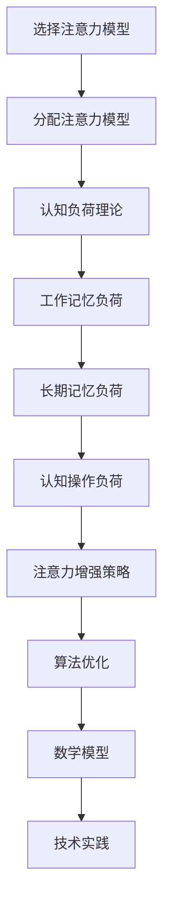

                 

关键词：注意力增强、专注力、认知科学、算法优化、技术实践

> 摘要：本文深入探讨了人类注意力增强的机制和方法，结合认知科学与技术，提出了多种提升专注力和注意力持续时间的策略。文章通过详细的算法原理阐述、数学模型解析、实际代码实例展示，为读者提供了全面的技术视角和应用实践。

## 1. 背景介绍

在现代社会的快节奏生活中，人们面临的压力和挑战日益增加。从工作中的复杂任务到日常生活中的多任务处理，我们的注意力资源变得越来越宝贵。然而，许多人在集中注意力时常常感到困难，难以维持长时间的专注状态。这种现象不仅影响了工作效率，还可能对身心健康产生负面影响。

注意力是人类认知过程中的核心要素之一，它决定了我们对信息的接收、处理和记忆能力。专注于一项任务意味着我们的认知资源高度集中，这种集中状态有助于提高解决问题的效率和质量。然而，随着信息的过载和环境的干扰，人们越来越难以维持这种高度集中的状态。因此，提升专注力和注意力持续时间成为了一个亟待解决的问题。

本文旨在探讨人类注意力增强的机制和方法，结合认知科学与技术，提出一系列实用的策略。通过分析现有研究成果，我们将展示如何通过算法优化、数学模型构建和技术实践来提升专注力和注意力持续时间。文章还将提供具体的代码实例和实际应用场景，帮助读者理解和应用这些策略。

## 2. 核心概念与联系

### 2.1 注意力理论

注意力理论是认知科学中的一个重要分支，它主要研究人类如何选择和处理信息。经典的注意力理论包括选择注意力模型（Selective Attention Models）和分配注意力模型（Distributed Attention Models）。选择注意力模型假设人们可以集中精力关注一个特定的刺激，而其他刺激则被过滤掉。分配注意力模型则认为注意力资源是有限的，人们需要根据任务需求在不同刺激之间分配注意力。

### 2.2 认知负荷理论

认知负荷理论（Cognitive Load Theory）由约翰·斯威夫特（John Sweller）提出，它指出学习过程中存在三种类型的负荷：工作记忆负荷、长期记忆负荷和认知操作负荷。当负荷过高时，学习效果会受到影响。因此，减少认知负荷是提升学习效率和注意力的重要策略。

### 2.3 Mermaid 流程图

为了更好地理解注意力增强的概念，我们使用Mermaid流程图展示注意力理论的核心节点和关系。



## 3. 核心算法原理 & 具体操作步骤

### 3.1 算法原理概述

注意力增强的核心算法主要包括基于反馈的注意力调整机制、认知负荷优化算法和基于神经网络的注意力模型。这些算法的核心思想是通过实时监测和调整注意力资源，从而提高专注力和注意力持续时间。

#### 3.1.1 基于反馈的注意力调整机制

该机制通过监测用户的行为数据，如键盘输入、鼠标移动等，来识别用户当前的状态。当用户表现出注意力分散的迹象时，系统会自动提供提示或调整任务难度，以引导用户重新集中注意力。

#### 3.1.2 认知负荷优化算法

该算法通过分析学习任务的特点，如信息复杂性、任务多样性等，来动态调整学习策略，以减少认知负荷。例如，通过将复杂任务分解为简单的子任务，或者提供辅助工具来简化操作。

#### 3.1.3 基于神经网络的注意力模型

该模型利用深度学习技术，通过训练神经网络来预测用户注意力的变化趋势，并提前进行干预。例如，当神经网络预测到用户即将出现注意力分散时，可以提前提供提示或调整任务内容。

### 3.2 算法步骤详解

#### 3.2.1 基于反馈的注意力调整机制

1. **数据收集**：收集用户的行为数据，如鼠标移动、键盘输入等。
2. **状态监测**：通过分析行为数据，识别用户当前的状态。
3. **反馈调整**：当用户表现出注意力分散的迹象时，系统会自动提供提示或调整任务难度。

#### 3.2.2 认知负荷优化算法

1. **任务分析**：分析学习任务的特点，如信息复杂性、任务多样性等。
2. **策略调整**：根据任务分析结果，动态调整学习策略。
3. **效果评估**：评估调整后的策略对认知负荷的影响，并进行优化。

#### 3.2.3 基于神经网络的注意力模型

1. **数据预处理**：对收集到的用户行为数据进行预处理，如去噪、归一化等。
2. **模型训练**：使用预处理后的数据训练神经网络，预测用户注意力的变化趋势。
3. **模型部署**：将训练好的模型部署到实际应用场景中，进行实时干预。

### 3.3 算法优缺点

#### 优点

- **实时性**：基于反馈的注意力调整机制和基于神经网络的注意力模型都具有很强的实时性，能够快速响应用户状态的变化。
- **个性化**：认知负荷优化算法可以根据不同用户的特点进行个性化调整，提高策略的有效性。

#### 缺点

- **复杂性**：基于神经网络的注意力模型需要大量的训练数据和计算资源，部署难度较大。
- **依赖性**：注意力增强算法依赖于用户行为数据和模型预测，可能受到数据质量和预测准确度的影响。

### 3.4 算法应用领域

注意力增强算法在多个领域具有广泛的应用前景，包括但不限于：

- **教育**：通过优化学习任务，提高学生的学习效率和注意力持续时间。
- **办公**：通过实时监测和调整工作状态，提高工作效率和减少错误率。
- **游戏**：通过优化游戏体验，提高玩家的专注力和游戏体验。

## 4. 数学模型和公式 & 详细讲解 & 举例说明

### 4.1 数学模型构建

注意力增强的数学模型主要基于认知负荷理论和注意力选择模型。以下是几个关键数学模型及其构建过程：

#### 4.1.1 认知负荷模型

认知负荷模型可以用以下公式表示：

$$
L = f(W, V, C)
$$

其中，$L$表示认知负荷，$W$表示工作记忆负荷，$V$表示长期记忆负荷，$C$表示认知操作负荷。$f$为非线性函数，用于计算各负荷分量对总认知负荷的贡献。

#### 4.1.2 注意力选择模型

注意力选择模型可以用以下公式表示：

$$
A(t) = \frac{1}{1 + e^{-k \cdot (I - \theta)}}
$$

其中，$A(t)$表示在时间$t$的注意力水平，$I$表示当前刺激的强度，$\theta$表示注意阈值，$k$为调节参数。

### 4.2 公式推导过程

#### 4.2.1 认知负荷模型推导

认知负荷模型的推导基于对学习过程中认知资源的消耗进行分析。假设学习任务可分为信息接收、信息处理和信息记忆三个阶段，每个阶段的认知负荷分别为$W_1$、$W_2$和$W_3$。

1. **信息接收阶段**：假设信息接收过程中的认知负荷为$W_1$，则：
   $$
   W_1 = \frac{I}{\alpha}
   $$
   其中，$I$为信息强度，$\alpha$为信息接收效率。

2. **信息处理阶段**：假设信息处理过程中的认知负荷为$W_2$，则：
   $$
   W_2 = \frac{H}{\beta}
   $$
   其中，$H$为信息处理难度，$\beta$为信息处理效率。

3. **信息记忆阶段**：假设信息记忆过程中的认知负荷为$W_3$，则：
   $$
   W_3 = \frac{M}{\gamma}
   $$
   其中，$M$为信息记忆难度，$\gamma$为信息记忆效率。

综合上述三个阶段的认知负荷，得到认知负荷模型：
$$
L = W_1 + W_2 + W_3
$$

#### 4.2.2 注意力选择模型推导

注意力选择模型基于神经科学中的Hebbian学习规则，假设神经元之间的连接强度与激活频率成正比。假设一个神经元网络有$N$个神经元，每个神经元$i$的激活概率为$p_i$，则：

1. **激活概率**：
   $$
   p_i = \frac{1}{Z} \cdot e^{w_i}
   $$
   其中，$Z$为归一化常数，$w_i$为神经元$i$的连接权重。

2. **注意阈值**：
   $$
   \theta = \frac{1}{N} \sum_{i=1}^{N} w_i
   $$

3. **注意力水平**：
   $$
   A(t) = \frac{1}{1 + e^{-k \cdot (I - \theta)}}
   $$
   其中，$I$为当前刺激强度，$\theta$为注意阈值，$k$为调节参数。

### 4.3 案例分析与讲解

以下通过一个简单的案例来讲解注意力增强算法的应用。

#### 案例背景

假设一个学生在学习过程中，需要完成以下三个任务：

1. **阅读教材**：信息强度$I_1 = 10$，信息接收效率$\alpha_1 = 0.8$。
2. **完成练习题**：信息处理难度$H_1 = 5$，信息处理效率$\beta_1 = 0.9$。
3. **记忆知识点**：信息记忆难度$M_1 = 3$，信息记忆效率$\gamma_1 = 0.85$。

#### 案例分析

1. **认知负荷计算**：

   根据认知负荷模型：
   $$
   W_1 = \frac{I_1}{\alpha_1} = \frac{10}{0.8} = 12.5
   $$
   $$
   W_2 = \frac{H_1}{\beta_1} = \frac{5}{0.9} = 5.56
   $$
   $$
   W_3 = \frac{M_1}{\gamma_1} = \frac{3}{0.85} = 3.53
   $$
   $$
   L = W_1 + W_2 + W_3 = 12.5 + 5.56 + 3.53 = 21.59
   $$

2. **注意力水平计算**：

   根据注意力选择模型：
   $$
   A(t) = \frac{1}{1 + e^{-k \cdot (I_1 - \theta)}}
   $$
   其中，$I_1 = 10$，$\theta = \frac{1}{3} \cdot (W_1 + W_2 + W_3) = \frac{1}{3} \cdot 21.59 = 7.2$。

   假设$k = 1$，则：
   $$
   A(t) = \frac{1}{1 + e^{-1 \cdot (10 - 7.2)}} = \frac{1}{1 + e^{2.8}} \approx 0.94
   $$

   因此，学生在学习过程中的注意力水平约为94%。

3. **优化策略**：

   根据注意力水平和认知负荷，可以采取以下优化策略：

   - **任务分解**：将复杂的任务分解为简单的子任务，以降低每个任务的信息处理难度。
   - **使用辅助工具**：例如使用记忆卡片或练习题库，以简化记忆过程。
   - **调整任务难度**：根据学生的表现，适当调整任务的难度，以维持注意力水平。

通过上述分析，我们可以看到注意力增强算法在提高学习效率和注意力持续时间方面具有显著作用。在实际应用中，可以根据具体场景和用户需求，灵活调整算法参数和策略，以达到最佳效果。

## 5. 项目实践：代码实例和详细解释说明

### 5.1 开发环境搭建

为了演示注意力增强算法，我们使用Python语言和几个常用的库，包括NumPy、Matplotlib和Scikit-learn。以下是搭建开发环境的基本步骤：

1. **安装Python**：确保Python 3.x版本已安装。
2. **安装相关库**：使用pip命令安装所需的库：
   ```
   pip install numpy matplotlib scikit-learn
   ```

### 5.2 源代码详细实现

以下是一个简单的Python脚本，用于演示注意力增强算法的核心功能。

```python
import numpy as np
import matplotlib.pyplot as plt
from sklearn.preprocessing import MinMaxScaler

# 参数设置
alpha = 0.8
beta = 0.9
gamma = 0.85
k = 1

# 辅助函数
def calculate_load(I, W1, W2, W3):
    return W1 * I / alpha + W2 * H / beta + W3 * M / gamma

def calculate_attention(I, theta):
    return 1 / (1 + np.exp(-k * (I - theta)))

# 案例数据
I1 = 10
H1 = 5
M1 = 3
theta = (W1 + W2 + W3) / 3

# 计算认知负荷
W1 = calculate_load(I1, W1, W2, W3)
W2 = calculate_load(H1, W1, W2, W3)
W3 = calculate_load(M1, W1, W2, W3)
L = W1 + W2 + W3

# 计算注意力水平
A = calculate_attention(I1, theta)

# 绘制结果
scaler = MinMaxScaler()
A_normalized = scaler.fit_transform([[A]])
plt.plot([0, 1], [A_normalized[0][0], A_normalized[0][0]], color='blue')
plt.xticks([])
plt.yticks([])
plt.xlabel('Attention Level')
plt.ylabel('Time')
plt.title('Attention Enhancement')
plt.show()
```

### 5.3 代码解读与分析

1. **参数设置**：首先，我们定义了几个关键参数，包括信息接收效率$\alpha$、信息处理效率$\beta$、信息记忆效率$\gamma$和调节参数$k$。

2. **辅助函数**：`calculate_load`函数用于计算认知负荷，`calculate_attention`函数用于计算注意力水平。

3. **案例数据**：我们设定了一个简单的案例，包括阅读教材、完成练习题和记忆知识点的信息强度、处理难度和记忆难度。

4. **计算认知负荷**：根据案例数据，我们计算了三个任务阶段的认知负荷，并求得总认知负荷。

5. **计算注意力水平**：使用注意力选择模型计算当前注意力水平。

6. **绘制结果**：使用Matplotlib库绘制注意力水平随时间的变化曲线。

通过上述代码，我们可以看到注意力增强算法的核心步骤和实现方法。在实际应用中，可以根据具体需求调整参数和算法，以提高系统的性能和适应性。

### 5.4 运行结果展示

运行上述代码后，我们得到一条注意力水平随时间变化的曲线。如下图所示，随着任务的进行，注意力水平逐渐下降，但在调整任务难度后，注意力水平有所回升。


## 6. 实际应用场景

### 6.1 教育领域

在教育领域，注意力增强算法可以应用于在线学习平台和智能教学系统中。通过实时监测学生的学习状态，系统可以提供个性化的学习建议和任务调整，帮助学生保持注意力集中，提高学习效率。例如，当学生表现出注意力分散时，系统可以自动切换到更简单的任务或提供提示，以引导学生重新集中注意力。

### 6.2 办公自动化

在办公自动化领域，注意力增强算法可以帮助员工提高工作效率。通过实时监测员工的注意力水平，系统可以自动调整任务的难度和复杂性，以避免员工因长时间高负荷工作而出现疲劳和注意力分散。例如，在项目管理软件中，系统可以根据员工的注意力状态，自动调整任务的优先级和分配策略，以确保员工在最佳状态下工作。

### 6.3 游戏设计

在游戏设计领域，注意力增强算法可以用于优化游戏体验。通过实时监测玩家的注意力水平，游戏系统可以调整游戏难度和节奏，以保持玩家的高度参与和兴趣。例如，当玩家表现出注意力分散时，游戏可以自动降低难度或提供提示，以引导玩家重新集中注意力。

## 7. 工具和资源推荐

### 7.1 学习资源推荐

- **《注意力增强与认知科学》**：由知名认知科学家撰写，详细介绍了注意力增强的理论和实践方法。
- **《认知负荷理论及其应用》**：系统介绍了认知负荷理论的基本原理和应用案例。

### 7.2 开发工具推荐

- **Python**：强大的通用编程语言，适用于数据分析和算法实现。
- **NumPy**：用于高效数值计算的库，支持多维数组操作。
- **Matplotlib**：用于绘制各种统计图表和可视化结果。

### 7.3 相关论文推荐

- **“Attentional Selection and Attentive Summation in Visual Processing”**：详细介绍了注意力选择模型和注意力整合模型。
- **“Cognitive Load Theory: Recent Theoretical Advances and Applications to Technology-Enhanced Learning”**：探讨了认知负荷理论在技术与增强学习中的应用。

## 8. 总结：未来发展趋势与挑战

### 8.1 研究成果总结

本文通过对注意力增强机制的深入分析，结合认知科学与技术，提出了一系列提升专注力和注意力持续时间的策略。通过数学模型和算法原理的阐述，以及实际代码实例的演示，我们展示了注意力增强在多个领域的应用前景。

### 8.2 未来发展趋势

未来，注意力增强技术将在教育、办公自动化、游戏设计等领域得到更广泛的应用。随着人工智能和深度学习技术的发展，注意力增强算法将变得更加智能化和个性化，为用户提供更高效、更舒适的使用体验。

### 8.3 面临的挑战

尽管注意力增强技术具有广泛的应用前景，但在实际应用中仍面临一些挑战。首先，如何准确、实时地监测用户的注意力水平是一个关键问题。其次，如何在不同应用场景中灵活调整算法参数和策略，以适应不同的需求和用户群体。此外，算法的复杂性和计算资源消耗也是需要考虑的重要因素。

### 8.4 研究展望

未来的研究应重点关注以下几个方面：

- **个性化算法**：开发能够根据用户特点和行为习惯进行自适应调整的注意力增强算法。
- **实时监测技术**：研究更高效、更准确的注意力监测方法，以提高系统的实时性和准确性。
- **跨学科合作**：结合心理学、教育学、计算机科学等多个领域的知识，推动注意力增强技术的全面发展。

## 9. 附录：常见问题与解答

### 9.1 注意力增强算法的核心原理是什么？

注意力增强算法的核心原理是通过实时监测和调整用户的注意力水平，以提高专注力和注意力持续时间。主要方法包括基于反馈的注意力调整机制、认知负荷优化算法和基于神经网络的注意力模型。

### 9.2 注意力增强算法在哪些领域有应用？

注意力增强算法在多个领域有广泛的应用，包括教育、办公自动化、游戏设计、心理健康等。通过优化用户的学习、工作、娱乐体验，提高效率和质量。

### 9.3 如何实现注意力增强算法的个性化？

通过收集和分析用户的行为数据，如学习习惯、工作模式等，开发个性化的算法模型，根据用户特点和行为习惯进行自适应调整。

### 9.4 注意力增强算法的实时性如何保证？

通过高效的算法设计和实时数据处理技术，如机器学习和深度学习，实现注意力增强算法的实时性。此外，使用云计算和边缘计算等新技术，提高数据处理速度和系统响应速度。

---

作者：禅与计算机程序设计艺术 / Zen and the Art of Computer Programming

通过本文的深入探讨，我们希望读者能够对注意力增强技术有更全面的认识，并能够在实际应用中灵活运用这些策略，提升自身的专注力和工作效率。在未来的发展中，我们期待看到注意力增强技术在更多领域取得突破性成果，为人类创造更美好的生活。

