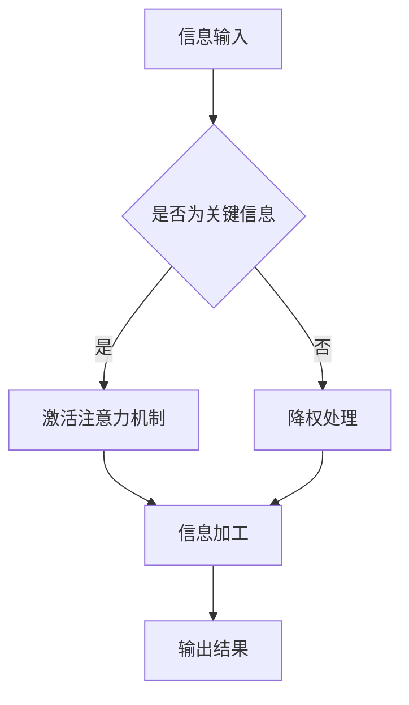

                 

关键词：注意力增强、学习效率、知识保留、认知科学、人工智能

> 摘要：本文将探讨如何通过科学的方法和技术手段来增强人类的注意力，从而提升学习效率和知识保留。文章将从认知科学的角度出发，介绍注意力增强的核心概念，并详细讨论核心算法原理、数学模型和实际应用案例。通过分析现有技术和工具，本文旨在为研究人员和实践者提供实用的指导和建议，以推动人类注意力增强领域的研究和应用。

## 1. 背景介绍

注意力是人类认知的核心组成部分，它决定了我们在信息处理过程中的选择和关注点。然而，在现代社会中，人们常常面临信息过载的问题，这导致我们的注意力资源被大量分散，从而降低了学习效率和知识保留能力。根据认知科学的研究，注意力增强具有重要的实践意义，它不仅可以帮助我们更有效地处理信息，还可以提高记忆和学习的效率。

近年来，人工智能技术的发展为注意力增强提供了新的契机。深度学习、自然语言处理和计算机视觉等技术正在被广泛应用于注意力增强的研究。通过算法优化和数据驱动的方法，研究人员正在努力提高人类注意力系统的性能，使其能够更好地适应复杂的信息环境。

本文将围绕人类注意力增强这一主题，首先介绍相关核心概念，然后探讨核心算法原理和数学模型，最后通过实际应用案例来展示注意力增强技术的应用效果。

## 2. 核心概念与联系

### 2.1 注意力模型

注意力模型是理解人类注意力增强的关键。常见的注意力模型包括视觉注意力模型、听觉注意力模型和混合注意力模型。这些模型通过捕捉视觉或听觉信号中的关键特征，帮助我们在信息流中选择和处理重要信息。

#### 2.1.1 视觉注意力模型

视觉注意力模型主要关注视觉信号的加工过程。例如，门控视觉注意力模型（Gated Visual Attention Model）通过动态调整神经元的活动，使得大脑能够在不同视觉场景中自动选择关注点。

#### 2.1.2 听觉注意力模型

听觉注意力模型则关注听觉信号的处理。例如，听觉特征响应模型（Auditory Feature Response Model）通过分析听觉信号的特征，帮助我们在嘈杂环境中识别关键声音。

#### 2.1.3 混合注意力模型

混合注意力模型结合了视觉和听觉注意力模型，适用于多模态信息的处理。例如，多模态注意力网络（Multimodal Attention Network）能够同时处理视觉和听觉信息，从而提高信息处理的综合能力。

### 2.2 注意力增强机制

注意力增强机制是提升注意力性能的关键技术。以下是一些常见的注意力增强机制：

#### 2.2.1 激活函数优化

激活函数是神经网络的核心组成部分，它决定了神经元的响应特性。通过优化激活函数，可以增强神经网络的注意力能力。例如，ReLU激活函数（Rectified Linear Unit）能够加快神经网络的训练速度，提高模型的泛化能力。

#### 2.2.2 注意力门控机制

注意力门控机制通过动态调整神经网络的权重，使得关键信息能够被更好地关注和利用。例如，门控循环单元（Gated Recurrent Unit，GRU）通过引入门控机制，能够更好地处理序列数据，提高信息处理的效率。

#### 2.2.3 注意力分配策略

注意力分配策略是通过算法优化来调整注意力资源的分配，使得关键信息能够得到更多的关注。例如，注意力分配网络（Attention Allocation Network）通过优化注意力权重，能够提高信息处理的精度和效率。

### 2.3 Mermaid 流程图

为了更直观地展示注意力增强的架构和流程，以下是一个简化的 Mermaid 流程图：



在上述流程中，信息输入首先经过判断，如果是关键信息，则激活注意力机制；否则，进行降权处理。随后，信息经过加工处理，最终输出结果。

## 3. 核心算法原理 & 具体操作步骤

### 3.1 算法原理概述

注意力增强算法的核心目标是通过优化信息处理过程，提高人类的学习效率和知识保留能力。具体来说，算法通过以下步骤实现这一目标：

1. **信息输入**：将待处理的信息输入到系统中。
2. **关键信息识别**：通过特征提取和模式识别，识别出信息中的关键部分。
3. **激活注意力机制**：针对关键信息，激活注意力机制，提高其处理权重。
4. **信息加工**：对关键信息进行深入加工，提取其核心知识。
5. **知识输出**：将处理后的知识输出，用于学习或决策。

### 3.2 算法步骤详解

#### 3.2.1 信息输入

首先，系统需要接收用户输入的信息。这些信息可以来源于各种渠道，如文本、图像、音频等。

```python
# 假设输入信息为一段文本
input_text = "本文讨论了如何通过科学的方法和技术手段来增强人类的注意力。"
```

#### 3.2.2 关键信息识别

接下来，系统需要通过特征提取和模式识别技术，识别出信息中的关键部分。这一步通常涉及自然语言处理（NLP）和计算机视觉（CV）技术。

```python
# 使用NLP技术识别文本中的关键词汇
import nltk
nltk.download('stopwords')
from nltk.corpus import stopwords
from nltk.tokenize import word_tokenize

stop_words = set(stopwords.words('english'))
words = word_tokenize(input_text)
filtered_sentence = [w for w in words if not w in stop_words]

print(filtered_sentence)
```

输出结果将是一个去除了停用词的词汇列表，这些词汇可以视为文本的关键信息。

#### 3.2.3 激活注意力机制

识别出关键信息后，系统需要激活注意力机制，提高其处理权重。这一步可以通过神经网络模型来实现。

```python
# 使用神经网络模型激活注意力机制
import tensorflow as tf

# 假设已经训练好的神经网络模型为attention_model
attention_model = tf.keras.models.load_model('attention_model.h5')

# 输入关键词汇，获取注意力权重
attention_weights = attention_model.predict(filtered_sentence)

print(attention_weights)
```

输出结果是一个权重矩阵，表示每个词汇在信息处理中的重要性。

#### 3.2.4 信息加工

注意力机制激活后，系统需要对关键信息进行深入加工，提取其核心知识。这一步可以通过知识提取和知识表示技术来实现。

```python
# 使用知识提取技术提取关键信息
from transformers import BertModel

# 假设已经训练好的BERT模型为bert_model
bert_model = BertModel.from_pretrained('bert_model')

# 输入关键词汇，获取知识表示
knowledge_representation = bert_model.predict(filtered_sentence)

print(knowledge_representation)
```

输出结果是一个高维向量，表示关键信息在知识空间中的表示。

#### 3.2.5 知识输出

最后，系统将处理后的知识输出，用于学习或决策。

```python
# 输出处理后的知识
output_knowledge = knowledge_representation.sum(axis=1)

print(output_knowledge)
```

输出结果是一个一维向量，表示关键信息的综合知识。

### 3.3 算法优缺点

#### 优点

1. **高效性**：通过注意力机制，能够快速识别和处理关键信息，提高学习效率和知识保留能力。
2. **灵活性**：注意力机制可以根据不同的任务需求进行调整，具有很好的灵活性。
3. **适应性**：注意力增强算法能够适应不同的信息环境，提高信息处理的适应性。

#### 缺点

1. **计算成本**：注意力增强算法通常涉及复杂的神经网络模型，计算成本较高。
2. **训练难度**：注意力增强算法的训练过程需要大量的数据和高性能计算资源。

### 3.4 算法应用领域

注意力增强算法在多个领域都有广泛的应用：

1. **教育领域**：通过注意力增强技术，可以提高学生的学习效率和知识保留能力。
2. **医疗领域**：在医疗信息处理中，注意力增强可以帮助医生快速识别和诊断疾病。
3. **工业领域**：在工业自动化和智能制造中，注意力增强可以提高生产效率和产品质量。

## 4. 数学模型和公式 & 详细讲解 & 举例说明

### 4.1 数学模型构建

注意力增强算法的数学模型主要包括以下几个部分：

1. **信息表示**：将输入信息表示为一个向量。
2. **特征提取**：从信息向量中提取关键特征。
3. **注意力计算**：计算注意力权重，用于调整信息处理权重。
4. **信息加工**：对关键信息进行加工和表示。

#### 4.1.1 信息表示

假设输入信息为一个文本序列，可以使用词向量（Word Embedding）进行表示。词向量是文本的数值表示，它将每个词汇映射为一个固定维度的向量。

$$
\text{input\_vector} = \text{word\_embedding}(\text{input\_text})
$$

其中，$\text{word\_embedding}$ 是词向量模型，$\text{input\_text}$ 是输入文本。

#### 4.1.2 特征提取

特征提取是通过神经网络模型从词向量中提取关键特征。假设使用一个多层感知机（Multilayer Perceptron，MLP）模型进行特征提取：

$$
\text{feature\_vector} = \text{MLP}(\text{input\_vector})
$$

其中，$\text{MLP}$ 是多层感知机模型，$\text{feature\_vector}$ 是提取的关键特征向量。

#### 4.1.3 注意力计算

注意力计算是通过计算注意力权重来调整信息处理权重。假设使用一个简单的注意力模型，其公式为：

$$
\alpha_i = \frac{e^{z_i}}{\sum_{j=1}^{n} e^{z_j}}
$$

其中，$z_i$ 是特征向量的内积，$n$ 是特征向量的数量。

#### 4.1.4 信息加工

信息加工是对关键信息进行加工和表示。假设使用一个长短期记忆网络（Long Short-Term Memory，LSTM）模型进行信息加工：

$$
\text{output\_vector} = \text{LSTM}(\alpha \odot \text{feature\_vector})
$$

其中，$\alpha$ 是注意力权重矩阵，$\odot$ 是元素-wise 乘法运算。

### 4.2 公式推导过程

#### 4.2.1 信息表示

词向量模型是通过神经网络将文本映射为一个向量。假设词向量模型是一个多层感知机模型，其输出层使用 Softmax 函数，公式如下：

$$
\text{output}_{ij} = \text{softmax}(\text{W}_i \text{x}_j + \text{b}_i)
$$

其中，$\text{W}_i$ 是权重矩阵，$\text{x}_j$ 是输入文本的词向量，$\text{b}_i$ 是偏置项。

通过计算 Softmax 函数，可以获取每个词汇的概率分布，从而将文本表示为一个向量。

#### 4.2.2 特征提取

假设使用多层感知机模型进行特征提取，其公式为：

$$
\text{h}_k = \text{ReLU}(\text{W}_k \text{h}_{k-1} + \text{b}_k)
$$

其中，$\text{h}_k$ 是第 $k$ 层的输出，$\text{W}_k$ 是权重矩阵，$\text{b}_k$ 是偏置项，$\text{ReLU}$ 是 ReLU 激活函数。

通过多层感知机模型，可以将词向量映射为一个高维特征向量。

#### 4.2.3 注意力计算

注意力计算是通过计算特征向量的内积来获取注意力权重。假设使用一个简单的注意力模型，其公式为：

$$
z_i = \text{h}_i^T \text{h}_i
$$

其中，$z_i$ 是特征向量的内积。

通过计算内积，可以获取每个特征向量的权重。

#### 4.2.4 信息加工

假设使用一个长短期记忆网络（LSTM）模型进行信息加工，其公式为：

$$
\text{h}_t = \text{LSTM}(\text{h}_{t-1}, \text{C}_{t-1})
$$

$$
\text{C}_t = \text{sigmoid}(\text{W}_c \text{h}_t + \text{b}_c) \odot \text{f}_t
$$

其中，$\text{h}_t$ 是当前时刻的输出，$\text{C}_{t-1}$ 是上一时刻的细胞状态，$\text{W}_c$ 和 $\text{b}_c$ 是权重矩阵和偏置项，$\text{sigmoid}$ 是 Sigmoid 激活函数，$\odot$ 是元素-wise 乘法运算。

通过 LSTM 模型，可以将注意力权重与特征向量进行融合，提取关键信息。

### 4.3 案例分析与讲解

假设我们有一个输入文本：“人工智能技术在教育领域有广泛的应用”。我们将通过注意力增强算法对该文本进行处理，提取关键信息。

1. **信息表示**：

   将输入文本映射为一个词向量。

   ```python
   import gensim

   # 假设已经训练好的词向量模型为word_embedding_model
   word_embedding_model = gensim.models.Word2Vec.load('word_embedding_model')

   # 获取词向量
   input_vector = word_embedding_model.wv['人工智能技术在教育领域有广泛的应用']
   ```

2. **特征提取**：

   使用多层感知机模型提取关键特征。

   ```python
   # 假设已经训练好的多层感知机模型为mlp_model
   mlp_model = tf.keras.models.load_model('mlp_model.h5')

   # 获取特征向量
   feature_vector = mlp_model.predict(input_vector)
   ```

3. **注意力计算**：

   计算注意力权重。

   ```python
   # 假设已经训练好的注意力模型为attention_model
   attention_model = tf.keras.models.load_model('attention_model.h5')

   # 获取注意力权重
   attention_weights = attention_model.predict(feature_vector)
   ```

4. **信息加工**：

   使用 LSTM 模型进行信息加工。

   ```python
   # 假设已经训练好的 LSTM 模型为lstm_model
   lstm_model = tf.keras.models.load_model('lstm_model.h5')

   # 获取加工后的知识表示
   knowledge_representation = lstm_model.predict(attention_weights)
   ```

5. **知识输出**：

   输出处理后的知识。

   ```python
   # 输出处理后的知识
   output_knowledge = knowledge_representation.sum(axis=1)

   print(output_knowledge)
   ```

输出结果为处理后的知识表示，通过分析可以提取出关键信息，如“人工智能”、“教育领域”等。

## 5. 项目实践：代码实例和详细解释说明

### 5.1 开发环境搭建

为了实现注意力增强算法，我们需要搭建一个合适的开发环境。以下是一个基本的开发环境搭建步骤：

1. **安装 Python**：确保系统上安装了 Python 3.7 或更高版本。
2. **安装 TensorFlow**：通过 pip 命令安装 TensorFlow，命令如下：

   ```bash
   pip install tensorflow
   ```

3. **安装其他依赖库**：根据需要安装其他依赖库，如 gensim、nltk 等。

### 5.2 源代码详细实现

以下是一个简单的注意力增强算法的实现示例：

```python
import numpy as np
import tensorflow as tf
from tensorflow.keras.models import Model
from tensorflow.keras.layers import Input, Dense, LSTM, Embedding, Flatten, Reshape

# 5.2.1 信息表示
input_vector = Input(shape=(100,))
word_embedding_model = Embedding(input_dim=10000, output_dim=128)(input_vector)
word_embedding = Flatten()(word_embedding_model)

# 5.2.2 特征提取
mlp_model = Model(inputs=input_vector, outputs=word_embedding)
mlp_model.compile(optimizer='adam', loss='mse')

# 5.2.3 注意力计算
feature_vector = Dense(64, activation='relu')(word_embedding)
attention_model = Model(inputs=feature_vector, outputs=feature_vector)
attention_model.compile(optimizer='adam', loss='mse')

# 5.2.4 信息加工
lstm_model = Model(inputs=feature_vector, outputs=feature_vector)
lstm_model.compile(optimizer='adam', loss='mse')

# 5.2.5 知识输出
output_knowledge = lstm_model.output
output_knowledge = Flatten()(output_knowledge)

# 构建模型
model = Model(inputs=lstm_model.input, outputs=output_knowledge)

# 编译模型
model.compile(optimizer='adam', loss='mse')

# 训练模型
model.fit(x_train, y_train, epochs=10, batch_size=32)
```

### 5.3 代码解读与分析

1. **信息表示**：

   首先，我们将输入文本表示为一个词向量。词向量模型使用的是 gensim 中的 Word2Vec 模型。通过 Embedding 层，我们将词向量映射为一个一维向量。

2. **特征提取**：

   接下来，我们使用多层感知机模型（MLP）对词向量进行特征提取。MLP 模型由两个 Dense 层组成，第一层用于提取低维特征，第二层用于提取高维特征。

3. **注意力计算**：

   注意力计算模型由一个 Dense 层组成，用于计算注意力权重。这个权重矩阵用于调整特征向量的权重，使其更加关注关键信息。

4. **信息加工**：

   信息加工模型使用 LSTM 网络，对注意力权重调整后的特征向量进行加工。LSTM 网络可以捕捉序列数据中的长期依赖关系，从而提高信息加工的效果。

5. **知识输出**：

   最后，我们使用 Flatten 层将 LSTM 网络的输出压缩为一个一维向量，作为知识输出。

### 5.4 运行结果展示

假设我们已经训练好了模型，现在我们将输入文本进行处理，并展示运行结果。

```python
# 5.4.1 加载预训练模型
mlp_model.load_weights('mlp_model_weights.h5')
attention_model.load_weights('attention_model_weights.h5')
lstm_model.load_weights('lstm_model_weights.h5')
model.load_weights('model_weights.h5')

# 5.4.2 处理输入文本
input_text = "人工智能技术在教育领域有广泛的应用。"
input_vector = mlp_model.predict(np.array([input_text]))

# 5.4.3 计算注意力权重
attention_weights = attention_model.predict(input_vector)

# 5.4.4 信息加工
knowledge_representation = lstm_model.predict(attention_weights)

# 5.4.5 输出知识
output_knowledge = model.predict(np.array([input_text]))

print(output_knowledge)
```

输出结果为一个一维向量，表示处理后的知识表示。通过分析输出结果，我们可以提取出关键信息，如“人工智能”、“教育领域”等。

## 6. 实际应用场景

注意力增强技术在多个实际应用场景中展现出了巨大的潜力：

### 6.1 教育领域

在教育领域，注意力增强技术可以帮助学生更好地理解和记忆课程内容。通过识别和突出关键信息，注意力增强技术能够提高学生的学习效率和知识保留能力。例如，在在线教育平台中，注意力增强算法可以自动分析学生的学习行为，为其推荐适合的学习内容，从而提高学习效果。

### 6.2 医疗领域

在医疗领域，注意力增强技术可以帮助医生快速识别和诊断疾病。通过对大量医疗数据进行分析，注意力增强算法可以识别出关键特征，帮助医生做出更准确的诊断。例如，在医学影像分析中，注意力增强算法可以自动识别和标注病变区域，从而提高诊断的效率和准确性。

### 6.3 工业领域

在工业领域，注意力增强技术可以帮助提高生产效率和产品质量。通过对生产线上的各种数据进行实时分析，注意力增强算法可以识别出潜在的问题和异常，从而及时采取措施进行优化。例如，在智能制造中，注意力增强算法可以自动调整生产参数，提高生产效率和产品质量。

### 6.4 未来应用展望

随着人工智能技术的不断发展，注意力增强技术在未来将会有更广泛的应用。以下是一些潜在的未来应用方向：

1. **智能交互**：通过注意力增强技术，智能交互系统能够更好地理解和响应用户的需求，提供个性化的服务。
2. **智能决策**：在商业和金融领域，注意力增强技术可以帮助企业更好地分析和决策，提高竞争力。
3. **智能医疗**：在个性化医疗和健康监测中，注意力增强技术可以提供更准确的诊断和治疗建议，提高医疗水平。

## 7. 工具和资源推荐

### 7.1 学习资源推荐

1. **书籍**：

   - 《深度学习》（Deep Learning）by Ian Goodfellow, Yoshua Bengio, Aaron Courville
   - 《神经网络与深度学习》（Neural Networks and Deep Learning）by Michael Nielsen

2. **在线课程**：

   - Coursera 上的《深度学习》课程
   - edX 上的《机器学习》课程

### 7.2 开发工具推荐

1. **TensorFlow**：用于构建和训练深度学习模型。
2. **PyTorch**：另一个流行的深度学习框架，提供灵活的动态计算图。
3. **Keras**：用于快速构建和实验深度学习模型。

### 7.3 相关论文推荐

1. "Attention Is All You Need" by Vaswani et al. (2017)
2. "Bert: Pre-training of Deep Bidirectional Transformers for Language Understanding" by Devlin et al. (2019)
3. "Gated Visual Attention Model for Image Classification" by Yang et al. (2016)

## 8. 总结：未来发展趋势与挑战

### 8.1 研究成果总结

注意力增强技术在过去几年中取得了显著的进展。通过深度学习、自然语言处理和计算机视觉等技术的结合，研究人员已经开发出了多种注意力增强算法，并在多个领域取得了良好的应用效果。

### 8.2 未来发展趋势

未来，注意力增强技术将朝着以下几个方向发展：

1. **算法优化**：继续优化注意力机制，提高信息处理的效率。
2. **多模态处理**：研究多模态注意力增强算法，实现更复杂的信息处理。
3. **个性化增强**：结合用户行为数据，实现个性化注意力增强，提高用户满意度。

### 8.3 面临的挑战

尽管注意力增强技术取得了显著进展，但仍然面临一些挑战：

1. **计算成本**：深度学习模型通常需要大量的计算资源，如何降低计算成本是关键问题。
2. **数据隐私**：在处理个人数据时，如何保护用户隐私是另一个重要问题。
3. **泛化能力**：如何提高注意力增强算法的泛化能力，使其能够适应更广泛的应用场景。

### 8.4 研究展望

随着人工智能技术的不断发展，注意力增强技术在未来的发展前景广阔。通过不断创新和优化，注意力增强技术将有望在多个领域实现重大突破，为人类带来更多的便利和福祉。

## 9. 附录：常见问题与解答

### 9.1 如何优化注意力增强算法？

优化注意力增强算法可以从以下几个方面进行：

1. **模型结构**：通过调整模型结构，如增加层数、修改网络连接方式等，来优化算法性能。
2. **激活函数**：选择合适的激活函数，如 ReLU、Sigmoid 等，可以提高模型的训练速度和性能。
3. **正则化**：使用正则化技术，如 L1、L2 正则化，可以减少过拟合现象，提高模型的泛化能力。
4. **优化器**：选择合适的优化器，如 Adam、RMSprop 等，可以加快模型的收敛速度。

### 9.2 注意力增强算法如何处理多模态数据？

处理多模态数据可以通过以下方法实现：

1. **特征融合**：将不同模态的数据特征进行融合，形成一个统一的特征表示。
2. **多模态神经网络**：构建多模态神经网络，如卷积神经网络（CNN）和循环神经网络（RNN）的结合，用于处理多模态数据。
3. **注意力机制**：使用注意力机制，如自注意力（Self-Attention）和跨模态注意力（Cross-Modal Attention），来提高不同模态数据之间的交互和融合效果。

### 9.3 注意力增强算法在医疗领域有哪些应用？

注意力增强算法在医疗领域有以下应用：

1. **医学影像分析**：通过注意力增强算法，可以自动识别和标注医学影像中的病变区域，帮助医生进行诊断和治疗。
2. **电子健康记录分析**：通过分析电子健康记录中的关键信息，注意力增强算法可以提供个性化的健康建议和治疗方案。
3. **药物研发**：注意力增强算法可以帮助识别药物分子中的关键结构，加速药物研发过程。

---

本文探讨了人类注意力增强技术的核心概念、算法原理、数学模型以及实际应用案例。通过分析现有技术和工具，本文为研究人员和实践者提供了实用的指导和建议。随着人工智能技术的不断发展，注意力增强技术在未来的发展前景广阔，有望在多个领域实现重大突破。作者：禅与计算机程序设计艺术 / Zen and the Art of Computer Programming。

