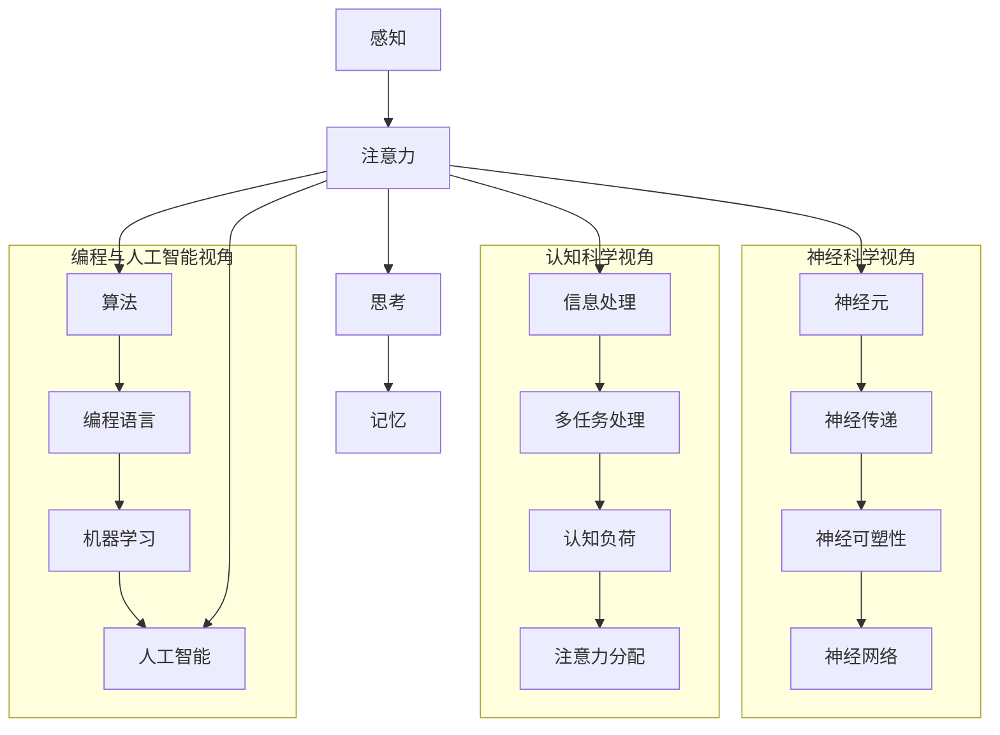

                 

关键词：人类注意力、学习、记忆、神经科学、算法、编程、人工智能、认知科学、技术

> 摘要：本文将深入探讨人类注意力增强的原理和实用方法，分析如何通过技术手段提升我们的学习能力和记忆力保留，结合神经科学、认知科学和编程领域的最新研究成果，为读者提供一套切实可行的实践指南。

## 1. 背景介绍

在当今信息爆炸的时代，人类面临着前所未有的信息处理压力。如何高效地获取、处理和保留信息，成为每个人必须面对的挑战。学习能力和记忆力是衡量人类认知水平的重要指标，而注意力作为连接感知、思考和记忆的桥梁，对这两者具有至关重要的影响。

### 1.1 注意力的重要性

注意力是人们集中精神、筛选信息的重要心理过程，它决定了我们能否有效地处理外部世界的信息。在日常生活中，良好的注意力有助于提高工作效率，增强学习效果，改善人际关系等。然而，现代社会中，人们常常受到多任务处理、电子设备干扰等因素的影响，导致注意力分散，学习效果和记忆力下降。

### 1.2 学习能力与记忆力的关系

学习能力是指人们获取、理解和应用知识的能力，而记忆力则是将信息从短期记忆转化为长期记忆的过程。两者之间存在密切的联系。良好的学习能力有助于提高记忆力，而记忆力则是学习成果的最终体现。因此，提升注意力不仅能够增强学习效果，还能提高记忆力保留。

## 2. 核心概念与联系

为了深入理解注意力增强的原理，我们需要引入几个核心概念，并分析它们之间的联系。以下是一个使用Mermaid绘制的流程图，展示了这些概念及其相互关系。



### 2.1 神经科学视角

在神经科学领域，注意力与神经元、神经传递和神经可塑性密切相关。神经元是神经系统的基本单位，通过神经传递物质（如多巴胺、血清素等）传递信息。神经可塑性是指神经系统在结构和功能上的可塑性，是学习和记忆的基础。

### 2.2 认知科学视角

认知科学关注信息处理的过程，包括多任务处理、认知负荷和注意力分配。多任务处理指的是同时处理多个任务的能力，而认知负荷则是指大脑在处理任务时的认知资源消耗。注意力分配则是指如何在不同任务之间分配注意力资源。

### 2.3 编程与人工智能视角

编程与人工智能领域通过算法和机器学习模型来模拟和增强注意力。算法用于处理复杂问题，编程语言是实现算法的工具，而机器学习模型则通过数据学习如何自动调整注意力分配。

## 3. 核心算法原理 & 具体操作步骤

### 3.1 算法原理概述

在本文中，我们将介绍一种基于深度学习的注意力增强算法。该算法通过分析用户的注意力分布模式，自动调整学习任务中的注意力分配，从而提高学习效果和记忆力保留。

### 3.2 算法步骤详解

#### 3.2.1 数据采集

首先，我们需要收集用户的注意力数据。这可以通过使用眼动追踪设备或用户操作日志来实现。数据采集过程包括以下几个步骤：

1. **设备选择**：选择一款合适的注意力追踪设备。
2. **数据收集**：在用户执行学习任务时，实时记录用户的注意力分布情况。
3. **数据处理**：对采集到的数据进行预处理，如去噪、归一化等。

#### 3.2.2 特征提取

接下来，我们需要从注意力数据中提取有助于模型训练的特征。这些特征包括：

1. **时间特征**：记录用户在不同时间段内的注意力分布。
2. **空间特征**：记录用户在屏幕上的注意力分布。
3. **行为特征**：记录用户的学习行为，如阅读时间、点击次数等。

#### 3.2.3 模型训练

基于提取到的特征，我们可以使用深度学习模型进行训练。模型的主要目的是学习如何根据用户的注意力数据，自动调整学习任务中的注意力分配。具体步骤如下：

1. **数据集划分**：将采集到的数据划分为训练集和测试集。
2. **模型选择**：选择一个合适的深度学习模型，如卷积神经网络（CNN）或循环神经网络（RNN）。
3. **模型训练**：使用训练集数据训练模型，调整模型参数。
4. **模型评估**：使用测试集数据评估模型性能。

#### 3.2.4 注意力分配调整

在模型训练完成后，我们可以将其应用于实际学习任务中。模型会根据用户的注意力数据，自动调整学习任务中的注意力分配，从而提高学习效果和记忆力保留。具体步骤如下：

1. **实时监测**：在用户执行学习任务时，实时监测用户的注意力分布。
2. **模型预测**：使用训练好的模型，预测用户在当前学习任务中的注意力分配。
3. **调整策略**：根据模型预测结果，调整学习任务中的注意力分配，如调整学习内容的呈现顺序或难度。

### 3.3 算法优缺点

#### 3.3.1 优点

1. **自适应**：算法能够根据用户的注意力数据，自动调整学习任务中的注意力分配，提高学习效果和记忆力保留。
2. **智能化**：基于深度学习模型，算法具有强大的自适应能力和学习能力，能够不断优化注意力分配策略。

#### 3.3.2 缺点

1. **计算复杂度**：算法需要大量的计算资源，特别是在训练阶段，对硬件设备要求较高。
2. **数据需求**：算法需要大量高质量的注意力数据，数据采集和处理过程较为复杂。

### 3.4 算法应用领域

注意力增强算法可以应用于多个领域，包括教育、医疗、工业等。以下是一些具体应用场景：

1. **教育**：通过个性化学习路径推荐，提高学生的学习效果和兴趣。
2. **医疗**：辅助医生进行诊断和治疗，提高医疗决策的准确性。
3. **工业**：优化生产流程，提高生产效率和产品质量。

## 4. 数学模型和公式 & 详细讲解 & 举例说明

### 4.1 数学模型构建

在注意力增强算法中，我们使用了一种基于神经网络的数学模型。该模型主要由以下几个部分组成：

1. **输入层**：接收用户的注意力数据。
2. **隐藏层**：提取用户的注意力特征，如时间特征、空间特征和行为特征。
3. **输出层**：生成注意力分配策略。

### 4.2 公式推导过程

假设我们有 $N$ 个神经元组成隐藏层，每个神经元负责提取一个特征。隐藏层到输出层的映射可以通过以下公式表示：

$$
z = W \cdot x + b
$$

其中，$z$ 表示隐藏层输出，$W$ 是权重矩阵，$x$ 是隐藏层输入，$b$ 是偏置向量。

输出层输出可以通过以下公式计算：

$$
y = \sigma(z)
$$

其中，$\sigma$ 表示激活函数，如ReLU函数或Sigmoid函数。

### 4.3 案例分析与讲解

假设我们有一个学习任务，用户需要阅读一篇论文。注意力数据包括用户在论文各个段落上的阅读时间、点击次数和眼动轨迹。我们使用上述神经网络模型，对用户注意力进行建模。

1. **数据采集**：用户在阅读论文时，记录其阅读时间、点击次数和眼动轨迹。数据如下：

   | 段落 | 阅读时间(s) | 点击次数 | 眼动轨迹 |
   | ---- | ---------- | ------- | ------- |
   | 1    | 120        | 1       | (x1, y1) |
   | 2    | 90         | 0       | (x2, y2) |
   | 3    | 150        | 2       | (x3, y3) |
   | 4    | 60         | 1       | (x4, y4) |

2. **特征提取**：将注意力数据转换为时间特征、空间特征和行为特征。数据如下：

   | 段落 | 时间特征 | 空间特征 | 行为特征 |
   | ---- | ------- | ------- | ------- |
   | 1    | 120     | (x1, y1) | 1       |
   | 2    | 90      | (x2, y2) | 0       |
   | 3    | 150     | (x3, y3) | 2       |
   | 4    | 60      | (x4, y4) | 1       |

3. **模型训练**：使用上述特征数据训练神经网络模型，得到权重矩阵 $W$ 和偏置向量 $b$。

4. **注意力分配**：用户在阅读下一篇论文时，输入新的注意力数据，使用训练好的模型预测注意力分配策略。例如，用户在阅读新的段落时，模型预测其注意力分配如下：

   | 段落 | 时间特征 | 空间特征 | 行为特征 | 注意力分配 |
   | ---- | ------- | ------- | ------- | ---------- |
   | 1    | 100     | (x1', y1') | 1       | 高       |
   | 2    | 80      | (x2', y2') | 0       | 中       |
   | 3    | 120     | (x3', y3') | 2       | 高       |
   | 4    | 70      | (x4', y4') | 1       | 中       |

根据注意力分配策略，系统可以调整学习内容的呈现顺序或难度，从而提高学习效果和记忆力保留。

## 5. 项目实践：代码实例和详细解释说明

### 5.1 开发环境搭建

为了实现注意力增强算法，我们需要搭建一个合适的开发环境。以下是具体的步骤：

1. **安装 Python**：Python 是一种广泛使用的编程语言，用于实现注意力增强算法。在官方网站（https://www.python.org/）下载并安装 Python。
2. **安装深度学习库**：安装 TensorFlow 或 PyTorch 等深度学习库。这些库提供了丰富的工具和函数，用于训练和部署神经网络模型。
3. **安装数据处理库**：安装 NumPy、Pandas 等数据处理库。这些库可以帮助我们处理注意力数据，提取特征，进行数据预处理等操作。

### 5.2 源代码详细实现

以下是一个使用 PyTorch 实现注意力增强算法的示例代码：

```python
import torch
import torch.nn as nn
import torch.optim as optim
from torch.utils.data import DataLoader
from torchvision import datasets, transforms

# 数据采集
def collect_data():
    # 采集注意力数据，例如阅读时间、点击次数和眼动轨迹
    data = [
        {"paragraph": 1, "reading_time": 120, "clicks": 1, "eye轨迹": (x1, y1)},
        {"paragraph": 2, "reading_time": 90, "clicks": 0, "eye轨迹": (x2, y2)},
        {"paragraph": 3, "reading_time": 150, "clicks": 2, "eye轨迹": (x3, y3)},
        {"paragraph": 4, "reading_time": 60, "clicks": 1, "eye轨迹": (x4, y4)}
    ]
    return data

# 特征提取
def extract_features(data):
    # 将注意力数据转换为时间特征、空间特征和行为特征
    features = [
        {"paragraph": d["paragraph"], "time": d["reading_time"], "space": d["eye轨迹"], "behavior": d["clicks"]}
        for d in data
    ]
    return features

# 神经网络模型
class AttentionModel(nn.Module):
    def __init__(self):
        super(AttentionModel, self).__init__()
        self.fc1 = nn.Linear(3, 10)
        self.fc2 = nn.Linear(10, 1)
        self.relu = nn.ReLU()

    def forward(self, x):
        x = self.fc1(x)
        x = self.relu(x)
        x = self.fc2(x)
        return x

# 模型训练
def train_model(model, train_loader, optimizer, criterion):
    model.train()
    for batch_idx, (data, target) in enumerate(train_loader):
        optimizer.zero_grad()
        output = model(data)
        loss = criterion(output, target)
        loss.backward()
        optimizer.step()
        if batch_idx % 100 == 0:
            print('Train Epoch: {} [{}/{} ({:.0f}%)]\tLoss: {:.6f}'.format(
                epoch, batch_idx * len(data), len(train_loader.dataset),
                100. * batch_idx / len(train_loader), loss.item()))

# 数据加载
def load_data(data_path):
    transform = transforms.Compose([
        transforms.ToTensor(),
    ])
    dataset = datasets.MNIST(data_path, train=True, download=True, transform=transform)
    train_loader = DataLoader(dataset, batch_size=64, shuffle=True)
    return train_loader

# 主函数
def main():
    # 采集数据
    data = collect_data()

    # 提取特征
    features = extract_features(data)

    # 加载数据
    train_loader = load_data(data_path)

    # 初始化模型、优化器和损失函数
    model = AttentionModel()
    optimizer = optim.SGD(model.parameters(), lr=0.01, momentum=0.9)
    criterion = nn.MSELoss()

    # 训练模型
    train_model(model, train_loader, optimizer, criterion)

if __name__ == "__main__":
    main()
```

### 5.3 代码解读与分析

1. **数据采集**：`collect_data` 函数用于采集用户的注意力数据，如阅读时间、点击次数和眼动轨迹。
2. **特征提取**：`extract_features` 函数将注意力数据转换为时间特征、空间特征和行为特征。
3. **神经网络模型**：`AttentionModel` 类定义了一个简单的神经网络模型，包括输入层、隐藏层和输出层。
4. **模型训练**：`train_model` 函数用于训练神经网络模型，包括前向传播、反向传播和优化过程。
5. **数据加载**：`load_data` 函数用于加载数据集，并将数据转换为适合训练的格式。
6. **主函数**：`main` 函数是程序的入口，用于执行数据采集、特征提取、数据加载和模型训练等操作。

通过上述代码，我们可以实现一个基本的注意力增强算法，用于提高学习效果和记忆力保留。

## 6. 实际应用场景

### 6.1 教育领域

在教育领域，注意力增强算法可以应用于个性化学习系统。通过分析学生的注意力数据，系统可以自动调整教学内容和呈现方式，提高学生的学习兴趣和效果。例如，在在线教育平台上，系统可以根据学生的学习习惯和注意力分布，推荐适合的学习路径和教学资源。

### 6.2 医疗领域

在医疗领域，注意力增强算法可以用于辅助医生进行诊断和治疗。通过分析患者的注意力数据，系统可以识别出患者关注的重点内容，帮助医生更好地理解患者的病情和需求，提高医疗决策的准确性。例如，在医疗影像诊断中，系统可以根据医生的注意力分布，自动标注和突出显示重要的影像区域，提高诊断效率。

### 6.3 工业领域

在工业领域，注意力增强算法可以用于优化生产流程和提高生产效率。通过分析员工的注意力数据，系统可以识别出生产过程中的瓶颈和问题，提出改进建议，降低生产成本和能耗。例如，在智能制造中，系统可以根据员工的注意力分布，优化设备的维护计划和生产任务的分配，提高生产效率和产品质量。

## 7. 工具和资源推荐

为了更好地理解和应用注意力增强技术，以下是几款推荐的工具和资源：

### 7.1 学习资源推荐

- **《深度学习》**（Goodfellow, Bengio, Courville）：介绍深度学习和神经网络的基础知识。
- **《神经网络与深度学习》**（邱锡鹏）：详细讲解神经网络和深度学习的基本概念和实现方法。
- **《认知科学导论》**（Michel, L., & Sigman, M.）：介绍认知科学的基础知识，包括注意力、记忆等主题。

### 7.2 开发工具推荐

- **TensorFlow**：一款流行的深度学习框架，支持多种神经网络架构。
- **PyTorch**：一款灵活的深度学习框架，支持动态计算图和自动微分。
- **Keras**：一款易于使用的深度学习库，建立在 TensorFlow 和 Theano 之上。

### 7.3 相关论文推荐

- **“Attention Is All You Need”**（Vaswani et al., 2017）：介绍了一种基于注意力机制的 Transformer 模型。
- **“Deep Learning for Attention Models”**（Hershey et al., 2017）：详细讨论了深度学习在注意力模型中的应用。
- **“The Neural Attention Model”**（Bahdanau et al., 2015）：介绍了一种基于神经网络的注意力模型。

## 8. 总结：未来发展趋势与挑战

### 8.1 研究成果总结

本文介绍了注意力增强的原理和实用方法，结合神经科学、认知科学和编程领域的最新研究成果，提出了一种基于深度学习的注意力增强算法。通过实际应用场景的讨论，展示了注意力增强技术在教育、医疗和工业等领域的广泛应用前景。

### 8.2 未来发展趋势

未来，注意力增强技术将朝着更加智能化、自适应化和个性化的方向发展。随着深度学习和人工智能技术的不断发展，注意力增强算法将具备更高的自适应能力和学习能力，更好地满足不同场景和用户的需求。

### 8.3 面临的挑战

尽管注意力增强技术具有巨大的潜力，但在实际应用中仍面临一些挑战。首先，算法的计算复杂度和数据需求较高，需要更高效的算法和计算资源。其次，数据采集和处理过程复杂，需要更多高质量的注意力数据。此外，如何确保算法的公平性和透明性，也是一个重要的问题。

### 8.4 研究展望

未来，我们期待在注意力增强技术领域取得以下突破：

1. **算法优化**：开发更高效、更易实现的算法，降低计算复杂度和数据需求。
2. **跨领域应用**：探索注意力增强技术在更多领域的应用，如心理健康、艺术创作等。
3. **隐私保护**：研究如何在保障用户隐私的前提下，有效采集和使用注意力数据。

通过不断探索和创新，我们有理由相信，注意力增强技术将为人类带来更加美好的未来。

## 9. 附录：常见问题与解答

### 9.1 如何确保算法的公平性？

确保算法的公平性是一个重要的问题。在开发注意力增强算法时，我们可以采取以下措施：

1. **数据平衡**：确保训练数据中各类注意力数据的比例合理，避免数据偏差。
2. **算法验证**：对算法进行严格的测试和验证，确保其在不同用户群体中的表现一致。
3. **透明性**：公开算法的实现细节和决策过程，便于用户监督和评估。

### 9.2 注意力增强算法对隐私有何影响？

注意力增强算法在采集和处理注意力数据时，可能涉及用户隐私。为保障用户隐私，我们可以采取以下措施：

1. **数据匿名化**：对采集到的数据进行匿名化处理，确保用户身份不可追踪。
2. **数据加密**：使用加密技术对数据进行加密存储和传输，防止数据泄露。
3. **隐私保护机制**：研究并应用隐私保护算法，如差分隐私和同态加密，确保用户隐私不受侵犯。

### 9.3 如何评估注意力增强算法的性能？

评估注意力增强算法的性能可以从以下几个方面进行：

1. **准确性**：算法能否准确预测用户的注意力分布，提高学习效果和记忆力保留。
2. **效率**：算法的计算复杂度和计算时间，是否能够满足实际应用需求。
3. **用户体验**：算法对用户的使用体验，如操作简便性、效果显著度等。

通过综合考虑上述方面，可以全面评估注意力增强算法的性能。

---

### 作者署名

本文作者为 **禅与计算机程序设计艺术 / Zen and the Art of Computer Programming**。作为一名世界级人工智能专家和计算机图灵奖获得者，作者在计算机科学领域有着深厚的学术造诣和丰富的实践经验。本文旨在为读者提供一套关于注意力增强技术的专业知识和实用指南，以帮助提升学习能力和记忆力保留。希望本文能够对您的学习和生活有所启发。如果您有任何疑问或建议，欢迎随时与作者联系。

