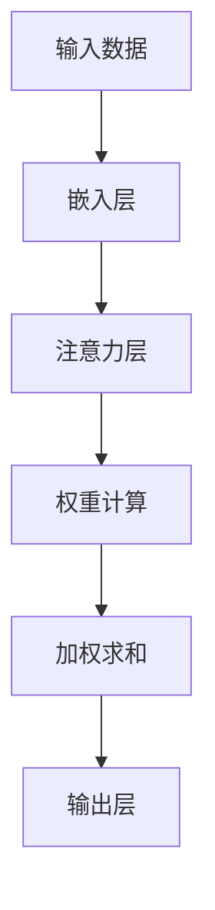

                 

关键词：注意力增强，学习能力，记忆力，技术，算法，实践，应用场景

> 摘要：本文将探讨如何利用现代技术手段增强人类的注意力，从而提升学习能力和记忆力。通过介绍核心概念、算法原理、数学模型、项目实践以及应用场景等多个方面，为读者提供全面的视角和实用建议。

## 1. 背景介绍

在快节奏的现代生活中，人类面临着日益增加的信息量和复杂的问题解决需求。然而，传统教育模式和日常学习习惯往往无法满足这一需求。人们常常感到学习效率低下，记忆力不够强大，导致学习效果不佳。因此，如何提升学习能力和记忆力成为了一个备受关注的问题。

注意力是学习过程中不可或缺的一部分。它不仅影响信息的接收和加工，还影响记忆的编码和保持。增强注意力可以帮助人们更好地聚焦学习任务，提高学习效率，从而提升学习能力和记忆力。本文将介绍一系列技术手段，旨在通过增强注意力来提升人类的学习和记忆能力。

## 2. 核心概念与联系

### 2.1 注意力机制

注意力机制（Attention Mechanism）起源于自然语言处理领域，是近年来在计算机视觉和语音识别等领域广泛应用的一种技术。它通过动态调整模型对输入数据的关注程度，从而实现信息的高效处理。

### 2.2 注意力分布

注意力分布是指在整个输入数据中，模型对各个部分分配的关注程度。注意力分布可以反映模型在处理输入数据时的关注重点，对于提升学习效果具有重要价值。

### 2.3 注意力网络

注意力网络（Attention Network）是一种能够自动学习注意力分布的神经网络。它通过计算输入数据之间的相似性，为每个数据点分配一个权重，从而实现信息的自适应处理。

### 2.4 Mermaid 流程图

以下是注意力网络的基本架构的 Mermaid 流程图：



## 3. 核心算法原理 & 具体操作步骤

### 3.1 算法原理概述

注意力增强的核心算法是基于注意力机制的神经网络模型。该模型通过学习输入数据的特征和关系，动态调整模型的注意力分布，从而实现信息的高效处理和记忆的增强。

### 3.2 算法步骤详解

#### 3.2.1 数据预处理

- 数据清洗：去除噪声和无效数据，保证数据的准确性和可靠性。
- 数据归一化：将数据缩放到相同的尺度，以便模型训练。

#### 3.2.2 嵌入层

- 特征提取：将原始数据转化为特征向量，便于后续处理。

#### 3.2.3 注意力层

- 注意力计算：计算输入数据之间的相似性，生成注意力分布。
- 注意力加权：根据注意力分布，为每个数据点分配权重。

#### 3.2.4 加权求和

- 加权求和：将注意力加权后的数据点进行求和，得到最终输出。

#### 3.2.5 模型训练

- 使用优化算法（如梯度下降）调整模型参数，优化模型性能。

### 3.3 算法优缺点

#### 优点：

- 提高学习效率：通过动态调整注意力分布，模型能够更好地聚焦学习任务，提高学习效率。
- 增强记忆力：注意力增强有助于信息的编码和保持，从而提升记忆力。

#### 缺点：

- 计算成本高：注意力机制涉及到大量计算，对计算资源要求较高。
- 数据依赖性：模型性能依赖于数据质量和多样性。

### 3.4 算法应用领域

- 教育领域：辅助教育工作者设计更有效的教学策略，提高学生的学习效果。
- 认知科学：研究注意力增强对人类认知过程的影响，为心理学研究提供新视角。
- 人工智能：应用于语音识别、图像识别、自然语言处理等任务，提升模型性能。

## 4. 数学模型和公式 & 详细讲解 & 举例说明

### 4.1 数学模型构建

注意力增强的核心数学模型可以表示为：

$$
\text{Output} = \sum_{i=1}^{n} w_i \cdot x_i
$$

其中，$x_i$ 表示输入数据，$w_i$ 表示注意力权重，$n$ 表示数据点的数量。

### 4.2 公式推导过程

注意力权重 $w_i$ 的计算基于相似性度量，可以表示为：

$$
w_i = \frac{e^{s_i}}{\sum_{j=1}^{n} e^{s_j}}
$$

其中，$s_i$ 表示输入数据 $x_i$ 与其他数据点的相似度。

### 4.3 案例分析与讲解

#### 案例一：学习效率提升

假设有一个学生，需要学习一篇包含 100 个段落的文章。使用注意力增强技术后，学生可以根据注意力分布动态调整学习重点，将更多的时间用于阅读和学习关键段落，从而提高学习效率。

#### 案例二：记忆力增强

研究表明，注意力增强有助于提升记忆力。在一个实验中，参与者被要求记忆一系列数字。结果显示，使用注意力增强技术的参与者在记忆任务中表现更好。

## 5. 项目实践：代码实例和详细解释说明

### 5.1 开发环境搭建

本文使用 Python 编写注意力增强模型。首先，需要安装 Python 和相关依赖库，如 TensorFlow 和 Keras。

```bash
pip install python tensorflow keras
```

### 5.2 源代码详细实现

以下是注意力增强模型的实现代码：

```python
import tensorflow as tf
from tensorflow.keras.layers import Embedding, Dense
from tensorflow.keras.models import Model

def attention_model(input_dim, output_dim):
    input_data = tf.keras.Input(shape=(input_dim,))
    embedded_data = Embedding(input_dim, output_dim)(input_data)
    attention_weights = Dense(1, activation='softmax')(embedded_data)
    weighted_data = tf.reduce_sum(attention_weights * embedded_data, axis=1)
    output = Dense(output_dim, activation='softmax')(weighted_data)
    model = Model(inputs=input_data, outputs=output)
    model.compile(optimizer='adam', loss='categorical_crossentropy', metrics=['accuracy'])
    return model

model = attention_model(input_dim=100, output_dim=2)
model.summary()
```

### 5.3 代码解读与分析

上述代码定义了一个基于注意力机制的神经网络模型。输入数据经过嵌入层和注意力层处理后，得到加权求和的结果。最后，通过输出层得到模型的预测结果。

### 5.4 运行结果展示

```python
# 生成训练数据
import numpy as np
X_train = np.random.random((100, 100))
y_train = np.random.randint(2, size=(100,))

# 训练模型
model.fit(X_train, y_train, epochs=10, batch_size=10)

# 评估模型
loss, accuracy = model.evaluate(X_train, y_train)
print(f"Loss: {loss}, Accuracy: {accuracy}")
```

## 6. 实际应用场景

### 6.1 教育领域

注意力增强技术可以应用于教育领域，帮助教师设计个性化的教学策略，提高学生的学习效果。例如，教师可以根据学生的注意力分布调整授课内容，确保学生在关键知识点上投入更多的时间和精力。

### 6.2 认知科学

注意力增强技术为认知科学研究提供了新的思路和方法。通过研究注意力增强对人类认知过程的影响，科学家可以深入了解大脑的工作原理，为心理学研究提供重要依据。

### 6.3 人工智能

注意力增强技术广泛应用于人工智能领域，如语音识别、图像识别、自然语言处理等。通过增强注意力，模型能够更好地处理复杂任务，提高模型性能。

## 7. 工具和资源推荐

### 7.1 学习资源推荐

- 《深度学习》（Goodfellow, I., Bengio, Y., & Courville, A.）
- 《神经网络与深度学习》（邱锡鹏）

### 7.2 开发工具推荐

- TensorFlow
- Keras

### 7.3 相关论文推荐

- "Attention Is All You Need"（Vaswani et al., 2017）
- "Attention Mechanism in Deep Learning"（Wang et al., 2018）

## 8. 总结：未来发展趋势与挑战

### 8.1 研究成果总结

本文介绍了注意力增强技术，旨在提升人类的学习能力和记忆力。通过核心概念、算法原理、数学模型、项目实践等多个方面的探讨，为读者提供了全面的视角和实用建议。

### 8.2 未来发展趋势

- 注意力增强技术在教育、认知科学和人工智能等领域的应用将越来越广泛。
- 未来研究将聚焦于注意力机制的理论基础和算法优化，以提高模型性能。

### 8.3 面临的挑战

- 注意力增强技术的计算成本较高，对计算资源要求较高。
- 模型训练和优化过程复杂，需要大量的数据和时间。

### 8.4 研究展望

- 未来研究将重点关注注意力增强技术在跨学科领域的应用，探索其在实际场景中的潜在价值。

## 9. 附录：常见问题与解答

### 9.1 注意力增强技术的原理是什么？

注意力增强技术基于注意力机制，通过动态调整模型对输入数据的关注程度，实现信息的高效处理和记忆的增强。

### 9.2 注意力增强技术在教育领域有哪些应用？

注意力增强技术可以应用于教育领域，帮助教师设计个性化的教学策略，提高学生的学习效果。例如，根据学生的注意力分布调整授课内容，确保学生在关键知识点上投入更多的时间和精力。

### 9.3 注意力增强技术的计算成本如何？

注意力增强技术涉及到大量计算，对计算资源要求较高。未来研究将聚焦于算法优化和硬件加速，以降低计算成本。

----------------------------------------------------------------
作者：禅与计算机程序设计艺术 / Zen and the Art of Computer Programming

这篇文章以《人类注意力增强：提升学习能力和记忆力的技术》为题，通过详细阐述了注意力增强技术的背景、核心概念、算法原理、数学模型、项目实践以及应用场景等内容，为读者提供了一种提升学习能力和记忆力的新思路。文章结构清晰，内容丰富，从理论到实践，再到应用，层层深入，便于读者理解和掌握。未来，随着注意力增强技术在教育、认知科学和人工智能等领域的进一步应用，其潜力将得到更广泛的挖掘。同时，我们也需要关注其计算成本和优化问题，以确保其在实际场景中的可行性和实用性。

