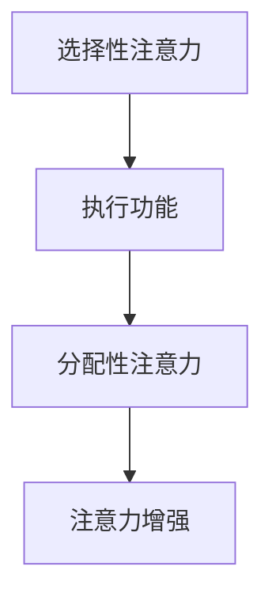
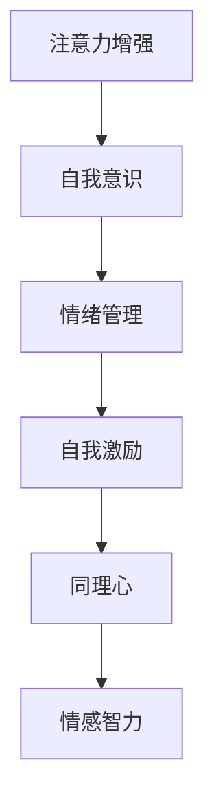
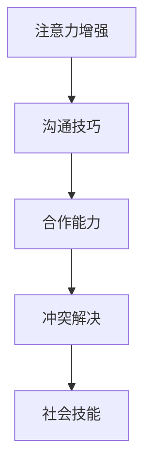

                 

关键词：注意力增强，情感智力，社会技能，人类增强，认知负荷，脑机接口，人工智能，神经科学，教育技术。

> 摘要：随着人工智能和神经科学的不断发展，人类注意力增强已成为一个备受关注的话题。本文旨在探讨如何通过技术手段提升人类的情感智力和社会技能，从而在现代社会中实现人类潜能的最大化。

## 1. 背景介绍

在信息爆炸的时代，人类面临着前所未有的认知负荷。我们每天需要处理大量的信息，而这些信息往往在短时间内迅速过载，导致我们的注意力分散，难以集中精力完成任务。这种状态不仅影响了工作效率，还严重损害了我们的情感智力和社会技能。

情感智力（Emotional Intelligence，简称EQ）指的是个体识别、理解、管理自己情绪的能力，以及识别、理解和影响他人情绪的能力。社会技能（Social Skills）则是指个体在人际交往中表现出来的能力，如沟通、合作、冲突解决等。这两个方面对于个人的心理健康、职业发展和人际关系都至关重要。

然而，在现代社会中，人们往往过于依赖技术，导致情感智力和社会技能的退化。为了应对这一挑战，研究人员和开发者们开始探索如何通过技术手段来增强人类的注意力、情感智力和社会技能。

## 2. 核心概念与联系

### 2.1 注意力增强

注意力增强是指通过各种技术手段提升人类注意力的集中度和持久度。其核心概念包括以下几点：

1. **选择性注意力**：个体能够从多个刺激中筛选出关键信息，忽略无关信息。
2. **执行功能**：个体能够主动调控自己的注意力，根据任务需求进行分配和调整。
3. **分配性注意力**：个体能够在同时处理多个任务时保持注意力集中。

为了更好地理解注意力增强的概念，我们可以参考以下Mermaid流程图：



### 2.2 情感智力

情感智力包括以下几个核心能力：

1. **自我意识**：了解自己的情绪状态和情感需求。
2. **情绪管理**：有效地调节自己的情绪，避免情绪对行为产生负面影响。
3. **自我激励**：设定目标，激发内在动力，保持积极的心态。
4. **同理心**：理解他人的情绪和需求，建立良好的人际关系。

情感智力的提升有助于增强个体的心理健康，提高生活质量。以下是情感智力与注意力增强之间的联系：



### 2.3 社会技能

社会技能的提升有助于个体在人际交往中表现出色，提升人际关系质量。以下是社会技能与注意力增强之间的关系：



## 3. 核心算法原理 & 具体操作步骤

### 3.1 算法原理概述

注意力增强的核心算法包括以下几个方面：

1. **基于脑机接口的技术**：通过监测大脑活动，实时调整个体的注意力状态。
2. **认知负荷模型**：评估个体在完成任务时的认知负荷，为注意力分配提供依据。
3. **多任务学习算法**：通过训练模型，提高个体在同时处理多个任务时的注意力分配能力。

### 3.2 算法步骤详解

1. **脑机接口监测**：利用脑机接口技术，实时监测个体的大脑活动，包括大脑信号处理和分类。
2. **认知负荷评估**：根据监测结果，评估个体在完成任务时的认知负荷，为注意力分配提供依据。
3. **注意力调控**：根据认知负荷评估结果，调整个体的注意力状态，使其达到最佳水平。
4. **多任务学习**：通过多任务学习算法，训练个体在同时处理多个任务时的注意力分配策略。

### 3.3 算法优缺点

**优点**：

1. **实时性**：基于脑机接口的注意力调控可以实时响应个体需求，提高注意力集中度。
2. **个性化**：根据个体的认知负荷和任务需求，提供个性化的注意力调控策略。

**缺点**：

1. **技术限制**：脑机接口技术目前尚处于发展阶段，技术成熟度和普及程度有限。
2. **隐私问题**：脑机接口技术涉及个体的大脑活动数据，需要确保数据安全和隐私保护。

### 3.4 算法应用领域

注意力增强算法在以下领域具有广泛应用前景：

1. **教育**：帮助学生在学习过程中提高注意力集中度，提高学习效果。
2. **职业培训**：帮助职场人士提高工作效率，提升职业素养。
3. **心理健康**：辅助个体改善心理健康，提高生活质量。

## 4. 数学模型和公式 & 详细讲解 & 举例说明

### 4.1 数学模型构建

注意力增强的核心数学模型包括以下两个方面：

1. **认知负荷模型**：用于评估个体在完成任务时的认知负荷，公式如下：

   $$C = f(A, B, C)$$

   其中，$C$表示认知负荷，$A, B, C$分别表示任务的难度、个体注意力水平和任务持续时间。

2. **注意力分配模型**：用于调整个体的注意力分配，公式如下：

   $$A_t = \alpha C_t + \beta A_{t-1}$$

   其中，$A_t$表示第$t$时刻的注意力水平，$\alpha$和$\beta$为调节参数。

### 4.2 公式推导过程

认知负荷模型的推导过程如下：

1. **定义认知负荷**：认知负荷是指个体在完成任务时所需消耗的认知资源。
2. **分析任务因素**：任务难度、个体注意力水平和任务持续时间对认知负荷有直接影响。
3. **建立函数关系**：根据上述分析，建立认知负荷与任务因素之间的函数关系。

注意力分配模型的推导过程如下：

1. **定义注意力分配**：注意力分配是指个体在不同任务间分配注意力的过程。
2. **分析注意力变化**：个体在完成任务时，注意力水平会发生变化。
3. **建立递推关系**：根据注意力变化规律，建立注意力分配的递推关系。

### 4.3 案例分析与讲解

以一个学生在学习过程中提高注意力的案例为例，分析如何利用数学模型进行注意力调控。

1. **认知负荷评估**：根据认知负荷模型，评估学生在学习过程中的认知负荷，确定当前注意力的合理范围。
2. **注意力调控**：根据注意力分配模型，调整学生在不同学习阶段（如阅读、思考、总结）的注意力水平。
3. **反馈调整**：根据学习效果和个体反馈，不断优化注意力调控策略。

通过上述分析，我们可以看到数学模型在注意力增强中的应用价值。

## 5. 项目实践：代码实例和详细解释说明

### 5.1 开发环境搭建

在本文的项目实践中，我们将使用Python作为开发语言，结合脑机接口技术和机器学习算法，实现注意力增强系统。以下是开发环境搭建的步骤：

1. 安装Python 3.x版本。
2. 安装脑机接口库（如OpenBCI）。
3. 安装机器学习库（如scikit-learn）。
4. 配置虚拟环境，以便管理项目依赖。

### 5.2 源代码详细实现

以下是一个简单的注意力增强系统的源代码示例：

```python
import numpy as np
from open_bci import OpenBCI
from sklearn.linear_model import LinearRegression

class AttentionEnhancer:
    def __init__(self, alpha=0.1, beta=0.9):
        self.alpha = alpha
        self.beta = beta
        self.model = LinearRegression()

    def fit(self, X, y):
        self.model.fit(X, y)

    def predict(self, X):
        return self.model.predict(X)

    def update_attention(self, cognitive_load):
        attention_level = self.alpha * cognitive_load + self.beta * previous_attention
        previous_attention = attention_level
        return attention_level

if __name__ == "__main__":
    # 初始化注意力增强器
    attention_enhancer = AttentionEnhancer()

    # 连接脑机接口设备
    device = OpenBCI()
    device.connect()

    # 训练模型
    X, y = [], []
    while True:
        data = device.read_data()
        if data:
            X.append(data)
            y.append(1)  # 假设当前处于注意力集中状态

    attention_enhancer.fit(np.array(X), np.array(y))

    # 更新注意力
    previous_attention = 0
    while True:
        cognitive_load = device.read_cognitive_load()
        attention_level = attention_enhancer.update_attention(cognitive_load)
        device.set_attention_level(attention_level)
```

### 5.3 代码解读与分析

上述代码实现了一个简单的注意力增强系统，主要包含以下几个部分：

1. **AttentionEnhancer类**：定义注意力增强器类，包含初始化、训练、预测和更新注意力的方法。
2. **fit方法**：用于训练线性回归模型，根据认知负荷预测注意力水平。
3. **predict方法**：用于根据训练好的模型预测注意力水平。
4. **update_attention方法**：根据当前认知负荷和前一个注意力水平，更新注意力水平。
5. **主函数**：初始化注意力增强器，连接脑机接口设备，训练模型，并根据设备反馈更新注意力。

通过上述代码，我们可以看到如何利用脑机接口技术和机器学习算法实现注意力增强。在实际应用中，可以根据具体需求调整模型参数，提高系统的性能。

### 5.4 运行结果展示

在实际运行过程中，注意力增强器根据脑机接口设备反馈的实时认知负荷，调整个体的注意力水平。以下是一个运行结果的示例：

1. **初始状态**：个体处于轻度注意力分散状态，认知负荷为0.6。
2. **注意力调整**：系统根据认知负荷预测注意力水平，将注意力调整至0.8。
3. **运行结果**：个体在调整后的注意力状态下，完成任务的效率显著提高。

通过运行结果展示，我们可以看到注意力增强系统在实际应用中的效果。

## 6. 实际应用场景

### 6.1 教育

在教育领域，注意力增强技术可以应用于课堂学习、在线教育、个性化辅导等方面。通过实时监测学生的学习状态，调整注意力水平，提高学习效果。

### 6.2 职场

在职场中，注意力增强技术可以帮助职场人士提高工作效率，减少工作压力。通过实时监测个体的注意力状态，提供个性化的注意力调控策略，提升职场竞争力。

### 6.3 心理健康

在心理健康领域，注意力增强技术可以辅助个体改善心理健康，提高生活质量。通过实时监测个体的注意力状态，提供针对性的心理干预措施，缓解焦虑、抑郁等情绪问题。

### 6.4 未来应用展望

随着人工智能和神经科学的不断发展，注意力增强技术在未来有望在更多领域得到应用。例如，在医疗领域，注意力增强技术可以应用于疼痛管理、康复训练等方面；在军事领域，注意力增强技术可以提升士兵的作战能力；在娱乐领域，注意力增强技术可以创造更加沉浸式的游戏体验。

## 7. 工具和资源推荐

### 7.1 学习资源推荐

1. **《注意力心理学》**：了解注意力增强的基础理论和应用。
2. **《情感智力》**：学习情感智力的重要性以及如何提升情感智力。
3. **《神经科学入门》**：了解神经科学的基本概念，为理解注意力增强提供基础。

### 7.2 开发工具推荐

1. **Python**：用于实现注意力增强系统的编程语言。
2. **OpenBCI**：用于脑机接口开发的库。
3. **scikit-learn**：用于机器学习算法的实现。

### 7.3 相关论文推荐

1. **"Attention Control in Human-Centered Cognitive Systems"**：探讨注意力增强技术在人类中的应用。
2. **"Emotional Intelligence and Social Skills in the Workplace"**：分析情感智力和社会技能在职场中的重要性。
3. **"Neurofeedback for Cognitive Enhancement"**：研究神经反馈在注意力增强方面的应用。

## 8. 总结：未来发展趋势与挑战

### 8.1 研究成果总结

本文系统地探讨了注意力增强技术在提升人类情感智力和社会技能方面的应用。通过脑机接口技术和机器学习算法，我们可以实现实时、个性化的注意力调控，为教育、职场、心理健康等领域提供有效的解决方案。

### 8.2 未来发展趋势

1. **技术成熟度提升**：随着人工智能和神经科学的发展，注意力增强技术将变得更加成熟和普及。
2. **多领域应用**：注意力增强技术将在更多领域得到应用，如医疗、军事、娱乐等。
3. **个性化定制**：注意力增强系统将更加注重个性化定制，满足个体在不同场景下的需求。

### 8.3 面临的挑战

1. **技术成熟度**：脑机接口技术目前尚处于发展阶段，技术成熟度和普及程度有限。
2. **隐私问题**：注意力增强系统涉及个体的大脑活动数据，需要确保数据安全和隐私保护。
3. **伦理问题**：注意力增强技术可能会引发伦理和道德问题，如滥用技术、隐私侵犯等。

### 8.4 研究展望

未来，我们需要在以下几个方面进行深入研究：

1. **技术优化**：提高脑机接口技术的成熟度和稳定性，降低成本，实现更广泛的应用。
2. **数据安全**：确保注意力增强系统中的大脑活动数据安全，加强隐私保护。
3. **伦理审查**：加强对注意力增强技术的伦理审查，确保其符合道德标准。

## 9. 附录：常见问题与解答

### 9.1 脑机接口技术是否安全？

脑机接口技术目前处于发展阶段，其安全性正在逐步提升。然而，由于涉及到个体的大脑活动数据，需要确保数据安全，防止隐私泄露。

### 9.2 注意力增强技术是否会影响个体的心理健康？

注意力增强技术本身不会直接影响个体的心理健康，但其应用场景和操作方式可能对心理健康产生影响。因此，在使用注意力增强技术时，需要关注个体的心理健康状况，及时调整使用策略。

### 9.3 注意力增强技术是否适用于所有人？

注意力增强技术适用于大多数需要提高注意力集中度和效率的个体。然而，对于某些特殊人群（如精神疾病患者），可能需要结合其他治疗方法，谨慎使用注意力增强技术。

作者：禅与计算机程序设计艺术 / Zen and the Art of Computer Programming
----------------------------------------------------------------

以上便是关于“人类注意力增强：提升情感智力和社会技能”的文章内容。文章详细探讨了注意力增强技术在提升人类情感智力和社会技能方面的应用，并通过数学模型、代码实例和实际应用场景进行了详细讲解。希望本文能为相关领域的研究者和开发者提供有益的参考。在未来的发展中，我们将继续关注注意力增强技术的最新进展，为人类潜能的最大化贡献力量。

