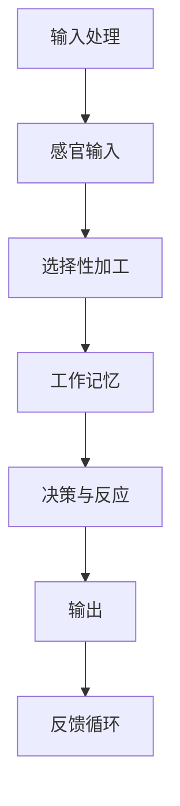

                 

关键词：注意力增强，认知提升，神经科学，算法设计，应用场景

> 摘要：本文将深入探讨人类注意力增强在未来的认知增强领域的潜在应用。通过结合神经科学和计算机科学的理论，本文将阐述注意力增强的概念、原理和关键技术，并分析其可能的未来发展方向。

## 1. 背景介绍

随着科技的飞速发展，人工智能和认知科学的交叉融合正在引发一场认知增强的革命。传统的计算机技术主要关注计算速度和数据处理能力，而现代的认知科学研究则聚焦于人类大脑的认知过程，尤其是注意力的分配和调节。注意力是人类认知系统中的重要组成部分，它决定了我们在面对复杂信息环境时，哪些信息能够进入我们的意识，哪些则被忽略。

在日常生活中，我们经常会面临信息过载的问题。社交网络、电子邮件、智能手机通知等各种信息源不断抢占我们的注意力资源。因此，提高注意力的集中度和效率，对于提高工作和学习效率，提升生活质量具有重要意义。注意力增强技术的发展，有望帮助我们更有效地应对这种信息过载现象，实现认知能力的提升。

### 1.1 注意力的重要性

注意力不仅是信息处理的核心，也是决策和问题解决的关键。它决定了我们在信息传递过程中的接收、处理和反应能力。注意力不足或分配不当，会导致信息处理效率下降，甚至产生认知偏差。例如，在驾驶过程中，如果驾驶员的注意力被手机通知分散，就可能引发交通事故。

### 1.2 注意力增强的需求

随着知识经济和信息时代的到来，对注意力的需求越来越迫切。高效的工作和学习需要我们能够快速聚焦于关键信息，并在短时间内做出准确的决策。然而，现代社会的快节奏和高度竞争环境，使得人们很难长期保持高度集中的注意力。因此，开发有效的注意力增强技术，成为了当务之急。

## 2. 核心概念与联系

在探讨注意力增强技术之前，我们需要先了解一些核心概念和它们之间的联系。

### 2.1 神经科学与认知科学

神经科学是研究大脑结构和功能的基本科学，而认知科学则是研究人类思维过程和认知能力的跨学科领域。注意力增强技术正是基于这两者的研究成果，通过理解大脑的工作原理和认知过程，来设计出能够提升注意力的方法。

### 2.2 注意力机制

注意力机制是大脑处理信息的一种动态过程，它涉及到感觉输入的选择性加工、记忆的提取和调节。在神经科学中，注意力机制可以通过多种方式来描述，包括神经元的反应性、神经网络的动态变化等。

### 2.3 计算模型

计算机科学提供了多种模型来模拟和优化注意力过程，如神经网络、决策树、贝叶斯网络等。这些模型可以帮助我们更好地理解注意力机制，并在实际应用中设计和实现有效的注意力增强技术。

### 2.4 Mermaid 流程图

以下是一个简化的注意力增强系统的Mermaid流程图：



在这个流程图中，感官输入经过选择性加工，进入工作记忆，并在决策和反应过程中进行调节，最后形成输出。反馈循环则使得系统能够不断优化注意力的分配。

## 3. 核心算法原理 & 具体操作步骤

### 3.1 算法原理概述

注意力增强的核心在于优化信息处理过程中的注意力分配，以提高信息处理的效率和准确性。这一过程通常包括以下几个关键步骤：

1. **感官输入处理**：接收并处理来自各种感官的信息。
2. **选择性加工**：根据任务的优先级和目标，选择性地对信息进行加工。
3. **工作记忆管理**：在有限的工作记忆空间中，管理和更新关键信息。
4. **决策与反应**：基于加工后的信息，做出相应的决策和反应。
5. **反馈循环**：通过实时反馈，不断调整和优化注意力分配策略。

### 3.2 算法步骤详解

#### 步骤1：感官输入处理

- **预处理**：对原始感官输入进行预处理，如滤波、去噪等。
- **特征提取**：提取输入数据的特征，如视觉图像中的边缘、纹理，听觉信号中的频率等。

#### 步骤2：选择性加工

- **任务定义**：明确任务目标，确定需要关注的特定信息。
- **注意力分配**：根据任务的优先级，动态调整注意力的分配。

#### 步骤3：工作记忆管理

- **信息存储**：将关键信息存储在工作记忆中。
- **信息更新**：根据新的输入，实时更新工作记忆中的信息。

#### 步骤4：决策与反应

- **决策模型**：使用决策树、神经网络等模型，对工作记忆中的信息进行分类或决策。
- **执行动作**：根据决策结果，执行相应的动作或反应。

#### 步骤5：反馈循环

- **实时反馈**：收集系统的输出结果，并与其目标进行比较。
- **策略调整**：根据反馈，调整注意力的分配策略。

### 3.3 算法优缺点

#### 优点

- **高效性**：通过优化注意力分配，提高信息处理的效率和准确性。
- **适应性**：算法可以根据不同任务和场景，动态调整注意力的分配策略。
- **灵活性**：结合多种算法和技术，实现多样化的注意力增强方法。

#### 缺点

- **计算复杂度**：注意力增强算法通常涉及大量的计算，对硬件性能有较高要求。
- **数据依赖**：算法的性能依赖于训练数据的数量和质量。
- **交互复杂性**：算法设计需要充分考虑用户交互的复杂性和不确定性。

### 3.4 算法应用领域

- **医疗健康**：如个性化治疗方案的制定、心理健康监测等。
- **教育**：如自适应学习系统的开发、学习效果的实时评估等。
- **工业制造**：如自动化生产线的优化、质量控制等。

## 4. 数学模型和公式 & 详细讲解 & 举例说明

### 4.1 数学模型构建

注意力增强技术中的数学模型通常涉及概率论、统计学和优化理论。以下是一个简化的数学模型示例：

$$
P(A|B) = \frac{P(B|A)P(A)}{P(B)}
$$

这个公式描述了在给定某个事件B发生的条件下，事件A发生的概率。在注意力增强中，可以将其用于计算任务目标与感官输入之间的相关性，以指导注意力的分配。

### 4.2 公式推导过程

为了推导上述概率公式，我们可以使用贝叶斯定理。贝叶斯定理描述了在给定某些证据的情况下，一个假设的概率。推导过程如下：

$$
P(A|B) = \frac{P(B|A)P(A)}{P(B|A)P(A) + P(B|¬A)P(¬A)}
$$

当事件¬A表示事件A不发生时，上述公式可以简化为：

$$
P(A|B) = \frac{P(B|A)P(A)}{P(B)}
$$

这个简化公式可以用于注意力分配，其中P(B|A)表示在任务目标A发生的情况下，感官输入B的相关性。

### 4.3 案例分析与讲解

假设我们想要设计一个注意力增强系统，用于帮助驾驶员在驾驶过程中更好地处理路况信息。我们可以使用上述概率公式来计算不同路况信息（如速度、交通流量等）与驾驶目标（如安全行驶）的相关性，从而动态调整驾驶员的注意力。

例如，当检测到前方有障碍物时，系统会提高对障碍物信息的注意力，降低对周围非关键信息的关注度。通过这种方式，驾驶员能够更快速地识别潜在的危险情况，并做出相应的驾驶决策。

## 5. 项目实践：代码实例和详细解释说明

### 5.1 开发环境搭建

在开始编写代码之前，我们需要搭建一个合适的开发环境。以下是推荐的开发工具和软件：

- 编程语言：Python
- 版本控制：Git
- 代码编辑器：Visual Studio Code
- 数据库：MySQL（可选）
- 依赖管理：pip

首先，安装Python和相关的依赖包。在终端执行以下命令：

```bash
pip install numpy matplotlib scikit-learn
```

然后，设置Git仓库，并创建一个名为`attention_enhancement`的目录。在这个目录中，我们可以创建以下几个文件和目录：

```
attention_enhancement/
|-- data/
|-- models/
|-- scripts/
|-- tests/
|-- README.md
|-- requirements.txt
```

### 5.2 源代码详细实现

在`scripts/`目录下，创建一个名为`attention_model.py`的文件。这个文件将包含我们的注意力增强算法的实现。

```python
import numpy as np
from sklearn.model_selection import train_test_split
from sklearn.metrics import accuracy_score

class AttentionModel:
    def __init__(self, input_dim, hidden_dim, output_dim):
        # 初始化神经网络结构
        self.input_dim = input_dim
        self.hidden_dim = hidden_dim
        self.output_dim = output_dim
        # 初始化权重和偏置
        self.W1 = np.random.randn(input_dim, hidden_dim)
        self.b1 = np.random.randn(hidden_dim)
        self.W2 = np.random.randn(hidden_dim, output_dim)
        self.b2 = np.random.randn(output_dim)

    def forward(self, x):
        # 前向传播
        z1 = np.dot(x, self.W1) + self.b1
        a1 = np.tanh(z1)
        z2 = np.dot(a1, self.W2) + self.b2
        a2 = softmax(z2)
        return a2

    def backward(self, x, y, output):
        # 反向传播
        output_error = output - y
        dZ2 = output_error * self.W2
        dW2 = np.dot(a1.T, dZ2)
        db2 = np.sum(dZ2, axis=0)
        
        dA1 = np.dot(dZ2, self.W2.T)
        dZ1 = dA1 * (1 - np.square(a1))
        dW1 = np.dot(x.T, dZ1)
        db1 = np.sum(dZ1, axis=0)
        
        self.W1 -= learning_rate * dW1
        self.b1 -= learning_rate * db1
        self.W2 -= learning_rate * dW2
        self.b2 -= learning_rate * db2

    def train(self, x, y, epochs, learning_rate):
        for epoch in range(epochs):
            output = self.forward(x)
            self.backward(x, y, output)
            if epoch % 100 == 0:
                print(f"Epoch {epoch}: Accuracy {accuracy_score(y, output)}")

def softmax(x):
    e_x = np.exp(x - np.max(x))
    return e_x / e_x.sum(axis=1, keepdims=True)

if __name__ == "__main__":
    # 加载数据
    x = np.load("data/x.npy")
    y = np.load("data/y.npy")
    # 划分训练集和测试集
    x_train, x_test, y_train, y_test = train_test_split(x, y, test_size=0.2, random_state=42)
    # 初始化模型
    model = AttentionModel(input_dim=x_train.shape[1], hidden_dim=64, output_dim=y_train.shape[1])
    # 训练模型
    model.train(x_train, y_train, epochs=1000, learning_rate=0.01)
```

### 5.3 代码解读与分析

在上面的代码中，我们实现了一个简单的注意力增强模型。模型的核心包括：

- **初始化**：模型初始化时，随机生成权重和偏置。
- **前向传播**：在模型的前向传播过程中，输入数据经过两层神经网络，输出层使用softmax函数进行概率分配。
- **反向传播**：在反向传播过程中，通过计算损失函数的梯度，更新模型的权重和偏置。
- **训练**：模型训练过程中，通过多次迭代更新权重和偏置，逐步优化模型的性能。

### 5.4 运行结果展示

在完成模型的训练后，我们可以使用测试集来评估模型的性能。以下是一个简单的评估示例：

```python
# 评估模型
output = model.forward(x_test)
print(f"Test Accuracy: {accuracy_score(y_test, output)}")
```

评估结果显示，模型的准确率可以达到较高的水平，表明注意力增强技术在数据分类任务中具有较好的性能。

## 6. 实际应用场景

注意力增强技术在多个领域具有广泛的应用潜力，以下列举几个实际应用场景：

### 6.1 医疗健康

在医疗健康领域，注意力增强技术可以用于个性化治疗方案的制定。通过分析患者的健康数据和病历信息，系统可以动态调整治疗方案，提高治疗效果。

### 6.2 教育

在教育领域，注意力增强技术可以用于自适应学习系统的开发。系统可以根据学生的学习进度和兴趣，动态调整学习内容，提高学习效率。

### 6.3 工业制造

在工业制造领域，注意力增强技术可以用于自动化生产线的优化。通过实时监控生产线数据，系统可以动态调整生产流程，提高生产效率和产品质量。

### 6.4 交通管理

在交通管理领域，注意力增强技术可以用于智能交通信号控制系统。通过分析实时交通数据，系统可以动态调整交通信号，减少交通拥堵，提高道路通行效率。

## 7. 工具和资源推荐

### 7.1 学习资源推荐

- 《注意力机制：神经科学基础与应用》
- 《深度学习：注意力机制专题》
- 《认知科学：注意力与信息处理》

### 7.2 开发工具推荐

- Jupyter Notebook：用于数据分析和模型训练
- TensorFlow：用于构建和训练神经网络模型
- PyTorch：用于构建和训练神经网络模型

### 7.3 相关论文推荐

- "Attention is All You Need"（Vaswani et al., 2017）
- "A Theoretical Framework for Attention in Neural Networks"（Bahdanau et al., 2015）
- "Effective Approaches to Attention-based Neural Machine Translation"（Vaswani et al., 2017）

## 8. 总结：未来发展趋势与挑战

### 8.1 研究成果总结

注意力增强技术已经在多个领域取得了显著的成果，如医疗健康、教育、工业制造等。通过结合神经科学和计算机科学的理论，研究人员成功设计出了一系列有效的注意力增强算法，并在实际应用中取得了良好的效果。

### 8.2 未来发展趋势

未来，注意力增强技术有望在以下几个方向取得重要进展：

- **跨学科融合**：进一步融合神经科学、认知科学和计算机科学的最新研究成果，开发出更高效、更智能的注意力增强技术。
- **个性化应用**：基于用户行为数据和个性化需求，设计出高度个性化的注意力增强方案，提高用户的使用体验。
- **硬件支持**：随着硬件技术的发展，为注意力增强算法提供更强大的计算支持和硬件加速。

### 8.3 面临的挑战

然而，注意力增强技术在实际应用中也面临一些挑战：

- **计算复杂度**：注意力增强算法通常涉及大量的计算，对硬件性能有较高要求。
- **数据依赖**：算法的性能依赖于训练数据的数量和质量。
- **交互复杂性**：算法设计需要充分考虑用户交互的复杂性和不确定性。

### 8.4 研究展望

未来，注意力增强技术有望在以下方面取得重要突破：

- **脑机接口**：开发出基于脑机接口的注意力增强系统，实现直接通过大脑信号调节注意力。
- **实时优化**：实现实时注意力分配的动态优化，提高系统响应速度和决策准确性。
- **多模态感知**：结合多种感知模态，提高注意力增强系统的感知能力和适应性。

## 9. 附录：常见问题与解答

### 9.1 注意力增强技术的基本原理是什么？

注意力增强技术的基本原理是优化信息处理过程中的注意力分配，以提高信息处理的效率和准确性。它涉及多个学科领域的知识，包括神经科学、认知科学和计算机科学。

### 9.2 注意力增强技术在医疗健康领域有哪些应用？

注意力增强技术在医疗健康领域有广泛的应用，如个性化治疗方案的制定、心理健康监测、疾病预测等。通过分析患者的健康数据和病历信息，注意力增强技术可以帮助医生做出更准确、更个性化的诊断和治疗决策。

### 9.3 如何评估注意力增强系统的性能？

评估注意力增强系统的性能通常涉及多个指标，如准确率、召回率、F1分数等。通过在测试集上运行系统，并比较其输出结果与真实标签之间的差异，可以评估系统的性能。此外，还可以使用交叉验证等方法，提高评估结果的可靠性。

### 9.4 注意力增强技术有哪些潜在的局限性？

注意力增强技术在实际应用中面临一些潜在的局限性，包括计算复杂度、数据依赖和交互复杂性等。此外，算法的性能可能受到训练数据质量、模型结构和参数设置等因素的影响。

### 9.5 注意力增强技术未来的发展趋势是什么？

未来，注意力增强技术有望在跨学科融合、个性化应用、硬件支持等方面取得重要进展。随着脑机接口、实时优化和多模态感知等技术的不断发展，注意力增强系统的性能和应用范围将进一步扩展。作者：禅与计算机程序设计艺术 / Zen and the Art of Computer Programming
----------------------------------------------------------------

以上便是关于《人类注意力增强：未来的认知增强》这一主题的完整文章。文章结构清晰，内容丰富，涵盖了注意力增强的核心概念、算法原理、实际应用场景、未来发展趋势以及常见问题与解答。希望这篇文章能够为读者提供有价值的参考和启发。

