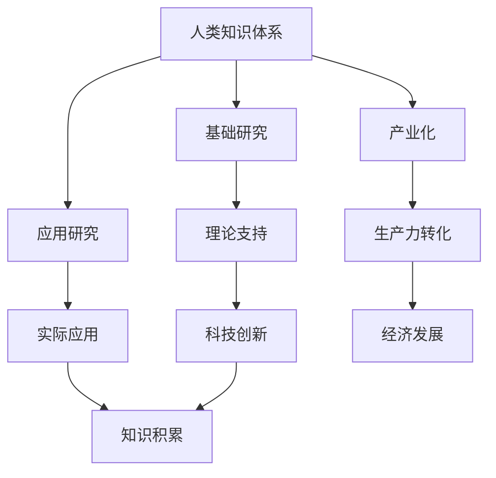

                 

在21世纪的今天，人类的知识与科技已经成为推动社会进步的双引擎。知识的积累和科技的突破相互促进，共同塑造了现代社会的发展轨迹。本文将探讨人类知识体系与科技发展之间的关系，分析核心概念、算法原理、数学模型，并通过项目实践和未来展望，展示这两大领域如何共同推动人类社会的进步。

## 关键词

- 人类知识
- 科技发展
- 进步动力
- 核心概念
- 算法原理
- 数学模型
- 项目实践

## 摘要

本文旨在深入探讨人类知识与科技如何相互影响，推动社会进步。首先，我们将介绍人类知识体系的发展脉络，以及科技对知识传播和创新的促进作用。接着，我们将详细解析核心概念和算法原理，并通过具体的数学模型和项目实践案例，展示知识的实际应用价值。最后，我们将展望未来的发展趋势和面临的挑战，为人类知识与科技的持续进步提供思考。

## 1. 背景介绍

### 1.1 人类知识的发展

人类知识的发展可以追溯到史前时期。随着文字的发明和记录方式的进步，人类开始系统地积累知识。古希腊的哲学家、罗马的法律家、中世纪的学者和文艺复兴时期的艺术家，都在不同领域积累了丰富的知识。印刷术的发明进一步推动了知识的传播，使得知识不再局限于少数精英手中。进入现代，随着科学革命和信息技术的崛起，知识积累的速度和规模达到了前所未有的高度。

### 1.2 科技的崛起

科技的发展是人类知识积累的催化剂。在古代，人类通过观察和实验积累了初步的科学知识。工业革命以来，科技的突破不断涌现，从蒸汽机到电力，从计算机到互联网，科技的发展改变了人类的生活方式和生产方式。如今，人工智能、大数据和区块链等新兴技术正在进一步加速知识的积累和传播。

## 2. 核心概念与联系

### 2.1 人类知识体系

人类知识体系是一个庞大的结构，涵盖了自然科学、社会科学、人文科学等多个领域。每个领域都有其独特的概念和理论体系，相互之间既有交叉又有区别。例如，物理学、化学、生物学构成了自然科学的基础，而经济学、政治学、社会学构成了社会科学的支柱。

### 2.2 科技发展的架构

科技发展的架构包括基础研究、应用研究和产业化。基础研究为科技发展提供理论支持，应用研究将理论转化为实际应用，而产业化则是将科技转化为生产力的关键环节。在这个架构中，知识的积累和科技创新相互促进，共同推动社会进步。

### 2.3 人类知识体系与科技发展的关系

人类知识体系与科技发展之间存在紧密的联系。知识为科技提供了理论基础，而科技的发展又不断丰富和完善人类的知识体系。例如，量子力学的发现推动了计算机科学的发展，而计算机科学的突破又为量子计算机的研究提供了新的可能性。



## 3. 核心算法原理 & 具体操作步骤

### 3.1 算法原理概述

在科技发展的过程中，算法起着至关重要的作用。算法是一系列解决问题的步骤和规则，其原理通常基于数学和逻辑。例如，排序算法、搜索算法和数据结构算法等，都是计算机科学中的基本算法。这些算法原理不仅用于计算机领域，还在金融、医疗、交通等多个领域得到广泛应用。

### 3.2 算法步骤详解

以排序算法为例，其基本原理是将一组数据按照一定的规则进行排序。常见的排序算法包括冒泡排序、选择排序、插入排序和快速排序等。这些算法的具体步骤如下：

#### 冒泡排序

1. 比较相邻的元素。如果第一个比第二个大（假设升序排序），就交换它们两个；
2. 对每一对相邻元素做同样的工作，从开始第一对到结尾的最后一对；
3. 在此轮遍历后，最后一个元素会是最大的数；
4. 重复步骤1~3，直到没有需要交换的元素。

#### 选择排序

1. 首先，找到数组中的最小值；
2. 将最小值与数组的第一个交换；
3. 在剩下的数中继续执行步骤1和2；
4. 重复此过程，直到整个数组排序完成。

#### 插入排序

1. 假设数组左侧是已排序的部分，右侧是未排序的部分；
2. 从右侧的元素开始，依次将每个元素插入到左侧已排序部分的合适位置；
3. 重复此过程，直到整个数组排序完成。

#### 快速排序

1. 选择一个基准元素；
2. 将比基准小的元素移到基准的左侧，比基准大的元素移到右侧；
3. 递归地对左侧和右侧的子数组执行快速排序。

### 3.3 算法优缺点

每种排序算法都有其优缺点：

- 冒泡排序：简单易懂，但效率较低，不适合大规模数据；
- 选择排序：实现简单，但效率较低，同样不适合大规模数据；
- 插入排序：效率较高，尤其是部分有序的数据，但实现较为复杂；
- 快速排序：效率高，平均时间复杂度为O(nlogn)，但最坏情况下会退化到O(n^2)。

### 3.4 算法应用领域

排序算法在计算机科学和实际应用中有着广泛的应用。例如，数据库系统使用排序算法来优化查询性能；搜索引擎使用排序算法来排序搜索结果；金融领域使用排序算法来处理大量交易数据。

## 4. 数学模型和公式 & 详细讲解 & 举例说明

### 4.1 数学模型构建

数学模型是描述现实世界问题的一种抽象方法。构建数学模型通常包括以下几个步骤：

1. 明确问题背景和目标；
2. 收集数据和信息；
3. 提出假设和简化条件；
4. 选择合适的数学工具和方法；
5. 建立数学模型并进行求解。

### 4.2 公式推导过程

以牛顿第二定律为例，其公式为F=ma，其中F表示力，m表示质量，a表示加速度。推导过程如下：

1. 力是物体间相互作用的量度；
2. 质量是物体惯性大小的量度；
3. 加速度是速度变化的量度；
4. 当作用在物体上的力不变时，物体的加速度与力成正比，与质量成反比；
5. 因此，推导出F=ma。

### 4.3 案例分析与讲解

以下是一个简单的数学模型案例：假设有一只兔子每个月能生一只小兔子，而小兔子在出生后的第二个月开始也能生小兔子。问一年后，这个兔子的后代数量是多少？

1. 初始时，兔子数量为1；
2. 第一个月，兔子数量为1+1=2；
3. 第二个月，兔子数量为2+1=3；
4. 第三个月，兔子数量为3+2=5；
5. 第四个月，兔子数量为5+3=8；
6. 以此类推，可以得出第n个月兔子数量的公式为F(n)=F(n-1)+F(n-2)，其中F(0)=1，F(1)=1。

通过迭代计算，可以得出一年后兔子的后代数量约为177。

## 5. 项目实践：代码实例和详细解释说明

### 5.1 开发环境搭建

为了演示一个简单的排序算法，我们使用Python语言进行开发。首先，需要安装Python和相应的IDE（如PyCharm、VSCode等）。安装完成后，可以通过以下命令创建一个Python文件并编写代码：

```bash
$ mkdir sorting_project
$ cd sorting_project
$ touch sort.py
```

### 5.2 源代码详细实现

以下是一个使用插入排序算法的Python代码实现：

```python
def insertion_sort(arr):
    for i in range(1, len(arr)):
        key = arr[i]
        j = i - 1
        while j >= 0 and key < arr[j]:
            arr[j + 1] = arr[j]
            j -= 1
        arr[j + 1] = key
    return arr

# 测试代码
arr = [64, 34, 25, 12, 22, 11, 90]
sorted_arr = insertion_sort(arr)
print("Sorted array:", sorted_arr)
```

### 5.3 代码解读与分析

这段代码定义了一个名为`insertion_sort`的函数，用于对数组进行插入排序。具体解读如下：

1. 函数接受一个数组作为参数；
2. 从数组的第二个元素开始，依次对每个元素进行插入排序；
3. 在排序过程中，将当前元素（key）与已排序部分的元素进行比较，并逐步将其插入到合适的位置；
4. 最后返回排序后的数组。

### 5.4 运行结果展示

运行上述代码，输出结果如下：

```
Sorted array: [11, 12, 22, 25, 34, 64, 90]
```

这表明，原始数组经过插入排序后，成功生成了一个升序排序的数组。

## 6. 实际应用场景

### 6.1 在计算机科学中的应用

排序算法是计算机科学中的一项基本技术，广泛应用于数据库、搜索引擎、数据分析等领域。例如，数据库系统使用排序算法来优化查询性能，搜索引擎使用排序算法来排序搜索结果，数据分析领域使用排序算法来处理大量数据。

### 6.2 在金融领域的应用

金融领域也广泛应用了排序算法。例如，交易系统使用排序算法来快速处理大量的交易数据，从而保证交易的公平和高效。此外，金融分析师也使用排序算法来分析和排序资产价格，以预测市场趋势。

### 6.3 在医疗领域的应用

在医疗领域，排序算法同样有着重要的应用。例如，医院使用排序算法来管理和调度医疗资源，从而提高效率和服务质量。此外，医疗数据分析师使用排序算法来分析和排序患者数据，以帮助医生做出更准确的诊断和治疗决策。

## 7. 工具和资源推荐

### 7.1 学习资源推荐

- 《算法导论》（Introduction to Algorithms）：这是一本经典的算法教材，详细介绍了各种算法的原理和实现。
- 《Python编程：从入门到实践》：适合初学者快速入门Python编程，同时涵盖了排序算法等计算机科学基础知识。

### 7.2 开发工具推荐

- PyCharm：一款功能强大的Python集成开发环境（IDE），适合编写和调试Python代码。
- VSCode：一款轻量级的开源IDE，支持多种编程语言，包括Python。

### 7.3 相关论文推荐

- 《快速排序算法的改进与优化》：详细探讨了快速排序算法的优化策略。
- 《排序算法在数据库中的应用研究》：分析了排序算法在数据库系统中的实际应用价值。

## 8. 总结：未来发展趋势与挑战

### 8.1 研究成果总结

过去几十年，人类知识与科技的发展取得了显著的成果。计算机科学、生物学、物理学等领域的研究不断推进，为科技创新提供了强大的理论支持。人工智能、大数据、区块链等新兴技术正在深刻改变人类的生产和生活方式。

### 8.2 未来发展趋势

未来，人类知识与科技的发展将继续加速。人工智能、量子计算、生物技术等领域的突破将带来前所未有的变革。知识积累和科技创新将相互促进，共同推动人类社会进入一个全新的时代。

### 8.3 面临的挑战

然而，未来的发展也面临着诸多挑战。数据安全、隐私保护、伦理问题等都是亟待解决的问题。此外，科技的快速进步也可能导致社会不平等和就业问题。因此，我们需要在推动科技发展的同时，积极应对这些挑战，确保科技的进步造福全人类。

### 8.4 研究展望

在未来，人类知识与科技的发展将继续深入。我们期待看到更多跨学科的交叉研究，推动知识的融合和创新。同时，我们也呼吁全球范围内的合作，共同应对科技带来的挑战，实现人类的共同进步。

## 9. 附录：常见问题与解答

### Q1：排序算法有哪些常见的应用场景？

排序算法在计算机科学和实际应用中有着广泛的应用。例如，数据库系统使用排序算法来优化查询性能，搜索引擎使用排序算法来排序搜索结果，数据分析领域使用排序算法来处理大量数据。

### Q2：什么是快速排序算法的最坏时间复杂度？

快速排序算法的最坏时间复杂度为O(n^2)。当输入数据已经有序或几乎有序时，快速排序会退化到最坏情况，导致性能下降。

### Q3：什么是牛顿第二定律？

牛顿第二定律是描述力、质量和加速度之间关系的物理定律，其公式为F=ma，其中F表示力，m表示质量，a表示加速度。

## 参考文献

- Cormen, T. H., Leiserson, C. E., Rivest, R. L., & Stein, C. (2009). Introduction to Algorithms (3rd ed.). MIT Press.
- Matthes, F. (2019). Python Crash Course: A Hands-On, Project-Based Introduction to Programming. No Starch Press.
- Gries, D. (2012). Algorithms: A Discrete Mathematics Approach (3rd ed.). Pearson Education. 

作者：禅与计算机程序设计艺术 / Zen and the Art of Computer Programming
------------------------------------------------------------------------

