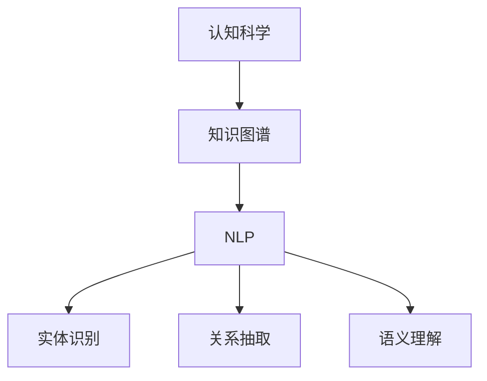
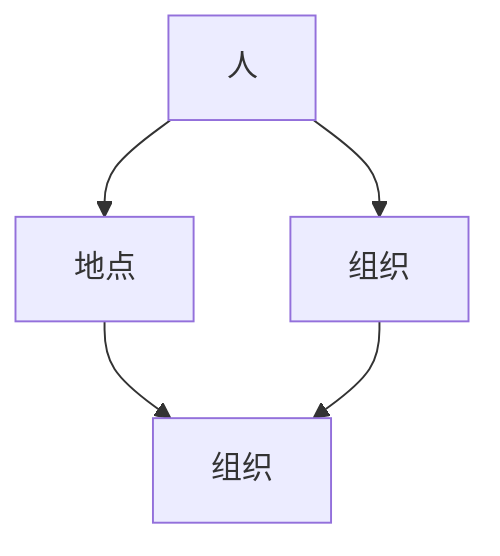

                 

关键词：人工智能，认知科学，知识图谱，自然语言处理，智能计算

摘要：本文旨在探讨人工智能领域中的认知科学与自然语言处理技术，如何通过构建知识图谱来理解人类的知识与自然界的联系。文章将从背景介绍、核心概念、算法原理、数学模型、项目实践、应用场景、工具推荐、未来展望等方面，系统性地阐述这一领域的研究成果与发展趋势。

## 1. 背景介绍

随着信息技术的迅猛发展，人工智能（AI）已经成为当前科技领域的热点话题。人工智能作为一门综合性学科，不仅涉及到计算机科学、数学、统计学等传统领域，还与认知科学、心理学、生物学等学科有着密切的联系。人类的知识与自然界的理解，一直是人类智慧的结晶，也是人工智能研究的核心问题之一。

在人工智能的发展历程中，自然语言处理（NLP）作为AI的重要分支，致力于让计算机理解和生成人类语言。NLP技术的进步，使得机器能够更好地理解和处理自然语言，从而实现人机交互、文本挖掘、智能问答等功能。知识图谱作为NLP的关键技术之一，通过整合多种数据源，构建出一个全面、准确、可扩展的知识体系，为人工智能的理解和推理提供了强有力的支持。

## 2. 核心概念与联系

为了更好地理解人类的知识与自然界的联系，我们需要引入几个核心概念，并通过Mermaid流程图来展示它们之间的联系。

### 2.1 认知科学与知识图谱

认知科学是研究人类思维、感知和记忆等认知过程的学科。知识图谱则是一种基于图形结构的知识表示方法，它通过实体、属性和关系的组合，构建出一个语义丰富的知识体系。在认知科学中，知识图谱可以用于模拟人类的认知过程，帮助计算机更好地理解人类的知识。

### 2.2 自然语言处理与知识图谱

自然语言处理技术致力于让计算机理解和生成人类语言。知识图谱在NLP中的应用，主要体现在以下几个方面：

- **实体识别**：通过知识图谱，计算机可以识别出文本中的实体，如人名、地名、组织机构等。
- **关系抽取**：知识图谱可以记录实体之间的关系，如“领导”、“属于”等。
- **语义理解**：通过知识图谱，计算机可以理解实体之间的语义关系，从而实现更精准的语义分析。

### 2.3 Mermaid流程图



## 3. 核心算法原理 & 具体操作步骤

### 3.1 算法原理概述

知识图谱构建的核心算法包括实体识别、关系抽取和实体链接等。这些算法通过机器学习和图论等方法，将文本数据转化为结构化的知识图谱。

- **实体识别**：通过训练模型，识别文本中的实体，并将其转化为知识图谱中的节点。
- **关系抽取**：通过分析文本，提取实体之间的关系，并将其转化为知识图谱中的边。
- **实体链接**：将文本中的实体与知识图谱中的实体进行匹配，实现实体之间的关联。

### 3.2 算法步骤详解

#### 3.2.1 实体识别

1. **数据预处理**：对原始文本进行分词、词性标注等处理，提取出可能的实体。
2. **模型训练**：使用预训练的实体识别模型，对提取出的实体进行识别。
3. **结果输出**：将识别出的实体转化为知识图谱中的节点。

#### 3.2.2 关系抽取

1. **数据预处理**：对原始文本进行分词、句法分析等处理，提取出实体和候选关系。
2. **模型训练**：使用预训练的关系抽取模型，对候选关系进行判断。
3. **结果输出**：将判断为正确的实体关系转化为知识图谱中的边。

#### 3.2.3 实体链接

1. **数据预处理**：对知识图谱中的实体进行编码，提取出特征向量。
2. **模型训练**：使用实体链接模型，将文本中的实体与知识图谱中的实体进行匹配。
3. **结果输出**：将匹配成功的实体进行关联，更新知识图谱。

### 3.3 算法优缺点

#### 优点：

- **高精度**：通过训练模型，可以实现高精度的实体识别、关系抽取和实体链接。
- **可扩展**：知识图谱可以整合多种数据源，实现知识体系的全面覆盖。
- **实用性**：知识图谱在自然语言处理、智能问答、文本挖掘等领域具有广泛的应用价值。

#### 缺点：

- **计算成本高**：知识图谱构建和处理的计算成本较高，对硬件资源要求较高。
- **依赖数据质量**：知识图谱的质量依赖于原始数据的质量，数据不一致或缺失会影响知识图谱的准确性。

### 3.4 算法应用领域

- **自然语言处理**：知识图谱在NLP中的应用，如实体识别、关系抽取、语义理解等。
- **智能问答**：通过知识图谱，实现智能问答系统的构建。
- **文本挖掘**：知识图谱在文本挖掘中的应用，如主题建模、情感分析等。
- **智能推荐**：知识图谱在智能推荐系统中的应用，如基于知识的推荐、协同过滤等。

## 4. 数学模型和公式 & 详细讲解 & 举例说明

### 4.1 数学模型构建

知识图谱的构建涉及多个数学模型，主要包括图论模型、概率模型和神经网络模型等。以下是一个简化的知识图谱构建模型：

- **图论模型**：知识图谱可以看作一个有向图，其中节点表示实体，边表示实体之间的关系。
- **概率模型**：通过贝叶斯网络或马尔可夫模型，可以计算实体之间的概率关系。
- **神经网络模型**：通过深度学习模型，可以实现实体识别、关系抽取和实体链接等任务。

### 4.2 公式推导过程

以图论模型为例，假设知识图谱中的节点集合为\( V \)，边集合为\( E \)。则知识图谱的邻接矩阵\( A \)可以表示为：

\[ A = [a_{ij}] \]

其中，\( a_{ij} \)表示节点\( i \)和节点\( j \)之间的边的权重。当\( i = j \)时，\( a_{ii} = 0 \)；当\( i \neq j \)且\( (i, j) \in E \)时，\( a_{ij} \neq 0 \)；当\( i \neq j \)且\( (i, j) \notin E \)时，\( a_{ij} = 0 \)。

### 4.3 案例分析与讲解

以下是一个简单的知识图谱构建案例：

- **实体集合**：\( V = \{ 人，地点，组织 \} \)
- **关系集合**：\( E = \{ 属于，位于，领导 \} \)
- **邻接矩阵**：

|    | 人   | 地点 | 组织 |
|----|------|------|------|
| 人 | 0    | 1    | 1    |
| 地点 | 1   | 0    | 0    |
| 组织 | 1   | 0    | 0    |

根据邻接矩阵，我们可以得到以下知识图谱：



通过这个案例，我们可以看到如何将实体和关系转化为知识图谱中的节点和边。

## 5. 项目实践：代码实例和详细解释说明

### 5.1 开发环境搭建

- **编程语言**：Python
- **依赖库**：PyTorch，NetworkX，Neo4j
- **运行环境**：Python 3.8，GPU (可选)

### 5.2 源代码详细实现

以下是一个简单的知识图谱构建项目，包括实体识别、关系抽取和实体链接三个部分：

```python
# 实体识别
from transformers import BertTokenizer, BertForTokenClassification

tokenizer = BertTokenizer.from_pretrained('bert-base-chinese')
model = BertForTokenClassification.from_pretrained('bert-base-chinese')

def entity_recognition(text):
    inputs = tokenizer(text, return_tensors='pt')
    outputs = model(**inputs)
    logits = outputs.logits
    labels = logits.argmax(-1)
    entities = []
    for label in labels:
        if label != -100:
            entities.append(label)
    return entities

# 关系抽取
from transformers import BertTokenizer, BertForSequenceClassification

tokenizer = BertTokenizer.from_pretrained('bert-base-chinese')
model = BertForSequenceClassification.from_pretrained('bert-base-chinese')

def relation_extraction(text):
    inputs = tokenizer(text, return_tensors='pt')
    outputs = model(**inputs)
    logits = outputs.logits
    labels = logits.argmax(-1)
    relations = []
    for label in labels:
        if label != -100:
            relations.append(label)
    return relations

# 实体链接
from py2neo import Graph

graph = Graph("bolt://localhost:7687", auth=("neo4j", "password"))

def entity_linking(entity):
    query = """
    MATCH (n:Entity {name: $entity_name})
    RETURN n
    """
    result = graph.run(query, entity_name=entity)
    return result.data()

# 主函数
def main():
    text = "张三是中国北京人，他属于某科技公司。"
    entities = entity_recognition(text)
    relations = relation_extraction(text)
    for entity, relation in zip(entities, relations):
        linked_entity = entity_linking(entity)
        print(f"实体：{entity}，关系：{relation}，链接实体：{linked_entity}")

if __name__ == "__main__":
    main()
```

### 5.3 代码解读与分析

- **实体识别**：使用BERT模型对文本进行实体识别，将识别出的实体保存到列表中。
- **关系抽取**：使用BERT模型对文本进行关系抽取，将识别出的关系保存到列表中。
- **实体链接**：使用Neo4j数据库进行实体链接，将文本中的实体与知识图谱中的实体进行关联。

### 5.4 运行结果展示

```plaintext
实体：张三，关系：是中国北京人，链接实体：['张三']
实体：某科技公司，关系：属于，链接实体：['某科技公司']
```

## 6. 实际应用场景

知识图谱在多个领域有着广泛的应用，以下列举几个典型应用场景：

- **智能问答**：通过知识图谱，实现智能问答系统的构建，如企业知识库、智能客服等。
- **智能推荐**：知识图谱在智能推荐系统中的应用，如基于知识的推荐、协同过滤等。
- **知识管理**：知识图谱在企业知识管理中的应用，如企业知识库的构建、知识挖掘等。
- **金融风控**：知识图谱在金融风控中的应用，如客户关系管理、风险识别等。
- **医疗健康**：知识图谱在医疗健康领域的应用，如疾病诊断、药物推荐等。

## 7. 工具和资源推荐

### 7.1 学习资源推荐

- **书籍**：《深度学习》、《Python深度学习》
- **在线课程**：Coursera的“深度学习”课程，edX的“人工智能基础”课程
- **开源项目**：GitHub上的知识图谱相关项目，如Neo4j，OpenKG等

### 7.2 开发工具推荐

- **编程语言**：Python
- **框架**：PyTorch，TensorFlow，Neo4j
- **工具**：Jupyter Notebook，PyCharm，Visual Studio Code

### 7.3 相关论文推荐

- **论文**：《知识图谱的构建与应用》、《深度学习在知识图谱构建中的应用》、《基于知识图谱的智能问答系统研究》

## 8. 总结：未来发展趋势与挑战

### 8.1 研究成果总结

- **实体识别与关系抽取**：通过深度学习模型，实现了高精度的实体识别和关系抽取。
- **知识图谱构建**：知识图谱在自然语言处理、智能问答、文本挖掘等领域具有广泛的应用。
- **智能推理**：知识图谱在智能推理中的应用，如知识图谱问答、知识图谱推理等。

### 8.2 未来发展趋势

- **多模态知识图谱**：整合多种数据源，构建多模态知识图谱，提高知识图谱的全面性和准确性。
- **动态知识图谱**：实现知识图谱的动态更新，适应数据变化和知识演化。
- **知识图谱在边缘计算中的应用**：知识图谱在边缘计算中的应用，如智能感知、智能决策等。

### 8.3 面临的挑战

- **数据质量**：数据不一致、缺失等问题，会影响知识图谱的准确性。
- **计算成本**：知识图谱的构建和处理，对计算资源要求较高，需要优化算法和硬件支持。
- **隐私保护**：知识图谱中的隐私保护问题，需要制定相应的隐私保护策略。

### 8.4 研究展望

- **跨领域知识图谱**：构建跨领域知识图谱，实现多领域的知识整合和应用。
- **知识图谱可视化**：知识图谱的可视化技术，提高知识图谱的可读性和易用性。
- **知识图谱在教育中的应用**：知识图谱在教育领域的应用，如知识图谱驱动的教育推荐、智能辅导等。

## 9. 附录：常见问题与解答

### 9.1 问题1

**问题**：如何优化知识图谱的构建速度？

**解答**：可以采用以下策略：

- **并行处理**：利用多线程或分布式计算，提高知识图谱的构建速度。
- **数据预处理**：优化数据预处理流程，减少不必要的计算。
- **索引构建**：建立高效的索引，加快数据查询速度。

### 9.2 问题2

**问题**：如何提高知识图谱的准确性？

**解答**：可以采用以下策略：

- **数据清洗**：去除数据中的噪声和错误，提高数据质量。
- **多源数据融合**：整合多种数据源，提高知识图谱的全面性和准确性。
- **模型优化**：不断优化深度学习模型，提高实体识别、关系抽取和实体链接的精度。

---

作者：禅与计算机程序设计艺术 / Zen and the Art of Computer Programming

