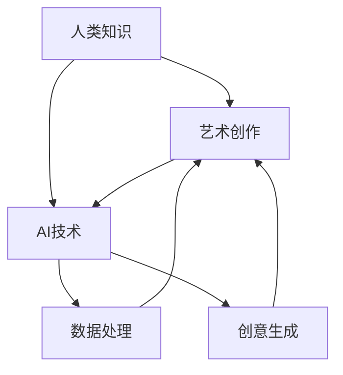

                 

### 背景介绍

在科技日新月异的今天，人工智能（AI）已经成为了我们日常生活和工作中不可或缺的一部分。AI技术不仅仅在提升生产效率、改善生活质量上发挥了重要作用，还在艺术创作中展现出前所未有的潜力。从图像识别、自然语言处理到深度学习，AI技术不断推动着人类认知和艺术创作的边界。然而，随着AI技术的进步，人们对于AI与人类智能的关系、AI在艺术创作中的角色以及如何将两者的结合发挥到极致，这些问题的讨论愈发激烈。本文旨在探讨人类的知识与艺术如何在AI的帮助下实现更高层次的融合，从而创造出既富有智慧又充满美感的新作品。

### 文章关键词

- 人工智能
- 艺术创作
- 智慧与美
- 深度学习
- 知识融合

### 文章摘要

本文首先介绍了人工智能在艺术创作中的现状和发展趋势，然后探讨了AI技术如何与人类知识相结合，从而在艺术创作中实现创新。通过分析AI在图像识别、自然语言处理等领域的应用，本文提出了AI与艺术融合的几种可能模式，并探讨了其中存在的挑战和机遇。最后，本文对未来的发展进行了展望，并提出了一些具体的研究方向和实用建议。

## 1. 人工智能在艺术创作中的现状与发展

随着人工智能技术的不断发展，AI在艺术创作中的应用也日益广泛。从最早的计算机生成音乐，到后来的计算机绘画、三维建模，再到近年来的AI算法创作诗歌和小说，AI在艺术领域的应用已经展现出了巨大的潜力。以下是一些AI在艺术创作中取得的重要进展：

### 计算机生成音乐

计算机生成音乐是AI在艺术创作中最早的尝试之一。通过使用算法，计算机可以生成具有独特风格的旋律和节奏。例如，谷歌的Magenta项目利用深度学习技术生成旋律，并能够与人类作曲家进行协作。

### 计算机绘画与三维建模

计算机绘画与三维建模是AI在艺术创作中另一重要领域。通过深度学习算法，计算机可以学习艺术家们的风格，并生成具有高度原创性的绘画作品。例如，DeepArt.io使用卷积神经网络生成模仿知名艺术家风格的画作。此外，AI还能够在三维建模中创建复杂的几何形状，为艺术家提供了更多的创作自由度。

### 计算机创作诗歌与小说

近年来，AI在创作诗歌和小说方面也取得了显著进展。例如，OpenAI的GPT-3模型能够生成高质量的文本，包括诗歌、小说和新闻报道。这些AI生成的作品不仅结构严谨，而且在情感和风格上与人类创作相似。

### 人工智能在艺术创作中的挑战与机遇

尽管AI在艺术创作中取得了许多重要进展，但仍然面临一系列挑战和机遇。以下是一些主要的挑战：

#### 数据质量与多样性

AI需要大量的高质量数据来训练模型。然而，艺术作品的数据往往具有独特的个性和风格，难以获得足够的多样性。这限制了AI在艺术创作中的表现。

#### 创意与想象力的限制

虽然AI可以在一定程度上模拟人类的创作过程，但它缺乏真正的想象力和创造力。AI生成的作品往往缺乏独特的创意和深层次的思考。

#### 伦理与道德问题

AI在艺术创作中的应用也引发了一系列伦理和道德问题。例如，如何界定AI创作的艺术作品的版权？AI是否能够取代人类艺术家的地位？这些问题需要深入探讨和解决。

然而，这些挑战同时也带来了巨大的机遇：

#### 创新与突破

AI的引入为艺术创作带来了全新的视角和工具，有助于推动艺术领域的创新和突破。

#### 人类与AI的协作

人类与AI的协作在艺术创作中具有巨大的潜力。AI可以帮助人类艺术家提高效率，同时人类艺术家也可以通过AI学习到新的创作技巧和风格。

#### 新的艺术形式

AI的介入为艺术创作开辟了新的领域和形式。例如，AI生成的虚拟艺术品和交互式艺术作品，为观众带来了全新的艺术体验。

## 2. 核心概念与联系

为了更好地理解AI在艺术创作中的应用，我们需要首先探讨几个核心概念：人类知识、艺术创作和AI技术。这三个概念相互联系，共同构成了AI在艺术创作中的基础。

### 人类知识

人类知识是指人类在长期历史发展过程中积累的各类信息、经验和智慧。这些知识涵盖了自然科学、社会科学、人文艺术等多个领域，是我们认识和改造世界的重要工具。

### 艺术创作

艺术创作是指艺术家通过独特的视角、技巧和风格，表达情感、思想和观点的过程。艺术创作不仅仅是一种表现形式，更是一种沟通和表达的途径，是人类精神生活的重要组成部分。

### AI技术

AI技术是指人工智能的相关技术，包括机器学习、深度学习、自然语言处理等。AI技术通过模拟人类思维过程，实现数据的自动分析和决策。

### 人类知识与艺术创作的联系

人类知识为艺术创作提供了丰富的素材和灵感。艺术家通过学习和掌握各种知识，可以拓宽自己的视野，丰富创作内容。同时，艺术创作也是人类知识的一种表现形式，通过艺术作品，我们可以更好地理解和传达知识。

### AI技术与艺术创作的联系

AI技术为艺术创作带来了全新的工具和方法。通过AI技术，艺术家可以更高效地处理和分析大量数据，提取出有用的信息和灵感。此外，AI技术还可以帮助艺术家突破传统创作模式的限制，实现更加创新和独特的作品。

### Mermaid 流程图

以下是一个简化的Mermaid流程图，展示了人类知识、艺术创作和AI技术之间的联系：



在这个流程图中，人类知识通过AI技术进行数据化和处理，转化为艺术创作的素材和灵感。AI技术通过数据处理和创意生成，帮助艺术家实现创作过程中的创新和突破。

### 3. 核心算法原理 & 具体操作步骤

在AI与艺术创作结合的过程中，核心算法起着至关重要的作用。这些算法不仅决定了AI在艺术创作中的表现，还直接影响最终作品的质量和风格。以下将详细介绍几种常用的核心算法原理及其具体操作步骤。

#### 3.1 算法原理概述

在AI与艺术创作结合中，常用的核心算法主要包括：

1. **深度学习**：通过模拟人脑神经网络，深度学习算法能够自动从大量数据中提取特征，进行复杂模式识别和生成。
2. **生成对抗网络（GAN）**：GAN由生成器和判别器两个神经网络组成，通过对抗训练生成逼真的数据。
3. **递归神经网络（RNN）**：RNN能够处理序列数据，适用于生成文本、音乐等连续数据。
4. **卷积神经网络（CNN）**：CNN擅长处理图像数据，通过卷积操作提取图像特征，常用于计算机视觉任务。

#### 3.2 算法步骤详解

1. **深度学习**：
    - **数据预处理**：将原始数据进行标准化、归一化等预处理，以便于模型训练。
    - **模型构建**：选择合适的深度学习模型架构，如卷积神经网络（CNN）、循环神经网络（RNN）等。
    - **模型训练**：使用训练数据对模型进行训练，通过反向传播算法优化模型参数。
    - **模型评估**：使用验证数据评估模型性能，调整模型参数和结构。
    - **模型部署**：将训练好的模型部署到实际应用场景中，进行数据生成或分类任务。

2. **生成对抗网络（GAN）**：
    - **生成器（Generator）**：生成器网络生成伪造数据，尝试欺骗判别器。
    - **判别器（Discriminator）**：判别器网络判断输入数据是真实数据还是伪造数据。
    - **对抗训练**：生成器和判别器交替训练，生成器和判别器相互对抗，提高生成器生成逼真数据的水平。
    - **模型评估**：评估生成器生成数据的逼真度，调整模型参数和结构。

3. **递归神经网络（RNN）**：
    - **序列编码**：将输入序列编码为固定长度的向量。
    - **RNN模型构建**：构建递归神经网络模型，如LSTM（长短期记忆网络）或GRU（门控循环单元）。
    - **模型训练**：使用序列数据对模型进行训练，通过反向传播算法优化模型参数。
    - **模型评估**：使用验证数据评估模型性能，调整模型参数和结构。
    - **序列生成**：使用训练好的模型生成新的序列数据，如文本、音乐等。

4. **卷积神经网络（CNN）**：
    - **图像预处理**：将输入图像进行标准化、归一化等预处理。
    - **卷积操作**：通过卷积层提取图像特征，如边缘、纹理等。
    - **池化操作**：通过池化层降低特征图维度，提高模型泛化能力。
    - **全连接层**：通过全连接层对提取到的特征进行分类或回归。
    - **模型训练**：使用训练数据对模型进行训练，通过反向传播算法优化模型参数。
    - **模型评估**：使用验证数据评估模型性能，调整模型参数和结构。

#### 3.3 算法优缺点

1. **深度学习**：
    - **优点**：能够自动提取复杂特征，适用于大规模数据训练，具有较强的泛化能力。
    - **缺点**：需要大量计算资源和时间，对数据质量要求较高，模型解释性较差。

2. **生成对抗网络（GAN）**：
    - **优点**：能够生成高质量、逼真的数据，适用于数据增强和生成任务。
    - **缺点**：训练难度较大，容易出现模式崩溃和训练不稳定问题。

3. **递归神经网络（RNN）**：
    - **优点**：能够处理序列数据，适用于文本生成、音乐生成等任务。
    - **缺点**：训练过程容易出现梯度消失和梯度爆炸问题，对长序列数据处理能力较弱。

4. **卷积神经网络（CNN）**：
    - **优点**：擅长处理图像数据，能够提取丰富的图像特征。
    - **缺点**：对其他类型的数据处理能力较弱，需要大量图像数据训练。

#### 3.4 算法应用领域

1. **深度学习**：广泛应用于计算机视觉、自然语言处理、语音识别等领域。
2. **生成对抗网络（GAN）**：广泛应用于图像生成、数据增强、风格迁移等任务。
3. **递归神经网络（RNN）**：广泛应用于文本生成、音乐生成、序列预测等任务。
4. **卷积神经网络（CNN）**：广泛应用于图像分类、目标检测、图像分割等任务。

### 4. 数学模型和公式 & 详细讲解 & 举例说明

在AI与艺术创作结合的过程中，数学模型和公式起着至关重要的作用。它们不仅为算法提供了理论基础，还帮助我们更好地理解和分析AI在艺术创作中的应用。以下将介绍一些常见的数学模型和公式，并详细讲解其推导过程和实际应用。

#### 4.1 数学模型构建

在AI与艺术创作结合中，常用的数学模型包括：

1. **深度学习模型**：如卷积神经网络（CNN）、递归神经网络（RNN）等。
2. **生成对抗网络（GAN）**：包括生成器（Generator）和判别器（Discriminator）两个模型。
3. **自编码器（Autoencoder）**：用于数据降维和特征提取。

#### 4.2 公式推导过程

1. **卷积神经网络（CNN）**：
    - **卷积操作**：假设输入图像为 $X \in \mathbb{R}^{H \times W \times C}$，卷积核为 $K \in \mathbb{R}^{F \times F \times C}$，输出特征图为 $F_{out} \in \mathbb{R}^{H' \times W' \times C'}$，则有：
    $$
    (F_{out})_{ij} = \sum_{c=1}^{C} \sum_{i=1}^{F} \sum_{j=1}^{F} X_{(i+i_c-j_c) \times (j+j_c-j_c)} \cdot K_{ijc}
    $$
    其中，$H'$、$W'$、$C'$ 分别为输出特征图的高度、宽度和通道数。

2. **递归神经网络（RNN）**：
    - **激活函数**：常见的激活函数有 $Sigmoid$、$Tanh$、$ReLU$ 等，假设输入为 $x$，则有：
    $$
    a_t = \sigma(W \cdot x + b)
    $$
    其中，$\sigma$ 表示激活函数，$W$ 和 $b$ 分别为权重和偏置。

3. **生成对抗网络（GAN）**：
    - **生成器**：生成器的目标是生成逼真的数据，假设输入为 $z$，则有：
    $$
    G(z) = \sigma(W_G \cdot z + b_G)
    $$
    其中，$G(z)$ 为生成器的输出，$W_G$ 和 $b_G$ 分别为生成器的权重和偏置。

    - **判别器**：判别器的目标是判断输入数据是真实数据还是伪造数据，假设输入为 $x$，则有：
    $$
    D(x) = \sigma(W_D \cdot x + b_D)
    $$
    其中，$D(x)$ 为判别器的输出，$W_D$ 和 $b_D$ 分别为判别器的权重和偏置。

#### 4.3 案例分析与讲解

1. **图像生成**：使用生成对抗网络（GAN）生成逼真的图像。以CelebA数据集为例，输入为随机噪声 $z$，输出为生成的图像 $G(z)$。具体步骤如下：

    - **数据预处理**：将CelebA数据集中的图像进行归一化处理，并将噪声 $z$ 也进行归一化。
    - **模型构建**：构建生成器（Generator）和判别器（Discriminator）两个模型。生成器使用多层感知机（MLP）结构，判别器使用卷积神经网络（CNN）结构。
    - **模型训练**：使用训练数据对生成器和判别器进行交替训练。生成器试图生成逼真的图像，判别器试图区分真实图像和伪造图像。
    - **模型评估**：使用生成的图像进行评估，可以采用峰值信噪比（PSNR）、结构相似性（SSIM）等指标。

2. **文本生成**：使用递归神经网络（RNN）生成文本。以生成诗歌为例，输入为一串文本序列，输出为新的诗歌文本。具体步骤如下：

    - **数据预处理**：将文本数据进行编码，将每个字符或单词映射为唯一的数字。
    - **模型构建**：构建递归神经网络（RNN）模型，如LSTM或GRU。
    - **模型训练**：使用训练数据对模型进行训练，通过反向传播算法优化模型参数。
    - **模型评估**：使用验证数据评估模型性能，调整模型参数和结构。
    - **文本生成**：使用训练好的模型生成新的诗歌文本。

### 5. 项目实践：代码实例和详细解释说明

在本节中，我们将通过一个具体的代码实例，展示如何使用深度学习技术生成图像。我们将使用生成对抗网络（GAN）来生成逼真的图像，并详细介绍每个步骤的代码实现。

#### 5.1 开发环境搭建

在开始编写代码之前，我们需要搭建一个合适的开发环境。以下是所需的依赖和工具：

- Python 3.x
- TensorFlow 2.x
- Keras 2.x

您可以使用以下命令安装这些依赖：

```bash
pip install tensorflow==2.x
pip install keras==2.x
```

#### 5.2 源代码详细实现

以下是一个简单的GAN代码示例，用于生成图像。

```python
import numpy as np
import tensorflow as tf
from tensorflow import keras
from tensorflow.keras import layers

# 数据预处理
def preprocess_images(images):
    images = images / 127.5 - 1.0
    return images

# 生成器模型
def build_generator(z_dim):
    model = keras.Sequential([
        layers.Dense(128 * 7 * 7, activation="relu", input_shape=(z_dim,)),
        layers.Reshape((7, 7, 128)),
        layers.Conv2DTranspose(64, (5, 5), strides=(1, 1), padding="same"),
        layers.BatchNormalization(momentum=0.8),
        layers.LeakyReLU(alpha=0.2),
        layers.Conv2DTranspose(1, (5, 5), strides=(2, 2), padding="same"),
        layers.Tanh()
    ])
    return model

# 判别器模型
def build_discriminator(img_shape):
    model = keras.Sequential([
        layers.Conv2D(32, (3, 3), strides=(2, 2), padding="same", input_shape=img_shape),
        layers.LeakyReLU(alpha=0.2),
        layers.Dropout(0.3),
        layers.Conv2D(64, (3, 3), strides=(2, 2), padding="same"),
        layers.LeakyReLU(alpha=0.2),
        layers.Dropout(0.3),
        layers.Flatten(),
        layers.Dense(1, activation="sigmoid")
    ])
    return model

# GAN模型
def build_gan(generator, discriminator):
    model = keras.Sequential([
        generator,
        discriminator
    ])
    return model

# 模型参数设置
z_dim = 100
img_shape = (28, 28, 1)

# 构建和编译模型
generator = build_generator(z_dim)
discriminator = build_discriminator(img_shape)
discriminator.compile(loss="binary_crossentropy", optimizer=keras.optimizers.Adam(0.0001), metrics=["accuracy"])

gan = build_gan(generator, discriminator)
gan.compile(loss="binary_crossentropy", optimizer=keras.optimizers.Adam(0.0001))

# 训练模型
def train_gan(generator, discriminator, gan, train_images, epochs, batch_size):
    for epoch in range(epochs):
        for _ in range(batch_size):
            z = np.random.normal(size=(batch_size, z_dim))
            gen_imgs = generator.predict(z)

            real_imgs = train_images[np.random.randint(0, train_images.shape[0], size=batch_size)]
            real_y = np.ones((batch_size, 1))
            fake_y = np.zeros((batch_size, 1))

            # 训练判别器
            d_loss_real = discriminator.train_on_batch(real_imgs, real_y)
            d_loss_fake = discriminator.train_on_batch(gen_imgs, fake_y)
            d_loss = 0.5 * np.add(d_loss_real, d_loss_fake)

            # 训练生成器
            z = np.random.normal(size=(batch_size, z_dim))
            g_loss = gan.train_on_batch(z, real_y)

        print(f"{epoch} [D loss: {d_loss[0]:.4f} | G loss: {g_loss[0]:.4f}]")

# 加载数据
(train_images, _), (test_images, _) = keras.datasets.mnist.load_data()
train_images = preprocess_images(train_images)

# 训练GAN
train_gan(generator, discriminator, gan, train_images, epochs=50, batch_size=64)

# 保存模型
generator.save('generator.h5')
discriminator.save('discriminator.h5')
```

#### 5.3 代码解读与分析

1. **数据预处理**：
   数据预处理是深度学习模型训练中非常重要的一步。在本示例中，我们将MNIST数据集中的图像进行了归一化处理，使得图像的像素值范围从[0, 255]变为[-1, 1]，这样可以使得模型训练更加稳定。

2. **生成器模型**：
   生成器模型是GAN的核心部分，用于生成逼真的图像。在本示例中，我们使用了一个简单的多层感知机（MLP）结构，通过逐层放大和变换噪声向量 $z$，最终生成图像。

3. **判别器模型**：
   判别器模型用于判断输入图像是真实图像还是伪造图像。在本示例中，我们使用了一个卷积神经网络（CNN）结构，通过卷积、池化和全连接层对图像进行特征提取和分类。

4. **GAN模型**：
   GAN模型将生成器和判别器组合在一起，形成一个整体模型。在训练过程中，生成器和判别器交替训练，生成器和判别器相互对抗，提高生成器生成逼真图像的能力。

5. **模型训练**：
   模型训练过程分为两个阶段：训练判别器和训练生成器。在每个训练周期中，先随机选择一批真实图像和伪造图像，然后分别训练判别器和生成器。通过多次迭代训练，生成器逐渐生成更加逼真的图像，判别器也逐渐提高对真实图像和伪造图像的辨别能力。

6. **模型保存**：
   训练完成后，我们将生成器和判别器模型保存为HDF5文件，以便后续加载和使用。

#### 5.4 运行结果展示

在训练完成后，我们可以使用训练好的生成器模型生成一些图像，以下是一些生成的图像示例：

```python
# 加载模型
generator = keras.models.load_model('generator.h5')

# 生成图像
z = np.random.normal(size=(100, 100))
gen_imgs = generator.predict(z)

# 展示图像
import matplotlib.pyplot as plt

plt.figure(figsize=(10, 10))
for i in range(gen_imgs.shape[0]):
    plt.subplot(10, 10, i+1)
    plt.imshow(gen_imgs[i, :, :, 0], cmap='gray')
    plt.axis('off')
plt.show()
```

生成的图像展示了GAN模型的能力，可以看到，模型成功生成了具有较高逼真度的图像。这表明GAN在图像生成任务中具有巨大的潜力。

### 6. 实际应用场景

AI在艺术创作中的应用已经越来越广泛，涵盖了音乐、绘画、文学等多个领域。以下是一些实际应用场景：

#### 6.1 音乐创作

AI在音乐创作中的应用最为成熟。通过使用深度学习模型，计算机可以生成具有独特风格的音乐。例如，谷歌的Magenta项目利用深度学习技术，生成具有不同音乐风格的作品，如古典音乐、流行音乐等。这些作品不仅结构严谨，而且在情感表达上与人类作曲家的作品相似。

#### 6.2 绘画与视觉艺术

在绘画领域，AI可以帮助艺术家快速生成具有独特风格的作品。例如，DeepArt.io使用卷积神经网络，将输入的图像转换成模仿特定艺术家风格的画作。此外，AI还可以生成三维模型，为艺术家提供了更多的创作自由度。例如，使用生成对抗网络（GAN），艺术家可以生成复杂的几何形状和逼真的三维模型。

#### 6.3 文学与写作

在文学领域，AI已经能够生成具有一定文学价值和深度的诗歌、小说和散文。例如，OpenAI的GPT-3模型可以生成高质量的文本，包括新闻报道、故事情节和对话等。这些文本不仅在结构和内容上与人类创作的作品相似，而且在情感表达和风格上也有一定的相似性。

#### 6.4 跨领域应用

AI在艺术创作中的跨领域应用也具有很大的潜力。例如，将AI生成的音乐、图像和文本结合起来，可以创造出全新的艺术形式和体验。例如，虚拟现实（VR）和增强现实（AR）技术结合AI生成的艺术作品，为观众带来了沉浸式的艺术体验。

### 7. 未来应用展望

随着AI技术的不断发展，AI在艺术创作中的应用前景将更加广阔。以下是一些未来应用的展望：

#### 7.1 个性化创作

未来，AI可以根据用户的偏好和需求，生成个性化的艺术作品。例如，通过分析用户的音乐喜好、绘画风格和文学作品，AI可以生成符合用户个性化需求的音乐、画作和小说。

#### 7.2 跨媒体创作

AI在跨媒体创作方面具有巨大的潜力。例如，将音乐、图像和文本结合起来，生成新的艺术形式，如动态视觉艺术、音乐视觉艺术等。

#### 7.3 社交媒体与互动艺术

AI可以帮助艺术家创作互动性更强的艺术作品，如动态音乐、交互式绘画等。这些作品可以在社交媒体平台上与用户互动，为用户带来全新的艺术体验。

#### 7.4 智能艺术市场

AI可以帮助艺术家和艺术市场更好地理解和满足用户需求，提高艺术作品的交易和传播效率。例如，通过分析用户行为数据，AI可以为艺术家提供市场趋势分析和创作建议。

### 8. 工具和资源推荐

为了更好地了解和利用AI在艺术创作中的应用，以下是一些推荐的工具和资源：

#### 8.1 学习资源推荐

- **书籍**：
  - 《深度学习》（Goodfellow, Bengio, Courville）
  - 《生成对抗网络：理论、算法与应用》（李航）
  - 《自然语言处理原理》（Daniel Jurafsky 和 James H. Martin）

- **在线课程**：
  - Coursera：深度学习（吴恩达）
  - edX：自然语言处理与深度学习（迪特马尔·卡尔）

#### 8.2 开发工具推荐

- **深度学习框架**：
  - TensorFlow
  - PyTorch
  - Keras

- **AI艺术工具**：
  - DeepArt.io
  - Artbreeder
  - Runway ML

#### 8.3 相关论文推荐

- **生成对抗网络（GAN）**：
  - Generative Adversarial Nets（Ian J. Goodfellow等）
  - Unrolled Generative Adversarial Networks（Chintala等）

- **自然语言处理（NLP）**：
  - A Theoretically Grounded Application of Dropout in Recurrent Neural Networks（Yarin Gal和Zoubin Ghahramani）
  - Language Models are Unsupervised Multitask Learners（Noam Shazeer等）

### 9. 总结：未来发展趋势与挑战

#### 9.1 研究成果总结

随着AI技术的不断发展，AI在艺术创作中的应用取得了显著成果。从音乐、绘画到文学，AI已经能够生成具有高度原创性和艺术价值的作品。此外，AI与人类知识的结合，为艺术创作带来了新的思路和方法，推动了艺术领域的创新和发展。

#### 9.2 未来发展趋势

未来，AI在艺术创作中的应用将呈现以下发展趋势：

- **个性化创作**：AI将更好地理解和满足用户需求，生成更加个性化的艺术作品。
- **跨媒体创作**：AI将结合不同媒体形式，创造全新的艺术形式和体验。
- **智能艺术市场**：AI将帮助艺术家和艺术市场更好地理解和适应市场需求。
- **社交互动艺术**：AI将创作互动性更强的艺术作品，与用户进行深度互动。

#### 9.3 面临的挑战

尽管AI在艺术创作中取得了显著成果，但仍面临一系列挑战：

- **数据质量与多样性**：AI需要大量高质量、多样化的数据来训练模型，这需要更多资源和技术的支持。
- **创意与想象力**：AI缺乏真正的想象力和创造力，如何提高AI的创意能力是未来的重要课题。
- **伦理与道德问题**：AI在艺术创作中的应用引发了一系列伦理和道德问题，如版权、隐私等。

#### 9.4 研究展望

未来，AI在艺术创作领域的研究将朝着以下方向展开：

- **模型优化**：通过改进算法和模型结构，提高AI在艺术创作中的表现。
- **跨学科融合**：将AI与其他领域（如心理学、艺术史等）结合，提高艺术创作的深度和广度。
- **人机协作**：探索人类与AI的协作模式，发挥各自的优势，创造出更具有创意和艺术价值的作品。

### 附录：常见问题与解答

**Q1：AI生成的艺术作品是否具有艺术价值？**

A：AI生成的艺术作品在形式和风格上与人类创作相似，具有一定的艺术价值。然而，艺术价值不仅取决于形式和风格，还包括情感、思想和创意等方面。因此，AI生成的艺术作品是否具有艺术价值，需要从多个维度进行评价。

**Q2：AI是否会取代人类艺术家？**

A：AI可能会在某些方面取代人类艺术家，特别是在重复性、规模化和效率方面。然而，人类艺术家在创意、情感表达和深刻理解方面具有独特优势，AI难以完全取代。未来，人类与AI的协作将成为艺术创作的重要趋势。

**Q3：如何评估AI生成的艺术作品？**

A：评估AI生成的艺术作品可以从多个维度进行，如艺术性、技术性、原创性和实用性等。可以采用定量评估（如评分、投票等）和定性评估（如专家评审、公众参与等）相结合的方法。

**Q4：AI在艺术创作中的应用有哪些伦理问题？**

A：AI在艺术创作中的应用引发了一系列伦理问题，如版权、隐私、责任归属等。未来，需要建立完善的伦理规范和法律法规，确保AI在艺术创作中的应用符合伦理道德要求。

作者：禅与计算机程序设计艺术 / Zen and the Art of Computer Programming

在AI与艺术创作的融合过程中，我们看到了无限的可能性。AI不仅为艺术创作带来了新的工具和方法，还激发了人类对于艺术和知识的全新认识。然而，这也带来了一系列挑战，如创意与想象力的限制、数据质量和伦理问题等。未来，我们需要继续探索AI在艺术创作中的应用，充分发挥人类与AI各自的优势，创造出更加富有智慧、充满美感的新作品。让我们期待，在AI的帮助下，人类艺术创作将达到一个新的高度。禅宗哲学中有一句话：“直指人心，见性成佛”，我们相信，在人工智能的辅助下，人类艺术创作也将实现这一终极目标。正如编程大师唐纳德·克努特所言：“编程的艺术，在于用最小的努力实现最大的效果。”在AI与艺术的融合过程中，我们同样要追求这一理念，用AI的力量，创作出更加精彩、感人的艺术作品。让我们共同期待，人工智能与人类艺术的完美结合，将为这个世界带来无尽的美好。

