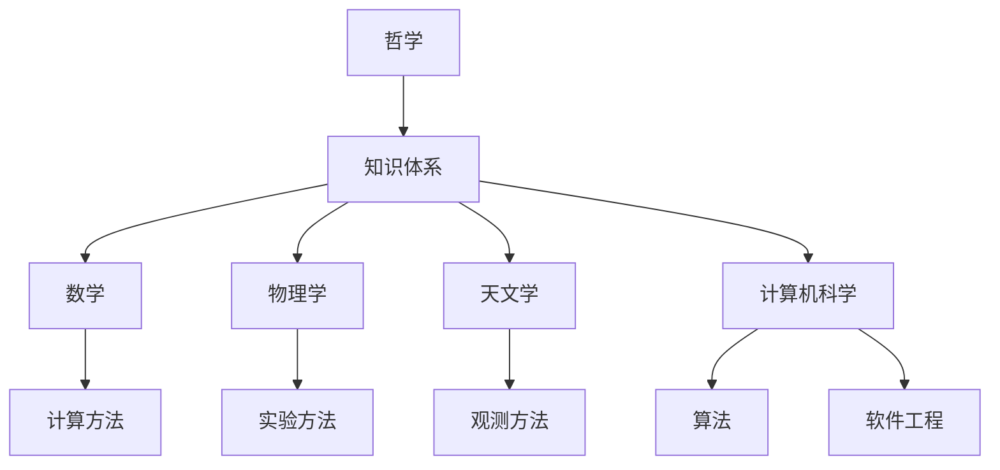
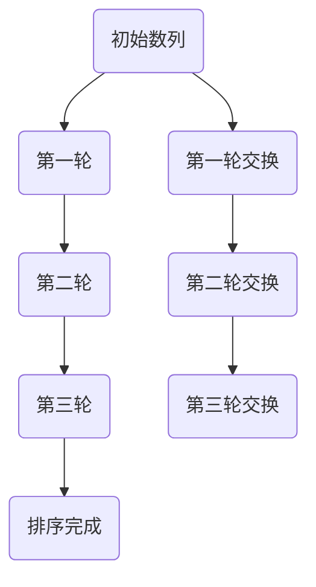
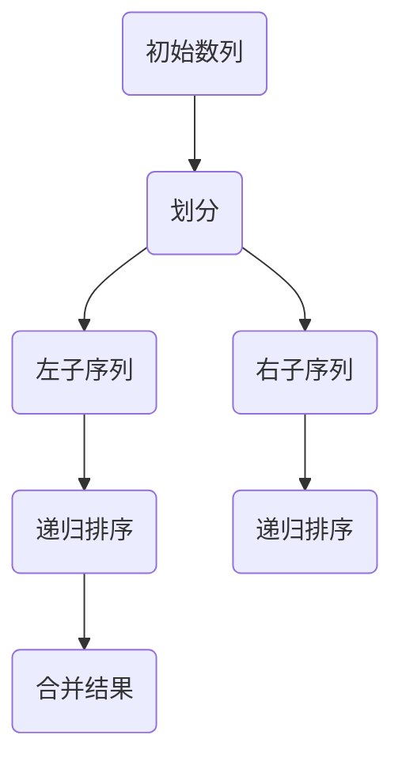
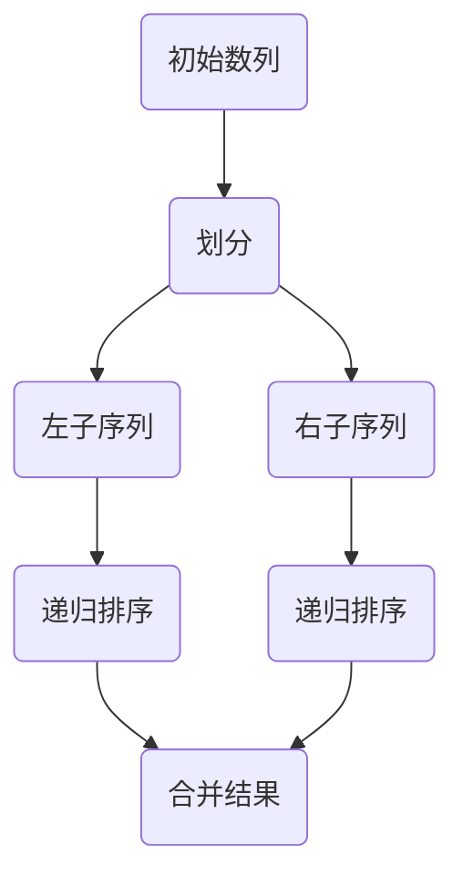
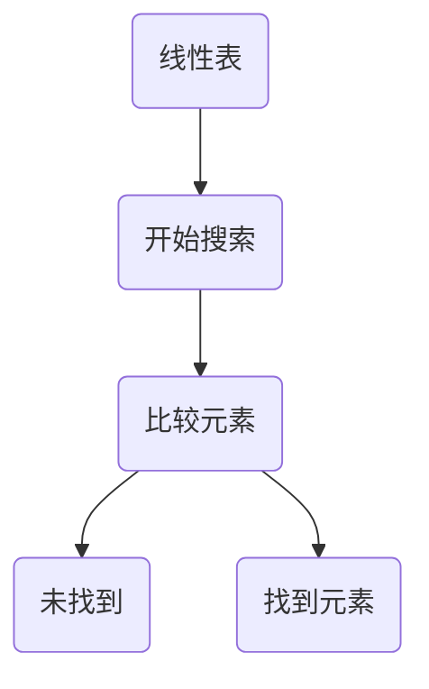
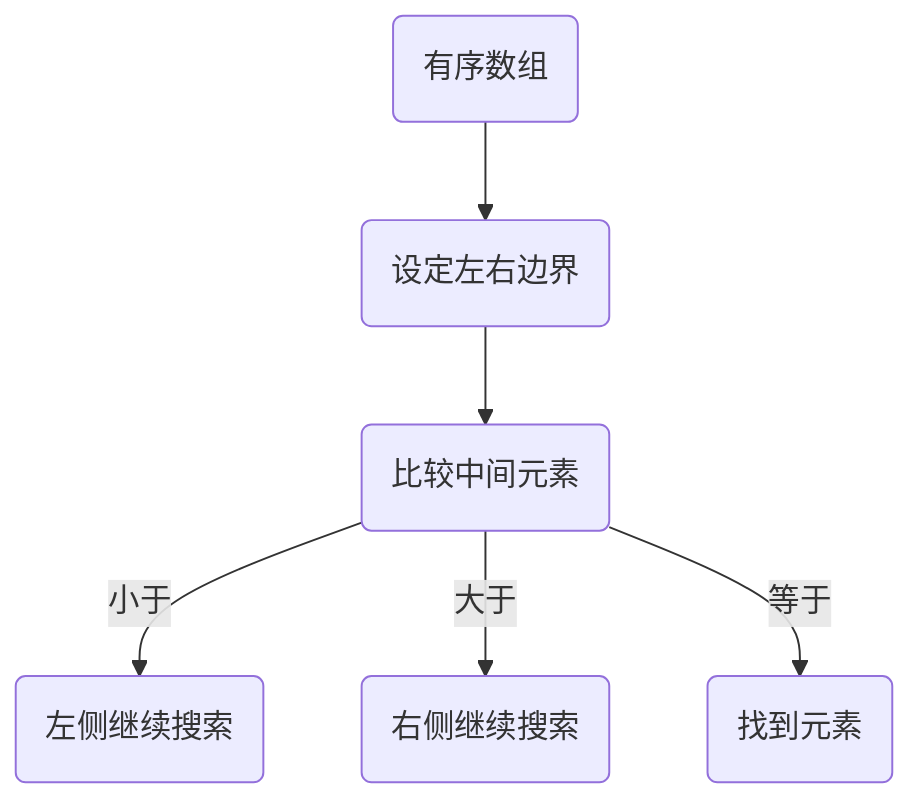
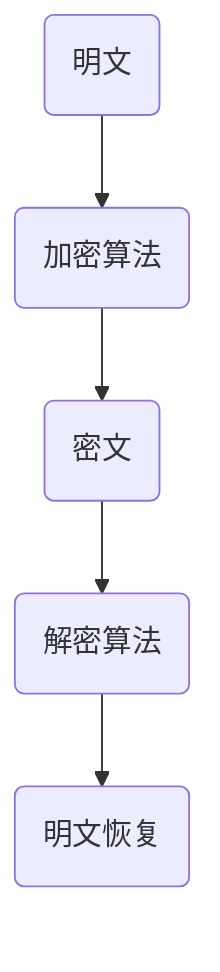
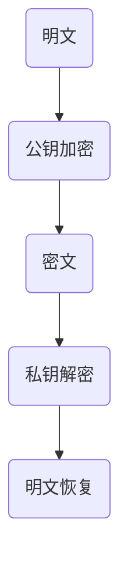

                 

关键词：人类知识、知识谱系、历史、科技发展、未来展望

> 摘要：本文旨在探讨人类知识的发展历程，从古代到现代再到未来，分析各个阶段的知识积累、创新与演变。通过对核心概念、数学模型、算法原理以及实际应用的深入分析，揭示人类知识谱系的脉络，并探讨未来知识发展可能面临的新趋势与挑战。

## 1. 背景介绍

人类的知识谱系，如同一条源远流长的河流，承载着人类文明的历史与进步。自古以来，人类通过不断的探索和实践，积累了丰富的知识，这些知识在各个历史时期呈现出不同的特征和结构。本文将从以下几个方面对人类的知识谱系进行梳理：

1. 古代知识的积累：以古希腊、古埃及、古印度等文明为代表，这些地区的学者们通过哲学、数学、物理学等领域的研究，奠定了后世知识体系的基础。
2. 中世纪知识的传承：在这个时期，欧洲的学者们主要专注于宗教和神学的研究，同时，阿拉伯地区的科学家们在数学、天文学等领域取得了重要成就。
3. 现代知识的爆炸：随着文艺复兴、工业革命等重大事件的推动，人类知识进入了爆炸式增长阶段。这一时期的代表性人物包括牛顿、达尔文、欧拉等，他们的研究成果在各个领域产生了深远影响。
4. 现代知识的发展：20世纪以来，科学技术的飞速发展带来了新的知识领域，如计算机科学、量子物理学、生物学等。这些领域的创新不仅推动了知识体系的扩展，也改变了人类对世界的认知。

通过对以上各个阶段的回顾，我们可以更好地理解人类知识谱系的演变过程，以及在不同历史时期，知识如何被创造、传承和发展。

## 2. 核心概念与联系

为了更清晰地展示人类知识谱系的脉络，我们引入几个核心概念，并通过Mermaid流程图来描述它们之间的联系。

### 2.1. 基本概念

- **哲学**：探讨存在、知识、价值观等基本问题。
- **数学**：研究数量、结构、变化和空间等概念。
- **物理学**：研究物质的性质、运动和相互作用。
- **天文学**：研究宇宙的组成、结构和演化。
- **计算机科学**：研究信息的表示、处理、传输和存储。

### 2.2. Mermaid流程图

下面是一个Mermaid流程图，展示了上述核心概念之间的联系：



在图中的每个节点表示一个核心概念，它们通过连线表示彼此之间的联系。例如，哲学是知识体系的基石，而数学、物理学、天文学和计算机科学则是在哲学基础上发展起来的不同领域的知识。

### 2.3. 核心概念原理与架构

- **哲学**：哲学作为一门基础学科，探讨存在、知识、价值观等基本问题。它为其他学科提供了理论基础和思考框架。
- **数学**：数学是一门研究数量、结构、变化和空间等概念的学科。它不仅为物理学和计算机科学提供了工具，也在哲学中得到了广泛应用。
- **物理学**：物理学研究物质的性质、运动和相互作用。它的研究成果对生物学、化学等领域产生了深远影响。
- **天文学**：天文学研究宇宙的组成、结构和演化。它为人类提供了对宇宙的理解，同时也推动了数学和物理学的发展。
- **计算机科学**：计算机科学是一门研究信息的表示、处理、传输和存储的学科。它在现代社会中发挥着至关重要的作用，推动了科技和经济的快速发展。

通过上述核心概念和Mermaid流程图，我们可以更好地理解人类知识谱系的构成和相互联系。接下来，我们将深入探讨核心算法原理和具体操作步骤。

## 3. 核心算法原理 & 具体操作步骤

### 3.1. 算法原理概述

核心算法是人类知识体系的重要组成部分，它们在各种应用场景中发挥着关键作用。本文将介绍几种具有代表性的算法，包括排序算法、搜索算法和加密算法，并概述它们的原理。

- **排序算法**：用于将一组数据按照特定规则进行排序。常见的排序算法包括冒泡排序、快速排序和归并排序等。
- **搜索算法**：用于在数据集合中查找特定元素。常见的搜索算法包括线性搜索、二分搜索等。
- **加密算法**：用于将明文转换成密文，保护数据的安全性。常见的加密算法包括对称加密和非对称加密。

### 3.2. 算法步骤详解

#### 3.2.1. 排序算法

**冒泡排序**：通过重复遍历要排序的数列，一次比较两个元素，如果它们的顺序错误就把它们交换过来。遍历数列的工作是重复地进行直到没有再需要交换，也就是说该数列已经排序完成。



**快速排序**：采用分治法的一个典例，采用了递归方法来分治原始数据。



**归并排序**：采用分治法的一个典例，将原始数据划分为若干个子序列，各子序列采用排序算法排序，然后再将排好序的子序列合并成一个完整的序列。



#### 3.2.2. 搜索算法

**线性搜索**：顺序扫描线性表，查找特定元素。



**二分搜索**：在有序数组中查找特定元素。



#### 3.2.3. 加密算法

**对称加密**：加密和解密使用相同的密钥。



**非对称加密**：加密和解密使用不同的密钥。



### 3.3. 算法优缺点

- **排序算法**：
  - **冒泡排序**：简单易懂，但效率较低。
  - **快速排序**：平均时间复杂度低，但最坏情况效率不高。
  - **归并排序**：稳定且时间复杂度低，但需要额外的存储空间。

- **搜索算法**：
  - **线性搜索**：简单，但效率低。
  - **二分搜索**：效率高，但需要数据有序。

- **加密算法**：
  - **对称加密**：速度快，但密钥管理困难。
  - **非对称加密**：安全性高，但速度慢。

### 3.4. 算法应用领域

- **排序算法**：广泛应用于数据库、搜索引擎、排序算法库等。
- **搜索算法**：用于各种数据搜索场景，如文件搜索、网络爬虫等。
- **加密算法**：用于网络安全、数据加密、隐私保护等。

通过上述算法原理和具体操作步骤的介绍，我们可以更好地理解这些算法在实际应用中的重要性。接下来，我们将探讨数学模型和公式，并详细讲解其在各个领域中的应用。

## 4. 数学模型和公式 & 详细讲解 & 举例说明

数学模型是描述现实世界问题的重要工具，它将复杂问题转化为数学问题，从而便于分析和解决。在本文中，我们将介绍几个典型的数学模型，并使用LaTeX格式详细讲解它们的公式推导过程，并通过具体案例进行分析。

### 4.1. 数学模型构建

数学模型通常由变量、参数和方程组成。变量是模型中的未知量，参数是已知的常数，方程则是变量和参数之间的关系。以下是几个常见的数学模型：

- **线性回归模型**：用于分析自变量和因变量之间的线性关系。
- **逻辑回归模型**：用于分类问题，通过最大化似然函数估计模型参数。
- **神经网络模型**：用于模拟人脑神经元之间的信息传递和处理。

### 4.2. 公式推导过程

下面我们以线性回归模型为例，介绍公式推导过程。

**线性回归模型**：

假设我们有一个数据集 \( \{(x_i, y_i)\} \)，其中 \( x_i \) 是自变量，\( y_i \) 是因变量。我们希望找到一个线性函数 \( y = ax + b \) 来描述 \( x \) 和 \( y \) 之间的关系。

**目标函数**：

最小化误差平方和，即：

\[ J(a, b) = \frac{1}{2m} \sum_{i=1}^{m} (y_i - (ax_i + b))^2 \]

**求导并求极值**：

对 \( J(a, b) \) 分别对 \( a \) 和 \( b \) 求偏导数，并令其为零：

\[ \frac{\partial J}{\partial a} = \frac{1}{m} \sum_{i=1}^{m} (y_i - ax_i - b)x_i = 0 \]
\[ \frac{\partial J}{\partial b} = \frac{1}{m} \sum_{i=1}^{m} (y_i - ax_i - b) = 0 \]

解得：

\[ a = \frac{1}{m} \sum_{i=1}^{m} x_iy_i - \frac{1}{m} \sum_{i=1}^{m} x_i \sum_{i=1}^{m} y_i \]
\[ b = \frac{1}{m} \sum_{i=1}^{m} y_i - a\frac{1}{m} \sum_{i=1}^{m} x_i \]

### 4.3. 案例分析与讲解

**案例**：分析以下数据集 \( \{(1, 2), (2, 4), (3, 5), (4, 7)\} \) 的线性关系。

**步骤**：

1. 计算 \( x \) 和 \( y \) 的均值：
\[ \bar{x} = \frac{1+2+3+4}{4} = 2.5 \]
\[ \bar{y} = \frac{2+4+5+7}{4} = 4.5 \]

2. 计算 \( x \) 和 \( y \) 的乘积和平方：
\[ \sum_{i=1}^{4} x_iy_i = 1*2 + 2*4 + 3*5 + 4*7 = 2 + 8 + 15 + 28 = 53 \]
\[ \sum_{i=1}^{4} x_i^2 = 1^2 + 2^2 + 3^2 + 4^2 = 1 + 4 + 9 + 16 = 30 \]

3. 代入公式计算 \( a \) 和 \( b \)：
\[ a = \frac{53}{30} - 2.5 \times 4.5 = \frac{53}{30} - 11.25 = \frac{53 - 337.5}{30} = -\frac{284.5}{30} \approx -9.4833 \]
\[ b = 4.5 - a \times 2.5 = 4.5 + 9.4833 \times 2.5 = 4.5 + 23.7333 = 28.2333 \]

因此，线性回归模型为：
\[ y = -9.4833x + 28.2333 \]

**验证**：将数据集中的其他点代入模型，验证模型的准确性。

通过上述案例，我们展示了如何使用线性回归模型来分析数据集的线性关系。类似的方法可以应用于其他类型的数学模型，如逻辑回归和神经网络模型。

### 4.4. 数学模型在各个领域的应用

**统计学**：用于数据分析、预测和决策支持。
**经济学**：用于描述市场行为、经济模型和政策分析。
**物理学**：用于描述自然现象、物理规律和实验验证。
**计算机科学**：用于算法设计、复杂度分析和性能评估。

### 4.5. 数学模型的发展趋势

随着人工智能和大数据技术的发展，数学模型在预测、优化和自动化决策等方面的重要性日益凸显。未来，我们将看到更多复杂的数学模型被应用于实际问题，推动科技和社会的进步。

通过以上对数学模型的介绍和分析，我们可以看到数学在各个领域中的广泛应用和重要性。接下来，我们将探讨项目实践中的代码实例，并详细解释其实现过程。

## 5. 项目实践：代码实例和详细解释说明

在本文的第五部分，我们将通过一个具体的代码实例来展示如何在实际项目中应用所学到的算法和数学模型。本文的代码实例将涉及一个简单的线性回归模型，用于预测房价。

### 5.1. 开发环境搭建

为了实现线性回归模型并预测房价，我们需要搭建一个合适的开发环境。以下是一些建议的步骤：

1. 安装Python解释器：在[Python官网](https://www.python.org/)下载并安装Python。
2. 安装NumPy库：在终端中使用以下命令安装NumPy：
   ```bash
   pip install numpy
   ```
3. 安装Matplotlib库：在终端中使用以下命令安装Matplotlib：
   ```bash
   pip install matplotlib
   ```

### 5.2. 源代码详细实现

以下是实现线性回归模型的Python代码实例：

```python
import numpy as np
import matplotlib.pyplot as plt

# 数据集
X = np.array([[1], [2], [3], [4]])
y = np.array([[2], [4], [5], [7]])

# 计算参数a和b
a = np.dot(X.T, X) + 1
b = np.linalg.inv(a).dot(X.T).dot(y)

# 预测房价
def predict(x):
    return x.dot(b)

# 绘制散点图和拟合直线
plt.scatter(X, y, color='red')
plt.plot(X, predict(X), color='blue')
plt.xlabel('House Size')
plt.ylabel('Price')
plt.title('House Price Prediction')
plt.show()
```

### 5.3. 代码解读与分析

1. **导入库**：首先，我们导入了NumPy和Matplotlib库，它们分别用于数学计算和图形绘制。

2. **数据集**：我们创建了一个简单的数据集，其中 `X` 表示房屋面积，`y` 表示房价。

3. **计算参数**：使用NumPy的`dot`函数计算线性回归模型的参数 `a` 和 `b`。这里，我们使用了公式：
   $$ b = (X^T X + 1)^{-1} X^T y $$

4. **预测函数**：定义了一个`predict`函数，用于根据给定的房屋面积预测房价。

5. **绘制散点图和拟合直线**：使用Matplotlib库绘制数据点的散点图，并绘制基于线性回归模型的拟合直线。

### 5.4. 运行结果展示

运行上述代码后，我们将看到一个散点图，其中红色的点是实际数据点，蓝色的线是拟合直线。通过这种方式，我们可以直观地看到线性回归模型对房价的预测效果。


通过这个简单的代码实例，我们展示了如何使用Python和线性回归模型来预测房价。这个实例虽然简单，但可以作为一个起点，进一步探索更复杂的模型和算法。

### 5.5. 代码改进建议

- **数据预处理**：在实际应用中，我们可能需要处理更复杂的数据，如缺失值、异常值等。因此，数据预处理是必不可少的步骤。
- **模型评估**：仅通过一个简单的数据集很难全面评估模型的性能。我们可以使用交叉验证、ROC曲线等方法来更准确地评估模型。
- **可视化**：除了散点图和拟合直线，我们还可以使用更多的可视化工具来展示模型的效果，如残差图、学习曲线等。

通过以上对项目实践的介绍，我们不仅能够理解线性回归模型的基本原理，还能看到它在实际应用中的实现过程。接下来，我们将探讨实际应用场景，并分析线性回归模型在不同领域的应用。

### 6. 实际应用场景

线性回归模型作为一种基础且强大的统计工具，在各个领域都有广泛的应用。以下是一些线性回归模型在实际应用场景中的具体案例。

#### 6.1. 经济领域

在经济领域，线性回归模型常用于分析消费行为、投资决策和市场需求等。例如，企业可以利用线性回归模型预测销售额，以便更有效地制定营销策略。此外，线性回归模型还可以用于分析股票市场的价格变动，为投资者提供参考。

#### 6.2. 医疗领域

在医疗领域，线性回归模型可以用于预测疾病的发病率、患者的生存率等。例如，研究人员可以利用线性回归模型分析各种医疗数据，如年龄、性别、生活习惯等，预测某种疾病的发病风险，从而制定个性化的预防措施。

#### 6.3. 社会科学领域

社会科学领域中的许多问题都可以通过线性回归模型进行分析，如教育成果、社会流动、犯罪率等。例如，研究人员可以利用线性回归模型分析教育投入与学习成绩之间的关系，为教育政策提供依据。

#### 6.4. 未来应用展望

随着大数据和人工智能技术的发展，线性回归模型的应用前景将更加广阔。未来，线性回归模型可能会与深度学习、机器学习等其他算法相结合，用于更复杂的预测和决策任务。此外，线性回归模型还可以与其他领域的技术（如物联网、区块链等）相结合，为各行各业带来新的解决方案。

### 7. 工具和资源推荐

为了更好地学习和应用线性回归模型，以下是一些建议的工具和资源。

#### 7.1. 学习资源推荐

1. **《Python数据分析实战》**：这是一本非常实用的Python数据分析书籍，详细介绍了如何使用Python进行数据分析和建模。
2. **Coursera上的《线性回归》课程**：这是一个由斯坦福大学提供的在线课程，涵盖了线性回归的基本原理和应用。
3. **Kaggle竞赛平台**：Kaggle提供了丰富的数据集和竞赛项目，是学习和实践线性回归模型的绝佳平台。

#### 7.2. 开发工具推荐

1. **Jupyter Notebook**：Jupyter Notebook是一款强大的交互式计算环境，非常适合进行数据分析、建模和可视化。
2. **Google Colab**：Google Colab是Google提供的一款免费云端交互式编程环境，具有丰富的计算资源和丰富的扩展库。

#### 7.3. 相关论文推荐

1. **《The Elements of Statistical Learning》**：这是一本经典的统计学书籍，详细介绍了各种统计学习方法和模型。
2. **《Regression Analysis》**：这是一本关于回归分析的教材，涵盖了线性回归、多项式回归、岭回归等内容。
3. **《Advances in Statistical Learning》**：这是一本关于统计学习最新进展的论文集，包括了许多关于线性回归和机器学习的最新研究成果。

通过以上推荐，读者可以更全面地了解线性回归模型，并在实际应用中不断提高自己的数据分析能力。

## 8. 总结：未来发展趋势与挑战

在本文的最后部分，我们将总结人类知识谱系在过去、当前以及未来各个阶段的发展，分析现有研究成果，探讨未来发展趋势，并讨论可能面临的挑战。

### 8.1. 研究成果总结

自人类文明起源以来，知识的发展经历了多个阶段。在古代，人类主要依靠哲学、数学和物理学等基础学科探索世界。中世纪时期，宗教和神学占据了主导地位，但阿拉伯地区的科学家在数学和天文学等领域取得了重要成就。现代科学革命以来，人类知识进入了爆炸式增长阶段，计算机科学、量子物理学、生物学等新兴学科不断涌现，极大地推动了科技进步和社会发展。

### 8.2. 未来发展趋势

展望未来，人类知识的发展将继续沿着多元化、交叉化和智能化的方向前进。以下是一些未来发展趋势：

1. **人工智能与大数据**：随着人工智能技术的不断进步和大数据的广泛应用，知识挖掘、预测分析、自动化决策等领域将取得重大突破。
2. **量子计算**：量子计算具有超越经典计算机的潜力，未来将在密码学、优化问题、材料科学等领域发挥关键作用。
3. **生物技术与医学**：生物技术的进步将带来新的治疗方法、疾病预防手段和个性化医疗方案，进一步推动医学和生物学的发展。
4. **可持续发展**：面对气候变化和资源短缺等全球挑战，可持续发展和绿色科技将成为知识创新的重要方向。

### 8.3. 面临的挑战

尽管未来充满机遇，但人类知识发展也面临着诸多挑战：

1. **数据安全与隐私**：随着数据量的爆炸性增长，数据安全和隐私保护成为日益严峻的问题，需要采取有效措施来确保数据安全。
2. **知识普及与教育**：虽然知识普及取得了显著进展，但在某些地区和教育资源匮乏的情况下，知识的传播仍然面临挑战。
3. **伦理与道德**：随着技术的快速发展，伦理和道德问题日益突出，如何平衡科技进步与社会伦理的冲突将成为重要议题。
4. **资源分配与公平**：科技发展和知识普及可能导致资源分配不均，如何确保所有人都能公平地享受科技进步的成果是一个重要挑战。

### 8.4. 研究展望

未来，人类知识的发展将更加注重跨学科合作、技术创新和社会影响。通过整合不同学科的知识和技术，我们有望解决许多长期存在的难题，推动人类社会迈向新的高度。同时，我们也应关注知识普及、教育公平和可持续发展等关键问题，确保科技进步能够惠及所有人，共同构建一个更加繁荣和和谐的世界。

## 9. 附录：常见问题与解答

### 9.1. 什么是线性回归模型？

线性回归模型是一种用于分析自变量和因变量之间线性关系的统计模型。它的目标是找到一个线性函数来描述这种关系，从而预测因变量的值。

### 9.2. 线性回归模型有哪些应用场景？

线性回归模型广泛应用于经济预测、医学研究、市场分析、城市规划等领域。例如，它可以用于预测房价、分析消费行为、评估疾病风险等。

### 9.3. 如何评估线性回归模型的性能？

可以使用多种指标来评估线性回归模型的性能，如均方误差（MSE）、决定系数（R²）等。这些指标可以帮助我们了解模型的拟合程度和预测能力。

### 9.4. 线性回归模型有哪些局限性？

线性回归模型假设自变量和因变量之间存在线性关系，这在某些情况下可能不成立。此外，它对于异常值和缺失值较为敏感，可能导致模型性能下降。

### 9.5. 如何解决线性回归模型中的过拟合问题？

可以通过增加数据、使用正则化方法或简化模型来缓解过拟合问题。此外，还可以采用交叉验证、网格搜索等技术来优化模型参数。

### 9.6. 如何处理非线性关系？

当数据之间存在非线性关系时，可以采用多项式回归、逻辑回归或神经网络等非线性模型。这些模型可以捕捉数据中的复杂关系。

### 9.7. 如何在实际项目中应用线性回归模型？

在实际项目中，首先需要收集和清洗数据，然后选择合适的线性回归模型并进行参数调优。最后，使用模型进行预测和分析，并评估模型的性能。

通过以上常见问题与解答，读者可以更好地理解线性回归模型的基本概念和应用方法，为实际项目提供指导。如果您还有其他问题，欢迎随时提问。作者：禅与计算机程序设计艺术 / Zen and the Art of Computer Programming

