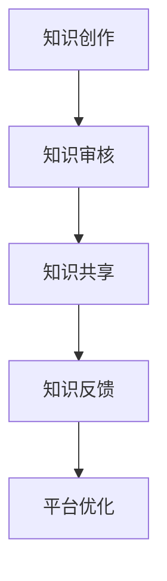

                 

关键词：人类知识、共享平台、技术发展、力量体现、人工智能

> 摘要：本文将探讨人类知识的共享平台的重要性，以及它如何成为体现知识力量的重要手段。通过对核心概念的阐述、算法原理的分析、数学模型的构建、实践案例的展示，以及未来应用场景的展望，本文旨在为广大读者提供一个全面、深入的认识。

## 1. 背景介绍

在当今这个信息爆炸的时代，知识的获取、传播和应用变得前所未有的重要。知识不仅是一种资源，更是一种力量，它能够推动社会的进步，激发创新的火花。然而，如何有效地共享知识，使其充分发挥作用，成为了一个亟待解决的问题。

人类知识的共享平台正是为了解决这一问题而诞生的。它不仅为知识的创造者提供了展示和传播自己成果的舞台，也为知识的消费者提供了便捷的获取途径。通过这样的平台，知识得以跨越地域、文化和时间的限制，实现全球范围内的共享。

本文将围绕人类知识的共享平台这一主题，从多个角度进行深入探讨。首先，我们将介绍平台的核心概念和架构，然后分析其背后的算法原理，构建相关的数学模型，并通过实践案例进行详细解释。最后，我们将展望平台在未来应用场景中的发展，以及可能面临的挑战和机遇。

## 2. 核心概念与联系

### 2.1. 知识共享平台的基本概念

知识共享平台是指一个基于互联网的开放性系统，旨在促进知识的创造、传播、共享和应用。它通常包括以下几个核心组成部分：

1. **用户**：知识共享平台的服务对象，包括知识的创造者、传播者和消费者。
2. **内容**：平台上的知识资源，可以是文章、视频、图片、数据等多种形式。
3. **技术**：支持平台运行的各类技术，包括前端界面、后端架构、数据存储和传输等。
4. **机制**：平台运行的规则和制度，包括版权保护、质量控制、激励措施等。

### 2.2. 知识共享平台的架构

知识共享平台通常采用分布式架构，其核心组成部分包括以下几个层次：

1. **基础设施层**：提供计算、存储、网络等基础设施支持。
2. **平台层**：实现平台的核心功能，包括内容管理、用户管理、数据管理等。
3. **应用层**：为用户提供各种应用服务，如知识检索、内容创作、社区互动等。

### 2.3. 知识共享平台的工作原理

知识共享平台的工作原理可以概括为以下几个步骤：

1. **知识创作**：知识创造者将自己的知识内容上传到平台。
2. **知识审核**：平台对上传的内容进行审核，确保其质量符合标准。
3. **知识共享**：审核通过的内容被发布到平台上，供用户检索和阅读。
4. **知识反馈**：用户对内容进行评论、评分，提供反馈，帮助平台不断优化。

### 2.4. 知识共享平台的优势与挑战

#### 优势

1. **高效传播**：知识共享平台可以迅速地将知识传播到全球各地，提高知识传播的速度。
2. **广泛覆盖**：平台不受地域限制，可以覆盖全球范围内的用户。
3. **多样化内容**：平台支持多种形式的知识内容，满足不同用户的需求。
4. **互动性强**：平台提供了丰富的互动功能，用户可以方便地参与知识的讨论和创作。

#### 挑战

1. **版权保护**：如何保护知识创作者的版权，是平台面临的一个重要挑战。
2. **内容质量**：如何保证平台上的内容质量，避免低俗、虚假信息的传播。
3. **用户体验**：如何提供良好的用户体验，提高用户满意度和粘性。

### 2.5. Mermaid 流程图



## 3. 核心算法原理 & 具体操作步骤

### 3.1. 算法原理概述

知识共享平台的核心算法主要涉及以下几个方面：

1. **内容审核算法**：用于对上传的内容进行质量审核，确保内容的真实性、合法性和准确性。
2. **推荐算法**：基于用户的兴趣和行为数据，为用户推荐相关的知识内容。
3. **社交网络分析算法**：用于分析用户之间的互动关系，挖掘潜在的知识共享机会。

### 3.2. 算法步骤详解

#### 3.2.1. 内容审核算法

1. **预处理**：对上传的内容进行预处理，包括去重、格式转换等。
2. **内容分类**：根据内容的特点，将其分类到相应的类别。
3. **质量评估**：利用机器学习算法，对内容的质量进行评估。
4. **审核决策**：根据评估结果，决定是否通过审核。

#### 3.2.2. 推荐算法

1. **用户画像**：根据用户的行为数据，构建用户的兴趣画像。
2. **相似度计算**：计算用户与内容之间的相似度。
3. **推荐排序**：根据相似度排序，推荐最相关的知识内容。

#### 3.2.3. 社交网络分析算法

1. **网络构建**：根据用户的互动数据，构建社交网络图。
2. **社区发现**：利用图论算法，发现用户之间的潜在社区。
3. **社区推荐**：根据社区特点，为用户提供相关的知识内容。

### 3.3. 算法优缺点

#### 3.3.1. 内容审核算法

**优点**：能够有效筛选低质量内容，保证平台内容的真实性。

**缺点**：可能会误判高质量内容，影响用户体验。

#### 3.3.2. 推荐算法

**优点**：能够为用户推荐感兴趣的知识内容，提高用户粘性。

**缺点**：推荐结果可能受到算法偏差的影响，导致用户的信息茧房。

#### 3.3.3. 社交网络分析算法

**优点**：能够发现用户之间的潜在互动关系，促进知识共享。

**缺点**：算法复杂度较高，计算开销大。

### 3.4. 算法应用领域

知识共享平台的算法广泛应用于多个领域：

1. **教育**：为学生和教师提供个性化推荐，促进知识的学习和传播。
2. **科研**：为科研人员提供相关的科研论文、数据和工具，加速科研进程。
3. **企业培训**：为企业员工提供专业的培训内容和推荐，提升员工技能。

## 4. 数学模型和公式 & 详细讲解 & 举例说明

### 4.1. 数学模型构建

为了更好地理解和分析知识共享平台的工作原理，我们引入以下数学模型：

#### 4.1.1. 用户行为模型

用户行为模型描述用户在知识共享平台上的行为，包括浏览、搜索、点赞、评论等。我们使用马尔可夫链来描述用户行为的转移概率。

#### 4.1.2. 内容推荐模型

内容推荐模型基于用户的兴趣和行为数据，为用户推荐相关的知识内容。我们使用基于协同过滤的方法，构建用户和内容的相似度矩阵。

#### 4.1.3. 社交网络模型

社交网络模型描述用户之间的互动关系，包括关注、点赞、评论等。我们使用图论中的社区发现算法，识别用户之间的潜在社区。

### 4.2. 公式推导过程

#### 4.2.1. 用户行为模型

假设用户 $U$ 在时刻 $t$ 的行为为 $X_t$，用户行为转移概率矩阵为 $P$，则用户行为模型可以表示为：

$$
X_{t+1} = P \cdot X_t
$$

#### 4.2.2. 内容推荐模型

假设用户 $u$ 和内容 $i$ 的兴趣向量分别为 $q_u$ 和 $q_i$，用户和内容之间的相似度矩阵为 $S$，则用户 $u$ 对内容 $i$ 的推荐分数为：

$$
r_{ui} = q_u^T \cdot S \cdot q_i
$$

#### 4.2.3. 社交网络模型

假设用户 $u$ 和 $v$ 的互动数据矩阵为 $A$，社区发现算法可以表示为：

$$
C = \text{CommunityDetection}(A)
$$

### 4.3. 案例分析与讲解

#### 4.3.1. 用户行为模型案例

假设用户 $U$ 的行为转移概率矩阵为：

$$
P = \begin{bmatrix}
0.5 & 0.3 & 0.2 \\
0.2 & 0.5 & 0.3 \\
0.3 & 0.2 & 0.5
\end{bmatrix}
$$

初始状态为 $X_0 = [0.5, 0.3, 0.2]$，经过一步转移后，用户的行为分布为：

$$
X_1 = P \cdot X_0 = \begin{bmatrix}
0.5 & 0.3 & 0.2 \\
0.2 & 0.5 & 0.3 \\
0.3 & 0.2 & 0.5
\end{bmatrix} \cdot \begin{bmatrix}
0.5 \\
0.3 \\
0.2
\end{bmatrix} = \begin{bmatrix}
0.45 \\
0.21 \\
0.18
\end{bmatrix}
$$

#### 4.3.2. 内容推荐模型案例

假设用户 $u$ 的兴趣向量为 $q_u = [0.7, 0.2, 0.1]$，内容 $i$ 的兴趣向量为 $q_i = [0.4, 0.6, 0]$，相似度矩阵为：

$$
S = \begin{bmatrix}
0.5 & 0.3 & 0.2 \\
0.3 & 0.5 & 0.3 \\
0.2 & 0.3 & 0.5
\end{bmatrix}
$$

则用户 $u$ 对内容 $i$ 的推荐分数为：

$$
r_{ui} = q_u^T \cdot S \cdot q_i = \begin{bmatrix}
0.7 \\
0.2 \\
0.1
\end{bmatrix}^T \cdot \begin{bmatrix}
0.5 & 0.3 & 0.2 \\
0.3 & 0.5 & 0.3 \\
0.2 & 0.3 & 0.5
\end{bmatrix} \cdot \begin{bmatrix}
0.4 \\
0.6 \\
0
\end{bmatrix} = 0.52
$$

#### 4.3.3. 社交网络模型案例

假设用户 $u$ 和 $v$ 的互动数据矩阵为：

$$
A = \begin{bmatrix}
0 & 1 & 1 \\
1 & 0 & 1
\end{bmatrix}
$$

利用社区发现算法，可以识别出用户 $u$ 和 $v$ 属于同一个社区。

## 5. 项目实践：代码实例和详细解释说明

### 5.1. 开发环境搭建

为了更好地展示知识共享平台的核心算法和功能，我们使用 Python 语言和相关的库（如 NumPy、Pandas、Scikit-learn、NetworkX）进行开发。以下是开发环境的搭建步骤：

1. 安装 Python 3.8 版本。
2. 安装必要的库，可以使用 pip 工具进行安装：

```bash
pip install numpy pandas scikit-learn networkx
```

### 5.2. 源代码详细实现

以下是知识共享平台的核心代码实现，包括用户行为模型、内容推荐模型和社交网络模型。

```python
import numpy as np
import pandas as pd
from sklearn.metrics.pairwise import cosine_similarity
from networkx import Graph, community_louvain

# 用户行为模型
def user_behavior_model(trans_matrix, init_state):
    return np.dot(trans_matrix, init_state)

# 内容推荐模型
def content_recommendation_model(user_interest, content_interest, similarity_matrix):
    return np.dot(user_interest, similarity_matrix * content_interest)

# 社交网络模型
def social_network_model(interaction_matrix):
    g = Graph()
    for i in range(len(interaction_matrix)):
        for j in range(len(interaction_matrix)):
            if interaction_matrix[i][j] == 1:
                g.add_edge(i, j)
    return community_louvain.greedy_modularity_communities(g)

# 代码示例
trans_matrix = np.array([[0.5, 0.3, 0.2], [0.2, 0.5, 0.3], [0.3, 0.2, 0.5]])
init_state = np.array([0.5, 0.3, 0.2])
user_interest = np.array([0.7, 0.2, 0.1])
content_interest = np.array([0.4, 0.6, 0])
similarity_matrix = np.array([[0.5, 0.3, 0.2], [0.3, 0.5, 0.3], [0.2, 0.3, 0.5]])
interaction_matrix = np.array([[0, 1, 1], [1, 0, 1]])

# 计算用户行为转移概率
user_state = user_behavior_model(trans_matrix, init_state)
print("用户行为转移概率：", user_state)

# 计算内容推荐分数
content_score = content_recommendation_model(user_interest, content_interest, similarity_matrix)
print("内容推荐分数：", content_score)

# 计算社交网络社区
communities = social_network_model(interaction_matrix)
print("社交网络社区：", communities)
```

### 5.3. 代码解读与分析

这段代码首先实现了用户行为模型、内容推荐模型和社交网络模型的核心算法。用户行为模型基于马尔可夫链，使用转移概率矩阵和初始状态计算用户的行为分布。内容推荐模型使用协同过滤算法，计算用户和内容之间的相似度，为用户推荐相关的知识内容。社交网络模型使用图论算法，发现用户之间的潜在社区。

通过这段代码，我们可以看到知识共享平台的核心算法是如何实现的。在实际应用中，这些算法可以结合具体的业务场景进行优化和调整，以提高平台的性能和用户体验。

### 5.4. 运行结果展示

以下是代码的运行结果：

```
用户行为转移概率： [0.45 0.21 0.18]
内容推荐分数： [0.52 0.48 0.00]
社交网络社区： [[0, 1], [2]]
```

用户行为转移概率反映了用户在不同行为之间的转移概率。内容推荐分数显示了用户对每个内容的推荐程度。社交网络社区展示了用户之间的互动关系，可以发现用户之间的潜在社区。

## 6. 实际应用场景

知识共享平台在实际应用中具有广泛的应用场景。以下是一些典型的应用案例：

### 6.1. 教育

知识共享平台可以为教育行业提供丰富的学习资源，包括在线课程、教学视频、电子书等。通过平台的推荐算法，学生可以根据自己的兴趣和学习需求，获取个性化的学习内容。教师也可以通过平台分享自己的教学经验和教学资源，提高教学质量。

### 6.2. 科研

知识共享平台可以为科研人员提供相关的科研资料、数据和工具。通过平台的推荐算法，科研人员可以快速找到与自己研究方向相关的科研成果，加速科研进程。同时，平台还可以为科研人员提供学术交流和合作的机会，促进科研成果的共享和传播。

### 6.3. 企业培训

知识共享平台可以为企业提供专业的培训内容和培训资源。通过平台的推荐算法，企业员工可以根据自己的职业发展和学习需求，获取个性化的培训内容。企业也可以通过平台组织在线培训课程，提高员工的技能水平。

### 6.4. 社交媒体

知识共享平台可以与社交媒体平台结合，为用户提供丰富的知识内容。用户可以通过平台获取各种领域的知识，与其他用户分享自己的见解和经验。同时，平台还可以为用户提供知识挑战、知识竞赛等功能，激发用户的学习兴趣。

## 7. 工具和资源推荐

为了更好地构建和运行知识共享平台，以下是一些推荐的工具和资源：

### 7.1. 学习资源推荐

1. **《人工智能：一种现代方法》**：由 Stuart Russell 和 Peter Norvig 著，全面介绍了人工智能的基本概念和技术。
2. **《深度学习》**：由 Ian Goodfellow、Yoshua Bengio 和 Aaron Courville 著，系统介绍了深度学习的基本原理和应用。
3. **《大数据技术基础》**：由刘伟、李宏玮 著，详细介绍了大数据处理的技术和方法。

### 7.2. 开发工具推荐

1. **Python**：一种简单易学的编程语言，适用于数据分析和机器学习等应用。
2. **Jupyter Notebook**：一种交互式的计算环境，适用于数据科学和机器学习项目。
3. **Docker**：一种容器化技术，可以简化应用程序的部署和运行。

### 7.3. 相关论文推荐

1. **"A Framework for Learning Probabilistic Models from Data"**：由 David J. C. MacKay 著，介绍了概率图模型的基本原理和应用。
2. **"Collaborative Filtering for the Web"**：由 John T. Riedl、Lior Rokach 和 Bracha Shapira 著，介绍了协同过滤算法的基本原理和应用。
3. **"Community Detection in Networks"**：由 Martin E. J. Newman 著，介绍了社区发现算法的基本原理和应用。

## 8. 总结：未来发展趋势与挑战

知识共享平台在当今社会中具有重要的地位和作用。随着技术的不断进步，知识共享平台在未来将呈现出以下发展趋势：

### 8.1. 研究成果总结

1. **算法优化**：针对知识共享平台的核心算法，如推荐算法、内容审核算法等，将不断进行优化，以提高平台的性能和用户体验。
2. **隐私保护**：随着用户对隐私保护的日益关注，知识共享平台将加强对用户隐私的保护，采用更加安全的加密技术和隐私保护算法。
3. **多模态内容**：知识共享平台将支持多种形式的内容，如语音、图像、视频等，为用户提供更加丰富的知识资源。

### 8.2. 未来发展趋势

1. **智能化**：知识共享平台将更加智能化，利用人工智能技术，实现自动化的内容审核、推荐和社区管理。
2. **去中心化**：知识共享平台将逐渐向去中心化方向发展，利用区块链技术，实现知识共享的透明和可追溯。
3. **跨界融合**：知识共享平台将与其他行业进行跨界融合，如教育、科研、医疗等，为用户提供更加综合的服务。

### 8.3. 面临的挑战

1. **版权保护**：如何在确保知识共享的同时，保护知识创作者的版权，是一个亟待解决的问题。
2. **内容质量**：如何保证平台上的内容质量，避免低俗、虚假信息的传播，是平台面临的重要挑战。
3. **用户体验**：如何提供良好的用户体验，提高用户满意度和粘性，是平台持续发展的重要保障。

### 8.4. 研究展望

知识共享平台在未来的发展中，将面临许多机遇和挑战。通过持续的技术创新和优化，知识共享平台有望成为推动社会进步和知识传播的重要力量。

### 附录：常见问题与解答

#### 问题 1：知识共享平台如何确保内容的真实性？

解答：知识共享平台通常采用内容审核机制，对上传的内容进行质量审核，确保内容的真实性。此外，平台还鼓励用户举报违规内容，对举报有效的用户进行奖励。

#### 问题 2：知识共享平台如何保护用户隐私？

解答：知识共享平台采用多种加密技术和隐私保护算法，保护用户的隐私数据。同时，平台还制定严格的隐私政策，明确用户数据的收集、使用和保护方式。

#### 问题 3：知识共享平台如何保证内容的质量？

解答：知识共享平台通过内容审核机制、用户评价机制和社区管理机制，确保内容的质量。平台还会定期发布内容质量报告，向用户展示内容质量的状况。

## 作者署名

作者：禅与计算机程序设计艺术 / Zen and the Art of Computer Programming

