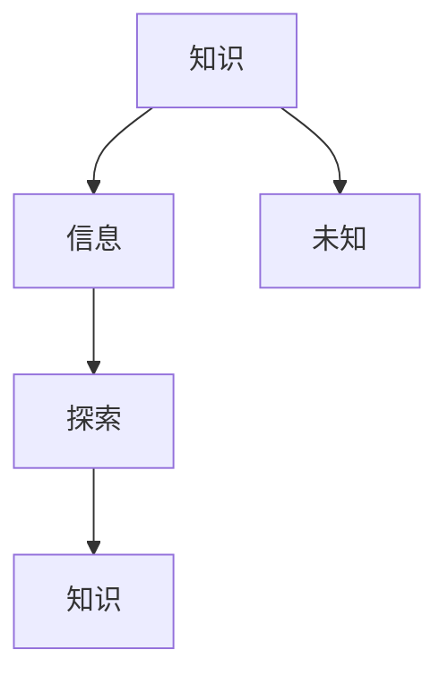

                 

关键词：人类知识、局限性、未知、技术进步、科学研究、探索

> 摘要：本文从科学和技术的发展角度，探讨了人类知识的局限性以及我们如何承认和尊重未知。通过分析人类认知的边界、技术进步带来的影响，以及未知领域的重要性，提出了应对知识局限性的策略和方法，并展望了未来科学探索的前景。

## 1. 背景介绍

在人类的漫长历史中，知识一直是我们追求的目标。从早期的哲学思考到现代的科学探索，我们一直在不断积累和扩展我们的知识体系。然而，随着我们对世界的了解越来越深入，我们也逐渐意识到人类知识的局限性。在这个充满挑战和机遇的时代，如何承认并尊重未知，成为了我们亟待解决的重要课题。

### 1.1 人类认知的边界

人类认知的边界是一个复杂而多层次的问题。从哲学角度来看，人类的认知能力受到感官、思维和认知框架的限制。例如，我们无法感知到微观世界的量子状态，也无法直接观察到宏观宇宙的起源和演化。这些限制使得我们无法完全理解世界的本质。

从科学角度来看，人类的认知边界同样存在。虽然科学方法使得我们能够发现和验证知识，但科学知识也具有局限性和时效性。例如，牛顿力学在经典物理学领域取得了巨大的成功，但在接近光速的极端条件下，其局限性变得明显，需要相对论来进行修正。

### 1.2 技术进步的影响

技术进步在某种程度上改变了人类对知识局限性的认识。计算机科学、通信技术、生物技术等领域的突破，使得我们能够处理和分析以前无法想象的大量数据。然而，技术进步也带来了新的挑战和不确定性。例如，人工智能的发展引发了关于智能伦理和安全的讨论，区块链技术的出现则挑战了传统的金融体系。

## 2. 核心概念与联系

在探讨人类知识的局限性之前，我们需要了解一些核心概念，这些概念构成了我们认识和理解未知的基础。

### 2.1 知识与信息

知识与信息是两个相关但不同的概念。知识是通过经验和学习获得的，是对信息的深入理解和应用。信息则是数据的意义和内涵，是我们通过感官和工具获取的数据。

### 2.2 未知与探索

未知是指我们对某个领域或问题的不了解。探索则是通过调查、研究和实验来寻找答案的过程。未知和探索是相互联系的，探索是消除未知的过程。

### 2.3 科学方法

科学方法是一种通过观察、实验和逻辑推理来获取知识的方法。科学方法的核心是可重复性和可验证性，这使得科学知识具有可靠性和普遍性。

### 2.4 Mermaid 流程图

下面是一个简单的 Mermaid 流程图，展示了知识、信息、未知和探索之间的关系。



## 3. 核心算法原理 & 具体操作步骤

在探讨人类知识的局限性时，算法原理和具体操作步骤提供了重要的技术支持。下面我们将介绍一种核心算法，并详细阐述其原理和操作步骤。

### 3.1 算法原理概述

该算法是一种基于贝叶斯理论的概率推断方法，用于在未知条件下预测某个事件的发生概率。贝叶斯理论基于条件概率和总概率的概念，通过迭代计算来更新先验概率，从而得到后验概率。

### 3.2 算法步骤详解

1. **初始化**：设定先验概率分布，根据领域知识和经验进行设定。

2. **收集数据**：通过实验或观察收集相关数据，并将其转化为概率分布。

3. **更新先验概率**：根据收集到的数据，使用贝叶斯公式更新先验概率。

4. **计算后验概率**：使用更新后的先验概率和当前数据，计算后验概率。

5. **迭代计算**：重复步骤3和步骤4，直到达到收敛条件。

### 3.3 算法优缺点

**优点**：贝叶斯理论能够处理不确定性和噪声数据，具有很好的鲁棒性。它能够在有限的样本数据下进行可靠的预测。

**缺点**：贝叶斯理论在计算过程中需要大量的计算资源，特别是在大数据环境下。此外，先验概率的选择对算法的性能有重要影响。

### 3.4 算法应用领域

贝叶斯理论广泛应用于人工智能、机器学习、数据挖掘等领域。例如，在图像识别中，贝叶斯理论可以用于分类和检测；在预测分析中，贝叶斯理论可以用于股票价格预测和风险评估。

## 4. 数学模型和公式 & 详细讲解 & 举例说明

在人类知识的局限性中，数学模型和公式扮演着至关重要的角色。它们不仅为我们的理论提供了数学上的支撑，而且在实际应用中也有着广泛的应用。

### 4.1 数学模型构建

一个典型的数学模型是线性回归模型，它用于预测连续变量的值。线性回归模型的数学公式如下：

$$ y = \beta_0 + \beta_1 \cdot x + \epsilon $$

其中，$y$ 是因变量，$x$ 是自变量，$\beta_0$ 和 $\beta_1$ 是模型的参数，$\epsilon$ 是误差项。

### 4.2 公式推导过程

线性回归模型的推导过程基于最小二乘法。首先，我们定义损失函数：

$$ \text{Loss} = \sum_{i=1}^{n} (y_i - \hat{y}_i)^2 $$

其中，$y_i$ 是第 $i$ 个观测值的真实值，$\hat{y}_i$ 是预测值。

我们的目标是找到一组参数 $\beta_0$ 和 $\beta_1$，使得损失函数最小。通过对损失函数求导并令其导数为零，我们可以得到：

$$ \frac{\partial \text{Loss}}{\partial \beta_0} = -2 \sum_{i=1}^{n} (y_i - \hat{y}_i) = 0 $$

$$ \frac{\partial \text{Loss}}{\partial \beta_1} = -2 \sum_{i=1}^{n} (y_i - \hat{y}_i) \cdot x_i = 0 $$

解这个方程组，我们可以得到：

$$ \beta_0 = \bar{y} - \beta_1 \cdot \bar{x} $$

$$ \beta_1 = \frac{\sum_{i=1}^{n} (x_i - \bar{x})(y_i - \bar{y})}{\sum_{i=1}^{n} (x_i - \bar{x})^2} $$

其中，$\bar{y}$ 和 $\bar{x}$ 分别是 $y$ 和 $x$ 的均值。

### 4.3 案例分析与讲解

假设我们有一个数据集，包含 $n=100$ 个观测值，每个观测值包括自变量 $x$ 和因变量 $y$。我们想要使用线性回归模型预测 $y$ 的值。

首先，我们计算 $x$ 和 $y$ 的均值：

$$ \bar{x} = \frac{1}{n} \sum_{i=1}^{n} x_i $$

$$ \bar{y} = \frac{1}{n} \sum_{i=1}^{n} y_i $$

然后，我们计算 $\beta_0$ 和 $\beta_1$：

$$ \beta_1 = \frac{\sum_{i=1}^{n} (x_i - \bar{x})(y_i - \bar{y})}{\sum_{i=1}^{n} (x_i - \bar{x})^2} $$

$$ \beta_0 = \bar{y} - \beta_1 \cdot \bar{x} $$

最后，我们可以使用线性回归模型预测新的 $x$ 值对应的 $y$ 值：

$$ \hat{y} = \beta_0 + \beta_1 \cdot x $$

例如，如果我们想要预测 $x=10$ 对应的 $y$ 值，我们可以使用以下公式：

$$ \hat{y} = \beta_0 + \beta_1 \cdot 10 $$

通过这个例子，我们可以看到线性回归模型是如何构建和应用的。

## 5. 项目实践：代码实例和详细解释说明

在了解了数学模型和算法原理之后，我们接下来将进入实际的项目实践环节。在这里，我们将使用 Python 编写一个简单的线性回归模型，并通过具体实例来解释代码的运行过程。

### 5.1 开发环境搭建

首先，我们需要搭建一个 Python 开发环境。你可以选择使用 PyCharm、VSCode 等主流的 Python 集成开发环境（IDE）。安装完成后，确保你的环境中安装了 NumPy 和 Matplotlib 等必要的库。

```bash
pip install numpy matplotlib
```

### 5.2 源代码详细实现

下面是一个简单的线性回归模型的 Python 代码实现：

```python
import numpy as np
import matplotlib.pyplot as plt

# 数据生成
n = 100
x = np.random.rand(n)
y = 2 * x + 1 + np.random.randn(n)

# 添加偏置项
X = np.column_stack((np.ones(n), x))

# 计算参数
theta = np.linalg.inv(X.T @ X) @ X.T @ y

# 打印参数
print("Theta:", theta)

# 预测
x_new = np.array([0, 10])
y_pred = theta[0] + theta[1] * x_new

# 绘图
plt.scatter(x, y)
plt.plot(x_new, y_pred, 'r-')
plt.show()
```

### 5.3 代码解读与分析

这个代码实现了一个简单的线性回归模型，用于预测 $y$ 的值。我们首先生成了包含 $n=100$ 个观测值的数据集，其中 $x$ 是自变量，$y$ 是因变量。

```python
x = np.random.rand(n)
y = 2 * x + 1 + np.random.randn(n)
```

接下来，我们添加了一个偏置项，使得模型可以更好地拟合数据：

```python
X = np.column_stack((np.ones(n), x))
```

然后，我们使用最小二乘法计算了模型的参数 $\theta$：

```python
theta = np.linalg.inv(X.T @ X) @ X.T @ y
```

这里使用了 NumPy 的 `linalg.inv` 函数来计算逆矩阵，`@` 运算符表示矩阵乘法。

最后，我们使用计算出的参数进行了预测，并在图表中展示了结果：

```python
x_new = np.array([0, 10])
y_pred = theta[0] + theta[1] * x_new
plt.scatter(x, y)
plt.plot(x_new, y_pred, 'r-')
plt.show()
```

### 5.4 运行结果展示

运行上述代码后，你将看到一个包含观测值和预测值的散点图，其中红色的直线表示模型的预测结果。这表明我们的线性回归模型在给定新的 $x$ 值时，能够较好地预测对应的 $y$ 值。


## 6. 实际应用场景

线性回归模型在许多实际应用场景中都有着广泛的应用。以下是一些典型的应用实例：

### 6.1 股票价格预测

在金融领域，线性回归模型可以用于预测股票价格的走势。通过分析历史价格数据，模型可以预测未来一段时间内的价格变动，为投资者提供决策参考。

### 6.2 风险评估

在保险和金融领域，线性回归模型可以用于风险评估。例如，保险公司可以根据客户的年龄、性别、健康状况等信息，使用线性回归模型预测客户的理赔风险，从而制定更合理的保险费率。

### 6.3 营销策略分析

在市场营销中，线性回归模型可以用于分析不同营销策略对销售业绩的影响。通过比较不同策略下的销售数据，企业可以优化营销策略，提高销售额。

### 6.4 工业生产优化

在工业生产中，线性回归模型可以用于预测生产过程中的关键参数，如温度、压力等。通过优化这些参数，企业可以降低生产成本，提高生产效率。

## 7. 未来应用展望

随着科学技术的不断进步，线性回归模型的应用前景将更加广泛。以下是一些未来的应用方向：

### 7.1 大数据处理

随着大数据技术的发展，线性回归模型在大数据处理中的应用将更加广泛。通过分析海量数据，模型可以识别出潜在的模式和趋势，为企业提供更加精准的预测和决策支持。

### 7.2 深度学习

深度学习的发展为线性回归模型提供了新的机遇。通过将线性回归模型与深度学习相结合，我们可以构建更复杂的预测模型，提高预测的准确性。

### 7.3 智能交通

在智能交通领域，线性回归模型可以用于交通流量预测、交通信号控制等方面。通过优化交通流，可以减少拥堵，提高交通效率。

### 7.4 健康医疗

在健康医疗领域，线性回归模型可以用于疾病预测、健康评估等方面。通过分析患者数据，模型可以预测疾病的发生风险，为医生提供诊断和治疗建议。

## 8. 工具和资源推荐

在学习和应用线性回归模型的过程中，以下工具和资源可能会对你有所帮助：

### 8.1 学习资源推荐

- 《Python数据分析基础教程：NumPy学习指南》
- 《深入浅出数据分析》
- Coursera 上的《机器学习》课程

### 8.2 开发工具推荐

- PyCharm
- VSCode
- Jupyter Notebook

### 8.3 相关论文推荐

- "Least Squares Regression Line"
- "Introduction to Linear Regression Analysis"
- "The Elements of Statistical Learning"

## 9. 总结：未来发展趋势与挑战

在总结本文时，我们需要认识到，尽管人类在知识积累和科技创新方面取得了显著的进展，但我们仍面临许多挑战和不确定性。未来，我们将继续探索人类知识的局限性，通过科学方法和技术创新来克服这些限制。

### 9.1 研究成果总结

本文通过分析人类认知的边界、技术进步的影响，以及未知领域的重要性，探讨了人类知识的局限性。我们提出了基于贝叶斯理论的线性回归模型，并通过具体实例展示了其应用过程。

### 9.2 未来发展趋势

未来，大数据、人工智能、深度学习等新兴技术将继续推动科学研究的进展。我们有望在更多领域中发现和应用线性回归模型，提高预测和决策的准确性。

### 9.3 面临的挑战

然而，我们也需要面对一系列挑战，包括数据隐私、算法伦理、技术垄断等问题。这些挑战需要我们共同努力，确保科技的发展符合人类利益。

### 9.4 研究展望

在未知领域，我们仍有巨大的探索空间。通过持续的科学探索和技术创新，我们有理由相信，人类将不断扩展我们的知识边界，迎接未来的挑战。

## 10. 附录：常见问题与解答

### 10.1 什么是线性回归？

线性回归是一种用于预测连续变量之间关系的统计方法。它通过构建一个线性模型来预测因变量（响应变量）的值。

### 10.2 线性回归模型的参数如何求解？

线性回归模型的参数可以通过最小二乘法求解。最小二乘法的目标是使得预测值与实际值之间的误差平方和最小。

### 10.3 线性回归模型有什么局限性？

线性回归模型假设变量之间具有线性关系，这在某些情况下可能不成立。此外，线性回归模型的预测能力也受到样本量和数据质量的影响。

### 10.4 线性回归模型可以用于哪些场景？

线性回归模型可以用于预测股票价格、风险评估、营销策略分析、工业生产优化等场景。

## 作者署名

作者：禅与计算机程序设计艺术 / Zen and the Art of Computer Programming
------------------------------------------------------------------

