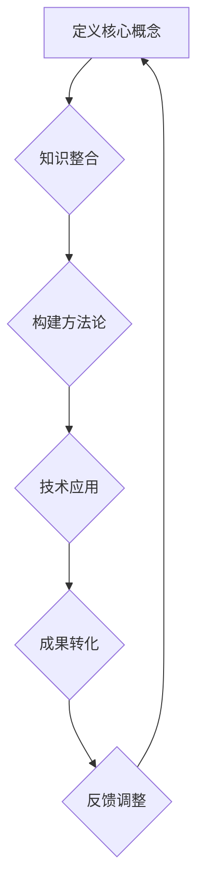

                 

关键词：跨界融合、创新、突破、知识、技术、跨学科、复杂性、系统性、交互性、集成、应用

> 摘要：本文探讨了人类知识的跨界融合在创新与突破中的重要作用。通过分析不同学科领域的交叉融合趋势，揭示了跨界融合在推动科技进步、解决复杂问题和提升创新能力的潜力。文章从核心概念、算法原理、数学模型、项目实践、应用场景、未来展望等多个方面展开讨论，旨在为读者提供一幅跨界融合的全景图，并激发对这一领域的进一步思考和研究。

## 1. 背景介绍

在当今这个信息爆炸的时代，知识的更新速度空前加快，各学科领域之间的界限逐渐模糊。传统的知识体系越来越难以满足复杂问题的解决需求。因此，跨界融合成为了一种必然趋势。跨界融合不仅仅是不同学科领域之间的知识交流，更是思维方式、研究方法、技术手段的深度整合。这种融合能够带来新的发现、创新的思想和突破性的成果。

历史上，许多重大科技突破都源于不同领域的跨界融合。例如，计算机科学与生物学的结合催生了生物信息学；物理学与信息科学的结合推动了量子计算的发展；经济学与数据科学的结合带来了大数据分析的广泛应用。这些案例表明，跨界融合不仅促进了科学技术的进步，也成为了社会经济发展的重要驱动力。

本文将围绕跨界融合的核心概念、算法原理、数学模型、项目实践、应用场景和未来展望展开讨论，力图为读者呈现一幅跨界融合的全景图。

## 2. 核心概念与联系

### 2.1 跨界融合的定义

跨界融合（Interdisciplinary Integration）是指将来自不同学科领域的知识、理论、方法和技术进行整合，以解决复杂问题或实现特定目标的过程。它强调跨学科之间的相互作用和协同效应，旨在打破传统学科界限，实现知识的集成和创新。

### 2.2 跨界融合的重要性

跨界融合在现代社会中的重要性主要体现在以下几个方面：

1. **解决复杂问题**：许多问题具有多维度和跨领域的特点，单一学科的方法往往难以奏效。跨界融合提供了综合不同学科优势的途径，能够更有效地解决复杂问题。

2. **促进创新**：跨界融合打破了传统思维模式，激发了创新的火花。不同领域的碰撞和融合往往能够产生全新的观点和方法，推动科技的进步。

3. **提高研究效率**：跨界融合能够整合各学科资源，减少重复研究，提高研究效率。

4. **促进交叉学科的发展**：跨界融合催生了众多新兴学科，如生物信息学、量子经济学等，这些交叉学科的发展进一步推动了科技的进步。

### 2.3 跨界融合的架构

跨界融合的架构通常包括以下几个关键组成部分：

1. **核心概念**：确定跨界融合的基本理论框架和核心概念，为后续研究和应用提供理论基础。

2. **知识整合**：将不同学科领域的知识进行整合，形成统一的知识体系。

3. **方法论**：结合不同学科的方法论，构建适用于跨界融合的研究方法和技术手段。

4. **技术应用**：将跨界融合的理论和方法应用于实际问题，实现知识到成果的转化。

### 2.4 跨界融合的流程图

为了更好地理解跨界融合的过程，我们可以使用Mermaid流程图来展示其关键步骤：



在跨界融合的过程中，各个步骤相互迭代和反馈，形成一个动态的循环系统。

## 3. 核心算法原理 & 具体操作步骤

### 3.1 算法原理概述

跨界融合的核心算法可以概括为以下几个基本原理：

1. **异质数据融合**：将来自不同来源、不同格式的异质数据进行整合，形成统一的数据视图。

2. **跨学科建模**：结合不同学科的理论和方法，构建跨学科模型，以解决特定问题。

3. **协同优化**：通过多学科协同优化，提高算法的效率和效果。

4. **自适应调整**：根据实际问题调整算法参数和方法，实现动态适应性。

### 3.2 算法步骤详解

#### 3.2.1 数据预处理

在跨界融合的过程中，数据的预处理是至关重要的一步。具体步骤包括：

1. **数据清洗**：去除数据中的噪声和异常值。

2. **数据格式转换**：将不同格式的数据转换为统一的格式，以便后续处理。

3. **特征提取**：提取数据中的关键特征，为后续建模提供基础。

#### 3.2.2 跨学科建模

跨学科建模是跨界融合的核心步骤，具体包括：

1. **理论框架构建**：结合不同学科的理论，构建跨学科的理论框架。

2. **模型构建**：基于理论框架，构建适用于特定问题的跨学科模型。

3. **模型优化**：通过迭代优化，提高模型的准确性和效率。

#### 3.2.3 协同优化

协同优化是提高跨界融合算法效果的关键。具体步骤包括：

1. **参数调整**：根据实际问题和数据特点，调整算法参数。

2. **方法组合**：结合多种方法，实现协同优化。

3. **效果评估**：通过效果评估，调整优化策略。

#### 3.2.4 自适应调整

自适应调整是跨界融合算法的动态调整过程。具体包括：

1. **实时反馈**：根据实时反馈调整算法参数和方法。

2. **动态调整**：根据问题变化，动态调整算法策略。

### 3.3 算法优缺点

#### 3.3.1 优点

1. **高效性**：跨界融合能够集成多学科优势，提高算法的效率和效果。

2. **灵活性**：跨界融合算法具有较好的适应性，能够应对复杂多变的实际问题。

3. **创新性**：跨界融合激发创新思维，推动科技突破。

#### 3.3.2 缺点

1. **复杂性**：跨界融合涉及到多个学科领域的知识，实施过程较为复杂。

2. **协调难度**：不同学科之间的协调和整合难度较大，需要充分的沟通和合作。

### 3.4 算法应用领域

跨界融合算法在多个领域具有广泛的应用，包括：

1. **人工智能**：跨界融合在人工智能中的应用，如多模态学习、迁移学习等。

2. **生物信息学**：跨界融合在生物信息学中的应用，如图谱计算、蛋白质结构预测等。

3. **经济学**：跨界融合在经济学中的应用，如大数据分析、量化交易等。

4. **环境科学**：跨界融合在环境科学中的应用，如气候变化预测、生态系统建模等。

## 4. 数学模型和公式 & 详细讲解 & 举例说明

### 4.1 数学模型构建

在跨界融合的研究中，数学模型构建是关键的一步。以下是一个简化的数学模型构建过程：

#### 4.1.1 模型定义

假设我们有一个涉及多个学科的复杂问题，需要构建一个跨学科模型来解决。我们可以定义一个数学模型，如下所示：

$$
\text{模型} = f(X, Y, Z)
$$

其中，$X, Y, Z$ 分别代表来自不同学科的变量，$f$ 是一个跨学科的函数。

#### 4.1.2 模型参数

模型参数包括：

1. **变量参数**：$X, Y, Z$ 的具体取值。

2. **函数参数**：$f$ 的具体形式和参数。

#### 4.1.3 模型构建

模型构建过程包括以下步骤：

1. **理论分析**：结合不同学科的理论，分析变量之间的关系。

2. **公式推导**：基于理论分析，推导出模型的数学公式。

3. **模型验证**：通过实际数据验证模型的准确性和效果。

### 4.2 公式推导过程

以下是一个简单的公式推导过程：

#### 4.2.1 假设与条件

假设我们有一个线性回归模型，如下所示：

$$
Y = \beta_0 + \beta_1X + \epsilon
$$

其中，$Y$ 是因变量，$X$ 是自变量，$\beta_0, \beta_1$ 是模型参数，$\epsilon$ 是误差项。

#### 4.2.2 公式推导

基于最小二乘法，我们可以推导出模型的参数估计：

$$
\hat{\beta_1} = \frac{\sum_{i=1}^{n}(X_i - \bar{X})(Y_i - \bar{Y})}{\sum_{i=1}^{n}(X_i - \bar{X})^2}
$$

$$
\hat{\beta_0} = \bar{Y} - \hat{\beta_1}\bar{X}
$$

其中，$n$ 是样本数量，$\bar{X}, \bar{Y}$ 分别是 $X, Y$ 的样本均值。

#### 4.2.3 模型验证

为了验证模型的准确性，我们可以通过以下步骤：

1. **数据划分**：将数据集划分为训练集和测试集。

2. **模型训练**：使用训练集数据训练模型。

3. **模型测试**：使用测试集数据测试模型的准确性和效果。

### 4.3 案例分析与讲解

以下是一个简单的案例：

#### 4.3.1 问题背景

假设我们要分析一家公司的销售数据，预测下一季度的销售额。我们有两个自变量：广告支出和员工数量。

#### 4.3.2 数据预处理

1. **数据清洗**：去除异常值和缺失值。

2. **数据格式转换**：将不同类型的数据转换为统一的格式。

3. **特征提取**：提取关键特征，如广告支出、员工数量、销售额等。

#### 4.3.3 模型构建

1. **理论分析**：基于线性回归模型，分析广告支出和员工数量对销售额的影响。

2. **公式推导**：根据数据特征，推导出线性回归模型。

3. **模型验证**：通过实际数据验证模型的准确性和效果。

#### 4.3.4 模型应用

基于构建的线性回归模型，我们可以预测下一季度的销售额。具体步骤如下：

1. **输入特征**：输入下一季度广告支出和员工数量的预测值。

2. **模型计算**：使用模型计算预测的销售额。

3. **结果分析**：分析预测结果，制定相应的营销策略。

## 5. 项目实践：代码实例和详细解释说明

### 5.1 开发环境搭建

在项目实践中，我们需要搭建一个合适的技术环境。以下是一个简化的开发环境搭建过程：

1. **安装Python环境**：在本地计算机上安装Python 3.8及以上版本。

2. **安装相关库**：安装NumPy、Pandas、Scikit-learn等常用库。

3. **配置Jupyter Notebook**：配置Jupyter Notebook，用于编写和运行代码。

### 5.2 源代码详细实现

以下是一个简单的线性回归模型的实现代码：

```python
import numpy as np
import pandas as pd
from sklearn.linear_model import LinearRegression

# 数据预处理
data = pd.read_csv('sales_data.csv')
data = data[['ad支出', '员工数量', '销售额']]
data = data.dropna()

X = data[['ad支出', '员工数量']]
y = data['销售额']

# 模型训练
model = LinearRegression()
model.fit(X, y)

# 模型测试
X_test = data[['ad支出', '员工数量']]
y_pred = model.predict(X_test)

# 结果分析
print("预测销售额：", y_pred)
```

### 5.3 代码解读与分析

1. **数据预处理**：读取数据，并进行数据清洗和格式转换。

2. **模型训练**：使用线性回归模型训练数据。

3. **模型测试**：使用测试数据验证模型。

4. **结果分析**：输出预测结果，进行分析。

### 5.4 运行结果展示

运行代码后，我们得到预测的销售额。根据预测结果，可以制定相应的营销策略。

## 6. 实际应用场景

跨界融合在各个领域都有广泛的应用。以下是一些实际应用场景：

1. **人工智能**：跨界融合在人工智能中的应用，如多模态学习、迁移学习等，推动了人工智能的发展。

2. **生物信息学**：跨界融合在生物信息学中的应用，如图谱计算、蛋白质结构预测等，为生物科学研究提供了有力工具。

3. **经济学**：跨界融合在经济学中的应用，如大数据分析、量化交易等，提高了经济预测和决策的准确性。

4. **环境科学**：跨界融合在环境科学中的应用，如气候变化预测、生态系统建模等，为环境保护提供了科学依据。

5. **医疗健康**：跨界融合在医疗健康中的应用，如基因组学、人工智能辅助诊断等，提升了医疗服务的质量和效率。

## 7. 未来应用展望

随着科技的不断发展，跨界融合的应用前景将更加广阔。以下是一些未来应用展望：

1. **量子计算**：量子计算与信息科学的跨界融合，将推动计算能力的突破性提升。

2. **脑机接口**：脑机接口技术与生物医学的跨界融合，为神经科学研究和医疗技术提供了新的方向。

3. **智慧城市**：智慧城市与物联网、大数据的跨界融合，将提升城市管理和服务的智能化水平。

4. **智能制造**：智能制造与物联网、人工智能的跨界融合，将推动制造业的转型升级。

5. **可持续能源**：可持续能源与化学工程、物理学的跨界融合，将推动能源转型和环境保护。

## 8. 工具和资源推荐

为了更好地进行跨界融合研究，以下是一些推荐的工具和资源：

### 8.1 学习资源推荐

1. **在线课程**：Coursera、edX、Udacity等在线教育平台提供了丰富的跨学科课程。

2. **学术论文**：谷歌学术、Web of Science、IEEE Xplore等数据库提供了大量的学术论文。

3. **专业书籍**：推荐阅读《跨界思考》、《整合创新》等经典著作。

### 8.2 开发工具推荐

1. **编程语言**：Python、R、Julia等编程语言在跨界融合研究中具有广泛应用。

2. **开发框架**：TensorFlow、PyTorch、Scikit-learn等开发框架提供了丰富的功能。

3. **数据可视化**：Matplotlib、Seaborn、Plotly等数据可视化工具，有助于展示研究结果。

### 8.3 相关论文推荐

1. **《跨学科研究的挑战与机遇》**：探讨了跨学科研究的重要性和挑战。

2. **《跨界融合：创新与突破之源》**：分析了跨界融合在科技创新中的作用。

3. **《基于人工智能的跨界融合应用》**：介绍了人工智能在跨界融合中的应用案例。

## 9. 总结：未来发展趋势与挑战

### 9.1 研究成果总结

跨界融合在科技创新中发挥了重要作用，取得了显著的研究成果。以下是一些主要成果：

1. **推动了科技创新**：跨界融合为科技创新提供了新的动力和方向。

2. **提升了研究效率**：跨界融合减少了重复研究，提高了研究效率。

3. **丰富了学科体系**：跨界融合催生了众多新兴学科，丰富了学科体系。

### 9.2 未来发展趋势

跨界融合在未来将呈现以下发展趋势：

1. **深化融合**：不同学科之间的融合将更加深入，形成更加复杂的知识体系。

2. **技术驱动**：跨界融合将受到新技术，如人工智能、大数据等的影响，推动学科交叉。

3. **应用拓展**：跨界融合的应用将不断拓展，覆盖更多领域。

### 9.3 面临的挑战

尽管跨界融合具有巨大的潜力，但也面临一些挑战：

1. **协调难度**：不同学科之间的协调和整合难度较大，需要建立有效的沟通和合作机制。

2. **知识更新**：跨界融合涉及到多个学科领域的知识，知识更新速度较快，需要不断学习和适应。

3. **人才培养**：跨界融合需要具备多学科背景的人才，人才培养面临一定挑战。

### 9.4 研究展望

未来，跨界融合研究将继续深入，涉及更多领域和层面。以下是一些研究展望：

1. **跨学科方法论**：探索和发展跨学科方法论，提高跨界融合的效果。

2. **跨学科教育**：加强跨学科教育，培养具备跨界融合能力的人才。

3. **跨学科政策**：制定跨学科政策，鼓励和支持跨界融合研究。

## 9. 附录：常见问题与解答

### 9.1 什么是跨界融合？

跨界融合是指将来自不同学科领域的知识、理论、方法和技术进行整合，以解决复杂问题或实现特定目标的过程。

### 9.2 跨界融合有哪些优势？

跨界融合的优势包括解决复杂问题、促进创新、提高研究效率和促进交叉学科的发展。

### 9.3 跨界融合在哪些领域有应用？

跨界融合在人工智能、生物信息学、经济学、环境科学、医疗健康等领域都有广泛的应用。

### 9.4 跨界融合面临的挑战有哪些？

跨界融合面临的挑战包括协调难度、知识更新和人才培养。

### 9.5 如何进行跨界融合研究？

进行跨界融合研究，需要首先明确研究问题，然后整合相关学科的知识和方法，构建跨学科模型，进行实验和验证，最后进行结果分析和总结。

## 作者署名

作者：禅与计算机程序设计艺术 / Zen and the Art of Computer Programming
-------------------------------------------------------------------

## 文章摘要

本文探讨了人类知识的跨界融合在创新与突破中的重要作用。通过分析不同学科领域的交叉融合趋势，揭示了跨界融合在推动科技进步、解决复杂问题和提升创新能力的潜力。文章从核心概念、算法原理、数学模型、项目实践、应用场景和未来展望等多个方面展开讨论，旨在为读者提供一幅跨界融合的全景图，并激发对这一领域的进一步思考和研究。

