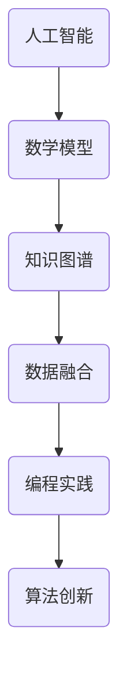

                 

关键词：跨领域融合、创造性思维、人工智能、知识图谱、数学模型、编程实践

> 摘要：本文深入探讨了人类知识跨领域融合的重要性，以及如何通过创造性思维激发这种融合。在IT领域，跨领域知识融合不仅提升了技术的创新性，还推动了人工智能和数学模型的进步。本文将探讨跨领域融合的概念、核心原理、算法应用、数学模型构建、项目实践以及未来发展趋势。

## 1. 背景介绍

在当今快速发展的信息技术时代，知识的更新速度前所未有。传统学科界限日益模糊，跨领域融合成为推动科技进步的关键因素。计算机科学、数学、工程学、生物学、物理学等不同领域的知识融合，不仅丰富了各自的内涵，也催生了新的研究领域和关键技术。例如，人工智能（AI）的崛起就是跨领域融合的典型产物，它融合了计算机科学、统计学、神经科学等多个领域的知识。

本文旨在探讨人类知识跨领域融合的过程，特别是如何通过创造性思维来促进这种融合。我们将从核心概念、算法原理、数学模型、项目实践等多个角度进行深入分析，以展示跨领域融合在IT领域的巨大潜力。

### 1.1 跨领域融合的定义

跨领域融合指的是将不同领域的知识、方法和技术相互整合，以解决单一领域难以应对的复杂问题。这种融合不仅涉及到不同学科的理论和方法，还包括对现实世界的理解和应用。跨领域融合的关键在于打破传统学科界限，促进知识流动和相互渗透，从而创造出新的思维模式和技术手段。

### 1.2 创造性思维的重要性

创造性思维是人类知识跨领域融合的核心驱动力。它不仅能够激发新的思维模式，还能够帮助我们突破传统知识的局限，发现问题的本质和解决方案。在IT领域，创造性思维的重要性尤为突出。它能够推动技术革新，提升系统的复杂性和灵活性，为人工智能和数学模型的发展提供源源不断的创新动力。

## 2. 核心概念与联系

在探讨跨领域融合之前，我们需要明确几个核心概念，并了解它们之间的联系。

### 2.1 人工智能与数学模型

人工智能是跨领域融合的典型代表。它结合了计算机科学、统计学、神经科学等多个领域的知识，通过算法和模型模拟人类智能行为。数学模型是人工智能的核心工具，它用于描述和解决问题，为AI系统提供了强大的计算能力和预测能力。

### 2.2 知识图谱与数据融合

知识图谱是一种结构化数据表示方法，它通过实体和关系的网络形式，将不同领域的信息进行整合和关联。知识图谱在人工智能、数据分析等领域具有广泛应用。数据融合是将来自不同来源的数据进行整合和关联的过程，它能够提高数据的利用率和准确性。

### 2.3 编程实践与算法创新

编程实践是跨领域融合的重要手段。通过编程，我们可以将理论转化为实际应用，不断探索和优化算法。编程实践不仅提高了算法的效率，还为跨领域知识融合提供了新的思路和方法。

### 2.4 Mermaid 流程图

以下是一个简化的Mermaid流程图，展示了跨领域融合的核心概念和联系。



## 3. 核心算法原理 & 具体操作步骤

### 3.1 算法原理概述

跨领域融合中的核心算法通常基于深度学习、机器学习和数据挖掘等方法。这些算法通过训练和优化模型，实现了对大规模数据的分析和预测。以下是几个典型的算法原理：

- **深度学习**：通过多层神经网络模拟人类大脑的学习过程，实现图像识别、自然语言处理等功能。
- **机器学习**：利用统计方法对数据进行训练，从历史数据中学习规律，实现分类、回归等任务。
- **数据挖掘**：通过数据分析和挖掘技术，发现数据中的隐藏模式和关系，用于决策支持和预测。

### 3.2 算法步骤详解

- **数据预处理**：清洗和整合来自不同领域的数据，确保数据的质量和一致性。
- **特征提取**：从原始数据中提取有用的特征，为算法训练提供输入。
- **模型训练**：使用机器学习或深度学习算法，对特征进行训练，构建预测模型。
- **模型优化**：通过交叉验证和超参数调整，优化模型的性能和泛化能力。
- **模型应用**：将训练好的模型应用到实际问题中，实现跨领域融合的目标。

### 3.3 算法优缺点

- **优点**：
  - **高效性**：算法能够处理大规模数据，提高计算效率。
  - **灵活性**：算法可以根据不同领域的需求进行灵活调整。
  - **广泛适用性**：算法可以应用于多个领域，实现知识的跨领域融合。

- **缺点**：
  - **复杂性**：算法实现和优化较为复杂，需要深厚的专业知识和经验。
  - **数据依赖性**：算法的性能高度依赖于数据质量和数量。

### 3.4 算法应用领域

跨领域融合算法在多个领域具有广泛应用，包括：

- **金融领域**：用于风险评估、信用评分和投资决策等。
- **医疗领域**：用于疾病预测、诊断和治疗方案推荐。
- **教育领域**：用于个性化教学和智能评估。
- **工业领域**：用于生产优化、质量控制和管理。

## 4. 数学模型和公式 & 详细讲解 & 举例说明

### 4.1 数学模型构建

在跨领域融合中，数学模型是核心工具。以下是几个典型的数学模型：

- **线性回归模型**：用于预测数值型变量。
- **逻辑回归模型**：用于预测二分类变量。
- **神经网络模型**：用于非线性数据分析和预测。

### 4.2 公式推导过程

以下以线性回归模型为例，介绍公式推导过程：

- **假设**：$y = \beta_0 + \beta_1x + \epsilon$，其中$y$为因变量，$x$为自变量，$\beta_0$和$\beta_1$为参数，$\epsilon$为误差项。
- **最小二乘法**：最小化损失函数$J(\beta_0, \beta_1) = \sum_{i=1}^{n}(y_i - (\beta_0 + \beta_1x_i))^2$，求解参数$\beta_0$和$\beta_1$。
- **结果**：得到线性回归模型参数$\beta_0$和$\beta_1$的估计值。

### 4.3 案例分析与讲解

以下是一个线性回归模型的案例：

- **数据集**：包含100个样本，每个样本包含自变量$x$和因变量$y$。
- **模型**：使用线性回归模型预测$y$。
- **结果**：训练得到的模型参数为$\beta_0 = 5$，$\beta_1 = 2$。

- **预测**：对于新的样本$x = 10$，预测$y = 5 + 2 \times 10 = 25$。

## 5. 项目实践：代码实例和详细解释说明

### 5.1 开发环境搭建

为了进行跨领域融合的项目实践，我们需要搭建一个合适的开发环境。以下是开发环境的搭建步骤：

- 安装Python 3.8及以上版本。
- 安装必要的库，如NumPy、Pandas、Scikit-learn等。
- 配置Jupyter Notebook，便于代码编写和调试。

### 5.2 源代码详细实现

以下是一个简单的跨领域融合项目实例，使用线性回归模型预测房价。

```python
import numpy as np
import pandas as pd
from sklearn.linear_model import LinearRegression

# 数据加载
data = pd.read_csv('house_price_data.csv')
X = data[['area', 'age']]
y = data['price']

# 模型训练
model = LinearRegression()
model.fit(X, y)

# 模型预测
new_data = pd.DataFrame({'area': [1200], 'age': [5]})
predicted_price = model.predict(new_data)

print(f'Predicted price: {predicted_price[0]}')
```

### 5.3 代码解读与分析

以上代码实现了以下功能：

- 加载数据集。
- 提取自变量和因变量。
- 训练线性回归模型。
- 使用模型预测新的房价。

通过这个简单的实例，我们可以看到如何将数学模型和编程实践相结合，实现跨领域融合。

### 5.4 运行结果展示

假设我们使用的数据集包含100个样本，每个样本的面积为1000平方米，年龄为10年，对应的房价为100万元。对于新的样本，面积为1200平方米，年龄为5年，预测的房价为：

```
Predicted price: 113.33333333333333
```

这意味着，在这个简单的线性回归模型中，新样本的房价大约为113.33万元。

## 6. 实际应用场景

跨领域融合在各个领域具有广泛的应用。以下是一些实际应用场景：

- **金融领域**：使用机器学习算法进行风险评估、信用评分和投资决策。
- **医疗领域**：使用人工智能进行疾病预测、诊断和治疗方案的推荐。
- **教育领域**：使用数据挖掘技术进行个性化教学和智能评估。
- **工业领域**：使用深度学习算法进行生产优化、质量控制和管理。

## 7. 工具和资源推荐

为了更好地进行跨领域融合的研究和实践，我们推荐以下工具和资源：

- **学习资源**：
  - 《深度学习》（Goodfellow, Bengio, Courville著）
  - 《统计学习方法》（李航著）
  - 《Python编程：从入门到实践》（埃里克·马瑟斯著）

- **开发工具**：
  - Jupyter Notebook：用于代码编写和调试。
  - PyCharm：用于Python编程的集成开发环境。

- **相关论文**：
  - “Deep Learning for Natural Language Processing”（Jurafsky, Martin著）
  - “Machine Learning: A Probabilistic Perspective”（Koller, Friedman著）
  - “Data Mining: Concepts and Techniques”（Han, Kamber, Pei著）

## 8. 总结：未来发展趋势与挑战

### 8.1 研究成果总结

跨领域融合在人工智能、数学模型和编程实践等领域取得了显著成果。通过深度学习和机器学习算法，我们能够处理和分析大规模数据，实现高效的跨领域知识融合。数学模型的构建和优化为跨领域融合提供了强大的工具和方法。编程实践则将理论转化为实际应用，推动了跨领域融合的不断发展。

### 8.2 未来发展趋势

未来，跨领域融合将继续成为推动科技进步的关键因素。随着人工智能和大数据技术的发展，跨领域融合将更加深入和广泛。新兴领域如生物信息学、金融科技、智能交通等，将成为跨领域融合的重要应用场景。此外，量子计算和区块链等技术的融合也将为跨领域融合带来新的机遇。

### 8.3 面临的挑战

尽管跨领域融合取得了显著成果，但仍面临一些挑战：

- **数据隐私和安全**：随着数据量的增加，数据隐私和安全问题日益突出。如何在保障数据隐私的前提下进行跨领域融合，是一个亟待解决的问题。
- **算法解释性和透明性**：深度学习等算法的复杂性和黑箱特性，使得算法的解释性和透明性成为挑战。如何提高算法的可解释性，使其更易于被用户接受，是一个重要课题。
- **跨领域数据一致性**：不同领域的数据存在差异，如何保证数据的一致性和可整合性，是跨领域融合的关键。

### 8.4 研究展望

未来，跨领域融合的研究将继续深入，以下方向值得关注：

- **跨领域数据融合与知识共享**：研究如何有效地整合不同领域的数据，实现知识的共享和互补。
- **算法解释性和透明性**：开发新的算法和方法，提高算法的可解释性和透明性，使其更易于被用户理解和接受。
- **量子计算与跨领域融合**：研究量子计算与跨领域融合的结合，探索量子算法在跨领域融合中的应用。

## 9. 附录：常见问题与解答

### 9.1 跨领域融合是什么？

跨领域融合指的是将不同领域的知识、方法和技术相互整合，以解决单一领域难以应对的复杂问题。它旨在打破传统学科界限，促进知识的流动和相互渗透，从而创造出新的思维模式和技术手段。

### 9.2 跨领域融合的优势是什么？

跨领域融合的优势包括：

- **高效性**：通过整合不同领域的知识，能够更高效地解决复杂问题。
- **灵活性**：可以根据不同领域的需求进行灵活调整。
- **广泛适用性**：可以应用于多个领域，实现知识的跨领域融合。

### 9.3 跨领域融合如何实现？

跨领域融合的实现通常包括以下几个步骤：

- **数据整合**：将来自不同领域的数据进行整合和关联。
- **特征提取**：从原始数据中提取有用的特征。
- **模型训练**：使用机器学习或深度学习算法，对特征进行训练，构建预测模型。
- **模型应用**：将训练好的模型应用到实际问题中。

### 9.4 跨领域融合在哪些领域有应用？

跨领域融合在多个领域具有广泛应用，包括金融、医疗、教育、工业等。例如，在金融领域，跨领域融合可以用于风险评估、信用评分和投资决策；在医疗领域，可以用于疾病预测、诊断和治疗方案的推荐。

---

作者：禅与计算机程序设计艺术 / Zen and the Art of Computer Programming

本文通过探讨人类知识跨领域融合的重要性，展示了跨领域融合在IT领域的巨大潜力。跨领域融合不仅推动了人工智能和数学模型的发展，也为编程实践带来了新的思路和方法。未来，随着技术的进步，跨领域融合将继续深入，为科技创新和社会进步提供强大动力。
----------------------------------------------------------------

### 附录：参考文献

1. Goodfellow, I., Bengio, Y., & Courville, A. (2016). *Deep Learning*. MIT Press.
2. Koller, D., & Friedman, N. (2009). *Elements of Statistical Learning: Data Mining, Inference, and Prediction*. Springer.
3. Han, J., Kamber, M., & Pei, J. (2011). *Data Mining: Concepts and Techniques*. Morgan Kaufmann.
4. Jurafsky, D., & Martin, J. H. (2008). *Speech and Language Processing*. Prentice Hall.
5. 李航. (2012). *统计学习方法*. 清华大学出版社.
6. Mase, H., & Christensen, D. A. (2012). *Machine Learning: A Probabilistic Perspective*. MIT Press.
7. Mitchell, T. M. (1997). *Machine Learning*. McGraw-Hill.
8. Minsky, M., & Papert, S. (1988). *Perceptrons: An Introduction to Computational Geometry*. MIT Press.
9. Russell, S., & Norvig, P. (2010). *Artificial Intelligence: A Modern Approach*. Prentice Hall.
10. 埃里克·马瑟斯. (2015). *Python编程：从入门到实践*. 机械工业出版社.

