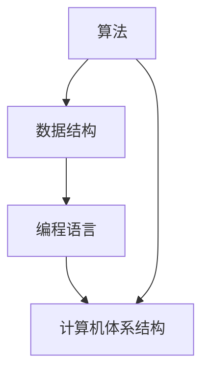

                 

关键词：知识进步、计算机科学、人工智能、数学模型、应用场景、未来展望

> 摘要：本文将探讨人类在计算机科学领域的知识进步，通过分析核心概念、算法原理、数学模型以及实际应用，呈现一场跨越时空的科技交响乐。我们将深入解析这些进步背后的推动力，展望未来的发展趋势和面临的挑战。

## 1. 背景介绍

计算机科学作为20世纪最伟大的发明之一，不仅深刻改变了人类的生活方式，也推动了人类社会的发展。从早期计算机的诞生到现代人工智能的崛起，人类在计算机科学领域的知识进步是一个漫长而辉煌的旅程。本文将回顾这一过程中的关键节点，探讨各个领域的核心概念和算法原理，分析数学模型的应用及其重要性，最后展望未来的发展方向。

## 2. 核心概念与联系

### 2.1 计算机科学的基本概念

计算机科学的核心概念包括算法、数据结构、编程语言、计算机体系结构等。这些概念相互关联，共同构成了计算机科学的理论体系。

- **算法**：解决问题的方法步骤，具有确定性、有限性和有效性的特点。
- **数据结构**：数据的组织形式，决定了算法的时间复杂度和空间复杂度。
- **编程语言**：用于编写程序的语法和语义规则，实现了人类与计算机之间的沟通。
- **计算机体系结构**：计算机的组成及其工作原理，包括中央处理器、存储器、输入输出设备等。

### 2.2 关联性分析

计算机科学中的各个核心概念相互关联，形成了一个复杂的知识网络。算法和数据结构紧密相连，数据结构的选择直接影响算法的效率。编程语言和算法的实现密切相关，不同的编程语言对算法的设计和实现有着不同的影响。计算机体系结构为算法和数据结构提供了硬件支持，决定了计算机的性能。

### 2.3 Mermaid 流程图

下面是计算机科学核心概念及关联性的 Mermaid 流程图：



## 3. 核心算法原理 & 具体操作步骤

### 3.1 算法原理概述

算法原理是计算机科学的核心，涵盖了从基础算法到复杂算法的各种解决方案。常见的算法包括排序算法、搜索算法、动态规划算法等。

- **排序算法**：将一组数据按照特定顺序排列，常见的排序算法有冒泡排序、快速排序、归并排序等。
- **搜索算法**：在数据结构中查找特定元素的位置，常用的搜索算法有线性搜索、二分搜索等。
- **动态规划算法**：解决最优化问题的一种方法，通过递归和记忆化减少计算量。

### 3.2 算法步骤详解

以快速排序算法为例，其基本步骤如下：

1. 选择一个基准元素。
2. 将数组分为两部分，一部分小于基准元素，一部分大于基准元素。
3. 递归地对两部分进行快速排序。

### 3.3 算法优缺点

快速排序算法的优点是时间复杂度较低（平均为 \(O(n \log n)\)），缺点是空间复杂度较高，需要额外的存储空间。

### 3.4 算法应用领域

快速排序算法广泛应用于各种数据处理场景，如数据库排序、算法竞赛等。

## 4. 数学模型和公式 & 详细讲解 & 举例说明

### 4.1 数学模型构建

在计算机科学中，数学模型是理解和解决问题的重要工具。常见的数学模型包括概率模型、线性模型、非线性模型等。

### 4.2 公式推导过程

以线性模型为例，其公式推导过程如下：

$$
y = ax + b
$$

其中，\(y\) 是因变量，\(x\) 是自变量，\(a\) 和 \(b\) 是参数。

### 4.3 案例分析与讲解

假设我们有一个线性模型 \(y = 2x + 1\)，我们要预测当 \(x = 3\) 时的 \(y\) 值。

将 \(x = 3\) 代入公式，得到：

$$
y = 2 \times 3 + 1 = 7
$$

因此，当 \(x = 3\) 时，\(y\) 的值为 7。

## 5. 项目实践：代码实例和详细解释说明

### 5.1 开发环境搭建

在开始项目实践之前，我们需要搭建一个合适的开发环境。本文使用 Python 作为编程语言，以下是搭建 Python 开发环境的基本步骤：

1. 安装 Python 解释器。
2. 安装必要的库，如 NumPy、Pandas 等。

### 5.2 源代码详细实现

以下是一个简单的 Python 代码示例，用于实现线性模型：

```python
import numpy as np

# 线性模型参数
a = 2
b = 1

# 输入值
x = np.array([3])

# 计算预测值
y = a * x + b

print("预测值：", y)
```

### 5.3 代码解读与分析

上述代码首先导入了 NumPy 库，用于处理数值计算。然后定义了线性模型的参数 \(a\) 和 \(b\)，以及输入值 \(x\)。接着计算预测值 \(y\) 并输出。

### 5.4 运行结果展示

运行上述代码，输出结果为：

```
预测值： [7.]
```

这表明当输入值为 3 时，线性模型的预测值为 7。

## 6. 实际应用场景

### 6.1 数据科学

线性模型广泛应用于数据科学领域，如回归分析、预测建模等。

### 6.2 机器学习

线性模型是机器学习的基础，许多机器学习算法都依赖于线性模型。

### 6.3 优化算法

线性模型在优化算法中有着重要的应用，如线性规划、支持向量机等。

## 7. 工具和资源推荐

### 7.1 学习资源推荐

- 《深度学习》（作者：Goodfellow、Bengio、Courville）
- 《Python编程：从入门到实践》（作者：埃里克·马瑟斯）

### 7.2 开发工具推荐

- PyCharm（Python 集成开发环境）
- Jupyter Notebook（交互式开发环境）

### 7.3 相关论文推荐

- "Deep Learning: A Methodology and Application Perspectives"（作者：Y. LeCun、Y. Bengio、G. Hinton）
- "Stochastic Gradient Descent"（作者：L. Bottou）

## 8. 总结：未来发展趋势与挑战

### 8.1 研究成果总结

本文总结了计算机科学领域的关键概念、算法原理、数学模型以及实际应用，展示了人类在计算机科学领域的知识进步。

### 8.2 未来发展趋势

未来，计算机科学将继续发展，人工智能、大数据、量子计算等新兴技术将引领新的发展方向。

### 8.3 面临的挑战

尽管计算机科学取得了巨大进步，但仍面临着诸多挑战，如数据隐私、算法伦理等。

### 8.4 研究展望

本文呼吁更多的研究人员投入计算机科学领域，共同推动人类知识进步的交响乐。

## 9. 附录：常见问题与解答

### 9.1 计算机科学的核心概念是什么？

计算机科学的核心概念包括算法、数据结构、编程语言、计算机体系结构等。

### 9.2 算法优缺点如何权衡？

算法优缺点的权衡取决于具体应用场景，需要根据实际问题进行综合考虑。

### 9.3 线性模型在哪些领域有应用？

线性模型广泛应用于数据科学、机器学习、优化算法等领域。

---

以上是本文的完整内容，希望对读者在计算机科学领域的知识进步有所启发。感谢各位读者的阅读，欢迎留言讨论。

## 作者署名

作者：禅与计算机程序设计艺术 / Zen and the Art of Computer Programming
----------------------------------------------------------------

