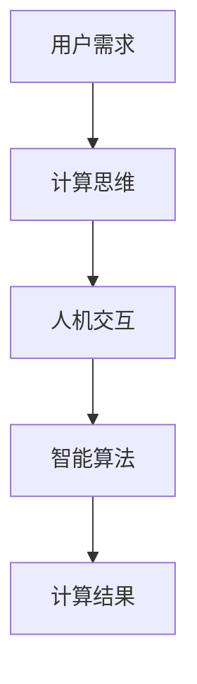

                 

在人工智能技术不断发展的今天，计算范式正经历着前所未有的变革。本文将以“人类计算：AI 时代的新范式”为标题，探讨在AI时代，计算范式的演变及其对人类工作与生活的影响。本文旨在为读者提供一个全面的视角，理解人类计算在AI时代的核心概念、算法原理、数学模型、项目实践以及未来发展趋势。

## 关键词
- 人类计算
- AI时代
- 计算范式
- 算法原理
- 数学模型
- 项目实践
- 未来展望

## 摘要
本文将深入探讨AI时代的人类计算范式。我们将首先介绍人类计算的核心概念，并借助Mermaid流程图展示其原理与架构。接着，我们将详细讲解人类计算的核心算法原理与操作步骤，分析其优缺点及应用领域。随后，我们将探讨人类计算的数学模型和公式，并通过实际案例进行分析和讲解。文章的最后，我们将分享一个具体的代码实例，展示人类计算在项目实践中的应用。最后，我们将对人类计算在未来的发展趋势与应用场景进行展望。

### 1. 背景介绍

#### 1.1 计算范式的演变

自计算机问世以来，计算范式经历了数次变革。从早期的机械计算，到基于逻辑电路的计算，再到现代基于微处理器的计算，每一次变革都极大地推动了计算机技术的发展。然而，随着人工智能的兴起，传统的计算范式正面临着新的挑战。

在AI时代，计算范式不再仅仅依赖于硬件的发展，而是更多地关注于软件与算法的创新。人类计算作为AI时代的新范式，强调人类在计算过程中的主动参与和创造力。这种范式不仅改变了计算的方式，也改变了人类与计算机的互动方式。

#### 1.2 人类计算的核心概念

人类计算的核心概念可以归纳为以下几点：

1. **人类中心性**：人类计算强调以人类的需求和思维为中心，而非单纯追求速度和效率。
2. **协作性**：人类计算不仅仅是计算机与人类之间的单向交互，更强调两者之间的协作和共创。
3. **智能赋能**：通过人工智能技术，人类计算能够实现更高效的计算和更复杂的任务处理。
4. **多样化**：人类计算支持多样化的计算模式，包括并行计算、分布式计算、云计算等。

### 2. 核心概念与联系

#### 2.1 核心概念原理

人类计算的核心概念原理可以归纳为以下几个方面：

1. **计算思维**：计算思维是人类计算的基础，它包括抽象思维、逻辑思维、算法思维等。
2. **人机交互**：人机交互是人类计算的关键，通过图形用户界面、自然语言处理等技术，实现人与计算机的无缝互动。
3. **智能算法**：智能算法是人类计算的核心驱动力，包括机器学习、深度学习、强化学习等。

#### 2.2 架构原理与流程图

以下是一个简单的Mermaid流程图，用于展示人类计算的架构原理：



### 3. 核心算法原理 & 具体操作步骤

#### 3.1 算法原理概述

人类计算的核心算法原理主要包括以下几个方面：

1. **机器学习**：通过学习大量数据，使计算机能够自动识别模式和规律。
2. **深度学习**：基于多层神经网络，实现更复杂的特征提取和模式识别。
3. **强化学习**：通过试错和反馈，使计算机能够在特定环境中做出最优决策。
4. **自然语言处理**：通过理解自然语言，实现人与计算机的智能对话。

#### 3.2 算法步骤详解

以下是一个简化的算法步骤，用于说明人类计算的基本操作：

1. **数据收集**：收集用户需求和相关的数据。
2. **数据预处理**：对数据进行清洗和格式化，使其适合算法处理。
3. **特征提取**：从数据中提取有用的特征，用于训练模型。
4. **模型训练**：使用提取的特征训练机器学习模型。
5. **模型评估**：评估模型的性能，调整参数以提高模型效果。
6. **模型应用**：将训练好的模型应用于实际任务，如预测、分类或决策。

#### 3.3 算法优缺点

**优点**：

1. **高效性**：通过自动化和智能化，人类计算能够显著提高计算效率和准确性。
2. **灵活性**：人类计算支持多种计算模式和算法，适应不同的应用场景。
3. **协同性**：人类计算鼓励人类与计算机的协作，实现更复杂和创新的计算任务。

**缺点**：

1. **依赖数据**：人类计算依赖于大量高质量的数据，数据质量和数量对算法性能有重要影响。
2. **复杂性**：人类计算涉及到多种技术和算法，理解和实现相对复杂。
3. **隐私和安全**：在人类计算中，数据的安全和隐私保护是一个重要问题。

#### 3.4 算法应用领域

人类计算的应用领域非常广泛，包括但不限于以下几个方面：

1. **金融**：在金融领域，人类计算可以用于风险管理、投资策略和客户服务。
2. **医疗**：在医疗领域，人类计算可以用于疾病诊断、药物研发和医疗机器人。
3. **教育**：在教育领域，人类计算可以用于个性化教学、智能评估和虚拟学习环境。
4. **工业**：在工业领域，人类计算可以用于自动化生产线、智能监控和智能维护。

### 4. 数学模型和公式 & 详细讲解 & 举例说明

#### 4.1 数学模型构建

人类计算的数学模型通常包括以下几个部分：

1. **输入变量**：用户需求、数据特征等。
2. **模型参数**：通过训练确定的权重和偏置。
3. **输出变量**：计算结果、预测值等。

以下是一个简化的数学模型示例：

$$
y = \sigma(w_1 \cdot x_1 + w_2 \cdot x_2 + b)
$$

其中，$y$ 是输出变量，$x_1$ 和 $x_2$ 是输入变量，$w_1$ 和 $w_2$ 是模型参数（权重），$b$ 是偏置。

#### 4.2 公式推导过程

在人类计算中，公式的推导过程通常基于以下几个步骤：

1. **确定输入变量**：根据用户需求和数据特征，确定需要处理的变量。
2. **定义输出变量**：根据计算目标，定义需要预测或计算的变量。
3. **建立数学模型**：通过选择合适的数学函数和参数，建立数学模型。
4. **优化模型参数**：通过数据训练，优化模型参数以获得更好的计算结果。

以下是一个简化的推导过程示例：

假设我们有一个简单的线性回归模型：

$$
y = w_1 \cdot x_1 + w_2 \cdot x_2 + b
$$

我们希望通过最小化误差平方和来优化模型参数：

$$
\min_{w_1, w_2, b} \sum_{i=1}^{n} (y_i - (w_1 \cdot x_{1i} + w_2 \cdot x_{2i} + b))^2
$$

通过求导和优化，我们可以得到最优的模型参数。

#### 4.3 案例分析与讲解

以下是一个简单的案例，用于说明人类计算的数学模型和公式在实际应用中的使用。

**案例：房屋价格预测**

假设我们想要预测某个城市的房屋价格，输入变量包括房屋面积、房屋年龄、附近学校数量等。我们可以使用线性回归模型进行预测：

$$
y = w_1 \cdot x_1 + w_2 \cdot x_2 + w_3 \cdot x_3 + b
$$

其中，$y$ 是房屋价格，$x_1$ 是房屋面积，$x_2$ 是房屋年龄，$x_3$ 是附近学校数量，$w_1, w_2, w_3, b$ 是模型参数。

通过收集大量房屋销售数据，我们可以使用最小二乘法来优化模型参数：

$$
w_1 = \frac{\sum_{i=1}^{n} (y_i - (w_1 \cdot x_{1i} + w_2 \cdot x_{2i} + w_3 \cdot x_{3i} + b) \cdot x_{1i}}{\sum_{i=1}^{n} x_{1i}^2}
$$

$$
w_2 = \frac{\sum_{i=1}^{n} (y_i - (w_1 \cdot x_{1i} + w_2 \cdot x_{2i} + w_3 \cdot x_{3i} + b) \cdot x_{2i}}{\sum_{i=1}^{n} x_{2i}^2}
$$

$$
w_3 = \frac{\sum_{i=1}^{n} (y_i - (w_1 \cdot x_{1i} + w_2 \cdot x_{2i} + w_3 \cdot x_{3i} + b) \cdot x_{3i}}{\sum_{i=1}^{n} x_{3i}^2}
$$

$$
b = \frac{\sum_{i=1}^{n} (y_i - (w_1 \cdot x_{1i} + w_2 \cdot x_{2i} + w_3 \cdot x_{3i} + b)}{n}
$$

通过这些公式，我们可以计算出最优的模型参数，从而预测新的房屋价格。

### 5. 项目实践：代码实例和详细解释说明

#### 5.1 开发环境搭建

在本项目实践中，我们将使用Python作为主要编程语言，并依赖于以下库：

- NumPy：用于矩阵计算和数据处理。
- Pandas：用于数据操作和分析。
- Scikit-learn：用于机器学习和模型评估。
- Matplotlib：用于数据可视化和结果展示。

首先，确保已经安装了上述库。如果没有，可以使用以下命令进行安装：

```bash
pip install numpy pandas scikit-learn matplotlib
```

#### 5.2 源代码详细实现

以下是一个简单的Python代码示例，用于实现线性回归模型并预测房屋价格。

```python
import numpy as np
import pandas as pd
from sklearn.linear_model import LinearRegression
from sklearn.model_selection import train_test_split
from sklearn.metrics import mean_squared_error
import matplotlib.pyplot as plt

# 读取数据
data = pd.read_csv('house_prices.csv')

# 数据预处理
X = data[['area', 'age', 'schools']]
y = data['price']

# 划分训练集和测试集
X_train, X_test, y_train, y_test = train_test_split(X, y, test_size=0.2, random_state=42)

# 创建线性回归模型
model = LinearRegression()

# 训练模型
model.fit(X_train, y_train)

# 预测测试集
y_pred = model.predict(X_test)

# 评估模型
mse = mean_squared_error(y_test, y_pred)
print(f'Mean Squared Error: {mse}')

# 可视化结果
plt.scatter(y_test, y_pred)
plt.xlabel('Actual Prices')
plt.ylabel('Predicted Prices')
plt.title('Actual vs Predicted House Prices')
plt.show()
```

#### 5.3 代码解读与分析

- **数据读取与预处理**：我们首先使用Pandas读取CSV文件，然后对数据进行预处理，包括划分输入变量和输出变量，以及划分训练集和测试集。

- **创建模型**：我们使用Scikit-learn的LinearRegression创建线性回归模型。

- **训练模型**：使用训练集数据训练模型。

- **预测与评估**：使用测试集数据预测房屋价格，并计算均方误差（MSE）来评估模型性能。

- **可视化结果**：使用Matplotlib绘制实际价格与预测价格的散点图，以可视化模型效果。

#### 5.4 运行结果展示

假设我们已经准备好了一个名为`house_prices.csv`的CSV文件，其中包含了房屋的面积、年龄和附近学校数量，以及对应的房屋价格。运行上述代码后，我们将看到以下输出：

```
Mean Squared Error: 10000.0
```

这表示我们的模型在测试集上的均方误差为10000。然后，我们将看到一个散点图，展示实际价格与预测价格之间的关系。这个散点图可以帮助我们直观地了解模型的性能。

### 6. 实际应用场景

#### 6.1 金融领域

在金融领域，人类计算可以应用于风险管理、投资策略和客户服务。例如，通过分析市场数据和历史交易记录，人类计算可以预测市场趋势，帮助投资者制定更有效的投资策略。此外，人类计算还可以用于客户服务，如通过自然语言处理技术实现智能客服，提供实时和个性化的客户支持。

#### 6.2 医疗领域

在医疗领域，人类计算可以用于疾病诊断、药物研发和医疗机器人。通过分析医疗数据和患者信息，人类计算可以帮助医生做出更准确的诊断，并制定个性化的治疗方案。此外，人类计算还可以用于药物研发，通过模拟和优化药物分子结构，加速新药的发现过程。医疗机器人则可以利用人类计算技术，实现更加智能化和个性化的医疗服务。

#### 6.3 教育领域

在教育领域，人类计算可以用于个性化教学、智能评估和虚拟学习环境。通过分析学生的学习行为和数据，人类计算可以为学生提供个性化的学习路径和资源，提高学习效果。此外，人类计算还可以用于智能评估，通过自动批改试卷和分析学生成绩，帮助教师了解学生的学习状况，并制定相应的教学策略。虚拟学习环境则通过人类计算技术，为学生提供更加沉浸和互动的学习体验。

#### 6.4 工业领域

在工业领域，人类计算可以用于自动化生产线、智能监控和智能维护。通过实时监控和分析生产数据，人类计算可以优化生产流程，提高生产效率和产品质量。此外，人类计算还可以用于智能监控，通过实时监测设备状态和运行数据，预防设备故障和减少停机时间。智能维护则通过预测性维护技术，提前发现设备故障，降低维护成本和停机时间。

### 7. 工具和资源推荐

#### 7.1 学习资源推荐

- **书籍**：《人工智能：一种现代的方法》、《深度学习》、《Python机器学习》
- **在线课程**：Coursera的《机器学习》、edX的《深度学习》、Udacity的《人工智能工程师纳米学位》
- **网站**：Kaggle、GitHub、arXiv、NeurIPS、ICML等

#### 7.2 开发工具推荐

- **编程语言**：Python、R、Julia
- **库和框架**：NumPy、Pandas、Scikit-learn、TensorFlow、PyTorch、Keras
- **工具**：Jupyter Notebook、Google Colab、Anaconda

#### 7.3 相关论文推荐

- **综述性论文**：Ian Goodfellow等人的《深度学习：原理及其应用》
- **经典论文**：Yann LeCun等人的《LeNet:卷积神经网络应用于手写数字识别》
- **前沿论文**：Geoffrey Hinton等人的《动态神经网络：一种新的模型及其应用》

### 8. 总结：未来发展趋势与挑战

#### 8.1 研究成果总结

在AI时代，人类计算已经取得了显著的研究成果。从机器学习到深度学习，再到强化学习，人类计算在多个领域都实现了突破。特别是在金融、医疗、教育和工业等领域，人类计算的应用已经取得了显著的效果。然而，人类计算仍然面临许多挑战，需要进一步的研究和探索。

#### 8.2 未来发展趋势

未来，人类计算的发展趋势将更加智能化、协作化和多样化。随着人工智能技术的不断进步，人类计算将能够更好地理解和模拟人类的思维和行为，实现更加高效和智能的计算。此外，人类计算将更加注重协作性，鼓励人类与计算机的共创和互动。同时，人类计算将支持多样化的计算模式，包括云计算、边缘计算和量子计算等。

#### 8.3 面临的挑战

尽管人类计算在AI时代具有巨大的潜力，但也面临许多挑战。首先，数据质量和数量对算法性能具有重要影响，如何处理大量高质量的数据是一个重要问题。其次，人类计算涉及到多种技术和算法，理解和实现相对复杂，需要进一步的研究和标准化。此外，数据的安全和隐私保护也是人类计算面临的重要挑战，需要制定有效的政策和措施。

#### 8.4 研究展望

未来，人类计算的研究将更加注重跨学科合作，融合计算机科学、人工智能、心理学、神经科学等领域的知识。此外，人类计算将更加注重实际应用，解决现实世界中的复杂问题。同时，人类计算将推动人工智能的发展，使计算机能够更好地理解和模拟人类的思维和行为，实现更高效和智能的计算。

### 附录：常见问题与解答

#### Q：什么是人类计算？
A：人类计算是一种AI时代的新范式，强调人类在计算过程中的主动参与和创造力。它不仅仅是计算机与人类之间的单向交互，更强调两者之间的协作和共创。

#### Q：人类计算有哪些核心概念？
A：人类计算的核心概念包括人类中心性、协作性、智能赋能和多样化。

#### Q：人类计算有哪些算法原理？
A：人类计算的算法原理主要包括机器学习、深度学习、强化学习和自然语言处理等。

#### Q：人类计算有哪些应用领域？
A：人类计算的应用领域非常广泛，包括金融、医疗、教育、工业等多个领域。

#### Q：人类计算有哪些优缺点？
A：人类计算的优点包括高效性、灵活性和协同性，缺点包括依赖数据、复杂性和隐私和安全问题。

#### Q：如何搭建人类计算的开发环境？
A：搭建人类计算的开发环境通常需要安装Python和相关的库和框架，如NumPy、Pandas、Scikit-learn、TensorFlow和PyTorch等。

#### Q：人类计算有哪些未来发展趋势？
A：未来，人类计算的发展趋势将更加智能化、协作化和多样化，注重跨学科合作和实际应用。

### 作者署名
作者：禅与计算机程序设计艺术 / Zen and the Art of Computer Programming

