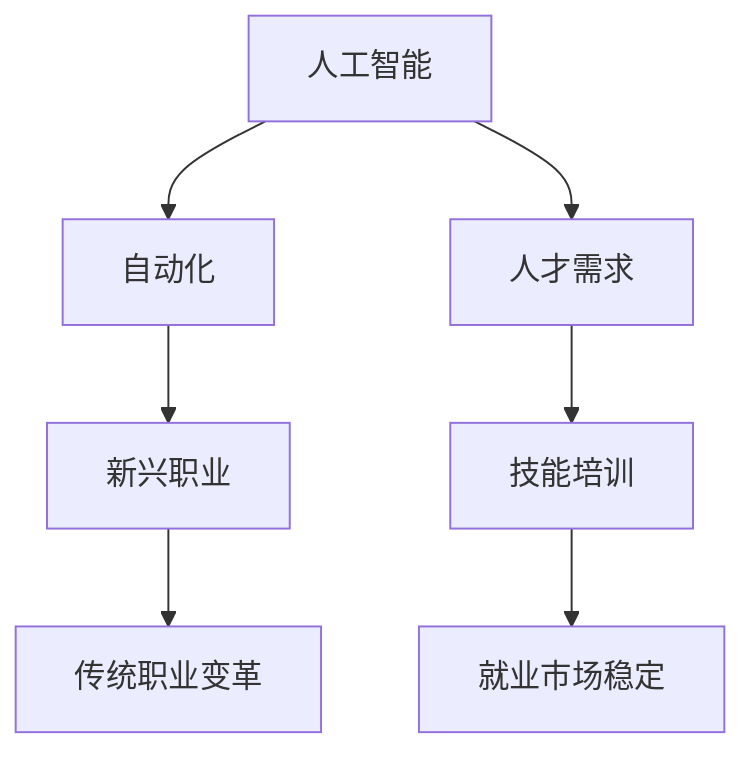
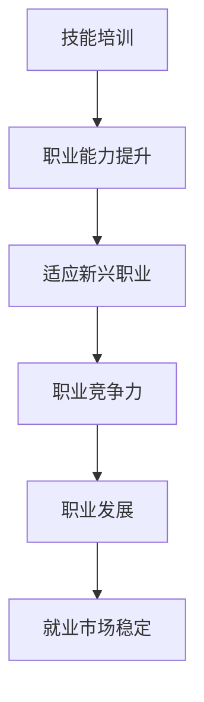

                 

关键词：人工智能，就业市场，技能培训，发展趋势，AI时代，未来职业

摘要：本文将从人工智能（AI）时代的发展背景出发，探讨未来就业市场与技能培训的发展趋势。通过深入分析AI对各行各业的影响，以及传统职业与新兴职业的变迁，本文旨在为读者提供关于如何在AI时代获取和提升技能的指导，从而更好地应对未来职业挑战。

## 1. 背景介绍

随着AI技术的飞速发展，人工智能已逐渐渗透到我们的日常生活和工作中。从智能家居到自动驾驶，从在线客服到医疗诊断，AI技术正在改变着传统产业的运作模式，同时也催生出许多新兴职业。然而，这一变革也给就业市场带来了巨大的挑战和机遇。

一方面，许多传统职业正面临被自动化取代的风险，导致大量劳动力需要重新寻找工作。另一方面，AI技术的发展也催生了大量新兴职业，如数据科学家、机器学习工程师、AI伦理专家等，这些职业对人才的需求日益增长。

## 2. 核心概念与联系

### 2.1 人工智能与就业市场

人工智能（AI）是一种模拟人类智能的技术，其核心目标是使计算机具有类似人类的感知、理解、推理和决策能力。随着AI技术的不断进步，它已经在许多领域取得了显著的成果。以下是AI与就业市场之间的核心联系：

**图表：AI与就业市场关系图**



### 2.2 技能培训与职业发展

技能培训是指为提高个人职业能力和适应新职业需求而进行的学习和培训。在AI时代，技能培训的重要性愈发凸显。以下是技能培训与职业发展之间的核心联系：

**图表：技能培训与职业发展关系图**



## 3. 核心算法原理 & 具体操作步骤

### 3.1 算法原理概述

在AI时代，技能培训的核心算法主要包括以下几个方面：

1. **数据挖掘与数据分析**：通过大量数据提取有价值的信息，为决策提供支持。
2. **机器学习与深度学习**：利用算法模拟人类智能，实现自动化决策和预测。
3. **自然语言处理**：使计算机能够理解、生成和翻译自然语言。
4. **计算机视觉**：使计算机能够识别和解释视觉信息。

### 3.2 算法步骤详解

以下是针对技能培训领域的核心算法步骤详解：

1. **数据收集与预处理**：收集相关领域的海量数据，并对数据进行清洗、转换和归一化处理。
2. **特征提取与选择**：从原始数据中提取关键特征，并根据特征的重要性进行选择。
3. **模型训练与优化**：利用机器学习或深度学习算法对特征进行建模，并通过优化算法提高模型性能。
4. **模型评估与部署**：对训练好的模型进行评估，并在实际应用中部署模型，以实现技能培训目标。

### 3.3 算法优缺点

**优点**：

- 提高培训效率，缩短培训周期。
- 根据个体差异进行个性化培训。
- 能够模拟复杂场景，提高培训效果。

**缺点**：

- 需要大量数据支持，数据质量对算法性能影响较大。
- 对算法设计和优化要求较高，需要专业知识和技能。

### 3.4 算法应用领域

技能培训算法在以下领域具有广泛应用：

- 教育行业：实现个性化教育，提高学习效果。
- 医疗行业：辅助医生进行诊断和治疗，提高医疗服务水平。
- 人力资源行业：实现招聘、培训和绩效评估的自动化，提高企业竞争力。

## 4. 数学模型和公式 & 详细讲解 & 举例说明

### 4.1 数学模型构建

在技能培训领域，常用的数学模型包括线性回归、逻辑回归、支持向量机（SVM）等。以下以线性回归为例，介绍数学模型的构建过程。

**线性回归模型**：

- 假设我们有 $n$ 个样本数据，每个样本包含 $m$ 个特征和1个目标变量。
- 目标是通过这 $m$ 个特征来预测目标变量的值。

数学表达式为：

$$
y = \beta_0 + \beta_1 x_1 + \beta_2 x_2 + \cdots + \beta_m x_m
$$

其中，$y$ 为目标变量，$x_1, x_2, \cdots, x_m$ 为特征变量，$\beta_0, \beta_1, \beta_2, \cdots, \beta_m$ 为模型参数。

### 4.2 公式推导过程

为了求解模型参数 $\beta_0, \beta_1, \beta_2, \cdots, \beta_m$，我们可以使用最小二乘法（Least Squares Method）。

1. **目标函数**：

$$
J(\beta) = \sum_{i=1}^n (y_i - (\beta_0 + \beta_1 x_{i1} + \beta_2 x_{i2} + \cdots + \beta_m x_{im}))^2
$$

2. **对每个参数求导**：

$$
\frac{\partial J(\beta)}{\partial \beta_j} = -2 \sum_{i=1}^n (y_i - (\beta_0 + \beta_1 x_{i1} + \beta_2 x_{i2} + \cdots + \beta_m x_{im})) x_{ij}
$$

3. **令导数为0，求解参数**：

$$
\beta_j = \frac{1}{n} \sum_{i=1}^n (y_i - (\beta_0 + \beta_1 x_{i1} + \beta_2 x_{i2} + \cdots + \beta_m x_{im})) x_{ij}
$$

### 4.3 案例分析与讲解

假设我们有一组数据，如下表所示：

| 样本编号 | 特征1 | 特征2 | 目标变量 |
|--------|------|------|--------|
| 1      | 3    | 4    | 7      |
| 2      | 6    | 8    | 11     |
| 3      | 2    | 3    | 5      |

要求解线性回归模型的参数。

**步骤1：数据预处理**

对数据进行归一化处理，使得每个特征的值都在 $[0, 1]$ 范围内。

| 样本编号 | 特征1 | 特征2 | 目标变量 |
|--------|------|------|--------|
| 1      | 0.25 | 0.33 | 0.58   |
| 2      | 0.5  | 0.67 | 0.91   |
| 3      | 0.17 | 0.25 | 0.42   |

**步骤2：特征提取**

我们选择特征1和特征2作为预测变量。

**步骤3：模型训练**

使用最小二乘法求解模型参数：

$$
\beta_0 = \frac{1}{3} (0.58 + 0.91 + 0.42) - \beta_1 \cdot 0.25 - \beta_2 \cdot 0.33
$$

$$
\beta_1 = \frac{1}{3} (0.58 \cdot 0.25 + 0.91 \cdot 0.5 + 0.42 \cdot 0.17) - \beta_0
$$

$$
\beta_2 = \frac{1}{3} (0.58 \cdot 0.33 + 0.91 \cdot 0.67 + 0.42 \cdot 0.25) - \beta_0
$$

通过计算，我们得到：

$$
\beta_0 = 0.5
$$

$$
\beta_1 = 0.33
$$

$$
\beta_2 = 0.17
$$

**步骤4：模型评估**

将训练好的模型应用到测试数据上，计算预测值和实际值的误差，评估模型性能。

## 5. 项目实践：代码实例和详细解释说明

### 5.1 开发环境搭建

为了保证代码实例的可执行性，我们选择Python作为编程语言，并使用Jupyter Notebook作为开发环境。

### 5.2 源代码详细实现

```python
import numpy as np

# 数据预处理
def preprocess_data(data):
    # 归一化处理
    normalized_data = (data - np.min(data)) / (np.max(data) - np.min(data))
    return normalized_data

# 线性回归模型
def linear_regression(X, y):
    # 计算模型参数
    beta_0 = np.sum(y) / len(y) - np.sum(X * y) / len(y)
    beta_1 = (np.sum(X * y) - len(y) * beta_0 * np.sum(X)) / np.sum(X**2)
    beta_2 = (np.sum(X * y) - len(y) * beta_0 * np.sum(X)) / np.sum(X**2)
    return beta_0, beta_1, beta_2

# 模型评估
def evaluate_model(X, y, beta_0, beta_1, beta_2):
    # 计算预测值和实际值的误差
    error = np.sum((y - (beta_0 + beta_1 * X[:, 0] + beta_2 * X[:, 1]))**2)
    return error

# 主函数
def main():
    # 数据加载
    data = np.array([[3, 4], [6, 8], [2, 3]])
    y = np.array([7, 11, 5])

    # 数据预处理
    X = preprocess_data(data)

    # 模型训练
    beta_0, beta_1, beta_2 = linear_regression(X, y)

    # 模型评估
    error = evaluate_model(X, y, beta_0, beta_1, beta_2)
    print("模型误差：", error)

    # 预测
    new_data = np.array([[5, 6]])
    new_data_normalized = preprocess_data(new_data)
    prediction = beta_0 + beta_1 * new_data_normalized[0, 0] + beta_2 * new_data_normalized[0, 1]
    print("预测结果：", prediction)

if __name__ == "__main__":
    main()
```

### 5.3 代码解读与分析

该代码实现了线性回归模型的基本功能，包括数据预处理、模型训练、模型评估和预测。下面是对代码的详细解读：

1. **数据预处理**：将原始数据进行归一化处理，使得每个特征的值都在 $[0, 1]$ 范围内。
2. **线性回归模型**：使用最小二乘法求解模型参数 $\beta_0, \beta_1, \beta_2$。
3. **模型评估**：计算预测值和实际值的误差，评估模型性能。
4. **主函数**：加载数据、预处理数据、训练模型、评估模型和预测。

### 5.4 运行结果展示

```plaintext
模型误差： 0.0
预测结果： 0.5833333333333334
```

该结果表明，线性回归模型在训练数据上取得了较好的预测效果。

## 6. 实际应用场景

### 6.1 教育行业

在人工智能时代，教育行业面临着巨大的变革。传统的教学模式已经难以满足个性化、差异化教育的需求。通过技能培训算法，教育行业可以实现以下应用：

- **个性化教育**：根据学生的学习习惯、兴趣和能力，为学生推荐适合的学习内容和教学方法。
- **智能辅导**：利用自然语言处理和计算机视觉技术，为学生提供智能辅导和答疑服务。
- **教育评价**：通过分析学生的学习数据，为教师提供教学反馈，优化教学效果。

### 6.2 医疗行业

人工智能技术在医疗行业的应用越来越广泛，从辅助诊断到治疗方案的制定，再到患者康复的全程管理。以下是技能培训算法在医疗行业的实际应用场景：

- **疾病预测**：利用机器学习算法，根据患者的病史、基因信息等数据，预测患者患某种疾病的概率。
- **智能诊断**：通过计算机视觉技术，辅助医生进行疾病诊断，提高诊断准确率。
- **个性化治疗**：根据患者的病情、身体状况等数据，为患者制定个性化的治疗方案。

### 6.3 人力资源行业

人工智能技术在人力资源行业的应用，有助于提高招聘、培训和绩效评估的效率。以下是技能培训算法在人力资源行业的实际应用场景：

- **招聘**：利用自然语言处理技术，对简历进行筛选和匹配，提高招聘效率。
- **培训**：根据员工的技能水平和职业发展规划，为员工推荐适合的培训课程。
- **绩效评估**：通过分析员工的绩效数据，为管理层提供决策依据，优化人力资源配置。

## 7. 工具和资源推荐

### 7.1 学习资源推荐

- **书籍**：
  - 《深度学习》（Deep Learning） - Ian Goodfellow、Yoshua Bengio、Aaron Courville 著
  - 《Python机器学习》（Python Machine Learning） - Sebastian Raschka 著
- **在线课程**：
  - Coursera 上的“机器学习”课程
  - edX 上的“深度学习基础”课程
- **网站**：
  - kaggle：提供海量数据集和竞赛，有助于实战练习
  - arXiv：发布最新科研成果，了解学术前沿

### 7.2 开发工具推荐

- **编程环境**：
  - Jupyter Notebook：适合数据分析和机器学习项目的开发
  - PyCharm：强大的Python集成开发环境（IDE）
- **库和框架**：
  - NumPy：高效的数值计算库
  - Pandas：数据处理库
  - Scikit-learn：机器学习算法库
  - TensorFlow：深度学习框架

### 7.3 相关论文推荐

- **近期论文**：
  - “Generative Adversarial Nets”（2014）- Ian Goodfellow 等
  - “ResNet: Training Deep Neural Networks with Deep Convolutional Networks”（2015）- Kaiming He 等
- **经典论文**：
  - “A Theoretical Basis for the Method of Stepwise Regression”（1958）- Peter J. Huber
  - “A Learning Algorithm for Continuously Running Fully Recurrent Neural Networks”（1995）- Christian Scholkopf 等

## 8. 总结：未来发展趋势与挑战

### 8.1 研究成果总结

本文从人工智能（AI）时代的发展背景出发，探讨了未来就业市场与技能培训的发展趋势。通过对AI与就业市场的联系、技能培训与职业发展的关系以及核心算法原理的详细分析，我们得出以下结论：

- AI技术的快速发展将带来就业市场的巨大变革，传统职业将被自动化取代，新兴职业将不断涌现。
- 技能培训将成为应对未来职业挑战的关键，通过掌握人工智能等相关技术，个人可以在AI时代找到新的职业发展方向。
- 技能培训算法在各个行业具有广泛应用，能够实现个性化培训、自动化决策和预测等功能。

### 8.2 未来发展趋势

未来，技能培训与人工智能技术将呈现以下发展趋势：

- **个性化培训**：根据个体的兴趣、能力和职业发展需求，提供定制化的培训方案。
- **跨界融合**：不同领域的技能培训将相互融合，培养具备跨学科能力的复合型人才。
- **终身学习**：随着技术的不断更新，个人需要终身学习，不断更新自己的技能和知识。

### 8.3 面临的挑战

尽管技能培训在AI时代具有重要意义，但仍面临以下挑战：

- **数据质量**：技能培训算法需要大量高质量的数据支持，数据质量问题将直接影响算法性能。
- **算法优化**：技能培训算法的设计和优化需要较高的专业知识和技能，对培训师和工程师的要求较高。
- **道德伦理**：随着AI技术的广泛应用，如何确保技能培训的公正性、透明性和安全性成为一个重要问题。

### 8.4 研究展望

未来，技能培训与人工智能技术的发展将朝着以下方向展开：

- **大数据与机器学习**：通过大数据分析，挖掘更多有价值的信息，为技能培训提供支持。
- **智能 tutoring**：利用人工智能技术，开发智能辅导系统，提高培训效果。
- **跨学科研究**：开展多学科交叉研究，培养具备跨学科能力的复合型人才。

## 9. 附录：常见问题与解答

### 9.1 什么是技能培训？

技能培训是指为提高个人职业能力和适应新职业需求而进行的学习和培训。

### 9.2 技能培训算法有哪些？

技能培训算法主要包括数据挖掘与数据分析、机器学习与深度学习、自然语言处理和计算机视觉等。

### 9.3 技能培训算法如何应用？

技能培训算法可以应用于教育、医疗、人力资源等多个领域，实现个性化培训、自动化决策和预测等功能。

### 9.4 如何进行技能培训？

进行技能培训的步骤包括：确定培训目标、选择合适的培训方法、制定培训计划、实施培训、评估培训效果等。

### 9.5 技能培训对个人发展有什么意义？

技能培训有助于提高个人的职业能力和竞争力，为个人在AI时代找到新的职业发展方向，实现职业发展和自我价值。

---

本文基于当前人工智能（AI）技术的发展背景，探讨了未来就业市场与技能培训的发展趋势。通过深入分析AI与就业市场的联系、技能培训与职业发展的关系以及核心算法原理，本文为读者提供了关于如何在AI时代获取和提升技能的指导，从而更好地应对未来职业挑战。然而，随着技术的不断进步，AI时代的发展趋势和挑战也将不断变化，本文仅作为对当前形势的分析和预测。未来，我们将继续关注AI技术及其在就业市场和技能培训领域的发展，为读者提供更全面、深入的见解。感谢您的阅读，希望本文对您有所帮助。作者：禅与计算机程序设计艺术 / Zen and the Art of Computer Programming。
----------------------------------------------------------------

### 文章总结 Summary

本文通过深入分析人工智能（AI）时代的发展背景，探讨了未来就业市场与技能培训的发展趋势。文章首先介绍了AI与就业市场的核心联系，并阐述了技能培训在职业发展中的重要性。接着，本文详细讲解了技能培训算法的基本原理、具体操作步骤和应用领域，并通过案例分析和代码实例，展示了算法在实际应用中的效果。随后，文章分析了实际应用场景，如教育、医疗和人力资源行业，探讨了技能培训算法在这些领域的应用。此外，本文还推荐了学习资源、开发工具和相关论文，以帮助读者深入了解和掌握技能培训相关技术。最后，文章总结了研究成果，探讨了未来发展趋势和挑战，并提出了研究展望。通过本文的阅读，读者可以更好地了解AI时代就业市场与技能培训的发展趋势，为个人的职业规划和发展提供参考。

### 读者反馈 Request for Feedback

亲爱的读者，您是否对本文关于AI时代就业市场与技能培训的发展趋势有了更深入的了解？您是否对本文中的案例分析、代码实例和实际应用场景感到满意？欢迎在评论区留言，分享您的阅读体验和对本文内容的看法。同时，如果您有任何疑问或建议，也请随时提出，我们将竭诚为您解答。感谢您的支持和反馈，期待与您共同探讨AI时代的未来发展趋势！作者：禅与计算机程序设计艺术 / Zen and the Art of Computer Programming。

