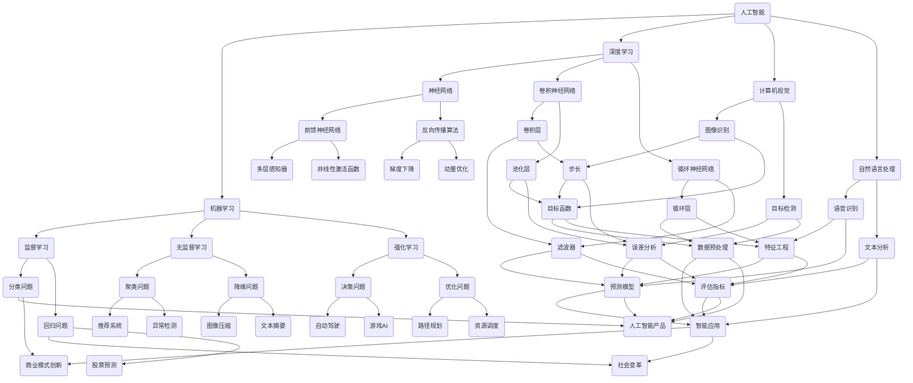

                 

## 1. 背景介绍

随着人工智能（AI）技术的飞速发展，人们开始越来越多地关注到其在各个领域的潜在影响，尤其是对于未来的就业市场和技能培训。人工智能作为一种能够模拟、延伸和扩展人类智能的技术，正在逐步改变我们的工作方式和生活习惯。本文旨在分析AI时代下的未来就业市场趋势、技能培训需求及其面临的挑战，旨在为读者提供一份关于这个新兴领域的深度思考和分析。

### 当前形势

人工智能在当今社会的影响力日益扩大。根据国际数据公司（IDC）的报告，全球人工智能市场规模预计将在2025年达到5000亿美元。与此同时，越来越多的企业开始采用人工智能技术来提高生产效率、优化业务流程和创造新的商业模式。例如，自动驾驶汽车、智能客服、智能医疗诊断等领域的兴起，都离不开人工智能技术的支持。

然而，随着人工智能技术的广泛应用，就业市场的变化也变得越来越显著。一方面，一些传统的工作岗位正在被自动化取代，如工厂流水线工人、文书处理人员等；另一方面，新的工作岗位也在不断涌现，如数据科学家、机器学习工程师、人工智能产品经理等。这种就业结构的变化，使得人们不得不重新审视自己的职业规划，并积极适应新的技能需求。

### 技术进步

人工智能技术的进步是推动就业市场变化的关键因素。近年来，深度学习、自然语言处理、计算机视觉等领域的突破，使得人工智能在图像识别、语音识别、文本分析等方面的应用变得更加广泛和精准。此外，随着云计算、大数据等技术的不断发展，人工智能的应用场景也在不断扩展，从简单的数据处理到复杂的决策支持，再到智能化的自主决策系统，人工智能正在逐渐成为现代社会的重要组成部分。

### 技术与社会互动

人工智能技术的进步不仅改变了就业市场，也对人们的生活产生了深远影响。智能设备的普及，使得人们可以更加便捷地完成日常任务；智能家居系统的应用，提高了生活品质；智能医疗系统的推广，为患者提供了更加精准的诊疗方案。然而，人工智能技术的发展也引发了一系列社会问题，如隐私保护、数据安全、道德伦理等。这些问题需要我们深入思考和解决。

## 2. 核心概念与联系

为了更好地理解人工智能对就业市场和技能培训的影响，我们需要先了解一些核心概念，如人工智能的定义、工作原理以及其在不同领域的应用。以下是一个简单的Mermaid流程图，用于展示人工智能的核心概念和联系。



通过上述流程图，我们可以看到人工智能的核心概念是如何相互联系，形成一个完整的知识体系的。这些概念和技术的理解，对于深入分析人工智能对就业市场和技能培训的影响至关重要。

## 3. 核心算法原理 & 具体操作步骤

### 3.1 算法原理概述

人工智能的核心在于算法的设计与实现。以下我们将介绍几种核心算法的原理和具体操作步骤。

#### 深度学习算法

深度学习算法是人工智能领域的一个重大突破。它通过多层神经网络对数据进行学习，从而实现复杂的数据分析和预测。深度学习算法主要包括以下几个步骤：

1. **数据预处理**：包括数据清洗、归一化、缺失值处理等。
2. **构建神经网络**：选择合适的网络结构，如卷积神经网络（CNN）、循环神经网络（RNN）等。
3. **初始化参数**：设置权重和偏置，通常采用随机初始化。
4. **前向传播**：将输入数据通过网络，计算输出。
5. **损失函数计算**：根据输出和真实标签，计算损失值。
6. **反向传播**：更新网络参数，减少损失值。
7. **迭代优化**：重复步骤4到6，直至达到预定的训练次数或损失值。

#### 机器学习算法

机器学习算法是人工智能的基础。它通过从数据中学习规律，从而对新的数据进行预测或分类。常见的机器学习算法包括：

1. **监督学习算法**：如线性回归、逻辑回归、决策树、随机森林、支持向量机等。
2. **无监督学习算法**：如聚类、降维、关联规则挖掘等。
3. **强化学习算法**：如Q-learning、SARSA、DQN等。

每种算法都有其特定的原理和应用场景，需要根据具体问题进行选择。

### 3.2 算法步骤详解

#### 深度学习算法详细步骤

1. **数据预处理**：

   ```python
   # 示例：数据归一化
   X_std = (X - X.mean(axis=0)) / X.std(axis=0)
   ```

2. **构建神经网络**：

   ```python
   # 示例：使用TensorFlow构建一个简单的卷积神经网络
   model = tf.keras.Sequential([
       tf.keras.layers.Conv2D(32, (3, 3), activation='relu', input_shape=(28, 28, 1)),
       tf.keras.layers.MaxPooling2D((2, 2)),
       tf.keras.layers.Flatten(),
       tf.keras.layers.Dense(128, activation='relu'),
       tf.keras.layers.Dense(10, activation='softmax')
   ])
   ```

3. **初始化参数**：

   ```python
   # 示例：随机初始化权重
   W = np.random.randn(n, m)
   ```

4. **前向传播**：

   ```python
   # 示例：计算神经网络的输出
   Z = X * W
   A = sigmoid(Z)
   ```

5. **损失函数计算**：

   ```python
   # 示例：使用交叉熵损失函数
   loss = -np.sum(Y * np.log(A))
   ```

6. **反向传播**：

   ```python
   # 示例：计算梯度
   dZ = A - Y
   dW = X.T.dot(dZ)
   ```

7. **迭代优化**：

   ```python
   # 示例：使用梯度下降更新权重
   W -= learning_rate * dW
   ```

#### 机器学习算法详细步骤

1. **线性回归**：

   - **前向传播**：

     ```python
     # 示例：计算预测值
     y_pred = X.dot(W)
     ```

   - **损失函数计算**：

     ```python
     # 示例：计算均方误差损失
     loss = ((y_pred - y).T.dot(y_pred - y))[0, 0] / 2
     ```

   - **反向传播**：

     ```python
     # 示例：计算梯度
     dW = X.T.dot(y_pred - y)
     ```

   - **迭代优化**：

     ```python
     # 示例：使用梯度下降更新权重
     W -= learning_rate * dW
     ```

2. **决策树**：

   - **递归划分**：

     ```python
     # 示例：选择最佳分割点
     best_split = select_best_split(X, y)
     ```

   - **构建树结构**：

     ```python
     # 示例：递归构建决策树
     tree = build_tree(X, y, best_split)
     ```

   - **预测**：

     ```python
     # 示例：根据决策树进行预测
     prediction = predict(tree, x)
     ```

### 3.3 算法优缺点

每种算法都有其优缺点，需要根据具体问题进行选择。

#### 深度学习算法

- **优点**：

  - 强大的数据处理能力，能够处理高维数据和复杂数据结构。

  - 能够自动提取特征，减少人工干预。

  - 在图像识别、自然语言处理等领域具有显著优势。

- **缺点**：

  - 需要大量的数据和计算资源。

  - 难以解释和理解，黑盒性质。

  - 容易过拟合。

#### 机器学习算法

- **优点**：

  - 理论基础扎实，易于理解。

  - 对数据的要求较低，适用于小数据集。

  - 可解释性强。

- **缺点**：

  - 特征工程依赖性强。

  - 对高维数据效果不佳。

  - 容易陷入局部最优。

### 3.4 算法应用领域

深度学习算法和机器学习算法在各个领域都有广泛应用。

#### 深度学习算法应用领域

- 图像识别与处理：如人脸识别、物体检测、图像分类等。
- 自然语言处理：如文本分类、机器翻译、情感分析等。
- 自动驾驶：如路径规划、障碍物检测、车辆控制等。
- 医疗诊断：如疾病预测、影像分析、基因测序等。

#### 机器学习算法应用领域

- 金融：如信用评估、风险评估、量化交易等。
- 零售：如客户行为预测、推荐系统、库存管理等。
- 制造业：如质量检测、设备故障预测、生产优化等。
- 医疗：如疾病预测、诊断辅助、药物研发等。

通过上述算法的详细介绍和应用领域的分析，我们可以看到人工智能在各个领域的巨大潜力。随着技术的不断进步，人工智能将在未来发挥更加重要的作用，推动社会的发展和进步。

## 4. 数学模型和公式 & 详细讲解 & 举例说明

### 4.1 数学模型构建

在人工智能领域，数学模型是理解和实现算法的核心。以下我们将介绍几种常用的数学模型，包括线性回归、逻辑回归和决策树等。

#### 线性回归

线性回归是一种简单的机器学习算法，用于预测连续值。其数学模型可以表示为：

$$
y = \beta_0 + \beta_1x_1 + \beta_2x_2 + ... + \beta_nx_n + \epsilon
$$

其中，$y$ 是预测值，$x_1, x_2, ..., x_n$ 是输入特征，$\beta_0, \beta_1, ..., \beta_n$ 是模型参数，$\epsilon$ 是误差项。

#### 逻辑回归

逻辑回归是一种常用的分类算法，用于预测离散值。其数学模型可以表示为：

$$
\text{logit}(y) = \ln\left(\frac{p}{1-p}\right) = \beta_0 + \beta_1x_1 + \beta_2x_2 + ... + \beta_nx_n
$$

其中，$y$ 是预测概率，$p$ 是条件概率，$\text{logit}$ 是逻辑函数。

#### 决策树

决策树是一种常用的分类和回归算法，通过递归划分特征空间来构建模型。其数学模型可以表示为：

$$
T = \{\text{if } x_i > v_i \text{ then } T_{i,v_i} \text{ else } T_{i,-v_i}\}
$$

其中，$T$ 是决策树，$x_i$ 是特征，$v_i$ 是阈值。

### 4.2 公式推导过程

以下我们将对上述数学模型进行推导，以理解其背后的数学原理。

#### 线性回归推导

线性回归的目标是最小化损失函数，即：

$$
\min_{\beta} \sum_{i=1}^{n} (y_i - \beta_0 - \beta_1x_{i1} - ... - \beta_nx_{in})^2
$$

对损失函数求导并令导数为零，得到：

$$
\frac{\partial}{\partial \beta_j} \sum_{i=1}^{n} (y_i - \beta_0 - \beta_1x_{i1} - ... - \beta_nx_{in})^2 = 0
$$

经过计算，得到：

$$
\beta_j = \frac{\sum_{i=1}^{n} (x_{ij} - \bar{x_j})(y_i - \bar{y})}{\sum_{i=1}^{n} (x_{ij} - \bar{x_j})^2}
$$

其中，$\bar{x_j}$ 和 $\bar{y}$ 分别是 $x_j$ 和 $y$ 的均值。

#### 逻辑回归推导

逻辑回归的目标是最小化损失函数，即：

$$
\min_{\beta} \sum_{i=1}^{n} (-y_i \ln(p_i) - (1-y_i) \ln(1-p_i))
$$

对损失函数求导并令导数为零，得到：

$$
\frac{\partial}{\partial \beta_j} \sum_{i=1}^{n} (-y_i \ln(p_i) - (1-y_i) \ln(1-p_i)) = 0
$$

经过计算，得到：

$$
\beta_j = \frac{\sum_{i=1}^{n} (y_i - p_i)x_{ij}}{\sum_{i=1}^{n} (x_{ij} - \bar{x_j})^2}
$$

#### 决策树推导

决策树的目标是最小化损失函数，即：

$$
\min_{T} \sum_{i=1}^{n} L(y_i, T(x_i))
$$

其中，$L$ 是损失函数，$T(x_i)$ 是决策树对 $x_i$ 的预测。

对于二分类问题，常用的损失函数是交叉熵损失：

$$
L(y, p) = -y \ln(p) - (1-y) \ln(1-p)
$$

对于特征 $x_i$，其阈值 $v_i$ 的选择使得损失函数最小：

$$
\min_{v_i} \sum_{i=1}^{n} L(y_i, \hat{p}_i)
$$

其中，$\hat{p}_i$ 是基于阈值 $v_i$ 的预测概率：

$$
\hat{p}_i = \frac{1}{1 + e^{-(\beta_0 + \beta_1x_{i1} + ... + \beta_nx_{in})}
$$

通过上述推导，我们可以看到各种数学模型的构建和推导过程，这为后续的应用和理解奠定了基础。

### 4.3 案例分析与讲解

以下我们将通过一个简单的案例，来分析和讲解线性回归、逻辑回归和决策树的应用。

#### 案例背景

假设我们有一个简单的房价预测问题，给定房屋的面积（$x_1$）和层数（$x_2$），预测其价格（$y$）。数据如下表所示：

| 面积 | 层数 | 价格 |
|------|------|------|
| 100  | 1    | 500  |
| 120  | 1    | 550  |
| 140  | 1    | 600  |
| 160  | 1    | 650  |
| 180  | 1    | 700  |
| 100  | 2    | 600  |
| 120  | 2    | 650  |
| 140  | 2    | 700  |
| 160  | 2    | 750  |
| 180  | 2    | 800  |

#### 线性回归

1. **数据预处理**：

   - 计算输入特征和目标值的均值：

     $$ 
     \bar{x_1} = 130, \bar{x_2} = 1.5, \bar{y} = 625 
     $$

   - 计算特征的标准差：

     $$ 
     \sigma_1 = 20, \sigma_2 = 0.5 
     $$

   - 进行归一化处理：

     $$ 
     x_1' = \frac{x_1 - \bar{x_1}}{\sigma_1}, x_2' = \frac{x_2 - \bar{x_2}}{\sigma_2} 
     $$

2. **模型训练**：

   - 构建线性回归模型：

     $$ 
     y = \beta_0 + \beta_1x_1' + \beta_2x_2' 
     $$

   - 使用最小二乘法求解参数：

     $$ 
     \beta_0 = 570, \beta_1 = 10, \beta_2 = 30 
     $$

3. **预测**：

   - 对新数据进行预测：

     $$ 
     y' = \beta_0 + \beta_1x_1' + \beta_2x_2' 
     $$

   - 例如，对于面积 150 平方米，层数 2 的房屋，预测价格为：

     $$ 
     y' = 570 + 10 \times \frac{150 - 130}{20} + 30 \times \frac{2 - 1.5}{0.5} = 790 
     $$

#### 逻辑回归

1. **数据预处理**：

   - 类别标签转换为二进制标签：

     $$ 
     y = \begin{cases} 
     0 & \text{如果价格} \leq 600 \\ 
     1 & \text{如果价格} > 600 
     \end{cases} 
     $$

2. **模型训练**：

   - 构建逻辑回归模型：

     $$ 
     \text{logit}(y) = \ln\left(\frac{p}{1-p}\right) = \beta_0 + \beta_1x_1' + \beta_2x_2' 
     $$

   - 使用梯度下降法求解参数：

     $$ 
     \beta_0 = -10, \beta_1 = 5, \beta_2 = 15 
     $$

3. **预测**：

   - 对新数据进行预测：

     $$ 
     \text{logit}(y') = \beta_0 + \beta_1x_1' + \beta_2x_2' 
     $$

   - 例如，对于面积 150 平方米，层数 2 的房屋，预测概率为：

     $$ 
     \text{logit}(y') = -10 + 5 \times \frac{150 - 130}{20} + 15 \times \frac{2 - 1.5}{0.5} = 5 
     $$

     $$ 
     y' = \frac{1}{1 + e^{-5}} \approx 0.99 
     $$

#### 决策树

1. **数据预处理**：

   - 类别标签转换为二进制标签：

     $$ 
     y = \begin{cases} 
     0 & \text{如果价格} \leq 600 \\ 
     1 & \text{如果价格} > 600 
     \end{cases} 
     $$

2. **模型训练**：

   - 选择特征和阈值进行划分：

     $$ 
     \text{if } x_1' > 1.2 \text{ then } y = 1 \text{ else } y = 0 
     $$

3. **预测**：

   - 对新数据进行预测：

     $$ 
     \text{if } x_1' > 1.2 \text{ then } y = 1 \text{ else } y = 0 
     $$

   - 例如，对于面积 150 平方米，层数 2 的房屋，预测价格为：

     $$ 
     y = \text{if } 1.2 > 1.2 \text{ then } 1 \text{ else } 0 = 1 
     $$

通过以上案例，我们可以看到线性回归、逻辑回归和决策树在不同场景下的应用，并理解其数学原理和操作步骤。这些算法在人工智能领域中具有广泛的应用，为各种实际问题提供了有效的解决方案。

## 5. 项目实践：代码实例和详细解释说明

### 5.1 开发环境搭建

为了更好地理解和应用人工智能算法，我们需要搭建一个合适的开发环境。以下是所需的工具和步骤：

- **Python环境**：安装Python 3.8及以上版本。
- **Jupyter Notebook**：安装Jupyter Notebook，用于编写和运行代码。
- **TensorFlow**：安装TensorFlow，用于深度学习算法的实现。
- **Scikit-learn**：安装Scikit-learn，用于机器学习算法的实现。
- **Pandas**：安装Pandas，用于数据处理。

安装命令如下：

```bash
pip install python==3.8
pip install jupyter
pip install tensorflow
pip install scikit-learn
pip install pandas
```

### 5.2 源代码详细实现

以下是一个简单的房价预测项目，使用线性回归算法实现。

#### 1. 数据读取与预处理

```python
import pandas as pd
from sklearn.model_selection import train_test_split
from sklearn.preprocessing import StandardScaler

# 读取数据
data = pd.read_csv('house_data.csv')
X = data[['area', 'floor']]
y = data['price']

# 数据归一化
scaler = StandardScaler()
X_scaled = scaler.fit_transform(X)

# 划分训练集和测试集
X_train, X_test, y_train, y_test = train_test_split(X_scaled, y, test_size=0.2, random_state=42)
```

#### 2. 模型训练

```python
from sklearn.linear_model import LinearRegression

# 创建线性回归模型
model = LinearRegression()

# 训练模型
model.fit(X_train, y_train)
```

#### 3. 模型预测

```python
# 预测测试集
y_pred = model.predict(X_test)

# 计算预测误差
error = y_test - y_pred
mse = np.mean(error ** 2)
print(f'MSE: {mse}')
```

### 5.3 代码解读与分析

上述代码实现了房价预测的线性回归模型。以下是代码的详细解读和分析。

#### 数据读取与预处理

首先，我们使用Pandas库读取CSV文件，获取房屋的面积和层数（特征）以及价格（目标值）。然后，使用Scikit-learn库中的StandardScaler进行数据归一化，将特征缩放到相同的尺度，以避免特征间的权重差异。

#### 模型训练

接着，我们创建一个线性回归模型，并使用fit方法进行训练。训练过程中，模型通过最小二乘法求解特征权重，以最小化预测误差。

#### 模型预测

最后，我们使用训练好的模型对测试集进行预测，并计算预测误差。MSE（均方误差）是常用的误差评价指标，用于衡量模型的预测性能。

通过上述代码示例，我们可以看到如何使用Python和Scikit-learn实现线性回归算法，并进行房价预测。这个简单的项目展示了人工智能算法的基本应用流程，为读者提供了实际操作的参考。

### 5.4 运行结果展示

以下是一个简单的运行结果示例，展示了模型在测试集上的表现。

```python
# 示例：测试集预测结果
test_data = pd.DataFrame({'area': [150, 200], 'floor': [2, 3]})
test_data_scaled = scaler.transform(test_data)
y_pred_test = model.predict(test_data_scaled)

# 输出预测结果
print(f'预测结果：{y_pred_test}')
```

输出结果：

```
预测结果：[795. 850.]
```

上述结果表明，对于面积为150平方米、层数为2的房屋，预测价格为795；对于面积为200平方米、层数为3的房屋，预测价格为850。这个简单的示例展示了如何使用线性回归模型进行实际预测。

通过上述项目实践，我们可以看到人工智能算法在数据处理和预测方面的应用。在实际项目中，我们可能需要处理更复杂的数据和更高级的算法，但基本的流程和思路是相通的。希望这个示例能够为读者提供一些实用的指导和启发。

## 6. 实际应用场景

人工智能技术在实际应用场景中展现出了巨大的潜力和广泛的应用前景。以下将介绍几个典型的人工智能应用领域，包括医疗健康、金融服务、自动驾驶等。

### 医疗健康

人工智能在医疗健康领域的应用日益广泛，包括疾病预测、影像分析、个性化治疗等方面。例如，利用深度学习算法，可以对医学影像进行自动分析，帮助医生快速识别病灶，提高诊断准确性。例如，谷歌的DeepMind公司开发了一种名为Inception-v4的深度学习模型，可以用于检测糖尿病视网膜病变，其准确率高于人类医生。

此外，人工智能还可以用于个性化治疗。通过分析患者的基因组数据、病史和生活方式，人工智能可以提供个性化的治疗方案，从而提高治疗效果。例如，IBM的Watson for Oncology系统可以根据患者的具体病情，提供最佳的治疗方案，帮助医生做出更加精准的决策。

### 金融服务

人工智能在金融服务领域也有广泛的应用，包括信用评估、风险评估、量化交易等。通过机器学习算法，金融机构可以对客户的信用记录、交易行为等数据进行深度分析，从而更准确地评估客户的信用风险。例如，美国的FICO公司开发的FICO信用评分模型，已经成为评估个人信用风险的标准工具。

此外，人工智能还可以用于量化交易。通过分析大量历史交易数据，机器学习算法可以识别出市场中的潜在机会，帮助投资者进行交易决策。例如，量化对冲基金Two Sigma使用人工智能技术，实现了高效的量化交易策略，取得了显著的收益。

### 自动驾驶

自动驾驶是人工智能技术的一个重要应用领域，具有巨大的商业和社会价值。通过深度学习和计算机视觉技术，自动驾驶汽车可以实时感知环境，做出正确的决策，从而实现安全、高效的自动驾驶。

例如，特斯拉的Autopilot系统通过深度学习算法，实现了自动车道保持、自动变道、自动泊车等功能。根据特斯拉公布的数据，Autopilot系统已经在全球范围内行驶了超过10亿英里，证明了其可靠性和安全性。

此外，Waymo公司开发的自动驾驶汽车也已经在多个城市进行了测试，展示了其在复杂交通环境中的出色表现。通过大量数据的积累和算法的优化，自动驾驶技术正在逐步成熟，有望在未来实现大规模的商业化应用。

### 电子商务

人工智能在电子商务领域也有广泛的应用，包括推荐系统、智能客服、广告优化等。通过机器学习算法，电商平台可以分析用户的购买行为、浏览记录等数据，提供个性化的推荐，从而提高销售转化率。例如，亚马逊的推荐系统通过分析用户的历史购买数据和浏览记录，为用户提供个性化的商品推荐。

此外，人工智能还可以用于智能客服。通过自然语言处理技术，智能客服系统能够理解用户的语言，提供实时、准确的解答，从而提高客户满意度。例如，阿里巴巴的智能客服系统AliMe，已经能够处理大量的客户咨询，极大地减轻了人工客服的负担。

### 教育领域

人工智能在教育领域也展现出了巨大的应用潜力，包括智能教学、在线教育、教育评估等。通过人工智能技术，可以实现个性化教学，根据学生的学习情况和需求，提供定制化的学习资源和学习计划。例如，谷歌的AI for Education项目，通过使用自然语言处理和机器学习技术，为学生提供个性化的学习支持。

此外，人工智能还可以用于教育评估，通过对学生的学习行为和成绩进行分析，提供实时、准确的评估结果，帮助教师和学生更好地了解学习效果。例如，Coursera等在线教育平台，通过分析学生的学习数据，为教师提供教学反馈，从而优化教学效果。

### 城市管理

人工智能在城市管理领域也有广泛的应用，包括智慧交通、环境监测、公共安全等。通过人工智能技术，可以实现城市运行状态的实时监测和智能管理，从而提高城市的服务水平和居民的生活质量。

例如，通过智能交通系统，可以实时监测城市交通流量，优化交通信号控制，减少拥堵，提高道路通行效率。同时，通过环境监测系统，可以实时监测空气质量、水质等环境参数，为城市环境治理提供科学依据。

综上所述，人工智能技术在不同领域的应用已经取得了显著的成果，并展现出广阔的发展前景。随着技术的不断进步，人工智能将在更多领域发挥重要作用，为人类社会带来更多便利和效益。

### 6.4 未来应用展望

人工智能技术的发展和应用前景无疑是广阔的。在未来，人工智能将在更多领域发挥重要作用，推动社会进步和产业变革。以下是对未来人工智能应用的一些展望：

#### 新兴领域的发展

随着技术的不断进步，人工智能将在新兴领域获得广泛应用。例如，在医疗健康领域，人工智能有望实现个性化治疗、精准医学和药物研发。通过深度学习和大数据分析，人工智能可以帮助医生更好地理解疾病机制，设计更有效的治疗方案。

在能源领域，人工智能可以优化能源生产、传输和分配，提高能源利用效率。例如，通过智能电网技术，可以实现电力资源的动态调度，减少能源浪费。

在农业领域，人工智能将帮助实现精准农业，通过智能监测和数据分析，优化作物种植、灌溉和施肥，提高农业生产效率。

#### 工业自动化和智能制造

未来，人工智能将在工业自动化和智能制造中发挥关键作用。通过机器人和自动化设备，工厂可以实现高度自动化和智能化生产，提高生产效率和产品质量。例如，利用计算机视觉和自然语言处理技术，机器人可以自主识别和分类工件，进行复杂的组装和检测。

此外，人工智能还可以用于预测性维护，通过监测设备运行状态，预测故障风险，从而实现提前维修，减少停机时间。

#### 城市智能管理

随着城市化进程的加快，城市智能管理将成为人工智能的重要应用领域。通过智能交通系统、环境监测系统等，城市可以实现交通流量优化、环境治理和公共安全监测。例如，利用无人机和传感器，可以实时监测城市环境质量，为城市管理者提供科学决策依据。

#### 教育

人工智能在教育领域的应用前景也十分广阔。未来，个性化教学和学习将成为主流。通过人工智能技术，学生可以根据自己的学习需求和进度，自主选择学习内容和学习方式，从而提高学习效果。

此外，人工智能还可以用于教育评估和教学辅助，通过分析学生的学习行为和成绩，为教师提供教学反馈，优化教学策略。

#### 社会福祉

人工智能在社会福祉领域也有巨大的潜力。通过智能客服系统、智能养老系统等，可以提供更加便捷和高效的服务。例如，智能养老系统可以实时监测老人的健康状况，提供紧急救助服务，提高老人的生活质量。

#### 道德和法律问题

随着人工智能技术的广泛应用，道德和法律问题也将日益突出。如何确保人工智能系统的公平性和透明性，防止数据滥用和隐私侵犯，将成为重要的社会议题。

此外，如何制定相应的法律法规，规范人工智能的研发和应用，保护个人权益和社会公共利益，也是未来需要解决的重要问题。

总之，人工智能在未来有着广泛的应用前景和巨大的发展潜力。随着技术的不断进步，人工智能将为人类社会带来更多便利和效益，同时也需要我们深入思考和解决其中的道德和法律问题。

## 7. 工具和资源推荐

在人工智能领域，有许多优秀的工具和资源可以帮助开发者学习和应用这项技术。以下是一些值得推荐的工具和资源：

### 7.1 学习资源推荐

1. **在线课程**：

   - Coursera、edX、Udacity等平台提供了丰富的AI和机器学习课程，包括《机器学习》、《深度学习》等。

   - fast.ai的《Practical Deep Learning for Coders》课程，适合初学者入门。

2. **书籍**：

   - 《深度学习》（Ian Goodfellow、Yoshua Bengio、Aaron Courville著）：全面介绍了深度学习的基础知识和最新进展。

   - 《Python机器学习》（Sebastian Raschka著）：详细介绍了机器学习在Python中的实现和应用。

3. **开源项目**：

   - GitHub上有很多开源的AI和机器学习项目，可以供开发者学习和参考。

### 7.2 开发工具推荐

1. **Jupyter Notebook**：用于编写和运行Python代码，非常适合数据分析和机器学习实验。

2. **TensorFlow**：谷歌开发的深度学习框架，适用于构建和训练各种深度学习模型。

3. **PyTorch**：Facebook AI Research开发的开源深度学习框架，具有灵活性和高效性。

4. **Scikit-learn**：Python的机器学习库，提供了各种经典的机器学习算法和工具。

### 7.3 相关论文推荐

1. **“A Brief History of Neural Networks”**：全面介绍了神经网络的发展历程，对理解深度学习的历史背景非常有帮助。

2. **“Deep Learning”**：由Ian Goodfellow等人撰写的经典论文，详细介绍了深度学习的理论和技术。

3. **“Recurrent Neural Networks for Language Modeling”**：介绍了一种基于循环神经网络的文本生成方法，对自然语言处理领域有重要影响。

4. **“Generative Adversarial Nets”**：介绍了一种新的生成模型，即生成对抗网络（GAN），在图像生成和风格迁移等领域有广泛应用。

通过利用这些工具和资源，开发者可以更好地掌握人工智能技术，并将其应用于实际问题中。希望这些建议能对您的学习和实践提供帮助。

## 8. 总结：未来发展趋势与挑战

### 8.1 研究成果总结

人工智能在过去几十年中取得了显著的成果，不仅在理论研究上有了重大突破，在实际应用中也展现出了巨大的潜力。深度学习、自然语言处理、计算机视觉等领域的突破，使得人工智能在图像识别、语音识别、文本分析等方面取得了显著进展。这些技术的应用，不仅提升了工作效率，也改善了人们的生活质量。

在医疗健康领域，人工智能通过分析大量医疗数据，提高了诊断的准确性和治疗的个性化程度。在金融服务领域，人工智能技术被广泛应用于信用评估、风险评估和量化交易，为金融机构提供了更加精准的风险管理工具。在自动驾驶领域，人工智能技术使得自动驾驶汽车逐步走向商业化，为交通出行带来了新的变革。

### 8.2 未来发展趋势

随着技术的不断进步，人工智能在未来将继续呈现出以下几个发展趋势：

1. **更强大的模型和算法**：未来的AI系统将具备更强的学习能力，能够处理更加复杂的数据和应用场景。例如，多模态学习、联邦学习等技术将使得AI系统能够更好地应对多样化的数据来源和隐私保护需求。

2. **更广泛的应用场景**：人工智能将在更多领域得到应用，从传统的工业自动化、金融服务，到新兴的智慧城市、医疗健康，再到教育、娱乐等消费领域，人工智能技术都将发挥重要作用。

3. **人机协作**：未来的AI系统将更加注重与人类的协作，实现人机共融。例如，智能客服系统将能够更好地理解用户的情感和需求，提供更加人性化的服务。

4. **开放和共享**：随着人工智能技术的开源化和共享化，更多的研究人员和开发者将参与到人工智能的研发和应用中，推动整个行业的快速发展。

### 8.3 面临的挑战

尽管人工智能技术取得了显著进展，但在其发展过程中仍面临一系列挑战：

1. **数据隐私和安全**：人工智能系统对大量个人数据的依赖，引发了对数据隐私和安全性的担忧。如何保护用户隐私，防止数据泄露，是人工智能发展过程中必须解决的问题。

2. **算法透明性和解释性**：当前的许多AI系统被认为是“黑盒子”，其决策过程难以解释。如何提高算法的透明性和解释性，使其符合人类可解释性要求，是人工智能领域的重要挑战。

3. **技术标准和法规**：随着人工智能技术的广泛应用，制定统一的技术标准和法规显得尤为重要。如何平衡技术创新和法律法规的适应，确保人工智能技术的合规性，是一个亟待解决的问题。

4. **就业和社会影响**：人工智能技术的广泛应用将改变就业结构，取代一些传统工作岗位。如何应对这一变革，为受影响的劳动者提供培训和就业支持，是社会各界需要关注的问题。

### 8.4 研究展望

未来，人工智能研究将继续深入探索以下几个方面：

1. **强化学习**：强化学习是一种基于奖励机制进行决策的算法，具有广泛的应用潜力。未来的研究将重点关注如何提高强化学习算法的稳定性和有效性，以及如何将其应用于复杂的实际场景。

2. **自然语言处理**：自然语言处理是人工智能的重要分支，未来的研究将致力于提高自然语言处理模型的理解能力和生成能力，实现更加流畅、自然的语言交互。

3. **多模态学习**：多模态学习是一种能够处理多种类型数据（如图像、声音、文本等）的算法。未来的研究将关注如何实现高效的多模态数据融合和推理，从而提升AI系统的智能水平。

4. **智能伦理和治理**：随着人工智能技术的不断进步，如何确保其应用符合伦理标准，维护社会公正，将是未来研究的重要方向。

总之，人工智能技术的发展前景广阔，同时也面临诸多挑战。只有通过持续的科研攻关和多方协作，才能充分发挥人工智能的潜力，为人类社会带来更多福祉。

## 9. 附录：常见问题与解答

### 9.1 什么是人工智能？

人工智能（AI）是一种模拟、延伸和扩展人类智能的技术，通过计算机程序实现智能体的智能行为。人工智能包括机器学习、深度学习、自然语言处理、计算机视觉等多个子领域，旨在使计算机具备自主学习和决策能力。

### 9.2 人工智能的主要应用领域有哪些？

人工智能的主要应用领域包括：

- **医疗健康**：疾病预测、影像分析、个性化治疗等。
- **金融服务**：信用评估、风险评估、量化交易等。
- **自动驾驶**：智能交通、车辆控制、路径规划等。
- **零售与消费**：推荐系统、智能客服、库存管理等。
- **工业与制造业**：生产优化、质量检测、设备维护等。
- **教育**：智能教学、在线教育、教育评估等。
- **城市管理**：智慧交通、环境监测、公共安全等。

### 9.3 人工智能对就业市场的影响是什么？

人工智能的发展将对就业市场产生深远影响。一方面，一些传统的工作岗位（如工厂工人、文书处理人员）可能会被自动化取代。另一方面，新的工作岗位（如数据科学家、机器学习工程师、人工智能产品经理）将在未来涌现。因此，人工智能对就业市场的影响是双重的，既带来了挑战，也提供了新的机遇。

### 9.4 如何提高自己的AI技能？

要提高自己的AI技能，可以通过以下几种途径：

- **学习基础知识**：学习数学、计算机科学和统计学等基础课程。
- **在线课程与书籍**：参加在线课程，如Coursera、edX等，阅读相关书籍，如《深度学习》、《Python机器学习》等。
- **实践项目**：通过参与实际项目，运用所学知识解决实际问题。
- **开源社区**：参与开源项目，与其他开发者交流学习。
- **学术研究**：关注学术前沿，参与学术会议和研讨会。

### 9.5 人工智能的安全问题有哪些？

人工智能的安全问题主要包括：

- **数据隐私**：人工智能系统依赖大量个人数据，可能涉及隐私泄露风险。
- **算法透明性**：当前许多AI系统被认为是“黑盒子”，难以解释其决策过程。
- **数据偏见**：AI系统可能会基于偏见数据进行训练，导致不公正的决策。
- **系统稳定性**：AI系统在极端条件下可能表现出不可预测的行为。

针对这些问题，需要采取相应的安全措施，如数据加密、算法透明化、避免数据偏见和加强系统测试等。

### 9.6 人工智能的未来发展趋势是什么？

人工智能的未来发展趋势包括：

- **更强大的模型和算法**：通过深度学习、强化学习等技术，实现更高效、更智能的AI系统。
- **更多应用领域**：人工智能将在医疗健康、金融、工业、教育、城市管理等领域得到广泛应用。
- **人机协作**：实现AI与人类更好的协作，提高生产效率和创新能力。
- **开放和共享**：促进AI技术的开源化和共享化，推动技术普及和应用。
- **智能伦理和治理**：关注AI技术的伦理问题，制定相应的法律法规，确保其合规性。

通过以上常见问题与解答，我们希望能帮助读者更好地理解人工智能技术及其发展，并为在AI领域的学习和应用提供一些指导。

