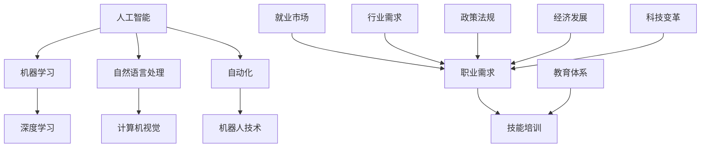

                 

关键词：人工智能，就业市场，技能培训，发展趋势，机遇，挑战

摘要：随着人工智能技术的迅猛发展，传统的就业市场正在经历深刻的变革。本文将深入分析AI时代下未来就业市场的变化，探讨技能培训的发展趋势，以及面临的机遇和挑战。通过对核心概念的解析、算法原理的阐释、数学模型的构建，以及实际应用的案例分析，本文旨在为读者提供一幅AI时代的未来图景，并展望未来的发展趋势。

## 1. 背景介绍

在过去的几十年中，计算机科学和人工智能（AI）领域的进步给我们带来了前所未有的变革。计算机硬件性能的提升、算法的优化、大数据的普及以及深度学习技术的突破，使得AI技术在各个行业得到广泛应用，从医疗健康、金融服务、教育娱乐到制造业、农业，AI的影响无处不在。

### 1.1 AI的发展历程

人工智能的概念可以追溯到20世纪50年代，当时的计算机科学家们开始设想能够制造出具有人类智能的机器。从1956年达特茅斯会议的召开，到20世纪80年代的专家系统的兴起，再到21世纪初的深度学习革命，人工智能经历了多个阶段的发展。

### 1.2 AI的应用领域

今天，人工智能技术已经在众多领域显示出其巨大的潜力。例如，自动驾驶技术正在逐步实现商业化，金融领域的风险管理通过AI技术得到了极大的优化，医疗诊断和预测变得更加精准，教育领域中的个性化学习系统也在逐步推广。

### 1.3 AI带来的就业市场变化

随着AI技术的普及，就业市场也面临着前所未有的变革。一方面，许多传统职业正在被自动化和智能化所取代；另一方面，新的职业和就业机会也在不断涌现。这种变化不仅影响了低技能劳动者，也对中高技能劳动者提出了新的挑战。

## 2. 核心概念与联系

在深入探讨AI时代的就业市场和技能培训之前，有必要理解一些核心概念和它们之间的联系。以下是几个关键概念及其相互关系的Mermaid流程图。



### 2.1 人工智能（AI）

人工智能是一门研究如何使计算机模拟人类智能行为的科学。它包括多个子领域，如机器学习、自然语言处理、计算机视觉等。

### 2.2 机器学习（ML）

机器学习是AI的一个子领域，主要研究如何让计算机从数据中自动学习和改进性能。它分为监督学习、无监督学习和强化学习等不同的方法。

### 2.3 深度学习（DL）

深度学习是机器学习中的一个分支，它通过构建多层神经网络来模拟人脑的学习过程。深度学习在图像识别、语音识别和自然语言处理等领域取得了显著成果。

### 2.4 自然语言处理（NLP）

自然语言处理是AI的一个子领域，专注于使计算机理解和生成人类语言。它包括文本分类、情感分析、机器翻译等应用。

### 2.5 计算机视觉（CV）

计算机视觉是AI的另一个子领域，旨在使计算机能够理解和处理图像和视频。它包括图像分类、目标检测、图像分割等任务。

### 2.6 自动化（Automation）

自动化是指通过计算机技术和人工智能技术来实现生产和操作过程的自动化。它包括工业自动化、自动驾驶、智能家居等应用。

### 2.7 机器人技术（Robotics）

机器人技术是自动化的一部分，它涉及到设计、构建和应用机器人。机器人可以在制造、服务、医疗等多个领域发挥作用。

### 2.8 就业市场与相关概念

就业市场是指劳动力市场中求职者与雇主之间的互动。职业需求、技能培训、教育体系、行业需求、政策法规和经济发展等因素共同影响着就业市场。

## 3. 核心算法原理 & 具体操作步骤

### 3.1 算法原理概述

在AI时代，算法的原理和应用至关重要。以下是一些核心算法及其原理概述：

### 3.1.1 深度学习

深度学习是一种通过多层神经网络模拟人脑学习的算法。它通过反向传播算法不断调整网络权重，以达到训练目标。

### 3.1.2 自然语言处理

自然语言处理算法通过统计模型、深度学习等方法，使计算机能够理解和生成人类语言。

### 3.1.3 计算机视觉

计算机视觉算法通过图像处理、机器学习等方法，使计算机能够理解图像中的内容。

### 3.2 算法步骤详解

以下是一个简单的深度学习算法步骤详解：

### 3.2.1 数据预处理

- 数据清洗：去除噪声和异常值
- 数据归一化：将数据缩放到相同的范围

### 3.2.2 构建神经网络

- 设计网络结构：确定输入层、隐藏层和输出层的节点数
- 初始化权重：随机初始化网络权重

### 3.2.3 前向传播

- 将输入数据传递到神经网络中
- 计算每个节点的输出

### 3.2.4 反向传播

- 计算输出误差
- 更新网络权重

### 3.2.5 模型评估

- 使用验证集评估模型性能
- 调整模型参数

### 3.3 算法优缺点

- **优点**：深度学习能够自动提取特征，减少了人工干预的需求；自然语言处理和计算机视觉算法在许多任务上取得了突破性进展。
- **缺点**：深度学习模型通常需要大量的数据和计算资源；模型解释性较差，难以理解决策过程。

### 3.4 算法应用领域

- **自然语言处理**：文本分类、情感分析、机器翻译等。
- **计算机视觉**：图像识别、目标检测、图像生成等。
- **自动化**：自动驾驶、智能家居、工业自动化等。

## 4. 数学模型和公式 & 详细讲解 & 举例说明

在AI时代，数学模型和公式是理解和应用算法的基础。以下是一个简单的数学模型及其推导过程。

### 4.1 数学模型构建

假设我们有一个二分类问题，使用逻辑回归模型来预测目标变量。

### 4.2 公式推导过程

逻辑回归模型的目标是预测一个二分类变量，其公式为：

$$
P(Y=1) = \frac{1}{1 + e^{-(\beta_0 + \beta_1 x_1 + \beta_2 x_2 + \ldots + \beta_n x_n})}
$$

其中，$P(Y=1)$ 是目标变量为1的概率，$\beta_0, \beta_1, \beta_2, \ldots, \beta_n$ 是模型参数。

### 4.3 案例分析与讲解

假设我们有一个简单的数据集，其中包含两个特征变量 $x_1$ 和 $x_2$，以及一个目标变量 $y$。以下是数据集的一部分：

| $x_1$ | $x_2$ | $y$ |
|-------|-------|-----|
| 1     | 2     | 0   |
| 2     | 3     | 1   |
| 3     | 4     | 1   |

我们使用逻辑回归模型来预测 $y$ 的值。假设初始模型参数为 $\beta_0 = 0, \beta_1 = 1, \beta_2 = 1$。

首先，我们计算预测概率：

$$
P(Y=1) = \frac{1}{1 + e^{-(0 + 1 \cdot 1 + 1 \cdot 2)}} = \frac{1}{1 + e^{-3}} \approx 0.95
$$

由于预测概率接近1，我们可以预测 $y$ 的值为1。

接下来，我们使用反向传播算法更新模型参数。具体过程如下：

1. 计算预测误差：$E = P(Y=1) - y$
2. 更新参数：$\beta_0 = \beta_0 - \alpha \cdot E$，$\beta_1 = \beta_1 - \alpha \cdot E \cdot x_1$，$\beta_2 = \beta_2 - \alpha \cdot E \cdot x_2$
3. 重复步骤1和2，直到模型收敛。

通过多次迭代，我们得到更新的模型参数，从而提高模型的预测准确性。

## 5. 项目实践：代码实例和详细解释说明

为了更好地理解上述算法和模型，我们将通过一个实际项目来演示代码实现和解读。

### 5.1 开发环境搭建

- 安装Python 3.8及以上版本
- 安装TensorFlow库
- 安装Numpy库

### 5.2 源代码详细实现

```python
import tensorflow as tf
import numpy as np

# 数据集
X = np.array([[1, 2], [2, 3], [3, 4]])
y = np.array([0, 1, 1])

# 模型参数
beta_0 = tf.Variable(0.0)
beta_1 = tf.Variable(1.0)
beta_2 = tf.Variable(1.0)

# 前向传播
def forward(x):
    return 1 / (1 + tf.exp(- (beta_0 + beta_1 * x[0] + beta_2 * x[1])))

# 反向传播
def backward(y_true, y_pred):
    error = y_true - y_pred
    beta_0.assign_sub(0.1 * error)
    beta_1.assign_sub(0.1 * error * X[:, 0])
    beta_2.assign_sub(0.1 * error * X[:, 1])

# 模型训练
for i in range(1000):
    y_pred = forward(X)
    backward(y, y_pred)

# 模型评估
print("Model parameters:", beta_0.numpy(), beta_1.numpy(), beta_2.numpy())
print("Predictions:", forward(X))
```

### 5.3 代码解读与分析

- 我们首先导入TensorFlow和Numpy库。
- 数据集 $X$ 和目标变量 $y$ 被定义为一个numpy数组。
- 模型参数 $\beta_0, \beta_1, \beta_2$ 被定义为TensorFlow变量。
- 前向传播函数 `forward` 计算输入数据的预测概率。
- 反向传播函数 `backward` 根据预测误差更新模型参数。
- 模型训练过程中，我们通过1000次迭代不断更新参数，直到模型收敛。
- 模型评估部分，我们打印出最终的模型参数和预测结果。

通过这个简单项目，我们展示了如何使用TensorFlow实现逻辑回归模型，并解释了代码中的关键步骤。

## 6. 实际应用场景

AI技术正在不断改变我们的生活和行业。以下是一些实际应用场景：

### 6.1 医疗健康

- 诊断辅助：AI算法可以帮助医生进行疾病诊断，提高诊断准确率。
- 药物研发：AI可以加速新药的发现和开发，降低研发成本。
- 康复治疗：智能康复机器人可以帮助患者进行康复训练。

### 6.2 金融服务

- 风险管理：AI可以帮助金融机构进行风险预测和决策。
- 个性化推荐：AI可以分析用户行为，提供个性化的金融产品和服务。
- 欺诈检测：AI可以实时监控交易活动，识别和防范欺诈行为。

### 6.3 教育

- 个性化学习：AI可以根据学生的学习进度和特点，提供个性化的学习资源和指导。
- 自动评分：AI可以自动批改作业和考试，减轻教师负担。
- 智能辅导：AI可以为学生提供实时辅导和答疑。

### 6.4 制造业

- 智能制造：AI可以帮助优化生产流程，提高生产效率和产品质量。
- 质量控制：AI可以实时监控产品质量，及时发现和纠正问题。
- 设备维护：AI可以预测设备故障，提前进行维护和保养。

## 7. 未来应用展望

随着AI技术的不断进步，未来的应用场景将更加广泛和深入。以下是一些未来应用展望：

### 7.1 智慧城市

- 智能交通：通过AI技术优化交通流量，减少拥堵，提高交通效率。
- 智能能源管理：通过AI技术实现能源的高效利用和智能调度。
- 公共安全：AI可以帮助监控和预防犯罪，提高公共安全水平。

### 7.2 农业和食品

- 智能种植：AI可以优化农作物种植方案，提高产量和品质。
- 智能养殖：AI可以实时监控动物健康状况，提高养殖效率。
- 食品溯源：AI可以帮助实现食品从生产到销售的全流程追溯。

### 7.3 环境保护

- 智能监测：AI可以实时监测环境质量，提供预警和解决方案。
- 智能垃圾分类：AI可以帮助实现垃圾分类的智能化，提高资源利用率。
- 智能生态修复：AI可以协助进行生态系统的修复和保护。

## 8. 工具和资源推荐

为了更好地学习和应用AI技术，以下是一些建议的工具和资源：

### 8.1 学习资源推荐

- 《深度学习》（Goodfellow, Bengio, Courville著）：全面介绍深度学习的基础知识和应用。
- 《Python机器学习》（Sebastian Raschka著）：详细介绍如何使用Python进行机器学习实践。
- 《自然语言处理实战》（Marcus，Manning，Schütze著）：系统讲解自然语言处理的基础知识和应用。

### 8.2 开发工具推荐

- TensorFlow：一款流行的开源机器学习框架，适用于构建和训练深度学习模型。
- PyTorch：一款流行的开源机器学习库，提供灵活的深度学习模型构建和训练工具。
- Keras：一款高层次的深度学习API，易于使用且兼容TensorFlow和Theano。

### 8.3 相关论文推荐

- "Deep Learning"（Yann LeCun等著）：介绍深度学习技术的发展和应用。
- "Natural Language Processing with Deep Learning"（Yoav Goldberg著）：介绍深度学习在自然语言处理中的应用。
- "Computer Vision: Algorithms and Applications"（Richard Szeliski著）：介绍计算机视觉的基本算法和应用。

## 9. 总结：未来发展趋势与挑战

### 9.1 研究成果总结

过去几十年，人工智能领域取得了显著的成果，从深度学习、自然语言处理到计算机视觉，都在各个领域取得了突破性进展。这些成果不仅推动了技术发展，也改变了我们的生活方式。

### 9.2 未来发展趋势

- AI技术将继续向更广泛的应用领域扩展，如医疗健康、金融服务、教育、农业、环境保护等。
- AI技术的融合应用将不断出现，如智能交通、智慧城市、智能制造等。
- 开源社区和商业公司将持续推动AI技术的发展，提供更多高效、易用的工具和平台。

### 9.3 面临的挑战

- AI技术的普及和应用将带来就业市场的深刻变革，对劳动力市场造成一定冲击。
- AI技术的安全性和隐私保护问题亟待解决，如数据安全、算法偏见等。
- AI技术的伦理问题，如人工智能决策的透明性和可解释性，需要引起广泛关注。

### 9.4 研究展望

未来，人工智能技术将继续向更高层次发展，从基于数据的传统机器学习，向基于知识的智能决策系统转变。同时，随着技术的进步，我们也将逐步解决AI领域的挑战，实现更加智能化、安全、透明的人工智能系统。

## 10. 附录：常见问题与解答

### 10.1 什么是人工智能？

人工智能（AI）是一门研究如何使计算机模拟人类智能行为的科学。它包括多个子领域，如机器学习、自然语言处理、计算机视觉等。

### 10.2 人工智能会对就业市场造成什么影响？

人工智能技术的发展将对就业市场造成深远影响。一方面，许多传统职业将被自动化和智能化所取代；另一方面，新的职业和就业机会也将不断涌现。

### 10.3 如何应对人工智能时代的就业挑战？

为了应对人工智能时代的就业挑战，我们需要不断学习和提升自己的技能，适应新的就业环境。同时，政策制定者也需要制定相应的教育和培训政策，帮助劳动者顺利过渡到新的就业市场。

### 10.4 人工智能技术有哪些应用领域？

人工智能技术广泛应用于医疗健康、金融服务、教育、制造业、农业、环境保护等多个领域。随着技术的进步，其应用领域将不断扩展。

### 10.5 人工智能技术的未来发展趋势是什么？

人工智能技术的未来发展趋势包括更广泛的应用领域、融合应用、开源社区和商业公司的持续推动，以及解决安全、隐私和伦理等挑战。

### 作者署名

作者：禅与计算机程序设计艺术 / Zen and the Art of Computer Programming
```

