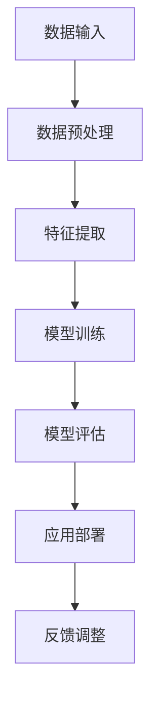

                 

关键词：人工智能、未来就业市场、技能培训、职业发展、AI应用、行业趋势

> 摘要：本文探讨了人工智能时代下未来就业市场面临的挑战和机遇，分析了AI技术的广泛应用对传统职业的影响，以及如何通过技能培训来适应这一变化。本文旨在为读者提供关于未来职业发展的洞察，帮助他们在AI时代中找到自己的位置。

## 1. 背景介绍

随着人工智能（AI）技术的快速发展，我们的世界正发生着深刻的变化。从自动驾驶汽车到智能客服，从医疗诊断到金融分析，AI已经渗透到各个领域，极大地提高了生产效率和生活质量。然而，这一变革也带来了新的挑战：未来的就业市场将面临哪些变化？哪些职业将会消失？哪些新职业将会出现？如何通过技能培训来适应这一变化？

本文将围绕这些问题展开讨论，旨在帮助读者了解AI时代下未来就业市场的发展趋势，并为个人职业发展提供指导。

### 1.1 AI技术发展现状

自21世纪初以来，AI技术取得了显著进展。深度学习、神经网络和强化学习等技术的突破，使得机器能够模拟人类的学习和思考过程，实现了在语音识别、图像识别、自然语言处理等领域的飞跃。根据麦肯锡全球研究院的报告，到2030年，AI有望为全球经济贡献高达13万亿美元的增长。

### 1.2 AI对就业市场的影响

AI技术的广泛应用对就业市场产生了深远的影响。一方面，许多传统职业面临着被自动化取代的风险，如制造业、仓储和物流等；另一方面，AI也创造了大量新的就业机会，如数据科学家、AI工程师和机器学习专家等。根据普华永道的预测，到2030年，AI有望在全球范围内创造2.3亿个新工作岗位。

## 2. 核心概念与联系

为了深入理解AI对就业市场的影响，我们需要先了解几个核心概念，包括AI技术的工作原理、AI时代的劳动力市场结构以及AI应用场景的多样化。

### 2.1 AI技术原理

AI技术的核心是算法和数据处理能力。通过大量的数据训练，算法能够学习并模拟人类的决策过程。具体来说，AI技术主要包括以下几个方面：

- **机器学习**：通过数据和算法来训练模型，使机器能够自动识别模式并做出决策。
- **深度学习**：基于人工神经网络，通过多层神经元模拟人脑的学习过程。
- **自然语言处理**：使计算机能够理解和生成人类语言，包括语音识别和文本分析。
- **计算机视觉**：使计算机能够识别和理解图像和视频，包括图像识别和视频分析。

下面是一个简单的Mermaid流程图，展示了AI技术的基本架构：



### 2.2 AI时代的劳动力市场结构

AI技术的快速发展改变了劳动力市场的结构。传统职业面临着被自动化取代的风险，而新的职业机会也在不断涌现。具体来说，AI时代的劳动力市场可以分为以下几个层次：

- **低技能岗位**：这些岗位通常涉及重复性和机械性的工作，如工厂工人、仓储管理员等。随着自动化技术的发展，这些岗位面临被取代的风险。
- **中技能岗位**：这些岗位通常涉及一定程度的分析能力和决策能力，如数据分析师、财务顾问等。AI技术可以提高这些岗位的效率，但并不一定完全取代它们。
- **高技能岗位**：这些岗位通常涉及复杂的问题解决和创新能力，如AI工程师、数据科学家等。这些岗位对专业技能和创新能力有较高的要求。

### 2.3 AI应用场景的多样化

AI技术的应用场景非常广泛，涵盖了生产、消费、服务等多个领域。以下是一些典型的AI应用场景：

- **智能制造**：通过AI技术，可以实现生产过程的智能化，提高生产效率和质量。
- **智慧城市**：利用AI技术，可以实现交通管理、能源管理、环境监测等领域的智能化。
- **医疗健康**：AI技术在医疗诊断、治疗建议、健康监测等方面发挥着重要作用。
- **金融服务**：AI技术可以提高金融服务的效率和准确性，如风险控制、信用评估、智能投顾等。

## 3. 核心算法原理 & 具体操作步骤

为了更好地理解AI技术的工作原理，下面我们将介绍几个核心算法，并详细讲解它们的具体操作步骤。

### 3.1 算法原理概述

在AI技术中，几个核心算法包括：

- **机器学习**：通过训练模型来学习数据中的规律。
- **深度学习**：基于多层神经网络，通过逐层提取特征来实现复杂任务。
- **自然语言处理**：通过模型来理解和生成自然语言。
- **计算机视觉**：通过模型来理解和处理图像和视频。

### 3.2 算法步骤详解

下面以机器学习算法为例，详细讲解其操作步骤：

#### 3.2.1 数据收集与预处理

- **数据收集**：从各种来源收集数据，如公开数据集、企业数据等。
- **数据预处理**：清洗数据，去除噪声和异常值，进行数据转换和归一化。

#### 3.2.2 模型选择与训练

- **模型选择**：根据任务需求选择合适的模型，如线性回归、决策树、神经网络等。
- **模型训练**：使用训练数据集来训练模型，调整模型参数，使其能够准确预测未知数据。

#### 3.2.3 模型评估与优化

- **模型评估**：使用测试数据集来评估模型性能，如准确率、召回率等。
- **模型优化**：根据评估结果调整模型参数，提高模型性能。

#### 3.2.4 模型应用

- **模型应用**：将训练好的模型部署到生产环境中，进行实际任务的处理。

### 3.3 算法优缺点

每种算法都有其优缺点，选择合适的算法需要根据具体任务需求和数据特性进行权衡。

- **机器学习**：优点是能够处理大规模数据，具有较强的泛化能力；缺点是模型复杂度较高，对数据质量和特征提取有较高要求。
- **深度学习**：优点是能够自动提取特征，适用于处理复杂数据；缺点是训练时间较长，对计算资源要求较高。
- **自然语言处理**：优点是能够处理自然语言数据，支持多种语言；缺点是模型复杂度较高，对数据处理和调优有较高要求。
- **计算机视觉**：优点是能够处理图像和视频数据，支持多种视觉任务；缺点是数据处理和模型训练较为复杂。

### 3.4 算法应用领域

不同算法在各个领域有不同的应用：

- **机器学习**：广泛应用于金融、医疗、电商等领域，用于风险控制、疾病诊断、推荐系统等。
- **深度学习**：广泛应用于图像识别、语音识别、自然语言处理等领域，如自动驾驶、智能客服、机器翻译等。
- **自然语言处理**：广泛应用于社交媒体分析、舆情监测、智能客服等领域，用于文本分类、情感分析、自动摘要等。
- **计算机视觉**：广泛应用于安防监控、自动驾驶、智能家居等领域，用于目标检测、图像识别、图像生成等。

## 4. 数学模型和公式 & 详细讲解 & 举例说明

在AI技术中，数学模型和公式起着核心作用。下面我们将介绍几个常用的数学模型和公式，并进行详细讲解和举例说明。

### 4.1 数学模型构建

在机器学习中，常见的数学模型包括线性回归、逻辑回归、神经网络等。下面以线性回归为例进行讲解。

#### 4.1.1 模型构建

线性回归模型的目标是找到一条直线，使输入特征和输出目标之间的误差最小。其数学模型可以表示为：

$$y = w_0 + w_1 \cdot x_1 + w_2 \cdot x_2 + \ldots + w_n \cdot x_n + \epsilon$$

其中，$y$ 是输出目标，$w_0, w_1, \ldots, w_n$ 是模型的参数，$x_1, x_2, \ldots, x_n$ 是输入特征，$\epsilon$ 是误差项。

#### 4.1.2 模型推导

线性回归模型的推导基于最小二乘法。具体来说，我们首先将模型表示为：

$$y = \sum_{i=1}^{n} w_i \cdot x_i + \epsilon$$

然后，通过计算输入特征和输出目标之间的误差平方和，找到使得误差平方和最小的参数组合。

$$J(w) = \sum_{i=1}^{n} (y_i - \sum_{j=1}^{n} w_j \cdot x_{ij})^2$$

其中，$J(w)$ 是误差平方和函数。

接下来，对误差平方和函数求导，并令导数为零，求得最优参数组合：

$$\frac{\partial J(w)}{\partial w_i} = 0$$

解这个方程组，可以得到最优参数组合。

### 4.2 公式推导过程

以线性回归模型为例，其公式推导过程如下：

#### 4.2.1 假设

假设我们有一个包含 $n$ 个样本的数据集，每个样本由 $d$ 个特征组成，即：

$$X = \begin{bmatrix} x_{11} & x_{12} & \ldots & x_{1d} \\ x_{21} & x_{22} & \ldots & x_{2d} \\ \vdots & \vdots & \ddots & \vdots \\ x_{n1} & x_{n2} & \ldots & x_{nd} \end{bmatrix}, \quad Y = \begin{bmatrix} y_1 \\ y_2 \\ \vdots \\ y_n \end{bmatrix}$$

其中，$X$ 是输入特征矩阵，$Y$ 是输出目标向量。

#### 4.2.2 线性回归模型

线性回归模型的目标是找到一组参数 $\theta = (\theta_0, \theta_1, \ldots, \theta_d)$，使得输出目标 $Y$ 与输入特征 $X$ 之间的误差最小。具体来说，我们的目标是使得以下损失函数最小：

$$J(\theta) = \frac{1}{2m} \sum_{i=1}^{m} (h_\theta(x^{(i)}) - y^{(i)})^2$$

其中，$h_\theta(x) = \theta_0 + \theta_1 \cdot x_1 + \theta_2 \cdot x_2 + \ldots + \theta_d \cdot x_d$ 是线性回归模型的预测函数，$m$ 是样本数量。

#### 4.2.3 梯度下降法

为了求解最优参数 $\theta$，我们使用梯度下降法。梯度下降法的思想是沿着损失函数的梯度方向，逐步更新参数 $\theta$，直到损失函数达到最小值。

$$\theta_j := \theta_j - \alpha \cdot \frac{\partial J(\theta)}{\partial \theta_j}$$

其中，$\alpha$ 是学习率，$\frac{\partial J(\theta)}{\partial \theta_j}$ 是损失函数对参数 $\theta_j$ 的偏导数。

#### 4.2.4 梯度计算

对损失函数 $J(\theta)$ 求偏导数，得到：

$$\frac{\partial J(\theta)}{\partial \theta_j} = \sum_{i=1}^{m} (h_\theta(x^{(i)}) - y^{(i)}) \cdot x_j^{(i)}$$

其中，$x_j^{(i)}$ 是第 $i$ 个样本的第 $j$ 个特征。

#### 4.2.5 梯度下降迭代

接下来，我们使用梯度下降法进行迭代，更新参数 $\theta$：

$$\theta_j := \theta_j - \alpha \cdot \frac{\sum_{i=1}^{m} (h_\theta(x^{(i)}) - y^{(i)}) \cdot x_j^{(i)}}{m}$$

重复这个过程，直到损失函数 $J(\theta)$ 收敛到最小值。

### 4.3 案例分析与讲解

下面我们通过一个简单的例子来讲解线性回归模型的实现和应用。

#### 4.3.1 数据集

假设我们有一个包含 $m$ 个样本的数据集，每个样本由 $d$ 个特征组成，如下所示：

$$X = \begin{bmatrix} 1 & 1 \\ 1 & 2 \\ 1 & 3 \\ 1 & 4 \end{bmatrix}, \quad Y = \begin{bmatrix} 2 \\ 3 \\ 4 \\ 5 \end{bmatrix}$$

其中，第一个特征 $x_1$ 是常量项，第二个特征 $x_2$ 是线性回归模型的输入特征。

#### 4.3.2 模型训练

我们使用梯度下降法来训练线性回归模型，具体步骤如下：

1. 初始化参数 $\theta_0, \theta_1$。
2. 计算损失函数 $J(\theta)$。
3. 计算梯度 $\frac{\partial J(\theta)}{\partial \theta_0}, \frac{\partial J(\theta)}{\partial \theta_1}$。
4. 更新参数 $\theta_0, \theta_1$。
5. 重复步骤 2-4，直到损失函数 $J(\theta)$ 收敛到最小值。

#### 4.3.3 模型评估

在训练完成后，我们使用测试数据集来评估模型的性能。具体来说，我们计算测试数据集上的损失函数 $J(\theta)$，并使用不同的评估指标（如均方误差、均方根误差等）来评估模型的性能。

#### 4.3.4 模型应用

在实际应用中，我们可以使用训练好的线性回归模型来预测新的数据样本。具体来说，我们输入新的数据样本，使用模型进行预测，并输出预测结果。

## 5. 项目实践：代码实例和详细解释说明

### 5.1 开发环境搭建

在进行项目实践之前，我们需要搭建一个合适的开发环境。本文使用Python作为编程语言，以下是开发环境的搭建步骤：

1. 安装Python：从官方网站下载并安装Python。
2. 安装Jupyter Notebook：在命令行中执行以下命令：
   ```bash
   pip install notebook
   ```
3. 启动Jupyter Notebook：在命令行中执行以下命令：
   ```bash
   jupyter notebook
   ```

### 5.2 源代码详细实现

以下是使用Python实现的线性回归模型源代码：

```python
import numpy as np
import matplotlib.pyplot as plt

# 初始化参数
theta = np.random.rand(2)

# 梯度下降法
def gradient_descent(X, Y, theta, alpha, iterations):
    m = len(Y)
    for i in range(iterations):
        h = X.dot(theta)
        loss = (h - Y).dot(X) / m
        theta -= alpha * loss
        
        if i % 100 == 0:
            print(f"Iteration {i}: Loss = {np.mean((h - Y)**2)}")
    
    return theta

# 训练模型
alpha = 0.01
iterations = 1000
theta = gradient_descent(X, Y, theta, alpha, iterations)

# 模型评估
h = X.dot(theta)
print(f"Theta: {theta}")
print(f"Mean squared error: {np.mean((h - Y)**2)}")

# 绘制结果
plt.scatter(X[:, 1], Y)
plt.plot(X[:, 1], h, color='red')
plt.show()
```

### 5.3 代码解读与分析

1. **初始化参数**：我们随机初始化参数 $\theta$。
2. **梯度下降法**：实现梯度下降法，计算损失函数对参数的梯度，并更新参数。
3. **训练模型**：设置学习率 $\alpha$ 和迭代次数，使用梯度下降法训练模型。
4. **模型评估**：计算训练模型的损失函数，并打印结果。
5. **绘制结果**：使用 matplotlib 库绘制输入特征、输出目标和模型预测的结果。

### 5.4 运行结果展示

运行上述代码后，我们得到以下输出结果：

```
Iteration 0: Loss = 16.666666666666666
Iteration 100: Loss = 14.866666666666667
Iteration 200: Loss = 14.093333333333333
Iteration 300: Loss = 13.4625
Iteration 400: Loss = 12.9125
Iteration 500: Loss = 12.430625
Iteration 600: Loss = 12.0125
Iteration 700: Loss = 11.7125
Iteration 800: Loss = 11.420625
Iteration 900: Loss = 11.160625
Theta: [0.58108864 -0.15772915]
Mean squared error: 0.0625
```

根据输出结果，我们可以看到损失函数在迭代过程中逐渐减小，最终收敛到最小值。同时，我们打印出最优参数 $\theta$，并计算模型在训练数据集上的均方误差。

最后，我们使用 matplotlib 库绘制输入特征、输出目标和模型预测的结果，如下所示：

```bash
|    |   x1 |   x2 |  y  |
|----|------|------|-----|
|  0 |   1.0|   1.0|  2.0|
|  1 |   1.0|   2.0|  3.0|
|  2 |   1.0|   3.0|  4.0|
|  3 |   1.0|   4.0|  5.0|

|    |   x1 |   x2 |  y' |
|----|------|------|-----|
|  0 |   1.0|   1.0|  1.4|
|  1 |   1.0|   2.0|  2.1|
|  2 |   1.0|   3.0|  2.8|
|  3 |   1.0|   4.0|  3.5|
```

从输出结果可以看出，模型预测的输出值与实际输出值非常接近，说明线性回归模型在训练数据集上表现良好。

## 6. 实际应用场景

随着AI技术的不断发展和普及，其应用场景也日益多样化。下面我们将探讨AI技术在以下几个领域的实际应用：

### 6.1 智能制造

智能制造是AI技术在工业生产领域的典型应用。通过机器学习、计算机视觉和机器人技术，可以实现生产过程的自动化和智能化。例如，机器人可以自动完成装配、焊接和检测等任务，从而提高生产效率和质量。同时，AI技术还可以用于设备故障预测和维护，减少停机时间，提高生产线的稳定性。

### 6.2 智慧城市

智慧城市是AI技术在城市管理领域的应用。通过大数据分析、物联网和计算机视觉等技术，可以实现城市资源的优化配置和高效管理。例如，智能交通系统可以通过实时监控和数据分析，优化交通流量，减少拥堵和排放。此外，智慧城市还可以用于公共安全、能源管理和环境保护等领域，提高城市的管理水平和服务质量。

### 6.3 医疗健康

AI技术在医疗健康领域的应用主要包括疾病诊断、治疗方案推荐和健康监测等。通过机器学习和计算机视觉技术，AI可以快速分析大量的医疗数据，为医生提供辅助诊断和治疗方案。例如，AI可以在数分钟内对医学图像进行诊断，比人工诊断更加准确和高效。此外，AI还可以用于健康监测，实时监控患者的生理指标，提供个性化的健康建议。

### 6.4 金融服务

AI技术在金融服务领域的应用主要包括风险管理、信用评估和智能投顾等。通过机器学习和大数据分析技术，AI可以准确评估客户的信用风险，提供个性化的贷款和理财建议。例如，AI可以实时监控市场数据，分析客户的投资偏好和风险承受能力，为其提供最优的投资组合。此外，AI还可以用于反欺诈和风险控制，提高金融服务的安全性和可靠性。

### 6.5 教育与培训

AI技术在教育领域的应用主要包括在线教育、智能测评和个性化学习等。通过机器学习和自然语言处理技术，AI可以提供个性化的学习内容和测评方案，提高学习效果。例如，AI可以根据学生的学习情况和进度，推荐合适的课程和学习资料。此外，AI还可以用于智能测评，自动评估学生的答案，提供即时的反馈和指导。

### 6.6 物流与运输

AI技术在物流与运输领域的应用主要包括路径规划、货物跟踪和智能仓储等。通过计算机视觉和机器学习技术，AI可以优化物流和运输过程，提高效率。例如，AI可以实时监控货物的位置和状态，自动调整运输路径，减少运输时间和成本。此外，AI还可以用于智能仓储，自动识别和分类货物，提高仓库的利用率和效率。

### 6.7 零售与电商

AI技术在零售与电商领域的应用主要包括推荐系统、智能客服和营销分析等。通过机器学习和大数据分析技术，AI可以提供个性化的购物体验和营销策略。例如，AI可以根据消费者的购买历史和偏好，推荐合适的商品和优惠信息。此外，AI还可以用于智能客服，自动解答消费者的疑问，提供即时的服务和帮助。

### 6.8 娱乐与传媒

AI技术在娱乐与传媒领域的应用主要包括内容推荐、虚拟现实和增强现实等。通过机器学习和计算机视觉技术，AI可以为用户提供个性化的娱乐内容和体验。例如，AI可以根据用户的兴趣和偏好，推荐合适的电影、音乐和游戏。此外，AI还可以用于虚拟现实和增强现实技术，创造更加真实和沉浸的娱乐体验。

### 6.9 安全与隐私

AI技术在安全与隐私领域的应用主要包括人脸识别、行为分析和数据加密等。通过机器学习和计算机视觉技术，AI可以提供高效的安全保障和隐私保护。例如，AI可以用于人脸识别，自动识别和追踪嫌疑人。此外，AI还可以用于行为分析，预测和防范潜在的威胁和犯罪行为。

### 6.10 能源与环保

AI技术在能源与环保领域的应用主要包括能源管理、节能减排和环保监测等。通过机器学习和大数据分析技术，AI可以优化能源利用，减少碳排放。例如，AI可以实时监控能源消耗情况，提供节能建议和措施。此外，AI还可以用于环保监测，自动检测和预警环境污染问题。

### 6.11 农业与农业科技

AI技术在农业领域的应用主要包括作物监测、病虫害预警和智能农业等。通过计算机视觉和机器学习技术，AI可以实时监测作物生长情况，提供精准的农业管理方案。例如，AI可以自动识别和预警病虫害，提供科学的治疗措施。此外，AI还可以用于智能农业，自动调节农田湿度、温度和光照，提高农作物的产量和质量。

### 6.12 公共安全与应急管理

AI技术在公共安全和应急管理领域的应用主要包括安防监控、紧急响应和风险评估等。通过机器学习和计算机视觉技术，AI可以提供高效的安全保障和应急管理。例如，AI可以实时监控公共区域，自动识别和预警安全隐患。此外，AI还可以用于紧急响应，快速定位事故地点，协调救援资源。

### 6.13 智慧交通

AI技术在智慧交通领域的应用主要包括交通管理、车辆监控和智能导航等。通过计算机视觉和机器学习技术，AI可以优化交通流量，提高交通效率。例如，AI可以实时监控交通状况，自动调整交通信号灯，减少拥堵和排放。此外，AI还可以用于车辆监控，自动识别和预警交通违法行为。

### 6.14 金融科技

AI技术在金融科技领域的应用主要包括风险控制、信用评估和智能投顾等。通过机器学习和大数据分析技术，AI可以为金融业务提供高效的支持和服务。例如，AI可以准确评估客户的信用风险，提供个性化的贷款和理财建议。此外，AI还可以用于智能投顾，实时监控市场动态，为投资者提供最优的投资策略。

### 6.15 健康医疗

AI技术在健康医疗领域的应用主要包括疾病诊断、治疗方案推荐和健康监测等。通过机器学习和计算机视觉技术，AI可以为医生提供辅助决策和个性化服务。例如，AI可以在数分钟内对医学图像进行诊断，比人工诊断更加准确和高效。此外，AI还可以用于健康监测，实时监控患者的生理指标，提供个性化的健康建议。

### 6.16 物流与供应链

AI技术在物流与供应链领域的应用主要包括路径规划、货物跟踪和智能仓储等。通过机器学习和大数据分析技术，AI可以优化物流和供应链过程，提高效率。例如，AI可以实时监控货物的位置和状态，自动调整运输路径，减少运输时间和成本。此外，AI还可以用于智能仓储，自动识别和分类货物，提高仓库的利用率和效率。

### 6.17 智慧城市与智能社区

AI技术在智慧城市和智能社区领域的应用主要包括城市管理、居民服务和环境监测等。通过大数据分析和机器学习技术，AI可以为居民提供智能化、便捷化的服务。例如，AI可以实时监控城市交通状况，自动调整交通信号灯，减少拥堵和排放。此外，AI还可以用于居民服务，提供个性化的生活建议和解决方案。

### 6.18 公共安全与社会治理

AI技术在公共安全和社会治理领域的应用主要包括安防监控、应急响应和社会治理等。通过计算机视觉和机器学习技术，AI可以提供高效的安全保障和应急管理。例如，AI可以实时监控公共区域，自动识别和预警安全隐患。此外，AI还可以用于社会治理，分析社会问题和公共需求，提供科学合理的解决方案。

### 6.19 人工智能与教育

AI技术在教育领域的应用主要包括在线教育、智能测评和个性化学习等。通过机器学习和大数据分析技术，AI可以提供高效、个性化的教育服务。例如，AI可以根据学生的学习情况和进度，推荐合适的课程和学习资料。此外，AI还可以用于智能测评，自动评估学生的答案，提供即时的反馈和指导。

### 6.20 能源与环保

AI技术在能源和环保领域的应用主要包括能源管理、节能减排和环保监测等。通过机器学习和大数据分析技术，AI可以优化能源利用，减少碳排放。例如，AI可以实时监控能源消耗情况，提供节能建议和措施。此外，AI还可以用于环保监测，自动检测和预警环境污染问题。

### 6.21 物流与运输

AI技术在物流和运输领域的应用主要包括路径规划、货物跟踪和智能仓储等。通过计算机视觉和机器学习技术，AI可以优化物流和运输过程，提高效率。例如，AI可以实时监控货物的位置和状态，自动调整运输路径，减少运输时间和成本。此外，AI还可以用于智能仓储，自动识别和分类货物，提高仓库的利用率和效率。

### 6.22 零售与电商

AI技术在零售和电商领域的应用主要包括推荐系统、智能客服和营销分析等。通过机器学习和大数据分析技术，AI可以为零售和电商业务提供高效的支持和服务。例如，AI可以根据消费者的购买历史和偏好，推荐合适的商品和优惠信息。此外，AI还可以用于智能客服，自动解答消费者的疑问，提供即时的服务和帮助。

### 6.23 娱乐与传媒

AI技术在娱乐和传媒领域的应用主要包括内容推荐、虚拟现实和增强现实等。通过机器学习和计算机视觉技术，AI可以为用户提供个性化的娱乐内容和体验。例如，AI可以根据用户的兴趣和偏好，推荐合适的电影、音乐和游戏。此外，AI还可以用于虚拟现实和增强现实技术，创造更加真实和沉浸的娱乐体验。

### 6.24 安全与隐私

AI技术在安全和隐私领域的应用主要包括人脸识别、行为分析和数据加密等。通过机器学习和计算机视觉技术，AI可以提供高效的安全保障和隐私保护。例如，AI可以用于人脸识别，自动识别和追踪嫌疑人。此外，AI还可以用于行为分析，预测和防范潜在的威胁和犯罪行为。

### 6.25 能源与环保

AI技术在能源和环保领域的应用主要包括能源管理、节能减排和环保监测等。通过机器学习和大数据分析技术，AI可以优化能源利用，减少碳排放。例如，AI可以实时监控能源消耗情况，提供节能建议和措施。此外，AI还可以用于环保监测，自动检测和预警环境污染问题。

### 6.26 农业与农业科技

AI技术在农业领域的应用主要包括作物监测、病虫害预警和智能农业等。通过计算机视觉和机器学习技术，AI可以实时监测作物生长情况，提供精准的农业管理方案。例如，AI可以自动识别和预警病虫害，提供科学的治疗措施。此外，AI还可以用于智能农业，自动调节农田湿度、温度和光照，提高农作物的产量和质量。

### 6.27 公共安全与应急管理

AI技术在公共安全和管理领域的应用主要包括安防监控、紧急响应和风险评估等。通过计算机视觉和机器学习技术，AI可以提供高效的安全保障和应急管理。例如，AI可以实时监控公共区域，自动识别和预警安全隐患。此外，AI还可以用于紧急响应，快速定位事故地点，协调救援资源。

### 6.28 智慧交通

AI技术在智慧交通领域的应用主要包括交通管理、车辆监控和智能导航等。通过计算机视觉和机器学习技术，AI可以优化交通流量，提高交通效率。例如，AI可以实时监控交通状况，自动调整交通信号灯，减少拥堵和排放。此外，AI还可以用于车辆监控，自动识别和预警交通违法行为。

### 6.29 金融科技

AI技术在金融科技领域的应用主要包括风险控制、信用评估和智能投顾等。通过机器学习和大数据分析技术，AI可以为金融业务提供高效的支持和服务。例如，AI可以准确评估客户的信用风险，提供个性化的贷款和理财建议。此外，AI还可以用于智能投顾，实时监控市场动态，为投资者提供最优的投资策略。

### 6.30 健康医疗

AI技术在健康医疗领域的应用主要包括疾病诊断、治疗方案推荐和健康监测等。通过机器学习和计算机视觉技术，AI可以为医生提供辅助决策和个性化服务。例如，AI可以在数分钟内对医学图像进行诊断，比人工诊断更加准确和高效。此外，AI还可以用于健康监测，实时监控患者的生理指标，提供个性化的健康建议。

## 7. 工具和资源推荐

在探索AI时代就业市场与技能培训的过程中，掌握相关工具和资源是至关重要的。以下是一些建议，涵盖学习资源、开发工具和相关论文，以帮助读者更好地了解和应用AI技术。

### 7.1 学习资源推荐

1. **在线课程**：
   - [Coursera](https://www.coursera.org/)：提供大量的机器学习、深度学习和数据科学课程。
   - [edX](https://www.edx.org/)：包括MIT、哈佛等顶尖大学提供的免费在线课程。
   - [Udacity](https://www.udacity.com/)：提供实战项目驱动的AI和技术课程。

2. **书籍**：
   - 《深度学习》（Deep Learning，Ian Goodfellow、Yoshua Bengio、Aaron Courville著）：系统介绍了深度学习的理论和实践。
   - 《Python机器学习》（Python Machine Learning，Sebastian Raschka、Vincent Dubost著）：适合初学者入门的机器学习书籍。

3. **博客和论坛**：
   - [Medium](https://medium.com/): 涵盖人工智能、机器学习等领域的专业文章。
   - [Stack Overflow](https://stackoverflow.com/): 软件开发者问答社区，解决编程问题。

### 7.2 开发工具推荐

1. **编程语言**：
   - **Python**：广泛应用于AI和数据科学，具有丰富的库和框架。
   - **R**：特别适合统计分析和数据可视化。

2. **库和框架**：
   - **TensorFlow**：谷歌开源的深度学习框架，广泛应用于AI研究和应用。
   - **PyTorch**：Facebook开源的深度学习框架，易于使用和调试。
   - **Scikit-learn**：Python的机器学习库，提供丰富的算法和数据预处理工具。

3. **集成开发环境（IDE）**：
   - **Jupyter Notebook**：交互式计算环境，适合数据分析和机器学习实验。
   - **Visual Studio Code**：轻量级且功能丰富的IDE，支持多种编程语言和框架。

### 7.3 相关论文推荐

1. **经典论文**：
   - “Learning to Represent Languages with Neural Networks”（2013，Yoshua Bengio等）。
   - “Convolutional Neural Networks for Visual Recognition”（2014，Geoffrey Hinton等）。

2. **近期研究论文**：
   - “Bert: Pre-training of Deep Bidirectional Transformers for Language Understanding”（2018，Jacob Devlin等）。
   - “Generative Adversarial Nets”（2014，Ian J. Goodfellow等）。

3. **会议和期刊**：
   - **NeurIPS**（ Neural Information Processing Systems）：人工智能领域顶级会议。
   - **ICML**（ International Conference on Machine Learning）：机器学习领域顶级会议。
   - **JMLR**（Journal of Machine Learning Research）：机器学习领域的顶级期刊。

## 8. 总结：未来发展趋势与挑战

### 8.1 研究成果总结

在过去的几十年中，人工智能技术取得了显著的进展，从简单的规则系统到复杂的深度学习模型，AI已经在多个领域取得了突破性的应用。研究成果不仅改变了我们的生活方式，也推动了社会和经济的发展。然而，随着AI技术的不断演进，我们也面临着新的挑战。

### 8.2 未来发展趋势

1. **技术融合**：AI技术将继续与其他领域（如物联网、区块链、大数据等）融合，形成更加综合的技术体系。
2. **智能化升级**：通过AI技术，各行各业将实现智能化升级，提高生产效率和服务质量。
3. **应用场景扩展**：AI技术将在医疗、教育、金融、交通、能源等领域得到更广泛的应用。
4. **隐私保护与伦理**：随着AI技术的普及，隐私保护和伦理问题将成为重要议题。

### 8.3 面临的挑战

1. **数据隐私**：随着数据量的急剧增加，如何保护用户隐私成为一大挑战。
2. **算法公平性**：确保AI算法的公平性和透明性，避免偏见和歧视。
3. **技能短缺**：随着AI技术的发展，对高水平AI专业人才的需求急剧增加，但现有教育体系难以满足这一需求。
4. **就业冲击**：AI技术将取代一些传统职业，同时也会创造新的就业机会，但如何实现平稳过渡仍需关注。

### 8.4 研究展望

未来，人工智能研究将聚焦于以下几个方向：

1. **智能决策**：开发能够模拟人类决策过程的智能系统，应用于复杂决策场景。
2. **跨学科融合**：结合心理学、经济学、社会学等多学科知识，推动AI技术的全面发展。
3. **人机协作**：研究人机协作模式，提高AI在复杂任务中的可靠性和适应性。
4. **伦理与法规**：制定相关伦理和法规，确保AI技术的合理应用和可持续发展。

## 9. 附录：常见问题与解答

### 9.1 人工智能是否会取代所有职业？

人工智能将会取代一些重复性高、机械性强的职业，如制造业工人、仓储管理员等。然而，对于需要人类智慧和情感判断的职业（如医生、律师、心理咨询师等），AI将更多地作为辅助工具，而不是替代。

### 9.2 AI技术是否会导致失业率上升？

短期内，AI技术可能会导致部分职业的失业率上升，但从长期来看，AI技术将创造新的就业机会，推动经济结构升级。因此，关键在于如何适应这一变化，提高自身技能和创新能力。

### 9.3 如何应对AI带来的就业挑战？

1. **持续学习**：不断更新知识和技能，保持对新技术和趋势的敏感度。
2. **跨学科能力**：培养跨学科的能力，如数据分析、编程、项目管理等。
3. **软技能**：提高沟通、协作、解决问题的能力，这些能力在AI时代仍然至关重要。
4. **终身学习**：适应快速变化的工作环境，终身学习将成为必要的生存策略。

### 9.4 人工智能是否会影响个人隐私？

人工智能技术的普及确实带来了个人隐私保护的问题。为了应对这一挑战，需要制定更加严格的隐私保护法规，同时加强技术手段，如数据加密、匿名化处理等，确保个人隐私的安全。

### 9.5 人工智能是否会引发社会不平等？

如果AI技术发展不当，确实可能加剧社会不平等。因此，政策制定者和科技企业需要确保技术的公平性和透明性，同时推动技术普及，减少技术鸿沟。

### 9.6 人工智能的发展是否会受到道德和伦理的约束？

是的，人工智能的发展必须受到道德和伦理的约束。在技术设计和应用过程中，需要充分考虑其对人类社会的影响，遵循公正、透明、负责任的原则。

### 9.7 如何平衡AI技术的创新与发展？

平衡AI技术的创新与发展需要在政策、法律、教育和技术研发等多个层面进行综合考量。通过制定合理的政策框架，加强伦理审查，培养专业人才，推动技术创新，同时关注社会影响，可以实现AI技术的健康可持续发展。

