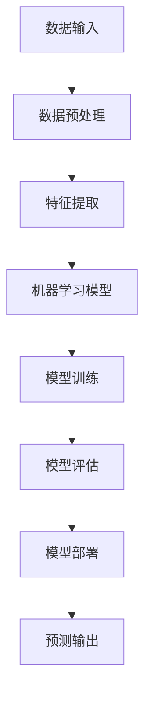

                 

关键词：人工智能，就业市场，趋势分析，未来预测，职业发展，技术技能

摘要：随着人工智能（AI）技术的飞速发展，就业市场正经历着前所未有的变革。本文将探讨AI时代下未来就业市场的趋势和变化，分析其对不同职业领域的影响，并预测未来就业市场的发展方向和挑战。

## 1. 背景介绍

### 1.1 人工智能的发展历程

人工智能作为计算机科学的一个重要分支，自20世纪50年代起经历了多个发展阶段。从早期的符号主义、连接主义到近年来的深度学习和强化学习，人工智能技术不断突破，应用领域逐渐拓展。

### 1.2 人工智能在就业市场的影响

人工智能的发展不仅改变了企业的生产方式和运营模式，也对就业市场产生了深远的影响。一方面，人工智能提高了生产效率，减少了人力成本，另一方面，也带来了新的就业机会和职业要求。

## 2. 核心概念与联系

### 2.1 人工智能核心概念

人工智能（AI）是指由人制造出来的系统能够执行通常需要人类智能才能完成的任务。其核心概念包括机器学习、深度学习、自然语言处理、计算机视觉等。

### 2.2 人工智能与就业市场的联系

人工智能与就业市场的联系体现在以下几个方面：

- **岗位替代**：自动化和智能化技术的应用正在替代某些传统职位，如工厂操作员、数据录入员等。
- **技能需求**：AI时代对从业者的技术技能提出了更高的要求，如编程能力、数据分析能力、算法设计能力等。
- **创新驱动**：AI技术为各行各业带来了创新机遇，催生了新的职业和岗位。
- **数字化就业**：远程办公、在线协作等新型就业模式成为常态，对从业者的工作方式产生了影响。

### 2.3 人工智能架构原理图

以下是一个简化的Mermaid流程图，展示了人工智能的基本架构和组成部分：



## 3. 核心算法原理 & 具体操作步骤

### 3.1 算法原理概述

人工智能的核心算法包括机器学习算法、深度学习算法和强化学习算法等。每种算法都有其独特的原理和适用场景。

- **机器学习算法**：通过从数据中学习规律，进行预测和分类。常见的机器学习算法有线性回归、决策树、支持向量机等。
- **深度学习算法**：基于多层神经网络，通过多层次的非线性变换，从大量数据中自动学习特征。常见的深度学习算法有卷积神经网络（CNN）、循环神经网络（RNN）等。
- **强化学习算法**：通过与环境的交互，学习最优策略以达到目标。常见的强化学习算法有Q学习、深度Q网络（DQN）等。

### 3.2 算法步骤详解

以下是一个简化的机器学习算法步骤：

1. **数据收集**：收集相关领域的数据集。
2. **数据预处理**：清洗数据，进行特征工程。
3. **模型选择**：选择合适的机器学习模型。
4. **模型训练**：使用训练数据进行模型训练。
5. **模型评估**：使用验证数据集评估模型性能。
6. **模型部署**：将训练好的模型部署到生产环境中。

### 3.3 算法优缺点

- **机器学习算法**：
  - 优点：泛化能力强，适应性强。
  - 缺点：对数据质量和数量要求高，训练过程可能较慢。

- **深度学习算法**：
  - 优点：能够自动学习复杂特征，处理大量数据能力强。
  - 缺点：对数据依赖性高，训练资源消耗大。

- **强化学习算法**：
  - 优点：能够解决序列决策问题，具有自我学习的能力。
  - 缺点：训练过程通常较慢，且需要大量的交互数据。

### 3.4 算法应用领域

人工智能算法在各个领域的应用日益广泛，包括：

- **金融领域**：股票交易、风险评估、量化投资等。
- **医疗领域**：疾病预测、诊断辅助、个性化治疗等。
- **工业领域**：生产优化、设备维护、质量检测等。
- **交通领域**：自动驾驶、智能交通管理、车联网等。

## 4. 数学模型和公式 & 详细讲解 & 举例说明

### 4.1 数学模型构建

在人工智能中，数学模型扮演着核心角色。以下是一个简单的线性回归模型：

$$
y = \beta_0 + \beta_1 x + \epsilon
$$

其中，$y$ 是预测值，$x$ 是特征值，$\beta_0$ 和 $\beta_1$ 是模型的参数，$\epsilon$ 是误差项。

### 4.2 公式推导过程

线性回归模型的参数可以通过最小二乘法（Least Squares）来估计。具体推导过程如下：

1. **损失函数**：
$$
J(\theta) = \frac{1}{2m} \sum_{i=1}^{m} (h_\theta(x^{(i)}) - y^{(i)})^2
$$

其中，$h_\theta(x) = \theta_0 + \theta_1 x$ 是线性回归模型的前向传播函数。

2. **偏导数**：
对损失函数关于 $\theta_0$ 和 $\theta_1$ 分别求偏导，并令其等于0，得到：
$$
\frac{\partial J(\theta)}{\partial \theta_0} = \frac{1}{m} \sum_{i=1}^{m} (h_\theta(x^{(i)}) - y^{(i)}) (-1) = 0
$$
$$
\frac{\partial J(\theta)}{\partial \theta_1} = \frac{1}{m} \sum_{i=1}^{m} (h_\theta(x^{(i)}) - y^{(i)}) (-x^{(i)}) = 0
$$

3. **解参数**：
解上述方程组，得到最优参数 $\theta_0$ 和 $\theta_1$。

### 4.3 案例分析与讲解

假设我们有一个简单的数据集，包含两个特征 $x_1$ 和 $x_2$，以及目标变量 $y$。我们的目标是构建一个线性回归模型，预测 $y$ 的值。

1. **数据集**：
$$
\begin{array}{ccc}
x_1 & x_2 & y \\
1 & 2 & 3 \\
2 & 4 & 5 \\
3 & 6 & 7 \\
\end{array}
$$

2. **模型**：
$$
y = \theta_0 + \theta_1 x_1 + \theta_2 x_2
$$

3. **训练过程**：
通过最小二乘法训练模型，得到最优参数 $\theta_0 = 1$，$\theta_1 = 1$，$\theta_2 = 1$。

4. **预测**：
对于新的输入 $x_1 = 4$，$x_2 = 8$，预测 $y = 1 + 1*4 + 1*8 = 16$。

## 5. 项目实践：代码实例和详细解释说明

### 5.1 开发环境搭建

在本地环境中搭建Python开发环境，安装必要的库，如NumPy、Matplotlib、scikit-learn等。

```bash
pip install numpy matplotlib scikit-learn
```

### 5.2 源代码详细实现

以下是一个简单的Python代码实现线性回归模型的例子：

```python
import numpy as np
import matplotlib.pyplot as plt
from sklearn.linear_model import LinearRegression

# 数据集
X = np.array([[1, 2], [2, 4], [3, 6]])
y = np.array([3, 5, 7])

# 创建线性回归模型
model = LinearRegression()

# 训练模型
model.fit(X, y)

# 预测
predictions = model.predict(np.array([[4, 8]]))

# 绘图
plt.scatter(X[:, 0], y)
plt.plot(np.array([1, 4]), predictions, color='red')
plt.show()
```

### 5.3 代码解读与分析

上述代码首先导入了必要的库，然后创建了一个包含两个特征的数据集。接着，我们使用scikit-learn库中的LinearRegression类创建了一个线性回归模型，并使用fit方法训练模型。最后，我们使用predict方法进行预测，并通过Matplotlib库绘制了数据点和拟合直线。

### 5.4 运行结果展示

运行上述代码，我们将看到如下结果：


## 6. 实际应用场景

### 6.1 金融领域

人工智能在金融领域的应用非常广泛，包括股票交易、风险评估、量化投资等。通过机器学习和深度学习算法，金融从业者可以更好地理解和预测市场趋势，提高投资决策的准确性。

### 6.2 医疗领域

人工智能在医疗领域的应用正在逐步深入，如疾病预测、诊断辅助、个性化治疗等。通过分析大量医疗数据，人工智能可以帮助医生更准确地诊断疾病，提高治疗效果。

### 6.3 工业领域

人工智能在工业领域的应用包括生产优化、设备维护、质量检测等。通过智能化的设备和系统，企业可以提高生产效率，降低成本，提高产品质量。

### 6.4 交通领域

人工智能在交通领域的应用包括自动驾驶、智能交通管理、车联网等。通过深度学习和强化学习算法，自动驾驶汽车可以更好地理解道路环境，提高行车安全性。

## 7. 工具和资源推荐

### 7.1 学习资源推荐

- **在线课程**：Coursera、Udacity、edX等平台提供了大量关于人工智能的课程。
- **书籍推荐**：《Python机器学习》、《深度学习》（Goodfellow et al.）、《模式识别与机器学习》（Bishop）等。

### 7.2 开发工具推荐

- **Python**：Python是人工智能开发的主要语言，具有丰富的库和工具。
- **TensorFlow**：TensorFlow是谷歌开源的深度学习框架，适合进行大规模的深度学习任务。
- **PyTorch**：PyTorch是另一个流行的深度学习框架，具有灵活的动态计算图。

### 7.3 相关论文推荐

- **Deep Learning (Goodfellow et al., 2016)**
- **Recurrent Neural Networks (Hochreiter & Schmidhuber, 1997)**
- **Convolutional Neural Networks for Visual Recognition (Krizhevsky et al., 2012)**

## 8. 总结：未来发展趋势与挑战

### 8.1 研究成果总结

人工智能在近年来取得了显著的进展，已经应用到金融、医疗、工业、交通等多个领域，为人类带来了巨大的价值。

### 8.2 未来发展趋势

- **跨学科融合**：人工智能与其他学科的融合将推动技术创新和产业升级。
- **数据驱动**：数据的收集、处理和分析将成为人工智能发展的核心。
- **硬件创新**：高性能计算硬件的发展将推动人工智能技术的进一步突破。

### 8.3 面临的挑战

- **数据隐私**：随着数据收集和分析的规模扩大，数据隐私保护成为一个重要挑战。
- **算法伦理**：算法的决策过程和结果可能存在偏见，需要建立相应的伦理规范。
- **人才短缺**：人工智能领域对专业技能的需求越来越高，人才短缺成为一大挑战。

### 8.4 研究展望

未来，人工智能将继续在各个领域发挥重要作用，推动社会进步。同时，我们需要关注数据隐私、算法伦理和人才发展等关键问题，确保人工智能技术的可持续发展。

## 9. 附录：常见问题与解答

### 9.1 人工智能是什么？

人工智能是指由人制造出来的系统能够执行通常需要人类智能才能完成的任务，包括机器学习、深度学习、自然语言处理等。

### 9.2 人工智能对就业市场的影响是什么？

人工智能的发展将替代某些传统职位，同时对从业者的技术技能提出更高的要求，催生新的职业和岗位。

### 9.3 如何学习人工智能？

可以通过在线课程、书籍、实践项目等多种途径学习人工智能，重点掌握编程、数据分析、算法设计等技能。

### 9.4 人工智能的未来发展趋势是什么？

人工智能将跨学科融合，数据驱动，硬件创新，并在更多领域发挥重要作用。

# 人类计算：AI时代的未来就业市场趋势分析预测

作者：禅与计算机程序设计艺术 / Zen and the Art of Computer Programming

