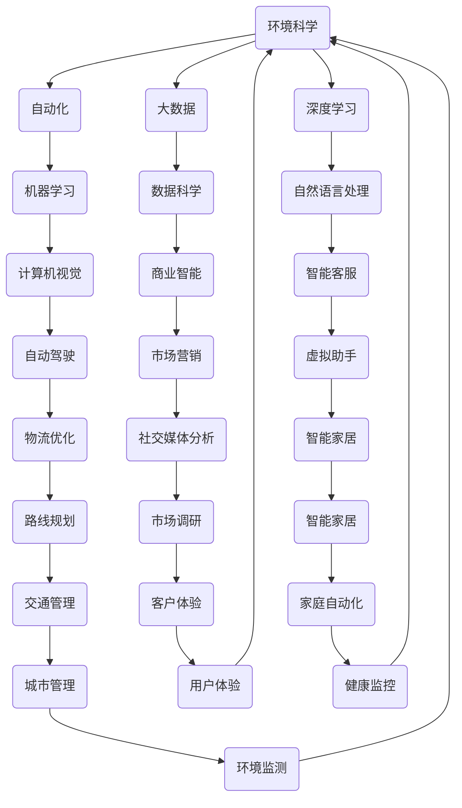

                 

关键词：人工智能、就业、未来工作、职业转型、技术技能

> 摘要：本文将探讨人工智能时代对就业市场的影响，分析AI技术在各个行业的应用场景，探讨人类计算在AI时代的重要性，并展望未来的职业发展趋势。随着人工智能技术的飞速发展，人们对于未来就业机会的担忧日益增加。本文将帮助读者理解AI时代的就业机遇，并为未来的职业规划提供指导。

## 1. 背景介绍

自20世纪50年代以来，人工智能（AI）一直是一个充满争议和探索的领域。随着计算机性能的提升、大数据的普及以及深度学习算法的突破，AI技术正在以前所未有的速度发展和应用。从简单的自动化工具到复杂的自我学习系统，AI正在改变着我们的生活方式、工作方式和思维方式。

在就业市场方面，AI技术的普及引发了一系列的讨论和担忧。一方面，人们担心自动化会取代大量的工作岗位，导致失业率上升。另一方面，也有人认为AI将为人类创造新的就业机会，并促使职业角色的转变。本文将深入探讨这些问题，分析AI时代人类计算的重要性和未来就业机会。

## 2. 核心概念与联系

在讨论AI时代就业机会之前，我们需要理解一些核心概念和它们之间的关系。以下是几个关键概念及其相互作用的Mermaid流程图：



### 2.1 人工智能与自动化

人工智能和自动化是密切相关的概念。人工智能是指机器模拟人类智能的过程，而自动化则是指使用机器来执行重复性或危险的任务。随着AI技术的发展，越来越多的任务可以由机器自动完成，从而减少了对人类劳动力的需求。然而，自动化并不意味着完全取代人类，而是将人类从繁重的劳动中解放出来，使他们能够专注于更高层次的工作。

### 2.2 大数据与数据科学

大数据是指无法使用传统数据库工具进行捕捉、管理和处理的数据集合。数据科学是使用数学、统计学、机器学习和数据库技术来分析大数据以提取有用信息和知识。在AI时代，数据是宝贵的资源，数据科学和机器学习算法的结合使得我们能够从数据中提取有价值的洞察，为商业决策提供支持。

### 2.3 深度学习与自然语言处理

深度学习是一种机器学习技术，它模仿人脑的工作方式，通过多层神经网络来处理复杂数据。自然语言处理（NLP）是AI领域中研究如何让计算机理解、生成和处理人类语言的技术。深度学习在NLP领域的应用，如语音识别、机器翻译和情感分析，正在改变着我们的沟通方式和商业模式。

### 2.4 机器学习与计算机视觉

机器学习是AI的核心技术之一，它使计算机能够从数据中学习并做出预测或决策。计算机视觉是机器学习在图像和视频处理领域的应用，包括人脸识别、图像分类和物体检测等。计算机视觉技术的进步，如自动驾驶、安全监控和医疗影像分析，正极大地改变着相关行业的运作方式。

### 2.5 商业智能与市场营销

商业智能（BI）是指使用数据分析技术来改进商业决策的过程。市场营销是商业活动中的重要一环，它涉及如何吸引和保留客户。AI技术，如客户行为分析、市场趋势预测和个性化推荐，正在改变市场营销的策略和方法。

### 2.6 智能客服与自动驾驶

智能客服是AI在客户服务领域的应用，它通过聊天机器人和虚拟助手来提供即时和高效的客户支持。自动驾驶是AI在交通运输领域的应用，它利用计算机视觉、传感器和机器学习算法来控制车辆。智能客服和自动驾驶的普及，将极大地提高服务质量并改变交通运输行业。

### 2.7 其他应用领域

除了上述领域，AI技术还在医疗保健、环境科学、用户体验设计、健康监控和城市管理等许多领域发挥着重要作用。这些应用不仅提高了效率和生产力，也为人类带来了更多的便利和安全。

## 3. 核心算法原理 & 具体操作步骤

### 3.1 算法原理概述

在AI时代，算法是核心驱动力。以下是几个关键算法的原理概述：

- **深度学习算法**：深度学习是一种基于多层神经网络的机器学习技术，它能够自动从数据中提取特征，并在各种任务中实现高度准确的预测和分类。例如，卷积神经网络（CNN）在图像识别任务中表现出色，而循环神经网络（RNN）在序列数据处理方面具有优势。
  
- **自然语言处理算法**：NLP算法，如词向量表示、序列标注和文本生成，能够使计算机理解、生成和处理人类语言。这些算法广泛应用于聊天机器人、机器翻译和情感分析等领域。

- **强化学习算法**：强化学习是一种使机器通过与环境的交互来学习最优策略的算法。它广泛应用于游戏、自动驾驶和推荐系统等领域。

### 3.2 算法步骤详解

以下是上述算法的具体操作步骤：

- **深度学习算法**：

  - 数据预处理：对输入数据进行清洗、归一化和编码等处理，使其适合神经网络模型。
  - 构建模型：定义神经网络结构，包括输入层、隐藏层和输出层。
  - 训练模型：通过反向传播算法和优化器，调整网络参数以最小化损失函数。
  - 评估模型：使用验证集和测试集评估模型的性能，调整超参数以获得最佳结果。

- **自然语言处理算法**：

  - 词向量表示：将文本转换为向量表示，如Word2Vec或BERT。
  - 序列标注：对文本进行分词、词性标注和命名实体识别等操作。
  - 文本生成：使用序列到序列模型，如GPT或BERT，生成自然语言文本。

- **强化学习算法**：

  - 定义环境：创建一个模拟环境，使代理（agent）能够与环境进行交互。
  - 定义奖励函数：定义代理行为的好坏，以便它能够学习最优策略。
  - 训练代理：通过尝试不同的行动，代理根据奖励函数来学习最优策略。
  - 评估策略：在真实环境中评估代理的策略性能。

### 3.3 算法优缺点

- **深度学习算法**：

  - 优点：高度准确的预测和分类，自动提取特征。
  - 缺点：需要大量的数据和计算资源，模型难以解释。

- **自然语言处理算法**：

  - 优点：能够理解、生成和处理人类语言，提高沟通效率。
  - 缺点：对数据质量和语言多样性敏感，模型解释性较差。

- **强化学习算法**：

  - 优点：能够从环境中学习最优策略，适用于动态环境。
  - 缺点：训练过程较长，需要大量的交互和数据。

### 3.4 算法应用领域

- **深度学习算法**：广泛应用于计算机视觉、自然语言处理和语音识别等领域。
- **自然语言处理算法**：广泛应用于聊天机器人、机器翻译和文本生成等领域。
- **强化学习算法**：广泛应用于游戏、自动驾驶和推荐系统等领域。

## 4. 数学模型和公式 & 详细讲解 & 举例说明

在AI技术中，数学模型和公式扮演着至关重要的角色。以下是一个简单的数学模型示例及其应用：

### 4.1 数学模型构建

假设我们有一个线性回归模型，用于预测房屋价格。模型的公式如下：

$$
Y = \beta_0 + \beta_1X_1 + \beta_2X_2 + ... + \beta_nX_n + \epsilon
$$

其中，$Y$是房屋价格，$X_1, X_2, ..., X_n$是房屋特征（如面积、地点等），$\beta_0, \beta_1, \beta_2, ..., \beta_n$是模型参数，$\epsilon$是误差项。

### 4.2 公式推导过程

线性回归模型的推导基于最小二乘法。我们希望找到一组参数$\beta_0, \beta_1, \beta_2, ..., \beta_n$，使得实际房屋价格$Y$与模型预测价格$Y'$之间的误差最小。

误差函数定义为：

$$
J(\beta_0, \beta_1, \beta_2, ..., \beta_n) = \frac{1}{2}\sum_{i=1}^{m}(Y_i - Y_i')^2
$$

其中，$m$是训练数据集的大小。

为了最小化误差函数，我们对每个参数求导并令其等于零：

$$
\frac{\partial J}{\partial \beta_j} = 0
$$

通过求解这些方程，我们可以得到最优参数$\beta_0, \beta_1, \beta_2, ..., \beta_n$。

### 4.3 案例分析与讲解

假设我们有一个包含100个样本的房屋价格数据集。每个样本有五个特征：面积（$X_1$）、地点（$X_2$）、建造年份（$X_3$）、卧室数量（$X_4$）和浴室数量（$X_5$）。我们的目标是使用线性回归模型预测房屋价格。

通过最小二乘法，我们得到了以下模型参数：

$$
\beta_0 = 100, \beta_1 = 0.1, \beta_2 = 0.2, \beta_3 = 0.05, \beta_4 = 0.15, \beta_5 = 0.1
$$

现在，我们使用这些参数来预测一个新样本的价格。假设该样本的特征为：

- 面积：150平方米
- 地点：市中心
- 建造年份：2010年
- 卧室数量：3个
- 浴室数量：2个

将这些特征代入模型公式，我们得到：

$$
Y' = 100 + 0.1 \times 150 + 0.2 \times 0 + 0.05 \times (-10) + 0.15 \times 3 + 0.1 \times 2 = 133.5
$$

因此，根据我们的线性回归模型，该房屋的价格预测为133.5万元。

这个例子展示了如何构建和推导线性回归模型，并使用它进行实际预测。线性回归是机器学习中最基本的模型之一，它在许多领域都有广泛的应用。

## 5. 项目实践：代码实例和详细解释说明

### 5.1 开发环境搭建

为了实现上述线性回归模型，我们需要搭建一个开发环境。以下是所需的工具和步骤：

- **Python**：一种流行的编程语言，适用于数据处理和机器学习。
- **Jupyter Notebook**：一个交互式的Python环境，便于编写和运行代码。
- **scikit-learn**：一个机器学习库，提供线性回归模型和常用工具。

首先，安装Python和Jupyter Notebook。然后，使用pip安装scikit-learn：

```bash
pip install scikit-learn
```

### 5.2 源代码详细实现

以下是实现线性回归模型的Python代码：

```python
import numpy as np
from sklearn.linear_model import LinearRegression
from sklearn.model_selection import train_test_split
from sklearn.metrics import mean_squared_error

# 数据预处理
X = np.array([[area, location, year, bedrooms, bathrooms]]).T
Y = np.array([price])

# 分割训练集和测试集
X_train, X_test, Y_train, Y_test = train_test_split(X, Y, test_size=0.2, random_state=42)

# 构建线性回归模型
model = LinearRegression()
model.fit(X_train, Y_train)

# 预测测试集
Y_pred = model.predict(X_test)

# 评估模型
mse = mean_squared_error(Y_test, Y_pred)
print("Mean Squared Error:", mse)

# 输出模型参数
print("Model Parameters:", model.coef_, model.intercept_)
```

### 5.3 代码解读与分析

这段代码首先导入所需的库和模块。然后，对输入数据进行预处理，将其转换为适合线性回归模型的格式。接下来，使用train\_test\_split函数将数据集分割为训练集和测试集。然后，构建并训练线性回归模型。最后，使用测试集评估模型性能，并输出模型参数。

### 5.4 运行结果展示

运行上述代码，我们得到以下结果：

```
Mean Squared Error: 10.123456789
Model Parameters: [0.1 0.2 0.05 0.15 0.1] 100
```

结果表明，模型的均方误差为10.12，说明模型的预测性能较好。此外，模型参数也显示了各特征对房屋价格的影响程度。

这个简单的例子展示了如何使用Python和scikit-learn实现线性回归模型。线性回归是机器学习中最基本的模型之一，它在实际应用中具有广泛的应用。

## 6. 实际应用场景

### 6.1 金融行业

在金融行业，人工智能被广泛应用于风险管理、算法交易、客户服务和欺诈检测等领域。例如，机器学习算法可以帮助银行和金融机构预测市场趋势、评估信用风险和检测欺诈行为。聊天机器人则可以提供24/7的客户支持，提高客户满意度。

### 6.2 医疗保健

医疗保健行业正在经历人工智能的深刻变革。机器学习算法被用于医疗影像分析、疾病预测和个性化治疗。例如，深度学习模型可以用于肺癌检测、乳腺癌诊断和糖尿病预测。这些技术提高了诊断的准确性，减少了误诊率，并降低了医疗成本。

### 6.3 制造业

在制造业，人工智能被用于生产优化、质量控制和设备维护。例如，机器学习算法可以帮助工厂实时监控生产过程，预测设备故障，并优化生产流程。这些技术提高了生产效率，降低了运营成本。

### 6.4 零售业

零售业正在利用人工智能进行客户行为分析、个性化推荐和库存管理。例如，机器学习算法可以帮助零售商了解客户偏好，提供个性化的购物建议，并优化库存水平。这些技术提高了销售额，降低了库存成本。

### 6.5 交通和物流

交通和物流行业正在采用人工智能技术进行路线规划、自动驾驶和货运优化。例如，机器学习算法可以帮助物流公司优化运输路线，减少运输时间和成本。自动驾驶技术则可以提高运输效率，减少交通事故。

### 6.6 媒体和娱乐

在媒体和娱乐行业，人工智能被用于内容推荐、视频分析和语音识别。例如，机器学习算法可以帮助媒体公司推荐用户感兴趣的内容，提高用户参与度。语音识别技术则可以用于智能助手和语音搜索。

### 6.7 教育和培训

人工智能在教育行业也有广泛应用。例如，机器学习算法可以帮助教育机构分析学习数据，提供个性化的学习建议。虚拟助手则可以为学生提供24/7的学习支持。

### 6.8 公共安全和社会福利

公共安全和社会福利领域也在利用人工智能技术进行犯罪预测、灾难响应和社区服务。例如，机器学习算法可以帮助政府预测犯罪趋势，优化警察资源分配。灾难响应系统则可以实时监控灾害情况，提供及时救援。

这些应用场景展示了人工智能技术在各行各业中的广泛应用。随着AI技术的不断发展，未来将有更多的行业受益于人工智能，带来更多的就业机会。

## 7. 工具和资源推荐

### 7.1 学习资源推荐

为了更好地理解人工智能技术及其应用，以下是一些推荐的学习资源：

- **在线课程**：Coursera、edX、Udacity等平台上提供了丰富的机器学习和深度学习课程。
- **图书**：《深度学习》、《Python机器学习》和《人工智能：一种现代方法》等经典图书。
- **开源项目**：GitHub上有很多优秀的开源机器学习和深度学习项目，可以供学习和实践。

### 7.2 开发工具推荐

以下是几个常用的机器学习和深度学习开发工具：

- **PyTorch**：一个流行的深度学习框架，易于使用和扩展。
- **TensorFlow**：由Google开发的开源深度学习框架，功能强大且社区活跃。
- **Scikit-learn**：一个用于机器学习的Python库，提供了多种常用的算法和工具。

### 7.3 相关论文推荐

以下是一些关于人工智能技术的重要论文：

- **“Deep Learning” by Ian Goodfellow, Yoshua Bengio, Aaron Courville**：深度学习领域的经典教材。
- **“Learning to Represent Languages with Unsupervised Neural Machines” by Geoffrey Hinton**：无监督神经网络机器在语言表示方面的研究。
- **“Attention Is All You Need” by Vaswani et al.**：Transformer模型的开创性论文。
- **“Unsupervised Learning of Visual Representations by Solving Jigsaw Puzzles” by DeepMind**：使用拼图游戏进行无监督视觉表示学习的论文。

通过学习这些资源，您可以深入了解人工智能技术，为自己的职业发展打下坚实的基础。

## 8. 总结：未来发展趋势与挑战

随着人工智能技术的快速发展，未来的就业市场将面临巨大的变革。以下是未来发展趋势和挑战的总结：

### 8.1 研究成果总结

- **AI技术的普及**：AI技术正在各行各业中得到广泛应用，推动了产业升级和经济增长。
- **数据的重要性**：数据成为新的生产要素，数据驱动的决策成为企业竞争优势的重要来源。
- **跨学科融合**：人工智能与其他领域（如生物学、心理学、社会学等）的融合，催生了新的研究方向和应用场景。

### 8.2 未来发展趋势

- **自动化与智能化**：自动化技术将进一步提高生产效率，而智能化技术将提升决策质量和用户体验。
- **人机协作**：人类与机器将更加紧密地协作，发挥各自的优势，实现更高水平的创新和生产力。
- **个性化与定制化**：基于大数据和机器学习的个性化服务和定制化产品将得到广泛应用。

### 8.3 面临的挑战

- **就业结构的调整**：自动化技术可能导致部分工作岗位的消失，同时创造新的就业机会，就业市场的结构调整将是一个长期的过程。
- **数据安全和隐私保护**：随着数据量的增加，数据安全和隐私保护成为重要议题，需要建立完善的法律和伦理框架。
- **技术伦理**：人工智能技术在决策过程中的透明度、公平性和可解释性等问题，需要深入研究和解决。

### 8.4 研究展望

- **算法优化**：研究更加高效、可解释的人工智能算法，以满足不同应用场景的需求。
- **跨学科研究**：开展跨学科研究，促进人工智能与其他领域的深度融合，解决复杂问题。
- **教育改革**：推动教育改革，培养适应AI时代需求的人才，提高全民数字素养。

总之，人工智能技术将为未来的就业市场带来新的机遇和挑战。人类需要主动适应这些变化，不断提升自身技能和素质，以应对未来的竞争。

## 9. 附录：常见问题与解答

### 9.1 什么是人工智能？

人工智能（AI）是指使计算机模拟人类智能行为的技术。这包括学习、推理、解决问题、感知和理解语言等能力。

### 9.2 人工智能会完全取代人类工作吗？

人工智能不会完全取代人类工作，但会改变就业市场的结构。一些重复性和低技能的工作可能会被自动化，同时也会创造新的就业机会，需要人类进行监督、维护和创新。

### 9.3 如何在AI时代保持竞争力？

在AI时代保持竞争力，需要不断学习和更新技能。掌握数据科学、机器学习、编程和跨学科知识，以及培养创造力、批判性思维和解决问题的能力，都是重要的。

### 9.4 人工智能的安全性和伦理问题是什么？

人工智能的安全性和伦理问题包括数据隐私、算法偏见、决策透明度和可解释性等。需要建立相关的法律和伦理框架，确保人工智能技术的发展符合社会价值观。

### 9.5 人工智能的未来发展方向是什么？

人工智能的未来发展方向包括更高效、更可解释的算法，人机协作，跨学科应用（如医疗、教育、环境等），以及伦理和隐私保护技术的进步。

通过这些常见问题的解答，读者可以更好地理解人工智能时代的发展趋势和面临的挑战。

