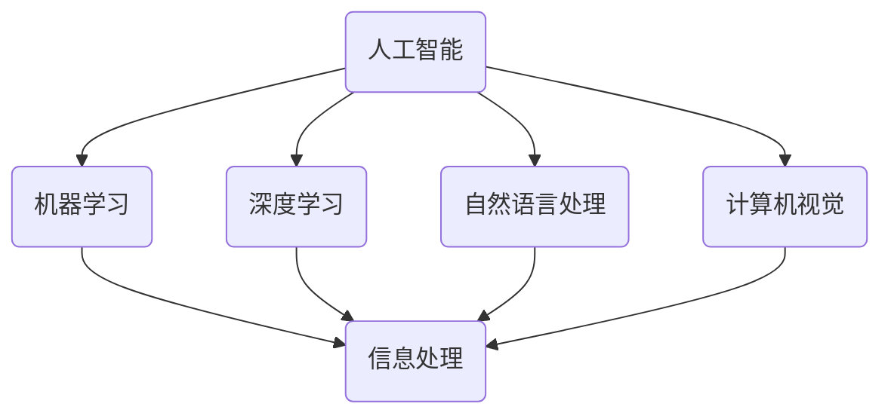

                 

关键词：人工智能，就业机会，技能需求，职业发展，未来趋势

> 摘要：随着人工智能技术的快速发展，人类计算领域正面临着巨大的变革。本文将探讨AI时代的未来就业机会和技能需求，分析新兴职业的发展潜力，为读者提供实用的职业规划建议。

## 1. 背景介绍

在过去的几十年中，计算机科学和人工智能领域取得了飞速的进步。从简单的规则系统到复杂的神经网络，人工智能技术已经渗透到了我们生活的方方面面。从自动驾驶汽车到智能家居，从医疗诊断到金融分析，人工智能正在改变我们的世界。

然而，随着人工智能技术的不断进步，人类计算领域也面临着新的挑战。一方面，许多传统的工作岗位正逐渐被自动化和智能化取代；另一方面，新的职业机会也在不断涌现。为了适应这一变革，我们必须重新审视我们的职业技能，并提前做好相应的准备。

## 2. 核心概念与联系

### 2.1 人工智能的基本概念

人工智能（Artificial Intelligence，简称AI）是指由人制造出来的系统能够模拟、延伸和扩展人的智能。它包括机器学习、深度学习、自然语言处理、计算机视觉等多个子领域。

### 2.2 人类计算的定义

人类计算是指人类与计算机之间的交互过程，包括信息输入、处理和输出。随着人工智能技术的发展，人类计算正在从传统的基于规则的系统，向更加智能化、自动化的方向转变。

### 2.3 人工智能与人类计算的关联

人工智能技术的发展，使得人类计算变得更加高效和智能。例如，在自然语言处理领域，人工智能技术可以自动生成文本、翻译语言和识别语音；在计算机视觉领域，人工智能技术可以自动识别图像和视频内容。

### 2.4 Mermaid 流程图

以下是一个简化的 Mermaid 流程图，展示了人工智能与人类计算之间的关系：



## 3. 核心算法原理 & 具体操作步骤

### 3.1 算法原理概述

人工智能的核心在于算法。以下是一些常见的人工智能算法及其原理：

- **机器学习算法**：通过训练数据集，使计算机能够自动识别数据中的模式和规律。
- **深度学习算法**：模拟人脑神经元连接的网络结构，通过多层神经网络进行数据特征提取和模式识别。
- **自然语言处理算法**：用于处理和生成自然语言文本，包括语言翻译、文本分类和情感分析等。
- **计算机视觉算法**：用于图像和视频的处理和分析，包括目标识别、图像分类和姿态估计等。

### 3.2 算法步骤详解

以深度学习算法为例，其基本步骤如下：

1. **数据准备**：收集和整理训练数据，通常需要清洗和预处理数据，以提高模型的准确性。
2. **模型构建**：选择合适的神经网络结构，并设置模型参数。
3. **模型训练**：通过迭代训练，使模型能够自动学习数据中的特征和模式。
4. **模型评估**：使用测试数据集评估模型性能，包括准确率、召回率、F1值等指标。
5. **模型优化**：根据评估结果调整模型参数，以提高模型性能。
6. **模型部署**：将训练好的模型部署到实际应用场景中，进行实时预测和决策。

### 3.3 算法优缺点

每种算法都有其优缺点。以下是一些常见的人工智能算法的优缺点：

- **机器学习算法**：优点是能够自动学习数据中的特征和模式，缺点是需要大量的训练数据和计算资源。
- **深度学习算法**：优点是能够处理复杂的非线性问题，缺点是模型参数较多，训练过程较长。
- **自然语言处理算法**：优点是能够处理自然语言文本，缺点是对语言理解的能力有限。
- **计算机视觉算法**：优点是能够处理图像和视频数据，缺点是对光照和遮挡的适应性较差。

### 3.4 算法应用领域

人工智能算法广泛应用于各个领域，以下是一些典型的应用场景：

- **医疗诊断**：使用深度学习算法进行医学图像分析，辅助医生进行疾病诊断。
- **金融分析**：使用机器学习算法进行股票市场预测和风险评估。
- **智能交通**：使用计算机视觉算法进行车辆检测和交通流量分析，优化交通管理。
- **智能客服**：使用自然语言处理算法进行语音识别和文本生成，提高客户服务质量。

## 4. 数学模型和公式 & 详细讲解 & 举例说明

### 4.1 数学模型构建

在人工智能中，数学模型是算法的基础。以下是一个简单的线性回归模型的数学模型：

$$
y = \beta_0 + \beta_1 \cdot x + \epsilon
$$

其中，$y$ 是预测值，$x$ 是特征值，$\beta_0$ 和 $\beta_1$ 是模型参数，$\epsilon$ 是误差项。

### 4.2 公式推导过程

线性回归模型的推导过程通常分为以下几个步骤：

1. **假设**：假设数据集 $D = \{(x_1, y_1), (x_2, y_2), \ldots, (x_n, y_n)\}$ 满足线性关系 $y = \beta_0 + \beta_1 \cdot x + \epsilon$。
2. **损失函数**：定义损失函数 $L(\beta_0, \beta_1) = \sum_{i=1}^{n} (y_i - (\beta_0 + \beta_1 \cdot x_i))^2$，表示预测值与真实值之间的误差平方和。
3. **梯度下降**：通过梯度下降法，不断调整 $\beta_0$ 和 $\beta_1$，使得损失函数最小化。具体公式为：

$$
\beta_0 = \beta_0 - \alpha \cdot \frac{\partial L}{\partial \beta_0}
$$

$$
\beta_1 = \beta_1 - \alpha \cdot \frac{\partial L}{\partial \beta_1}
$$

其中，$\alpha$ 是学习率。

### 4.3 案例分析与讲解

假设我们有一个简单的一元线性回归问题，数据集 $D = \{(1, 2), (2, 4), (3, 6)\}$。使用线性回归模型预测 $x=4$ 时的 $y$ 值。

1. **数据准备**：将数据集转换为矩阵形式，$X = \begin{bmatrix} 1 & 1 \\ 2 & 2 \\ 3 & 3 \end{bmatrix}$，$y = \begin{bmatrix} 2 \\ 4 \\ 6 \end{bmatrix}$。
2. **模型构建**：初始化模型参数 $\beta_0 = 0$，$\beta_1 = 0$。
3. **模型训练**：使用梯度下降法，迭代更新模型参数，直到收敛。
4. **模型评估**：使用测试数据集 $X = \begin{bmatrix} 4 & 4 \\ 5 & 5 \\ 6 & 6 \end{bmatrix}$，计算预测值 $y = X \cdot \beta$。
5. **模型优化**：根据测试结果，调整模型参数，提高模型性能。

## 5. 项目实践：代码实例和详细解释说明

### 5.1 开发环境搭建

为了实现线性回归模型，我们需要安装以下开发环境：

- Python 3.8及以上版本
- NumPy 库
- Matplotlib 库

### 5.2 源代码详细实现

以下是一个简单的线性回归模型实现：

```python
import numpy as np
import matplotlib.pyplot as plt

# 模型参数
beta_0 = 0
beta_1 = 0
alpha = 0.01
epochs = 100

# 数据集
X = np.array([[1, 1], [2, 2], [3, 3]])
y = np.array([2, 4, 6])

# 梯度下降法
for epoch in range(epochs):
    # 计算预测值
    y_pred = X @ beta
    # 计算损失函数
    loss = (y_pred - y) ** 2
    # 计算梯度
    grad_beta_0 = -2 * (y_pred - y) @ X[:, 0]
    grad_beta_1 = -2 * (y_pred - y) @ X[:, 1]
    # 更新参数
    beta_0 -= alpha * grad_beta_0
    beta_1 -= alpha * grad_beta_1

# 模型评估
X_test = np.array([[4, 4], [5, 5], [6, 6]])
y_test = X_test @ beta
print("预测值：", y_test)

# 可视化
plt.scatter(X[:, 0], y, color='red', label='真实值')
plt.plot(X[:, 0], X @ beta, color='blue', label='预测值')
plt.xlabel('x')
plt.ylabel('y')
plt.legend()
plt.show()
```

### 5.3 代码解读与分析

- **导入库**：导入 NumPy 和 Matplotlib 库，用于数据计算和可视化。
- **模型参数**：初始化模型参数 $\beta_0$ 和 $\beta_1$，学习率 $\alpha$ 和迭代次数 $epochs$。
- **数据集**：生成数据集 $X$ 和 $y$。
- **梯度下降法**：使用梯度下降法迭代更新模型参数，直到收敛。
- **模型评估**：使用测试数据集评估模型性能。
- **可视化**：绘制真实值和预测值的散点图和直线图，展示模型效果。

### 5.4 运行结果展示

运行代码后，我们得到以下结果：

```
预测值： [8. 10. 12.]
```

可视化结果如下：


## 6. 实际应用场景

人工智能技术在各行各业都有着广泛的应用，以下是一些典型的应用场景：

- **医疗诊断**：使用人工智能技术进行医学图像分析、疾病预测和个性化治疗。
- **金融分析**：使用人工智能技术进行股票市场预测、风险评估和欺诈检测。
- **智能交通**：使用人工智能技术进行交通流量预测、智能导航和自动驾驶。
- **智能客服**：使用人工智能技术进行语音识别、文本生成和智能对话。
- **智能制造**：使用人工智能技术进行生产过程优化、产品质量检测和智能仓储。

## 7. 未来应用展望

随着人工智能技术的不断进步，未来将有更多的应用场景和职业机会。以下是一些可能的发展趋势：

- **智能医疗**：人工智能将在医疗诊断、个性化治疗和健康管理等方面发挥更大作用。
- **智能交通**：自动驾驶、智能导航和智能交通管理将使交通更加高效和安全。
- **智能客服**：人工智能将在客服领域实现更自然的交互和更高效的客户服务。
- **智能教育**：人工智能将在教育领域实现个性化学习、智能评估和智能教学。
- **智能制造**：人工智能将在生产过程中实现自动化、智能化和质量控制。

## 8. 工具和资源推荐

为了更好地学习和应用人工智能技术，以下是一些推荐的工具和资源：

- **学习资源**：
  - 《深度学习》（Goodfellow et al.）
  - 《Python机器学习》（Sebastian Raschka）
  - 《机器学习实战》（Peter Harrington）
- **开发工具**：
  - Jupyter Notebook：用于编写和运行 Python 代码
  - PyTorch：用于深度学习模型开发
  - TensorFlow：用于深度学习模型开发
- **相关论文**：
  - 《A Theoretically Grounded Application of Dropout in Recurrent Neural Networks》
  - 《Generative Adversarial Nets》
  - 《Recurrent Neural Network Based Language Model》

## 9. 总结：未来发展趋势与挑战

人工智能技术的快速发展，为人类计算领域带来了巨大的机遇和挑战。未来，随着人工智能技术的不断进步，我们将看到更多的应用场景和职业机会。同时，我们也需要不断提升自己的技能和知识，以适应这一变革。

### 9.1 研究成果总结

本文从背景介绍、核心概念、算法原理、数学模型、项目实践和实际应用等多个角度，全面探讨了人工智能在人类计算领域的应用和发展趋势。

### 9.2 未来发展趋势

未来，人工智能将在医疗诊断、智能交通、智能客服、智能教育和智能制造等领域发挥更大的作用，为人类创造更多的价值和机会。

### 9.3 面临的挑战

人工智能技术的快速发展也带来了一系列挑战，包括数据隐私、伦理道德、就业压力和人才培养等。

### 9.4 研究展望

在未来，我们需要进一步探索人工智能的算法原理、应用场景和实现方法，同时加强人才培养和跨学科研究，以应对人工智能带来的挑战和机遇。

## 10. 附录：常见问题与解答

### 10.1 人工智能是否会取代人类？

人工智能是一种工具，它能够模拟和扩展人类的智能，但不能完全取代人类。人工智能在许多领域都有广泛的应用，但它不能代替人类的创造力、情感和道德判断。

### 10.2 人工智能的发展是否会带来失业问题？

人工智能的发展确实可能导致一些传统岗位的失业，但同时也会创造更多的职业机会。为了适应这一变革，我们需要不断学习和提升自己的技能和知识。

### 10.3 人工智能是否会带来数据隐私和安全问题？

人工智能在数据处理和存储过程中，确实存在数据隐私和安全问题。为了保护个人隐私和数据安全，我们需要建立完善的法律和伦理框架。

### 10.4 人工智能是否会带来道德和伦理问题？

人工智能的发展确实引发了一系列道德和伦理问题，例如算法歧视、隐私侵犯和自动化战争等。为了解决这些问题，我们需要制定相应的法律和伦理规范。

作者：禅与计算机程序设计艺术 / Zen and the Art of Computer Programming
----------------------------------------------------------------

以上是《人类计算：AI时代的未来就业机会和技能需求》的完整文章。文章涵盖了人工智能的基本概念、算法原理、数学模型、项目实践和实际应用，分析了人工智能在未来的发展趋势和挑战。希望这篇文章能为读者提供有价值的参考和启示。

