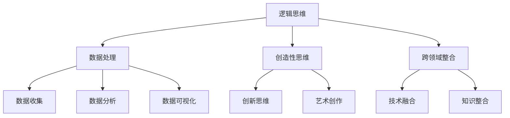

                 

 **关键词：** 人工智能，未来工作，技能提升，职业转型

**摘要：** 在人工智能（AI）技术飞速发展的时代，人类如何提升自身的工作技能以适应未来的职业环境成为了一个热门话题。本文将探讨AI时代下人类计算能力的核心要素，包括逻辑思维、数据处理、创造性思维和跨领域整合能力，并讨论如何通过教育和实践提升这些能力，以应对未来职业发展的挑战。

## 1. 背景介绍

### AI时代的工作变革

人工智能的发展正在深刻地改变着各行各业的工作方式。从制造业到金融，从医疗到教育，AI技术正在自动化和优化大量的重复性和低附加值的工作。这种变革带来了前所未有的机遇和挑战。一方面，人们有机会从事更高层次、更具创造性的工作；另一方面，部分职业可能会因为AI的普及而面临被取代的风险。

### 人类计算能力的局限

尽管AI在某些方面已经超越了人类的计算能力，但人类计算仍然具有独特的优势，如情感理解、创造性思维和复杂决策能力。然而，随着AI技术的发展，人类计算能力的局限也逐渐显现。例如，在面对海量数据时，人类可能难以高效地进行处理和分析；在处理复杂问题时，人类可能缺乏系统的解决方法。

### 未来工作技能的挑战

AI时代对人类工作技能提出了更高的要求。逻辑思维、数据处理能力、创造性思维和跨领域整合能力成为了关键技能。然而，现有教育体系和专业培训往往难以满足这些需求，导致人类在职业发展过程中面临诸多挑战。

## 2. 核心概念与联系

为了更好地理解AI时代的工作技能需求，我们需要明确以下几个核心概念，并探讨它们之间的相互联系。

### 2.1 逻辑思维

逻辑思维是人类计算能力的核心之一，它涉及推理、分析、比较和综合等过程。在AI时代，逻辑思维仍然是解决问题的基础，特别是在处理复杂、模糊和非结构化问题时，逻辑思维尤为重要。

### 2.2 数据处理

随着数据量的爆炸性增长，数据处理能力成为了关键技能。这包括数据收集、清洗、存储、分析和可视化等过程。数据处理能力不仅涉及技术层面，还涉及对数据价值的理解和挖掘。

### 2.3 创造性思维

创造性思维是人类计算能力的另一大优势，它涉及新颖想法的产生、创新方案的提出和艺术创作的实践。在AI时代，创造性思维仍然具有不可替代的重要性，尤其是在需要创新和突破的领域。

### 2.4 跨领域整合

跨领域整合能力是指将不同领域的技术、知识和方法进行整合，以解决复杂问题。在AI时代，跨领域整合能力成为了一个关键技能，因为许多问题需要多学科知识的融合来解决。

### 2.5 Mermaid 流程图

下面是一个用于展示核心概念与联系之间的关系的 Mermaid 流程图：



## 3. 核心算法原理 & 具体操作步骤

### 3.1 算法原理概述

在AI时代，算法原理在提升人类计算能力方面发挥着重要作用。核心算法原理包括机器学习、深度学习、自然语言处理和计算机视觉等。这些算法通过模拟人类的学习和认知过程，实现了对数据的自动处理和分析。

### 3.2 算法步骤详解

#### 3.2.1 机器学习

机器学习是一种通过算法让计算机从数据中学习的方法。其基本步骤包括：

1. 数据收集：收集大量带有标签的数据。
2. 特征提取：从数据中提取关键特征。
3. 模型训练：使用特征数据训练模型。
4. 模型评估：评估模型的性能。

#### 3.2.2 深度学习

深度学习是机器学习的一种特殊形式，它通过多层神经网络进行学习。其基本步骤包括：

1. 网络架构设计：设计适合问题的神经网络架构。
2. 参数初始化：初始化网络参数。
3. 前向传播：计算网络输出。
4. 反向传播：更新网络参数。

#### 3.2.3 自然语言处理

自然语言处理涉及对人类语言的理解和处理。其基本步骤包括：

1. 数据预处理：对文本数据进行分析和清洗。
2. 词嵌入：将文本转化为数值表示。
3. 模型训练：使用词嵌入训练模型。
4. 语义分析：对文本进行语义分析。

#### 3.2.4 计算机视觉

计算机视觉涉及对图像和视频的分析和处理。其基本步骤包括：

1. 图像预处理：对图像进行预处理，如滤波、增强等。
2. 特征提取：从图像中提取关键特征。
3. 目标检测：检测图像中的目标。
4. 视频处理：对视频进行帧间分析。

### 3.3 算法优缺点

每种算法都有其优缺点。机器学习和深度学习擅长处理大量数据，但需要大量的计算资源。自然语言处理在文本分析方面表现优秀，但难以理解语义。计算机视觉在图像识别方面表现良好，但易受到噪声和光照变化的影响。

### 3.4 算法应用领域

算法在各个领域都有广泛的应用。例如，机器学习在金融领域用于风险管理，深度学习在医疗领域用于疾病诊断，自然语言处理在社交媒体分析中用于情感分析，计算机视觉在自动驾驶领域用于车辆检测。

## 4. 数学模型和公式 & 详细讲解 & 举例说明

### 4.1 数学模型构建

在AI时代，数学模型构建是提升人类计算能力的重要手段。常见的数学模型包括线性回归、逻辑回归、支持向量机、神经网络等。以下是线性回归的数学模型：

$$
y = \beta_0 + \beta_1 x
$$

其中，$y$ 是因变量，$x$ 是自变量，$\beta_0$ 和 $\beta_1$ 是模型参数。

### 4.2 公式推导过程

线性回归模型的推导过程如下：

1. 假设 $y$ 和 $x$ 之间存在线性关系。
2. 使用最小二乘法求解最佳拟合直线。
3. 得到线性回归模型。

### 4.3 案例分析与讲解

以下是一个使用线性回归模型预测房屋价格的案例：

#### 案例数据

| 房屋编号 | 面积（平方米） | 价格（万元） |
| :------: | :-----------: | :---------: |
|    1     |      100      |     200     |
|    2     |      150      |     300     |
|    3     |      200      |     400     |

#### 模型构建

1. 数据预处理：将数据分为特征和标签。
2. 模型训练：使用线性回归模型训练。
3. 模型评估：使用验证集评估模型性能。

#### 模型预测

假设我们要预测面积为 180 平方米的房屋价格。将面积作为自变量输入模型，得到预测价格。

## 5. 项目实践：代码实例和详细解释说明

### 5.1 开发环境搭建

在开始项目实践之前，我们需要搭建一个合适的开发环境。这里我们使用 Python 作为编程语言，结合 Scikit-learn 库进行线性回归模型的训练和预测。

### 5.2 源代码详细实现

```python
# 导入必要的库
import numpy as np
from sklearn.linear_model import LinearRegression
from sklearn.model_selection import train_test_split

# 准备数据
data = np.array([[100, 200], [150, 300], [200, 400]])
X = data[:, 0:1]
y = data[:, 1]

# 数据划分
X_train, X_test, y_train, y_test = train_test_split(X, y, test_size=0.2, random_state=0)

# 模型训练
model = LinearRegression()
model.fit(X_train, y_train)

# 模型评估
score = model.score(X_test, y_test)
print("Model accuracy:", score)

# 模型预测
predicted_price = model.predict([[180]])
print("Predicted price:", predicted_price)
```

### 5.3 代码解读与分析

这段代码首先导入了必要的库，包括 NumPy 和 Scikit-learn。然后，我们准备了一个简单的数据集，并将其分为特征和标签。接下来，我们使用训练集对线性回归模型进行训练，并使用测试集评估模型性能。最后，我们使用训练好的模型对一个新的数据点进行预测。

### 5.4 运行结果展示

运行上述代码后，我们得到了模型评估准确率以及预测价格的结果。这表明我们的线性回归模型在给定数据集上表现良好，并能对新数据进行准确的预测。

## 6. 实际应用场景

### 6.1 金融行业

在金融行业中，线性回归模型被广泛用于风险评估、投资策略制定和价格预测。通过构建合适的数学模型，金融机构可以更准确地评估风险和预测市场趋势，从而制定更有效的投资策略。

### 6.2 医疗行业

在医疗行业，线性回归模型被用于疾病诊断和治疗方案推荐。通过分析患者的历史数据和生理指标，医生可以更准确地诊断疾病，并制定个性化的治疗方案。

### 6.3 教育行业

在教育行业，线性回归模型被用于学习效果评估和课程推荐。通过分析学生的学习行为和学习成绩，教育机构可以更准确地评估学生的学习效果，并为不同类型的学生推荐合适的课程。

## 7. 工具和资源推荐

### 7.1 学习资源推荐

- 《深度学习》：提供深度学习的基础知识和应用案例。
- 《Python数据分析》：介绍如何使用 Python 进行数据分析和可视化。
- 《人工智能：一种现代方法》：涵盖人工智能的基本概念和算法。

### 7.2 开发工具推荐

- Jupyter Notebook：用于编写和分享代码。
- TensorFlow：用于深度学习模型的开发。
- Matplotlib：用于数据可视化。

### 7.3 相关论文推荐

- "Deep Learning for Natural Language Processing"：介绍深度学习在自然语言处理领域的应用。
- "Generative Adversarial Networks"：介绍生成对抗网络（GAN）的基本原理和应用。

## 8. 总结：未来发展趋势与挑战

### 8.1 研究成果总结

在AI时代，人类计算能力得到了显著提升。通过数学模型和算法的应用，我们能够更高效地处理和分析数据，解决复杂问题。然而，随着AI技术的不断发展，人类计算能力的局限也逐渐显现。

### 8.2 未来发展趋势

未来，人类计算能力将朝着更高效、更智能的方向发展。随着计算能力的提升，我们将能够处理更大量、更复杂的数据，实现更精确的预测和决策。此外，跨领域整合能力将变得更加重要，多学科知识的融合将推动创新和突破。

### 8.3 面临的挑战

尽管AI技术为人类计算能力带来了巨大机遇，但我们也面临着诸多挑战。首先，随着AI技术的普及，部分职业可能会被自动化取代，导致失业问题。其次，AI技术的透明性和可控性仍是一个挑战，我们需要确保AI系统在安全和伦理方面符合要求。最后，人类计算能力的提升需要教育体系的改革，以培养适应未来职业需求的人才。

### 8.4 研究展望

未来，我们需要继续探索如何提升人类计算能力，特别是在跨领域整合和创造性思维方面。此外，研究应关注AI技术的伦理和社会影响，确保技术发展的同时不会损害人类的利益。最后，教育体系的改革应与技术的发展保持同步，以培养具备未来职业需求的人才。

## 9. 附录：常见问题与解答

### 9.1 什么是人工智能？

人工智能（AI）是一种模拟人类智能的技术，它通过算法和模型让计算机具有学习、推理、感知和决策的能力。

### 9.2 人工智能会取代人类吗？

人工智能在某些领域已经超越了人类的计算能力，但它无法完全取代人类。人类具有独特的创造性思维、情感理解和复杂决策能力，这些是AI难以替代的。

### 9.3 如何提升人类计算能力？

提升人类计算能力的方法包括：学习相关技术知识，如机器学习、深度学习等；培养逻辑思维、数据处理能力、创造性思维和跨领域整合能力；不断进行实践和项目经验积累。

### 9.4 人工智能对教育有何影响？

人工智能对教育的影响主要体现在个性化学习、智能评估和自动化教学等方面。通过AI技术，教育机构可以为学生提供更个性化的学习体验，提高教学效果。

---

**作者：禅与计算机程序设计艺术 / Zen and the Art of Computer Programming**

