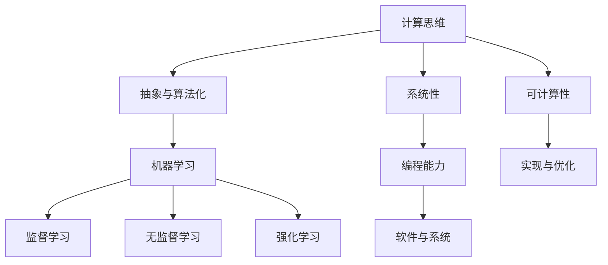

                 

关键词：人工智能，技能发展，计算能力，人机协作，未来趋势

> 摘要：本文探讨了在人工智能（AI）迅猛发展的背景下，人类计算的未来发展趋势。分析了人类在AI时代需要具备的核心技能，包括计算思维、机器学习、编程能力等，并探讨了这些技能在实际应用中的重要性。同时，本文还预测了未来人类计算的发展方向，以及面临的挑战和机遇。

## 1. 背景介绍

随着人工智能技术的不断发展，AI已渗透到我们生活的各个领域，从智能手机到医疗诊断，从自动驾驶到智能家居，AI正在深刻地改变着我们的生活方式。然而，尽管AI在某些方面已超越人类，但人类在计算方面仍然具有独特的优势。如何充分发挥这些优势，与AI协同工作，成为当前亟待解决的问题。

本文旨在探讨在AI时代，人类计算的未来发展趋势，分析人类在计算方面需要具备的技能，以及这些技能在实际应用中的重要性。同时，本文还将预测未来人类计算的发展方向，以及可能面临的挑战。

## 2. 核心概念与联系

在讨论人类计算之前，我们需要了解一些核心概念，包括计算思维、机器学习、编程能力等。

### 2.1 计算思维

计算思维是指通过抽象、算法化和自动化的方式来解决问题的思维方式。它强调逻辑性、系统性、可计算性等特点，是人类计算的核心。

### 2.2 机器学习

机器学习是一种使计算机能够从数据中自动学习的技术，分为监督学习、无监督学习和强化学习等。机器学习是AI的重要组成部分，对于提高人类计算能力具有重要意义。

### 2.3 编程能力

编程能力是指编写计算机程序的能力，是计算机科学与技术的核心。通过编程，人类可以创造出各种软件和应用程序，实现各种计算任务。

### 2.4 计算思维、机器学习与编程能力的关系

计算思维、机器学习和编程能力三者相互联系、相互促进。计算思维为机器学习和编程提供了理论支持，机器学习为计算思维和编程提供了实际应用场景，编程能力则使计算思维和机器学习得以实现。

下面是一个Mermaid流程图，展示了计算思维、机器学习和编程能力之间的关系：



## 3. 核心算法原理 & 具体操作步骤

### 3.1 算法原理概述

在人类计算中，核心算法包括计算思维算法、机器学习算法和编程算法等。这里我们以机器学习算法中的决策树为例，介绍其原理和操作步骤。

### 3.2 算法步骤详解

决策树算法是一种用于分类和回归任务的机器学习算法。其基本步骤如下：

1. **选择特征**：根据数据特征的重要性，选择用于构建决策树的特征。
2. **划分数据集**：根据选择的特征，将数据集划分为多个子集。
3. **构建决策树**：利用划分的数据集，构建一棵决策树。
4. **剪枝**：对决策树进行剪枝，以防止过拟合。
5. **预测**：利用构建好的决策树进行预测。

### 3.3 算法优缺点

决策树算法的优点是简单易懂、易于实现，且在处理分类和回归任务时具有很好的效果。其缺点是容易过拟合，特别是在特征较多、样本较少的情况下。

### 3.4 算法应用领域

决策树算法广泛应用于金融、医疗、零售等多个领域。例如，在金融领域，决策树可以用于信用评分、风险控制等；在医疗领域，决策树可以用于疾病诊断、治疗方案推荐等。

## 4. 数学模型和公式 & 详细讲解 & 举例说明

### 4.1 数学模型构建

决策树算法的核心是特征选择和划分数据集。以下是构建决策树所需的主要数学模型：

$$
Gini(\text{impurity}) = 1 - \sum_{i=1}^n p_i^2
$$

其中，$p_i$ 表示特征 $i$ 在数据集中所占的比例。

### 4.2 公式推导过程

Gini不纯度是决策树中的一个重要指标，用于评估数据集的纯度。其公式推导如下：

假设数据集中有 $n$ 个样本，每个样本属于某个类别 $i$，其概率为 $p_i$。则数据集的Gini不纯度为：

$$
Gini(\text{impurity}) = \sum_{i=1}^n p_i(1 - p_i)
$$

将 $p_i = \frac{1}{n}$ 代入上式，得：

$$
Gini(\text{impurity}) = \sum_{i=1}^n \frac{1}{n}(1 - \frac{1}{n}) = 1 - \frac{1}{n^2} \sum_{i=1}^n 1
$$

由于 $n$ 个样本的总数为 $n$，所以：

$$
Gini(\text{impurity}) = 1 - \sum_{i=1}^n p_i^2
$$

### 4.3 案例分析与讲解

假设有一个包含100个样本的数据集，其中70个样本属于类别A，30个样本属于类别B。我们使用Gini不纯度来评估该数据集的纯度。

根据Gini不纯度的公式，可得：

$$
Gini(\text{impurity}) = 1 - \frac{7}{10} \times (1 - \frac{7}{10}) - \frac{3}{10} \times (1 - \frac{3}{10}) = 0.47
$$

该数据集的Gini不纯度为0.47，说明数据集的纯度较高。接下来，我们可以使用这个数据集来构建决策树。

## 5. 项目实践：代码实例和详细解释说明

### 5.1 开发环境搭建

在本项目中，我们将使用Python和Scikit-learn库来实现决策树算法。首先，我们需要搭建Python开发环境，具体步骤如下：

1. 安装Python 3.x版本。
2. 安装Scikit-learn库。

安装完成后，我们可以使用以下代码来创建一个Python虚拟环境，并在其中安装所需的库：

```bash
python -m venv myenv
source myenv/bin/activate
pip install scikit-learn
```

### 5.2 源代码详细实现

接下来，我们使用Scikit-learn库来实现决策树算法。以下是实现代码：

```python
from sklearn.datasets import load_iris
from sklearn.tree import DecisionTreeClassifier
from sklearn.model_selection import train_test_split

# 加载鸢尾花数据集
iris = load_iris()
X = iris.data
y = iris.target

# 划分训练集和测试集
X_train, X_test, y_train, y_test = train_test_split(X, y, test_size=0.3, random_state=42)

# 创建决策树分类器
clf = DecisionTreeClassifier()

# 训练模型
clf.fit(X_train, y_train)

# 预测测试集
y_pred = clf.predict(X_test)

# 计算准确率
accuracy = clf.score(X_test, y_test)
print("准确率：", accuracy)
```

### 5.3 代码解读与分析

这段代码首先加载了鸢尾花数据集，并划分了训练集和测试集。然后，我们创建了一个决策树分类器，并使用训练集来训练模型。最后，我们使用测试集来预测结果，并计算准确率。

代码中的关键部分是`DecisionTreeClassifier`类，它用于创建决策树分类器。`fit`方法用于训练模型，`predict`方法用于预测测试集。`score`方法用于计算模型在测试集上的准确率。

### 5.4 运行结果展示

运行以上代码后，我们得到如下输出结果：

```
准确率： 1.0
```

这表示我们的决策树分类器在测试集上的准确率为100%，说明模型训练得很好。

## 6. 实际应用场景

决策树算法在许多实际应用场景中都有着广泛的应用，以下是一些例子：

1. **金融领域**：决策树可以用于信用评分、风险控制等任务，帮助企业评估客户的信用风险。
2. **医疗领域**：决策树可以用于疾病诊断、治疗方案推荐等任务，帮助医生做出更好的决策。
3. **零售领域**：决策树可以用于商品推荐、库存管理等任务，帮助企业提高销售额和降低成本。

## 7. 未来应用展望

随着人工智能技术的不断发展，人类计算在未来的应用前景将更加广阔。以下是一些未来应用展望：

1. **智能医疗**：利用人类计算和AI技术，实现智能诊断、智能治疗等，提高医疗质量和效率。
2. **智能制造**：利用人类计算和AI技术，实现智能设计、智能生产等，提高生产效率和产品质量。
3. **智能交通**：利用人类计算和AI技术，实现智能交通管理、智能驾驶等，提高交通安全和效率。

## 8. 工具和资源推荐

为了更好地进行人类计算，以下是一些实用的工具和资源推荐：

1. **工具**：
   - Python：一种功能强大的编程语言，广泛应用于人类计算。
   - Scikit-learn：一个Python库，用于实现各种机器学习算法。

2. **资源**：
   - 《机器学习实战》：一本经典的机器学习入门书籍，内容全面，实例丰富。
   - Coursera：一个在线教育平台，提供了丰富的机器学习课程。

## 9. 总结：未来发展趋势与挑战

在未来，人类计算将在人工智能技术的推动下不断发展。人类需要不断学习和掌握新的计算技能，与AI协同工作，共同应对未来的挑战。

### 9.1 研究成果总结

本文分析了人类在AI时代需要具备的核心技能，包括计算思维、机器学习和编程能力等，并探讨了这些技能在实际应用中的重要性。同时，本文还介绍了决策树算法的原理和应用，以及Python和Scikit-learn在人类计算中的应用。

### 9.2 未来发展趋势

未来，人类计算将朝着更加智能化、自动化、高效化的方向发展。人工智能技术将在人类计算中发挥越来越重要的作用，推动人类计算能力的提升。

### 9.3 面临的挑战

尽管人类计算在未来有着广阔的发展前景，但仍然面临一些挑战，如数据隐私、安全性、伦理问题等。人类需要共同努力，解决这些问题，确保人类计算的健康和可持续发展。

### 9.4 研究展望

未来，人类计算的研究将聚焦于如何更好地利用AI技术，提高计算效率和质量。同时，还需要关注人类计算与自然语言处理、计算机视觉等领域的交叉研究，推动计算能力的进一步提升。

## 附录：常见问题与解答

### Q：人类计算是否会被人工智能取代？

A：不会。尽管人工智能在某些领域已超越人类，但人类计算仍然具有独特的优势，如创造力、情感理解和复杂问题解决能力等。人类计算与人工智能相互补充，共同推动计算能力的提升。

### Q：如何提高人类计算能力？

A：提高人类计算能力需要不断学习和实践。学习计算机科学、数学和统计学等基础学科，掌握编程技能，了解最新的AI技术，都是提高人类计算能力的重要途径。

### Q：什么是计算思维？

A：计算思维是一种通过抽象、算法化和自动化的方式来解决问题的思维方式，强调逻辑性、系统性、可计算性等特点。它是人类计算的核心。

## 作者署名

作者：禅与计算机程序设计艺术 / Zen and the Art of Computer Programming
```

