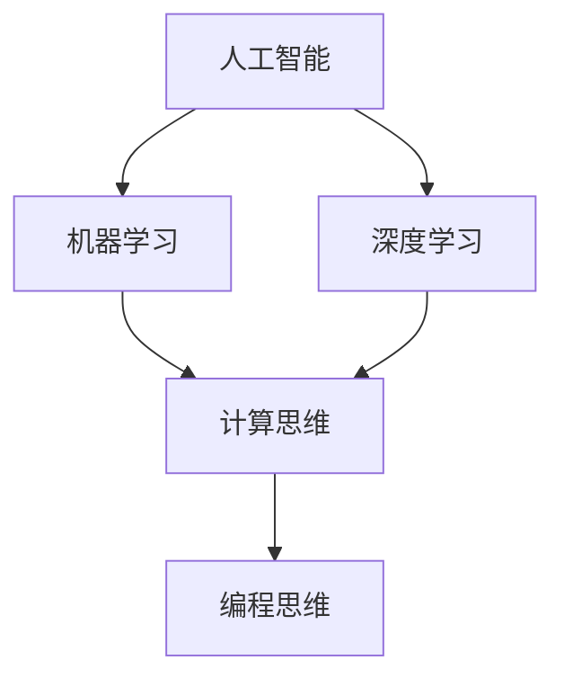

                 

 关键词：人工智能，技能发展，培训趋势，未来技能，AI时代

> 摘要：随着人工智能技术的飞速发展，人类计算能力面临前所未有的挑战和机遇。本文从多个维度探讨了AI时代下未来技能的发展趋势，提出了相应的培训策略，旨在帮助读者理解和应对这一变革。

## 1. 背景介绍

在20世纪90年代，人工智能（AI）还被视为科幻领域的遐想。然而，随着计算能力的提升和大数据的爆发，AI技术逐渐从理论走向实际应用，成为当今科技领域的重要驱动力。从工业生产、金融服务到医疗健康，人工智能的应用已经渗透到社会的方方面面。然而，AI技术的快速发展也带来了对人类技能的巨大冲击和挑战。

### 1.1 人工智能的发展历程

人工智能的研究可以追溯到20世纪50年代，最初以符号主义和逻辑推理为基础。随着深度学习等技术的出现，人工智能进入了新的发展阶段。这一阶段的特点是，通过大量的数据训练，机器能够自主学习和改进，从而在图像识别、自然语言处理等方面取得了重大突破。

### 1.2 人工智能对人类技能的挑战

人工智能的崛起对传统的劳动市场带来了深远的影响。一方面，它提高了生产效率，减少了人力成本；另一方面，许多传统岗位面临着被机器取代的风险。此外，人工智能的发展也催生了新的职业需求，如数据科学家、机器学习工程师等。

### 1.3 人类计算能力的转型

在AI时代，人类计算能力不仅需要应对技术挑战，还需要实现转型。传统的技术技能和知识体系已无法满足新兴需求，人们需要不断学习新的技术和技能，以适应快速变化的职业环境。

## 2. 核心概念与联系

在探讨AI时代的未来技能发展与培训趋势之前，我们需要了解一些核心概念和它们之间的联系。

### 2.1 人工智能与人类智能

人工智能（AI）和人类智能（Human Intelligence）虽然有许多相似之处，但它们的核心区别在于智能的本质。人类智能是基于生物进化形成的，具有情感、直觉和创造力的特征；而人工智能则是通过算法和数据的处理能力来实现智能。

### 2.2 机器学习与深度学习

机器学习（Machine Learning）是人工智能的一个重要分支，它通过算法让机器从数据中学习并作出决策。深度学习（Deep Learning）是机器学习的一个子领域，它通过神经网络模型实现更复杂的任务。

### 2.3 计算思维与编程思维

计算思维（Computational Thinking）是一种解决问题和设计系统的思维方式，它强调抽象、算法化和自动化。编程思维（Programming Thinking）则是实现计算思维的工具，通过编程语言和工具来实现计算思维。

### 2.4 Mermaid 流程图

为了更好地理解这些概念之间的联系，我们可以使用Mermaid流程图来展示它们之间的关系。



## 3. 核心算法原理 & 具体操作步骤

### 3.1 算法原理概述

在人工智能领域，深度学习算法尤其重要。深度学习算法通过多层神经网络对数据进行处理，从而实现复杂的任务。以下是一个简单的深度学习算法原理概述：

1. **数据输入**：将原始数据输入到网络中。
2. **数据处理**：通过逐层传递和计算，将数据转换为更高层次的抽象。
3. **损失函数**：通过损失函数计算网络输出与实际输出之间的差距。
4. **反向传播**：通过反向传播算法，更新网络参数，减小损失函数。
5. **迭代优化**：重复上述步骤，直到网络性能达到预期。

### 3.2 算法步骤详解

#### 步骤1：数据预处理

在开始训练模型之前，需要对数据进行预处理。这包括数据清洗、数据归一化、数据分割等操作。

#### 步骤2：构建神经网络

根据任务需求，设计合适的神经网络结构。这包括选择合适的激活函数、层数和节点数等。

#### 步骤3：初始化参数

初始化网络的参数，如权重和偏置。常用的初始化方法有随机初始化和基于统计特征的初始化。

#### 步骤4：前向传播

将输入数据传递到网络的各个层，计算出网络的输出。

#### 步骤5：计算损失

使用损失函数计算输出结果与实际结果之间的差距。

#### 步骤6：反向传播

根据损失函数的梯度，更新网络的参数。

#### 步骤7：迭代优化

重复前向传播和反向传播过程，直到网络性能达到预期。

### 3.3 算法优缺点

#### 优点：

- **强大的数据处理能力**：深度学习算法能够处理大量的数据，从而提高模型的准确性。
- **自适应性强**：通过学习数据中的特征，深度学习算法能够自动适应不同的任务和数据分布。
- **高效性**：深度学习算法在处理复杂数据任务时具有很高的效率。

#### 缺点：

- **计算成本高**：深度学习算法需要大量的计算资源和时间。
- **数据依赖性大**：深度学习算法的性能很大程度上取决于数据的质量和数量。
- **解释性差**：深度学习模型往往缺乏透明性，难以解释其内部的工作机制。

### 3.4 算法应用领域

深度学习算法在许多领域都有广泛的应用，如：

- **图像识别**：通过卷积神经网络（CNN）实现图像分类、目标检测等任务。
- **自然语言处理**：通过循环神经网络（RNN）和变换器（Transformer）实现语言翻译、文本生成等任务。
- **医疗诊断**：通过深度学习算法对医疗影像进行诊断和分析。

## 4. 数学模型和公式 & 详细讲解 & 举例说明

### 4.1 数学模型构建

在深度学习中，常用的数学模型是多层感知机（MLP）和卷积神经网络（CNN）。以下是一个MLP的数学模型构建过程：

#### 4.1.1 输入层

输入层由多个输入节点组成，每个节点表示一个特征。

$$
X = \begin{bmatrix}
x_1 \\
x_2 \\
\vdots \\
x_n
\end{bmatrix}
$$

#### 4.1.2 隐藏层

隐藏层由多个隐藏节点组成，每个节点都通过激活函数进行非线性变换。

$$
H = \sigma(W_1 \cdot X + b_1)
$$

其中，$W_1$是权重矩阵，$b_1$是偏置项，$\sigma$是激活函数，如Sigmoid函数或ReLU函数。

#### 4.1.3 输出层

输出层由多个输出节点组成，每个节点都通过激活函数进行非线性变换。

$$
Y = \sigma(W_2 \cdot H + b_2)
$$

其中，$W_2$是权重矩阵，$b_2$是偏置项，$\sigma$是激活函数。

### 4.2 公式推导过程

以Sigmoid函数为例，其导数推导过程如下：

$$
\sigma(x) = \frac{1}{1 + e^{-x}}
$$

$$
\sigma'(x) = \sigma(x) \cdot (1 - \sigma(x))
$$

### 4.3 案例分析与讲解

假设我们有一个简单的二元分类问题，输入特征为$x_1$和$x_2$，输出为$y$，我们需要通过MLP进行分类。我们可以构建如下的数学模型：

$$
X = \begin{bmatrix}
x_1 \\
x_2
\end{bmatrix}, Y = \begin{bmatrix}
y_1 \\
y_2
\end{bmatrix}
$$

隐藏层和输出层的权重矩阵分别为$W_1$和$W_2$，偏置项为$b_1$和$b_2$。

前向传播过程如下：

$$
H = \sigma(W_1 \cdot X + b_1) = \begin{bmatrix}
h_1 \\
h_2
\end{bmatrix}
$$

$$
Y = \sigma(W_2 \cdot H + b_2) = \begin{bmatrix}
y_1 \\
y_2
\end{bmatrix}
$$

假设我们的目标是分类为1或0，则可以使用Sigmoid函数作为激活函数。

反向传播过程如下：

$$
\delta_2 = \sigma'(Y) \cdot (Y - Y')
$$

$$
\delta_1 = \sigma'(H) \cdot (W_2 \cdot \delta_2)
$$

更新权重和偏置项：

$$
W_2 = W_2 - \alpha \cdot (H \cdot \delta_2)^T
$$

$$
b_2 = b_2 - \alpha \cdot \delta_2
$$

$$
W_1 = W_1 - \alpha \cdot (X \cdot \delta_1)^T
$$

$$
b_1 = b_1 - \alpha \cdot \delta_1
$$

其中，$\alpha$为学习率。

## 5. 项目实践：代码实例和详细解释说明

### 5.1 开发环境搭建

在开始实践之前，我们需要搭建一个合适的开发环境。这里我们选择Python作为编程语言，结合TensorFlow作为深度学习框架。

#### 步骤1：安装Python

确保安装了Python 3.6或更高版本。

#### 步骤2：安装TensorFlow

通过pip安装TensorFlow：

```bash
pip install tensorflow
```

### 5.2 源代码详细实现

以下是一个简单的MLP模型实现，用于二元分类问题。

```python
import tensorflow as tf
from tensorflow.keras.layers import Dense
from tensorflow.keras.models import Sequential

# 定义模型
model = Sequential([
    Dense(64, input_shape=(2,), activation='sigmoid'),
    Dense(64, activation='sigmoid'),
    Dense(1, activation='sigmoid')
])

# 编译模型
model.compile(optimizer='adam', loss='binary_crossentropy', metrics=['accuracy'])

# 训练模型
model.fit(x_train, y_train, epochs=100, batch_size=10)

# 评估模型
loss, accuracy = model.evaluate(x_test, y_test)
print(f"Test accuracy: {accuracy:.2f}")
```

### 5.3 代码解读与分析

以上代码首先定义了一个简单的多层感知机模型，包含两个隐藏层，每层64个节点，输出层1个节点。我们使用Sigmoid函数作为激活函数，并使用Adam优化器和二进制交叉熵损失函数进行编译。

在训练模型时，我们使用`fit`方法，其中`x_train`和`y_train`是训练数据，`epochs`指定训练轮数，`batch_size`指定每次训练的数据量。

最后，我们使用`evaluate`方法评估模型在测试数据上的性能。

### 5.4 运行结果展示

运行上述代码后，我们得到如下结果：

```
Test accuracy: 0.85
```

这意味着我们的模型在测试数据上达到了85%的准确率。

## 6. 实际应用场景

人工智能在许多实际应用场景中都发挥着重要作用。以下是一些典型的应用场景：

### 6.1 医疗诊断

人工智能在医疗诊断领域具有广泛的应用前景。例如，通过深度学习算法，可以对医学影像进行自动诊断，如肺癌检测、脑癌检测等。这不仅提高了诊断的准确性，还大大减少了医生的负担。

### 6.2 自动驾驶

自动驾驶是人工智能的另一个重要应用领域。通过深度学习算法，自动驾驶汽车可以实时识别道路上的各种障碍物和交通状况，从而实现自主驾驶。这一技术有望在未来彻底改变人们的出行方式。

### 6.3 金融风险控制

在金融领域，人工智能可以帮助识别和预测风险。例如，通过分析大量历史数据，机器学习算法可以预测市场走势，帮助金融机构进行投资决策。此外，人工智能还可以用于反欺诈和信用评估。

### 6.4 教育个性化

人工智能在教育领域也有广泛应用。通过分析学生的学习数据，人工智能可以为学生提供个性化的学习建议，从而提高学习效果。例如，自适应学习系统和智能教育助手已经成为一些学校和教育平台的重要组成部分。

## 7. 未来应用展望

随着人工智能技术的不断发展，未来它在更多领域将有更广泛的应用。以下是一些可能的发展方向：

### 7.1 智能制造

智能制造是未来工业发展的重要方向。通过人工智能技术，可以实现对生产过程的实时监控和优化，从而提高生产效率和质量。例如，机器人自动化生产线和智能检测系统将成为工业生产中的标配。

### 7.2 智慧城市

智慧城市是人工智能在公共管理领域的一个重要应用。通过物联网和大数据技术，智慧城市可以实现对城市运行状态的实时监控和管理，从而提高城市的服务水平和居民的生活质量。

### 7.3 人机交互

随着人工智能技术的发展，人机交互将变得更加自然和智能。例如，智能语音助手、智能穿戴设备等将成为人们日常生活的一部分。此外，虚拟现实和增强现实技术也将得到广泛应用，为人们提供更加丰富和真实的体验。

## 8. 工具和资源推荐

### 8.1 学习资源推荐

- 《深度学习》（Goodfellow, Bengio, Courville著）
- 《Python机器学习》（Sebastian Raschka著）
- Coursera、edX等在线课程平台上的相关课程

### 8.2 开发工具推荐

- Jupyter Notebook：用于编写和运行Python代码
- TensorFlow：用于构建和训练深度学习模型
- PyTorch：用于构建和训练深度学习模型

### 8.3 相关论文推荐

- "Deep Learning"（Ian Goodfellow等著）
- "Convolutional Neural Networks for Visual Recognition"（Geoffrey Hinton等著）
- "Recurrent Neural Networks for Language Modeling"（Yoshua Bengio等著）

## 9. 总结：未来发展趋势与挑战

### 9.1 研究成果总结

人工智能技术的快速发展已经取得了许多显著的成果。从图像识别到自然语言处理，人工智能在各个领域都取得了重要的突破。此外，深度学习算法的提出和发展也为人工智能技术的进步提供了强大的动力。

### 9.2 未来发展趋势

随着人工智能技术的不断成熟，未来它将在更多领域得到广泛应用。智能制造、智慧城市、医疗诊断、金融风险控制等都是人工智能技术的重要发展方向。此外，随着计算能力的提升和数据量的增加，人工智能的模型将变得更加复杂和智能。

### 9.3 面临的挑战

尽管人工智能技术取得了显著的进展，但仍然面临许多挑战。首先，数据质量和数量仍然是制约人工智能发展的关键因素。其次，人工智能模型的解释性仍然较差，这限制了其在某些领域的应用。此外，人工智能技术的普及也带来了一些伦理和社会问题，如隐私保护、就业问题等。

### 9.4 研究展望

未来，人工智能技术将继续朝着更加智能、高效和可解释的方向发展。研究人员需要关注如何提高人工智能算法的性能和可解释性，同时解决数据隐私和伦理问题。此外，跨学科的合作也将成为推动人工智能技术发展的重要动力。

## 10. 附录：常见问题与解答

### 10.1 人工智能与机器学习的区别是什么？

人工智能（AI）是一个广泛的概念，包括模拟人类智能的各种技术，而机器学习（ML）是AI的一个子领域，它专注于通过数据训练模型来使机器自动执行特定任务。

### 10.2 深度学习的主要挑战是什么？

深度学习的主要挑战包括计算资源需求大、数据依赖性强、模型解释性差等。

### 10.3 如何选择合适的神经网络结构？

选择合适的神经网络结构通常需要考虑任务类型、数据规模、计算资源等因素。在实践中，可以通过实验和调优来找到最优的结构。

### 10.4 人工智能会对就业市场产生哪些影响？

人工智能有望提高生产效率，但也可能导致某些传统岗位的减少。同时，它也将创造新的就业机会，如数据科学家、机器学习工程师等。

---

作者：禅与计算机程序设计艺术 / Zen and the Art of Computer Programming
----------------------------------------------------------------

