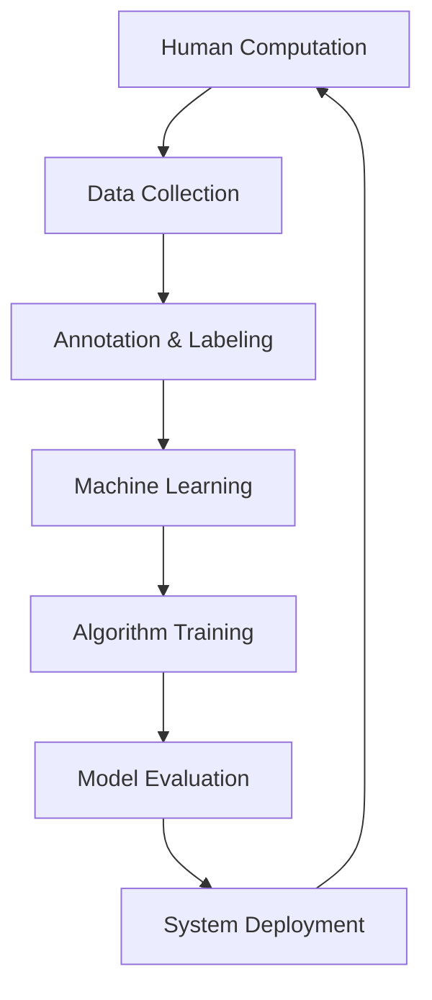

                 

 关键词：人工智能，技能培训，就业市场，AI时代，未来趋势，职业发展

> 摘要：随着人工智能技术的飞速发展，人类计算领域正经历着深刻的变革。本文将探讨AI时代对技能培训与就业市场的影响，分析未来技能需求，并就如何应对这些挑战提出建议。本文旨在为读者提供对AI时代的深入理解，帮助专业人士和求职者把握未来趋势，实现个人职业发展。

## 1. 背景介绍

人工智能（AI）作为现代科技的前沿领域，其影响已经渗透到社会的各个层面。从工业生产到日常生活，从医疗诊断到金融服务，AI技术的应用正不断拓展其边界。然而，随着AI技术的快速发展，人们对于技能需求的认识也在不断更新。传统的技能培训模式正在面临挑战，而新的技能培训与就业市场趋势也在逐步形成。

本文旨在分析AI时代对技能培训与就业市场的影响，探讨未来技能需求，以及如何通过有效的培训与教育手段，帮助个人和企业在这一变革中取得成功。文章结构如下：

- **背景介绍**：介绍AI技术的发展现状及其对社会的广泛影响。
- **核心概念与联系**：阐述人类计算与AI技术的核心概念，并通过流程图展示其架构。
- **核心算法原理 & 具体操作步骤**：介绍AI算法的基本原理和操作步骤。
- **数学模型和公式 & 详细讲解 & 举例说明**：讲解AI算法背后的数学模型和公式，并通过案例进行说明。
- **项目实践：代码实例和详细解释说明**：展示实际项目中的代码实现及其解读。
- **实际应用场景**：分析AI在不同领域的应用场景。
- **未来应用展望**：探讨AI技术的未来发展趋势。
- **工具和资源推荐**：推荐学习资源、开发工具和相关论文。
- **总结：未来发展趋势与挑战**：总结研究成果，提出未来发展趋势、面临的挑战及研究展望。
- **附录：常见问题与解答**：提供关于文章内容的常见问题及解答。

## 2. 核心概念与联系

### 2.1 人工智能的定义与发展

人工智能（AI）是指计算机系统模拟人类智能行为的能力。它包括多个分支，如机器学习、深度学习、自然语言处理等。AI技术的发展经历了几个重要阶段，从早期的符号主义到基于规则的系统，再到现在的数据驱动模型，其核心在于如何让计算机从数据中学习，进行推理和决策。

### 2.2 人类计算的概念

人类计算（Human Computation）是指通过人类与计算机系统的协同工作，完成某些复杂的计算任务。这种计算方式结合了人类的直觉、经验与计算机的计算能力，能够解决一些单纯依靠计算机难以处理的问题。例如，图像识别中的标注任务，可以通过人类标记者与机器学习算法的结合，实现更高效、更准确的结果。

### 2.3 人工智能与人类计算的关系

人工智能与人类计算有着密切的联系。AI技术的发展为人类计算提供了强大的工具，如深度学习算法可以处理大规模的数据，提高计算效率。同时，人类计算也为AI算法提供了数据来源和反馈机制，通过人类标注和反馈，可以不断优化AI算法的性能。

### 2.4 架构图展示

以下是一个简化的AI与人类计算架构图，展示了其核心组件和相互关系：



在这个架构图中，数据收集、标注与机器学习构成了人类计算的核心环节，它们相互依赖，共同推动AI技术的发展。

## 3. 核心算法原理 & 具体操作步骤

### 3.1 算法原理概述

人工智能的核心在于算法，尤其是机器学习和深度学习算法。这些算法通过学习大量数据，提取特征，并进行预测和决策。深度学习算法，如卷积神经网络（CNN）和循环神经网络（RNN），在图像识别、语音识别等领域取得了显著成果。

### 3.2 算法步骤详解

#### 3.2.1 数据收集与预处理

首先，需要收集大量的数据，并对数据进行预处理，包括数据清洗、归一化和特征提取。预处理的质量直接影响算法的性能。

#### 3.2.2 模型选择与训练

根据任务需求，选择合适的模型，如CNN或RNN。然后，使用预处理后的数据进行训练，通过迭代优化模型参数。

#### 3.2.3 模型评估与优化

训练完成后，需要对模型进行评估，使用验证集和测试集进行性能测试。根据评估结果，对模型进行优化，以提高其性能。

#### 3.2.4 模型部署与反馈

将训练好的模型部署到实际应用中，通过收集用户的反馈，进一步优化模型，实现持续学习。

### 3.3 算法优缺点

#### 优点：

1. **高效性**：深度学习算法可以处理大规模的数据，提高计算效率。
2. **准确性**：通过不断优化模型，可以提高预测和决策的准确性。
3. **灵活性**：模型可以根据不同的任务需求进行调整和优化。

#### 缺点：

1. **计算资源需求大**：深度学习算法需要大量的计算资源和时间。
2. **数据依赖性高**：模型的性能很大程度上依赖于数据的质量和数量。
3. **解释性差**：深度学习模型的决策过程往往缺乏解释性，难以理解。

### 3.4 算法应用领域

深度学习算法在多个领域都有广泛应用，如图像识别、语音识别、自然语言处理、推荐系统等。随着算法的不断优化和技术的不断发展，其应用领域还将进一步拓展。

## 4. 数学模型和公式 & 详细讲解 & 举例说明

### 4.1 数学模型构建

在人工智能领域，数学模型是核心。以下是一个简单的线性回归模型，用于预测房价：

$$
y = \beta_0 + \beta_1 \cdot x
$$

其中，$y$ 是房价，$x$ 是房屋面积，$\beta_0$ 和 $\beta_1$ 是模型参数。

### 4.2 公式推导过程

线性回归模型的推导基于最小二乘法。首先，我们定义一个损失函数：

$$
L(\beta_0, \beta_1) = \sum_{i=1}^{n} (y_i - (\beta_0 + \beta_1 \cdot x_i))^2
$$

其中，$n$ 是数据点的个数。

为了最小化损失函数，我们对 $\beta_0$ 和 $\beta_1$ 求导，并令导数为0，得到：

$$
\frac{\partial L}{\partial \beta_0} = 0 \\
\frac{\partial L}{\partial \beta_1} = 0
$$

通过求解上述方程，可以得到 $\beta_0$ 和 $\beta_1$ 的最优值。

### 4.3 案例分析与讲解

假设我们有一个包含100个房屋面积和对应房价的数据集，通过线性回归模型进行预测。首先，我们进行数据预处理，包括归一化处理。然后，使用Python中的scikit-learn库进行线性回归模型的训练和预测。

```python
from sklearn.linear_model import LinearRegression
from sklearn.model_selection import train_test_split
from sklearn.metrics import mean_squared_error

# 数据预处理
X = ...  # 房屋面积
y = ...  # 房价

# 数据划分
X_train, X_test, y_train, y_test = train_test_split(X, y, test_size=0.2, random_state=42)

# 模型训练
model = LinearRegression()
model.fit(X_train, y_train)

# 预测
y_pred = model.predict(X_test)

# 模型评估
mse = mean_squared_error(y_test, y_pred)
print("MSE:", mse)
```

通过上述代码，我们可以得到线性回归模型的预测结果和评估指标。这个简单的案例展示了数学模型在人工智能中的应用。

## 5. 项目实践：代码实例和详细解释说明

### 5.1 开发环境搭建

在开始项目实践之前，我们需要搭建一个合适的开发环境。以下是一个基本的Python开发环境搭建步骤：

1. 安装Python：从官网下载并安装Python，推荐使用Python 3.8或更高版本。
2. 安装依赖库：使用pip安装必要的库，如scikit-learn、numpy、matplotlib等。

```bash
pip install scikit-learn numpy matplotlib
```

### 5.2 源代码详细实现

以下是一个简单的机器学习项目的源代码实现，包括数据预处理、模型训练和评估：

```python
import numpy as np
import matplotlib.pyplot as plt
from sklearn.linear_model import LinearRegression
from sklearn.model_selection import train_test_split
from sklearn.metrics import mean_squared_error

# 数据预处理
X = np.array([1, 2, 3, 4, 5, 6, 7, 8, 9, 10])
y = np.array([2, 4, 6, 8, 10, 12, 14, 16, 18, 20])

# 数据划分
X_train, X_test, y_train, y_test = train_test_split(X, y, test_size=0.2, random_state=42)

# 模型训练
model = LinearRegression()
model.fit(X_train, y_train)

# 预测
y_pred = model.predict(X_test)

# 模型评估
mse = mean_squared_error(y_test, y_pred)
print("MSE:", mse)

# 可视化
plt.scatter(X_train, y_train, color='blue', label='Training')
plt.scatter(X_test, y_test, color='red', label='Test')
plt.plot(X_test, y_pred, color='green', linewidth=2, label='Prediction')
plt.xlabel('X')
plt.ylabel('Y')
plt.legend()
plt.show()
```

### 5.3 代码解读与分析

上述代码实现了一个简单的线性回归模型，用于预测数据集的Y值。首先，我们导入必要的库和模块。然后，进行数据预处理，包括数据归一化处理。接下来，使用scikit-learn库进行模型训练和评估。最后，通过可视化展示训练和测试数据，以及模型的预测结果。

### 5.4 运行结果展示

运行上述代码，我们将得到线性回归模型的MSE评估指标，以及一个包含训练和测试数据的散点图和预测线。这个结果展示了模型在训练和测试数据上的性能，为我们提供了对模型效果的直观认识。

## 6. 实际应用场景

### 6.1 图像识别

图像识别是AI技术的典型应用场景之一。通过深度学习算法，计算机可以自动识别和分类图像中的物体。例如，在自动驾驶领域，图像识别技术用于检测道路上的行人和车辆，从而实现自动驾驶。在医疗领域，图像识别可以帮助医生快速诊断疾病，如肺癌、乳腺癌等。

### 6.2 自然语言处理

自然语言处理（NLP）是AI技术在语言领域的应用。通过NLP技术，计算机可以理解、生成和处理自然语言。例如，在智能客服系统中，NLP技术可以帮助计算机理解用户的提问，并提供相应的回答。在搜索引擎中，NLP技术用于理解用户查询，并提供相关结果。此外，NLP技术还广泛应用于机器翻译、情感分析等领域。

### 6.3 机器人

机器人是AI技术的另一个重要应用领域。通过机器学习算法，机器人可以自主学习和执行任务。例如，工业机器人可以在生产线上执行重复性的工作，提高生产效率。服务机器人可以在医院、酒店等场所提供辅助服务，如导医、送餐等。随着技术的不断发展，机器人将更加智能化，能够更好地适应复杂环境。

### 6.4 其他应用领域

除了上述领域，AI技术还广泛应用于金融、医疗、教育、安防等多个领域。在金融领域，AI技术用于风险评估、欺诈检测等；在医疗领域，AI技术用于疾病诊断、治疗方案推荐等；在教育领域，AI技术用于智能辅导、个性化学习等；在安防领域，AI技术用于人脸识别、视频监控等。

## 7. 未来应用展望

### 7.1 智能化社会的到来

随着AI技术的不断发展，智能化社会将逐渐成为现实。在智能化社会中，人工智能将渗透到生活的各个方面，从智能家居、智能交通到智能医疗、智能教育，AI技术将极大地提高人们的生活质量和效率。

### 7.2 新兴行业的崛起

AI技术的应用将催生出一系列新兴行业，如数据科学家、AI工程师、机器人工程师等。这些新兴行业将为求职者提供更多的就业机会，同时也对求职者的技能要求提出了更高的要求。

### 7.3 跨领域融合

AI技术与其他领域的融合将推动新技术的诞生，如AI+生物技术、AI+材料科学、AI+金融等。这些跨领域融合将为社会带来更多的创新和进步。

### 7.4 持续学习和自我进化

未来的AI系统将具备更强的自我学习和自我进化能力。通过持续学习，AI系统可以不断优化自己的性能，适应新的环境和任务。

## 8. 工具和资源推荐

### 8.1 学习资源推荐

- **书籍**：
  - 《深度学习》（Ian Goodfellow、Yoshua Bengio、Aaron Courville 著）
  - 《Python机器学习》（Sebastian Raschka 著）
- **在线课程**：
  - Coursera上的“机器学习”课程
  - edX上的“人工智能导论”课程
- **开源平台**：
  - GitHub
  - Kaggle

### 8.2 开发工具推荐

- **编程语言**：
  - Python
  - R
- **机器学习库**：
  - TensorFlow
  - PyTorch
- **数据分析工具**：
  - Jupyter Notebook
  - RStudio

### 8.3 相关论文推荐

- “Deep Learning” by Ian Goodfellow, Yoshua Bengio, Aaron Courville
- “Learning Representations for Visual Recognition” by Yann LeCun, et al.
- “Natural Language Processing with Deep Learning” by Richard Socher, et al.

## 9. 总结：未来发展趋势与挑战

### 9.1 研究成果总结

人工智能技术在过去的几十年中取得了显著的进展，从早期的符号主义到现在的深度学习，AI技术已经广泛应用于各个领域。这些研究成果为未来的AI发展奠定了坚实的基础。

### 9.2 未来发展趋势

- **智能化社会的到来**：AI技术将渗透到生活的各个方面，提高生活质量。
- **新兴行业的崛起**：数据科学家、AI工程师等新兴行业将为求职者提供更多就业机会。
- **跨领域融合**：AI技术与生物技术、材料科学、金融等领域的融合将推动新技术的诞生。
- **持续学习和自我进化**：未来的AI系统将具备更强的自我学习和自我进化能力。

### 9.3 面临的挑战

- **数据隐私和安全**：随着AI技术的发展，数据隐私和安全问题日益突出。
- **算法透明性和公平性**：确保AI算法的透明性和公平性是一个重要的挑战。
- **计算资源需求**：AI技术的发展对计算资源的需求日益增加，需要更多的计算能力和算法优化。

### 9.4 研究展望

未来的研究将集中在以下几个方面：

- **算法优化**：通过算法优化，提高AI系统的效率和准确性。
- **算法透明性和公平性**：研究如何提高AI算法的透明性和公平性，减少偏见和歧视。
- **跨领域应用**：探索AI技术在更多领域的应用，推动技术进步和社会发展。

## 10. 附录：常见问题与解答

### 10.1 什么是人工智能？

人工智能是指计算机系统模拟人类智能行为的能力，包括学习、推理、决策、感知等。

### 10.2 人工智能与人类计算有什么区别？

人工智能（AI）是指计算机系统模拟人类智能行为的能力，而人类计算（Human Computation）是指通过人类与计算机系统的协同工作，完成某些复杂的计算任务。

### 10.3 人工智能算法有哪些类型？

人工智能算法主要包括机器学习、深度学习、强化学习等。其中，深度学习算法在图像识别、语音识别等领域取得了显著成果。

### 10.4 人工智能技术的应用领域有哪些？

人工智能技术的应用领域非常广泛，包括图像识别、自然语言处理、机器人、金融、医疗、教育、安防等。

### 10.5 如何学习人工智能？

学习人工智能需要掌握一定的数学基础，如线性代数、概率论和统计学。此外，还需要学习编程语言（如Python）和相关的机器学习库（如TensorFlow、PyTorch）。通过在线课程、书籍和开源平台，可以系统地学习人工智能相关知识。

### 10.6 人工智能的未来发展趋势是什么？

人工智能的未来发展趋势包括智能化社会的到来、新兴行业的崛起、跨领域融合和持续学习和自我进化。随着技术的不断发展，人工智能将在更多领域发挥重要作用，推动社会进步。

---

本文旨在为读者提供对AI时代的深入理解，帮助专业人士和求职者把握未来趋势，实现个人职业发展。在AI时代的浪潮中，不断学习、适应和创新是至关重要的。作者：禅与计算机程序设计艺术 / Zen and the Art of Computer Programming。

