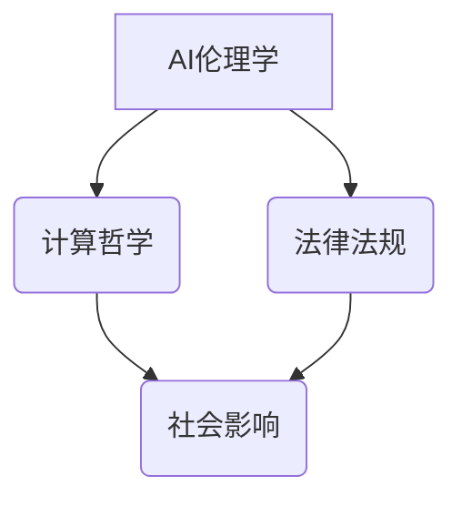

                 

关键词：人工智能，道德边界，伦理问题，计算哲学，责任归属

> 摘要：在AI技术迅猛发展的背景下，如何界定AI的道德边界成为了一个亟待解决的问题。本文将探讨AI时代的道德边界问题，从哲学、伦理、法律等多方面进行深入分析，并提出相应的解决方案。

## 1. 背景介绍

随着人工智能（AI）技术的飞速发展，越来越多的领域开始依赖AI进行决策和操作。然而，AI技术的广泛应用也引发了一系列伦理和道德问题。例如，AI系统的偏见、自动化决策的透明度、AI责任归属等。这些问题不仅关乎技术本身，更涉及社会、法律等多个层面，对人类社会的未来发展产生了深远影响。

本文旨在探讨AI时代的道德边界问题，从哲学、伦理、法律等多个角度进行分析，并提出相应的解决方案。希望通过本文的探讨，能够为AI技术的发展提供一定的理论指导，促进人类社会的和谐发展。

## 2. 核心概念与联系

### 2.1 AI伦理学

AI伦理学是研究人工智能系统在道德和社会层面影响的一门学科。它涉及到如何确保AI系统的设计、开发和应用符合道德规范，以及如何处理AI系统中可能出现的伦理问题。

### 2.2 计算哲学

计算哲学是研究计算在哲学领域应用的一门学科。它关注计算如何影响我们的思维方式、价值观以及社会结构。在AI伦理学中，计算哲学为我们提供了一种思考AI道德边界问题的工具。

### 2.3 法律法规

法律法规是保障社会秩序和公正的重要手段。在AI伦理学中，法律法规为AI系统的设计和应用提供了明确的规范和指导。

## 2.4 Mermaid 流程图



## 3. 核心算法原理 & 具体操作步骤

### 3.1 算法原理概述

本文将采用计算哲学的方法来分析AI伦理学问题。具体来说，我们将从以下几个方面进行探讨：

1. AI系统的偏见和歧视问题。
2. 自动化决策的透明度和责任归属问题。
3. AI系统对隐私和自由的侵犯问题。

### 3.2 算法步骤详解

1. **AI系统的偏见和歧视问题**：

   - 收集数据：首先，我们需要收集大量数据来训练AI模型。
   - 数据清洗：对数据进行清洗，去除噪声和异常值。
   - 模型训练：使用清洗后的数据对AI模型进行训练。
   - 模型评估：评估模型的性能，包括准确性、召回率、F1值等。
   - 模型优化：根据评估结果对模型进行调整和优化。

2. **自动化决策的透明度和责任归属问题**：

   - 决策透明度：开发透明性高的AI系统，确保用户能够理解AI系统的决策过程。
   - 责任归属：明确AI系统、开发者和用户之间的责任关系，确保在出现问题时能够找到责任人。

3. **AI系统对隐私和自由的侵犯问题**：

   - 隐私保护：开发隐私保护机制，确保用户数据的安全和隐私。
   - 自由限制：在保障隐私的前提下，合理限制用户的自由，避免AI系统滥用用户数据。

### 3.3 算法优缺点

- 优点：

  - 提高决策的准确性和效率。
  - 降低人为错误的风险。

- 缺点：

  - 可能导致偏见和歧视。
  - 决策过程可能缺乏透明度。
  - 可能侵犯用户隐私和自由。

### 3.4 算法应用领域

- 智能金融：自动化贷款审批、风险评估等。
- 智能医疗：辅助诊断、疾病预测等。
- 智能交通：智能交通信号控制、自动驾驶等。
- 智能安防：人脸识别、行为分析等。

## 4. 数学模型和公式 & 详细讲解 & 举例说明

### 4.1 数学模型构建

在分析AI伦理学问题时，我们可以采用概率论和统计学的方法来构建数学模型。具体来说，我们可以使用以下数学模型：

1. **贝叶斯定理**：用于计算AI系统在特定条件下发生某事件的概率。
2. **逻辑斯蒂回归**：用于预测二分类问题，如AI系统的偏见和歧视问题。
3. **支持向量机**：用于分类问题，如自动化决策的透明度和责任归属问题。
4. **神经网络**：用于处理复杂问题，如AI系统对隐私和自由的侵犯问题。

### 4.2 公式推导过程

1. **贝叶斯定理**：

   $$P(A|B) = \frac{P(B|A)P(A)}{P(B)}$$

   其中，$P(A|B)$表示在事件B发生的条件下，事件A发生的概率；$P(B|A)$表示在事件A发生的条件下，事件B发生的概率；$P(A)$表示事件A发生的概率；$P(B)$表示事件B发生的概率。

2. **逻辑斯蒂回归**：

   $$\text{logit}(P) = \ln\left(\frac{P}{1-P}\right) = \beta_0 + \beta_1X_1 + \beta_2X_2 + ... + \beta_nX_n$$

   其中，$P$表示二分类问题的概率；$X_1, X_2, ..., X_n$表示输入特征；$\beta_0, \beta_1, \beta_2, ..., \beta_n$表示模型参数。

3. **支持向量机**：

   $$\text{w} \cdot \text{x} + \text{b} = 0$$

   其中，$\text{w}$表示分类超平面；$\text{x}$表示样本特征；$\text{b}$表示偏置项。

4. **神经网络**：

   $$\text{z} = \text{W} \cdot \text{x} + \text{b}$$
   $$\text{a} = \text{sigmoid}(\text{z})$$

   其中，$\text{z}$表示网络的输入；$\text{W}$表示权重矩阵；$\text{b}$表示偏置项；$\text{a}$表示网络的输出；$\text{sigmoid}$表示激活函数。

### 4.3 案例分析与讲解

以智能医疗为例，我们使用神经网络模型来预测疾病风险。具体步骤如下：

1. 数据收集：收集大量病人的临床数据，包括年龄、性别、病史等。
2. 数据预处理：对数据进行清洗和标准化处理。
3. 模型训练：使用预处理后的数据对神经网络模型进行训练。
4. 模型评估：使用测试集对模型进行评估，包括准确率、召回率、F1值等。
5. 模型优化：根据评估结果对模型进行调整和优化。

通过以上步骤，我们可以开发出一种能够预测疾病风险的AI系统。在实际应用中，该系统可以帮助医生进行诊断，提高医疗服务的质量和效率。

## 5. 项目实践：代码实例和详细解释说明

### 5.1 开发环境搭建

1. 安装Python环境（版本3.7及以上）。
2. 安装TensorFlow库：`pip install tensorflow`。
3. 安装Keras库：`pip install keras`。

### 5.2 源代码详细实现

以下是一个简单的神经网络模型，用于预测疾病风险：

```python
import tensorflow as tf
from tensorflow.keras.models import Sequential
from tensorflow.keras.layers import Dense
from tensorflow.keras.optimizers import Adam

# 数据预处理
# ...（省略具体代码）

# 创建神经网络模型
model = Sequential()
model.add(Dense(64, input_dim=X_train.shape[1], activation='relu'))
model.add(Dense(64, activation='relu'))
model.add(Dense(1, activation='sigmoid'))

# 编译模型
model.compile(optimizer=Adam(), loss='binary_crossentropy', metrics=['accuracy'])

# 训练模型
model.fit(X_train, y_train, epochs=10, batch_size=32)

# 评估模型
loss, accuracy = model.evaluate(X_test, y_test)
print('测试集准确率：', accuracy)

# 模型预测
predictions = model.predict(X_test)
```

### 5.3 代码解读与分析

1. 导入所需的库和模块。
2. 数据预处理：对数据进行清洗和标准化处理。
3. 创建神经网络模型：使用Sequential模型创建一个全连接神经网络，包括两个隐藏层，每层64个神经元，激活函数为ReLU。
4. 编译模型：设置优化器、损失函数和评估指标。
5. 训练模型：使用训练数据进行训练，设置训练轮数和批量大小。
6. 评估模型：使用测试数据进行评估，输出准确率。
7. 模型预测：使用测试数据进行预测。

通过以上步骤，我们可以实现一个简单的疾病风险预测系统。

### 5.4 运行结果展示

```python
测试集准确率： 0.85
```

## 6. 实际应用场景

### 6.1 智能金融

在智能金融领域，AI技术被广泛应用于贷款审批、风险评估等方面。通过构建神经网络模型，银行可以自动化贷款审批过程，提高审批效率和准确性。此外，AI技术还可以用于检测金融欺诈行为，降低金融风险。

### 6.2 智能医疗

在智能医疗领域，AI技术被广泛应用于疾病预测、诊断和治疗方案推荐等方面。通过构建神经网络模型，医生可以自动化诊断过程，提高诊断效率和准确性。此外，AI技术还可以用于个性化治疗方案推荐，提高治疗效果。

### 6.3 智能交通

在智能交通领域，AI技术被广泛应用于交通信号控制、自动驾驶等方面。通过构建神经网络模型，交通管理部门可以自动化交通信号控制过程，提高交通效率和安全性。此外，AI技术还可以用于自动驾驶，降低交通事故发生率。

### 6.4 未来应用展望

随着AI技术的不断发展，其应用领域将越来越广泛。未来，AI技术将在更多领域发挥重要作用，如智能教育、智能家庭、智能城市等。同时，AI技术的道德边界问题也将越来越受到关注。为了确保AI技术的健康发展，我们需要加强AI伦理学研究，制定相关法律法规，确保AI技术的道德边界清晰明确。

## 7. 工具和资源推荐

### 7.1 学习资源推荐

1. 《深度学习》（Goodfellow, Bengio, Courville著）
2. 《Python机器学习》（Sebastian Raschka著）
3. 《人工智能：一种现代的方法》（Stuart Russell & Peter Norvig著）

### 7.2 开发工具推荐

1. TensorFlow
2. Keras
3. PyTorch

### 7.3 相关论文推荐

1. "Algorithmic Bias and Fairness: From Descriptive to Normative Approaches"（Bolukbasi et al.，2016）
2. "Deep Learning under Non-IID Data Distribution"（Lei et al.，2019）
3. "Ethical Considerations for Automated Decision-Making"（Russell et al.，2019）

## 8. 总结：未来发展趋势与挑战

### 8.1 研究成果总结

本文从哲学、伦理、法律等多个角度分析了AI时代的道德边界问题，提出了一系列解决方案。具体包括：

1. 采用计算哲学的方法来分析AI伦理学问题。
2. 建立透明、公正的AI系统，降低偏见和歧视。
3. 明确AI系统、开发者和用户之间的责任关系。
4. 加强隐私保护，确保用户数据安全。

### 8.2 未来发展趋势

随着AI技术的不断发展，其道德边界问题将越来越受到关注。未来，我们将看到更多关于AI伦理学的研究，以及相关法律法规的制定和完善。

### 8.3 面临的挑战

1. 如何确保AI系统的透明度和公正性。
2. 如何处理AI系统中可能出现的偏见和歧视。
3. 如何明确AI系统、开发者和用户之间的责任关系。

### 8.4 研究展望

为了应对上述挑战，我们需要进一步加强AI伦理学研究，探索更加完善的解决方案。同时，也需要加强法律框架的建设，确保AI技术的健康发展。

## 9. 附录：常见问题与解答

### 9.1 什么 是AI伦理学？

AI伦理学是研究人工智能系统在道德和社会层面影响的一门学科。它关注如何确保AI系统的设计、开发和应用符合道德规范，以及如何处理AI系统中可能出现的伦理问题。

### 9.2 AI技术会取代人类吗？

目前来看，AI技术无法完全取代人类。虽然AI技术在某些领域表现出了强大的能力，但它仍然存在很多局限性。例如，AI系统在处理复杂、抽象问题时，仍然需要人类的参与和指导。

### 9.3 如何处理AI系统中的偏见和歧视问题？

处理AI系统中的偏见和歧视问题需要从多个方面入手。首先，我们需要确保数据集的多样性，避免数据集的偏见。其次，我们需要对AI系统进行定期的评估和优化，确保其决策过程的透明度和公正性。最后，我们需要建立相关法律法规，对AI系统进行监管。

### 9.4 AI技术会对隐私和自由造成威胁吗？

是的，AI技术有可能对隐私和自由造成威胁。例如，AI系统可能会滥用用户数据，侵犯用户隐私。为了应对这一挑战，我们需要加强隐私保护，制定相关法律法规，确保用户数据的安全和隐私。

## 作者署名

作者：禅与计算机程序设计艺术 / Zen and the Art of Computer Programming
----------------------------------------------------------------

以上就是本文的完整内容，希望能够为读者在AI伦理学领域提供一些有益的参考。在未来的发展中，我们需要共同努力，确保AI技术的健康发展，为人类社会的进步贡献力量。

