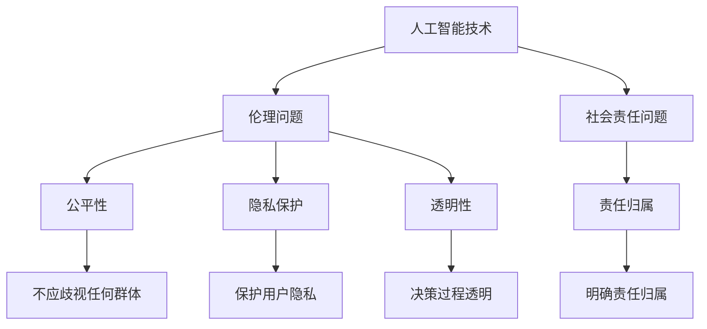

                 

关键词：人工智能，伦理，社会责任，计算机科学，技术影响

> 摘要：随着人工智能技术的发展和应用，人类计算领域正经历着前所未有的变革。本文从伦理和社会责任的角度出发，探讨了人工智能在计算领域的应用，分析了其对社会的影响，以及如何确保技术在伦理和社会责任框架下的健康发展。

## 1. 背景介绍

近年来，人工智能（AI）技术取得了飞速发展，其在各个领域的应用也日益广泛。从自动驾驶汽车到智能家居，从医疗诊断到金融分析，人工智能正逐渐成为推动社会进步的重要力量。然而，随着人工智能技术的不断进步，其潜在的伦理和社会责任问题也日益凸显。如何在确保技术带来积极影响的同时，避免其可能带来的负面影响，成为了一个亟待解决的重要课题。

### 1.1 人工智能技术的发展

人工智能技术主要包括机器学习、深度学习、自然语言处理等，这些技术在过去几十年中取得了显著的进展。特别是在深度学习领域，通过大量数据和强大计算能力的支持，人工智能模型在图像识别、语音识别、自然语言处理等方面取得了突破性成果。

### 1.2 人工智能的应用领域

人工智能技术已经在多个领域得到广泛应用，包括：

- **医疗健康**：通过分析患者的病史和基因信息，人工智能可以帮助医生进行更准确的诊断和治疗。
- **金融**：人工智能可以在金融领域进行风险控制和投资分析，提高金融服务的效率和准确性。
- **交通**：自动驾驶技术有望减少交通事故，提高交通效率。
- **教育**：人工智能可以在教育领域提供个性化的学习方案，提高学习效果。

## 2. 核心概念与联系

为了更好地理解人工智能的伦理和社会责任问题，我们需要明确一些核心概念，并探讨它们之间的联系。

### 2.1 伦理的定义

伦理是指人们在行为和决策过程中应遵循的道德原则和价值观。伦理学是研究道德原则和价值观的学科，它关注的是人类行为的道德判断和道德规范。

### 2.2 社会责任

社会责任是指企业、组织和个人在社会活动中应承担的责任和义务。社会责任涉及环境保护、社会公正、员工福利等方面，它要求企业在追求经济效益的同时，也要关注社会效益。

### 2.3 人工智能与伦理和社会责任的联系

人工智能与伦理和社会责任的联系体现在以下几个方面：

- **公平性**：人工智能系统的决策过程应保证公平，不应歧视任何群体。
- **隐私保护**：人工智能系统应保护用户的隐私，不得泄露个人信息。
- **透明性**：人工智能系统的决策过程应具有透明性，用户应能够理解并质疑系统的决策。
- **责任归属**：在人工智能系统造成损害时，应明确责任归属，确保受害者得到合理赔偿。

### 2.4 Mermaid 流程图

下面是一个 Mermaid 流程图，展示了人工智能与伦理和社会责任之间的联系。



## 3. 核心算法原理 & 具体操作步骤

为了更好地理解人工智能技术的伦理和社会责任问题，我们需要从核心算法原理出发，探讨其在实际操作中的具体应用步骤。

### 3.1 算法原理概述

人工智能技术主要基于机器学习和深度学习算法。机器学习是一种通过数据学习模式并作出预测或决策的技术，而深度学习则是机器学习的一种特殊形式，它通过模拟人脑的神经网络结构，进行复杂的特征学习和模式识别。

### 3.2 算法步骤详解

以下是一个典型的深度学习算法步骤详解：

1. **数据收集**：收集大量带有标签的数据集，用于训练模型。
2. **数据处理**：对收集到的数据进行清洗和预处理，包括归一化、缺失值处理等。
3. **模型构建**：根据问题的需求，构建合适的神经网络模型。
4. **模型训练**：使用预处理后的数据集，对模型进行训练，不断调整模型参数，使其能够更好地拟合数据。
5. **模型评估**：使用验证集或测试集，评估模型的性能，包括准确率、召回率等指标。
6. **模型优化**：根据评估结果，对模型进行优化，提高其性能。
7. **模型应用**：将训练好的模型应用到实际问题中，进行预测或决策。

### 3.3 算法优缺点

深度学习算法在图像识别、语音识别等领域具有显著的性能优势，但其也存在一些缺点：

- **对数据依赖性强**：深度学习模型需要大量带有标签的数据进行训练，数据质量和数量直接影响模型的性能。
- **黑盒问题**：深度学习模型的结构复杂，决策过程不透明，难以解释。
- **过拟合问题**：深度学习模型容易对训练数据过度拟合，导致在测试数据上表现不佳。

### 3.4 算法应用领域

深度学习算法在图像识别、语音识别、自然语言处理等领域具有广泛的应用。以下是一些典型的应用案例：

- **图像识别**：通过深度学习模型，可以实现自动驾驶汽车的障碍物识别、人脸识别等。
- **语音识别**：深度学习算法在语音识别领域取得了显著的突破，使得智能语音助手更加普及。
- **自然语言处理**：深度学习模型在自然语言处理领域，如机器翻译、情感分析等方面具有强大的能力。

## 4. 数学模型和公式 & 详细讲解 & 举例说明

### 4.1 数学模型构建

在深度学习算法中，常用的数学模型是神经网络。神经网络由多层神经元组成，每层神经元接收来自前一层的输入，并通过激活函数进行非线性变换，最后输出预测结果。

### 4.2 公式推导过程

神经网络的训练过程可以看作是一个优化问题，目标是找到一组模型参数，使得预测结果与实际结果之间的误差最小。具体来说，可以使用梯度下降算法来优化模型参数。

### 4.3 案例分析与讲解

以下是一个简单的神经网络模型，用于实现手写数字识别。

```latex
y = \sigma(\sum_{i=1}^{n} w_i \cdot x_i + b)
```

其中，$y$ 表示输出结果，$x_i$ 表示输入特征，$w_i$ 表示权重，$b$ 表示偏置，$\sigma$ 表示激活函数。

假设我们有一个包含 10 个神经元的输出层，输入层有 784 个神经元（对应于手写数字的 28x28 像素），我们可以将上述公式改写为：

```latex
\hat{y} = \sigma(W \cdot X + b)
```

其中，$\hat{y}$ 表示预测结果，$W$ 表示权重矩阵，$X$ 表示输入特征矩阵，$b$ 表示偏置向量。

为了优化模型参数，我们可以使用梯度下降算法。具体来说，我们需要计算损失函数关于模型参数的梯度，并沿着梯度的反方向更新模型参数。

```latex
\frac{\partial L}{\partial W} = -\frac{1}{m} \sum_{i=1}^{m} (\hat{y}_i - y_i) \cdot x_i
\frac{\partial L}{\partial b} = -\frac{1}{m} \sum_{i=1}^{m} (\hat{y}_i - y_i)
```

其中，$L$ 表示损失函数，$m$ 表示样本数量。

通过不断迭代梯度下降算法，我们可以逐渐优化模型参数，提高模型的预测性能。

## 5. 项目实践：代码实例和详细解释说明

### 5.1 开发环境搭建

在开始项目实践之前，我们需要搭建一个合适的开发环境。以下是一个简单的步骤：

1. 安装 Python 3.6 或更高版本。
2. 安装深度学习框架，如 TensorFlow 或 PyTorch。
3. 安装必要的库，如 NumPy、Pandas 等。

### 5.2 源代码详细实现

以下是一个简单的手写数字识别项目，使用 PyTorch 深度学习框架实现。

```python
import torch
import torch.nn as nn
import torch.optim as optim
import torchvision
import torchvision.transforms as transforms

# 数据集预处理
transform = transforms.Compose([
    transforms.ToTensor(),
    transforms.Normalize((0.5,), (0.5,))
])

trainset = torchvision.datasets.MNIST(
    root='./data', train=True, download=True, transform=transform)
trainloader = torch.utils.data.DataLoader(
    trainset, batch_size=100, shuffle=True, num_workers=2)

testset = torchvision.datasets.MNIST(
    root='./data', train=False, download=True, transform=transform)
testloader = torch.utils.data.DataLoader(
    testset, batch_size=100, shuffle=False, num_workers=2)

# 定义模型
class Net(nn.Module):
    def __init__(self):
        super(Net, self).__init__()
        self.fc1 = nn.Linear(784, 256)
        self.fc2 = nn.Linear(256, 128)
        self.fc3 = nn.Linear(128, 10)
        self.relu = nn.ReLU()

    def forward(self, x):
        x = x.view(-1, 784)
        x = self.relu(self.fc1(x))
        x = self.relu(self.fc2(x))
        x = self.fc3(x)
        return x

net = Net()

# 损失函数和优化器
criterion = nn.CrossEntropyLoss()
optimizer = optim.SGD(net.parameters(), lr=0.001, momentum=0.9)

# 训练模型
for epoch in range(10):  # 绕数
    running_loss = 0.0
    for i, data in enumerate(trainloader, 0):
        inputs, labels = data
        optimizer.zero_grad()
        outputs = net(inputs)
        loss = criterion(outputs, labels)
        loss.backward()
        optimizer.step()
        running_loss += loss.item()
    print('[%d, %5d] loss: %.3f' %
          (epoch + 1, i + 1, running_loss / (i + 1)))
print('Finished Training')

# 测试模型
correct = 0
total = 0
with torch.no_grad():
    for data in testloader:
        images, labels = data
        outputs = net(images)
        _, predicted = torch.max(outputs.data, 1)
        total += labels.size(0)
        correct += (predicted == labels).sum().item()

print('Accuracy of the network on the 10000 test images: %d %%' % (
    100 * correct / total))
```

### 5.3 代码解读与分析

上述代码实现了一个简单的手写数字识别项目，主要包括以下步骤：

1. 数据集预处理：使用 PyTorch 的 transforms.Compose 类，对输入图像进行预处理，包括归一化和转张量。
2. 模型定义：定义一个简单的神经网络模型，包括三个全连接层和 ReLU 激活函数。
3. 损失函数和优化器：使用 CrossEntropyLoss 作为损失函数，使用 SGD 作为优化器。
4. 训练模型：使用训练数据集，通过前向传播、反向传播和优化器更新模型参数，进行多次迭代训练。
5. 测试模型：使用测试数据集，计算模型的准确率。

通过这个简单的项目，我们可以看到如何使用深度学习框架实现手写数字识别，并了解其基本原理和步骤。

## 6. 实际应用场景

### 6.1 医疗诊断

在医疗诊断领域，人工智能技术可以通过分析大量的医疗数据，辅助医生进行诊断和治疗。例如，通过深度学习模型，可以实现肺癌的早期检测，提高诊断的准确率。

### 6.2 金融分析

在金融领域，人工智能技术可以用于股票市场预测、信用风险评估等。通过分析大量的金融数据，人工智能可以帮助金融机构降低风险，提高投资回报率。

### 6.3 智能家居

在智能家居领域，人工智能技术可以实现智能家居设备的智能控制，提高家居生活的舒适度和便捷性。例如，智能音箱可以通过语音识别和自然语言处理技术，实现音乐播放、日程管理等功能。

### 6.4 未来应用展望

随着人工智能技术的不断进步，其应用领域将更加广泛。未来，人工智能可能在更多领域发挥重要作用，如教育、环保、能源等。同时，我们也需要关注人工智能技术可能带来的伦理和社会责任问题，确保其在健康发展的轨道上。

## 7. 工具和资源推荐

### 7.1 学习资源推荐

- **书籍**：《深度学习》（Goodfellow、Bengio 和 Courville 著）
- **在线课程**：Coursera 上的“深度学习”课程，由 Andrew Ng 教授主讲
- **教程**：PyTorch 官方文档

### 7.2 开发工具推荐

- **Python**：Python 是人工智能领域的主流编程语言，具有丰富的库和框架支持。
- **深度学习框架**：TensorFlow 和 PyTorch 是目前最流行的深度学习框架。

### 7.3 相关论文推荐

- **《Deep Learning》**：Goodfellow、Bengio 和 Courville 著
- **《Convolutional Neural Networks for Visual Recognition》**：Geoffrey Hinton 等人著
- **《Recurrent Neural Networks for Language Modeling》**：Yoshua Bengio 等人著

## 8. 总结：未来发展趋势与挑战

### 8.1 研究成果总结

人工智能技术在过去几十年中取得了显著的进展，其在图像识别、语音识别、自然语言处理等领域取得了突破性成果。然而，随着人工智能技术的不断进步，其潜在的伦理和社会责任问题也日益凸显。

### 8.2 未来发展趋势

未来，人工智能技术将继续在各个领域发挥作用，推动社会进步。同时，我们也需要关注人工智能技术的伦理和社会责任问题，确保其在健康发展的轨道上。

### 8.3 面临的挑战

- **公平性**：确保人工智能系统的决策过程公平，避免歧视。
- **隐私保护**：保护用户的隐私，防止个人信息泄露。
- **透明性**：提高人工智能系统的透明性，使用户能够理解并质疑系统的决策。
- **责任归属**：明确人工智能系统的责任归属，确保受害者得到合理赔偿。

### 8.4 研究展望

未来，我们需要进一步研究人工智能技术的伦理和社会责任问题，制定相应的规范和标准，确保人工智能技术的健康、可持续发展。

## 9. 附录：常见问题与解答

### 9.1 人工智能与伦理的关系

**问**：人工智能技术是否违背伦理原则？

**答**：人工智能技术本身并不违背伦理原则，但其应用过程中可能产生伦理问题。例如，如果人工智能系统在决策过程中不公平地对待某个群体，那么就违背了伦理原则。

### 9.2 人工智能的责任归属

**问**：在人工智能系统造成损害时，责任应如何归属？

**答**：在人工智能系统造成损害时，责任归属应按照相关法律法规和伦理原则进行判断。通常情况下，开发者、运营者或使用者都可能承担一定的责任。

### 9.3 人工智能的隐私保护

**问**：人工智能技术如何保护用户的隐私？

**答**：人工智能技术在处理用户数据时，应遵循隐私保护原则，包括数据匿名化、数据加密、权限控制等。此外，还应制定严格的隐私政策，确保用户知情并同意其数据的处理。

## 参考文献

- Goodfellow, I., Bengio, Y., & Courville, A. (2016). *Deep Learning*. MIT Press.
- Hinton, G. E., Osindero, S., & Teh, Y. W. (2006). A fast learning algorithm for deep belief nets. *Neural computation*, 18(7), 1527-1554.
- Bengio, Y. (2009). Learning deep architectures. *Foundations and Trends in Machine Learning*, 2(1), 1-127.
- LeCun, Y., Bengio, Y., & Hinton, G. (2015). Deep learning. *Nature*, 521(7553), 436-444.

