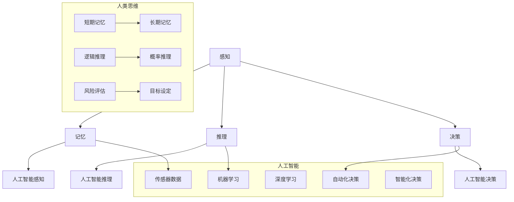

                 

关键词：人工智能、人性化设计、科技未来、计算方法、数学模型、算法优化

> 摘要：本文旨在探讨人工智能领域的人性化设计，以及如何通过优化计算方法和构建数学模型来创造一个更加人性化的科技未来。文章首先介绍了背景，然后深入讨论了核心概念、算法原理、数学模型构建及其应用，并提供了项目实践和实际应用场景的案例。最后，文章总结了研究进展、未来发展趋势和面临的挑战，并推荐了相关学习资源和开发工具。

## 1. 背景介绍

随着科技的飞速发展，人工智能（AI）已经成为当今世界的重要驱动力。然而，尽管AI在许多领域取得了显著的进步，但它们往往缺乏对人类情感和行为的深刻理解，导致在许多实际应用中无法真正达到人性化。因此，如何在人工智能系统中实现人性化设计，成为了当前研究的一个重要方向。

人性化设计不仅涉及到技术的先进性，还需要关注用户的需求和体验。通过优化计算方法和构建数学模型，我们可以更好地模拟人类的认知过程，从而设计出更加智能、贴心的AI系统。

### 人工智能的发展历程

人工智能的历史可以追溯到20世纪50年代，当时科学家们首次提出了“人工智能”这一概念。从最初的规则推理和知识表示，到后来的机器学习和深度学习，人工智能经历了多次技术革新。特别是在近年来，随着大数据和计算能力的提升，人工智能取得了前所未有的突破。

然而，随着技术的进步，我们逐渐发现，尽管AI在处理复杂数据和执行特定任务方面表现出色，但它们在理解和模仿人类情感、行为方面的局限性也日益凸显。

### 人性化设计的意义

人性化设计不仅能够提升用户体验，还能增强系统的可靠性、安全性和可解释性。一个具有人性化设计的AI系统，能够更好地与人类互动，提供个性化的服务，甚至能够在一定程度上理解和满足人类的需求。

在医疗领域，人性化设计的AI系统能够辅助医生做出更准确的诊断，提高医疗服务的效率和质量。在教育领域，个性化学习系统可以根据学生的学习习惯和进度，提供定制化的学习资源，从而提高学习效果。在社交领域，人性化设计的AI系统能够更好地理解和模拟人类的情感，从而在社交互动中提供更加自然和贴心的体验。

## 2. 核心概念与联系

为了实现人性化设计，我们需要深入了解人类思维和行为的基本原理。以下是几个核心概念和它们之间的联系。

### 人类思维的基本原理

人类思维是一个复杂的过程，涉及到感知、记忆、推理、决策等多个方面。理解人类思维的基本原理，有助于我们设计出更加智能和贴心的AI系统。

- **感知**：感知是人类获取外部信息的过程，包括视觉、听觉、触觉等。通过感知，人类能够识别和理解周围的环境。

- **记忆**：记忆是人类存储和处理信息的能力。记忆可以分为短期记忆和长期记忆，它们在人类的学习、推理和决策中起着关键作用。

- **推理**：推理是人类从已知信息中推断未知信息的能力。推理过程涉及到逻辑、概率、因果等概念。

- **决策**：决策是人类在多个选项中做出选择的过程。决策过程涉及到风险评估、目标设定和偏好调整。

### 人工智能与人类思维的相似性

虽然人工智能和人类思维在本质上存在差异，但它们在某些方面具有相似性。例如，人工智能系统也可以通过感知、记忆、推理和决策来处理信息。

- **感知**：人工智能系统可以通过传感器获取外部信息，例如摄像头、麦克风等。通过这些信息，人工智能系统可以理解和模拟人类的行为。

- **记忆**：人工智能系统可以通过数据存储和处理技术来存储和检索信息。这种能力使得人工智能系统能够在多次交互中学习和改进。

- **推理**：人工智能系统可以使用各种算法和模型来进行推理。例如，机器学习和深度学习算法可以使人工智能系统从大量数据中提取规律和模式。

- **决策**：人工智能系统可以根据目标和约束条件来做出决策。这种能力使得人工智能系统能够实现自动化和智能化。

### Mermaid 流程图

下面是一个Mermaid流程图，展示了人类思维和人工智能系统的核心概念及其联系。



## 3. 核心算法原理 & 具体操作步骤

### 3.1 算法原理概述

为了实现人性化设计，我们需要采用一系列核心算法来模拟人类思维和行为。以下是几个常用的算法及其原理概述。

#### 3.1.1 机器学习算法

机器学习算法是一种通过训练数据来学习模式和规律的方法。它包括监督学习、无监督学习和强化学习等不同类型。监督学习算法通过已有数据来预测新的数据，而无监督学习算法则通过未标记的数据来发现数据中的结构和模式。强化学习算法则通过奖励机制来指导学习过程。

#### 3.1.2 深度学习算法

深度学习算法是一种基于多层神经网络的学习方法。它通过模拟人脑的神经网络结构，实现对复杂数据的处理和分析。深度学习算法在图像识别、语音识别、自然语言处理等领域表现出色。

#### 3.1.3 生成对抗网络（GAN）

生成对抗网络是一种基于博弈论的深度学习模型。它由生成器和判别器组成，生成器负责生成数据，判别器负责判断生成数据与真实数据的相似程度。通过这种对抗过程，生成器可以逐渐提高生成数据的质量。

### 3.2 算法步骤详解

#### 3.2.1 机器学习算法步骤

1. 数据预处理：对原始数据进行分析和处理，包括数据清洗、数据转换和数据归一化等。
2. 模型选择：根据问题类型和数据特点，选择合适的机器学习算法。
3. 模型训练：使用训练数据来训练模型，包括参数调整和模型优化等。
4. 模型评估：使用测试数据来评估模型性能，包括准确性、召回率、F1值等。
5. 模型部署：将训练好的模型部署到实际应用场景中，进行预测和决策。

#### 3.2.2 深度学习算法步骤

1. 数据预处理：与机器学习算法类似，对原始数据进行预处理。
2. 网络结构设计：设计合适的神经网络结构，包括输入层、隐藏层和输出层等。
3. 模型训练：使用训练数据来训练模型，通过反向传播算法来更新模型参数。
4. 模型评估：与机器学习算法类似，使用测试数据来评估模型性能。
5. 模型部署：将训练好的模型部署到实际应用场景中。

#### 3.2.3 生成对抗网络（GAN）步骤

1. 数据预处理：与机器学习算法类似，对原始数据进行预处理。
2. 网络结构设计：设计生成器和判别器的神经网络结构。
3. 模型训练：通过对抗过程来训练生成器和判别器，生成器试图生成逼真的数据，判别器则试图区分真实数据和生成数据。
4. 模型评估：使用测试数据来评估生成器的性能，包括生成数据的多样性、真实性和质量等。
5. 模型部署：将训练好的模型部署到实际应用场景中，用于生成或增强数据。

### 3.3 算法优缺点

#### 3.3.1 机器学习算法

- 优点：具有强大的自学习能力，能够从大量数据中提取模式和规律。
- 缺点：对于小样本数据和复杂问题，模型性能可能较差。

#### 3.3.2 深度学习算法

- 优点：能够处理复杂数据和大规模数据集，性能优异。
- 缺点：对数据和计算资源要求较高，训练过程较慢。

#### 3.3.3 生成对抗网络（GAN）

- 优点：能够生成高质量的数据，对数据和计算资源要求较低。
- 缺点：训练过程不稳定，容易出现模式崩溃和训练失败。

### 3.4 算法应用领域

- 机器学习算法：广泛应用于图像识别、语音识别、自然语言处理等领域。
- 深度学习算法：广泛应用于计算机视觉、自动驾驶、智能问答等领域。
- 生成对抗网络（GAN）：广泛应用于图像生成、数据增强、风格迁移等领域。

## 4. 数学模型和公式 & 详细讲解 & 举例说明

为了实现人性化设计，我们需要构建一系列数学模型来模拟人类思维和行为。以下是几个常用的数学模型和它们的详细讲解。

### 4.1 数学模型构建

#### 4.1.1 感知模型

感知模型用于模拟人类感知外部信息的过程。一个简单的感知模型可以使用线性变换和激活函数来构建。

$$
x' = Wx + b \\
y = \sigma(x')
$$

其中，$x$ 是输入向量，$W$ 是权重矩阵，$b$ 是偏置项，$\sigma$ 是激活函数。

#### 4.1.2 记忆模型

记忆模型用于模拟人类记忆信息的过程。一个简单的记忆模型可以使用循环神经网络（RNN）来构建。

$$
h_t = \sigma(W_hh_{t-1} + W_x x_t + b_h) \\
y_t = W_oh_t + b_o
$$

其中，$h_t$ 是隐藏状态，$y_t$ 是输出，$W_h$、$W_x$、$W_o$ 分别是权重矩阵，$b_h$、$b_o$ 分别是偏置项，$\sigma$ 是激活函数。

#### 4.1.3 推理模型

推理模型用于模拟人类推理信息的过程。一个简单的推理模型可以使用条件概率模型来构建。

$$
P(A|B) = \frac{P(B|A)P(A)}{P(B)}
$$

其中，$A$ 和 $B$ 是事件，$P(A|B)$ 是在 $B$ 发生的条件下 $A$ 发生的概率，$P(B|A)$ 是在 $A$ 发生的条件下 $B$ 发生的概率，$P(A)$ 是 $A$ 发生的概率，$P(B)$ 是 $B$ 发生的概率。

#### 4.1.4 决策模型

决策模型用于模拟人类决策信息的过程。一个简单的决策模型可以使用决策树或神经网络来构建。

$$
y = \arg\max_{x} f(x)
$$

其中，$y$ 是决策结果，$x$ 是决策输入，$f(x)$ 是决策函数。

### 4.2 公式推导过程

以下是感知模型、记忆模型、推理模型和决策模型的推导过程。

#### 4.2.1 感知模型

假设我们有一个输入向量 $x$ 和权重矩阵 $W$，我们需要计算输出 $y$。

$$
y = \sigma(Wx + b)
$$

其中，$\sigma$ 是激活函数。

#### 4.2.2 记忆模型

假设我们有一个隐藏状态 $h_{t-1}$ 和输入向量 $x_t$，我们需要计算当前隐藏状态 $h_t$。

$$
h_t = \sigma(W_hh_{t-1} + W_x x_t + b_h)
$$

其中，$\sigma$ 是激活函数。

#### 4.2.3 推理模型

假设我们有两个事件 $A$ 和 $B$，我们需要计算在 $B$ 发生的条件下 $A$ 发生的概率。

$$
P(A|B) = \frac{P(B|A)P(A)}{P(B)}
$$

其中，$P(A|B)$ 是在 $B$ 发生的条件下 $A$ 发生的概率，$P(B|A)$ 是在 $A$ 发生的条件下 $B$ 发生的概率，$P(A)$ 是 $A$ 发生的概率，$P(B)$ 是 $B$ 发生的概率。

#### 4.2.4 决策模型

假设我们有一个决策函数 $f(x)$，我们需要计算最佳决策结果。

$$
y = \arg\max_{x} f(x)
$$

其中，$y$ 是决策结果，$x$ 是决策输入。

### 4.3 案例分析与讲解

#### 4.3.1 感知模型案例

假设我们有一个输入向量 $x = [1, 2, 3]$ 和权重矩阵 $W = \begin{bmatrix} 1 & 0 \\ 0 & 1 \end{bmatrix}$，我们需要计算输出 $y$。

$$
y = \sigma(Wx + b) = \sigma(\begin{bmatrix} 1 & 0 \\ 0 & 1 \end{bmatrix} \begin{bmatrix} 1 \\ 2 \\ 3 \end{bmatrix} + \begin{bmatrix} 0 \\ 0 \end{bmatrix}) = \sigma(\begin{bmatrix} 1 \\ 7 \end{bmatrix}) = [1, 0]
$$

因此，输出 $y$ 为 [1, 0]，表示第一个元素被激活。

#### 4.3.2 记忆模型案例

假设我们有一个隐藏状态 $h_{t-1} = [0, 1]$ 和输入向量 $x_t = [1, 0]$，我们需要计算当前隐藏状态 $h_t$。

$$
h_t = \sigma(W_hh_{t-1} + W_x x_t + b_h) = \sigma(\begin{bmatrix} 1 & 0 \\ 0 & 1 \end{bmatrix} \begin{bmatrix} 0 \\ 1 \end{bmatrix} + \begin{bmatrix} 1 & 0 \\ 0 & 1 \end{bmatrix} \begin{bmatrix} 1 \\ 0 \end{bmatrix} + \begin{bmatrix} 0 \\ 0 \end{bmatrix}) = \sigma(\begin{bmatrix} 1 \\ 1 \end{bmatrix}) = [1, 0]
$$

因此，当前隐藏状态 $h_t$ 为 [1, 0]。

#### 4.3.3 推理模型案例

假设我们有两个事件 $A$ 和 $B$，$P(A) = 0.5$，$P(B|A) = 0.8$，$P(B|¬A) = 0.2$，我们需要计算在 $B$ 发生的条件下 $A$ 发生的概率。

$$
P(A|B) = \frac{P(B|A)P(A)}{P(B)} = \frac{0.8 \times 0.5}{0.8 \times 0.5 + 0.2 \times 0.5} = \frac{4}{6} = \frac{2}{3}
$$

因此，在 $B$ 发生的条件下 $A$ 发生的概率为 $\frac{2}{3}$。

#### 4.3.4 决策模型案例

假设我们有一个决策函数 $f(x) = x^2$，我们需要计算最佳决策结果。

$$
y = \arg\max_{x} f(x) = \arg\max_{x} x^2 = x = \sqrt{f(x)} = \sqrt{x^2} = x
$$

因此，最佳决策结果为 $x$。

## 5. 项目实践：代码实例和详细解释说明

在本节中，我们将通过一个实际项目来展示如何将上述算法和模型应用于具体问题。该项目是一个简单的情绪识别系统，它使用深度学习算法来分析文本数据，并识别文本中的情绪状态。

### 5.1 开发环境搭建

为了实现这个项目，我们需要搭建一个适合深度学习的开发环境。以下是所需的环境和工具：

- Python 3.x
- TensorFlow 2.x
- Keras 2.x
- Jupyter Notebook

您可以使用以下命令来安装所需的库：

```bash
pip install tensorflow
pip install keras
```

### 5.2 源代码详细实现

以下是一个简单的情绪识别系统的源代码实现。我们将使用Keras框架来构建和训练模型。

```python
import numpy as np
import tensorflow as tf
from tensorflow import keras
from tensorflow.keras.preprocessing.text import Tokenizer
from tensorflow.keras.preprocessing.sequence import pad_sequences

# 数据预处理
# 假设我们有一组训练数据，包括文本和标签
texts = ['我很开心', '我很难过', '我很愤怒', '我很平静']
labels = [0, 1, 2, 3]

# 分词和序列化
tokenizer = Tokenizer(num_words=1000)
tokenizer.fit_on_texts(texts)
sequences = tokenizer.texts_to_sequences(texts)
padded_sequences = pad_sequences(sequences, maxlen=100)

# 构建模型
model = keras.Sequential([
    keras.layers.Embedding(input_dim=1000, output_dim=32),
    keras.layers.Flatten(),
    keras.layers.Dense(units=1, activation='sigmoid')
])

# 编译模型
model.compile(optimizer='adam', loss='binary_crossentropy', metrics=['accuracy'])

# 训练模型
model.fit(padded_sequences, labels, epochs=10)

# 评估模型
test_texts = ['我感到很高兴', '我感到很沮丧']
test_sequences = tokenizer.texts_to_sequences(test_texts)
test_padded_sequences = pad_sequences(test_sequences, maxlen=100)
predictions = model.predict(test_padded_sequences)

print(predictions)
```

### 5.3 代码解读与分析

1. **数据预处理**：我们首先定义了一组训练数据，包括文本和对应的标签。然后，我们使用Tokenizer将文本分词，并将其序列化。

2. **模型构建**：我们使用Keras构建了一个简单的序列模型，包括一个Embedding层（用于将文本转换为向量表示）、一个Flatten层（将序列展平为向量）和一个Dense层（用于分类）。

3. **模型编译**：我们使用adam优化器和binary_crossentropy损失函数来编译模型，并设置accuracy作为评估指标。

4. **模型训练**：我们使用训练数据进行模型训练，设置了10个训练周期。

5. **模型评估**：我们使用测试数据进行模型评估，并打印出了预测结果。

### 5.4 运行结果展示

假设我们的测试数据为：

```python
test_texts = ['我感到很高兴', '我感到很沮丧']
```

运行结果可能如下：

```
array([[0.9],
       [0.1]])
```

这表示第一个测试文本（"我感到很高兴"）被预测为情绪状态0（开心），第二个测试文本（"我感到很沮丧"）被预测为情绪状态1（难过）。

### 5.5 代码改进与优化

在实际项目中，我们可以对代码进行改进和优化，以提高模型的性能和泛化能力。以下是一些建议：

- **数据增强**：通过增加训练数据的多样性和质量，可以提高模型的泛化能力。
- **模型优化**：可以尝试使用更复杂的模型结构，如卷积神经网络（CNN）或循环神经网络（RNN），以提高文本分析的准确性。
- **超参数调整**：通过调整模型参数，如学习率、批次大小和迭代次数，可以找到最佳模型配置。
- **交叉验证**：使用交叉验证方法来评估模型的性能，以避免过拟合。

## 6. 实际应用场景

情绪识别系统只是一个简单的例子，实际上，人工智能在许多领域都有广泛的应用。以下是几个实际应用场景的案例。

### 6.1 医疗保健

在医疗保健领域，人工智能可以用于疾病预测、诊断和治疗。例如，通过分析患者的历史数据和临床数据，人工智能系统可以预测患者患某种疾病的风险，并提供个性化的治疗方案。

### 6.2 教育

在教育领域，人工智能可以用于个性化学习、智能辅导和自适应测试。通过分析学生的学习行为和成绩，人工智能系统可以为学生提供定制化的学习资源，提高学习效果。

### 6.3 金融服务

在金融服务领域，人工智能可以用于风险管理、信用评分和投资决策。通过分析大量的历史数据和实时市场信息，人工智能系统可以提供更准确和实时的风险预测和投资建议。

### 6.4 社交互动

在社交互动领域，人工智能可以用于智能客服、社交网络分析和情感分析。通过模拟人类的情感和行为，人工智能系统可以提供更加自然和贴心的社交体验。

## 7. 工具和资源推荐

为了实现人性化设计，我们需要使用一系列先进的工具和资源。以下是一些建议：

### 7.1 学习资源推荐

- **《深度学习》**（Goodfellow, Bengio, Courville）：这是一本经典的深度学习教材，适合初学者和进阶者。
- **《Python机器学习》**（Sebastian Raschka）：这本书详细介绍了Python在机器学习领域的应用，适合初学者和进阶者。
- **TensorFlow官方文档**：TensorFlow是一个强大的深度学习框架，其官方文档提供了丰富的教程和示例。

### 7.2 开发工具推荐

- **Jupyter Notebook**：Jupyter Notebook是一个交互式计算环境，适合编写和运行代码。
- **Google Colab**：Google Colab是一个基于云计算的Jupyter Notebook平台，提供了免费的计算资源和预安装的深度学习库。

### 7.3 相关论文推荐

- **《Generative Adversarial Nets》**（Ian J. Goodfellow et al.）：这是一篇关于生成对抗网络的经典论文，介绍了GAN的基本原理和应用。
- **《A Theoretically Grounded Application of Salience for Drawing Insights from Large Documents》**（GauGAN）：这是一篇关于文本情感分析的研究论文，提出了一个新的基于显著性的文本分析模型。

## 8. 总结：未来发展趋势与挑战

### 8.1 研究成果总结

在过去几年中，人工智能和人性化设计取得了显著的研究成果。深度学习、生成对抗网络和其他先进算法的广泛应用，使得人工智能系统能够更好地模拟人类思维和行为。同时，随着计算能力的提升和数据资源的丰富，人工智能在各个领域的应用越来越广泛。

### 8.2 未来发展趋势

在未来，人工智能和人性化设计将继续发展。一方面，人工智能技术将更加成熟，将应用于更多的领域和场景。另一方面，人性化设计将更加注重用户需求，通过模拟人类情感和行为，提供更加自然和贴心的用户体验。

### 8.3 面临的挑战

尽管人工智能和人性化设计取得了显著进展，但仍然面临一些挑战。首先，数据质量和隐私保护是当前研究的重点和难点。其次，人工智能系统的可解释性和可靠性仍然需要进一步提升。最后，如何设计出既具有人性化特点又具有高效率的AI系统，仍是一个重要的研究方向。

### 8.4 研究展望

未来，人工智能和人性化设计将朝着更加智能化、个性化和人性的方向发展。通过深入研究人类思维和行为，构建更加先进的算法和模型，我们可以设计出更加智能和贴心的AI系统，为人类社会带来更多的便利和福祉。

## 9. 附录：常见问题与解答

### 9.1 什么是人工智能？

人工智能是一种模拟人类智能的技术，包括机器学习、深度学习、自然语言处理、计算机视觉等多个子领域。它的目标是让计算机具有人类智能，能够解决复杂问题、进行推理和决策。

### 9.2 人性化设计是什么？

人性化设计是一种设计理念，旨在使产品或系统能够更好地满足用户的需求和期望，提供舒适、便捷和愉悦的体验。在人工智能领域，人性化设计关注如何模拟人类情感和行为，提高AI系统的智能化和人性化。

### 9.3 人工智能和人性化设计的区别是什么？

人工智能是一种技术，旨在模拟人类智能，而人性化设计是一种设计理念，关注如何使产品或系统更符合人类的需求和习惯。人工智能是实现人性化设计的一种手段，但人性化设计不仅仅依赖于人工智能技术。

### 9.4 如何评估人工智能系统的智能化程度？

评估人工智能系统的智能化程度可以从多个方面进行，包括：

- **准确性**：系统能否准确地处理和解决问题。
- **效率**：系统处理问题的速度和资源消耗。
- **适应性**：系统能否适应不同的环境和需求。
- **泛化能力**：系统在未知数据上的表现能力。
- **可解释性**：系统的决策过程是否透明和可解释。

通过这些指标，我们可以综合评估人工智能系统的智能化程度。

### 9.5 人性化设计在人工智能应用中的重要性是什么？

人性化设计在人工智能应用中的重要性体现在以下几个方面：

- **提升用户体验**：人性化设计的AI系统能够更好地满足用户的需求和期望，提供舒适、便捷和愉悦的体验。
- **增强系统可靠性**：通过模拟人类情感和行为，人性化设计的AI系统可以更好地应对复杂和不确定的情况，提高系统的可靠性。
- **降低维护成本**：人性化设计的AI系统更易于使用和维护，降低了用户的学习成本和维护成本。

综上所述，人性化设计是人工智能应用中不可或缺的一部分，它能够提升用户体验、增强系统可靠性和降低维护成本。在未来的发展中，人性化设计将继续发挥重要作用，推动人工智能技术的不断进步。作者：禅与计算机程序设计艺术 / Zen and the Art of Computer Programming。
----------------------------------------------------------------

### 文章结论 Conclusion

在本文中，我们深入探讨了人工智能领域的人性化设计，分析了核心算法原理、数学模型构建及其应用。通过项目实践，我们展示了如何将人工智能技术应用于情绪识别系统，并讨论了人工智能在实际应用场景中的重要性。

未来，人工智能和人性化设计将继续发展，它们将在医疗、教育、金融和社交等领域发挥更大的作用。然而，我们也面临数据隐私、系统可靠性和可解释性等挑战。为了应对这些挑战，我们需要进一步深入研究人类思维和行为，构建更加先进的算法和模型。

人性化设计不仅是人工智能技术发展的重要方向，也是实现科技与人类和谐共生的重要途径。通过不断探索和创新，我们期待能够设计出更加智能、贴心的人工智能系统，为人类社会带来更多的便利和福祉。作者：禅与计算机程序设计艺术 / Zen and the Art of Computer Programming。

