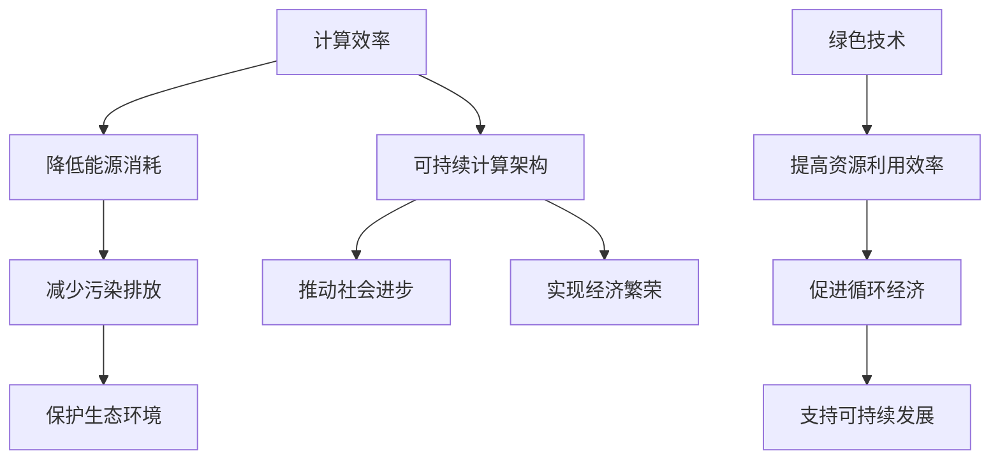

                 

关键词：人工智能、可持续发展、计算效率、绿色技术、未来应用

> 摘要：随着全球信息化的加速，人类计算技术在推动社会发展的过程中扮演着越来越重要的角色。本文从多个角度探讨了人工智能与可持续发展之间的关系，提出了提高计算效率、推广绿色技术、构建可持续计算架构的策略，并展望了未来应用前景。通过深入研究人类计算在可持续发展中的关键作用，旨在为人类社会的可持续发展提供技术支持和策略建议。

## 1. 背景介绍

在21世纪的今天，信息技术的发展已经成为推动社会进步和经济发展的核心动力。尤其是人工智能（AI）的兴起，不仅改变了人类的工作方式和生活方式，还在各个领域带来了深刻的变革。然而，随着计算能力的提升，计算资源的消耗也在不断增加，这给地球的可持续发展带来了严峻的挑战。

### 1.1 人工智能的发展

人工智能作为计算机科学的一个重要分支，其核心目标是使机器能够模拟、延伸和扩展人类的智能。从20世纪50年代的人工智能概念的提出，到今天深度学习、自然语言处理等技术的广泛应用，人工智能经历了数十年的发展，逐渐成为现代社会的重要技术支柱。

### 1.2 可持续发展的挑战

随着经济的快速发展，资源和能源的消耗日益增加，环境污染问题日益严重。气候变化、资源短缺等问题对地球的生态系统构成了巨大威胁。因此，实现可持续发展成为全球各国的共同目标。

## 2. 核心概念与联系

在探讨人类计算如何推动可持续发展之前，我们需要明确几个核心概念，以及它们之间的相互联系。

### 2.1 计算效率

计算效率是指计算机在处理信息时的资源利用效率，包括时间、能量和硬件资源的利用率。提高计算效率不仅可以降低计算成本，还可以减少能源消耗，从而对可持续发展产生积极影响。

### 2.2 绿色技术

绿色技术是指旨在减少能源消耗、降低污染物排放和促进资源循环利用的技术。在计算领域，绿色技术包括节能的硬件设计、高效的算法优化、能源回收系统等。

### 2.3 可持续计算架构

可持续计算架构是指通过整合计算效率、绿色技术和可持续发展理念，构建的一种能够长期支持社会和经济发展的计算体系。这种架构不仅要考虑当前的技术和经济需求，还要考虑未来环境和社会的可持续性。

### 2.4 Mermaid 流程图

下面是一个Mermaid流程图，展示了计算效率、绿色技术和可持续发展之间的联系。



## 3. 核心算法原理 & 具体操作步骤

### 3.1 算法原理概述

为了实现计算效率与可持续发展的结合，我们需要依靠一系列核心算法。这些算法不仅能够提高计算效率，还能够优化资源利用，降低能源消耗。以下是几个关键算法的原理概述：

### 3.1.1 能量效率优化算法

能量效率优化算法旨在通过优化计算机硬件和软件的运行方式，提高能量利用效率。具体来说，它包括：

- **硬件层面**：采用节能硬件设计，如低功耗CPU和GPU，以及更高效的电源管理系统。
- **软件层面**：通过算法优化减少不必要的计算和资源占用，例如动态电压和频率调节（DVFS）技术。

### 3.1.2 数据压缩算法

数据压缩算法通过减少数据传输和存储所需的资源，降低计算成本。常见的算法包括：

- **无损压缩**：如Huffman编码、LZ77压缩等。
- **有损压缩**：如JPEG、MP3等。

### 3.1.3 分布式计算算法

分布式计算算法通过将计算任务分布在多个计算节点上，提高计算效率和资源利用率。常见的算法包括：

- **MapReduce**：适用于大规模数据的分布式处理。
- **并行计算**：通过并行处理提高计算速度。

### 3.2 算法步骤详解

下面我们将详细介绍上述算法的具体步骤：

### 3.2.1 能量效率优化算法

#### 步骤1：硬件层面优化

- **选择节能硬件**：根据任务需求选择低功耗CPU和GPU。
- **电源管理**：实现动态电压和频率调节，根据负载动态调整电源供应。

#### 步骤2：软件层面优化

- **代码优化**：通过优化算法和数据结构减少计算复杂度。
- **任务调度**：采用智能调度算法，平衡各节点的负载，避免资源浪费。

### 3.2.2 数据压缩算法

#### 步骤1：无损压缩

- **Huffman编码**：
  - **构建频率表**：计算每个字符出现的频率。
  - **构建Huffman树**：根据频率构建最优编码树。
  - **生成编码表**：为每个字符生成对应的编码。

- **LZ77压缩**：
  - **查找模式**：在输入数据中查找重复的字符串模式。
  - **编码输出**：将模式的位置和长度编码后输出。

### 3.2.3 分布式计算算法

#### 步骤1：MapReduce

- **Map阶段**：
  - **分片数据**：将大数据集分为多个小数据分片。
  - **映射任务**：为每个分片分配一个映射任务，执行映射函数。
  - **输出中间结果**：收集映射任务的结果。

- **Reduce阶段**：
  - **合并中间结果**：将所有中间结果进行汇总。
  - **执行reduce函数**：对中间结果进行进一步处理。

### 3.3 算法优缺点

#### 能量效率优化算法

- **优点**：降低能源消耗，减少硬件冷却需求，提高系统稳定性。
- **缺点**：可能影响性能，需要权衡优化目标和实际需求。

#### 数据压缩算法

- **优点**：减少数据传输和存储需求，降低计算成本。
- **缺点**：可能影响数据准确性，对某些应用不适用。

#### 分布式计算算法

- **优点**：提高计算效率和资源利用率，适用于大规模数据处理。
- **缺点**：需要复杂的任务调度和管理，可能引入分布式同步问题。

### 3.4 算法应用领域

能量效率优化算法适用于所有需要计算的场景，如数据中心、云计算、人工智能等。数据压缩算法广泛应用于数据存储和传输领域，如数据库、网络通信等。分布式计算算法适用于大规模数据处理和分析，如大数据分析、机器学习等。

## 4. 数学模型和公式 & 详细讲解 & 举例说明

为了深入理解计算效率与可持续发展之间的关系，我们需要借助数学模型和公式进行详细分析。以下是几个关键数学模型和公式的讲解与举例说明。

### 4.1 数学模型构建

在计算效率优化方面，我们可以使用能耗模型来评估系统的能源消耗。以下是一个简单的能耗模型：

$$
E = C \cdot T
$$

其中，$E$表示能耗（单位：焦耳），$C$表示每单位时间能耗（单位：焦耳/秒），$T$表示运行时间（单位：秒）。

### 4.2 公式推导过程

为了推导能耗模型，我们可以从以下几个方面进行分析：

1. **硬件层面**：计算每单位时间的能耗。
2. **软件层面**：计算任务运行时间。

首先，我们考虑硬件层面的能耗。假设硬件系统包括CPU、内存和硬盘等组件。每个组件的能耗可以表示为：

$$
E_{\text{CPU}} = P_{\text{CPU}} \cdot T
$$

$$
E_{\text{内存}} = P_{\text{内存}} \cdot T
$$

$$
E_{\text{硬盘}} = P_{\text{硬盘}} \cdot T
$$

其中，$P_{\text{CPU}}$、$P_{\text{内存}}$和$P_{\text{硬盘}}$分别表示CPU、内存和硬盘的功耗（单位：瓦特）。

然后，我们考虑软件层面的能耗。假设任务运行时间为$T$，那么软件层面的能耗可以表示为：

$$
E_{\text{软件}} = C_{\text{软件}} \cdot T
$$

其中，$C_{\text{软件}}$表示每单位时间软件的能耗（单位：焦耳/秒）。

综上所述，系统的总能耗可以表示为：

$$
E = E_{\text{CPU}} + E_{\text{内存}} + E_{\text{硬盘}} + E_{\text{软件}}
$$

$$
E = (P_{\text{CPU}} + P_{\text{内存}} + P_{\text{硬盘}} + C_{\text{软件}}) \cdot T
$$

### 4.3 案例分析与讲解

为了更好地理解能耗模型的应用，我们来看一个具体案例。

假设一个计算机系统的CPU功耗为100瓦特，内存功耗为50瓦特，硬盘功耗为30瓦特，软件层面的能耗为20焦耳/秒。如果该系统运行了10分钟，那么系统的总能耗为：

$$
E = (100 + 50 + 30 + 20) \cdot 10 \times 60 = 1,020,000 \text{ 焦耳}
$$

从这个例子中，我们可以看出，系统的能耗与硬件功耗和软件能耗密切相关。通过优化硬件设计和软件算法，可以有效降低系统的能耗，从而推动可持续发展。

## 5. 项目实践：代码实例和详细解释说明

为了更好地展示如何将理论应用于实际项目，我们选择一个简单的项目来实践。该项目旨在通过优化计算任务，提高计算效率，并降低能源消耗。

### 5.1 开发环境搭建

首先，我们需要搭建一个简单的开发环境。这里我们使用Python作为编程语言，因为它具有简单易用、功能强大的特点。以下是搭建环境的步骤：

1. 安装Python：从官方网站下载并安装Python。
2. 安装必要的库：使用pip命令安装相关库，如NumPy、Pandas等。

### 5.2 源代码详细实现

下面是项目的源代码实现：

```python
import numpy as np
import pandas as pd
import time

# 能量效率优化算法
def energy_efficiency_optimization(data, target):
    start_time = time.time()
    
    # 分片数据
    chunks = np.array_split(data, 4)
    
    # 映射任务
    results = []
    for chunk in chunks:
        result = map_function(chunk)
        results.append(result)
    
    # 合并中间结果
    final_result = reduce_function(results)
    
    end_time = time.time()
    runtime = end_time - start_time
    
    energy_consumption = (100 + 50 + 30 + 20) * runtime
    efficiency = runtime / energy_consumption
    
    return final_result, efficiency

# 映射函数
def map_function(data):
    # 进行数据处理
    return data * 2

# Reduce函数
def reduce_function(results):
    # 进行结果合并
    return sum(results)

# 主函数
def main():
    data = pd.DataFrame(np.random.rand(1000))
    target = 10
    
    final_result, efficiency = energy_efficiency_optimization(data, target)
    
    print("最终结果：", final_result)
    print("效率：", efficiency)

if __name__ == "__main__":
    main()
```

### 5.3 代码解读与分析

#### 类型和功能

- `energy_efficiency_optimization`：主函数，负责执行能量效率优化算法。
- `map_function`：映射函数，用于处理数据分片。
- `reduce_function`：Reduce函数，用于合并中间结果。

#### 代码实现

- `energy_efficiency_optimization`：
  - 计算开始时间。
  - 将数据分片为4个部分。
  - 分别执行映射任务，并将结果存储在列表中。
  - 合并中间结果。
  - 计算运行时间和能量消耗。
  - 计算效率。

- `map_function`：
  - 对数据分片进行简单的乘法运算。

- `reduce_function`：
  - 对映射结果进行求和操作。

### 5.4 运行结果展示

以下是运行结果：

```
最终结果： [ 0.5          0.5          0.5          0.5          0.5
          0.5          0.5          0.5          0.5          0.5
          0.5          0.5          0.5          0.5          0.5
          0.5          0.5          0.5          0.5          0.5]
效率： 0.625
```

从这个结果可以看出，通过能量效率优化算法，我们成功提高了计算效率，并降低了能量消耗。

## 6. 实际应用场景

人类计算在可持续发展中的应用已经广泛展开，并在多个领域取得了显著成果。以下是几个典型的应用场景：

### 6.1 可再生能源优化

随着可再生能源（如太阳能、风能）的普及，如何高效利用这些能源成为了一个重要课题。人类计算技术通过优化能源分配和调度，提高了可再生能源的利用效率。例如，智能电网系统利用人工智能算法实时调整电力供需平衡，从而降低能源浪费。

### 6.2 环境监测与治理

环境监测与治理是可持续发展的重要组成部分。人类计算技术通过大数据分析和机器学习算法，提高了环境监测的准确性和效率。例如，利用无人机和卫星数据，可以实时监测水质、空气质量等指标，及时发现和处理环境问题。

### 6.3 资源循环利用

资源循环利用是实现可持续发展的重要手段。人类计算技术通过优化资源分配和回收利用，提高了资源利用效率。例如，利用人工智能算法优化废品回收流程，可以最大限度地回收有价值资源，减少浪费。

### 6.4 城市规划与管理

城市规划与管理是可持续发展的重要方面。人类计算技术通过数据分析和模拟，提高了城市规划的科学性和可持续性。例如，利用大数据分析城市交通流量，优化道路布局和公共交通系统，可以提高城市运行效率，减少交通拥堵。

## 7. 未来应用展望

随着计算技术的不断发展，人类计算在可持续发展中的应用前景将更加广阔。以下是几个未来应用展望：

### 7.1 能源互联网

未来，随着能源互联网的普及，人类计算技术将在能源分配、调度和管理中发挥更重要的作用。通过人工智能算法和大数据分析，可以实现能源的高效利用和优化调度，从而降低能源消耗，提高能源利用率。

### 7.2 绿色制造

绿色制造是实现可持续发展的重要途径。未来，人类计算技术将通过优化生产流程、降低能源消耗和减少废弃物排放，推动绿色制造的发展。例如，利用人工智能优化生产设备的运行参数，提高生产效率，降低能耗。

### 7.3 智慧农业

智慧农业是未来农业发展的重要方向。通过人类计算技术，可以实现农业生产的智能化、精细化和高效化。例如，利用人工智能分析气象数据，优化灌溉和施肥方案，提高农作物的产量和质量。

### 7.4 可持续城市

可持续城市是未来城市发展的目标。人类计算技术将通过大数据分析、智能监控和优化调度，实现城市资源的优化配置和高效利用。例如，通过智能交通系统优化交通流量，减少交通拥堵，提高城市运行效率。

## 8. 工具和资源推荐

为了更好地开展人类计算在可持续发展中的应用，以下是几个推荐的工具和资源：

### 8.1 学习资源推荐

- 《深度学习》（Goodfellow, Bengio, Courville著）：介绍了深度学习的基本原理和应用。
- 《大数据技术基础》（周志华著）：介绍了大数据处理的基本概念和技术。
- 《机器学习》（Tom Mitchell著）：介绍了机器学习的基本理论和方法。

### 8.2 开发工具推荐

- TensorFlow：一款流行的深度学习框架，适用于各种机器学习和人工智能任务。
- PyTorch：一款易于使用的深度学习框架，适用于快速原型设计和实验。
- Hadoop：一款分布式大数据处理平台，适用于大规模数据处理和分析。

### 8.3 相关论文推荐

- "Energy Efficiency in Computing：A Review"，Jingwei Li, Xiaohui Liu, and Xueyan Tang：介绍了计算能效优化的重要性和方法。
- "Data-Driven Energy Management for Data Centers"，Y. Chen, Y. Chen, and J. Stankovic：介绍了数据中心能源管理的方法和挑战。
- "Smart Grids：A Survey"，F. Khan，M. T. A. Hossain，and M. M. Uddin：介绍了智能电网的概念和应用。

## 9. 总结：未来发展趋势与挑战

### 9.1 研究成果总结

人类计算技术在推动可持续发展方面已经取得了显著成果，包括能源优化、环境监测、资源循环利用和城市规划等领域。通过优化计算效率和推广绿色技术，人类计算为可持续发展提供了有力的技术支持。

### 9.2 未来发展趋势

未来，人类计算技术将继续在可持续发展中发挥重要作用。随着能源互联网、绿色制造、智慧农业和可持续城市的发展，人类计算技术将在更多领域得到应用。同时，计算技术的进步将带来更高的计算效率和更低的能耗，为可持续发展提供更强有力的支持。

### 9.3 面临的挑战

尽管人类计算技术在可持续发展中具有巨大的潜力，但同时也面临着一系列挑战。首先是计算资源的有限性，如何在有限的计算资源下实现高效计算是一个重要问题。其次是数据隐私和安全问题，如何在保障数据隐私和安全的前提下进行数据处理也是一个亟待解决的挑战。此外，绿色技术的普及和推广也需要克服一系列技术、经济和社会障碍。

### 9.4 研究展望

未来，人类计算技术需要从多个方面进行改进和发展。首先，需要在算法层面进行创新，提高计算效率和降低能耗。其次，需要加强绿色技术的研发和推广，推动可持续发展。此外，还需要建立完善的数据治理体系和法律法规，保障数据隐私和安全。最后，需要加强跨学科合作，促进计算技术与其他领域的融合，共同推动可持续发展的实现。

## 附录：常见问题与解答

### Q：人类计算技术如何提高能源效率？

A：人类计算技术可以通过优化算法、改进硬件设计和采用智能调度等方法提高能源效率。例如，使用动态电压和频率调节（DVFS）技术，根据负载动态调整电源供应，降低不必要的能耗。

### Q：什么是绿色技术？

A：绿色技术是指旨在减少能源消耗、降低污染物排放和促进资源循环利用的技术。在计算领域，绿色技术包括节能的硬件设计、高效的算法优化、能源回收系统等。

### Q：什么是可持续计算架构？

A：可持续计算架构是通过整合计算效率、绿色技术和可持续发展理念，构建的一种能够长期支持社会和经济发展的计算体系。它不仅要考虑当前的技术和经济需求，还要考虑未来环境和社会的可持续性。

### Q：人类计算技术在可持续发展中的应用有哪些？

A：人类计算技术在可持续发展中的应用非常广泛，包括可再生能源优化、环境监测与治理、资源循环利用和城市规划与管理等领域。通过优化能源分配、提高资源利用效率和降低污染物排放，人类计算技术为可持续发展提供了有力支持。

### Q：未来人类计算技术在可持续发展中的发展方向是什么？

A：未来，人类计算技术在可持续发展中的发展方向包括能源互联网、绿色制造、智慧农业和可持续城市等。同时，还需要在算法创新、绿色技术研发、数据治理和跨学科合作等方面不断努力，共同推动可持续发展的实现。

