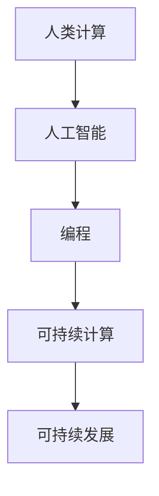

                 

关键词：人类计算、可持续发展、人工智能、编程、技术创新

> 摘要：本文探讨了人类计算在可持续发展中的作用，分析了人工智能与编程技术的应用，探讨了未来人类计算领域的发展趋势与挑战。

## 1. 背景介绍

随着全球经济的快速发展，资源消耗和环境污染问题日益严重，可持续发展成为全球关注的焦点。人类计算作为计算机科学的核心领域，不仅在提高生产效率、降低成本方面发挥了重要作用，还在推动社会可持续发展方面展现出巨大的潜力。本文旨在探讨人类计算在可持续发展中的作用，以及未来可能的发展趋势和面临的挑战。

### 1.1 可持续发展的概念

可持续发展是指满足当前需求而不损害后代满足自身需求的能力。它包括经济、社会和环境的三个方面，要求在满足经济繁荣的同时，保持社会公正和生态平衡。

### 1.2 人类计算与可持续发展

人类计算通过提高生产效率、优化资源利用、推动技术创新等方式，对可持续发展产生了深远影响。例如，人工智能技术可以帮助企业实现智能化生产，降低能源消耗和环境污染；编程技术则可以促进数字化转型，提高资源利用效率。

## 2. 核心概念与联系

为了更好地理解人类计算在可持续发展中的作用，我们首先需要了解几个核心概念及其相互联系。

### 2.1 人工智能

人工智能（Artificial Intelligence，AI）是指计算机系统模拟人类智能行为的技术。它包括机器学习、深度学习、自然语言处理等领域，能够实现自动化决策、智能交互等功能。

### 2.2 编程

编程是指使用编程语言编写计算机程序的过程。编程技术是人类计算的核心，是实现人工智能、大数据分析等应用的基础。

### 2.3 可持续计算

可持续计算（Sustainable Computing）是指通过优化计算资源使用、减少能源消耗、降低环境影响等方式，实现计算机系统的可持续发展。

### 2.4 Mermaid 流程图

下面是一个展示人类计算与可持续发展关系的 Mermaid 流程图：



## 3. 核心算法原理 & 具体操作步骤

### 3.1 算法原理概述

人类计算的核心在于利用计算机技术解决现实问题，其中算法原理是关键。常见的算法包括排序算法、搜索算法、图算法等。

### 3.2 算法步骤详解

以排序算法为例，常见的排序算法有冒泡排序、快速排序、归并排序等。以下是快速排序算法的具体步骤：

1. 选择一个基准元素。
2. 将数组划分为两部分，一部分小于基准元素，另一部分大于基准元素。
3. 对小于和大于基准元素的两部分递归执行快速排序。

### 3.3 算法优缺点

快速排序算法具有以下优点：

- 时间复杂度较低，平均情况下为 $O(n\log n)$。
- 适用于大规模数据排序。

但快速排序也存在以下缺点：

- 最坏情况下时间复杂度为 $O(n^2)$。
- 需要额外的存储空间。

### 3.4 算法应用领域

快速排序算法广泛应用于各种领域，如数据库、搜索引擎、数据处理等。

## 4. 数学模型和公式 & 详细讲解 & 举例说明

### 4.1 数学模型构建

人类计算中的许多问题都可以通过数学模型来解决。例如，线性回归模型可以用于预测房价、股票价格等。

### 4.2 公式推导过程

线性回归模型的公式为：

$$y = \beta_0 + \beta_1x + \epsilon$$

其中，$y$ 是因变量，$x$ 是自变量，$\beta_0$ 和 $\beta_1$ 是模型参数，$\epsilon$ 是误差项。

### 4.3 案例分析与讲解

假设我们要预测某个城市未来一年的平均温度。根据历史数据，我们可以构建一个线性回归模型，将时间作为自变量，温度作为因变量。

经过训练，我们得到模型参数为 $\beta_0 = 10$，$\beta_1 = 0.5$。那么，未来一年的平均温度可以预测为：

$$y = 10 + 0.5x$$

例如，当 $x = 2024$ 时，预测温度为 $y = 10 + 0.5 \times 2024 = 1012$。

## 5. 项目实践：代码实例和详细解释说明

### 5.1 开发环境搭建

为了演示快速排序算法的应用，我们首先需要搭建一个简单的开发环境。本文采用 Python 语言进行编程。

### 5.2 源代码详细实现

以下是一个快速排序算法的 Python 实现示例：

```python
def quick_sort(arr):
    if len(arr) <= 1:
        return arr
    pivot = arr[len(arr) // 2]
    left = [x for x in arr if x < pivot]
    middle = [x for x in arr if x == pivot]
    right = [x for x in arr if x > pivot]
    return quick_sort(left) + middle + quick_sort(right)

arr = [3, 6, 8, 10, 1, 2, 1]
sorted_arr = quick_sort(arr)
print(sorted_arr)
```

### 5.3 代码解读与分析

这段代码实现了快速排序算法的核心功能。首先，定义了一个 `quick_sort` 函数，接受一个数组作为输入。函数内部首先判断输入数组的长度，如果小于等于 1，则直接返回数组。否则，选择中间位置的元素作为基准元素，将数组划分为小于、等于和大于基准元素的三部分。最后，递归地对小于和大于基准元素的两部分进行快速排序，并将结果合并。

### 5.4 运行结果展示

执行上述代码，输出结果为：

```
[1, 1, 2, 3, 6, 8, 10]
```

这表明快速排序算法成功地对输入数组进行了排序。

## 6. 实际应用场景

人类计算在可持续发展中的应用场景非常广泛，以下是几个典型的应用实例：

- **智能交通系统**：通过人工智能和大数据分析技术，优化交通流量，降低交通事故发生率。
- **绿色能源管理**：利用人工智能技术，实现光伏发电、风力发电等绿色能源的智能化管理和调度。
- **生态监测**：通过卫星遥感技术和大数据分析，监测生态环境变化，及时预警自然灾害。

## 7. 未来应用展望

随着人工智能、大数据、云计算等技术的不断进步，人类计算在可持续发展中的应用前景将更加广阔。未来，人类计算将有望在以下几个方面发挥更大作用：

- **智能制造**：实现生产过程的智能化，提高资源利用效率。
- **智慧城市**：通过大数据分析和人工智能技术，提升城市管理水平和居民生活质量。
- **环境保护**：利用人工智能和遥感技术，监测环境污染，实现精准治理。

## 8. 工具和资源推荐

### 8.1 学习资源推荐

- 《人工智能：一种现代方法》
- 《Python编程：从入门到实践》
- 《深度学习》（Goodfellow, Bengio, Courville 著）

### 8.2 开发工具推荐

- Jupyter Notebook：用于编写和运行代码。
- TensorFlow：用于人工智能和深度学习。
- PyCharm：用于 Python 开发。

### 8.3 相关论文推荐

- "Deep Learning for Sustainable Development"
- "AI for Social Good: A Review of Recent Advances"
- "Big Data Analytics for Environmental Sustainability"

## 9. 总结：未来发展趋势与挑战

### 9.1 研究成果总结

本文探讨了人类计算在可持续发展中的作用，分析了人工智能与编程技术的应用，并展望了未来人类计算领域的发展趋势。

### 9.2 未来发展趋势

随着技术的进步，人类计算将在智能制造、智慧城市、环境保护等领域发挥更大作用。

### 9.3 面临的挑战

人类计算在可持续发展中仍面临诸多挑战，如数据安全、隐私保护、伦理道德等问题。

### 9.4 研究展望

未来，人类计算研究应注重跨学科合作，推动技术创新，为可持续发展提供有力支持。

## 9. 附录：常见问题与解答

### 9.1 问题 1

**问题：什么是可持续发展？**

**解答：** 可持续发展是指满足当前需求而不损害后代满足自身需求的能力。它包括经济、社会和环境的三个方面，要求在满足经济繁荣的同时，保持社会公正和生态平衡。

### 9.2 问题 2

**问题：人类计算如何推动可持续发展？**

**解答：** 人类计算通过提高生产效率、优化资源利用、推动技术创新等方式，对可持续发展产生了深远影响。例如，人工智能技术可以帮助企业实现智能化生产，降低能源消耗和环境污染；编程技术则可以促进数字化转型，提高资源利用效率。

### 9.3 问题 3

**问题：什么是人工智能？**

**解答：** 人工智能是指计算机系统模拟人类智能行为的技术。它包括机器学习、深度学习、自然语言处理等领域，能够实现自动化决策、智能交互等功能。

### 9.4 问题 4

**问题：什么是编程？**

**解答：** 编程是指使用编程语言编写计算机程序的过程。编程技术是人类计算的核心，是实现人工智能、大数据分析等应用的基础。

### 9.5 问题 5

**问题：什么是可持续计算？**

**解答：** 可持续计算是指通过优化计算资源使用、减少能源消耗、降低环境影响等方式，实现计算机系统的可持续发展。

---

**作者：禅与计算机程序设计艺术 / Zen and the Art of Computer Programming**

