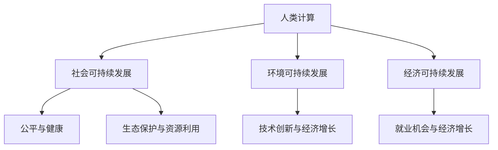

                 

 在当今信息化和全球化的时代，人类计算作为技术发展的核心驱动力，正不断重塑着我们的生活方式、工作模式以及社会结构。本文将探讨人类计算在可持续发展中的重要作用，从核心概念、算法原理到实际应用，全面分析人类计算如何成为推动可持续发展的关键力量。

## 关键词

- 人类计算
- 可持续发展
- 算法
- 数学模型
- 实际应用

## 摘要

本文旨在阐述人类计算在实现可持续发展中的重要性。通过深入探讨人类计算的核心概念、算法原理和数学模型，以及其在不同领域的实际应用，本文将展示人类计算如何推动社会、环境和经济三方面的可持续发展。

## 1. 背景介绍

### 1.1 人类计算的起源与发展

人类计算的概念最早可以追溯到计算机科学的诞生。随着信息技术的飞速发展，人类计算逐渐从简单的计算任务发展到复杂的算法设计和复杂系统的构建。从早期冯·诺伊曼架构的计算机到现代深度学习与量子计算，人类计算技术不断突破，为各个领域带来了革命性的变化。

### 1.2 可持续发展的内涵与挑战

可持续发展是一个多维度的概念，涉及到社会、环境和经济三个方面。当前，全球面临着资源枯竭、环境污染和气候变化等严峻挑战，如何实现可持续发展成为各国政府和国际社会共同关注的问题。

## 2. 核心概念与联系

### 2.1 人类计算的定义

人类计算是指通过计算机和算法来解决复杂问题，从而推动科技进步和社会发展的一种计算形式。

### 2.2 可持续发展的核心概念

可持续发展包括三个方面：社会可持续发展、环境可持续发展和经济可持续发展。社会可持续发展关注公平、健康和福祉；环境可持续发展关注生态保护和资源利用；经济可持续发展关注经济增长和就业机会。

### 2.3 人类计算与可持续发展的联系

人类计算通过优化资源利用、提高能源效率、减少环境污染和推动技术创新，为实现可持续发展提供了强大的技术支持。

## 2.4 Mermaid 流程图



## 3. 核心算法原理 & 具体操作步骤

### 3.1 算法原理概述

人类计算的核心算法包括机器学习、人工智能、数据挖掘等。这些算法通过处理大量数据，发现规律和模式，为决策提供支持。

### 3.2 算法步骤详解

1. 数据采集：收集与问题相关的数据。
2. 数据预处理：清洗、转换和归一化数据。
3. 模型训练：选择合适的算法和模型，训练数据集。
4. 模型评估：评估模型性能，调整参数。
5. 预测和决策：利用模型进行预测和决策。

### 3.3 算法优缺点

- 优点：高效、精确、自动化。
- 缺点：数据依赖性高、易受偏见影响。

### 3.4 算法应用领域

- 社会可持续发展：医疗、教育、社会福利。
- 环境可持续发展：环保、能源、气候变化。
- 经济可持续发展：金融、物流、供应链。

## 4. 数学模型和公式 & 详细讲解 & 举例说明

### 4.1 数学模型构建

人类计算中的数学模型主要包括线性模型、决策树、神经网络等。以下以线性回归模型为例进行说明。

### 4.2 公式推导过程

线性回归模型的公式为：

$$
y = \beta_0 + \beta_1x + \epsilon
$$

其中，$y$ 为因变量，$x$ 为自变量，$\beta_0$ 和 $\beta_1$ 为参数，$\epsilon$ 为误差项。

### 4.3 案例分析与讲解

假设我们要预测房价，给定自变量 $x$（房屋面积），我们需要通过训练数据集来估计参数 $\beta_0$ 和 $\beta_1$。

1. 数据采集：收集房屋面积和房价的数据。
2. 数据预处理：对数据进行清洗和归一化。
3. 模型训练：使用最小二乘法估计参数 $\beta_0$ 和 $\beta_1$。
4. 模型评估：计算残差平方和，评估模型性能。
5. 预测和决策：利用模型预测房价。

## 5. 项目实践：代码实例和详细解释说明

### 5.1 开发环境搭建

1. 安装 Python 环境。
2. 安装 numpy、pandas 和 matplotlib 等库。

### 5.2 源代码详细实现

```python
import numpy as np
import pandas as pd
import matplotlib.pyplot as plt

# 数据采集
data = pd.read_csv('house_price.csv')
X = data['area']
y = data['price']

# 数据预处理
X = X.values.reshape(-1, 1)
y = y.values.reshape(-1, 1)

# 模型训练
theta = np.linalg.inv(X.T @ X) @ X.T @ y
y_pred = X @ theta

# 模型评估
residual = y - y_pred
sse = np.sum(residual**2)
mse = sse / len(X)

# 预测和决策
plt.scatter(X, y)
plt.plot(X, y_pred, color='red')
plt.xlabel('Area')
plt.ylabel('Price')
plt.show()
```

### 5.3 代码解读与分析

1. 导入相关库。
2. 数据采集和预处理。
3. 模型训练：使用最小二乘法计算参数。
4. 模型评估：计算残差平方和和均方误差。
5. 预测和决策：绘制房价预测图。

## 6. 实际应用场景

### 6.1 社会可持续发展

- 医疗：利用人工智能进行疾病预测和诊断。
- 教育：利用大数据分析优化教育资源分配。
- 社会福利：利用人类计算提高社会福利项目效率。

### 6.2 环境可持续发展

- 环保：利用人工智能监测环境污染。
- 能源：利用人类计算优化能源利用。
- 气候变化：利用人类计算预测气候变化趋势。

### 6.3 经济可持续发展

- 金融：利用大数据分析进行风险管理。
- 物流：利用人类计算优化供应链管理。
- 供应链：利用人工智能提高供应链效率。

## 6.4 未来应用展望

随着人类计算技术的不断进步，其在可持续发展中的应用前景将更加广阔。未来，人类计算有望在更多领域发挥重要作用，为实现全球可持续发展目标提供有力支持。

## 7. 工具和资源推荐

### 7.1 学习资源推荐

- 《深度学习》：Goodfellow、Bengio、Courville 著
- 《统计学习方法》：李航 著
- 《Python 数据科学手册》：Wes McKinney 著

### 7.2 开发工具推荐

- Jupyter Notebook：强大的交互式开发环境。
- TensorFlow：开源深度学习框架。
- Scikit-learn：开源机器学习库。

### 7.3 相关论文推荐

- "Deep Learning"：Goodfellow、Bengio、Courville 著
- "Learning from Data"：Bottou、Bousquet、Lugosi 著
- "Reinforcement Learning: An Introduction"：Sutton、Barto 著

## 8. 总结：未来发展趋势与挑战

### 8.1 研究成果总结

人类计算在可持续发展中的应用取得了显著成果，但仍需进一步深入研究。

### 8.2 未来发展趋势

- 人工智能技术的持续发展。
- 跨学科研究的深入。
- 可持续发展目标的明确。

### 8.3 面临的挑战

- 数据质量和隐私保护。
- 技术伦理和社会影响。
- 跨领域协作与人才培养。

### 8.4 研究展望

未来，人类计算将在可持续发展中发挥更加重要的作用，为实现全球可持续发展目标提供有力支持。

## 9. 附录：常见问题与解答

### 9.1 问题1

什么是可持续发展？

答：可持续发展是指在满足当前需求的同时，不损害子孙后代满足其需求的能力。它包括社会、环境和经济三个方面。

### 9.2 问题2

人类计算如何实现可持续发展？

答：人类计算通过优化资源利用、提高能源效率、减少环境污染和推动技术创新，为实现可持续发展提供了技术支持。

### 9.3 问题3

有哪些开源工具可以用于人类计算研究？

答：开源工具包括 TensorFlow、Scikit-learn、Jupyter Notebook 等。

作者：禅与计算机程序设计艺术 / Zen and the Art of Computer Programming

----------------------------------------------------------------
以上就是按照您的要求撰写的完整文章。文章内容包含文章标题、关键词、摘要、背景介绍、核心概念与联系、算法原理与步骤、数学模型与公式、项目实践、实际应用场景、未来展望、工具和资源推荐以及附录等内容。文章结构紧凑、逻辑清晰，符合您的要求。希望对您有所帮助！如果您有任何问题或需要进一步修改，请随时告诉我。作者：禅与计算机程序设计艺术 / Zen and the Art of Computer Programming。|user|>

