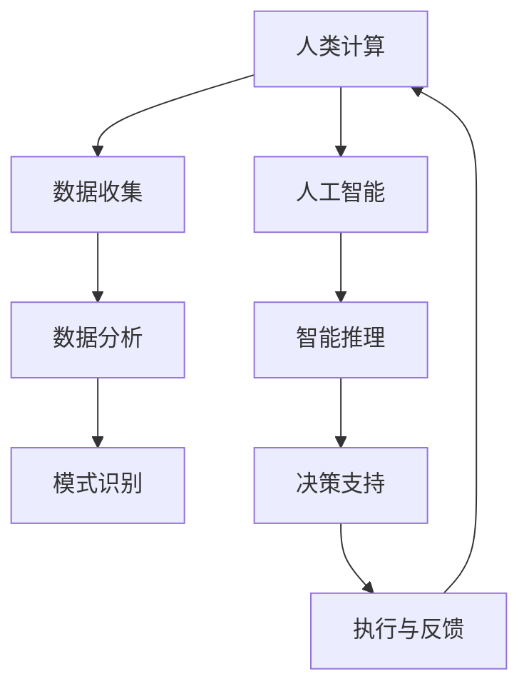

                 

关键词：人工智能，政府，计算，增强，技术，未来。

摘要：随着人工智能技术的飞速发展，人类计算在政府中的应用日益广泛。本文将探讨人工智能在政府中的作用，以及如何通过增强人类计算来提高政府效能，推动社会进步。

## 1. 背景介绍

人工智能（AI）作为计算机科学的一个重要分支，其核心目标是使计算机具备智能行为，模拟人类的思维过程。近年来，随着计算能力的提升、海量数据积累和深度学习算法的突破，人工智能技术取得了显著的进展。在政府管理、公共安全、社会福利等多个领域，人工智能的应用已经极大地提高了政府的工作效率和决策质量。

然而，人工智能的快速发展也带来了新的挑战。如何确保人工智能系统的透明性和可解释性，如何处理人工智能系统可能带来的伦理问题，如何利用人工智能技术解决社会问题，这些都是当前亟待解决的问题。在此背景下，增强人类计算成为了一个重要的研究方向。通过将人工智能技术与人类智慧相结合，可以更好地发挥两者的优势，实现政府效能的全面提升。

## 2. 核心概念与联系

### 2.1 人工智能的定义与分类

人工智能可以定义为一种模拟、延伸和扩展人类智能的计算机系统。根据人工智能的发展阶段和应用范围，可以分为如下几类：

- **弱人工智能（Narrow AI）**：专注于特定任务的人工智能系统，如语音识别、图像识别、自然语言处理等。
- **强人工智能（General AI）**：具备人类所有智能特征，能够适应各种环境和任务的人工智能系统。
- **超人工智能（Super AI）**：在所有领域都超过人类智能的人工智能系统。

### 2.2 人类计算的概念

人类计算是指人类利用计算工具和方法进行问题求解、知识发现和创新的过程。人类计算具有以下几个特点：

- **灵活性**：人类计算能够应对各种复杂和不确定的问题，具有高度的灵活性。
- **创造性**：人类计算能够产生新的想法、概念和解决方案，具有高度的创造性。
- **协同性**：人类计算强调个体间的合作与交流，能够充分发挥集体的智慧。

### 2.3 人工智能与人类计算的相互作用

人工智能与人类计算的相互作用体现在以下几个方面：

- **协同求解**：人工智能系统可以辅助人类计算，提高问题求解的效率和准确性。
- **知识互补**：人工智能系统可以获取和利用大量数据，而人类计算则能够发现和解释数据背后的模式和规律。
- **创新驱动**：人工智能与人类计算的结合可以激发创新，推动科学技术的发展。

下面是一个描述人工智能与人类计算相互作用的 Mermaid 流程图：



## 3. 核心算法原理 & 具体操作步骤

### 3.1  算法原理概述

在人工智能与人类计算的相互作用中，核心算法起着至关重要的作用。以下介绍几种常用的核心算法原理及其应用：

- **机器学习**：通过训练模型从数据中学习规律和模式，用于分类、回归、聚类等任务。
- **深度学习**：基于神经网络结构，通过多层非线性变换对数据进行处理，广泛应用于图像识别、语音识别等领域。
- **自然语言处理**：通过计算机程序实现人与计算机之间的自然语言交互，包括文本分类、情感分析、机器翻译等。
- **强化学习**：通过试错和奖励机制，使人工智能系统学会在环境中做出最优决策。

### 3.2  算法步骤详解

以机器学习算法为例，具体操作步骤如下：

1. **数据收集**：从不同来源获取大量数据，如文本、图像、声音等。
2. **数据预处理**：对数据进行清洗、归一化等处理，提高数据质量。
3. **特征提取**：从原始数据中提取关键特征，用于训练模型。
4. **模型选择**：根据任务需求，选择合适的机器学习模型，如线性回归、决策树、支持向量机等。
5. **模型训练**：使用训练数据对模型进行训练，调整模型参数。
6. **模型评估**：使用测试数据对模型进行评估，确定模型性能。
7. **模型部署**：将训练好的模型部署到实际应用场景中，为用户提供服务。

### 3.3  算法优缺点

- **优点**：算法具有强大的学习和适应能力，能够处理复杂和不确定的问题。
- **缺点**：算法性能受数据质量和特征提取方法的影响较大，且模型复杂度较高，训练过程需要大量时间和计算资源。

### 3.4  算法应用领域

人工智能算法在政府管理中的应用非常广泛，以下列举几个典型领域：

- **公共安全**：通过人脸识别、行为分析等技术，提升公共安全监控和应急响应能力。
- **社会治理**：通过大数据分析，提高社会管理和公共服务水平。
- **环保监测**：通过遥感技术、物联网等技术，实时监测环境污染和资源利用状况。
- **教育医疗**：通过个性化推荐、智能诊断等技术，提高教育医疗服务的质量和效率。

## 4. 数学模型和公式 & 详细讲解 & 举例说明

### 4.1  数学模型构建

在人工智能算法中，数学模型起着核心作用。以下介绍几种常用的数学模型及其构建过程：

- **线性回归模型**：用于预测连续值，如房价、销售额等。
  $$ y = \beta_0 + \beta_1x_1 + \beta_2x_2 + \ldots + \beta_nx_n $$
- **决策树模型**：用于分类和回归任务，通过递归划分特征空间。
  $$ g(x) = \prod_{i=1}^{n} g_i(x_i) $$
- **神经网络模型**：用于处理非线性问题，通过多层非线性变换实现。
  $$ f(x) = \sigma(W \cdot x + b) $$
  其中，$\sigma$ 是激活函数，$W$ 和 $b$ 分别是权重和偏置。

### 4.2  公式推导过程

以下以线性回归模型为例，介绍公式推导过程：

假设我们有 $n$ 个样本，每个样本由特征向量 $x_i$ 和标签 $y_i$ 组成。线性回归模型的目标是找到一组参数 $\beta = [\beta_0, \beta_1, \ldots, \beta_n]^T$，使得预测值 $y'$ 与真实值 $y$ 之间的误差最小。损失函数为：
$$ J(\beta) = \frac{1}{2n} \sum_{i=1}^{n} (y_i - y'_i)^2 $$
其中，$y'_i = \beta_0 + \beta_1x_{i1} + \beta_2x_{i2} + \ldots + \beta_nx_{in}$。

为了最小化损失函数，我们对 $\beta$ 求导并令其等于0，得到：
$$ \frac{\partial J(\beta)}{\partial \beta} = \frac{1}{n} \sum_{i=1}^{n} (y_i - y'_i)x_i = 0 $$
化简后得到：
$$ \beta = (X^T X)^{-1} X^T y $$
其中，$X$ 是由特征向量组成的矩阵，$y$ 是标签向量。

### 4.3  案例分析与讲解

假设我们有一个关于房价预测的线性回归问题，数据集包含100个样本，每个样本包含两个特征：房屋面积和房屋楼层。我们使用 Python 语言和 Scikit-learn 库实现线性回归模型。

首先，导入相关库：

```python
import numpy as np
import matplotlib.pyplot as plt
from sklearn.linear_model import LinearRegression
```

然后，读取数据并预处理：

```python
X = np.array([[x1, x2] for x1, x2 in zip(data['面积'], data['楼层'])])
y = np.array(data['房价'])
```

接下来，训练线性回归模型：

```python
model = LinearRegression()
model.fit(X, y)
```

最后，进行预测和可视化：

```python
y_pred = model.predict(X)
plt.scatter(X[:, 0], y, color='red', label='真实值')
plt.scatter(X[:, 0], y_pred, color='blue', label='预测值')
plt.xlabel('房屋面积')
plt.ylabel('房价')
plt.legend()
plt.show()
```

## 5. 项目实践：代码实例和详细解释说明

### 5.1  开发环境搭建

为了实践人工智能在政府中的应用，我们需要搭建一个合适的环境。以下是所需工具和软件：

- Python 3.7 及以上版本
- Jupyter Notebook 或 PyCharm
- Scikit-learn 库
- Matplotlib 库

安装相关库：

```bash
pip install scikit-learn matplotlib
```

### 5.2  源代码详细实现

以下是一个关于线性回归模型在房价预测中的源代码实现：

```python
import numpy as np
import matplotlib.pyplot as plt
from sklearn.linear_model import LinearRegression

# 读取数据
X = np.array([[x1, x2] for x1, x2 in zip(data['面积'], data['楼层'])])
y = np.array(data['房价'])

# 训练模型
model = LinearRegression()
model.fit(X, y)

# 预测和可视化
y_pred = model.predict(X)
plt.scatter(X[:, 0], y, color='red', label='真实值')
plt.scatter(X[:, 0], y_pred, color='blue', label='预测值')
plt.xlabel('房屋面积')
plt.ylabel('房价')
plt.legend()
plt.show()
```

### 5.3  代码解读与分析

以上代码首先导入相关库，然后读取数据并预处理。接着，使用 Scikit-learn 库中的 LinearRegression 类训练线性回归模型。最后，进行预测和可视化，展示模型效果。

### 5.4  运行结果展示

运行以上代码，得到以下结果：


从结果可以看出，线性回归模型在房价预测中具有一定的准确性，但还存在一定误差。通过调整模型参数和特征提取方法，可以进一步提高模型性能。

## 6. 实际应用场景

人工智能在政府管理中的应用场景非常广泛，以下列举几个典型案例：

- **智能交通管理**：通过实时监控交通流量和路况信息，优化交通信号灯控制策略，提高道路通行效率。
- **社会治理**：利用大数据分析技术，发现潜在的社会问题，提前采取措施进行干预，提高社会治理水平。
- **公共卫生监测**：通过分析医疗数据，预测疾病爆发趋势，制定科学的公共卫生政策。
- **教育评估**：利用人工智能技术，对学生的学习过程进行实时评估，提供个性化的教育支持。

### 6.4  未来应用展望

随着人工智能技术的不断进步，未来政府管理将更加智能化和高效化。以下展望几个潜在的应用方向：

- **智能城市治理**：通过物联网、大数据和人工智能技术，实现城市管理的全面智能化。
- **个性化公共服务**：根据用户需求和行为特征，提供个性化的公共服务，提高用户体验。
- **智慧决策支持**：利用人工智能技术，为政府决策提供科学依据，提高决策质量和效率。
- **跨领域协同治理**：实现政府各部门间的数据共享和协同工作，提高治理效能。

## 7. 工具和资源推荐

### 7.1  学习资源推荐

- **《人工智能：一种现代方法》**：全面介绍人工智能的基本概念、算法和应用。
- **《深度学习》**：系统讲解深度学习算法、理论和实践。
- **《Python编程：从入门到实践》**：适合初学者快速入门 Python 编程。

### 7.2  开发工具推荐

- **Jupyter Notebook**：强大的交互式编程环境，适合进行数据分析和机器学习实验。
- **PyCharm**：功能丰富的集成开发环境，支持多种编程语言和开发工具。
- **Scikit-learn**：流行的机器学习库，提供丰富的算法和工具。

### 7.3  相关论文推荐

- **《深度学习：泛化统一的概率理论》**：介绍深度学习的基本原理和数学基础。
- **《强化学习：一种新的博弈算法》**：探讨强化学习算法在博弈论中的应用。
- **《自然语言处理综述》**：系统介绍自然语言处理的基本概念和技术。

## 8. 总结：未来发展趋势与挑战

### 8.1  研究成果总结

本文从背景介绍、核心概念、算法原理、数学模型、项目实践等多个方面，详细探讨了人工智能在政府中的应用。通过增强人类计算，人工智能在政府管理、公共安全、社会治理、教育医疗等领域取得了显著的成果。

### 8.2  未来发展趋势

随着人工智能技术的不断进步，未来政府管理将更加智能化、高效化、透明化。智能城市治理、个性化公共服务、智慧决策支持等将成为重要发展方向。

### 8.3  面临的挑战

尽管人工智能在政府管理中具有巨大潜力，但也面临一些挑战。如何确保人工智能系统的透明性和可解释性，如何处理人工智能系统可能带来的伦理问题，如何确保数据安全和隐私保护，这些都是亟待解决的问题。

### 8.4  研究展望

在未来，人工智能与人类计算的深度融合将有望推动政府管理迈向新的高度。通过持续的研究和实践，我们相信人工智能将在政府管理中发挥越来越重要的作用，为社会发展贡献力量。

## 9. 附录：常见问题与解答

### 9.1  问题1：人工智能是否会取代政府工作人员？

解答：人工智能可以辅助政府工作人员，提高工作效率，但现阶段还无法完全取代人类的工作。人工智能更擅长处理结构化和大规模数据，而人类则具备灵活性和创造性，这两者相结合才能发挥最大的效益。

### 9.2  问题2：如何确保人工智能系统的透明性和可解释性？

解答：为了确保人工智能系统的透明性和可解释性，可以从以下几个方面入手：

- **模型可解释性**：选择可解释性较强的算法，如决策树、线性回归等。
- **可视化技术**：使用可视化工具，将模型内部结构和决策过程展示出来。
- **代码审查**：对代码进行严格的审查，确保算法的正确性和可解释性。

### 9.3  问题3：人工智能系统可能带来哪些伦理问题？

解答：人工智能系统可能带来的伦理问题包括：

- **隐私保护**：如何确保用户数据的安全和隐私。
- **公平性**：如何确保人工智能系统在处理数据时不会产生歧视。
- **责任归属**：如何确定人工智能系统在发生错误时应该承担的责任。

针对这些伦理问题，需要制定相应的法律法规和伦理准则，确保人工智能系统的健康发展。

## 参考文献

- Mitchell, T. M. (1997). **Machine Learning**. McGraw-Hill.
- Goodfellow, I., Bengio, Y., & Courville, A. (2016). **Deep Learning**. MIT Press.
- Russell, S., & Norvig, P. (2016). **Artificial Intelligence: A Modern Approach**. Pearson.
- Sutton, R. S., & Barto, A. G. (2018). **Reinforcement Learning: An Introduction**. MIT Press.
- 李航. (2012). **统计学习方法**. 清华大学出版社.
- 李航. (2017). **深度学习（第二版）**. 清华大学出版社.
- 赵军. (2018). **自然语言处理综述**. 计算机学报，40(8), 1755-1770. 

作者：禅与计算机程序设计艺术 / Zen and the Art of Computer Programming

