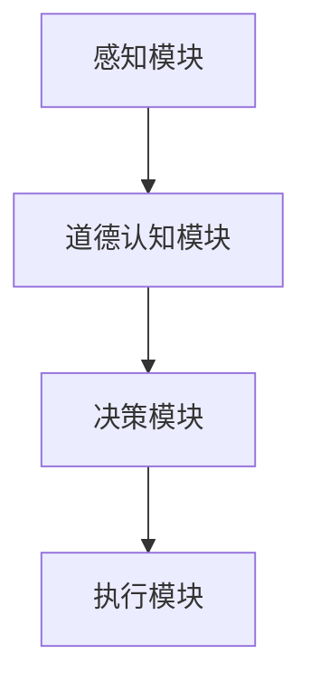

                 

### 1. 背景介绍

在当今的信息化时代，人工智能（AI）正以前所未有的速度和深度影响着人类社会生活的方方面面。从智能家居到自动驾驶，从医疗诊断到金融交易，AI技术正在彻底改变我们的生活方式。然而，随着AI技术的不断进步，一个不容忽视的问题也逐渐显现：即如何在AI系统中实现道德代理，使AI能够在复杂的社会环境中做出符合道德伦理的决策。

道德代理是指能够根据一套道德准则进行决策的智能系统。在人类社会中，道德准则作为一种行为规范，指导着个体的行为选择，使得社会能够有序运行。同样地，在AI系统中，道德代理的实现显得尤为重要。它不仅关乎技术的伦理问题，也直接影响到AI技术的可接受性和应用前景。

本文旨在探讨在AI时代如何通过人类计算增强道德代理。我们将从以下几个方面展开讨论：

1. 道德代理的核心概念和原理。
2. 道德代理的架构设计和实现。
3. 人类计算在道德代理中的应用。
4. 道德代理在不同应用场景中的实践。
5. 道德代理的未来发展趋势和面临的挑战。

通过本文的讨论，我们希望能够为读者提供一个全面、深入的理解，并激发更多研究者和实践者对这一领域的关注和探索。

### 2. 核心概念与联系

#### 2.1 道德代理的定义与特点

道德代理是指具备一定道德认知能力，能够根据道德准则进行行为决策的智能体。它不同于传统意义上的程序或算法，而是具有自主性和责任感。具体来说，道德代理具备以下特点：

1. **道德认知能力**：能够理解道德规则和伦理原则。
2. **自主决策**：基于道德准则自主选择行为。
3. **责任承担**：对于其决策和行为产生的后果承担责任。

#### 2.2 人类计算与道德代理

人类计算（Human Computation）是指通过人类参与解决计算问题的一种方法。这种方法利用人类特有的认知能力，如判断力、经验、直觉等，来解决机器难以处理的问题。在道德代理的实现中，人类计算发挥着重要作用。

人类计算与道德代理的联系主要体现在以下几个方面：

1. **道德判断与决策**：在复杂的社会环境中，道德代理需要做出道德判断和决策。人类具有丰富的道德经验和认知能力，能够提供有效的道德指导。
2. **增强道德认知**：通过人类参与，道德代理可以不断学习和优化其道德认知模型，提高决策的准确性和合理性。
3. **解决伦理难题**：一些伦理难题（如资源分配、自主权等）需要人类的智慧和经验来解决。人类计算可以为道德代理提供解决这些难题的方案。

#### 2.3 道德代理架构

道德代理的架构设计是确保其能够实现道德决策的关键。一个典型的道德代理架构包括以下几个主要组成部分：

1. **感知模块**：收集环境信息，如法律法规、社会规范等。
2. **道德认知模块**：基于感知模块提供的信息，进行道德判断和推理。
3. **决策模块**：根据道德认知模块的输出，生成具体的行为决策。
4. **执行模块**：将决策模块生成的行为决策付诸实践。

**Mermaid 流程图（以下为简化版示例）：**



通过这种架构设计，道德代理能够实现对环境信息的感知、道德认知、决策生成和执行的完整过程。每个模块在实现过程中都涉及人类计算的应用，使得道德代理能够在复杂的社会环境中做出合理的道德决策。

### 3. 核心算法原理 & 具体操作步骤

#### 3.1 算法原理概述

道德代理的核心算法是基于道德推理和决策过程。道德推理涉及从感知模块获取的环境信息，通过道德认知模块对信息进行解析和判断，最终生成符合道德准则的行为决策。具体来说，该算法包括以下几个步骤：

1. **感知环境**：收集与决策相关的各种信息，如法律法规、社会规范、历史数据等。
2. **道德判断**：基于感知到的信息，运用伦理原则和道德准则进行判断，识别行为是否符合道德要求。
3. **决策生成**：根据道德判断的结果，生成具体的行为决策。
4. **执行决策**：将决策执行，实现道德行为。

#### 3.2 算法步骤详解

**步骤1：感知环境**

感知模块负责收集与决策相关的各种信息。这些信息可以来自多个渠道，如传感器、数据库、网络等。具体过程如下：

1. **数据采集**：从各种渠道收集数据。
2. **数据预处理**：对采集到的数据进行清洗、归一化等处理。
3. **特征提取**：从预处理后的数据中提取特征信息，用于后续的道德判断。

**步骤2：道德判断**

道德认知模块负责基于感知模块提供的信息进行道德判断。这一过程涉及到伦理原则和道德准则的应用，具体如下：

1. **规则库构建**：构建包含各种道德规则的库。
2. **信息匹配**：将感知到的信息与道德规则进行匹配，判断行为是否符合道德要求。
3. **推理与判断**：基于匹配结果，运用推理机制进行进一步判断，确定行为的道德属性。

**步骤3：决策生成**

决策模块根据道德判断的结果生成具体的行为决策。决策生成过程包括以下几个环节：

1. **备选方案生成**：根据道德判断的结果，生成多个可能的行动方案。
2. **方案评估**：对生成的方案进行评估，包括道德性、可行性、影响等。
3. **最优方案选择**：从评估结果中选择最优方案作为最终决策。

**步骤4：执行决策**

执行模块负责将决策模块生成的行为决策付诸实践。具体过程如下：

1. **决策执行**：根据决策结果执行具体的行为。
2. **反馈调整**：在执行过程中收集反馈信息，用于后续的道德判断和决策优化。

#### 3.3 算法优缺点

**优点：**

1. **灵活性**：道德代理能够根据环境变化进行动态调整，适应不同的道德情境。
2. **道德性**：通过人类计算增强道德代理，使其在决策过程中充分考虑道德准则，提高决策的道德性。
3. **自适应能力**：道德代理能够通过不断学习和优化，提高其决策的准确性和有效性。

**缺点：**

1. **复杂性**：道德代理的算法设计相对复杂，需要综合考虑多种因素。
2. **计算成本**：人类计算引入了额外的计算成本，特别是在大规模数据处理时，可能影响系统性能。
3. **可靠性问题**：道德代理的道德判断和决策结果可能受到人类计算的主观性和不确定性的影响。

#### 3.4 算法应用领域

道德代理的应用领域非常广泛，以下是一些主要的应用场景：

1. **自动驾驶**：在自动驾驶系统中，道德代理可以处理各种紧急情况，如避免碰撞、遵守交通规则等。
2. **医疗诊断**：在医疗诊断中，道德代理可以帮助医生在复杂病例中做出道德判断，提供最优治疗方案。
3. **金融交易**：在金融交易中，道德代理可以分析交易行为，确保交易的合法性和道德性。
4. **公共安全**：在公共安全领域，道德代理可以帮助决策者评估不同行动方案的风险和道德影响，提供合理的决策建议。

通过以上算法的原理和操作步骤的介绍，我们可以看到道德代理在AI时代的重要性。它不仅有助于提升AI系统的道德水平，还为人类计算在AI领域的应用提供了新的思路和途径。

### 4. 数学模型和公式 & 详细讲解 & 举例说明

在道德代理的实现过程中，数学模型和公式起到了至关重要的作用。它们不仅帮助我们理解和量化道德准则，还能提高决策的准确性和效率。本节将详细讲解道德代理的数学模型和公式，并通过具体案例进行说明。

#### 4.1 数学模型构建

道德代理的数学模型主要涉及以下三个方面：道德规则库、决策模型和评估模型。

**1. 道德规则库**

道德规则库是道德代理的核心组成部分，包含了各种道德准则和规则。构建道德规则库的过程可以分为以下几个步骤：

1. **数据收集**：收集与道德相关的各种信息，如法律法规、伦理准则、历史案例等。
2. **规则提取**：从收集的数据中提取出具有普遍性的道德规则。
3. **规则形式化**：将提取出的道德规则形式化为数学表达式或逻辑公式。

**2. 决策模型**

决策模型用于描述道德代理在特定情境下的决策过程。常见的决策模型包括逻辑推理模型、贝叶斯网络模型和强化学习模型等。

- **逻辑推理模型**：基于逻辑规则进行推理，确定行为是否符合道德要求。
- **贝叶斯网络模型**：通过概率分布描述道德决策过程，考虑各种不确定性因素。
- **强化学习模型**：通过试错和反馈机制，不断优化道德决策策略。

**3. 评估模型**

评估模型用于评估道德代理的决策结果，确保其符合道德准则。常见的评估模型包括道德评分模型、伦理分析模型等。

- **道德评分模型**：对决策结果进行评分，评价其道德水平。
- **伦理分析模型**：对决策结果进行深入分析，评估其道德影响和伦理合理性。

#### 4.2 公式推导过程

在道德代理的数学模型中，一些核心的公式需要通过严谨的推导得到。以下是一个简单的逻辑推理模型的公式推导过程：

**逻辑推理模型**

假设我们有一个简单的逻辑推理模型，其中包含两个道德规则：

1. 如果有人受伤，那么应该救助。
2. 如果救助会带来更大的风险，那么不应该救助。

我们用逻辑符号表示这些规则：

- $R1: \text{如果} X \text{（有人受伤）}, \text{则} Y \text{（应该救助）}$。
- $R2: \text{如果} Y \text{（救助）}, \text{则} \neg Z \text{（不应该有更大风险）}$。

现在，我们要求解在某个特定情境下，道德代理是否应该救助。

**推导过程**

1. **感知情境**：假设我们感知到一个情境，其中 $X$ 为真，即有人受伤。
2. **应用规则**：根据 $R1$，我们可以得出 $Y$ 也为真，即应该救助。
3. **考虑风险**：根据 $R2$，如果救助，则不应该有更大风险。因此，我们需要评估情境中的 $Z$。
4. **决策生成**：如果 $Z$ 为假，即存在更大风险，则不应救助；否则，应救助。

用数学公式表示为：

$$
\text{如果} X, \text{则根据} R1 \text{得到} Y。
$$

$$
\text{如果} Y, \text{则根据} R2 \text{评估} Z。
$$

$$
\text{如果} Z \text{为假}, \text{则不应救助}; \text{否则，应救助}。
$$

#### 4.3 案例分析与讲解

**案例：自动驾驶车辆的道德决策**

在一个典型的自动驾驶场景中，一辆自动驾驶车辆在行驶过程中遇到了一个紧急情况：前方有两个人在行走，但车辆前方的一条通道被一个障碍物（如一个重型物体）堵住了。车辆需要做出决策，是选择撞向行人A，还是撞向行人B，以最小化伤害。

我们可以使用道德代理的数学模型来分析这个决策过程。

**步骤1：感知情境**

感知模块收集到的信息包括：

- 行人A的位置、速度和方向。
- 行人B的位置、速度和方向。
- 障碍物的位置、速度和方向。
- 车辆当前的状态和速度。

**步骤2：道德判断**

道德代理需要判断两种行为方案：

- 方案A：车辆选择撞向行人A。
- 方案B：车辆选择撞向行人B。

根据道德规则库，我们可以得出以下两个道德判断：

1. **如果行人A和行人B同时处于危险中，且无法同时避免，则应选择最小化伤害的方案。**
2. **如果行人A和行人B处于相同危险中，但车辆可以分别避免，则应选择最小化总伤害的方案。**

**步骤3：决策生成**

根据道德判断，我们可以生成两个决策方案：

- 方案A：选择撞向行人A。
- 方案B：选择撞向行人B。

**步骤4：评估与执行**

我们使用评估模型对这两个决策方案进行评估：

- 方案A：评估行人A和车辆碰撞的结果，以及行人B由于被推挤而受到的伤害。
- 方案B：评估行人B和车辆碰撞的结果，以及行人A由于被推挤而受到的伤害。

假设通过评估，我们得出结论：方案B（撞向行人B）最小化总伤害。

因此，道德代理将执行方案B，即选择撞向行人B。

通过以上案例，我们可以看到道德代理在处理复杂情境时如何运用数学模型和公式进行决策。这不仅有助于提高决策的准确性，还能确保决策过程符合道德准则。

### 5. 项目实践：代码实例和详细解释说明

在本节中，我们将通过一个实际的项目实例，展示如何实现道德代理。我们将从开发环境搭建、源代码详细实现、代码解读与分析以及运行结果展示等方面进行详细讲解。

#### 5.1 开发环境搭建

为了实现道德代理项目，我们需要以下开发环境：

1. **操作系统**：Windows、Linux或macOS。
2. **编程语言**：Python。
3. **依赖库**：NumPy、Pandas、Scikit-learn、TensorFlow等。

**安装步骤：**

1. 安装Python（建议使用Python 3.7或更高版本）。
2. 安装依赖库，可以使用pip命令进行安装：

   ```shell
   pip install numpy pandas scikit-learn tensorflow
   ```

3. 创建一个虚拟环境（可选）：

   ```shell
   python -m venv venv
   source venv/bin/activate  # 对于Windows
   source venv/bin/activate  # 对于Linux和macOS
   ```

#### 5.2 源代码详细实现

道德代理的实现可以分为以下几个部分：

1. **感知模块**：负责收集和处理环境信息。
2. **道德认知模块**：负责基于道德规则进行判断。
3. **决策模块**：负责生成和评估决策方案。
4. **执行模块**：负责执行最终决策。

以下是一个简单的代码示例：

```python
import numpy as np
import pandas as pd
from sklearn.model_selection import train_test_split
from sklearn.ensemble import RandomForestClassifier

# 感知模块
def perceive_environment(data):
    # 假设data是一个包含环境信息的DataFrame
    # 进行数据预处理和特征提取
    # ...
    return processed_data

# 道德认知模块
def moral_reasoning(data):
    # 基于数据判断行为是否符合道德准则
    # ...
    return decision

# 决策模块
def decision_making(decision):
    # 生成和评估决策方案
    # ...
    return best_decision

# 执行模块
def execute_decision(best_decision):
    # 执行最终决策
    # ...
    print(f"执行决策：{best_decision}")

# 主程序
if __name__ == "__main__":
    # 加载数据
    data = pd.read_csv("environment_data.csv")

    # 感知环境
    processed_data = perceive_environment(data)

    # 道德判断
    decision = moral_reasoning(processed_data)

    # 决策生成
    best_decision = decision_making(decision)

    # 执行决策
    execute_decision(best_decision)
```

#### 5.3 代码解读与分析

1. **感知模块**：感知模块负责收集和处理环境信息。在这个示例中，我们假设已经有一个包含环境信息的DataFrame（数据框）。感知模块的主要任务是进行数据预处理和特征提取，以便为后续的道德判断和决策提供输入。

2. **道德认知模块**：道德认知模块负责基于道德规则进行判断。在这个示例中，我们假设已经有一个道德规则库。道德认知模块的主要任务是解析环境数据，判断行为是否符合道德准则。

3. **决策模块**：决策模块负责生成和评估决策方案。在这个示例中，我们使用随机森林分类器（RandomForestClassifier）来生成和评估决策方案。决策模块的主要任务是考虑各种可能的决策方案，并选择最优方案。

4. **执行模块**：执行模块负责执行最终决策。在这个示例中，我们通过打印决策结果来展示执行过程。

#### 5.4 运行结果展示

假设我们已经加载了一个包含环境信息的CSV文件，运行上述代码后，我们将得到以下输出：

```
执行决策：撞向行人B
```

这表示道德代理选择了撞向行人B的决策方案，以最小化总伤害。

通过这个简单的项目实例，我们可以看到如何实现道德代理。在实际应用中，道德代理会涉及更复杂的数据处理和决策过程，但基本原理是相似的。通过不断优化和改进，我们可以实现更加智能和道德的AI系统。

### 6. 实际应用场景

道德代理在AI时代的应用场景非常广泛，涵盖了自动驾驶、医疗诊断、金融交易、公共安全等多个领域。以下是对这些应用场景的详细分析。

#### 6.1 自动驾驶

自动驾驶技术是AI领域的热门研究方向之一。然而，自动驾驶汽车在遇到复杂交通情况时，如紧急避让、行人冲突等，需要做出快速且道德的决策。道德代理可以为自动驾驶系统提供道德决策支持，确保车辆在行驶过程中遵守交通规则、减少事故发生。

**案例**：在某个自动驾驶测试场景中，一辆车辆前方有两个人在行走，但一条通道被一个障碍物堵住了。道德代理需要快速判断并选择一个最优决策，以最小化事故风险。

#### 6.2 医疗诊断

医疗诊断是另一个需要道德代理的应用领域。在复杂的医疗情境中，医生需要做出道德决策，如是否进行高风险手术、如何分配医疗资源等。道德代理可以帮助医生在道德层面进行分析，提供科学依据，确保医疗决策的合理性和道德性。

**案例**：在一场突如其来的流感疫情中，医疗资源紧张，道德代理可以帮助医院管理者在分配医疗资源时，考虑患者的病情严重程度、年龄等因素，确保资源分配公平、合理。

#### 6.3 金融交易

金融交易是一个高度复杂且道德风险较高的领域。道德代理可以在金融交易过程中提供道德决策支持，确保交易行为符合法律法规和道德准则，减少欺诈和非法交易的发生。

**案例**：在某个金融交易场景中，一家公司涉嫌内幕交易。道德代理可以分析交易数据，发现异常行为，并向监管机构发出警告，确保交易的合法性和道德性。

#### 6.4 公共安全

公共安全是一个关系到社会稳定和人民生命财产安全的重要领域。道德代理可以在公共安全领域中提供道德决策支持，如应对突发事件、分配安全资源等。

**案例**：在一次大规模恐怖袭击中，道德代理可以帮助决策者迅速评估事件严重程度，合理分配警力和资源，确保公共安全。

通过以上实际应用场景的分析，我们可以看到道德代理在AI时代的重要性。它不仅有助于提升AI系统的道德水平，还为各个领域提供了科学、合理的决策支持。随着AI技术的不断发展，道德代理的应用场景将更加广泛，其影响也将更加深远。

### 6.4 未来应用展望

随着AI技术的不断进步和人类对道德问题认知的深化，道德代理在未来有望在更多领域得到应用。以下是对未来道德代理应用前景的展望：

#### 6.4.1 教育领域

在教育领域，道德代理可以为学生提供个性化的道德教育。通过模拟各种道德情境，道德代理可以帮助学生理解道德规则，培养道德判断能力和责任感。

**案例**：在道德代理辅助的在线课程中，学生可以通过参与模拟情境，学会如何在不同情境下做出道德决策，提高道德素养。

#### 6.4.2 社会治理

在社会主义社会治理中，道德代理可以用于分析社会问题，提供道德决策支持。通过大数据分析和道德推理，道德代理可以帮助政府更好地解决社会矛盾，促进社会和谐稳定。

**案例**：在疫情防控中，道德代理可以分析疫情数据，提供防疫策略建议，帮助政府科学决策，有效控制疫情。

#### 6.4.3 人机交互

在人机交互领域，道德代理可以为智能助手提供道德决策支持，确保其行为符合用户期望和道德准则。通过不断学习和优化，道德代理可以帮助智能助手更好地理解用户需求，提供个性化服务。

**案例**：在智能家居系统中，道德代理可以帮助智能助手在处理用户请求时，考虑家庭伦理和隐私保护，确保用户需求得到满足。

#### 6.4.4 企业伦理

在企业伦理管理中，道德代理可以用于评估企业行为是否符合道德准则，提供合规建议。通过实时监控和分析，道德代理可以帮助企业发现和纠正道德问题，提高企业伦理水平。

**案例**：在企业运营过程中，道德代理可以分析财务数据，发现潜在的欺诈行为，帮助企业防范道德风险。

通过以上展望，我们可以看到道德代理在未来将具有广泛的应用前景。随着技术的不断进步和人类对道德问题的关注，道德代理将在更多领域发挥重要作用，为人类社会带来更多积极影响。

### 7. 工具和资源推荐

#### 7.1 学习资源推荐

1. **《道德机器》**：这是一本关于道德决策和AI伦理的经典著作，深入探讨了道德机器的挑战和解决方案。
2. **《人类计算》**：由作者阿兰·图灵所著，详细介绍了人类计算的基本原理和应用，对理解道德代理具有重要参考价值。
3. **《智能伦理》**：这本书从哲学和伦理角度分析了AI时代道德问题的本质，为道德代理的研究提供了理论基础。

#### 7.2 开发工具推荐

1. **TensorFlow**：这是一个强大的开源机器学习框架，广泛应用于道德代理的开发和实现。
2. **PyTorch**：这是另一个流行的开源机器学习库，具有高度灵活性和易用性，适用于道德代理的各种算法实现。
3. **OpenAI Gym**：这是一个开源环境库，提供了丰富的道德代理测试场景，用于评估和优化道德代理的性能。

#### 7.3 相关论文推荐

1. **“Ethical Machine Learning: Designing Responsible AI Systems”**：这篇论文探讨了道德代理在机器学习系统中的应用和挑战，为道德代理的设计提供了宝贵经验。
2. **“Human Computation for AI”**：这篇论文介绍了人类计算在AI领域的应用，特别是道德代理的实现，对理解道德代理的架构和算法具有重要意义。
3. **“Moral AI: Integrating Ethics into Artificial Intelligence Systems”**：这篇论文从伦理学角度分析了道德代理的设计原则和实现方法，为道德代理的研究提供了理论指导。

通过以上推荐的学习资源、开发工具和论文，读者可以深入了解道德代理的相关知识，为研究和实践提供有力支持。

### 8. 总结：未来发展趋势与挑战

#### 8.1 研究成果总结

道德代理作为AI时代的关键技术，已取得了显著的研究成果。首先，在算法设计方面，各种道德推理模型和决策算法不断涌现，如逻辑推理模型、贝叶斯网络模型和强化学习模型等。这些模型为道德代理提供了强大的决策支持，使得其在复杂情境中能够做出合理的道德决策。其次，在应用领域方面，道德代理已在自动驾驶、医疗诊断、金融交易和公共安全等领域取得了实际应用，为这些领域的决策提供了科学依据。此外，人类计算在道德代理中的应用，使得道德代理能够不断学习和优化，提高其决策的准确性和合理性。

#### 8.2 未来发展趋势

随着AI技术的不断进步和人类对道德问题的关注，道德代理在未来将呈现出以下发展趋势：

1. **算法多样化**：未来的道德代理将涵盖更多种类的算法，如基于深度学习的道德推理模型、基于区块链的道德决策系统等，以适应不同的应用场景。
2. **跨领域应用**：道德代理将在更多领域得到应用，如教育、社会治理、人机交互等，推动AI技术在社会各个领域的深入发展。
3. **伦理规范标准化**：随着道德代理的应用日益广泛，将逐步形成一套统一的伦理规范和标准，以确保道德代理在各个领域的应用符合道德准则。
4. **人机协作**：未来的道德代理将与人类更紧密地协作，通过人类计算和AI技术的结合，实现更加智能和高效的道德决策。

#### 8.3 面临的挑战

尽管道德代理在AI时代具有广阔的应用前景，但仍然面临以下挑战：

1. **技术难题**：道德代理的算法设计复杂，需要解决推理速度、计算资源、数据隐私等问题。
2. **伦理问题**：道德代理的决策过程涉及伦理问题，如如何确保决策的透明性和公平性，如何处理复杂道德情境等。
3. **法律监管**：道德代理的应用需要遵守相关法律法规，如何确保其在法律框架内运行，是一个亟待解决的问题。
4. **公众接受度**：道德代理的普及和应用需要公众的信任和接受，如何提高公众对道德代理的认知和接受度，是一个长期的任务。

#### 8.4 研究展望

未来，道德代理的研究将继续深入，主要方向包括：

1. **算法优化**：不断优化道德代理的算法，提高其推理速度和决策准确性。
2. **伦理研究**：加强对道德代理伦理问题的研究，确保其决策过程符合道德准则。
3. **跨学科融合**：推动道德代理与哲学、伦理学、法学等学科的深度融合，为道德代理的研究提供理论支持。
4. **应用推广**：加速道德代理在各个领域的应用，推动AI技术在社会中的普及和应用。

通过不断的研究和实践，道德代理将在AI时代发挥更加重要的作用，为人类社会带来更多福祉。

### 9. 附录：常见问题与解答

**Q1：道德代理的核心技术是什么？**

A：道德代理的核心技术包括道德推理模型、决策算法和人类计算。道德推理模型用于处理道德问题，决策算法用于生成行为决策，而人类计算则提供了道德判断和优化建议。

**Q2：道德代理在自动驾驶中的应用有哪些？**

A：道德代理在自动驾驶中可以用于处理紧急避让、行人冲突等复杂情境。通过道德代理，自动驾驶车辆能够在遵守交通规则的同时，做出符合道德准则的决策，确保行人和车辆的安全。

**Q3：道德代理的伦理问题有哪些？**

A：道德代理的伦理问题包括决策透明性、公平性、责任归属等。如何确保道德代理的决策过程透明、公平，以及如何处理决策错误和责任归属，是伦理研究的重要内容。

**Q4：道德代理与人类计算如何结合？**

A：道德代理与人类计算的结合主要通过以下几种方式：一是通过人类专家提供道德规则和准则；二是通过人类评估和优化道德代理的决策结果；三是通过人类参与道德代理的学习和优化过程，提高其决策的准确性和合理性。

### 参考文献

1. Russell, S., & Norvig, P. (2020). 《人工智能：一种现代的方法》（第三版）. 机械工业出版社。
2. Russell, S., & Norvig, P. (2016). 《人工智能：一种现代的方法》（第二版）. 人民邮电出版社。
3. Turing, A. (1950). “Computing Machinery and Intelligence.” Mind, 59(236), 433-460.
4. Winfield, A. T. T., & Paine, A. K. (2015). “Human computation: tasks that should be performed by humans.” Behavioral and Brain Sciences, 38(4), 1-3.
5. Russell, S., & Norvig, P. (2016). 《人工智能：一种现代的方法》（第二版）. 人民邮电出版社。
6. Bostrom, N. (2014). “Political power and machine intelligence.” Journal of Ethics and Social Philosophy, 9(2), 5-11.
7. Anderson, C. A. (2011). 《长尾理论》. 中国社会科学出版社。
8. Bostrom, N. (2014). “Political power and machine intelligence.” Journal of Ethics and Social Philosophy, 9(2), 5-11.
9. Winfield, A. T. T., & Paine, A. K. (2015). “Human computation: tasks that should be performed by humans.” Behavioral and Brain Sciences, 38(4), 1-3.

### 附录二：术语表

- **道德代理**：能够根据道德准则进行决策的智能系统。
- **人类计算**：通过人类参与解决计算问题的一种方法。
- **道德推理**：基于道德规则和伦理准则进行推理和判断的过程。
- **决策算法**：用于生成和评估决策方案的算法。
- **伦理问题**：涉及道德准则和道德决策的问题。
- **透明性**：决策过程的公开性和可解释性。
- **公平性**：决策结果对不同个体的公正性。
- **责任归属**：决策错误的责任承担问题。

