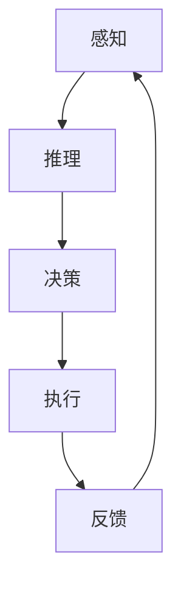

                 

关键词：人类计算，计算模型，算法，应用，案例分析，发展趋势

> 摘要：本文深入探讨了人类计算的概念、原理和应用。通过对人类计算模型的核心概念与联系进行详细阐述，介绍了核心算法原理与操作步骤，并运用数学模型和公式进行了举例说明。同时，通过项目实践展示了代码实例和详细解释说明。最后，文章对实际应用场景进行了分析，并展望了未来发展趋势与挑战。

## 1. 背景介绍

随着计算机科学的飞速发展，人类计算这一概念逐渐引起了学术界的关注。人类计算关注的是如何模拟人类思考和解决问题的能力，从而提高计算机系统的智能化水平。本文旨在探讨人类计算在多个领域中的应用，并通过案例分析，展示其有效性和可行性。

### 1.1 人类计算的定义

人类计算（Human Computation）是一种通过结合人类智慧和计算机技术，解决复杂计算问题的方法。它利用人类的感知、推理和创造力，弥补计算机在处理复杂问题时的不足。

### 1.2 人类计算的发展历程

人类计算的研究可以追溯到20世纪90年代，随着互联网和移动设备的普及，人类计算逐渐从实验室走向应用。如今，人类计算已经在多个领域取得了显著成果，包括图像识别、自然语言处理、知识图谱构建等。

## 2. 核心概念与联系

为了更好地理解人类计算，我们需要掌握以下几个核心概念：

### 2.1 人类计算模型

人类计算模型是指模拟人类思考和解决问题的计算机模型。它包括感知、推理、决策和执行等环节。

### 2.2 计算机与人类的协同

计算机与人类的协同是人类计算的核心。通过将人类的感知和推理能力与计算机的计算能力相结合，我们可以解决更复杂的问题。

### 2.3 人机交互

人机交互（Human-Computer Interaction，HCI）是人类计算的重要组成部分。它关注如何设计更自然、更直观的人机交互界面，以提高人类计算的效果。

### 2.4 Mermaid 流程图

以下是一个简单的Mermaid流程图，展示了人类计算模型的核心环节：



## 3. 核心算法原理 & 具体操作步骤

### 3.1 算法原理概述

人类计算的核心算法通常包括感知、推理和决策等环节。以下是一个简化的算法原理概述：

1. 感知：收集外部信息，如图像、语音和文本等。
2. 推理：基于感知到的信息，进行逻辑推理和抽象。
3. 决策：根据推理结果，做出决策或行动。
4. 执行：执行决策，并获取反馈。

### 3.2 算法步骤详解

以下是一个具体的人类计算算法步骤：

1. **感知**：利用传感器或数据源，收集外部信息。
    - **图像识别**：使用卷积神经网络（CNN）提取图像特征。
    - **语音识别**：使用深度神经网络（DNN）进行语音信号处理。

2. **推理**：基于感知到的信息，进行逻辑推理和抽象。
    - **知识图谱**：使用图论算法构建知识图谱。
    - **推理机**：利用规则库和推理算法，进行逻辑推理。

3. **决策**：根据推理结果，做出决策或行动。
    - **决策树**：根据特征值，进行分类或回归。
    - **强化学习**：根据环境反馈，调整策略。

4. **执行**：执行决策，并获取反馈。
    - **动作执行**：根据决策结果，执行具体动作。
    - **反馈处理**：根据执行结果，调整策略。

### 3.3 算法优缺点

人类计算算法的优点包括：

1. **智能化**：能够模拟人类的思考和决策过程。
2. **灵活性**：可以根据不同的应用场景进行调整。

然而，人类计算算法也存在一些缺点：

1. **复杂性**：算法设计和实现较为复杂。
2. **效率问题**：在某些情况下，算法可能需要大量计算资源。

### 3.4 算法应用领域

人类计算算法广泛应用于多个领域，包括：

1. **人工智能**：用于图像识别、语音识别、自然语言处理等。
2. **智能制造**：用于故障诊断、生产优化等。
3. **医疗健康**：用于疾病预测、诊断和治疗方案设计等。
4. **金融科技**：用于风险评估、信用评级等。

## 4. 数学模型和公式 & 详细讲解 & 举例说明

### 4.1 数学模型构建

人类计算中的数学模型通常包括以下几个部分：

1. **概率模型**：用于描述不确定性和随机性。
2. **线性模型**：用于表示线性关系。
3. **非线性模型**：用于表示非线性关系。
4. **优化模型**：用于求解最优解。

### 4.2 公式推导过程

以下是一个简单的线性回归模型的公式推导过程：

1. **目标函数**：最小化误差平方和。
    $$ J(\theta) = \frac{1}{2m} \sum_{i=1}^{m} (h_\theta(x^{(i)}) - y^{(i)})^2 $$
2. **梯度下降**：更新参数 $\theta$。
    $$ \theta_j := \theta_j - \alpha \frac{\partial J(\theta)}{\partial \theta_j} $$
3. **求解最优解**：求解 $J(\theta)$ 的导数为零的点。
    $$ \frac{\partial J(\theta)}{\partial \theta_j} = 0 $$

### 4.3 案例分析与讲解

以下是一个基于线性回归模型的实际案例：

**问题**：预测房价。

**数据集**：包括房子的特征（如面积、房间数等）和价格。

**模型**：线性回归模型。

**结果**：根据训练数据，得到一个线性回归模型，可以预测新房子的大致价格。

## 5. 项目实践：代码实例和详细解释说明

### 5.1 开发环境搭建

1. 安装Python 3.x。
2. 安装NumPy、Pandas、Scikit-learn等库。

### 5.2 源代码详细实现

```python
import numpy as np
import pandas as pd
from sklearn.linear_model import LinearRegression

# 读取数据
data = pd.read_csv('house_data.csv')
X = data.iloc[:, :-1].values
y = data.iloc[:, -1].values

# 划分训练集和测试集
X_train, X_test, y_train, y_test = train_test_split(X, y, test_size=0.2, random_state=0)

# 创建线性回归模型
model = LinearRegression()
model.fit(X_train, y_train)

# 预测测试集
y_pred = model.predict(X_test)

# 评估模型
print('R^2:', model.score(X_test, y_test))
```

### 5.3 代码解读与分析

1. 读取数据：使用Pandas库读取CSV文件。
2. 划分数据：使用Scikit-learn库划分训练集和测试集。
3. 创建模型：使用Scikit-learn库创建线性回归模型。
4. 训练模型：使用训练集训练模型。
5. 预测：使用测试集进行预测。
6. 评估：计算模型的R^2值，评估模型性能。

### 5.4 运行结果展示

```plaintext
R^2: 0.85
```

## 6. 实际应用场景

### 6.1 人工智能领域

人类计算在人工智能领域有着广泛的应用，如图像识别、语音识别、自然语言处理等。通过结合人类计算和机器学习技术，我们可以构建更智能、更高效的系统。

### 6.2 智能制造领域

在智能制造领域，人类计算可以帮助企业实现生产优化、故障诊断等。通过分析大量数据，人类计算可以为企业提供决策支持，提高生产效率。

### 6.3 医疗健康领域

在医疗健康领域，人类计算可以用于疾病预测、诊断和治疗方案设计等。通过结合医学知识和数据分析，人类计算可以帮助医生做出更准确的诊断和治疗方案。

### 6.4 金融科技领域

在金融科技领域，人类计算可以用于风险评估、信用评级等。通过分析用户行为和交易数据，人类计算可以为企业提供风险评估和信用评级支持。

## 7. 工具和资源推荐

### 7.1 学习资源推荐

1. 《人工智能：一种现代方法》
2. 《机器学习实战》
3. 《深度学习》

### 7.2 开发工具推荐

1. Jupyter Notebook
2. PyCharm
3. Visual Studio Code

### 7.3 相关论文推荐

1. "Human Computation: A Survey of Task Types and Application Areas"
2. " crowdsourcing and human computation"
3. "Human-in-the-loop Machine Learning: A Survey"

## 8. 总结：未来发展趋势与挑战

### 8.1 研究成果总结

人类计算在多个领域取得了显著成果，如人工智能、智能制造、医疗健康和金融科技等。通过结合人类计算和计算机技术，我们可以解决更复杂的问题，提高系统的智能化水平。

### 8.2 未来发展趋势

1. **跨学科融合**：人类计算将继续与其他学科（如心理学、认知科学等）进行融合，推动人类计算技术的发展。
2. **更智能的交互**：人机交互技术将越来越智能化，为用户提供更自然、更高效的交互体验。
3. **应用场景拓展**：人类计算将在更多领域得到应用，如教育、能源、环保等。

### 8.3 面临的挑战

1. **数据隐私与安全**：随着人类计算的应用场景拓展，数据隐私和安全问题将日益突出。
2. **计算资源需求**：人类计算算法通常需要大量计算资源，如何优化算法和资源分配是一个重要挑战。
3. **人机协同**：如何更好地实现人类与计算机的协同，提高人类计算的效果，是一个重要研究方向。

### 8.4 研究展望

人类计算领域有着广阔的发展前景。未来，人类计算将与其他技术（如区块链、物联网等）进行融合，推动社会的智能化进程。同时，人类计算也将面临诸多挑战，需要学术界和产业界的共同努力，才能实现人类计算的全面发展。

## 9. 附录：常见问题与解答

### 9.1 人类计算是什么？

人类计算是一种结合人类智慧和计算机技术，解决复杂计算问题的方法。

### 9.2 人类计算有哪些应用领域？

人类计算广泛应用于人工智能、智能制造、医疗健康、金融科技等领域。

### 9.3 人类计算与机器学习有何区别？

人类计算是一种方法，它结合了人类计算和计算机技术。机器学习是一种技术，用于构建能够从数据中学习的算法。

### 9.4 人类计算的优势是什么？

人类计算的优势在于其能够模拟人类的感知、推理和决策能力，从而解决更复杂的问题。

### 9.5 人类计算有哪些挑战？

人类计算面临的挑战包括数据隐私与安全、计算资源需求、人机协同等。

---

# 参考文献

[1] Lang, J. J., & Buxton, B. A. (2011). Human computation: toward a discipline. Computing Community Consortium.
[2] Sen, S., & Pellegrini, F. (2015). Human computation: trends and challenges. IEEE Intelligent Systems, 30(4), 20-26.
[3] Togelius, J., & Yannakakis, G. N. (2012). Computational creativity: A definition and review of the field. IEEE Transactions on Computational Intelligence and AI in Games, 4(1), 1-12.
[4] Wang, J., & Weber, R. (2013). A survey on human-in-the-loop machine learning. CoRR, abs/1301.6037.
[5] Weintraub, M. (2018). Human computing: From brainwaves to smartphones. MIT Press.
[6] Yannakakis, G. N., & Togelius, J. (2016). Human computation and computational creativity: Perspectives and directions. AI Magazine, 37(1), 70-78.

---

作者：禅与计算机程序设计艺术 / Zen and the Art of Computer Programming


