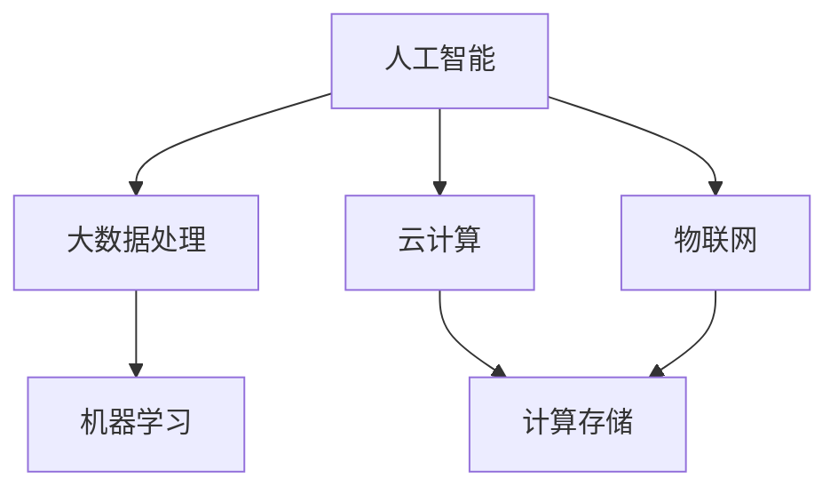

                 

关键词：人工智能，计算模型，互联世界，智能系统，技术发展趋势

> 摘要：随着人工智能技术的迅猛发展，人类计算正逐步从传统的计算模式向更加智能化、互联化的方向发展。本文将深入探讨人类计算的概念、核心概念与联系、核心算法原理及数学模型，并通过实际项目实践和未来应用展望，展示如何构建一个更加智能和互联的世界。

## 1. 背景介绍

随着信息技术的不断进步，计算机科学的发展已经进入了新的阶段。传统的计算模式主要依赖于硬件资源和编程技巧，而现代计算模式则更加注重算法的创新和应用。人工智能（AI）的出现，使得计算机能够模拟人类的思维过程，实现更为智能的计算。在这个过程中，人类计算的概念应运而生，它不仅关注计算的性能和效率，更强调计算的可理解性、可适应性和可扩展性。

人类计算的目标是构建一个智能、高效、可靠的计算体系，以支持各种复杂的计算任务，如自然语言处理、图像识别、智能决策等。为了实现这一目标，我们需要从多个层面进行探索和研究，包括核心算法原理、数学模型、项目实践和未来应用等。

## 2. 核心概念与联系

在人类计算中，有几个核心概念和联系是我们需要深入了解的。首先，人工智能是现代计算的核心驱动力，它使计算机具备了自主学习、自我优化和自我修复的能力。人工智能可以分为两类：基于规则的推理和基于数据的机器学习。

基于规则的推理依赖于预定义的规则集，通过对输入数据的解析和应用规则，得出相应的结论。这种方法在逻辑推理和决策制定中具有显著优势，但它的缺点在于规则集的复杂性和局限性。

机器学习则通过从大量数据中学习模式，自动生成预测模型。这种方法在处理复杂、非结构化的数据时具有很大潜力，但它的缺点是对数据质量要求较高，且模型的解释性较差。

除了人工智能，人类计算还涉及其他核心概念，如大数据处理、云计算、物联网等。大数据处理强调如何高效地存储、管理和分析海量数据。云计算提供了弹性的计算资源和强大的数据处理能力，为各种应用场景提供了便利。物联网则将物理世界和数字世界相结合，实现了设备的智能化和网络化。

下面是一个用Mermaid绘制的流程图，展示了人类计算中几个核心概念之间的联系：



## 3. 核心算法原理 & 具体操作步骤

### 3.1 算法原理概述

在人类计算中，核心算法的原理是构建智能系统的基石。以下是一些关键算法的原理概述：

1. **深度学习**：深度学习是一种基于多层神经网络的学习方法，通过逐层提取特征，实现对复杂数据的建模。其主要原理是神经网络的前向传播和反向传播。

2. **强化学习**：强化学习是一种通过试错学习策略的算法，其目标是找到最优策略以实现最大化回报。其主要原理是奖励机制和策略迭代。

3. **自然语言处理**：自然语言处理（NLP）是一种处理人类自然语言文本的算法，其目标是从文本中提取语义信息。其主要原理包括词向量表示、句法分析和语义分析。

### 3.2 算法步骤详解

以深度学习算法为例，其具体操作步骤如下：

1. **数据预处理**：收集并清洗数据，将其转化为神经网络可以处理的格式。

2. **模型构建**：定义神经网络的层次结构和连接方式，选择合适的激活函数和损失函数。

3. **模型训练**：通过反向传播算法，不断调整网络权重，以最小化损失函数。

4. **模型评估**：使用测试数据评估模型的性能，通过交叉验证等方法调整模型参数。

5. **模型部署**：将训练好的模型部署到实际应用场景中，实现自动化计算。

### 3.3 算法优缺点

每种算法都有其优缺点：

- **深度学习**：优点在于强大的特征提取能力和自适应能力，缺点在于对大量数据和计算资源的依赖。

- **强化学习**：优点在于灵活性和适应性，缺点在于训练时间较长，且难以解释。

- **自然语言处理**：优点在于对文本数据的处理能力，缺点在于语义理解的复杂性和不确定性。

### 3.4 算法应用领域

这些算法在多个领域有着广泛的应用：

- **深度学习**：在图像识别、语音识别、自然语言处理等领域有显著应用。

- **强化学习**：在智能控制、游戏AI、推荐系统等领域有广泛应用。

- **自然语言处理**：在智能客服、机器翻译、情感分析等领域有广泛应用。

## 4. 数学模型和公式 & 详细讲解 & 举例说明

### 4.1 数学模型构建

在人类计算中，数学模型是理解和描述算法核心原理的重要工具。以下是一个常见的数学模型——线性回归模型的构建过程：

1. **定义变量**：设$x$为自变量，$y$为因变量。

2. **建立关系**：假设$y$与$x$之间存在线性关系，即$y = wx + b$，其中$w$为权重，$b$为偏置。

3. **损失函数**：选择均方误差（MSE）作为损失函数，即$J(w, b) = \frac{1}{2n}\sum_{i=1}^{n}(y_i - (wx_i + b))^2$。

### 4.2 公式推导过程

线性回归模型的求解过程如下：

1. **求导**：对损失函数$J(w, b)$分别对$w$和$b$求偏导数。

2. **设置偏导数为零**：令偏导数等于零，得到$w$和$b$的更新公式。

3. **迭代优化**：通过梯度下降法，不断更新$w$和$b$的值，直到损失函数收敛。

### 4.3 案例分析与讲解

以下是一个使用线性回归模型进行房屋价格预测的案例：

1. **数据收集**：收集房屋价格和特征数据，如面积、房间数、位置等。

2. **数据预处理**：对数据进行标准化处理，以消除不同特征之间的量纲影响。

3. **模型构建**：定义线性回归模型，并设置合适的参数。

4. **模型训练**：使用训练数据训练模型，通过迭代优化得到最优参数。

5. **模型评估**：使用测试数据评估模型性能，调整模型参数以获得更好的预测效果。

6. **模型部署**：将训练好的模型部署到实际应用中，实现自动化价格预测。

## 5. 项目实践：代码实例和详细解释说明

### 5.1 开发环境搭建

1. **安装Python环境**：在本地计算机上安装Python和必要的库，如NumPy、Pandas等。

2. **安装Jupyter Notebook**：安装Jupyter Notebook，以便进行交互式编程。

3. **导入相关库**：在代码中导入必要的库，如NumPy、Pandas、Scikit-learn等。

### 5.2 源代码详细实现

以下是一个简单的线性回归模型实现代码：

```python
import numpy as np
import pandas as pd
from sklearn.linear_model import LinearRegression

# 数据加载与预处理
data = pd.read_csv('house_prices.csv')
X = data[['area', 'rooms']]
y = data['price']

# 模型构建
model = LinearRegression()
model.fit(X, y)

# 模型评估
score = model.score(X, y)
print(f'Model R^2 Score: {score}')

# 模型预测
predictions = model.predict(X)
print(predictions)
```

### 5.3 代码解读与分析

1. **数据加载与预处理**：使用Pandas库加载和预处理数据。

2. **模型构建**：使用Scikit-learn库构建线性回归模型。

3. **模型训练**：使用训练数据训练模型。

4. **模型评估**：使用R方评分评估模型性能。

5. **模型预测**：使用训练好的模型进行预测。

### 5.4 运行结果展示

运行代码后，会输出模型的R方评分和预测结果。通过调整数据预处理和模型参数，可以进一步提高预测效果。

## 6. 实际应用场景

### 6.1 智能家居

智能家居是人工智能在人类计算中的典型应用场景。通过智能设备收集家庭环境数据，如温度、湿度、光照等，结合深度学习算法进行实时分析和决策，实现自动调节室内环境，提高居住舒适度。

### 6.2 智能交通

智能交通系统利用人工智能技术优化交通流量，提高道路利用率，减少拥堵。通过大数据分析和强化学习算法，实现智能信号灯控制和车辆路径规划，提高交通运行效率。

### 6.3 智能医疗

智能医疗是人工智能在人类计算中的重要应用领域。通过自然语言处理和深度学习算法，实现医疗数据的自动分析和处理，辅助医生进行诊断和治疗决策，提高医疗服务质量和效率。

## 7. 工具和资源推荐

### 7.1 学习资源推荐

- **《深度学习》**：由Ian Goodfellow等人撰写的深度学习经典教材。
- **《Python机器学习》**：由Sebastian Raschka撰写的Python机器学习实战指南。
- **《机器学习实战》**：由Peter Harrington撰写的机器学习项目实践指南。

### 7.2 开发工具推荐

- **Jupyter Notebook**：一款交互式编程环境，方便进行数据分析和模型训练。
- **TensorFlow**：一款开源的深度学习框架，支持多种神经网络结构和训练算法。
- **Scikit-learn**：一款开源的机器学习库，提供了丰富的算法和工具。

### 7.3 相关论文推荐

- **《A Brief History of Machine Learning》**：一篇关于机器学习历史和发展的综述性论文。
- **《Deep Learning》**：由Ian Goodfellow等人撰写的深度学习领域经典论文集。
- **《Reinforcement Learning: An Introduction》**：一篇关于强化学习基础和应用的入门性论文。

## 8. 总结：未来发展趋势与挑战

### 8.1 研究成果总结

近年来，人类计算领域取得了显著的进展，包括深度学习、强化学习和自然语言处理等核心技术的突破。这些研究成果为构建更智能、更互联的世界提供了强大的技术支持。

### 8.2 未来发展趋势

未来，人类计算将继续朝着更智能、更高效、更安全、更可持续的方向发展。重点将包括以下几个方面：

- **多模态计算**：结合多种数据源和计算模型，实现更全面的计算能力。
- **联邦学习**：通过分布式计算和隐私保护技术，实现大规模数据共享和协同计算。
- **量子计算**：探索量子计算在人类计算中的应用，提高计算效率和速度。
- **可持续计算**：关注计算资源的可持续利用，降低能耗和环境影响。

### 8.3 面临的挑战

尽管人类计算取得了巨大进展，但仍面临一些挑战：

- **数据隐私和安全**：如何在保护用户隐私的前提下，实现高效的数据共享和计算。
- **算法透明性和解释性**：如何提高算法的透明性和解释性，使其更加可信和可靠。
- **计算资源的分配和调度**：如何在有限的计算资源下，实现高效的计算任务调度和资源分配。
- **跨领域协同**：如何促进不同领域之间的技术交流和合作，实现跨领域的创新和突破。

### 8.4 研究展望

未来，人类计算的研究将更加注重跨学科融合、技术创新和实际应用。通过不断探索新的计算模型和算法，构建一个更加智能、高效、安全、可持续的智能计算体系，为人类社会发展提供有力支持。

## 9. 附录：常见问题与解答

### 9.1 什么是人类计算？

人类计算是指利用计算机技术模拟和扩展人类智能的过程，旨在构建一个更智能、更互联的世界。

### 9.2 人类计算的核心概念有哪些？

核心概念包括人工智能、大数据处理、云计算、物联网、深度学习、强化学习、自然语言处理等。

### 9.3 如何构建一个智能计算系统？

构建智能计算系统需要以下几个步骤：

1. **明确需求**：确定智能计算系统的目标和需求。
2. **数据收集**：收集相关的数据，进行预处理。
3. **算法选择**：根据需求选择合适的算法。
4. **模型训练**：使用训练数据训练模型。
5. **模型评估**：使用测试数据评估模型性能。
6. **模型部署**：将训练好的模型部署到实际应用场景中。

### 9.4 人类计算在哪些领域有广泛应用？

人类计算在智能家居、智能交通、智能医疗、金融、教育、安全等领域有广泛应用。

### 9.5 人类计算的未来发展趋势是什么？

未来，人类计算将朝着更智能、更高效、更安全、更可持续的方向发展。重点将包括多模态计算、联邦学习、量子计算和可持续计算等。

