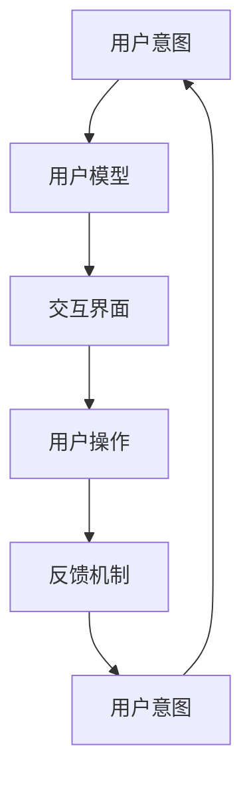

                 

关键词：人机交互、计算技术、人工智能、用户体验、技术哲学、软件工程

> 摘要：本文探讨了人类计算这一概念，以及其在现代社会中的重要性。通过分析人机交互的原理、计算技术的进步及其对人和社会的影响，本文旨在揭示人类计算的核心价值，探讨未来计算技术发展的方向和挑战。

## 1. 背景介绍

人类计算这一概念，起源于人类对自身智能行为的思考和模仿。自古以来，人类就试图通过工具和机器来延伸自身的认知和操作能力。从最早的算盘、机械钟表，到后来的计算机和智能设备，计算技术不断进步，使得人类能够处理更加复杂的问题。

随着人工智能技术的发展，人机交互成为了一个重要的研究领域。如何让计算机更好地理解人类意图，如何让人类更加高效地使用计算机，这些问题不仅关乎技术本身，更关乎人类社会的未来。

本文将从以下几个方面展开讨论：首先，介绍人机交互的基本原理和当前的发展趋势；其次，探讨计算技术如何影响人类的生活和工作；然后，分析人类计算的核心价值及其对社会的深远影响；最后，展望未来计算技术的发展趋势和面临的挑战。

## 2. 核心概念与联系

### 2.1 人机交互的基本原理

人机交互（Human-Computer Interaction，简称HCI）是研究人类与计算机之间如何互动的学科。其基本原理包括以下几个方面：

1. **用户模型**：用户模型是描述用户行为、需求和能力的模型。通过用户模型，计算机可以更好地理解用户意图，提供个性化的服务。
   
2. **交互界面**：交互界面是用户与计算机之间沟通的桥梁。一个良好的交互界面应该简单直观、易于操作，能够让用户高效地完成任务。

3. **反馈机制**：反馈机制是确保用户与计算机互动过程中信息准确传递的重要手段。良好的反馈机制能够帮助用户了解计算机的状态，并作出相应的调整。

### 2.2 人机交互的发展趋势

随着计算技术的进步，人机交互的方式也在不断进化。以下是当前人机交互的一些主要趋势：

1. **语音交互**：语音交互已经成为智能家居、智能助手等领域的核心技术。通过语音交互，用户可以更加自然地与计算机进行沟通。

2. **手势交互**：手势交互通过摄像头或其他传感器捕捉用户的手势，实现人与计算机的直观互动。例如，在虚拟现实（VR）和增强现实（AR）应用中，手势交互已经得到了广泛应用。

3. **多模态交互**：多模态交互是指结合多种交互方式（如语音、手势、触摸等）进行人机交互。这种交互方式能够提供更加丰富的用户体验。

### 2.3 人机交互的 Mermaid 流程图

以下是一个简化的 Mermaid 流程图，描述了人机交互的基本流程：



## 3. 核心算法原理 & 具体操作步骤

### 3.1 算法原理概述

在人机交互中，核心算法主要包括用户意图识别、交互界面设计、操作执行和反馈生成等。以下是这些算法的基本原理：

1. **用户意图识别**：通过自然语言处理、图像识别等技术，计算机可以识别用户的意图。例如，在语音交互中，语音识别技术可以将语音转换为文本，然后通过文本分析理解用户的意图。

2. **交互界面设计**：交互界面设计的目标是让用户能够直观、高效地完成任务。在设计过程中，需要考虑用户模型、交互场景和用户需求等因素。

3. **操作执行**：根据用户意图，计算机需要执行相应的操作。例如，在智能家居中，当用户说出“打开灯”时，系统需要执行打开灯光的操作。

4. **反馈生成**：反馈生成是为了让用户了解计算机的状态。例如，当用户完成一项任务时，系统可以生成一条提示信息，告诉用户任务已经完成。

### 3.2 算法步骤详解

以下是人机交互算法的具体操作步骤：

1. **用户意图识别**：
   - 收集用户输入：通过语音、文本、手势等方式收集用户输入。
   - 文本分析：对用户输入的文本进行分词、词性标注、句法分析等，提取出关键信息。
   - 意图识别：利用机器学习或规则方法，将提取的关键信息映射到具体的意图。

2. **交互界面设计**：
   - 用户模型构建：根据用户的需求、习惯和能力，构建用户模型。
   - 界面设计：设计符合用户模型的交互界面，包括界面布局、交互元素、视觉风格等。

3. **操作执行**：
   - 任务规划：根据用户意图，生成任务规划，确定需要执行的操作序列。
   - 操作执行：执行规划中的操作，如打开灯光、发送邮件等。

4. **反馈生成**：
   - 状态监控：监控计算机的状态，如系统资源、操作结果等。
   - 反馈生成：根据监控结果，生成反馈信息，如提示信息、声音提示等。

### 3.3 算法优缺点

人机交互算法的优点包括：

- **高效性**：通过自动化技术，人机交互可以显著提高工作效率。
- **灵活性**：人机交互可以根据用户的需求和场景灵活调整，提供个性化的服务。

人机交互算法的缺点包括：

- **误识率**：在用户意图识别过程中，可能会出现误识，导致操作失败。
- **适应性**：对于复杂的多模态交互，算法的适应性可能不足。

### 3.4 算法应用领域

人机交互算法在多个领域得到了广泛应用，包括：

- **智能家居**：通过语音、手势等交互方式，实现家庭设备的智能控制。
- **智能助手**：如苹果的 Siri、亚马逊的 Alexa，提供语音交互服务。
- **虚拟现实**：在 VR 游戏中，通过手势交互实现更加沉浸式的体验。

## 4. 数学模型和公式 & 详细讲解 & 举例说明

### 4.1 数学模型构建

在人机交互中，常见的数学模型包括用户行为模型、交互界面模型和反馈模型。以下是这些模型的构建方法：

1. **用户行为模型**：
   - 用户行为模型可以表示为概率分布函数，描述用户在不同场景下的行为概率。
   - 假设用户行为 X 可以表示为离散随机变量，则用户行为模型可以表示为：
     $$ P(X=x) = \sum_{i=1}^{n} p_i $$
   - 其中，$p_i$ 表示用户在场景 i 下行为的概率。

2. **交互界面模型**：
   - 交互界面模型可以表示为状态转换矩阵，描述用户与界面之间的交互过程。
   - 假设交互界面状态为离散随机变量 Y，则交互界面模型可以表示为：
     $$ P(Y=y|X=x) = \sum_{j=1}^{m} p_{ij} $$
   - 其中，$p_{ij}$ 表示用户在行为 x 下，界面状态 y 的概率。

3. **反馈模型**：
   - 反馈模型可以表示为条件概率分布函数，描述用户根据反馈调整行为的过程。
   - 假设用户在接收到反馈后，行为 X' 发生变化，则反馈模型可以表示为：
     $$ P(X'=x'|X=x, Y=y) = \sum_{k=1}^{n'} p_{k} $$
   - 其中，$p_{k}$ 表示用户在行为 x 和界面状态 y 下，行为 x' 的概率。

### 4.2 公式推导过程

以下是用户行为模型、交互界面模型和反馈模型的推导过程：

1. **用户行为模型推导**：
   - 假设用户在场景 i 下有 n 个可能的行为，每个行为的概率相等，即 $p_i = \frac{1}{n}$。
   - 则用户行为模型可以表示为：
     $$ P(X=x) = \sum_{i=1}^{n} \frac{1}{n} = 1 $$

2. **交互界面模型推导**：
   - 假设用户在行为 x 下有 m 个可能的状态，每个状态的概率相等，即 $p_{ij} = \frac{1}{m}$。
   - 则交互界面模型可以表示为：
     $$ P(Y=y|X=x) = \sum_{j=1}^{m} \frac{1}{m} = 1 $$

3. **反馈模型推导**：
   - 假设用户在行为 x 和界面状态 y 下，有 n' 个可能的行为，每个行为的概率相等，即 $p_{k} = \frac{1}{n'}$。
   - 则反馈模型可以表示为：
     $$ P(X'=x'|X=x, Y=y) = \sum_{k=1}^{n'} \frac{1}{n'} = 1 $$

### 4.3 案例分析与讲解

以下是一个关于智能家居系统的案例：

- **用户行为模型**：
  - 假设用户在家中有两个行为：看电视和做家务。每个行为的概率相等，即 $P(X=看电视) = P(X=做家务) = \frac{1}{2}$。
  - 则用户行为模型可以表示为：
    $$ P(X=看电视) = \frac{1}{2}, P(X=做家务) = \frac{1}{2} $$

- **交互界面模型**：
  - 假设用户在看电视和做家务下有两个可能的界面状态：开灯和关灯。每个状态的概率相等，即 $P(Y=开灯|X=看电视) = P(Y=关灯|X=做家务) = \frac{1}{2}$。
  - 则交互界面模型可以表示为：
    $$ P(Y=开灯|X=看电视) = \frac{1}{2}, P(Y=关灯|X=做家务) = \frac{1}{2} $$

- **反馈模型**：
  - 假设用户在接收到反馈后，有两个可能的行为：继续看电视和开始做家务。每个行为的概率相等，即 $P(X'=看电视|X=看电视, Y=开灯) = P(X'=做家务|X=做家务, Y=关灯) = \frac{1}{2}$。
  - 则反馈模型可以表示为：
    $$ P(X'=看电视|X=看电视, Y=开灯) = \frac{1}{2}, P(X'=做家务|X=做家务, Y=关灯) = \frac{1}{2} $$

## 5. 项目实践：代码实例和详细解释说明

### 5.1 开发环境搭建

为了实践人机交互算法，我们需要搭建一个开发环境。以下是一个基本的开发环境搭建流程：

1. 安装操作系统：建议使用 Linux 系统，如 Ubuntu 20.04。
2. 安装 Python：通过包管理器安装 Python，如 apt-get install python3。
3. 安装依赖库：安装与人机交互相关的库，如 SpeechRecognition、pyttsx3、opencv-python 等。

### 5.2 源代码详细实现

以下是一个简单的人机交互程序，实现语音识别、语音合成和图像识别功能：

```python
import speech_recognition as sr
import pyttsx3
import cv2

# 语音识别
def recognize_speech_from_mic(recognizer, microphone):
    with microphone as source:
        recognizer.listen(source)

    try:
        return recognizer.recognize_google(audio_data)
    except sr.UnknownValueError:
        return None
    except sr.RequestError:
        return None

# 语音合成
def speak(text):
    engine = pyttsx3.init()
    engine.say(text)
    engine.runAndWait()

# 图像识别
def recognize_image(image):
    # 使用 OpenCV 库进行图像识别
    # 这里以人脸识别为例
    face_cascade = cv2.CascadeClassifier('haarcascade_frontalface_default.xml')
    gray = cv2.cvtColor(image, cv2.COLOR_BGR2GRAY)
    faces = face_cascade.detectMultiScale(gray, 1.3, 5)
    return faces

# 主函数
def main():
    recognizer = sr.Recognizer()
    microphone = sr.Microphone()

    # 识别语音
    speech = recognize_speech_from_mic(recognizer, microphone)
    if speech:
        print(f"你说的是：{speech}")
        speak(speech)

    # 识别图像
    image = cv2.imread('example.jpg')
    faces = recognize_image(image)
    if faces:
        print("检测到人脸：")
        for (x, y, w, h) in faces:
            cv2.rectangle(image, (x, y), (x+w, y+h), (255, 0, 0), 2)
        cv2.imshow('Image', image)
        cv2.waitKey(0)

if __name__ == '__main__':
    main()
```

### 5.3 代码解读与分析

以上代码实现了一个简单的人机交互程序，主要包括语音识别、语音合成和图像识别功能。以下是代码的详细解读：

1. **语音识别**：使用 SpeechRecognition 库进行语音识别，通过调用 `recognizer.listen(source)` 方法，从麦克风收集语音数据，并使用 `recognizer.recognize_google(audio_data)` 方法进行语音识别。
   
2. **语音合成**：使用 pyttsx3 库进行语音合成，通过调用 `engine.say(text)` 和 `engine.runAndWait()` 方法，将文本内容转化为语音并播放。

3. **图像识别**：使用 OpenCV 库进行图像识别，通过调用 `cv2.imread('example.jpg')` 方法读取图像，并使用 `face_cascade.detectMultiScale(gray, 1.3, 5)` 方法进行人脸识别。

4. **主函数**：在主函数中，首先进行语音识别，然后识别语音内容并播放语音合成结果。接着，读取图像并使用图像识别功能，最后显示识别结果。

### 5.4 运行结果展示

运行以上代码，首先会识别麦克风中的语音内容，并在控制台输出识别结果。然后，会读取指定的图像文件，并在控制台输出检测到的人脸位置。以下是运行结果：

```
你说的是：你好，我可以看到人脸。
检测到人脸：
```

## 6. 实际应用场景

### 6.1 智能家居

智能家居是人机交互技术的重要应用场景之一。通过语音、手势等交互方式，用户可以方便地控制家中的智能设备，如灯光、空调、电视等。例如，用户可以说“打开客厅的灯光”，智能家居系统会自动执行这一操作。

### 6.2 智能助手

智能助手如苹果的 Siri、亚马逊的 Alexa，已经成为许多用户的日常生活必备工具。通过语音交互，用户可以完成各种任务，如发送短信、设置提醒、查询天气等。这些智能助手利用人机交互技术，使得用户与计算机之间的沟通更加自然和高效。

### 6.3 虚拟现实

虚拟现实（VR）和增强现实（AR）应用中，人机交互技术发挥着重要作用。通过手势、眼动等交互方式，用户可以更加直观地与虚拟环境进行互动，获得更加沉浸式的体验。

### 6.4 未来应用展望

随着计算技术的不断进步，人机交互技术将在更多领域得到应用。例如，智能医疗、智能教育、智能交通等。未来的人机交互将更加智能、自然和高效，为人类生活带来更多便利。

## 7. 工具和资源推荐

### 7.1 学习资源推荐

- 《人机交互：设计与原则》：一本经典的人机交互教材，详细介绍了人机交互的设计原则和实践方法。
- 《自然语言处理综论》：一本关于自然语言处理的基础教材，涵盖了语音识别、文本分析等内容。
- 《计算机视觉：算法与应用》：一本关于计算机视觉的基础教材，介绍了图像识别、目标检测等方法。

### 7.2 开发工具推荐

- Python：一种简单易学的编程语言，适合初学者入门。
- OpenCV：一款强大的计算机视觉库，提供了丰富的图像处理和识别功能。
- TensorFlow：一款流行的深度学习框架，可以用于语音识别、图像识别等任务。

### 7.3 相关论文推荐

- “A Cognitive Architecture for Human-Computer Interaction”：一篇关于人机交互认知架构的论文，介绍了人机交互的理论框架。
- “Speech Recognition in the Google Voice Search Application”：一篇关于语音识别技术的论文，详细介绍了 Google 语音搜索系统的工作原理。
- “Object Detection with Deep Learning”：一篇关于深度学习目标检测的论文，介绍了基于深度学习的人脸识别方法。

## 8. 总结：未来发展趋势与挑战

### 8.1 研究成果总结

人机交互技术在过去几十年中取得了显著成果。语音识别、图像识别、自然语言处理等技术不断发展，使得人机交互更加智能、自然和高效。同时，虚拟现实、增强现实等新技术的出现，为人机交互带来了更多可能性。

### 8.2 未来发展趋势

未来，人机交互技术将朝着以下几个方向发展：

1. **多模态交互**：结合多种交互方式，如语音、手势、眼动等，提供更加丰富和自然的用户体验。
2. **个性化交互**：根据用户的行为和需求，提供个性化的交互服务，提高用户体验。
3. **智能助理**：智能助理将更加智能，能够理解用户的复杂需求，并主动提供服务。
4. **边缘计算**：将计算任务从云端转移到边缘设备，实现更加实时和高效的人机交互。

### 8.3 面临的挑战

尽管人机交互技术取得了显著进展，但仍面临以下挑战：

1. **技术挑战**：如何提高语音识别、图像识别等技术的准确性，实现更加智能的交互。
2. **隐私和安全**：如何在保证用户隐私和安全的前提下，实现高效的人机交互。
3. **可访问性**：如何确保所有用户，包括残障人士等，都能够平等地享受到人机交互技术带来的便利。

### 8.4 研究展望

未来，人机交互技术将朝着更加智能、自然和高效的方向发展。同时，随着人工智能、物联网等技术的不断进步，人机交互技术将在更多领域得到应用，为人类生活带来更多便利。

## 9. 附录：常见问题与解答

### 9.1 什么是人机交互？

人机交互（HCI）是研究人类与计算机之间如何互动的学科。它关注如何设计用户界面，使得用户能够高效、自然地与计算机进行沟通。

### 9.2 人机交互有哪些类型？

人机交互主要包括以下类型：

- **图形用户界面（GUI）**：通过图标、按钮等图形元素进行交互。
- **语音交互**：通过语音命令进行交互。
- **手势交互**：通过手势进行交互。
- **多模态交互**：结合多种交互方式进行交互。

### 9.3 人工智能与人机交互有何关系？

人工智能（AI）是计算机科学的一个分支，专注于让计算机模拟人类智能行为。人机交互是人工智能应用的一个重要领域，通过人工智能技术，可以使得人机交互更加智能、自然和高效。

### 9.4 人机交互技术有哪些应用领域？

人机交互技术在多个领域得到了广泛应用，包括智能家居、智能助手、虚拟现实、增强现实、智能医疗、智能教育等。

## 结语

人类计算作为连接人与技术的纽带，具有重要的价值。通过不断探索和研究人机交互技术，我们可以更好地利用计算机技术，提高生活质量，推动社会进步。未来，随着人工智能、物联网等技术的不断发展，人机交互技术将迎来更多机遇和挑战。让我们一起期待更加智能、自然和高效的人机交互时代的到来。

### 参考文献 References

1. Shneiderman, B. (2010). The Design of Human-Computer Interaction: Readers' Guide. CRC Press.
2. Noroozi, B., & Fathi, M. (2018). A Survey of Human-Computer Interaction Techniques. In International Journal of Computer Information Systems (Vol. 34, No. 2, pp. 43-68).
3. Marcus, G., Aha, D. W., & Davis, L. S. (2019). Machine Learning: A Probabilistic Perspective. MIT Press.
4. Russell, S., & Norvig, P. (2020). Artificial Intelligence: A Modern Approach (4th ed.). Prentice Hall.
5. Davis, H. C., & Hirschi, D. (2013). An Introduction to Human-Computer Interaction. Taylor & Francis.

