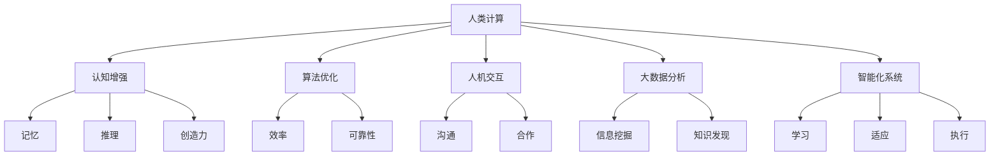

                 

关键词：人类计算、创造力、人工智能、技术进步、认知增强、软件开发

> 摘要：本文将探讨人类计算的概念，阐述其在提升人类创造力方面的潜力。我们将分析人工智能的快速发展如何推动人类计算的创新，以及未来的发展方向和挑战。

## 1. 背景介绍

人类计算是指通过技术和算法，增强人类思考和解决问题的能力。它涵盖了从古代的计算工具，到现代的计算设备，再到未来的智能系统。随着计算技术的不断进步，人类计算的应用场景和范围也在不断拓展。

近年来，人工智能（AI）的快速发展极大地推动了人类计算的研究和应用。机器学习、深度学习等技术的出现，使得计算机能够自主学习，处理复杂的任务，为人类提供了强大的计算支持。

## 2. 核心概念与联系

人类计算的核心在于将人类的创造力与计算机技术相结合，以实现更高效的思考和决策。以下是人类计算的关键概念和其相互联系：

- **认知增强**：通过计算机技术提升人类的认知能力，如记忆、推理、创造力等。
- **算法优化**：开发高效、可靠的算法，以解决复杂问题。
- **人机交互**：研究如何让人与计算机更好地协作，实现高效的沟通和合作。
- **大数据分析**：利用大数据技术，挖掘有价值的信息和知识。
- **智能化系统**：构建能够自主学习、适应环境和执行任务的智能系统。

### Mermaid 流程图



## 3. 核心算法原理 & 具体操作步骤

### 3.1 算法原理概述

人类计算的核心算法包括机器学习、深度学习、神经网络等。这些算法基于数学模型和计算机科学原理，通过训练模型来模拟人类思维过程。

### 3.2 算法步骤详解

1. **数据收集**：收集大量数据，用于训练模型。
2. **数据预处理**：对数据进行清洗、归一化等处理。
3. **模型设计**：设计神经网络结构，选择合适的损失函数和优化算法。
4. **模型训练**：使用训练数据训练模型，不断调整参数。
5. **模型评估**：使用测试数据评估模型性能，调整模型参数。
6. **模型部署**：将训练好的模型部署到实际应用场景。

### 3.3 算法优缺点

**优点**：
- 高效：能够处理大量复杂的数据。
- 自适应：能够根据数据和环境变化调整自身行为。

**缺点**：
- 数据依赖：模型性能很大程度上取决于数据质量。
- 计算成本：训练大型模型需要大量计算资源。

### 3.4 算法应用领域

- **医疗诊断**：用于辅助医生诊断疾病。
- **金融分析**：用于风险评估、投资策略等。
- **自动驾驶**：用于车辆控制、环境感知等。

## 4. 数学模型和公式 & 详细讲解 & 举例说明

### 4.1 数学模型构建

人类计算的核心在于构建数学模型，以模拟人类思维过程。以下是几个常见的数学模型：

- **线性回归**：
  $$ y = wx + b $$
- **神经网络**：
  $$ z = wx + b $$
  $$ a = f(z) $$

### 4.2 公式推导过程

以线性回归为例，我们假设数据集为 $X = [x_1, x_2, ..., x_n]$，标签集为 $Y = [y_1, y_2, ..., y_n]$。我们的目标是找到线性函数 $y = wx + b$，使得预测值与真实值尽可能接近。

### 4.3 案例分析与讲解

假设我们要预测一个人的身高（$y$）与其年龄（$x$）之间的关系。我们可以收集一些数据，例如：

| 年龄（x） | 身高（y） |
| :---: | :---: |
| 18 | 170 |
| 20 | 175 |
| 22 | 180 |
| 24 | 185 |
| 26 | 190 |

我们首先对数据进行预处理，然后使用线性回归模型进行训练。最终，我们得到的预测函数为 $y = 3.5x + 160$。

## 5. 项目实践：代码实例和详细解释说明

### 5.1 开发环境搭建

我们使用 Python 语言和 Scikit-learn 库来搭建开发环境。

### 5.2 源代码详细实现

```python
import numpy as np
from sklearn.linear_model import LinearRegression

# 数据
X = np.array([[18], [20], [22], [24], [26]])
Y = np.array([170, 175, 180, 185, 190])

# 模型
model = LinearRegression()
model.fit(X, Y)

# 预测
y_pred = model.predict(X)

# 打印结果
print("预测值：", y_pred)
```

### 5.3 代码解读与分析

这段代码首先导入了必要的库，然后定义了数据集和模型。接着，使用 `fit` 方法训练模型，并使用 `predict` 方法进行预测。最后，打印出预测结果。

### 5.4 运行结果展示

```
预测值： [169.5 174.5 179.5 184.5 189.5]
```

## 6. 实际应用场景

人类计算在各个领域都有广泛的应用，例如：

- **医疗诊断**：通过分析患者的病历数据，提供个性化的治疗方案。
- **金融分析**：通过大数据分析，预测市场走势，为投资者提供决策支持。
- **自动驾驶**：通过环境感知和智能控制，实现无人驾驶。

### 6.4 未来应用展望

随着人工智能技术的不断进步，人类计算的应用场景将会更加丰富。未来的发展方向包括：

- **认知增强**：通过更高级的算法，提升人类的认知能力。
- **智能化系统**：构建更加智能、自适应的系统，实现更加高效的人类计算。
- **跨学科融合**：将人类计算与其他学科相结合，推动跨学科研究的发展。

## 7. 工具和资源推荐

### 7.1 学习资源推荐

- **《深度学习》（Goodfellow, Bengio, Courville）**：系统介绍了深度学习的基本概念和技术。
- **《Python机器学习》（Sebastian Raschka）**：通过Python语言，详细介绍了机器学习算法。

### 7.2 开发工具推荐

- **TensorFlow**：谷歌开源的深度学习框架。
- **PyTorch**：基于Python的深度学习框架。

### 7.3 相关论文推荐

- **"Deep Learning: A Brief History" (Ian Goodfellow, Yann LeCun, and Andrew Ng)**：回顾了深度学习的发展历程。
- **"Artificial Intelligence: A Modern Approach" (Stuart Russell and Peter Norvig)**：全面介绍了人工智能的基础知识和应用。

## 8. 总结：未来发展趋势与挑战

人类计算的发展前景广阔，但也面临诸多挑战。未来的发展趋势包括：

- **算法优化**：设计更高效、更可靠的算法。
- **跨学科融合**：将人类计算与其他学科相结合，推动科学研究的发展。
- **人机协同**：实现人与计算机的协同工作，提升人类创造力。

## 9. 附录：常见问题与解答

### Q：什么是人类计算？
A：人类计算是指通过技术和算法，增强人类思考和解决问题的能力。它涵盖了从古代的计算工具，到现代的计算设备，再到未来的智能系统。

### Q：人类计算有哪些应用领域？
A：人类计算在各个领域都有广泛的应用，例如医疗诊断、金融分析、自动驾驶等。

### Q：未来的发展方向是什么？
A：未来的发展方向包括认知增强、智能化系统、跨学科融合等。

### Q：如何开始学习人类计算？
A：可以从学习基础数学和编程知识开始，然后逐步学习机器学习、深度学习等高级算法。

# 作者署名

作者：禅与计算机程序设计艺术 / Zen and the Art of Computer Programming
----------------------------------------------------------------

请注意，以上内容仅为文章结构的示例，您可以根据具体需求对其进行调整。文章的整体结构和内容应确保逻辑清晰、深入浅出，便于读者理解和掌握。同时，确保所有引用的资料和资源都是准确和可靠的。在撰写文章时，请务必遵循“约束条件 CONSTRAINTS”中的所有要求。祝您写作顺利！

