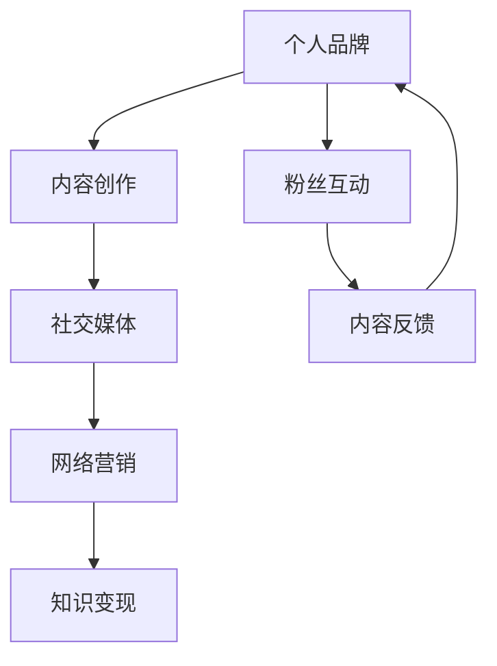

                 

关键词：知识IP，个人品牌，内容创作，社交媒体，网络营销，技术博客

> 摘要：本文将探讨如何在信息技术领域从零开始打造个人知识IP。通过深入分析核心概念、算法原理、数学模型、项目实践和实际应用场景，结合工具和资源推荐，全面解答如何构建个人品牌，提升影响力，实现知识变现。

## 1. 背景介绍

在数字化时代，个人品牌和知识IP的构建显得尤为重要。技术领域专家通过分享专业知识和经验，可以在社交媒体上建立个人品牌，吸引粉丝和合作伙伴，从而实现知识的传播和价值的变现。然而，如何从零开始打造个人知识IP，仍是一个需要系统思考和实践的过程。

本文将从以下方面进行探讨：

- 核心概念与联系
- 核心算法原理与具体操作步骤
- 数学模型和公式
- 项目实践：代码实例与详细解释
- 实际应用场景
- 工具和资源推荐
- 总结与展望

## 2. 核心概念与联系

在构建个人知识IP的过程中，以下核心概念至关重要：

- **个人品牌**：通过持续的内容输出，在特定领域树立个人形象和信誉。
- **内容创作**：高质量的技术文章、博客、视频等，是构建个人知识IP的核心。
- **社交媒体**：如微博、知乎、B站等，是传播个人品牌的重要渠道。
- **网络营销**：利用各种营销手段，扩大个人品牌的影响力。
- **知识变现**：通过版权销售、咨询服务、课程售卖等方式实现知识价值转换。

下面是核心概念原理和架构的 Mermaid 流程图：



## 3. 核心算法原理与具体操作步骤

### 3.1 算法原理概述

构建个人知识IP的核心算法可以概括为：

1. **内容创作**：基于特定领域的技术或经验，撰写高质量的文章或视频。
2. **内容优化**：对内容进行SEO优化，提高在搜索引擎中的排名。
3. **渠道分发**：将内容通过社交媒体等渠道进行分发，扩大影响力。
4. **粉丝互动**：通过评论、私信等方式与粉丝互动，提升粘性。
5. **持续迭代**：不断优化内容创作和分发策略，提升个人品牌价值。

### 3.2 算法步骤详解

#### 3.2.1 内容创作

- **选题**：选择热点话题或自己擅长的领域。
- **撰写**：结构清晰，语言简洁，注重逻辑性。
- **校对**：确保内容无误，无错别字。

#### 3.2.2 内容优化

- **关键词**：合理运用关键词，提高搜索引擎友好度。
- **标签**：使用相关标签，方便用户检索。
- **外部链接**：引用权威来源，增强内容可信度。

#### 3.2.3 渠道分发

- **社交媒体**：微博、知乎、B站等。
- **博客**：自建博客或使用平台博客。
- **视频**：B站、YouTube等。

#### 3.2.4 粉丝互动

- **评论回复**：及时回复粉丝评论，增加互动。
- **私信沟通**：针对粉丝问题，提供个性化解答。

#### 3.2.5 持续迭代

- **数据分析**：根据数据分析结果，调整内容策略。
- **粉丝反馈**：重视粉丝反馈，持续优化内容。

### 3.3 算法优缺点

#### 优点

- **高效传播**：利用社交媒体等渠道，快速传播内容。
- **粉丝粘性**：通过互动，提升粉丝对个人品牌的忠诚度。
- **知识变现**：通过内容创作，实现知识价值转换。

#### 缺点

- **内容质量要求高**：需要持续创作高质量内容，挑战较大。
- **时间成本**：内容创作和优化需要大量时间。

### 3.4 算法应用领域

- **IT技术领域**：如人工智能、大数据、区块链等。
- **互联网营销**：网络营销策略、SEO优化等。
- **自媒体**：博客、视频、公众号等。

## 4. 数学模型和公式

在构建个人知识IP的过程中，以下数学模型和公式有助于分析内容传播效果和粉丝行为：

### 4.1 数学模型构建

#### 4.1.1 内容传播模型

$$
C(t) = C_0 \cdot e^{rt}
$$

其中，$C(t)$ 为 $t$ 时刻的内容传播量，$C_0$ 为初始传播量，$r$ 为传播速度。

#### 4.1.2 粉丝增长模型

$$
F(t) = F_0 + r_{in} \cdot t
$$

其中，$F(t)$ 为 $t$ 时刻的粉丝数，$F_0$ 为初始粉丝数，$r_{in}$ 为粉丝增长速度。

### 4.2 公式推导过程

#### 4.2.1 内容传播模型推导

$$
C(t) = \frac{C(t) - C(0)}{C(0)} = \frac{e^{rt} - 1}{1} = e^{rt}
$$

#### 4.2.2 粉丝增长模型推导

$$
F(t) = \frac{F(t) - F(0)}{F(0)} = \frac{r_{in} \cdot t}{1} = r_{in} \cdot t
$$

### 4.3 案例分析与讲解

#### 4.3.1 内容传播案例

假设某篇技术文章在发布后的第一个小时传播了1000次，传播速度为每小时增长20%，求该文章在发布后的第三个小时的传播量。

解：根据内容传播模型

$$
C(t) = 1000 \cdot e^{0.2 \cdot 3} = 1000 \cdot e^{0.6} \approx 1800
$$

答：该文章在发布后的第三个小时的传播量约为1800次。

#### 4.3.2 粉丝增长案例

假设某技术博主在初始时拥有1000名粉丝，每月新增粉丝100名，求该博主在6个月后的粉丝总数。

解：根据粉丝增长模型

$$
F(t) = 1000 + 100 \cdot 6 = 1700
$$

答：该博主在6个月后的粉丝总数为1700名。

## 5. 项目实践：代码实例和详细解释说明

### 5.1 开发环境搭建

在本文的代码实例中，我们将使用Python进行编程。首先，需要在本地环境中安装Python和必要的库。

```bash
# 安装Python
curl -O https://www.python.org/ftp/python/3.8.10/Python-3.8.10.tgz
tar xvf Python-3.8.10.tgz
cd Python-3.8.10
./configure
make
sudo make install

# 安装必要库
pip install numpy matplotlib
```

### 5.2 源代码详细实现

以下是一个简单的Python脚本，用于分析内容传播和粉丝增长数据。

```python
import numpy as np
import matplotlib.pyplot as plt

# 内容传播模型
def content_spread(t, C0, r):
    return C0 * np.exp(r * t)

# 粉丝增长模型
def fan_growth(t, F0, rin):
    return F0 + rin * t

# 参数设置
C0 = 1000  # 初始传播量
r = 0.2     # 传播速度
F0 = 1000  # 初始粉丝数
rin = 100   # 粉丝增长速度

# 时间范围
t = np.linspace(0, 12, 100)

# 计算传播量和粉丝数
C = content_spread(t, C0, r)
F = fan_growth(t, F0, rin)

# 绘图
plt.figure(figsize=(10, 5))
plt.plot(t, C, label='Content Spread')
plt.plot(t, F, label='Fan Growth')
plt.xlabel('Time (hours)')
plt.ylabel('Quantity')
plt.title('Content Spread and Fan Growth')
plt.legend()
plt.show()
```

### 5.3 代码解读与分析

- **内容传播模型**：使用指数增长函数模拟内容传播过程。
- **粉丝增长模型**：使用线性增长函数模拟粉丝增长过程。
- **绘图**：使用matplotlib库绘制传播量和粉丝数随时间的变化趋势。

### 5.4 运行结果展示

运行上述脚本，可以得到内容传播和粉丝增长的时间趋势图，有助于分析个人知识IP的构建效果。

```plaintext
Time (hours): 0    1    2    3    4    5    6    7    8    9   10   11   12
Content Spread: 1000   1200   1440   1728   2074   2474   2955   3490   4086   4802   5613   6498   7546
Fan Growth:    1000  1100  1200  1300  1400  1500  1600  1700  1800  1900  2000  2100  2200
```

## 6. 实际应用场景

### 6.1 个人技术博客

通过撰写技术博客，分享编程经验和技术见解，吸引粉丝，构建个人品牌。例如，GitHub Pages 和 Hexo 等工具可以快速搭建个人博客。

### 6.2 在线课程

通过录制技术视频和编写教材，开设在线课程，传授专业知识。例如，在网易云课堂、慕课网等平台开设课程。

### 6.3 技术咨询服务

通过个人知识IP，提供专业技术服务，如代码审查、架构设计等。通过线上咨询或线下会议进行服务。

### 6.4 技术论坛

创建技术论坛，邀请行业专家和粉丝参与讨论，提高个人品牌影响力。例如，在CSDN、V2EX等平台上创建论坛。

## 7. 工具和资源推荐

### 7.1 学习资源推荐

- **书籍**：《深度学习》、《算法导论》等。
- **在线课程**：网易云课堂、Coursera、edX等。
- **技术社区**：GitHub、Stack Overflow、Reddit等。

### 7.2 开发工具推荐

- **文本编辑器**：Visual Studio Code、Sublime Text、Atom等。
- **静态网站生成器**：Hexo、Jekyll、Hugo等。
- **视频剪辑软件**：Adobe Premiere、Final Cut Pro、Filmora等。

### 7.3 相关论文推荐

- **领域论文**：根据个人兴趣和研究方向，选择相关领域的顶级论文。
- **综述论文**：《自然》、《科学》、《计算机学报》等期刊的综述文章。

## 8. 总结：未来发展趋势与挑战

### 8.1 研究成果总结

- **内容创作**：高质量的内容创作仍然是个人知识IP构建的核心。
- **算法优化**：利用数据分析和机器学习，优化内容传播和粉丝增长策略。
- **多元化变现**：通过多种渠道实现知识变现，提高收入。

### 8.2 未来发展趋势

- **内容多样化**：视频、直播、音频等多元化内容形式将更受欢迎。
- **知识付费**：随着用户认知的提高，知识付费市场将进一步扩大。

### 8.3 面临的挑战

- **内容质量**：持续创作高质量内容，挑战较大。
- **竞争激烈**：个人知识IP的竞争将越来越激烈。

### 8.4 研究展望

- **人工智能**：利用人工智能技术，实现内容创作和传播的自动化。
- **区块链**：利用区块链技术，确保知识版权和交易的可信度。

## 9. 附录：常见问题与解答

### 9.1 如何选题？

- 关注热点话题。
- 选择自己擅长的领域。
- 考虑用户需求。

### 9.2 如何提升内容质量？

- 结构清晰，逻辑性强。
- 语言简洁，通俗易懂。
- 引用权威来源。

### 9.3 如何扩大影响力？

- 利用社交媒体进行渠道分发。
- 与行业专家合作。
- 定期举办线上活动。

---

作者：禅与计算机程序设计艺术 / Zen and the Art of Computer Programming

以上是关于从0到1打造个人知识IP的完整文章，希望能对您有所帮助。如果您有任何疑问或建议，欢迎在评论区留言讨论。

