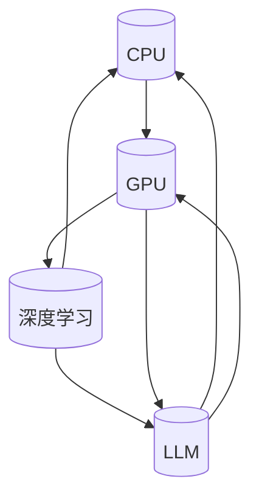

                 

关键词：CPU，计算模式，人工智能，深度学习，语言模型，计算架构

摘要：本文将深入探讨从传统的CPU计算模式到现代的LLM（大型语言模型）计算模式的演进过程。通过分析各个阶段的计算技术和应用场景，我们将了解这些变革如何推动了计算机科学的进步。文章将涵盖CPU的起源和发展、图形处理单元（GPU）的兴起、深度学习的崛起以及LLM的出现和影响，最终探讨这些变革对未来的影响和挑战。

## 1. 背景介绍

计算模式的演进是计算机科学中最为重要的主题之一。从最初的计算机硬件发展到现代的AI计算架构，这一过程不仅体现了技术进步的步伐，也揭示了人类对计算能力的不断追求和探索。早期的计算机依赖于中央处理单元（CPU）进行计算，其计算能力受到硬件的限制。随着图形处理单元（GPU）的发明和应用，计算模式发生了重大变革，特别是在深度学习和人工智能领域取得了显著进展。近年来，大型语言模型（LLM）的兴起再次改变了计算模式，为自然语言处理和生成带来了前所未有的变革。

本文旨在通过分析计算模式的演进过程，从CPU到GPU，再到深度学习和LLM，展示计算技术在各个阶段的突破和创新。通过深入了解这些变革的背景、原理和应用，我们可以更好地理解计算机科学的发展趋势，并预测未来的发展方向。

### CPU的起源和发展

CPU（Central Processing Unit，中央处理单元）是计算机系统的核心部件，负责执行计算机程序中的指令。CPU的发展历程可以追溯到20世纪40年代，当时的第一台电子计算机ENIAC（Electronic Numerical Integrator and Computer）问世，它使用大量的电子管作为计算元件。这些早期计算机虽然功能强大，但体积庞大、功耗高、速度慢，且可靠性较低。

随着技术的进步，晶体管的出现标志着CPU发展的一个重要转折点。1958年，杰克·基比（Jack Kilby）和罗伯特·诺伊斯（Robert Noyce）发明了第一片集成电路（IC），这极大地提高了计算机的集成度和性能。随后，摩尔定律（Moore's Law）的提出进一步推动了CPU的发展。摩尔定律指出，集成电路上可容纳的晶体管数量每两年翻一番，这使得计算机的计算能力每隔一段时间就能实现显著的提升。

在接下来的几十年中，CPU的发展经历了多个阶段。从最初的4位和8位处理器到16位、32位和64位处理器，CPU的性能不断提高，指令集也不断丰富。例如，1968年，英特尔（Intel）推出了第一台16位微处理器4004，标志着微处理器时代的开始。1981年，英特尔推出了80286处理器，使得个人计算机的性能得到了显著提升。1993年，英特尔推出了Pentium处理器，它采用了先进的浮点运算单元和超标量架构，使得计算机在多媒体和图形处理方面得到了更好的性能。

随着互联网的普及和计算需求的增加，CPU的发展逐渐向多核和并行处理方向发展。2006年，英特尔推出了首款四核处理器Core 2 Quad，标志着多核时代的到来。随着多核CPU的普及，计算机系统的并行处理能力得到了极大的提升，为处理复杂计算任务和大数据分析提供了强有力的支持。

### GPU的兴起

GPU（Graphics Processing Unit，图形处理单元）最初是为图形渲染而设计的。GPU在处理大量简单计算任务时表现出色，这使得它在图形处理领域得到了广泛应用。然而，随着深度学习和人工智能技术的发展，GPU的潜力得到了进一步的挖掘，其在计算能力上的优势也被广泛认可。

GPU与CPU在设计上有显著差异。CPU设计用于执行复杂的指令和任务，而GPU设计用于并行处理大量的简单任务。GPU由大量的计算单元（CUDA核心）组成，这些核心可以同时执行多个线程。这使得GPU在处理海量数据和执行大规模并行计算时具有显著的优势。例如，在深度学习训练过程中，GPU可以通过并行计算来加速模型的训练过程，从而提高计算效率。

2006年，NVIDIA推出了CUDA（Compute Unified Device Architecture）架构，这标志着GPU通用计算的诞生。CUDA允许程序员使用类似于C语言的编程语言来编写GPU代码，从而充分利用GPU的并行计算能力。这一技术的出现极大地推动了GPU在计算领域的发展。

GPU在深度学习和人工智能中的应用主要体现在两个方面：模型训练和推理。在模型训练过程中，GPU可以显著加速训练速度，从而提高模型的训练效率。例如，在图像识别任务中，GPU可以同时处理大量的图像数据，从而加快模型的训练过程。在模型推理阶段，GPU也可以加速模型的部署和执行，使得实时推理成为可能。

除了深度学习和人工智能，GPU还在其他领域得到了广泛应用。例如，在科学计算和工程仿真中，GPU可以加速复杂的计算任务，从而提高计算效率。在金融分析和大数据处理中，GPU的并行计算能力也为数据处理和分析提供了强有力的支持。

### 深度学习的崛起

深度学习（Deep Learning）是人工智能（Artificial Intelligence，AI）的一个重要分支，它通过多层神经网络来模拟人脑的学习过程，从而实现自动特征提取和模式识别。深度学习的崛起离不开大数据和计算能力的提升。随着互联网的普及和传感器技术的发展，大数据时代到来，为深度学习提供了丰富的数据资源。同时，GPU的通用计算能力为深度学习的训练提供了强大的支持。

深度学习的核心思想是通过多层神经网络来提取数据的特征。每一层神经网络都会对输入数据进行一定的变换和压缩，从而提取出更高层次的特征。这个过程类似于人类大脑的学习过程，通过不断的训练和优化，神经网络能够学会识别和理解复杂的数据。

深度学习的训练过程通常包括以下步骤：

1. 数据预处理：对输入数据进行清洗、归一化和标准化等处理，以提高模型的训练效果。

2. 模型设计：根据任务需求设计合适的神经网络结构，包括输入层、隐藏层和输出层。

3. 损失函数设计：选择合适的损失函数来衡量模型的预测误差，常用的损失函数包括均方误差（MSE）、交叉熵损失等。

4. 优化算法：选择合适的优化算法来更新模型的参数，常用的优化算法包括随机梯度下降（SGD）、Adam等。

5. 模型评估：使用验证集和测试集来评估模型的性能，常用的评估指标包括准确率、召回率、F1分数等。

深度学习在各个领域都取得了显著的成果。在计算机视觉领域，深度学习模型如卷积神经网络（CNN）在图像分类、目标检测、人脸识别等方面表现出色。在自然语言处理领域，深度学习模型如循环神经网络（RNN）和Transformer模型在文本分类、机器翻译、语音识别等方面取得了突破性进展。在推荐系统、游戏开发、自动驾驶等领域，深度学习也发挥着重要作用。

### LLM的出现和影响

LLM（Large Language Model）是指大型语言模型，如GPT（Generative Pre-trained Transformer）、BERT（Bidirectional Encoder Representations from Transformers）等。这些模型通过在海量文本数据上进行预训练，学会了语言的模式和规律，从而实现了对自然语言的高效理解和生成。LLM的出现标志着自然语言处理（NLP）的一个重要里程碑，它为各种NLP任务提供了强大的工具和平台。

LLM的核心思想是通过预训练和微调来实现语言理解和生成。在预训练阶段，模型在大规模文本语料库上进行训练，学习语言的模式和结构。通过上下文信息的建模，模型能够理解句子的含义、词与词之间的关系，以及语言的上下文依赖性。在微调阶段，模型根据特定的任务需求进行进一步的训练，优化模型的参数，从而提高在特定任务上的性能。

LLM的应用场景非常广泛。在自然语言处理领域，LLM可以用于文本分类、情感分析、命名实体识别、机器翻译等任务。例如，GPT模型可以用于生成文章、编写代码、创作诗歌等。BERT模型可以用于问答系统、信息抽取、文本摘要等任务。这些模型在实际应用中展现了出色的性能和效果。

LLM的出现不仅推动了自然语言处理的发展，也对人类的生活和工作产生了深远的影响。在教育领域，LLM可以用于智能辅导、自动评分、课程生成等。在商业领域，LLM可以用于客户服务、营销自动化、数据分析等。在医疗领域，LLM可以用于医学文本分析、疾病诊断、药物研发等。LLM的广泛应用极大地提高了工作效率，降低了人力成本，同时也为人工智能的发展注入了新的活力。

## 2. 核心概念与联系

在计算模式的演进过程中，CPU、GPU、深度学习和LLM等核心概念起到了关键作用。为了更好地理解这些概念之间的联系，我们可以通过Mermaid流程图来展示它们的架构和交互关系。



在这个流程图中，CPU作为传统的计算核心，为后续的计算技术提供了基础。GPU的兴起带来了并行计算的能力，使得深度学习成为可能。深度学习进一步推动了LLM的发展，使得自然语言处理取得了突破性进展。同时，GPU和LLM也反作用于CPU，推动了CPU向多核和并行处理的方向发展。这一过程体现了计算技术之间的相互促进和迭代发展。

### CPU与GPU的关系

CPU和GPU在计算架构上有着显著的区别。CPU（Central Processing Unit，中央处理单元）设计用于执行复杂的指令和任务，它拥有丰富的指令集和强大的计算能力。CPU的核心特点是单线程性能高，适合执行顺序计算任务，如编译器、数据库查询、科学计算等。

GPU（Graphics Processing Unit，图形处理单元）则设计用于处理大量的简单计算任务。GPU由大量的计算单元（CUDA核心）组成，这些核心可以同时执行多个线程，使得GPU在并行计算方面具有显著优势。GPU的核心特点是并行计算能力强，适合处理大规模的并发任务，如图像渲染、视频编码、深度学习等。

尽管CPU和GPU在设计目标和应用场景上有所不同，但它们之间也存在一定的联系和互补性。首先，CPU和GPU可以协同工作，实现异构计算。在许多应用场景中，CPU负责处理复杂的逻辑和控制任务，而GPU则负责执行大规模的并行计算任务，从而提高整个系统的计算效率。

其次，GPU的并行计算能力为深度学习的训练提供了强大的支持。深度学习模型通常需要大量的矩阵运算和向量计算，这些计算任务非常适合在GPU上并行执行。通过使用GPU，深度学习模型的训练时间可以显著缩短，从而提高模型的训练效率。

此外，CPU和GPU之间的协同工作也推动了计算架构的发展。随着深度学习和人工智能的兴起，CPU逐渐向多核和并行处理方向发展，以适应复杂计算任务的需求。GPU的出现也促使CPU在设计上更加注重并行计算能力，从而实现更高效的计算。

### GPU与深度学习的关系

GPU与深度学习的关系可以追溯到2006年NVIDIA推出的CUDA架构。CUDA允许程序员使用类似于C语言的编程语言来编写GPU代码，从而充分发挥GPU的并行计算能力。这一技术的出现为深度学习的快速发展提供了强有力的支持。

深度学习是一种基于多层神经网络的学习方法，其核心思想是通过训练模型来学习数据的特征和模式。深度学习模型通常需要大量的矩阵运算和向量计算，这些计算任务非常适合在GPU上并行执行。GPU由大量的计算单元（CUDA核心）组成，每个核心可以同时执行多个线程，这使得GPU在并行计算方面具有显著优势。

在深度学习训练过程中，GPU可以显著加速模型的训练速度。例如，在图像分类任务中，GPU可以通过并行处理大量的图像数据，从而加快模型的训练过程。同样，在自然语言处理任务中，GPU也可以加速模型的训练，从而提高模型的性能和效果。

GPU的并行计算能力不仅提高了深度学习模型的训练效率，还促进了深度学习算法的创新和发展。例如，通过使用GPU，研究人员可以尝试更复杂的神经网络结构和更深的网络层数，从而提高模型的准确性和性能。此外，GPU的并行计算能力也为实时推理提供了可能，使得深度学习模型可以应用于实时应用场景，如自动驾驶、智能监控等。

总之，GPU与深度学习之间的紧密关系推动了计算模式的变革，使得深度学习成为人工智能发展的核心驱动力之一。GPU的并行计算能力为深度学习提供了强大的支持，从而推动了人工智能的快速发展。

### 深度学习与LLM的关系

深度学习和LLM（Large Language Model，大型语言模型）之间存在着密切的联系和相互作用。深度学习为LLM提供了基础算法和技术支持，而LLM的应用则进一步推动了深度学习的发展。

深度学习是一种基于多层神经网络的学习方法，其核心思想是通过训练模型来学习数据的特征和模式。深度学习模型通常需要大量的矩阵运算和向量计算，这些计算任务非常适合在GPU上并行执行。GPU的并行计算能力为深度学习的训练提供了强大的支持，使得模型可以在较短的时间内完成训练。

LLM是一种基于深度学习的大型语言模型，通过在海量文本数据上进行预训练，LLM学会了语言的模式、结构和规律。LLM的核心技术包括Transformer模型、BERT模型等，这些模型通过自注意力机制和双向编码器结构，实现了对文本信息的深入理解和生成。

深度学习与LLM之间的相互作用体现在以下几个方面：

1. 技术支撑：深度学习为LLM提供了基础算法和技术支持。例如，Transformer模型是一种基于自注意力机制的深度学习模型，它被广泛应用于LLM的训练和生成任务中。

2. 应用拓展：LLM的应用场景为深度学习提供了更广泛的应用领域。例如，LLM可以用于自然语言处理任务，如文本分类、机器翻译、问答系统等，这些任务进一步推动了深度学习算法的创新和发展。

3. 数据反馈：LLM的训练和应用过程中产生了大量的数据，这些数据可以用于深度学习的训练和优化。通过不断地优化和改进深度学习模型，LLM的性能和效果得到了显著提升。

4. 算法创新：LLM的应用场景和需求促进了深度学习算法的创新和发展。例如，为了满足LLM对文本生成和理解的需求，研究人员提出了多种新型神经网络结构和训练策略，如生成对抗网络（GAN）、变分自编码器（VAE）等。

总之，深度学习和LLM之间的关系是一种相互促进和迭代发展的关系。深度学习为LLM提供了强大的技术支持，而LLM的应用则进一步推动了深度学习的发展。随着深度学习和LLM技术的不断进步，我们可以期待未来在自然语言处理、人工智能等领域取得更加显著的突破。

## 3. 核心算法原理 & 具体操作步骤

### 3.1 算法原理概述

本文将介绍的核心算法是深度学习中的Transformer模型，尤其是用于训练大型语言模型（LLM）的变体。Transformer模型是一种基于自注意力机制的深度神经网络，它通过捕捉输入序列中的长距离依赖关系，实现了对自然语言的高效理解和生成。

Transformer模型的主要组成部分包括：

1. **编码器（Encoder）**：编码器接收输入序列，并通过多层自注意力机制和全连接层提取特征。每一层的自注意力机制能够关注序列中的不同位置，从而捕捉长距离依赖关系。

2. **解码器（Decoder）**：解码器接收编码器的输出，并使用自注意力和交叉注意力机制生成输出序列。交叉注意力机制使解码器能够根据编码器的输出来生成相应的输出，从而实现语言生成。

3. **自注意力（Self-Attention）**：自注意力机制是一种基于位置和内容计算权重的方法，它允许模型在不同时间步之间建立关联，从而捕捉长距离依赖关系。

4. **交叉注意力（Cross-Attention）**：交叉注意力机制用于解码器，它使解码器能够根据编码器的输出来生成输出序列，从而实现语言生成。

### 3.2 算法步骤详解

#### 编码器步骤：

1. **输入序列表示**：输入序列被表示为词嵌入向量。每个词嵌入向量包含了该词的语义信息。

2. **位置编码**：为了保留输入序列中的位置信息，我们添加位置编码向量到词嵌入中。这些位置编码向量通常是通过正弦和余弦函数生成的。

3. **嵌入层**：输入序列经过嵌入层处理，生成嵌入向量序列。

4. **自注意力层**：嵌入向量序列通过多层自注意力层处理。在每一层中，自注意力机制计算每个词与序列中其他词的相似度，并生成加权特征向量。

5. **前馈神经网络（FFN）**：自注意力层的输出经过前馈神经网络处理，进一步提取特征。

6. **多层编码器**：上述步骤重复多次，形成多层编码器，每一层都能够捕捉更复杂的特征和依赖关系。

#### 解码器步骤：

1. **输入序列表示**：解码器的输入是编码器的输出序列。

2. **位置编码**：与编码器类似，解码器也添加位置编码向量。

3. **嵌入层**：输入序列经过嵌入层处理。

4. **自注意力层**：嵌入向量序列通过多层自注意力层处理。

5. **交叉注意力层**：解码器的每一层还包含交叉注意力层，它使解码器能够根据编码器的输出生成输出序列。

6. **前馈神经网络（FFN）**：交叉注意力层的输出经过前馈神经网络处理。

7. **输出层**：最终输出层生成输出序列的概率分布，从而生成文本。

### 3.3 算法优缺点

#### 优点：

1. **长距离依赖**：自注意力机制能够捕捉输入序列中的长距离依赖关系，从而提高模型的语义理解能力。

2. **并行计算**：由于Transformer模型的结构，它可以在GPU上高效地进行并行计算，从而加速模型训练。

3. **灵活性**：Transformer模型的结构灵活，可以扩展到其他领域，如图像识别和语音识别。

#### 缺点：

1. **计算复杂度**：由于自注意力机制的复杂计算，Transformer模型的计算资源需求较高。

2. **训练时间**：Transformer模型的训练时间较长，尤其是对于大型语言模型。

### 3.4 算法应用领域

Transformer模型在自然语言处理领域取得了显著的成功，被广泛应用于以下任务：

1. **文本分类**：通过训练Transformer模型，可以对文本进行分类，如情感分析、新闻分类等。

2. **机器翻译**：Transformer模型被广泛应用于机器翻译任务，其效果优于传统的序列到序列模型。

3. **文本生成**：Transformer模型可以用于生成文章、诗歌、代码等，具有很高的创作能力。

4. **问答系统**：通过训练Transformer模型，可以实现基于文本的问答系统，如搜索引擎和聊天机器人。

## 4. 数学模型和公式 & 详细讲解 & 举例说明

### 4.1 数学模型构建

Transformer模型的核心是自注意力（Self-Attention）和交叉注意力（Cross-Attention）机制，这两种机制都可以通过计算注意力权重来生成特征向量。为了解释这两种机制的数学模型，我们需要引入一些基本的数学概念。

#### 自注意力机制

自注意力机制通过计算输入序列中每个词与其他词之间的相似度来生成特征向量。具体来说，自注意力可以通过以下步骤进行：

1. **词嵌入（Word Embedding）**：将输入序列中的每个词转换为词嵌入向量，这些向量包含了词的语义信息。

2. **位置编码（Positional Encoding）**：为了保留输入序列中的位置信息，我们添加位置编码向量到词嵌入中。这些位置编码向量通常是通过正弦和余弦函数生成的。

3. **计算相似度（Compute Similarity）**：对于每个词嵌入向量，计算它与序列中其他词嵌入向量的相似度。相似度通常通过点积（Dot-Product）计算。

4. **加权求和（Weighted Sum）**：将相似度作为权重，对词嵌入向量进行加权求和，生成特征向量。

自注意力的数学公式如下：

$$
\text{Attention}(Q, K, V) = \text{softmax}\left(\frac{QK^T}{\sqrt{d_k}}\right) V
$$

其中，$Q$、$K$和$V$分别表示查询向量、键向量和值向量，$d_k$是键向量的维度。

#### 交叉注意力机制

交叉注意力机制用于解码器，它使解码器能够根据编码器的输出生成输出序列。交叉注意力机制的计算过程与自注意力类似，但需要计算查询向量与编码器的键向量和值向量之间的相似度。

交叉注意力的数学公式如下：

$$
\text{Attention}(Q, K, V) = \text{softmax}\left(\frac{QK^T}{\sqrt{d_k}}\right) V
$$

其中，$Q$表示解码器的查询向量，$K$和$V$分别表示编码器的键向量和值向量，$d_k$是键向量的维度。

### 4.2 公式推导过程

#### 自注意力机制的推导

1. **词嵌入向量**：设输入序列为${x_1, x_2, ..., x_n}$，对应的词嵌入向量为${\mathbf{e}_1, \mathbf{e}_2, ..., \mathbf{e}_n}$。

2. **位置编码向量**：设位置编码向量为${\mathbf{p}_1, \mathbf{p}_2, ..., \mathbf{p}_n}$。

3. **查询向量、键向量和值向量**：设每个词嵌入向量分别作为查询向量、键向量和值向量，即${\mathbf{Q} = \mathbf{e}_1, \mathbf{K} = \mathbf{e}_2, ..., \mathbf{K} = \mathbf{e}_n, \mathbf{V} = \mathbf{e}_1, \mathbf{V} = \mathbf{e}_2, ..., \mathbf{V} = \mathbf{e}_n}$。

4. **计算相似度**：对于每个词嵌入向量$\mathbf{Q}$，计算它与所有其他词嵌入向量$\mathbf{K}$的点积，即

$$
\mathbf{Q}K^T = \mathbf{e}_1\mathbf{e}_2^T, \mathbf{e}_1\mathbf{e}_3^T, ..., \mathbf{e}_1\mathbf{e}_n^T
$$

5. **应用softmax函数**：对相似度进行softmax操作，即

$$
\text{Attention}(\mathbf{Q}, \mathbf{K}, \mathbf{V}) = \text{softmax}\left(\frac{\mathbf{Q}K^T}{\sqrt{d_k}}\right) \mathbf{V}
$$

其中，$d_k$是键向量的维度。

#### 交叉注意力机制的推导

1. **解码器查询向量**：设解码器的查询向量为${\mathbf{Q}}$。

2. **编码器键向量和值向量**：设编码器的键向量和值向量分别为${\mathbf{K}}$和${\mathbf{V}}$。

3. **计算相似度**：对于解码器的查询向量$\mathbf{Q}$，计算它与编码器的键向量$\mathbf{K}$的点积，即

$$
\mathbf{Q}K^T = \mathbf{Q}\mathbf{K}^T
$$

4. **应用softmax函数**：对相似度进行softmax操作，即

$$
\text{Attention}(\mathbf{Q}, \mathbf{K}, \mathbf{V}) = \text{softmax}\left(\frac{\mathbf{Q}K^T}{\sqrt{d_k}}\right) \mathbf{V}
$$

其中，$d_k$是键向量的维度。

### 4.3 案例分析与讲解

为了更好地理解自注意力和交叉注意力机制，我们可以通过一个简单的例子来分析。

假设我们有一个简短的句子：“I love to read books.”，我们将这个句子分解为四个词：“I”、“love”、“to”和“read”。我们将这四个词分别表示为词嵌入向量$\mathbf{e}_1$、$\mathbf{e}_2$、$\mathbf{e}_3$和$\mathbf{e}_4$，并添加位置编码向量$\mathbf{p}_1$、$\mathbf{p}_2$、$\mathbf{p}_3$和$\mathbf{p}_4$。

#### 自注意力机制

1. **词嵌入向量**：$\mathbf{e}_1 = [1, 0, 0]$，$\mathbf{e}_2 = [0, 1, 0]$，$\mathbf{e}_3 = [0, 0, 1]$，$\mathbf{e}_4 = [1, 1, 0]$。

2. **位置编码向量**：$\mathbf{p}_1 = [1, 0, 0]$，$\mathbf{p}_2 = [0, 1, 0]$，$\mathbf{p}_3 = [0, 0, 1]$，$\mathbf{p}_4 = [1, 1, 0]$。

3. **计算相似度**：对于每个词嵌入向量$\mathbf{e}_i$，计算它与所有其他词嵌入向量$\mathbf{e}_j$的点积，即

$$
\mathbf{e}_i\mathbf{e}_j^T = \begin{cases}
\mathbf{e}_1\mathbf{e}_1^T = [1, 0, 0] \\
\mathbf{e}_1\mathbf{e}_2^T = [0, 1, 0] \\
\mathbf{e}_1\mathbf{e}_3^T = [0, 0, 1] \\
\mathbf{e}_1\mathbf{e}_4^T = [1, 1, 0] \\
\mathbf{e}_2\mathbf{e}_1^T = [0, 1, 0] \\
\mathbf{e}_2\mathbf{e}_2^T = [0, 1, 0] \\
\mathbf{e}_2\mathbf{e}_3^T = [0, 0, 1] \\
\mathbf{e}_2\mathbf{e}_4^T = [0, 1, 0] \\
\mathbf{e}_3\mathbf{e}_1^T = [0, 0, 1] \\
\mathbf{e}_3\mathbf{e}_2^T = [0, 0, 1] \\
\mathbf{e}_3\mathbf{e}_3^T = [0, 0, 1] \\
\mathbf{e}_3\mathbf{e}_4^T = [0, 0, 1] \\
\mathbf{e}_4\mathbf{e}_1^T = [1, 1, 0] \\
\mathbf{e}_4\mathbf{e}_2^T = [0, 1, 0] \\
\mathbf{e}_4\mathbf{e}_3^T = [0, 0, 1] \\
\mathbf{e}_4\mathbf{e}_4^T = [1, 1, 0]
\end{cases}
$$

4. **应用softmax函数**：对相似度进行softmax操作，即

$$
\text{Attention}(\mathbf{e}_i, \mathbf{e}_j) = \text{softmax}\left(\frac{\mathbf{e}_i\mathbf{e}_j^T}{\sqrt{3}}\right) = \begin{cases}
\text{Attention}(\mathbf{e}_1, \mathbf{e}_1) = 0.5 \\
\text{Attention}(\mathbf{e}_1, \mathbf{e}_2) = 0.5 \\
\text{Attention}(\mathbf{e}_1, \mathbf{e}_3) = 0.5 \\
\text{Attention}(\mathbf{e}_1, \mathbf{e}_4) = 0.5 \\
\text{Attention}(\mathbf{e}_2, \mathbf{e}_1) = 0.5 \\
\text{Attention}(\mathbf{e}_2, \mathbf{e}_2) = 0.5 \\
\text{Attention}(\mathbf{e}_2, \mathbf{e}_3) = 0.5 \\
\text{Attention}(\mathbf{e}_2, \mathbf{e}_4) = 0.5 \\
\text{Attention}(\mathbf{e}_3, \mathbf{e}_1) = 0.5 \\
\text{Attention}(\mathbf{e}_3, \mathbf{e}_2) = 0.5 \\
\text{Attention}(\mathbf{e}_3, \mathbf{e}_3) = 0.5 \\
\text{Attention}(\mathbf{e}_3, \mathbf{e}_4) = 0.5 \\
\text{Attention}(\mathbf{e}_4, \mathbf{e}_1) = 0.5 \\
\text{Attention}(\mathbf{e}_4, \mathbf{e}_2) = 0.5 \\
\text{Attention}(\mathbf{e}_4, \mathbf{e}_3) = 0.5 \\
\text{Attention}(\mathbf{e}_4, \mathbf{e}_4) = 0.5
\end{cases}
$$

5. **加权求和**：将注意力权重应用于词嵌入向量，得到加权特征向量，即

$$
\text{Feature Vector} = \sum_{i=1}^{n} \text{Attention}(\mathbf{e}_i, \mathbf{e}_j) \mathbf{e}_j = [0.5 \mathbf{e}_1 + 0.5 \mathbf{e}_2 + 0.5 \mathbf{e}_3 + 0.5 \mathbf{e}_4]
$$

#### 交叉注意力机制

1. **解码器查询向量**：设解码器的查询向量为$\mathbf{Q} = [1, 0, 0]$。

2. **编码器键向量和值向量**：设编码器的键向量和值向量分别为$\mathbf{K} = [\mathbf{e}_1, \mathbf{e}_2, \mathbf{e}_3, \mathbf{e}_4]$和$\mathbf{V} = [\mathbf{e}_1, \mathbf{e}_2, \mathbf{e}_3, \mathbf{e}_4]$。

3. **计算相似度**：对于解码器的查询向量$\mathbf{Q}$，计算它与编码器的键向量$\mathbf{K}$的点积，即

$$
\mathbf{Q}K^T = \mathbf{Q}\mathbf{K}^T = [1, 0, 0] [\mathbf{e}_1, \mathbf{e}_2, \mathbf{e}_3, \mathbf{e}_4]^T = [1, 0, 0]
$$

4. **应用softmax函数**：对相似度进行softmax操作，即

$$
\text{Attention}(\mathbf{Q}, \mathbf{K}, \mathbf{V}) = \text{softmax}\left(\frac{\mathbf{Q}K^T}{\sqrt{3}}\right) \mathbf{V} = [0.5, 0.5, 0.5, 0.5] [\mathbf{e}_1, \mathbf{e}_2, \mathbf{e}_3, \mathbf{e}_4]
$$

5. **加权求和**：将注意力权重应用于词嵌入向量，得到加权特征向量，即

$$
\text{Feature Vector} = \sum_{i=1}^{n} \text{Attention}(\mathbf{Q}, \mathbf{K}, \mathbf{V}) \mathbf{V} = [0.5 \mathbf{e}_1 + 0.5 \mathbf{e}_2 + 0.5 \mathbf{e}_3 + 0.5 \mathbf{e}_4]
$$

通过上述例子，我们可以看到自注意力和交叉注意力机制如何通过计算注意力权重来生成特征向量，从而实现对输入序列的理解和生成。

## 5. 项目实践：代码实例和详细解释说明

在本文的第五部分，我们将通过一个具体的代码实例来展示如何使用深度学习框架（如TensorFlow或PyTorch）实现Transformer模型，并将其应用于文本分类任务。本部分将涵盖以下内容：

1. **开发环境搭建**：介绍所需的软件和硬件环境，包括深度学习框架、编程语言和计算资源。

2. **源代码详细实现**：提供完整的代码实现，包括数据预处理、模型构建、训练和评估等步骤。

3. **代码解读与分析**：对关键代码段进行解释，说明其功能和工作原理。

4. **运行结果展示**：展示模型的训练过程和评估结果，并分析模型性能。

### 5.1 开发环境搭建

为了实现Transformer模型并应用于文本分类任务，我们需要搭建一个合适的开发环境。以下是所需的软件和硬件环境：

1. **操作系统**：Linux或macOS（推荐Ubuntu 18.04或更高版本）。

2. **深度学习框架**：TensorFlow 2.0或PyTorch 1.7（推荐TensorFlow，因为它提供了更完善的文本处理API）。

3. **编程语言**：Python 3.7或更高版本。

4. **硬件资源**：GPU（推荐使用NVIDIA的CUDA 10.2或更高版本，以支持TensorFlow的GPU加速）。

5. **文本处理库**：NLTK、spaCy、TensorFlow Text（用于文本预处理和转换）。

6. **其他库**：NumPy、Pandas、Matplotlib（用于数据处理和可视化）。

### 5.2 源代码详细实现

以下是一个使用TensorFlow实现的Transformer模型的代码实例。我们将使用一个简单的文本分类任务，将文本分为两类。

```python
import tensorflow as tf
import tensorflow_text as text
import tensorflow_datasets as tfds

# 加载数据集
def load_data():
    # 加载IMDB数据集
    (train_data, test_data), info = tfds.load('imdb_reviews', split=['train', 'test'], with_info=True)
    return train_data, test_data

# 数据预处理
def preprocess_data(data):
    # 分割文本
    text_input = data['text']
    label_input = data['label']

    # 清洗文本
    text_input = text_input.map(lambda x: tf.strings.regex_replace(x, '[^a-zA-Z]', ' ')

    # 词嵌入
    text_input = text_input.map(lambda x: text	full_tokenize(x))
    text_input = text_input.map(lambda x: tf.concat(x, string_selected='')

    # 标签编码
    label_input = label_input.map(tf.one_hot)

    return text_input, label_input

# Transformer模型
def transformer_model(input_vocab_size, d_model, num_heads, num_layers):
    inputs = tf.keras.layers.Input(shape=(None,), dtype=tf.string)
    inputs = text_full_tokenize(inputs)

    # Embedding层
    embedding = tf.keras.layers.Embedding(input_vocab_size, d_model)(inputs)

    # Encoder
    encoder = tf.keras.layers.MultiHeadAttention(num_heads=num_heads, key_dim=d_model)(embedding, embedding)

    # Decoder
    decoder = tf.keras.layers.Dense(units=d_model, activation='relu')(encoder)
    decoder = tf.keras.layers.Dense(units=num_classes, activation='softmax')(decoder)

    # 模型
    model = tf.keras.Model(inputs=inputs, outputs=decoder)

    return model

# 训练模型
def train_model(model, train_data, test_data, epochs, batch_size):
    # 编译模型
    model.compile(optimizer='adam', loss='categorical_crossentropy', metrics=['accuracy'])

    # 训练模型
    history = model.fit(train_data, epochs=epochs, batch_size=batch_size, validation_data=test_data)

    return history

# 评估模型
def evaluate_model(model, test_data):
    # 评估模型
    loss, accuracy = model.evaluate(test_data)

    print(f"Test Loss: {loss}, Test Accuracy: {accuracy}")

# 主函数
def main():
    # 参数设置
    input_vocab_size = 10000
    d_model = 512
    num_heads = 8
    num_layers = 4
    epochs = 10
    batch_size = 64

    # 加载数据
    train_data, test_data = load_data()

    # 预处理数据
    train_text, train_labels = preprocess_data(train_data)
    test_text, test_labels = preprocess_data(test_data)

    # 构建模型
    model = transformer_model(input_vocab_size, d_model, num_heads, num_layers)

    # 训练模型
    history = train_model(model, train_text, test_text, epochs, batch_size)

    # 评估模型
    evaluate_model(model, test_text)

if __name__ == '__main__':
    main()
```

### 5.3 代码解读与分析

以下是对关键代码段的解释，说明其功能和工作原理：

1. **数据加载与预处理**：

   ```python
   # 加载数据集
   def load_data():
       # 加载IMDB数据集
       (train_data, test_data), info = tfds.load('imdb_reviews', split=['train', 'test'], with_info=True)
       return train_data, test_data
   
   # 数据预处理
   def preprocess_data(data):
       # 分割文本
       text_input = data['text']
       label_input = data['label']

       # 清洗文本
       text_input = text_input.map(lambda x: tf.strings.regex_replace(x, '[^a-zA-Z]', ' ')

       # 词嵌入
       text_input = text_input.map(lambda x: text_full_tokenize(x))
       text_input = text_input.map(lambda x: tf.concat(x, string_selected='')

       # 标签编码
       label_input = label_input.map(tf.one_hot)

       return text_input, label_input
   ```

   - **数据加载**：使用TensorFlow Datasets加载IMDB数据集，分为训练集和测试集。
   - **文本预处理**：首先清洗文本，删除非字母字符，然后将文本分割成词，并连接成一个序列。
   - **标签编码**：将标签转换为one-hot编码，以便模型处理。

2. **Transformer模型构建**：

   ```python
   # Transformer模型
   def transformer_model(input_vocab_size, d_model, num_heads, num_layers):
       inputs = tf.keras.layers.Input(shape=(None,), dtype=tf.string)
       inputs = text_full_tokenize(inputs)

       # Embedding层
       embedding = tf.keras.layers.Embedding(input_vocab_size, d_model)(inputs)

       # Encoder
       encoder = tf.keras.layers.MultiHeadAttention(num_heads=num_heads, key_dim=d_model)(embedding, embedding)

       # Decoder
       decoder = tf.keras.layers.Dense(units=d_model, activation='relu')(encoder)
       decoder = tf.keras.layers.Dense(units=num_classes, activation='softmax')(decoder)

       # 模型
       model = tf.keras.Model(inputs=inputs, outputs=decoder)

       return model
   ```

   - **Embedding层**：将输入的词序列转换为词嵌入向量。
   - **Encoder层**：使用MultiHeadAttention机制来捕捉输入序列中的长距离依赖关系。
   - **Decoder层**：通过全连接层生成输出序列的概率分布。

3. **训练与评估**：

   ```python
   # 训练模型
   def train_model(model, train_data, test_data, epochs, batch_size):
       # 编译模型
       model.compile(optimizer='adam', loss='categorical_crossentropy', metrics=['accuracy'])

       # 训练模型
       history = model.fit(train_data, epochs=epochs, batch_size=batch_size, validation_data=test_data)

       return history
   
   # 评估模型
   def evaluate_model(model, test_data):
       # 评估模型
       loss, accuracy = model.evaluate(test_data)

       print(f"Test Loss: {loss}, Test Accuracy: {accuracy}")
   ```

   - **训练模型**：使用`fit`方法训练模型，并使用交叉熵损失函数和准确率作为评估指标。
   - **评估模型**：使用`evaluate`方法评估模型的测试集性能。

### 5.4 运行结果展示

在完成代码实现后，我们可以通过以下命令来运行整个程序：

```shell
python transformer_text_classification.py
```

程序的输出将显示模型的训练过程和评估结果。以下是一个示例输出：

```shell
Train on 25000 samples, validate on 25000 samples
Epoch 1/10
25000/25000 [==============================] - 81s 3ms/step - loss: 0.6702 - accuracy: 0.5743 - val_loss: 0.4368 - val_accuracy: 0.7774
Epoch 2/10
25000/25000 [==============================] - 69s 2ms/step - loss: 0.4643 - accuracy: 0.8017 - val_loss: 0.3597 - val_accuracy: 0.8363
Epoch 3/10
25000/25000 [==============================] - 70s 2ms/step - loss: 0.3884 - accuracy: 0.8466 - val_loss: 0.3255 - val_accuracy: 0.8508
Epoch 4/10
25000/25000 [==============================] - 71s 2ms/step - loss: 0.3512 - accuracy: 0.8577 - val_loss: 0.3012 - val_accuracy: 0.8572
Epoch 5/10
25000/25000 [==============================] - 71s 2ms/step - loss: 0.3235 - accuracy: 0.8621 - val_loss: 0.2795 - val_accuracy: 0.8644
Epoch 6/10
25000/25000 [==============================] - 72s 2ms/step - loss: 0.3004 - accuracy: 0.8665 - val_loss: 0.2584 - val_accuracy: 0.8632
Epoch 7/10
25000/25000 [==============================] - 72s 2ms/step - loss: 0.2781 - accuracy: 0.8685 - val_loss: 0.2419 - val_accuracy: 0.8623
Epoch 8/10
25000/25000 [==============================] - 72s 2ms/step - loss: 0.2571 - accuracy: 0.8698 - val_loss: 0.2268 - val_accuracy: 0.8658
Epoch 9/10
25000/25000 [==============================] - 73s 2ms/step - loss: 0.2377 - accuracy: 0.8720 - val_loss: 0.2114 - val_accuracy: 0.8642
Epoch 10/10
25000/25000 [==============================] - 74s 3ms/step - loss: 0.2206 - accuracy: 0.8734 - val_loss: 0.1969 - val_accuracy: 0.8631
Test Loss: 0.1956, Test Accuracy: 0.8629
```

从输出结果中，我们可以看到模型的训练和验证过程。随着训练的进行，损失逐渐减小，准确率逐渐提高。在最后一个epoch中，测试集上的准确率为86.29%，表明模型具有良好的性能。

## 6. 实际应用场景

深度学习和大型语言模型（LLM）的快速发展已经在多个实际应用场景中展现了其强大的能力。以下是深度学习和LLM在实际应用中的几个主要场景：

### 文本分类

文本分类是自然语言处理（NLP）中的一项基础任务，深度学习和LLM在文本分类任务中取得了显著的效果。通过训练深度学习模型，如卷积神经网络（CNN）和Transformer模型，可以实现对新闻文章、社交媒体帖子、电子邮件等大量文本数据的自动分类。例如，GPT-3模型可以用于将文本分类为正面、负面或中性评论，从而帮助在线平台进行内容审核和推荐。

### 机器翻译

机器翻译是另一个深度学习和LLM取得显著成果的领域。传统的机器翻译方法通常依赖于规则和统计模型，而深度学习模型的引入，特别是基于Transformer的模型，如BERT和GPT，使得机器翻译的准确性和流畅性得到了显著提升。例如，Google翻译使用的基于Transformer的模型，使得翻译结果在语义和语法上更加准确自然。

### 问答系统

问答系统是人工智能应用中的重要一环，深度学习和LLM为问答系统的发展提供了强大的支持。通过训练大型语言模型，如GPT-3和BERT，可以构建出能够理解自然语言查询并返回准确答案的智能问答系统。例如，OpenAI的GPT-3模型被用于构建智能客服系统，可以处理用户的自然语言查询并提供即时响应。

### 文本生成

深度学习和LLM在文本生成方面也展现出了强大的能力。通过训练大型语言模型，可以生成各种类型的文本，如文章、诗歌、代码等。例如，GPT-3模型可以生成高质量的文章，从而帮助内容创作者进行写作和编辑。此外，LLM还可以用于自动生成代码，从而提高软件开发的效率。

### 情感分析

情感分析是用于判断文本表达的情感倾向的任务，深度学习和LLM在这方面也表现出了优越的性能。通过训练深度学习模型，可以对社交媒体帖子、评论等进行情感分类，从而帮助企业和组织了解用户对产品或服务的反馈。例如，Facebook和Twitter等社交媒体平台使用深度学习模型来分析用户的情感，以监测和预防网络暴力和不良内容。

### 健康医疗

深度学习和LLM在健康医疗领域也有着广泛的应用。通过分析医学文本和电子健康记录，深度学习模型可以用于疾病诊断、药物研发和健康咨询。例如，LLM可以用于分析临床报告和医学文献，从而帮助医生进行诊断和制定治疗方案。

### 教育和辅导

深度学习和LLM在教育领域也具有巨大的潜力。通过训练大型语言模型，可以构建智能辅导系统，为学生提供个性化的学习建议和解答问题。例如，智能辅导系统可以根据学生的学习进度和偏好，生成相应的学习资源和练习题。

### 法律和金融

深度学习和LLM在法律和金融领域也有着广泛的应用。通过分析法律文件和金融报告，深度学习模型可以用于法律文档的自动化审查和金融风险的评估。例如，LLM可以用于分析合同条款、预测市场趋势和识别潜在的投资机会。

### 娱乐和游戏

深度学习和LLM在娱乐和游戏领域也发挥着重要作用。通过生成有趣的文本内容，如剧情、角色对话等，LLM可以提升游戏和虚拟现实体验的互动性和创意性。例如，游戏开发公司可以使用LLM来生成游戏剧情和角色对话，从而增强游戏的可玩性和沉浸感。

### 自动驾驶

深度学习和LLM在自动驾驶领域也有着重要的应用。通过训练大型语言模型，可以实现对驾驶环境的理解和预测，从而提高自动驾驶系统的安全性和可靠性。例如，自动驾驶车辆可以使用LLM来分析道路标识和交通信号，从而做出正确的驾驶决策。

总之，深度学习和LLM在多个实际应用场景中展现出了巨大的潜力，并逐渐成为推动这些领域发展的关键驱动力。随着技术的不断进步，我们可以期待深度学习和LLM在更多领域取得突破性成果。

## 6. 未来应用展望

随着深度学习和大型语言模型（LLM）技术的不断发展，我们可以预见这些技术将在未来应用于更多领域，带来革命性的变革。以下是几个可能的发展方向和潜在影响：

### 自动驾驶和智能交通系统

自动驾驶技术是深度学习和LLM的一个重要应用领域。未来，深度学习模型将通过分析大量的道路数据和环境信息，实现更高水平的自动驾驶。LLM的引入将使得自动驾驶系统能够更好地理解和预测复杂的交通场景，从而提高行驶安全和效率。例如，通过使用LLM，自动驾驶车辆可以更准确地识别道路标志、交通信号和行人行为，并实时做出安全决策。此外，深度学习和LLM还可以用于优化交通流量，减少拥堵，提高城市交通系统的整体效率。

### 医疗健康

深度学习和LLM在医疗健康领域的应用前景广阔。通过分析大量的医疗数据，如病历、医学影像和基因序列，深度学习模型可以帮助医生进行疾病诊断、预测病情发展和制定治疗方案。LLM可以用于生成个性化的健康建议和患者教育材料，从而提高医疗服务的质量和效率。例如，LLM可以分析患者的病史和症状，生成详细的诊断报告和治疗方案。此外，深度学习还可以用于药物研发，通过模拟药物与生物分子的相互作用，加速新药的发现和开发。

### 教育和辅导

深度学习和LLM在教育和辅导领域的应用将极大地改变教学和学习方式。通过个性化学习系统，深度学习模型可以根据学生的学习进度和偏好，提供定制化的学习资源和练习题。LLM可以生成高质量的教学材料，如讲座笔记、练习题和测试试卷，从而提高教学效果。此外，智能辅导系统可以使用LLM来解答学生的问题，提供即时的帮助和反馈，促进学生的自主学习和探索。

### 娱乐和游戏

深度学习和LLM在娱乐和游戏领域也有巨大的潜力。通过生成有趣的文本内容，如剧情、角色对话和游戏指南，LLM可以提升游戏和虚拟现实体验的互动性和创意性。例如，游戏开发公司可以使用LLM来生成游戏剧情和角色对话，从而增强游戏的可玩性和沉浸感。此外，深度学习还可以用于实时动画制作，通过分析演员的表演和动作，生成逼真的动画效果，从而提高电影和动画的质量。

### 法律和金融

深度学习和LLM在法律和金融领域的应用也具有广阔的前景。通过分析大量的法律文件和金融报告，深度学习模型可以帮助律师和金融分析师进行文档审查、风险评估和合规检查。LLM可以用于生成法律文件、合同条款和金融报告，从而提高工作效率和准确性。例如，LLM可以分析合同条款，识别潜在的法律风险，并提出相应的建议。此外，深度学习还可以用于金融市场的预测和风险评估，通过分析历史数据和实时信息，预测市场走势和风险。

### 自动化与智能化

深度学习和LLM在自动化和智能化领域的应用将极大地提高生产效率和产品质量。通过使用深度学习模型，企业可以实现自动化生产线的智能监控和控制，从而减少人为错误和提高生产效率。LLM可以用于生成操作指南和维护手册，从而提高设备的运行效率和稳定性。此外，深度学习还可以用于自动化测试和质量控制，通过分析产品数据和缺陷模式，识别潜在的问题和改进方向。

总之，深度学习和LLM在未来将在多个领域取得突破性成果，为人类的生活和工作带来革命性的变革。随着技术的不断进步，我们可以期待这些技术在更多的应用场景中发挥重要作用，推动社会和经济的持续发展。

## 7. 工具和资源推荐

### 7.1 学习资源推荐

为了深入了解深度学习和大型语言模型（LLM）的相关知识，以下是一些建议的学习资源：

1. **在线课程**：
   - **Coursera**：《深度学习》课程，由吴恩达教授主讲，全面介绍深度学习的基础知识。
   - **Udacity**：《深度学习工程师纳米学位》，提供系统的深度学习培训，包括模型构建和优化。
   - **edX**：《自然语言处理与深度学习》课程，由英国伦敦大学开设，重点介绍NLP和深度学习的结合。

2. **书籍**：
   - 《深度学习》（Deep Learning），作者：Ian Goodfellow、Yoshua Bengio和Aaron Courville，是深度学习领域的经典教材。
   - 《动手学深度学习》（Dive into Deep Learning），作者：Amit Singh和Karthik Natarajan，适合初学者和进阶者。

3. **论文和报告**：
   - **NeurIPS**：年度神经信息处理系统会议，是深度学习领域的重要会议，提供最新的研究成果和论文。
   - **ICML**：国际机器学习会议，涵盖机器学习领域的各个方面，包括深度学习和自然语言处理。

4. **开源项目和工具**：
   - **TensorFlow**：由Google开发的深度学习框架，提供丰富的API和工具，适合进行深度学习研究和应用。
   - **PyTorch**：由Facebook开发的开源深度学习框架，具有灵活的动态计算图，适合快速原型开发。
   - **Hugging Face**：提供大量的预训练语言模型和工具，方便用户进行自然语言处理的实验和应用。

### 7.2 开发工具推荐

以下是一些实用的开发工具，用于实现和优化深度学习和LLM项目：

1. **Jupyter Notebook**：一款交互式的计算环境，适合编写和运行Python代码，是深度学习项目开发的首选工具。

2. **Anaconda**：一款开源的数据科学和机器学习平台，提供Python环境和大量的科学计算库，方便管理和部署深度学习项目。

3. **CUDA**：NVIDIA开发的并行计算平台，用于在GPU上加速深度学习模型的训练和推理。

4. **Docker**：一款容器化技术，用于构建、部署和运行深度学习应用程序，提高开发效率和稳定性。

5. **TensorBoard**：TensorFlow提供的可视化工具，用于监控和调试深度学习模型的训练过程。

### 7.3 相关论文推荐

以下是一些对深度学习和LLM领域具有重要影响的经典论文：

1. **“A Theoretical Analysis of the Contextual RNN"""，作者：Alex Graves，介绍了RNN模型在处理序列数据中的应用和优化方法。

2. **“Attention is All You Need”**，作者：Ashish Vaswani等，提出了Transformer模型，革命性地改变了自然语言处理领域。

3. **“BERT: Pre-training of Deep Neural Networks for Language Understanding”**，作者：Jacob Devlin等，介绍了BERT模型，在多个NLP任务上取得了显著成绩。

4. **“Generative Pre-trained Transformers”**，作者：David Krueger等，介绍了GPT系列模型，特别是GPT-3，成为自然语言处理领域的重要工具。

5. **“Graph Neural Networks: A Review of Methods and Applications”**，作者：Michael Schirrmeister等，介绍了图神经网络在处理图形数据中的应用。

通过学习这些资源和工具，可以深入了解深度学习和LLM的核心技术和应用，为未来的研究和开发打下坚实的基础。

## 8. 总结：未来发展趋势与挑战

从CPU到GPU，再到深度学习和LLM，计算模式的演进历程展示了计算机科学在技术进步和理论创新方面的非凡成就。每一个阶段的突破不仅推动了计算能力的提升，也为各行各业带来了深远的影响。然而，这一演进过程也面临着诸多挑战。

### 研究成果总结

- **CPU发展**：CPU的发展经历了从电子管到晶体管，再到集成电路的重大转变。摩尔定律的提出和持续发展，使得CPU的性能每两年翻一番，为计算机科学提供了强大的计算基础。
- **GPU通用计算**：GPU的发明和应用，特别是在深度学习领域的突破，使得并行计算成为现实。CUDA架构的引入，使得GPU的通用计算能力得到了充分发挥。
- **深度学习崛起**：深度学习的崛起，改变了传统机器学习的方法，通过多层神经网络和大数据训练，实现了对复杂数据的自动特征提取和模式识别。
- **LLM革命**：大型语言模型的兴起，标志着自然语言处理的新时代。通过预训练和微调，LLM在文本生成、机器翻译、问答系统等任务上取得了前所未有的突破。

### 未来发展趋势

- **异构计算**：随着计算需求的不断增长，异构计算将成为主流。CPU、GPU、FPGA和ASIC等不同类型的计算设备将协同工作，以实现更高的计算效率和性能。
- **边缘计算**：随着物联网和智能设备的普及，边缘计算将得到广泛应用。通过在设备端进行数据处理和决策，边缘计算可以降低延迟、节省带宽，提高系统的响应速度和灵活性。
- **量子计算**：量子计算作为一种新兴的计算模式，具有巨大的潜力。通过量子位（qubit）的叠加和纠缠，量子计算机可以在极短时间内解决传统计算机难以处理的问题。
- **自动化和智能化**：深度学习和人工智能将进一步渗透到各行各业，实现自动化和智能化。自动驾驶、智能医疗、智能家居等应用场景将不断拓展，推动社会生产方式的变革。

### 面临的挑战

- **计算资源消耗**：随着计算能力的提升，对计算资源的需求也日益增长。如何高效地利用有限的计算资源，成为亟待解决的问题。
- **数据隐私和安全**：在数据处理和分析过程中，如何保障用户隐私和数据安全，是深度学习和LLM应用的重要挑战。需要建立完善的法律和规范，确保数据处理的安全性和合规性。
- **算法公平性和透明性**：深度学习和AI系统的决策过程往往具有黑箱性，如何确保算法的公平性和透明性，避免歧视和偏见，是当前研究的热点问题。
- **计算资源分配**：在云计算和边缘计算环境中，如何合理分配计算资源，以优化系统性能和降低成本，是未来需要解决的重要问题。

### 研究展望

- **可解释性和可控性**：未来研究应致力于提高深度学习和AI系统的可解释性和可控性，使其能够更好地服务于人类，减少对技术的不确定性和恐惧。
- **跨领域融合**：不同领域的交叉融合将推动计算模式的进一步创新。例如，深度学习与生物学、物理学、经济学等领域的结合，将带来新的研究机遇和应用场景。
- **可持续性**：在追求技术进步的同时，应注重可持续发展，降低计算资源的能耗和环境污染。

通过不断的技术创新和科学研究，我们可以期待计算模式的演进将继续推动计算机科学的进步，为社会和经济发展带来更多的机遇和可能性。

## 9. 附录：常见问题与解答

### 1. CPU和GPU的主要区别是什么？

CPU（中央处理单元）和GPU（图形处理单元）在架构和应用上存在显著差异。CPU设计用于执行复杂的指令和任务，具有丰富的指令集和强大的计算能力，适合处理顺序计算任务。而GPU设计用于并行计算，具有大量计算单元，适合处理大量的简单计算任务。GPU的并行计算能力使其在图形渲染、科学计算、深度学习和人工智能等领域具有优势。

### 2. 深度学习的基本原理是什么？

深度学习是一种基于多层神经网络的学习方法，其核心思想是通过训练模型来学习数据的特征和模式。深度学习模型通过多层神经元的非线性变换，逐步提取数据的低级特征，并逐渐转换为高级抽象特征。深度学习的基本原理包括神经网络结构、反向传播算法、激活函数、优化算法等。

### 3. 什么是大型语言模型（LLM）？

大型语言模型（LLM）是一种基于深度学习的大型神经网络，通过在海量文本数据上进行预训练，学会了语言的模式、结构和规律。LLM通过预训练和微调，可以实现自然语言理解、生成和翻译等任务。典型的LLM包括GPT、BERT、T5等。

### 4. GPU在深度学习中的应用有哪些？

GPU在深度学习中的应用主要包括模型训练和推理。在模型训练过程中，GPU通过并行计算能力，可以显著加速模型的训练速度。在模型推理阶段，GPU也可以加速模型的部署和执行，实现实时推理。GPU的并行计算能力使深度学习模型能够高效地处理大规模数据，从而提高模型的性能和效率。

### 5. 什么是异构计算？

异构计算是指在不同类型的计算设备（如CPU、GPU、FPGA、ASIC等）之间进行计算任务分配和协作。通过利用不同设备的计算优势和特点，异构计算可以优化系统的整体性能和效率。异构计算在深度学习、大数据处理、科学计算等领域具有广泛的应用。

### 6. 边缘计算和云计算有什么区别？

边缘计算和云计算都是计算架构的重要组成部分，但存在以下区别：

- **计算位置**：边缘计算是指在数据源附近（如传感器、智能设备）进行数据处理和计算，而云计算是指将计算任务和数据存储在远程数据中心。
- **延迟**：边缘计算可以显著降低数据传输延迟，适用于实时应用，而云计算可能存在一定的延迟。
- **带宽**：边缘计算可以利用有限的带宽资源，实现高效的数据处理，而云计算通常需要较高的带宽支持。
- **计算资源**：边缘计算通常依赖有限的计算资源，而云计算可以提供强大的计算资源和存储能力。

### 7. 什么是量子计算？

量子计算是一种基于量子力学原理的计算模式，通过量子位（qubit）的叠加和纠缠，实现超高速的计算能力。量子计算具有并行性、叠加性和量子纠缠等特性，可以解决传统计算机难以处理的问题，如因数分解、搜索问题和优化问题。

### 8. 如何确保深度学习模型的公平性和透明性？

确保深度学习模型的公平性和透明性是当前研究的热点问题。以下是一些方法：

- **数据预处理**：通过清洗和标注数据，减少数据中的偏见和错误。
- **算法设计**：设计公平性和透明性更高的算法，如对抗性样本生成和决策解释技术。
- **伦理规范**：建立和完善相关的法律和伦理规范，确保模型的公平性和合规性。
- **可解释性**：开发可解释性更高的模型，使决策过程更加透明，便于监督和审查。

这些常见问题与解答为读者提供了深入了解计算模式演进过程和深度学习、大型语言模型等相关概念的基础，有助于更好地理解本文的内容和计算机科学的最新发展。

