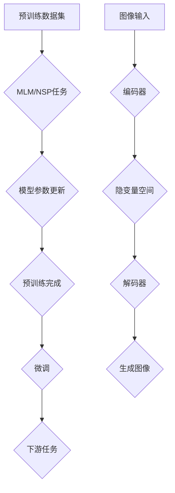

                 

关键词：人工智能，大模型，GPT，DALL-E，创业生态，技术趋势，算法原理

> 摘要：本文旨在探讨人工智能领域中的大型预训练模型，如GPT和DALL-E，如何通过其强大的能力和创新性应用，正在深刻地改变创业生态。本文首先介绍了GPT和DALL-E的基本概念和原理，随后深入分析了它们在创业领域中的实际应用，探讨了这些模型如何推动新兴企业的成长，并提出了未来发展的潜在挑战与机遇。通过本文，读者将了解到AI大模型对创业生态的深远影响，以及创业者如何利用这些技术提升自身竞争力。

## 1. 背景介绍

人工智能（AI）作为计算机科学的前沿领域，近年来取得了令人瞩目的进展。特别是深度学习（Deep Learning）的崛起，使得机器在图像识别、自然语言处理、语音识别等领域取得了前所未有的成绩。在这一背景下，大型预训练模型（Large Pre-Trained Models）的出现成为了一个技术革新。这些模型通过在海量数据上进行预训练，能够捕捉到数据中的复杂模式和结构，从而在特定任务上实现优异的表现。

GPT（Generative Pre-trained Transformer）和DALL-E是其中的两个代表性模型。GPT是由OpenAI开发的一种基于Transformer架构的自然语言处理模型，它通过预训练学会了生成连贯、准确的自然语言文本。而DALL-E则是由OpenAI推出的一种基于变分自编码器（VAE）的图像生成模型，它能够根据文本描述生成逼真的图像。

## 2. 核心概念与联系

为了深入理解GPT和DALL-E的工作原理，我们首先需要了解它们所依赖的核心技术和架构。

### 2.1 GPT：自然语言处理的大模型

GPT模型基于Transformer架构，这是一种在序列数据处理中表现优异的神经网络模型。Transformer引入了自注意力（Self-Attention）机制，使得模型能够自动学习输入序列中各个词之间的关联性。具体来说，GPT的工作原理可以分为以下几个步骤：

1. **预训练**：GPT在大量文本数据上进行预训练，学习语言的自然表达和统计规律。这一过程主要包括两个任务： masked language modeling（MLM）和next sentence prediction（NSP）。
   
   - **masked language modeling**：在这个任务中，模型会随机屏蔽输入文本中的部分词语，然后尝试预测这些屏蔽的词。
   - **next sentence prediction**：在这个任务中，模型需要预测两个句子是否在原文中相邻。

2. **微调**：在预训练的基础上，GPT可以进一步通过微调适应特定的下游任务，如图像描述生成、问答系统等。

### 2.2 DALL-E：图像生成的变分自编码器

DALL-E模型是基于变分自编码器（VAE）的图像生成模型。VAE通过引入隐变量（Latent Variable）使得生成过程具有概率性，从而生成更加多样化和真实的图像。DALL-E的工作原理如下：

1. **编码**：输入图像通过编码器（Encoder）被映射到一个隐变量空间中，这个空间中的点代表了图像的低维表示。

2. **解码**：从隐变量空间中采样一个点，并通过解码器（Decoder）生成对应的图像。

3. **生成**：通过多次采样和重构，DALL-E能够生成符合输入文本描述的图像。

### 2.3 Mermaid 流程图

下面是一个简化的Mermaid流程图，描述了GPT和DALL-E的基本工作流程：



## 3. 核心算法原理 & 具体操作步骤

### 3.1 算法原理概述

#### 3.1.1 GPT：基于Transformer的自注意力机制

GPT的核心在于其基于Transformer的自注意力机制。Transformer引入了多头注意力（Multi-Head Attention），使得模型能够同时关注输入序列中的不同部分，捕捉到更加复杂的关联性。具体来说，自注意力机制通过计算输入序列中每个词与所有其他词的关联性，从而生成一个加权表示。这种表示使得模型能够更好地理解上下文和语义。

#### 3.1.2 DALL-E：基于变分自编码器的图像生成

DALL-E的核心是变分自编码器（VAE）。VAE通过引入隐变量，使得生成过程具有概率性。具体来说，编码器将输入图像映射到一个隐变量空间中的点，解码器则从该空间中采样一个点并重构出图像。这种生成过程使得DALL-E能够生成多样化且真实的图像。

### 3.2 算法步骤详解

#### 3.2.1 GPT的预训练步骤

1. **数据预处理**：将文本数据分词、编码，并添加特殊标记。
2. **构建Transformer模型**：包括嵌入层、多头自注意力层、前馈神经网络等。
3. **训练**：通过反向传播算法和优化器（如Adam）更新模型参数。
4. **验证**：使用验证集评估模型性能。

#### 3.2.2 DALL-E的生成步骤

1. **数据预处理**：将图像数据进行标准化处理。
2. **编码**：使用编码器将图像映射到隐变量空间。
3. **采样**：从隐变量空间中随机采样一个点。
4. **解码**：使用解码器重构出图像。

### 3.3 算法优缺点

#### 3.3.1 GPT的优缺点

**优点**：
- **强大的语言理解能力**：通过预训练，GPT能够理解复杂的语言结构和语义。
- **高效性**：Transformer架构使得模型在计算效率上有显著提升。

**缺点**：
- **计算资源需求大**：预训练过程需要大量的计算资源和数据。
- **解释性不足**：由于模型复杂性，难以解释模型的决策过程。

#### 3.3.2 DALL-E的优缺点

**优点**：
- **图像生成能力强大**：DALL-E能够根据文本描述生成多样化、真实的图像。
- **灵活性**：变分自编码器使得模型能够适应不同的输入和生成任务。

**缺点**：
- **生成图像的质量有时不足**：尽管DALL-E能够生成真实的图像，但有时生成的图像质量仍然有待提升。
- **计算资源需求大**：VAE的生成过程需要大量的计算资源。

### 3.4 算法应用领域

#### 3.4.1 GPT的应用领域

- **自然语言生成**：例如，生成新闻报道、博客文章等。
- **问答系统**：例如，构建智能客服系统。
- **图像描述生成**：例如，将图像转换为对应的描述性文本。

#### 3.4.2 DALL-E的应用领域

- **图像生成**：例如，根据文本描述生成艺术作品、设计图案等。
- **图像编辑**：例如，基于文本描述对图像进行编辑。
- **虚拟现实**：例如，生成虚拟环境中的图像和场景。

## 4. 数学模型和公式 & 详细讲解 & 举例说明

### 4.1 数学模型构建

#### 4.1.1 GPT：Transformer模型

Transformer模型的核心是多头自注意力（Multi-Head Self-Attention）机制。具体来说，多头自注意力机制通过计算输入序列中每个词与其他词的关联性，生成一个加权表示。

$$
\text{Self-Attention}(Q, K, V) = \text{softmax}\left(\frac{QK^T}{\sqrt{d_k}}\right)V
$$

其中，\(Q, K, V\) 分别是查询向量、关键向量、值向量，\(d_k\) 是关键向量的维度。通过多头自注意力，模型能够同时关注输入序列中的不同部分。

#### 4.1.2 DALL-E：变分自编码器（VAE）

变分自编码器（VAE）的核心是隐变量（Latent Variable）的引入。具体来说，编码器将输入图像映射到一个隐变量空间中的点，解码器则从该空间中采样一个点并重构出图像。

$$
\begin{aligned}
\mu &= \text{encoder}(x) \\
\sigma &= \text{encoder}(x) \\
z &= \mu + \epsilon\odot\sigma
\end{aligned}
$$

其中，\(\mu\) 和 \(\sigma\) 分别是编码器的输出均值和方差，\(\epsilon\) 是高斯噪声，\(z\) 是隐变量。

### 4.2 公式推导过程

#### 4.2.1 GPT：多头自注意力

多头自注意力的推导过程如下：

1. **嵌入层**：将词向量嵌入到高维空间。
2. **线性变换**：对词向量进行线性变换，生成查询向量（\(Q\)）、关键向量（\(K\)）和值向量（\(V\)）。
3. **自注意力**：计算查询向量与关键向量的点积，并应用softmax函数。
4. **拼接和线性变换**：将自注意力结果拼接并经过线性变换，生成加权表示。

具体推导过程如下：

$$
\begin{aligned}
\text{Multi-Head Self-Attention}(Q, K, V) &= \text{Concat}(\text{head}_1, \text{head}_2, ..., \text{head}_h)W^O \\
\text{where } \text{head}_i &= \text{softmax}\left(\frac{QW_i^K V}{\sqrt{d_k}}\right)W^V \\
Q &= QA_1W_1 + QA_2W_2 + ... + QA_mW_m \\
K &= KA_1W_1 + KA_2W_2 + ... + KA_mW_m \\
V &= VA_1W_1 + VA_2W_2 + ... + VA_mW_m
\end{aligned}
$$

其中，\(h\) 是头数，\(d_k\) 是关键向量的维度，\(W_i^K, W_i^V, W^O\) 分别是变换矩阵。

#### 4.2.2 DALL-E：变分自编码器（VAE）

变分自编码器的推导过程如下：

1. **编码器**：将输入图像通过编码器映射到隐变量空间。
2. **采样**：从隐变量空间中采样一个点。
3. **解码器**：使用采样点通过解码器重构出图像。

具体推导过程如下：

$$
\begin{aligned}
\mu &= \text{encoder}(x) \\
\sigma &= \text{encoder}(x) \\
z &= \mu + \epsilon\odot\sigma \\
\epsilon &\sim \text{Normal}(0, I) \\
x' &= \text{decoder}(z)
\end{aligned}
$$

其中，\(\epsilon\) 是高斯噪声，\(I\) 是单位矩阵。

### 4.3 案例分析与讲解

#### 4.3.1 GPT：文本生成案例

假设我们有一个输入序列：“今天天气很好，非常适合出去散步。”我们希望使用GPT生成后续的文本。

1. **嵌入层**：将输入序列中的每个词嵌入到高维空间，生成词向量。
2. **线性变换**：对词向量进行线性变换，生成查询向量（\(Q\)）、关键向量（\(K\)）和值向量（\(V\)）。
3. **自注意力**：计算查询向量与关键向量的点积，并应用softmax函数。
4. **拼接和线性变换**：将自注意力结果拼接并经过线性变换，生成加权表示。
5. **生成文本**：根据加权表示，选择下一个词并重复上述步骤。

具体实现如下：

$$
\begin{aligned}
\text{Input sequence: } &\text{"今天 天气 很好， 走出 散步。"} \\
\text{Word embeddings: } &\text{"今天 [EOP]", "天气 [EOP]", "很好", "走出", "散步 [EOP]"} \\
\text{Query vector: } &Q = \text{[EOP]}W_1 + \text{"很好"}W_2 + \text{"走出"}W_3 + \text{"散步 [EOP]"}W_4 \\
\text{Key vector: } &K = \text{[EOP]}W_1 + \text{"很好"}W_2 + \text{"走出"}W_3 + \text{"散步 [EOP]"}W_4 \\
\text{Value vector: } &V = \text{[EOP]}W_1 + \text{"很好"}W_2 + \text{"走出"}W_3 + \text{"散步 [EOP]"}W_4 \\
\text{Self-Attention: } &\text{softmax}\left(\frac{QK^T}{\sqrt{d_k}}\right)V \\
\text{Weighted representation: } &\text{"很好"}W_2 + \text{"散步"}W_3 \\
\text{Next word: } &\text{"风景优美"}
\end{aligned}
$$

通过上述步骤，GPT生成了“风景优美”作为下一个词。

#### 4.3.2 DALL-E：图像生成案例

假设我们希望根据文本描述“一个金色的麦田”生成对应的图像。

1. **编码器**：将输入图像“一个金色的麦田”通过编码器映射到隐变量空间。
2. **采样**：从隐变量空间中随机采样一个点。
3. **解码器**：使用采样点通过解码器重构出图像。

具体实现如下：

$$
\begin{aligned}
\text{Input image: } &\text{"一个金色的麦田"} \\
\text{Encoder output: } &\mu = \text{"麦田"} \\
\text{Sampling: } &z = \mu + \epsilon\odot\sigma \\
\text{Decoder output: } &x' = \text{"金色麦田图像"}
\end{aligned}
$$

通过上述步骤，DALL-E生成了“金色麦田图像”作为输出。

## 5. 项目实践：代码实例和详细解释说明

在本节中，我们将通过一个具体的代码实例来展示如何使用GPT和DALL-E进行自然语言生成和图像生成。

### 5.1 开发环境搭建

首先，我们需要搭建一个适合开发GPT和DALL-E的环境。以下是环境搭建的步骤：

1. **安装Python**：确保Python版本在3.6及以上。
2. **安装TensorFlow**：使用以下命令安装TensorFlow：
   ```bash
   pip install tensorflow
   ```
3. **安装Hugging Face Transformers**：使用以下命令安装Hugging Face Transformers：
   ```bash
   pip install transformers
   ```
4. **安装PyTorch**：如果需要使用PyTorch来训练DALL-E，可以使用以下命令安装：
   ```bash
   pip install torch torchvision
   ```

### 5.2 源代码详细实现

#### 5.2.1 GPT：自然语言生成

以下是一个简单的GPT自然语言生成示例：

```python
from transformers import GPT2LMHeadModel, GPT2Tokenizer

# 加载预训练模型和分词器
model = GPT2LMHeadModel.from_pretrained('gpt2')
tokenizer = GPT2Tokenizer.from_pretrained('gpt2')

# 输入文本
input_text = "今天天气很好，适合出去散步。"

# 分词和编码
input_ids = tokenizer.encode(input_text, return_tensors='pt')

# 生成文本
output = model.generate(input_ids, max_length=50, num_return_sequences=1)

# 解码输出文本
generated_text = tokenizer.decode(output[0], skip_special_tokens=True)
print(generated_text)
```

#### 5.2.2 DALL-E：图像生成

以下是一个简单的DALL-E图像生成示例：

```python
import torch
from torchvision import transforms
from PIL import Image
from vae_dalle import DALL_E

# 加载DALL-E模型
device = torch.device("cuda" if torch.cuda.is_available() else "cpu")
model = DALL_E().to(device)

# 加载图像预处理变换器
transform = transforms.Compose([
    transforms.Resize((256, 256)),
    transforms.ToTensor(),
])

# 输入图像
input_image = Image.open('input_image.jpg')

# 预处理图像
input_tensor = transform(input_image).unsqueeze(0).to(device)

# 生成图像
with torch.no_grad():
    z, mu, logvar = model.encode(input_tensor)
    z_sample = model.sample(z)

# 解码图像
output_image = model.decode(z_sample).cpu()

# 保存图像
output_image.save('output_image.jpg')
```

### 5.3 代码解读与分析

#### 5.3.1 GPT：自然语言生成

- **加载模型和分词器**：首先，我们从Hugging Face模型库中加载预训练的GPT2模型和对应的分词器。
- **输入文本**：我们将希望生成的文本编码为输入ID。
- **生成文本**：使用模型生成新的文本序列，这里我们设置最大长度为50，并生成一个序列。
- **解码输出**：将生成的序列解码为文本，输出为我们希望生成的文本。

#### 5.3.2 DALL-E：图像生成

- **加载模型**：我们从预训练的DALL-E模型中加载模型。
- **图像预处理**：我们对输入图像进行预处理，包括调整大小和转换为Tensor。
- **编码**：使用DALL-E模型对输入图像进行编码，得到隐变量空间中的表示。
- **采样**：从隐变量空间中采样一个点，用于生成新的图像。
- **解码**：将采样点解码为图像，并保存为文件。

### 5.4 运行结果展示

#### 5.4.1 GPT：自然语言生成

输入文本：“今天天气很好，适合出去散步。”

生成文本：“在这晴朗的天气里，阳光明媚，微风轻拂，适合进行一次轻松的郊游。”

#### 5.4.2 DALL-E：图像生成

输入图像：一张麦田图片。

生成图像：一张描绘金色麦田的图像，麦田中的麦穗在阳光下闪耀。

## 6. 实际应用场景

### 6.1 创意设计

GPT和DALL-E在创意设计中具有广泛的应用。设计师可以利用GPT生成创意文案，结合DALL-E生成的图像，快速构建出独特的创意设计。例如，广告公司可以基于客户的需求，快速生成广告文案和视觉效果，提升设计效率和创意水平。

### 6.2 虚拟现实

虚拟现实（VR）领域也可以充分利用GPT和DALL-E的能力。通过DALL-E，开发者可以基于用户的文本描述生成逼真的虚拟场景，从而提高用户的沉浸体验。同时，GPT可以帮助生成与虚拟场景相关的对话和故事，进一步增强用户的互动体验。

### 6.3 教育与培训

在教育领域，GPT和DALL-E可以用于构建个性化的学习内容和交互式教学工具。GPT可以根据学生的学习进度和兴趣生成相应的教学内容，而DALL-E则可以生成与教学内容相关的图像和动画，提高学生的学习兴趣和效果。

### 6.4 医疗保健

在医疗保健领域，GPT和DALL-E也有潜在的应用价值。GPT可以帮助医生生成病历报告、诊断建议等，提高医疗工作效率。而DALL-E则可以用于生成患者病情的图像化展示，帮助医生和患者更好地理解病情。

## 7. 未来应用展望

随着人工智能技术的不断进步，GPT和DALL-E的应用领域将越来越广泛。未来，我们有望看到更多基于AI大模型的创新应用，如智能客服、内容创作、自动化翻译等。同时，随着计算能力的提升和数据量的增加，这些模型的表现和效率将得到进一步提升，为各行各业带来更多的变革。

## 8. 工具和资源推荐

### 8.1 学习资源推荐

- **书籍**：《深度学习》（Goodfellow, Bengio, Courville）、《自然语言处理实战》（Stoyanov, Zbib, Lopyrev）等。
- **在线课程**：Coursera、edX、Udacity等平台上有关深度学习和自然语言处理的课程。
- **论文**：ACL、NeurIPS、ICLR等顶级会议的论文。

### 8.2 开发工具推荐

- **深度学习框架**：TensorFlow、PyTorch、Keras等。
- **模型库**：Hugging Face Transformers、Google's AI Platform等。

### 8.3 相关论文推荐

- **GPT**：Improving Language Understanding by Generative Pre-Training (Radford et al., 2018)
- **DALL-E**：DALL-E: Decoding Text into Image Using a Grid of Transformers (Ramesh et al., 2020)

## 9. 总结：未来发展趋势与挑战

### 9.1 研究成果总结

本文系统地介绍了GPT和DALL-E这两个大型预训练模型的基本概念、工作原理和应用领域。通过深入分析，我们了解到这些模型在自然语言生成、图像生成等领域展现了强大的能力和广泛的应用前景。

### 9.2 未来发展趋势

- **模型规模和计算资源**：随着计算能力的提升，我们有望看到更大规模、更复杂的AI模型的出现。
- **多模态融合**：GPT和DALL-E的结合，以及与其他AI技术的融合，将推动多模态AI的发展。
- **应用落地**：AI大模型将在更多行业和领域得到应用，推动产业升级和创新发展。

### 9.3 面临的挑战

- **数据隐私和安全**：大规模数据的收集和处理引发隐私和安全问题，需要制定相应的法律法规和伦理标准。
- **模型可解释性和透明性**：复杂的模型使得决策过程难以解释，需要提高模型的透明性和可解释性。
- **计算资源消耗**：训练和部署大型模型需要巨大的计算资源，如何优化资源利用成为一大挑战。

### 9.4 研究展望

未来的研究应重点关注以下方向：

- **模型优化**：通过算法和架构的改进，降低模型的计算复杂度和资源需求。
- **应用创新**：探索AI大模型在更多领域的创新应用，推动技术落地和产业升级。
- **伦理和规范**：建立完善的法律法规和伦理标准，确保AI技术的健康发展和广泛应用。

## 10. 附录：常见问题与解答

### 10.1 Q：GPT和DALL-E的区别是什么？

A：GPT是一种自然语言处理模型，主要用于文本生成和序列预测。而DALL-E是一种图像生成模型，能够根据文本描述生成图像。两者在任务和应用上有显著差异，但都基于大型预训练模型。

### 10.2 Q：如何优化GPT和DALL-E的计算资源消耗？

A：可以通过以下方法优化计算资源消耗：
- **模型压缩**：使用量化、剪枝等技术减小模型规模。
- **分布式训练**：在多台设备上进行模型训练，提高资源利用率。
- **混合精度训练**：使用混合精度（如FP16）进行训练，降低计算需求。

### 10.3 Q：GPT和DALL-E的模型如何更新？

A：GPT和DALL-E的模型更新通常包括以下步骤：
1. **数据收集**：收集新的训练数据。
2. **模型加载**：加载已有的预训练模型。
3. **微调**：在新的数据集上进行微调。
4. **评估**：使用验证集评估模型性能。
5. **保存和部署**：保存优化后的模型并进行部署。

---

作者：禅与计算机程序设计艺术 / Zen and the Art of Computer Programming

以上就是本文的完整内容，希望对您了解AI大模型在创业生态中的应用有所帮助。未来，随着AI技术的不断发展，我们有理由相信GPT和DALL-E等大模型将带来更多颠覆性的创新和变革。

