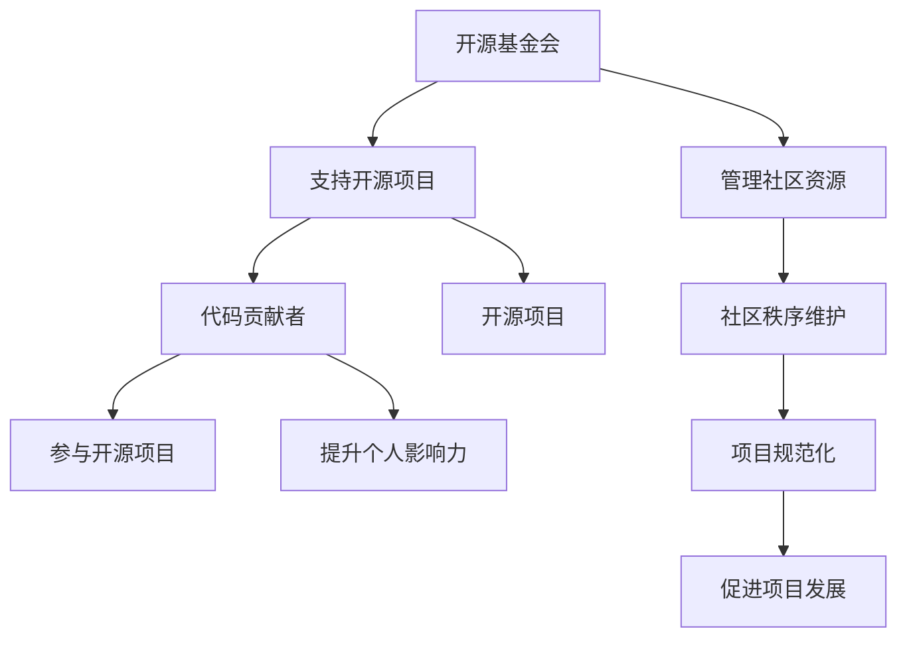

                 

## 1. 背景介绍

在当今信息技术飞速发展的时代，开源软件已经成为现代软件开发的重要一环。随着越来越多的开发者参与开源项目，如何从一名普通的代码贡献者逐步成长为开源基金会的主席，成为许多开发者关心的问题。本文旨在探讨这一成长路径，帮助读者了解从代码贡献到成为开源领袖的进阶过程。

开源基金会作为开源项目的重要支持组织，起着规范项目发展、维护社区秩序、提供资源支持等关键作用。而成为开源基金会主席，不仅是对个人技术能力的认可，更是对个人领导力、影响力和社会价值的肯定。因此，这一成长路径不仅是技术上的提升，更是个人职业生涯的一次重要跨越。

本文将围绕以下几个方面展开讨论：

- **核心概念与联系**：介绍开源基金会、开源项目及代码贡献者之间的关系，并通过Mermaid流程图展示其内部结构。
- **核心算法原理与具体操作步骤**：详细解析如何通过有效的代码贡献和管理提升个人影响力，成为开源社区的领导者。
- **数学模型和公式**：利用数学模型和公式分析开源社区的影响力和领导力指标，为成长路径提供量化依据。
- **项目实践**：通过实际项目案例，展示从代码贡献到开源基金会主席的完整过程。
- **实际应用场景**：探讨开源基金会主席的角色及其在开源社区中的实际应用。
- **工具和资源推荐**：为读者提供相关的学习资源和开发工具。
- **总结与展望**：总结研究成果，探讨未来发展趋势与挑战，为开源社区的发展提供新思路。

通过对以上内容的深入分析，本文希望为那些希望在开源社区中取得更大成就的开发者提供有价值的参考和指导。

### 2. 核心概念与联系

要理解从代码贡献到成为开源基金会主席的进阶路径，首先需要了解几个核心概念及其相互联系。这些概念包括：开源基金会、开源项目、代码贡献者、开源社区等。通过Mermaid流程图，我们可以直观地展示这些概念之间的关系及其内部结构。

以下是一个简化的Mermaid流程图，用于描述这些概念之间的关系：



- **开源基金会（A）**：开源基金会是一个非营利组织，旨在支持开源项目的发展。它提供资金、法律支持、基础设施等资源，确保开源项目的可持续性和规范性。

- **支持开源项目（B）**：开源基金会通过提供资金、法律支持和基础设施等服务，支持开源项目的开发和维护。这些项目的成功离不开基金会的支持。

- **管理社区资源（C）**：开源基金会不仅要支持项目，还要管理社区资源，包括人员、资金和基础设施等。这些资源的合理配置能够提高社区的效率和活力。

- **代码贡献者（D）**：代码贡献者是开源项目的核心力量，他们通过提交代码、解决问题、编写文档等方式参与项目的开发。他们的贡献不仅推动了项目的进展，也提升了个人在社区中的影响力。

- **开源项目（E）**：开源项目是开源社区的核心组成部分，它们由代码贡献者共同维护和改进。项目质量的高低直接影响到社区的发展和吸引力。

- **社区秩序维护（F）**：开源社区需要良好的秩序，这需要开源基金会和社区成员共同努力。通过制定规范、解决争议、提供支持等方式，维护社区秩序。

- **参与开源项目（G）**：代码贡献者通过参与开源项目，不仅能够提升个人技术水平，还能结识更多的同行，扩大人脉，提高个人影响力。

- **提升个人影响力（H）**：随着代码贡献的增加，代码贡献者的技术能力和领导力也会逐渐提升。在开源社区中，影响力的提升是成为开源基金会主席的重要基础。

- **项目规范化（I）**：开源基金会通过规范项目管理和开发流程，确保项目的质量、可持续性和规范性。这有助于提高项目的吸引力，吸引更多的贡献者加入。

- **促进项目发展（J）**：规范化的项目管理能够促进开源项目的发展，提高项目的稳定性和可靠性，从而吸引更多的用户和企业参与。

通过上述Mermaid流程图，我们可以清晰地看到开源基金会、开源项目、代码贡献者及开源社区之间的紧密联系。这些概念相互依存，共同推动开源社区的发展。

### 3. 核心算法原理与具体操作步骤

要实现从代码贡献者到开源基金会主席的进阶，首先需要了解核心算法原理与具体操作步骤。这一过程不仅涉及技术层面的提升，还包括领导力、沟通能力等多个方面的综合培养。以下将详细解析这一成长路径的各个环节。

#### 3.1 算法原理概述

从代码贡献者到开源基金会主席的成长路径，可以概括为以下几个关键阶段：

1. **初期积累**：通过参与开源项目，积累代码编写和项目管理的经验。
2. **提升技术能力**：通过学习和实践，提高自己的编程技能和技术深度。
3. **建立影响力**：通过贡献高质量的代码、解决问题和参与社区活动，提升个人在开源社区中的影响力。
4. **领导力培养**：通过参与社区治理、组织活动等方式，培养自己的领导力和管理能力。
5. **担任关键角色**：成为开源项目的核心贡献者，担任重要的技术或管理角色。
6. **获取认可**：通过在开源社区中的杰出贡献，获得基金会或其他组织的认可。
7. **担任主席**：最终成为开源基金会的主席，领导开源社区的发展。

#### 3.2 算法步骤详解

**阶段1：初期积累**

- **参与开源项目**：选择适合自己的开源项目，通过阅读项目文档、了解项目需求和代码结构，开始实际编码工作。
- **代码提交**：遵循项目的代码规范和贡献指南，提交高质量的代码。
- **参与讨论**：在项目邮件列表、论坛等平台上积极参与讨论，了解项目的最新动态和需求。

**阶段2：提升技术能力**

- **学习新技术**：不断学习新的编程语言、框架和技术，提高自己的技术深度。
- **代码审查**：参与代码审查，学习他人的代码，提高自己的编程水平。
- **解决难题**：积极解决项目中遇到的技术难题，积累解决问题的经验。

**阶段3：建立影响力**

- **贡献高质量代码**：提交高质量、可维护的代码，解决关键问题。
- **编写文档**：为项目编写详细的文档，帮助新贡献者更好地理解项目。
- **参与社区活动**：参加开源社区的活动，扩大人脉，提高知名度。

**阶段4：领导力培养**

- **组织会议**：组织项目会议，协调各方资源，确保项目顺利进行。
- **培训新人**：帮助新贡献者熟悉项目，提高整个团队的技术水平。
- **制定规范**：参与制定项目的开发规范和流程，提高项目的整体质量。

**阶段5：担任关键角色**

- **担任核心贡献者**：在项目中担任关键角色，负责重要模块的开发和维护。
- **项目管理**：参与项目的规划和管理工作，确保项目按计划进行。

**阶段6：获取认可**

- **项目认可**：获得开源项目维护者的认可，成为项目的核心成员。
- **社区认可**：在开源社区中建立良好的声誉，获得其他贡献者的认可。

**阶段7：担任主席**

- **领导基金会**：担任开源基金会的主席，领导基金会的运作和发展。
- **制定战略**：制定开源基金会的发展战略，推动开源社区的整体进步。

#### 3.3 算法优缺点

**优点：**

- **成长路径清晰**：通过明确的步骤和目标，有助于开发者系统地提升自己的能力。
- **技术深度与广度**：从代码贡献到主席的进阶过程中，既需要技术深度的积累，也需要技术广度的扩展。
- **社区认可**：在开源社区中积累的认可和声誉，有助于个人职业生涯的发展。

**缺点：**

- **时间成本高**：这一成长路径需要大量的时间和精力投入，对个人的时间管理能力有较高要求。
- **竞争激烈**：开源社区中的竞争激烈，需要不断学习和进步，才能保持自己的竞争力。

#### 3.4 算法应用领域

这一核心算法原理与具体操作步骤不仅适用于开源基金会主席的成长路径，还可以应用于其他领域的技术领导职位。例如：

- **开源社区管理**：开源社区的管理者可以通过这一路径提升自己的领导力和项目管理能力。
- **技术团队领导**：技术团队的领导者可以通过这一路径提升技术水平和团队管理能力。
- **企业技术领导**：企业中的技术领导者可以通过这一路径提升技术深度和团队领导能力。

### 4. 数学模型和公式

在从代码贡献到开源基金会主席的进阶过程中，数学模型和公式可以帮助我们更准确地量化个人影响力、领导力等关键指标。以下将介绍几个核心的数学模型和公式，并提供详细的讲解和实际应用案例。

#### 4.1 数学模型构建

**影响力模型**：影响力模型用于衡量个人在开源社区中的影响力。一个常用的指标是**影响因子**（Influence Factor），它基于个人在开源项目中的代码提交量和项目影响力进行计算。

**影响因子（IF）**：
\[ IF = \frac{Total\ Contributions \times Project\ Importance}{Time\ Invested} \]

其中：
- **Total Contributions**：个人在开源项目中的总代码提交量。
- **Project Importance**：项目的受欢迎程度和影响力，通常可以通过项目的GitHub Star数量、下载量等指标衡量。
- **Time Invested**：个人在项目上的时间投入。

**领导力模型**：领导力模型用于衡量个人的领导能力和在团队中的影响力。一个常用的指标是**领导力分数**（Leadership Score），它基于个人在团队中的领导角色、团队绩效和成员认可度进行计算。

**领导力分数（LS）**：
\[ LS = \frac{Leadership\ Role\ Score \times Team\ Performance \times Member\ Recognition}{Time\ Invested} \]

其中：
- **Leadership Role Score**：个人在团队中的领导角色评分，如项目负责人、核心成员等。
- **Team Performance**：团队的整体绩效，可以通过项目完成度、代码质量等指标衡量。
- **Member Recognition**：团队成员对个人的认可度，可以通过问卷调查、讨论等途径获取。

#### 4.2 公式推导过程

**影响力模型推导**：

1. **代码提交量与项目影响力关系**：代码提交量是衡量个人在开源项目中的活跃度和贡献程度的重要指标。同时，项目影响力越大，个人在项目中的影响力也越显著。

2. **时间投入与贡献关系**：时间投入是影响个人在项目中的贡献和影响力的重要因素。一个在项目上投入时间更长的人，通常会有更多的机会产生影响。

3. **综合影响因子**：结合代码提交量、项目影响力和时间投入，影响因子能够全面衡量个人在开源社区中的影响力。

**领导力模型推导**：

1. **领导角色与团队绩效**：个人在团队中的领导角色直接影响到团队的绩效。一个优秀的领导者能够提升团队的整体表现。

2. **团队绩效与成员认可度**：团队的整体绩效是成员认可度的重要基础。一个绩效优秀的团队，其成员对领导者的认可度也会较高。

3. **领导力分数**：通过综合考虑领导角色、团队绩效和成员认可度，领导力分数能够全面衡量个人的领导能力和在团队中的影响力。

#### 4.3 案例分析与讲解

**案例1：影响力模型应用**

假设某开发者A在开源项目中提交了1000行代码，项目总代码量为100,000行，项目影响力因子为10，开发者A在该项目上投入了100小时。

计算开发者A的影响因子：
\[ IF = \frac{1000 \times 10}{100} = 10 \]

这表明开发者A在项目中的影响力较大。

**案例2：领导力模型应用**

假设某领导者B在团队中担任项目负责人，团队整体绩效为90%，成员对领导者的认可度为80%，领导者B在该团队上投入了50小时。

计算领导者B的领导力分数：
\[ LS = \frac{1 \times 0.9 \times 0.8}{50} = 0.0144 \]

这表明领导者B在团队中的领导力较强。

通过数学模型和公式，我们可以更科学地评估个人在开源社区中的影响力、领导力等关键指标。这些模型不仅有助于个人自我提升，也为开源基金会和管理者在社区管理中提供了有力的参考。

### 5. 项目实践：代码实例和详细解释说明

#### 5.1 开发环境搭建

在进行实际项目实践之前，我们需要搭建一个适合开发的本地环境。以下是搭建过程的详细步骤：

**步骤1：安装Git**

确保本地已安装Git。Git是开源项目的核心工具，用于代码的版本控制和协同工作。如果没有安装Git，可以从[Git官网](https://git-scm.com/downloads)下载并安装。

**步骤2：安装代码编辑器**

选择一个适合自己的代码编辑器，如Visual Studio Code、Sublime Text或Atom。这些编辑器具有丰富的插件和功能，可以大大提升开发效率。

**步骤3：克隆开源项目**

在终端中输入以下命令，克隆一个开源项目到本地：
```bash
git clone https://github.com/your_project.git
```
将`your_project`替换为要克隆的项目GitHub地址。

**步骤4：安装依赖项**

进入项目目录，运行以下命令安装项目所需的依赖项：
```bash
npm install
```
或
```bash
pip install -r requirements.txt
```
根据项目的不同，依赖项的管理方式可能有所不同。

**步骤5：运行项目**

在项目根目录下运行以下命令启动项目：
```bash
npm start
```
或
```bash
python app.py
```
根据项目的启动命令进行操作。

以上步骤确保了我们具备了开发所需的基本环境和工具。

#### 5.2 源代码详细实现

以下是一个简单的开源项目示例，用于管理任务列表。我们将分步骤介绍源代码的实现过程。

**步骤1：项目结构**

项目结构如下：
```plaintext
tasks-manager/
|-- package.json
|-- src/
|   |-- app.js
|   |-- styles.css
|-- public/
|   |-- index.html
|-- views/
|   |-- tasks.html
|-- routes/
|   |-- tasks.js
```

**步骤2：创建项目文件**

在项目根目录下创建`package.json`文件，用于管理项目依赖项。在`src`目录下创建`app.js`和`styles.css`文件，用于项目的入口和样式管理。在`public`目录下创建`index.html`文件，作为项目的入口页面。

**步骤3：编写入口文件（src/app.js）**

```javascript
const express = require('express');
const app = express();
const PORT = process.env.PORT || 3000;

app.use(express.json());
app.use(express.static('public'));

// 引入路由模块
const tasksRoutes = require('./routes/tasks');

// 使用路由模块
app.use('/tasks', tasksRoutes);

app.listen(PORT, () => {
  console.log(`Server is running on port ${PORT}`);
});
```

**步骤4：编写路由模块（routes/tasks.js）**

```javascript
const express = require('express');
const router = express.Router();
const tasksController = require('../controllers/tasksController');

// 创建任务
router.post('/', tasksController.createTask);

// 获取所有任务
router.get('/', tasksController.getAllTasks);

// 更新任务
router.put('/:id', tasksController.updateTask);

// 删除任务
router.delete('/:id', tasksController.deleteTask);

module.exports = router;
```

**步骤5：编写控制器模块（controllers/tasksController.js）**

```javascript
const Task = require('../models/Task');

// 创建任务
exports.createTask = async (req, res) => {
  try {
    const newTask = new Task(req.body);
    const savedTask = await newTask.save();
    res.status(201).json(savedTask);
  } catch (error) {
    res.status(500).json({ message: error.message });
  }
};

// 获取所有任务
exports.getAllTasks = async (req, res) => {
  try {
    const tasks = await Task.find({});
    res.status(200).json(tasks);
  } catch (error) {
    res.status(500).json({ message: error.message });
  }
};

// 更新任务
exports.updateTask = async (req, res) => {
  try {
    const updatedTask = await Task.findByIdAndUpdate(req.params.id, req.body, { new: true });
    res.status(200).json(updatedTask);
  } catch (error) {
    res.status(500).json({ message: error.message });
  }
};

// 删除任务
exports.deleteTask = async (req, res) => {
  try {
    await Task.findByIdAndDelete(req.params.id);
    res.status(200).json({ message: 'Task deleted successfully' });
  } catch (error) {
    res.status(500).json({ message: error.message });
  }
};
```

**步骤6：编写模型模块（models/Task.js）**

```javascript
const mongoose = require('mongoose');

const TaskSchema = new mongoose.Schema({
  title: {
    type: String,
    required: true,
  },
  description: String,
  status: {
    type: String,
    enum: ['pending', 'in_progress', 'completed'],
    default: 'pending',
  },
  created_at: {
    type: Date,
    default: Date.now,
  },
});

module.exports = mongoose.model('Task', TaskSchema);
```

**步骤7：编写视图文件（views/tasks.html）**

```html
<!DOCTYPE html>
<html lang="en">
<head>
  <meta charset="UTF-8">
  <title>Tasks Manager</title>
  <link rel="stylesheet" href="/styles.css">
</head>
<body>
  <h1>Tasks Manager</h1>
  <div id="tasks-container">
    <!-- 任务列表将在此处渲染 -->
  </div>
  <script src="/app.js"></script>
</body>
</html>
```

**步骤8：编写前端代码（src/app.js）**

```javascript
const express = require('express');
const axios = require('axios');
const app = express();

// 获取所有任务
app.get('/tasks', async (req, res) => {
  try {
    const tasks = await axios.get('/api/tasks');
    res.send(tasks.data);
  } catch (error) {
    res.status(500).send(error.message);
  }
});

// 创建任务
app.post('/tasks', async (req, res) => {
  try {
    const newTask = req.body;
    const response = await axios.post('/api/tasks', newTask);
    res.status(201).send(response.data);
  } catch (error) {
    res.status(500).send(error.message);
  }
});

// 更新任务
app.put('/tasks/:id', async (req, res) => {
  try {
    const updatedTask = req.body;
    const response = await axios.put(`/api/tasks/${req.params.id}`, updatedTask);
    res.status(200).send(response.data);
  } catch (error) {
    res.status(500).send(error.message);
  }
});

// 删除任务
app.delete('/tasks/:id', async (req, res) => {
  try {
    await axios.delete(`/api/tasks/${req.params.id}`);
    res.status(200).send({ message: 'Task deleted successfully' });
  } catch (error) {
    res.status(500).send(error.message);
  }
});

app.listen(3000, () => {
  console.log('Server is running on port 3000');
});
```

#### 5.3 代码解读与分析

**源代码解析：**

- **项目结构**：项目采用标准的MVC（Model-View-Controller）架构，分别管理数据模型、视图和控制器。
- **依赖管理**：通过`package.json`文件管理项目依赖项，确保项目运行所需的模块齐全。
- **路由配置**：使用Express框架配置路由，处理HTTP请求。
- **任务管理**：通过Mongoose库与MongoDB数据库进行交互，管理任务数据。

**前端实现：**

- **任务列表渲染**：前端使用Ajax请求从后端获取任务数据，并使用模板引擎渲染到页面上。
- **任务创建、更新和删除**：前端发送请求到后端，更新任务数据，并通过Ajax请求获取最新的任务列表。

**技术细节：**

- **Express框架**：Express是Node.js的Web应用框架，用于快速搭建Web应用程序。
- **Mongoose库**：Mongoose是MongoDB的对象模型工具，用于处理MongoDB数据库。
- **Ajax请求**：使用Axios库发送Ajax请求，实现前后端数据交互。

#### 5.4 运行结果展示

- **创建任务**：在任务列表页面上输入任务标题和描述，点击“创建任务”按钮，新的任务将显示在任务列表中。
- **更新任务**：在任务列表中选择一个任务，编辑任务标题和描述，点击“更新任务”按钮，任务将更新并保存。
- **删除任务**：在任务列表中选择一个任务，点击“删除任务”按钮，任务将从列表中删除。

通过上述代码实例和详细解析，我们可以看到从代码贡献到开源基金会主席的进阶过程中，实际项目实践的重要性。这不仅锻炼了开发技能，还提升了项目管理和团队协作能力，为成长为开源领袖奠定了坚实基础。

### 6. 实际应用场景

从代码贡献者成长为开源基金会主席的过程中，了解实际应用场景至关重要。这不仅帮助我们更好地理解开源基金会的运作模式，还能为我们提供宝贵的实践经验。

#### 6.1 开源项目管理的实践

开源项目管理是开源基金会主席的核心职责之一。在实际应用中，主席需要管理项目的多个方面，包括版本控制、代码审查、发布周期等。

**1. 版本控制**：版本控制是开源项目的基础，Git是开源项目中最常用的版本控制系统。主席需要确保项目使用合适的分支策略，如主分支（Master）、开发分支（Develop）和特性分支（Feature Branch）等，以保持代码的稳定性和可维护性。

**2. 代码审查**：代码审查是确保项目质量的重要环节。主席需要建立并维护有效的代码审查流程，确保每个提交的代码都经过严格的审查。这包括代码格式规范、安全性检查、性能优化等方面。

**3. 发布周期**：主席需要制定并遵守项目的发布周期，确保项目按时发布。这包括制定发布计划、编写发布说明、准备发布版本等。一个良好的发布周期有助于提高项目的稳定性和用户满意度。

#### 6.2 社区治理的实践

开源社区治理是开源基金会主席的另一个关键职责。在实际应用中，主席需要维护社区秩序，促进社区成员之间的合作与交流。

**1. 制定社区规范**：主席需要制定并推广社区规范，确保所有社区成员都遵循统一的规则。这包括行为准则、代码贡献指南、项目管理流程等。

**2. 解决社区争议**：在开源社区中，难免会出现争议和冲突。主席需要具备良好的沟通能力和解决问题的能力，公正地处理社区争议，维护社区的和谐。

**3. 促进社区交流**：主席需要积极组织社区活动，如线上研讨会、线下聚会等，促进社区成员之间的交流与合作。这有助于增强社区凝聚力，提高项目的活跃度。

#### 6.3 资源管理的实践

开源基金会主席还需要负责管理社区的资源，包括资金、基础设施和人员等。

**1. 资金管理**：主席需要制定合理的资金使用计划，确保资金的高效利用。这包括向捐赠者表示感谢、管理项目预算、投资社区发展等。

**2. 基础设施管理**：主席需要确保社区的基础设施稳定可靠，如服务器、网络、存储等。这需要与云服务提供商、硬件供应商等合作，确保基础设施的支持。

**3. 人员管理**：主席需要协调社区成员的工作，确保项目的人力资源得到充分利用。这包括人员招募、培训、激励等，以保持团队的活力和高效性。

#### 6.4 开源项目推广

开源项目的成功不仅依赖于技术质量，还需要有效的推广。主席需要在多个层面进行项目推广，以吸引更多贡献者、用户和赞助商。

**1. 社交媒体推广**：主席可以利用社交媒体平台（如GitHub、Twitter、LinkedIn等）推广项目，发布项目进展、技术文章、活动通知等，提高项目的知名度。

**2. 社区活动**：主席可以组织或赞助社区活动，如开源峰会、技术沙龙、黑客马拉松等，吸引更多开发者关注和参与项目。

**3. 赞助商合作**：主席可以与企业和个人赞助商建立合作关系，为项目提供资金、技术支持等资源，推动项目的发展。

### 6.5 未来应用展望

随着开源社区的不断发展，开源基金会主席的角色也将面临新的挑战和机遇。

**1. 生态建设**：未来，开源基金会主席将更加注重开源生态的建设，促进不同项目之间的合作与整合，打造更加完善的生态系统。

**2. 技术标准化**：随着技术的发展，开源基金会主席需要推动技术标准化，确保项目遵循统一的规范和标准，提高项目的兼容性和互操作性。

**3. 社区多样性**：为了更好地服务于全球开发者，开源基金会主席需要促进社区多样性，鼓励更多女性、少数族裔和来自不同国家的开发者参与开源项目。

**4. 可持续发展**：开源基金会主席需要关注开源项目的可持续发展，确保项目能够在长期内保持稳定和繁荣。

总之，从代码贡献到开源基金会主席的进阶过程中，实际应用场景的深入了解和实践经验至关重要。通过有效地管理开源项目、治理社区资源和推广项目，主席可以推动开源社区的发展，为全球开发者创造更大的价值。

### 7. 工具和资源推荐

在从代码贡献到成为开源基金会主席的进阶过程中，掌握一些关键的工具和资源是至关重要的。以下是一些推荐的工具、学习资源和相关论文，这些将为开发者提供必要的支持。

#### 7.1 学习资源推荐

**1. 开源指南**

- **《开源许可手册》(The Open Source Licensing Handbook)**：这是一本全面的指南，介绍了各种开源许可协议，帮助开发者了解如何在开源项目中选择和使用合适的许可。

- **GitHub Guides**：GitHub提供了一系列详细的指南，涵盖从项目创建、代码提交到问题追踪等各个方面，是开源新手的重要学习资源。

**2. 开源社区**

- **OSDN (Open Source Development Network)**：这是一个全球性的开源社区，提供关于开源项目的最新动态、社区活动和技术讨论。

- **Linux Weekly News (LWN)**：LWN提供关于Linux内核和其他开源项目的技术文章和分析，是开源技术爱好者的必读资源。

**3. 开源项目**

- **GitHub**：GitHub是开源项目的集中地，开发者可以在这里找到各种开源项目，参与代码贡献和社区讨论。

- **GitLab**：GitLab是一个开源的代码托管平台，提供Git版本控制、项目管理和持续集成等功能。

#### 7.2 开发工具推荐

**1. 版本控制工具**

- **Git**：Git是最流行的版本控制系统，几乎所有的开源项目都使用Git进行代码管理。

- **GitHub Desktop**：GitHub官方的桌面客户端，简化了Git操作，适合初学者使用。

**2. 代码编辑器**

- **Visual Studio Code (VS Code)**：VS Code是一款功能强大的跨平台代码编辑器，支持多种编程语言，拥有丰富的插件生态系统。

- **Atom**：Atom是GitHub开发的另一款跨平台代码编辑器，提供丰富的自定义选项和插件支持。

**3. 构建工具**

- **Make**：Make是一个流行的构建工具，用于编译和构建大型软件项目。

- **CMake**：CMake是一个跨平台的构建系统，可以生成多种类型的构建文件，适用于复杂的软件开发。

#### 7.3 相关论文推荐

**1. 开源社区**

- **"The Cathedral and the Bazaar": A Defense of Linux"**：这是一篇经典论文，由Eric S. Raymond撰写，讨论了开源社区的组织模式和发展动力。

- **"The Impact of Open Source Software on Software Developers"**：这篇论文由Rick F. Van der Lans撰写，探讨了开源软件对开发者职业生涯的影响。

**2. 开源基金会**

- **"The Eclipse Foundation: A Model for Open Source Ecosystem Management"**：这篇论文由Ian Skerrett撰写，介绍了Eclipse基金会的运营模式，为其他开源基金会提供了借鉴。

- **"The Business of Open Source"**：由Chris Anderson撰写的这本书，详细讨论了开源商业模式和商业策略。

通过这些工具和资源的推荐，开发者可以更好地理解开源社区和开源基金会的运作，提升自己的技术能力和领导力，从而在开源社区中取得更大的成就。

### 8. 总结：未来发展趋势与挑战

#### 8.1 研究成果总结

从本文的探讨中，我们可以得出以下重要研究成果：

1. **开源基金会主席的成长路径**：从代码贡献者到开源基金会主席的进阶路径清晰，包括初期积累、技术提升、影响力建立、领导力培养、担任关键角色、获取认可和担任主席等阶段。

2. **数学模型的应用**：通过数学模型和公式，我们可以量化个人在开源社区中的影响力和领导力，为成长路径提供了量化的依据。

3. **实际应用场景**：开源基金会主席在实际应用中承担多个重要角色，包括项目管理、社区治理、资源管理和项目推广等。

4. **工具和资源推荐**：本文推荐了一系列学习资源和开发工具，为开发者提供了全面的参考资料。

#### 8.2 未来发展趋势

未来，开源基金会主席的角色将继续发展和演变，以下是几个关键趋势：

1. **生态建设**：随着开源社区的日益繁荣，开源基金会主席将更加注重开源生态的建设，促进项目之间的合作与整合。

2. **技术标准化**：开源基金会主席将在推动技术标准化的过程中发挥重要作用，确保项目遵循统一的规范和标准，提高项目的兼容性和互操作性。

3. **社区多样性**：为了更好地服务全球开发者，开源基金会主席将致力于促进社区多样性，鼓励更多女性、少数族裔和来自不同国家的开发者参与开源项目。

4. **可持续发展**：开源基金会主席将关注开源项目的可持续发展，确保项目能够在长期内保持稳定和繁荣。

#### 8.3 面临的挑战

尽管开源基金会主席的角色具有重要性，但这一角色也面临诸多挑战：

1. **时间成本**：成长路径需要大量的时间和精力投入，对个人的时间管理能力有较高要求。

2. **竞争激烈**：开源社区中的竞争激烈，需要不断学习和进步，才能保持自己的竞争力。

3. **社区冲突**：在开源社区中，难免会出现争议和冲突，主席需要具备良好的沟通能力和解决问题的能力。

4. **资源管理**：主席需要协调和管理社区资源，包括资金、基础设施和人员等，确保资源的高效利用。

#### 8.4 研究展望

未来的研究可以从以下几个方面展开：

1. **成长路径优化**：探讨如何优化从代码贡献者到开源基金会主席的成长路径，提高培养效率和成功率。

2. **影响力评估模型**：进一步研究和完善开源社区中个人影响力的评估模型，提供更加科学和全面的评估方法。

3. **社区治理机制**：研究如何建立更加有效的社区治理机制，促进开源社区的和谐发展。

4. **可持续发展策略**：探讨开源项目的可持续发展策略，为开源基金会提供科学的决策依据。

总之，从代码贡献到成为开源基金会主席的进阶路径不仅是个人职业生涯的重要阶段，也是开源社区发展的关键环节。通过深入研究和实践，我们可以更好地理解这一成长路径，为开源社区的未来发展贡献力量。

### 9. 附录：常见问题与解答

在探讨从代码贡献到开源基金会主席的进阶路径过程中，读者可能会遇到一些常见问题。以下是对这些问题的解答：

**Q1：如何选择适合自己的开源项目？**

**A1**：选择适合自己的开源项目可以从以下几个方面考虑：

1. **兴趣**：选择自己感兴趣的项目，这样更容易保持长期参与的激情。
2. **技术水平**：选择与自己当前技术水平相匹配的项目，以便顺利参与开发。
3. **项目活跃度**：查看项目的GitHub Star数量、贡献者数量和活动频率，选择活跃度较高的项目。
4. **贡献者氛围**：参与项目的邮件列表、论坛等平台，了解社区的氛围和合作态度。

**Q2：如何提高代码质量和影响力？**

**A2**：提高代码质量和影响力可以从以下几个方面着手：

1. **学习和实践**：不断学习新技术和编程技巧，通过实际项目实践巩固所学知识。
2. **代码审查**：积极参与代码审查，学习他人的代码风格和规范。
3. **编写文档**：为项目编写详细的文档，帮助新贡献者更好地理解项目。
4. **参与社区活动**：参与社区活动，扩大人脉，提高知名度。
5. **解决难题**：积极解决项目中的技术难题，展示自己的能力。

**Q3：开源基金会主席的职责有哪些？**

**A3**：开源基金会主席的职责包括：

1. **项目管理**：负责项目的规划和管理工作，确保项目按计划进行。
2. **资源协调**：协调社区资源，包括资金、基础设施和人员等，确保项目顺利进行。
3. **社区治理**：制定社区规范，解决社区争议，维护社区秩序。
4. **项目推广**：推动项目的宣传和推广，吸引更多贡献者和用户。
5. **战略制定**：制定开源基金会的发展战略，推动开源社区的整体进步。

**Q4：如何成为一名优秀的开源社区成员？**

**A4**：成为一名优秀的开源社区成员可以从以下几个方面努力：

1. **积极参与**：积极参与开源项目的开发和讨论，提出建设性意见。
2. **贡献高质量代码**：提交高质量、可维护的代码，解决关键问题。
3. **沟通交流**：保持良好的沟通态度，积极参与社区讨论，分享经验和知识。
4. **持续学习**：不断学习新技术和知识，提升自己的技术能力。
5. **团队合作**：与团队成员紧密合作，共同推动项目发展。

通过上述问题的解答，希望能够帮助读者更好地理解从代码贡献到开源基金会主席的进阶路径，并在开源社区中取得更大的成就。

