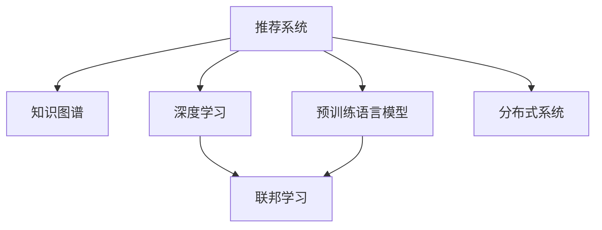

                 

# 从传统推荐系统到AI大模型：技术演进之路

> 关键词：推荐系统,知识图谱,深度学习,预训练语言模型,联邦学习,分布式系统

## 1. 背景介绍

### 1.1 问题由来

推荐系统是现代互联网的重要应用之一，能够帮助用户发现感兴趣的内容。随着用户数据的不断积累，传统的协同过滤、基于内容的推荐等方法逐渐暴露出其局限性。为应对数据量的激增，大规模深度学习模型逐渐成为推荐系统的主流。但深度学习模型在数据量、特征工程等方面仍存在挑战，逐渐走向瓶颈。

### 1.2 问题核心关键点

传统推荐系统一般采用基于统计模型或机器学习模型的推荐算法，主要面临以下问题：

- **数据依赖**：需要用户点击、评分、历史行为等标注数据，获取成本较高，数据分布可能不均衡。
- **模型泛化**：基于历史行为进行预测，无法处理新用户或无行为记录的用户，模型泛化能力有限。
- **特征工程**：需要人工设计特征，特征选择不当可能导致过拟合或欠拟合。
- **实时性**：推荐系统需要实时响应用户请求，这对模型的推理速度和计算复杂度提出了较高要求。

为了应对这些问题，研究人员不断探索新的推荐技术，以适应海量用户数据和不断变化的市场需求。知识图谱、深度学习、预训练语言模型等新兴技术，逐渐成为推荐系统的发展新方向。

## 2. 核心概念与联系

### 2.1 核心概念概述

为更好地理解从传统推荐系统到AI大模型的技术演进，本节将介绍几个关键概念：

- **推荐系统**：通过收集用户行为数据，学习用户兴趣和物品属性，生成个性化推荐结果的系统。
- **知识图谱**：由实体、关系和属性组成的网络结构，用于表示语义信息，辅助推荐决策。
- **深度学习**：一种基于人工神经网络的机器学习方法，擅长处理大量非结构化数据。
- **预训练语言模型**：在大规模无标签数据上进行预训练，学习通用的语言表示，应用于下游任务中的推荐模型。
- **联邦学习**：分布式训练方式，多客户端协同训练模型，避免数据集中存储和传输。
- **分布式系统**：利用多台计算机协同处理任务，提升系统处理能力。

这些概念之间的联系可以通过以下Mermaid流程图来展示：



这个流程图展示了推荐系统与知识图谱、深度学习、预训练语言模型等新兴技术之间的关系：

1. 推荐系统通过引入知识图谱和深度学习技术，提升了推荐决策的准确性和个性化程度。
2. 深度学习模型通过预训练语言模型进行预训练，获得了更加通用的语言表示，提升模型泛化能力。
3. 联邦学习技术优化了推荐模型的分布式训练，降低了数据隐私风险。
4. 分布式系统支持大规模深度学习模型的训练和推理，满足了实时推荐的需求。

这些概念共同构成了推荐系统的技术框架，使其在处理大规模数据和个性化推荐方面更具竞争力。通过理解这些核心概念，我们可以更好地把握推荐系统的发展脉络。

## 3. 核心算法原理 & 具体操作步骤
### 3.1 算法原理概述

推荐系统的核心算法原理是通过收集用户数据和物品属性，学习用户兴趣和物品表示，生成个性化推荐结果。其中，深度学习模型因其在大规模数据上训练的能力，逐渐成为推荐系统的首选。

以深度学习为基础的推荐系统，一般通过两个步骤实现：

1. **预训练**：在大规模无标签数据上进行预训练，学习通用的语言表示和特征表示。
2. **微调**：在带有标注的用户行为数据上，微调预训练模型，使其适应推荐任务。

预训练和微调过程可以结合使用，以充分利用数据和模型之间的协同效应。

### 3.2 算法步骤详解

推荐系统的算法步骤如下：

**Step 1: 数据收集与预处理**
- 收集用户行为数据和物品属性数据。
- 对数据进行清洗和归一化处理，去除异常值和噪声数据。
- 划分训练集、验证集和测试集。

**Step 2: 构建深度学习模型**
- 选择合适的深度学习模型结构，如深度神经网络、循环神经网络等。
- 设计模型输入和输出，输入为用户行为数据和物品属性数据，输出为推荐结果。
- 在训练集上训练模型，调整超参数，确保模型收敛。

**Step 3: 预训练与微调**
- 在预训练阶段，使用大规模无标签数据对模型进行预训练，学习通用的特征表示。
- 在微调阶段，在带有标注的用户行为数据上，微调预训练模型，优化推荐结果。
- 在验证集上评估模型性能，根据结果调整模型参数。

**Step 4: 实时推荐与优化**
- 实时响应用户请求，使用训练好的模型生成推荐结果。
- 在生产环境中，不断收集反馈数据，对模型进行持续优化。
- 利用分布式系统和联邦学习技术，优化模型训练和推理效率。

### 3.3 算法优缺点

基于深度学习的推荐系统具有以下优点：

- **自动化特征提取**：能够自动从原始数据中学习特征，减少人工特征工程的工作量。
- **模型泛化能力强**：在大规模数据上进行预训练，可以学习到更为通用的特征表示，提升模型泛化能力。
- **实时推荐**：利用分布式系统和联邦学习技术，可以实时响应用户请求，提高推荐效率。

但同时，该方法也存在一些缺点：

- **数据依赖**：深度学习模型需要大量标注数据进行微调，数据获取成本较高。
- **计算量大**：模型推理速度较慢，难以支持实时推荐。
- **可解释性不足**：深度学习模型通常是"黑盒"系统，难以解释推荐结果背后的原因。

尽管如此，基于深度学习的推荐系统仍然是推荐系统的主流方法，特别是在大数据量、高需求响应的场景中表现出色。未来，如何进一步提升推荐模型的可解释性和实时性，是推荐系统领域的重要研究方向。

### 3.4 算法应用领域

基于深度学习的推荐系统在多个领域得到了广泛应用，例如：

- **电商推荐**：根据用户浏览、购买历史，推荐相似商品。
- **内容推荐**：根据用户阅读、观影历史，推荐文章、视频。
- **广告推荐**：根据用户行为数据，推荐广告位。
- **金融推荐**：根据用户交易记录，推荐投资产品。
- **医疗推荐**：根据患者病历数据，推荐诊断方案。

除了这些常见的应用场景外，基于深度学习的推荐系统还广泛应用于智能家居、教育培训、社交网络等多个领域，为人们的生活和工作带来了便利和创新。

## 4. 数学模型和公式 & 详细讲解  
### 4.1 数学模型构建

推荐系统的主要目标是最大化推荐效果，通常定义一个目标函数，以推荐结果的精度和覆盖率为指标。设推荐系统有$N$个用户，每个用户有$m$个可能的推荐对象，推荐系统输出的推荐结果为$R \in \{0,1\}^{N \times m}$，其中$R_{i,j}=1$表示用户$i$对物品$j$进行了推荐。设用户$i$的真实行为标签为$Y_i \in \{0,1\}^m$，推荐系统需要最大化交叉熵损失函数：

$$
\mathcal{L}(R,Y) = -\frac{1}{N} \sum_{i=1}^N \sum_{j=1}^m Y_{i,j} \log R_{i,j} + (1-Y_{i,j})\log(1-R_{i,j})
$$

模型的预测结果$R_{i,j}$由神经网络模型$M$的输出决定，即$R_{i,j} = M(X_i, P_j)$，其中$X_i$为用户的特征向量，$P_j$为物品的特征向量。

### 4.2 公式推导过程

推荐系统的训练过程可以表示为以下优化问题：

$$
\hat{M} = \mathop{\arg\min}_{M} \mathcal{L}(R,M(X_i, P_j))
$$

其中$M$为模型的参数，$(X_i, P_j)$为输入数据。模型的训练过程通常采用梯度下降算法，通过反向传播计算模型参数的梯度，并更新参数以最小化损失函数。

### 4.3 案例分析与讲解

以协同过滤推荐系统为例，其核心思想是通过用户行为数据，学习用户兴趣和物品关系。假设有一个$N$用户、$m$物品的电影推荐系统，推荐系统的目标是最小化交叉熵损失函数：

$$
\mathcal{L}(R,Y) = -\frac{1}{N} \sum_{i=1}^N \sum_{j=1}^m Y_{i,j} \log R_{i,j} + (1-Y_{i,j})\log(1-R_{i,j})
$$

其中$Y_{i,j}$为用户的实际评分，$R_{i,j}$为模型预测的评分。

训练过程可以表示为以下优化问题：

$$
\hat{M} = \mathop{\arg\min}_{M} \mathcal{L}(R,M(X_i, P_j))
$$

其中$M$为模型的参数，$(X_i, P_j)$为输入数据。模型的训练过程通常采用梯度下降算法，通过反向传播计算模型参数的梯度，并更新参数以最小化损失函数。

## 5. 项目实践：代码实例和详细解释说明
### 5.1 开发环境搭建

在进行推荐系统开发前，我们需要准备好开发环境。以下是使用Python进行TensorFlow开发的环境配置流程：

1. 安装Anaconda：从官网下载并安装Anaconda，用于创建独立的Python环境。

2. 创建并激活虚拟环境：
```bash
conda create -n tf-env python=3.8 
conda activate tf-env
```

3. 安装TensorFlow：根据CUDA版本，从官网获取对应的安装命令。例如：
```bash
conda install tensorflow==2.4.0 -c conda-forge
```

4. 安装TensorFlow Addons：用于支持高级神经网络模型的功能。
```bash
conda install tensorflow-io
```

5. 安装TensorFlow Hub：用于获取和加载预训练模型。
```bash
pip install tensorflow-hub
```

6. 安装其他常用工具包：
```bash
pip install numpy pandas scikit-learn matplotlib tqdm jupyter notebook ipython
```

完成上述步骤后，即可在`tf-env`环境中开始推荐系统开发。

### 5.2 源代码详细实现

下面我们以协同过滤推荐系统为例，给出使用TensorFlow和TensorFlow Addons实现协同过滤推荐系统的代码实现。

首先，定义数据处理函数：

```python
import tensorflow as tf
from tensorflow.keras.layers import Dense, Input, Embedding, Flatten, Concatenate
from tensorflow.keras.models import Model

# 定义数据结构
class UserItemData(tf.keras.utils.Sequence):
    def __init__(self, user_ids, item_ids, ratings):
        self.user_ids = user_ids
        self.item_ids = item_ids
        self.ratings = ratings
    
    def __len__(self):
        return len(self.user_ids)
    
    def __getitem__(self, idx):
        user_id = tf.convert_to_tensor(self.user_ids[idx])
        item_id = tf.convert_to_tensor(self.item_ids[idx])
        rating = tf.convert_to_tensor(self.ratings[idx])
        return (user_id, item_id), rating
    
# 定义用户特征向量和物品特征向量
user_embedding_dim = 10
item_embedding_dim = 10

def get_model(input_dim):
    # 定义用户特征嵌入层
    user_input = Input(shape=(input_dim,), name='user_input')
    user_embedding = Embedding(input_dim=input_dim, output_dim=user_embedding_dim)(user_input)
    user_embedding = Flatten()(user_embedding)
    
    # 定义物品特征嵌入层
    item_input = Input(shape=(input_dim,), name='item_input')
    item_embedding = Embedding(input_dim=input_dim, output_dim=item_embedding_dim)(item_input)
    item_embedding = Flatten()(item_embedding)
    
    # 定义模型输出
    model_input = Concatenate()([user_embedding, item_embedding])
    rating_prediction = Dense(1, activation='sigmoid')(model_input)
    model = Model(inputs=[user_input, item_input], outputs=rating_prediction)
    return model
```

然后，定义训练和评估函数：

```python
from tensorflow.keras.optimizers import Adam
from sklearn.metrics import mean_squared_error

def train_epoch(model, dataset, batch_size, optimizer):
    model.compile(optimizer=optimizer, loss='binary_crossentropy', metrics=['accuracy'])
    for batch in tf.data.Dataset.from_generator(lambda: dataset, (tf.int32, tf.float32)).batch(batch_size):
        user_ids, item_ids, ratings = batch
        model.fit([user_ids, item_ids], ratings, epochs=1, verbose=0)
        
def evaluate(model, dataset, batch_size):
    model.compile(optimizer='adam', loss='binary_crossentropy', metrics=['accuracy'])
    model.eval()
    predictions = []
    for batch in tf.data.Dataset.from_generator(lambda: dataset, (tf.int32, tf.float32)).batch(batch_size):
        user_ids, item_ids, ratings = batch
        prediction = model.predict([user_ids, item_ids])
        predictions.extend(prediction)
    mse = mean_squared_error(predictions, labels)
    return mse
```

最后，启动训练流程并在测试集上评估：

```python
epochs = 10
batch_size = 128

model = get_model(user_item_data.num_users)
optimizer = Adam(learning_rate=0.001)

for epoch in range(epochs):
    train_epoch(model, train_data, batch_size, optimizer)
    mse = evaluate(model, test_data, batch_size)
    print(f"Epoch {epoch+1}, mse: {mse:.3f}")
```

以上就是使用TensorFlow和TensorFlow Addons实现协同过滤推荐系统的完整代码实现。可以看到，TensorFlow和TensorFlow Addons提供了强大的深度学习框架，使得推荐系统的实现变得简洁高效。

### 5.3 代码解读与分析

让我们再详细解读一下关键代码的实现细节：

**UserItemData类**：
- 定义了用户行为数据的结构，包括用户ID、物品ID和评分。
- 实现了TensorFlow的Sequence接口，使数据可以逐批次输入模型训练。

**get_model函数**：
- 定义了用户特征向量和物品特征向量的嵌入层，输出维度分别为$10$。
- 通过Concatenate将用户特征向量和物品特征向量合并，得到模型输入。
- 定义了模型输出，通过Dense层预测评分，并使用sigmoid激活函数进行二分类。

**train_epoch函数**：
- 编译模型，设置损失函数和评估指标。
- 对数据集进行批量化加载，并逐批次进行模型训练。
- 使用优化器Adam更新模型参数。

**evaluate函数**：
- 编译模型，设置损失函数和评估指标。
- 对数据集进行批量化加载，并逐批次进行模型推理。
- 计算预测评分与真实评分的均方误差。

**训练流程**：
- 定义总的epoch数和batch size，开始循环迭代。
- 每个epoch内，先在训练集上训练，输出平均均方误差。
- 在测试集上评估，输出均方误差。

可以看到，TensorFlow和TensorFlow Addons使得推荐系统的实现变得简洁高效，开发者可以专注于模型设计和数据处理。

## 6. 实际应用场景

### 6.1 电商推荐

电商推荐系统可以显著提升用户的购物体验，帮助用户发现感兴趣的商品。通过推荐系统，用户可以根据过去的浏览、购买行为，发现相似商品或热门商品，提高购物效率和满意度。

在技术实现上，可以收集用户的历史行为数据，如浏览记录、点击记录、购买记录等，构建用户和商品特征向量。利用协同过滤、深度学习等技术，对用户行为数据进行建模，生成推荐结果。将推荐结果展示给用户，用户可以查看并购买推荐商品。

### 6.2 内容推荐

内容推荐系统广泛应用于视频平台、新闻网站、社交媒体等场景，帮助用户发现感兴趣的内容。通过推荐系统，用户可以获取个性化的文章、视频、新闻等，提升内容获取的便利性和质量。

在技术实现上，可以收集用户的历史行为数据，如阅读记录、观看记录、点赞记录等，构建用户和内容特征向量。利用协同过滤、深度学习等技术，对用户行为数据进行建模，生成推荐结果。将推荐结果展示给用户，用户可以查看并消费推荐内容。

### 6.3 广告推荐

广告推荐系统可以帮助广告主精准投放广告，提升广告效果和投资回报率。通过推荐系统，广告主可以根据用户行为数据，生成适合用户的广告，提高广告的点击率和转化率。

在技术实现上，可以收集用户的浏览行为数据，如网页访问记录、点击记录等，构建用户和广告特征向量。利用协同过滤、深度学习等技术，对用户行为数据进行建模，生成推荐结果。将推荐结果展示给广告主，广告主可以选择投放广告，提高广告的点击率和转化率。

### 6.4 金融推荐

金融推荐系统可以帮助投资者发现有价值的信息和机会，提升投资决策的准确性和效率。通过推荐系统，投资者可以获取个性化的金融产品推荐，如股票、基金、债券等，提高投资收益。

在技术实现上，可以收集投资者的交易记录、行为数据等，构建用户和金融产品特征向量。利用协同过滤、深度学习等技术，对用户行为数据进行建模，生成推荐结果。将推荐结果展示给投资者，投资者可以查看并购买推荐产品。

### 6.5 医疗推荐

医疗推荐系统可以帮助医生和患者发现合适的治疗方案和健康建议，提升医疗服务的质量和效率。通过推荐系统，医生可以根据患者的病历数据，生成适合患者的治疗方案，提高治疗效果。患者可以查看并选择推荐方案，提高健康水平。

在技术实现上，可以收集患者的病历数据、行为数据等，构建用户和医疗产品特征向量。利用协同过滤、深度学习等技术，对用户行为数据进行建模，生成推荐结果。将推荐结果展示给医生和患者，医生可以查看并推荐治疗方案，患者可以查看并选择推荐方案。

## 7. 工具和资源推荐

### 7.1 学习资源推荐

为了帮助开发者系统掌握推荐系统的理论基础和实践技巧，这里推荐一些优质的学习资源：

1. 《推荐系统实战》系列博文：由推荐系统专家撰写，深入浅出地介绍了推荐系统的基本概念和经典算法。

2. 《Recommender Systems: Theory and Practice》书籍：亚马逊推荐的推荐系统经典教材，系统介绍了推荐系统的理论基础和实践应用。

3. 《Deep Learning for Recommender Systems》书籍：谷歌AI团队著作，全面介绍了深度学习在推荐系统中的应用，包括协同过滤、深度学习等推荐模型。

4. Coursera《推荐系统》课程：由加州大学伯克利分校开设的推荐系统课程，涵盖了推荐系统的基本概念和最新研究进展。

5. 《推荐系统》专题讲座：由斯坦福大学推荐系统团队主讲，详细介绍了推荐系统的最新研究进展和技术实现。

通过对这些资源的学习实践，相信你一定能够快速掌握推荐系统的精髓，并用于解决实际的推荐问题。

### 7.2 开发工具推荐

高效的开发离不开优秀的工具支持。以下是几款用于推荐系统开发的常用工具：

1. TensorFlow：由Google主导开发的深度学习框架，生产部署方便，适合大规模工程应用。

2. TensorFlow Addons：提供高级神经网络模型的功能，支持推荐系统模型的实现。

3. PyTorch：由Facebook主导开发的深度学习框架，灵活性高，适合快速迭代研究。

4. H2O.ai：提供高效的分布式机器学习库，支持推荐系统模型的实现。

5. Apache Spark：提供高效的分布式计算框架，支持大规模数据处理和推荐模型训练。

6. Jupyter Notebook：交互式的Python编程环境，方便开发和调试。

合理利用这些工具，可以显著提升推荐系统的开发效率，加快创新迭代的步伐。

### 7.3 相关论文推荐

推荐系统的发展源于学界的持续研究。以下是几篇奠基性的相关论文，推荐阅读：

1. Improving Precision and Recall in Collaborative Filtering Using Matrix Factorization Techniques：引入了矩阵分解技术，提升了协同过滤推荐系统的精度和召回率。

2. BPR: Bayesian Personalized Ranking from Implicit Feedback：提出了贝叶斯个性化排序算法，用于从隐式反馈数据中训练推荐模型。

3. Factorization Machines: Training Linear Models for Click Prediction：提出了因子分解机算法，用于处理高维稀疏数据。

4. Deep Factorization Machines：在传统因子分解机基础上，引入了深度神经网络，提升了推荐系统的精度和泛化能力。

5. Adaptive Click Probability Modeling in Recommendation Systems：提出自适应点击概率模型，用于处理推荐系统的个性化需求。

这些论文代表了大规模推荐系统的研究方向，通过学习这些前沿成果，可以帮助研究者把握推荐系统的发展方向，激发更多的创新灵感。

## 8. 总结：未来发展趋势与挑战

### 8.1 总结

本文对从传统推荐系统到AI大模型的技术演进进行了全面系统的介绍。首先阐述了推荐系统的基本原理和核心算法，明确了深度学习、预训练语言模型等新兴技术对推荐系统性能的提升作用。其次，从原理到实践，详细讲解了推荐系统的数学模型和代码实现，给出了推荐系统开发的全流程。同时，本文还广泛探讨了推荐系统在电商、内容、广告、金融、医疗等多个行业领域的应用场景，展示了推荐系统的广阔前景。此外，本文精选了推荐系统的各类学习资源，力求为读者提供全方位的技术指引。

通过本文的系统梳理，可以看到，基于深度学习的推荐系统已经在多个领域得到广泛应用，显著提升了用户体验和服务效率。未来，伴随深度学习、预训练语言模型、联邦学习等技术的不断演进，推荐系统必将在更多领域取得更大的突破，成为人们日常生活中不可或缺的一部分。

### 8.2 未来发展趋势

展望未来，推荐系统将呈现以下几个发展趋势：

1. **知识图谱的引入**：知识图谱能够提供丰富的语义信息，帮助推荐系统进行更加精准的推荐。未来，推荐系统将引入知识图谱，提升推荐决策的合理性和多样性。

2. **深度学习模型的优化**：深度学习模型将成为推荐系统的核心。未来，将不断优化模型结构、改进算法，提升模型的精度和泛化能力。

3. **联邦学习的普及**：联邦学习能够保护用户隐私，提升推荐模型的分布式训练效率。未来，联邦学习技术将在推荐系统中得到广泛应用。

4. **分布式系统的升级**：推荐系统需要处理大规模数据，对系统处理能力提出了较高要求。未来，分布式系统将不断升级，支持更大规模数据的处理和分析。

5. **实时推荐的实现**：实时推荐能够更好地满足用户需求，提升用户体验。未来，推荐系统将更加注重实时性，实现即时的推荐更新和个性化推荐。

6. **个性化推荐的深化**：推荐系统需要更好地理解用户需求，提供个性化的推荐结果。未来，推荐系统将通过深度学习、知识图谱等技术，进一步深化个性化推荐。

以上趋势凸显了推荐系统的广阔前景。这些方向的探索发展，必将进一步提升推荐系统的性能和应用范围，为人类日常生活和社会生产带来更多便利和创新。

### 8.3 面临的挑战

尽管推荐系统已经在多个领域得到广泛应用，但在迈向更加智能化、普适化应用的过程中，它仍面临着诸多挑战：

1. **数据获取成本高**：推荐系统需要大量标注数据进行训练，数据获取成本较高。如何降低数据依赖，利用无标注数据进行训练，是一个重要研究方向。

2. **模型泛化能力有限**：推荐系统通常只能处理已有的数据，难以处理新用户或无行为记录的用户。未来需要提升模型的泛化能力，拓展到更多的用户和场景。

3. **计算资源消耗大**：推荐系统需要处理大规模数据，计算资源消耗较大。未来需要优化计算图、采用分布式计算等方法，降低计算资源消耗。

4. **系统稳定性不足**：推荐系统需要处理大规模数据，容易受到数据变化的影响，系统稳定性不足。未来需要优化算法、引入异常检测等措施，提升系统稳定性。

5. **用户隐私保护**：推荐系统需要获取用户行为数据，涉及用户隐私保护问题。未来需要引入隐私保护技术，如差分隐私、联邦学习等，保护用户隐私。

6. **模型可解释性不足**：推荐系统通常缺乏可解释性，难以解释推荐结果背后的原因。未来需要开发可解释性更好的推荐算法，提升用户信任度。

正视推荐系统面临的这些挑战，积极应对并寻求突破，将推荐系统推向更加智能化、普适化应用，是未来的重要任务。相信随着学界和产业界的共同努力，这些挑战终将一一被克服，推荐系统必将在构建智能化社会中发挥更大作用。

### 8.4 研究展望

面对推荐系统所面临的种种挑战，未来的研究需要在以下几个方面寻求新的突破：

1. **无监督和半监督学习的应用**：摆脱对大规模标注数据的依赖，利用无监督和半监督学习，在大规模无标注数据上进行推荐模型训练。

2. **知识图谱与深度学习的结合**：将知识图谱与深度学习技术相结合，提升推荐决策的合理性和多样性。

3. **联邦学习与分布式计算的结合**：利用联邦学习和分布式计算技术，提升推荐系统的分布式训练效率和系统稳定性。

4. **实时推荐与分布式计算的结合**：利用实时计算技术和分布式计算，实现即时的推荐更新和个性化推荐。

5. **个性化推荐与用户隐私保护的结合**：引入隐私保护技术，保护用户隐私，同时提升推荐系统的个性化推荐效果。

6. **推荐系统与知识表示的结合**：利用知识表示技术，提升推荐系统的泛化能力和用户理解度。

这些研究方向的探索，必将引领推荐系统技术迈向更高的台阶，为构建智能化推荐系统铺平道路。面向未来，推荐系统需要与其他人工智能技术进行更深入的融合，如自然语言处理、语音识别等，多路径协同发力，共同推动推荐系统技术的进步。只有勇于创新、敢于突破，才能不断拓展推荐系统的边界，让智能技术更好地造福人类社会。

## 9. 附录：常见问题与解答

**Q1：推荐系统与知识图谱结合的方式有哪些？**

A: 推荐系统与知识图谱结合的方式主要有以下几种：

1. **知识图谱嵌入**：将知识图谱中的实体和关系嵌入到向量空间，与用户和物品特征向量合并，生成推荐结果。

2. **知识图谱增强**：在推荐模型中引入知识图谱中的实体和关系，通过图神经网络等方法，增强推荐决策的合理性和多样性。

3. **知识图谱预训练**：在推荐模型的预训练阶段，使用知识图谱进行训练，学习更为通用的语言表示和语义表示。

4. **知识图谱后处理**：在推荐模型的微调阶段，使用知识图谱中的实体和关系，对推荐结果进行后处理，提升推荐效果。

这些结合方式可以灵活应用，提升推荐系统的性能和效果。

**Q2：如何评估推荐系统的性能？**

A: 推荐系统的性能评估通常使用以下指标：

1. **精度（Precision）**：推荐结果中实际为正例的比例。

2. **召回率（Recall）**：推荐结果中实际为正例的比例。

3. **F1分数（F1 Score）**：精度和召回率的调和平均数。

4. **均方误差（Mean Squared Error）**：推荐结果与真实标签之间的误差平方的平均值。

5. **平均绝对误差（Mean Absolute Error）**：推荐结果与真实标签之间的误差绝对值的平均值。

6. **覆盖率（Coverage）**：推荐结果中不同物品的比例。

这些指标可以用于评估推荐系统的不同方面，选择合适的指标进行评估，可以帮助优化推荐系统性能。

**Q3：推荐系统中的特征工程方法有哪些？**

A: 推荐系统中的特征工程方法主要有以下几种：

1. **协同过滤**：通过用户行为数据，学习用户兴趣和物品关系，生成推荐结果。

2. **基于内容的推荐**：根据物品的属性特征，生成推荐结果。

3. **混合推荐**：结合协同过滤和基于内容的推荐，生成推荐结果。

4. **深度学习推荐**：使用深度神经网络，生成推荐结果。

5. **因子分解机**：使用矩阵分解技术，生成推荐结果。

这些特征工程方法可以灵活应用，提升推荐系统的性能和效果。

**Q4：推荐系统中的深度学习模型有哪些？**

A: 推荐系统中的深度学习模型主要有以下几种：

1. **深度神经网络**：使用多层神经网络，生成推荐结果。

2. **循环神经网络**：使用递归神经网络，处理序列数据。

3. **卷积神经网络**：使用卷积神经网络，处理图像数据。

4. **自编码器**：使用自编码器，生成推荐结果。

5. **因子分解机**：使用矩阵分解技术，生成推荐结果。

这些深度学习模型可以灵活应用，提升推荐系统的性能和效果。

**Q5：推荐系统中的联邦学习技术有哪些？**

A: 推荐系统中的联邦学习技术主要有以下几种：

1. **横向联邦学习**：多客户端协同训练模型，避免数据集中存储和传输。

2. **纵向联邦学习**：多客户端协同训练模型，避免数据隐私泄露。

3. **联合联邦学习**：多客户端协同训练模型，同时保护数据隐私和提高训练效率。

4. **差分隐私**：在联邦学习中引入差分隐私技术，保护用户隐私。

5. **模型压缩**：在联邦学习中，压缩模型参数和梯度，减少传输成本。

这些联邦学习技术可以灵活应用，提升推荐系统的训练效率和数据隐私保护。

---

作者：禅与计算机程序设计艺术 / Zen and the Art of Computer Programming

