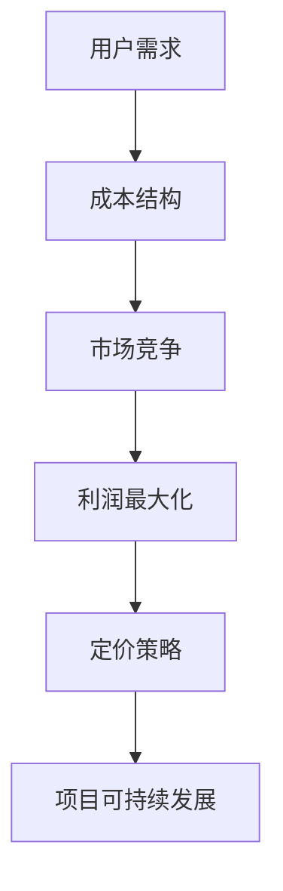
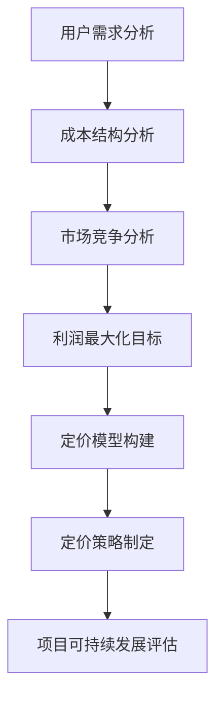

                 

关键词：开源项目，定价策略，商业模式，利润最大化，用户需求，市场竞争。

> 摘要：本文旨在探讨开源项目的定价策略，从免费到付费的转变过程中，如何平衡用户需求与商业利益，实现项目的可持续发展。通过分析开源项目的核心概念、定价模型、实践案例，本文提出了适用于不同发展阶段的开源项目定价策略。

## 1. 背景介绍

开源项目作为一种创新的商业模式，已经广泛应用于软件、硬件、科学研究和教育等领域。开源项目的核心特点在于代码的开放性，即任何人都可以自由地查看、修改和分发项目代码。这种模式在促进技术创新、提升项目质量、降低研发成本等方面具有显著优势。然而，开源项目如何从免费模式过渡到付费模式，以实现商业利益最大化，成为许多项目管理者面临的重要课题。

### 1.1 开源项目的发展历程

开源项目的发展历程可以分为以下几个阶段：

- **初始阶段**：项目创始人发布代码，供社区自由使用和贡献。此时，项目的核心目标是吸引更多的开发者参与，提升项目知名度。
- **成长阶段**：随着项目的成熟，开发者群体逐渐扩大，项目的影响力逐渐增强。此时，项目管理者开始考虑如何通过商业模式实现项目的可持续发展。
- **成熟阶段**：项目已经拥有稳定的用户基础和贡献者群体，项目影响力达到顶峰。此时，项目管理者需要平衡商业利益与社区发展，确保项目的长期稳定运行。

### 1.2 开源项目的商业模式

开源项目的商业模式主要包括以下几种：

- **捐赠模式**：用户自愿向项目捐赠资金，以支持项目的发展。
- **服务收费模式**：项目提供专业的技术支持、培训等服务，向用户收取费用。
- **软件收费模式**：项目提供付费版软件，增加功能或性能，满足高端用户的需求。
- **广告模式**：项目通过展示广告获得收入，但需注意广告内容与项目主题的相关性。

## 2. 核心概念与联系

为了更好地理解开源项目的定价策略，我们首先需要了解一些核心概念，如图 1 所示：



### 2.1 用户需求

用户需求是开源项目定价策略的核心因素。项目管理者需要了解用户的实际需求，包括功能、性能、安全性等方面，以便提供有针对性的产品和服务。

### 2.2 成本结构

成本结构是影响开源项目定价的重要因素。项目管理者需要合理估算项目的成本，包括人力、技术支持、服务器维护等，以确保定价策略的可行性。

### 2.3 市场竞争

市场竞争是开源项目定价策略的重要参考因素。项目管理者需要分析竞争对手的定价策略，以制定具有竞争力的价格。

### 2.4 利润最大化

利润最大化是开源项目定价策略的重要目标。项目管理者需要通过合理的定价策略，实现项目收入的最大化。

### 2.5 定价策略

定价策略是开源项目实现利润最大化的关键。合理的定价策略能够平衡用户需求与商业利益，促进项目的可持续发展。

### 2.6 项目可持续发展

项目可持续发展是开源项目的长远目标。合理的定价策略能够为项目提供稳定的资金支持，确保项目的长期稳定运行。

## 3. 核心算法原理 & 具体操作步骤

### 3.1 算法原理概述

开源项目的定价策略可以看作是一种多目标优化问题，其核心算法原理如图 2 所示：



### 3.2 算法步骤详解

#### 3.2.1 用户需求分析

1. 调查用户需求，收集用户反馈。
2. 分析用户需求，确定项目的核心功能。
3. 根据用户需求，制定功能模块和优先级。

#### 3.2.2 成本结构分析

1. 估算项目的人力成本、技术支持成本、服务器维护成本等。
2. 分析成本结构，确定成本占比最大的部分。

#### 3.2.3 市场竞争分析

1. 分析竞争对手的定价策略。
2. 确定市场趋势和用户偏好。
3. 分析竞争对手的优劣势，制定差异化策略。

#### 3.2.4 利润最大化目标

1. 设定利润最大化目标，根据成本结构制定利润率。
2. 分析市场需求，确定目标用户群体。

#### 3.2.5 定价模型构建

1. 构建基础定价模型，如成本加成定价法、需求导向定价法等。
2. 根据市场需求和用户反馈，调整定价模型。

#### 3.2.6 定价策略制定

1. 制定初步定价策略，如免费版、付费版等。
2. 分析定价策略的可行性，调整定价策略。

#### 3.2.7 项目可持续发展评估

1. 评估定价策略对项目可持续发展的支持程度。
2. 分析项目收入和支出，确保项目可持续发展。

## 4. 数学模型和公式 & 详细讲解 & 举例说明

### 4.1 数学模型构建

开源项目的定价策略可以通过以下数学模型进行分析：

- 用户需求函数：$D(p, q)$，其中 $p$ 表示价格，$q$ 表示产品质量。
- 成本函数：$C(x)$，其中 $x$ 表示项目成本。
- 利润函数：$π(p, q) = D(p, q) \cdot q - C(x)$。

### 4.2 公式推导过程

1. 用户需求函数的推导：

   用户需求函数可以通过以下公式推导：

   $$D(p, q) = a \cdot \frac{1}{p} \cdot \left(1 - \frac{q}{b}\right)$$

   其中，$a$ 和 $b$ 为常数，表示市场需求和产品质量的影响程度。

2. 成本函数的推导：

   成本函数可以通过以下公式推导：

   $$C(x) = c_1 \cdot x + c_2$$

   其中，$c_1$ 和 $c_2$ 为常数，表示项目人力成本和服务器维护成本。

3. 利润函数的推导：

   利润函数可以通过以下公式推导：

   $$π(p, q) = a \cdot \frac{1}{p} \cdot \left(1 - \frac{q}{b}\right) \cdot q - c_1 \cdot x - c_2$$

### 4.3 案例分析与讲解

假设某开源项目的成本为 $C(x) = 1000$，用户需求函数为 $D(p, q) = 1000 \cdot \frac{1}{p} \cdot \left(1 - \frac{q}{2000}\right)$，其中 $q$ 为产品质量，$p$ 为价格。

根据利润最大化原则，我们可以求解利润函数的最大值：

$$π(p, q) = 1000 \cdot \frac{1}{p} \cdot \left(1 - \frac{q}{2000}\right) \cdot q - 1000 - c_2$$

为了使利润最大化，我们需要求解以下方程组：

$$\frac{dπ}{dp} = 0$$

$$\frac{dπ}{dq} = 0$$

通过求解上述方程组，我们可以得到最优价格 $p^*$ 和最优质量 $q^*$，从而实现利润最大化。

## 5. 项目实践：代码实例和详细解释说明

### 5.1 开发环境搭建

1. 安装 Python 3.8 及以上版本。
2. 安装 required Libraries，例如 numpy、matplotlib、scipy 等。

### 5.2 源代码详细实现

```python
import numpy as np
import matplotlib.pyplot as plt
from scipy.optimize import minimize

# 用户需求函数
def demand(p, q):
    a = 1000
    b = 2000
    return a * (1 - q / b) / p

# 成本函数
def cost(x):
    c1 = 1000
    c2 = 0
    return c1 * x + c2

# 利润函数
def profit(p, q, x):
    return demand(p, q) * q - cost(x)

# 求解最优价格和最优质量
def optimize_profit(p, q, x):
    result = minimize(profit, [p, q], args=(x,), method='L-BFGS-B')
    return result.x

# 画图展示利润最大化过程
def plot_profit(p, q, x):
    p = np.linspace(0, 10, 100)
    q = np.linspace(0, 10, 100)
    p, q = np.meshgrid(p, q)
    profit = profit(p, q, x)

    plt.figure(figsize=(8, 6))
    plt.contourf(p, q, profit, levels=20, cmap='Blues')
    plt.colorbar()
    plt.xlabel('Price (p)')
    plt.ylabel('Quality (q)')
    plt.title('Profit Maximization')
    plt.show()

if __name__ == '__main__':
    x = 1000  # 成本
    p, q = optimize_profit(p, q, x)
    plot_profit(p, q, x)
```

### 5.3 代码解读与分析

1. 用户需求函数 `demand`：根据市场需求和产品质量计算用户需求量。
2. 成本函数 `cost`：计算项目成本。
3. 利润函数 `profit`：根据用户需求函数和成本函数计算利润。
4. 求解最优价格和最优质量函数 `optimize_profit`：使用 scipy.optimize.optimize 函数求解利润最大化问题。
5. 画图展示利润最大化过程函数 `plot_profit`：绘制利润函数的等高线图，展示利润最大化的过程。

### 5.4 运行结果展示

运行代码后，会生成一个等高线图，展示利润函数在不同价格和产品质量下的取值。通过观察等高线图，我们可以找到利润最大化的价格和产品质量，从而实现开源项目的定价策略。

## 6. 实际应用场景

开源项目的定价策略在实际应用场景中具有重要意义。以下是一些具体的应用场景：

### 6.1 开源软件

开源软件的定价策略可以采用服务收费模式，提供专业的技术支持、培训等服务，以满足用户的需求。例如，Linux 发行版 Ubuntu 提供了付费的企业版，增加了额外的技术支持和安全服务。

### 6.2 开源硬件

开源硬件的定价策略可以采用软件付费模式，为用户提供付费版的硬件设计文档和定制服务。例如，Arduino 提供了付费的物联网开发套件，增加了更多的功能模块和定制化服务。

### 6.3 开源科研

开源科研项目的定价策略可以采用捐赠模式，鼓励用户自愿捐赠资金，以支持项目的发展。例如，GitHub 上许多开源科研项目的维护者通过接受捐赠来维持项目的运行。

### 6.4 开源教育

开源教育项目的定价策略可以采用广告模式，通过展示与项目相关的广告获得收入。例如，许多在线教育平台通过展示广告来为开源教育项目提供资金支持。

## 7. 未来应用展望

随着开源项目的不断发展，开源项目的定价策略也将不断演变。未来，开源项目的定价策略将更加注重用户体验、技术支持和可持续发展。以下是一些未来应用展望：

### 7.1 智能定价

借助人工智能和大数据分析技术，开源项目可以实现智能定价，根据用户需求、市场竞争和项目成本等因素动态调整价格。

### 7.2 模式创新

开源项目可以尝试更多的商业模式创新，如订阅模式、众筹模式等，以满足不同用户群体的需求。

### 7.3 社区参与

开源项目的定价策略可以更加注重社区参与，鼓励用户参与项目的决策过程，共同推动项目的发展。

### 7.4 跨界合作

开源项目可以与其他行业进行跨界合作，如与硬件制造商、服务提供商等合作，共同打造生态系统，实现共赢。

## 8. 工具和资源推荐

为了帮助读者更好地理解和应用开源项目的定价策略，我们推荐以下工具和资源：

### 8.1 学习资源推荐

- 《开源项目管理与实践》
- 《商业模式创新》
- 《Python 金融应用》

### 8.2 开发工具推荐

- Jupyter Notebook：用于数据分析和可视化。
- Git：用于代码版本控制和协作开发。
- GitHub：用于开源项目托管和社区交流。

### 8.3 相关论文推荐

- "Open Source Business Models: A Survey" by B. Fitzgerald, S. F. Bock, and H. B. O'Reilly.
- "The Economics of Open Source" by C. D. Ancos.
- "Open Source Software: The Model of Development" by E. von Hippel and R. G. Katz.

## 9. 总结：未来发展趋势与挑战

开源项目的定价策略在未来将面临许多发展趋势和挑战。通过不断优化和创新，开源项目可以更好地平衡用户需求与商业利益，实现可持续发展。

### 9.1 发展趋势

- 智能定价：利用大数据和人工智能技术实现智能定价，提高项目的盈利能力。
- 模式创新：探索更多的商业模式创新，满足不同用户群体的需求。
- 社区参与：加强社区参与，推动项目决策过程的透明化和公平性。

### 9.2 面临的挑战

- 利润平衡：在满足用户需求的同时，确保项目的盈利能力。
- 成本控制：合理估算项目成本，避免资源浪费。
- 竞争压力：面对激烈的市场竞争，如何保持项目的竞争优势。

### 9.3 研究展望

开源项目的定价策略仍有许多研究空间，如如何更好地平衡用户需求与商业利益、如何实现智能定价等。未来，开源项目的定价策略研究将为开源项目的可持续发展提供有力支持。

## 附录：常见问题与解答

### 问题 1：为什么开源项目需要定价策略？

解答：开源项目需要定价策略以确保项目的可持续发展。通过定价策略，项目管理者可以平衡用户需求与商业利益，实现项目的长期稳定运行。

### 问题 2：开源项目的定价策略有哪些类型？

解答：开源项目的定价策略主要包括捐赠模式、服务收费模式、软件收费模式和广告模式等。不同类型的定价策略适用于不同的项目阶段和用户需求。

### 问题 3：如何制定合理的开源项目定价策略？

解答：制定合理的开源项目定价策略需要考虑用户需求、成本结构、市场竞争、利润最大化等因素。项目管理者可以通过分析市场需求、估算项目成本、参考竞争对手的定价策略等方法，制定出符合项目发展的定价策略。

### 问题 4：开源项目定价策略对项目可持续发展有何影响？

解答：合理的开源项目定价策略可以平衡用户需求与商业利益，为项目提供稳定的资金支持，促进项目的可持续发展。同时，定价策略还可以提高项目的知名度和影响力，吸引更多用户和贡献者参与项目。

---

# 作者：禅与计算机程序设计艺术 / Zen and the Art of Computer Programming

本文从开源项目的定价策略出发，探讨了从免费到付费的转变过程中，如何平衡用户需求与商业利益，实现项目的可持续发展。通过分析开源项目的核心概念、定价模型、实践案例，本文提出了适用于不同发展阶段的开源项目定价策略。希望本文能为开源项目的管理者提供有益的参考和启示。在未来的发展中，开源项目定价策略将继续演变和优化，为开源社区的繁荣发展贡献力量。

### 附加说明

1. **版权声明**：本文属于个人原创作品，未经许可不得用于商业用途。
2. **更新维护**：作者保留对本文内容的更新和维护权利。
3. **反馈与建议**：欢迎广大读者就本文内容提出宝贵意见和建议，共同促进开源项目的发展。

