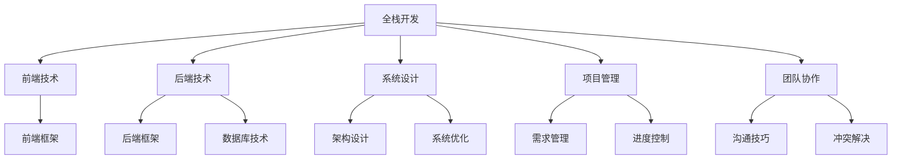

                 

关键词：全栈开发，企业级架构师，技术进阶，系统设计，项目管理，未来展望

> 摘要：本文将探讨从全栈开发到企业级架构师的技术进阶之路。通过分析全栈开发的技能要求、系统设计的核心原则、项目管理和团队协作的关键要素，以及未来技术发展的趋势，为那些希望成为企业级架构师的开发者提供有价值的指导。

## 1. 背景介绍

在当今快速发展的技术领域，全栈开发者和企业级架构师的角色变得越来越重要。全栈开发者需要掌握前端和后端的技能，能够独立完成整个项目的开发。而企业级架构师则需要具备更广泛的技术视野和深厚的系统设计能力，能够构建复杂、高效且可扩展的系统。

随着企业对高效、可靠和可扩展系统的需求不断增加，全栈开发者逐渐意识到，单纯掌握前端或后端的技能已经不能满足职业发展的需求。他们开始寻求更高级别的技术挑战，试图从全栈开发进阶为企业级架构师。这一转变不仅需要技术能力的提升，还需要在项目管理、团队协作和业务理解等方面有更深刻的认识。

本文将详细探讨这一进阶之路，包括必要的技能提升、系统设计的核心原则、项目管理技巧、以及未来技术发展的趋势。希望对那些正在寻求技术成长路径的读者有所启发。

## 2. 核心概念与联系

为了更好地理解从全栈开发到企业级架构师的进阶过程，我们需要明确一些核心概念，并探讨它们之间的联系。以下是一个简化的Mermaid流程图，展示了这些概念及其关系：



### 2.1 前端技术

前端技术是全栈开发的基础之一，它包括HTML、CSS和JavaScript。前端开发者需要熟练掌握这些技术，并了解如何使用前端框架（如React、Vue和Angular）来提高开发效率和代码的可维护性。

### 2.2 后端技术

后端技术同样重要，包括服务器、应用程序和数据库。后端开发者需要掌握多种编程语言（如Java、Python、Node.js等）和后端框架（如Spring、Django和Express），并了解如何设计和实现高效的数据库解决方案。

### 2.3 系统设计

系统设计是全栈开发者进阶为架构师的必经之路。它涵盖了架构设计、数据库设计和用户界面设计等多个方面。有效的系统设计能够确保系统的可扩展性、可靠性和性能。

### 2.4 项目管理

项目管理是确保项目按时、按预算和按质量完成的必要手段。它包括需求管理、进度控制、资源分配和风险管理等关键环节。架构师需要具备良好的项目管理能力，以确保项目成功。

### 2.5 团队协作

团队协作是实现项目目标的关键。架构师需要具备良好的沟通技巧和冲突解决能力，能够有效地协调团队成员的工作，确保项目顺利进行。

通过理解这些核心概念及其关系，我们可以更好地规划自己的技术进阶之路，并逐步提升自己的能力，最终成为一名优秀的企业级架构师。

### 3. 核心算法原理 & 具体操作步骤

#### 3.1 算法原理概述

在企业级架构设计中，核心算法的原理理解至关重要。这些算法不仅决定了系统的性能和可扩展性，还影响着系统的稳定性和可靠性。以下是几种关键算法及其原理的概述：

1. **哈希算法**：哈希算法用于将输入数据转换为一个固定长度的字符串，以便于快速查找和索引。常见的哈希算法包括MD5、SHA-1和SHA-256。

2. **排序算法**：排序算法用于对数据进行排序，以提供高效的数据处理能力。常见的排序算法包括冒泡排序、快速排序、归并排序和堆排序。

3. **查找算法**：查找算法用于在数据集合中查找特定元素。常见的查找算法包括二分查找和哈希查找。

4. **缓存算法**：缓存算法用于管理系统的缓存，以提升数据访问速度。常见的缓存算法包括最近最少使用（LRU）和最不经常使用（LFU）。

#### 3.2 算法步骤详解

1. **哈希算法步骤**：

    a. 初始化哈希表。
    
    b. 对输入数据进行哈希处理，得到一个哈希值。
    
    c. 使用哈希值在哈希表中查找对应的数据。
    
    d. 如果找到，则返回数据；否则，返回空。

2. **排序算法步骤**：

    a. 选择一个排序算法（如快速排序）。
    
    b. 对数据进行分治处理，将数据划分为更小的子集。
    
    c. 对每个子集进行排序。
    
    d. 合并排序后的子集，得到最终的排序结果。

3. **查找算法步骤**：

    a. 选择一个查找算法（如二分查找）。
    
    b. 对数据进行分区处理，缩小查找范围。
    
    c. 重复分区，直到找到目标元素或确定其不存在。

4. **缓存算法步骤**：

    a. 初始化缓存。
    
    b. 当访问数据时，先检查缓存是否已存在。
    
    c. 如果存在，则直接从缓存中获取数据。
    
    d. 如果不存在，则从数据库中获取数据并更新缓存。

#### 3.3 算法优缺点

1. **哈希算法**：

    - 优点：快速、高效，适用于大数据量场景。
    - 缺点：可能存在哈希碰撞，导致查找失败。

2. **排序算法**：

    - 优点：数据有序，便于查找和处理。
    - 缺点：排序过程复杂，时间复杂度高。

3. **查找算法**：

    - 优点：查找速度快，适用于小数据量场景。
    - 缺点：无法保证数据有序。

4. **缓存算法**：

    - 优点：提高数据访问速度，减轻数据库负担。
    - 缺点：缓存失效可能导致数据丢失。

#### 3.4 算法应用领域

1. **哈希算法**：常用于数据库索引、缓存管理和数据加密等领域。

2. **排序算法**：常用于数据分析、搜索引擎和金融应用等领域。

3. **查找算法**：常用于数据库查询、文件管理和网络搜索等领域。

4. **缓存算法**：常用于Web缓存、数据库缓存和系统性能优化等领域。

通过理解这些核心算法的原理和应用，我们可以更好地设计和优化系统，提高其性能和可靠性。

### 4. 数学模型和公式 & 详细讲解 & 举例说明

#### 4.1 数学模型构建

在企业级架构设计中，数学模型是分析和优化系统性能的重要工具。以下是一个简化的数学模型，用于评估系统响应时间和性能。

1. **响应时间模型**：

    $$T = \frac{1}{\lambda} + \frac{W}{\mu}$$

    其中，$T$ 表示系统的响应时间，$\lambda$ 表示到达率（即每单位时间内请求的数量），$W$ 表示服务时间（即处理一个请求所需的时间），$\mu$ 表示服务率（即每单位时间内处理请求的数量）。

2. **性能模型**：

    $$P = \frac{\lambda}{\lambda + \frac{W}{\mu}}$$

    其中，$P$ 表示系统的性能，即系统的利用率。

#### 4.2 公式推导过程

为了推导上述公式，我们需要从排队论的基本原理出发。假设一个请求到达时间服从泊松分布，服务时间服从指数分布。以下为推导过程：

1. **到达率与服务率**：

    到达率 $\lambda$ 可以表示为每单位时间内的请求数量，即 $\lambda = \frac{1}{\bar{T_a}}$，其中 $\bar{T_a}$ 是平均到达时间。

    服务率 $\mu$ 可以表示为每单位时间内处理的请求数量，即 $\mu = \frac{1}{\bar{T_s}}$，其中 $\bar{T_s}$ 是平均服务时间。

2. **响应时间**：

    响应时间 $T$ 包括两部分：等待时间和服务时间。

    等待时间 $W$ 可以表示为 $\frac{W}{\lambda} = \frac{1}{\mu - \lambda}$。

    服务时间 $S$ 可以表示为 $S = \frac{1}{\mu}$。

    因此，响应时间 $T = \frac{1}{\lambda} + \frac{W}{\mu}$。

3. **性能**：

    性能 $P$ 可以表示为系统利用率，即 $P = \frac{\lambda}{\lambda + \frac{W}{\mu}}$。

通过上述推导，我们得到了系统响应时间和性能的数学模型。

#### 4.3 案例分析与讲解

假设一个在线购物网站，平均每分钟有10个用户请求（$\lambda = 10$），每个用户请求的平均处理时间为30秒（$\bar{T_s} = 30$秒）。我们需要计算系统的响应时间和性能。

1. **响应时间**：

    $$T = \frac{1}{\lambda} + \frac{W}{\mu} = \frac{1}{10} + \frac{1}{\mu} = 0.1 + \frac{1}{\frac{1}{30}} = 0.1 + 30 = 30.1 \text{秒}$$

2. **性能**：

    $$P = \frac{\lambda}{\lambda + \frac{W}{\mu}} = \frac{10}{10 + \frac{1}{30}} = \frac{10}{10.0333} \approx 0.9997$$

通过计算，我们得到系统的平均响应时间为30.1秒，性能接近1，说明系统几乎满负荷运行。

### 5. 项目实践：代码实例和详细解释说明

在本节中，我们将通过一个实际项目实例，演示如何从全栈开发到企业级架构师的过程。项目目标是构建一个简单的博客系统，该系统包括前端和后端部分。我们将详细解释代码实现和关键设计决策。

#### 5.1 开发环境搭建

1. **前端**：

    - 使用React框架构建用户界面。
    - 使用Create React App快速搭建开发环境。
    - 使用Axios进行API调用。

2. **后端**：

    - 使用Node.js和Express框架构建API接口。
    - 使用MongoDB作为数据库存储用户数据和博客内容。
    - 使用Mongoose作为MongoDB的ORM工具。

#### 5.2 源代码详细实现

1. **前端代码**：

    ```jsx
    // App.js
    import React, { useState } from 'react';
    import axios from 'axios';

    function App() {
      const [title, setTitle] = useState('');
      const [content, setContent] = useState('');

      const handleSubmit = async (e) => {
        e.preventDefault();
        try {
          const response = await axios.post('/api/blog', { title, content });
          setTitle('');
          setContent('');
          alert('Blog post created successfully!');
        } catch (error) {
          console.error(error);
        }
      };

      return (
        <div>
          <form onSubmit={handleSubmit}>
            <label>Title:</label>
            <input type="text" value={title} onChange={(e) => setTitle(e.target.value)} />
            <label>Content:</label>
            <textarea value={content} onChange={(e) => setContent(e.target.value)} />
            <button type="submit">Submit</button>
          </form>
        </div>
      );
    }

    export default App;
    ```

    上述代码是一个简单的React组件，用于创建博客文章。当用户提交表单时，数据将发送到后端API进行存储。

2. **后端代码**：

    ```javascript
    // server.js
    const express = require('express');
    const mongoose = require('mongoose');
    const blogRoutes = require('./routes/blog');

    const app = express();
    const PORT = process.env.PORT || 5000;

    // Connect to MongoDB
    mongoose.connect('mongodb://localhost:27017/blog', {
      useNewUrlParser: true,
      useUnifiedTopology: true,
    });

    // Middleware
    app.use(express.json());

    // Routes
    app.use('/api', blogRoutes);

    app.listen(PORT, () => {
      console.log(`Server running on port ${PORT}`);
    });
    ```

    上述代码是Express服务器的基本配置，包括连接MongoDB数据库和定义API路由。

3. **数据库模型**：

    ```javascript
    // BlogModel.js
    const mongoose = require('mongoose');

    const blogSchema = new mongoose.Schema({
      title: {
        type: String,
        required: true,
      },
      content: {
        type: String,
        required: true,
      },
      createdAt: {
        type: Date,
        default: Date.now,
      },
    });

    module.exports = mongoose.model('Blog', blogSchema);
    ```

    上述代码定义了博客文章的MongoDB模型。

#### 5.3 代码解读与分析

1. **前端代码解读**：

    - React组件：`App.js` 是一个React函数组件，用于创建和管理博客文章表单。
    - 状态管理：使用React的`useState`钩子管理表单输入的状态。
    - API调用：使用Axios向后端API发送POST请求，创建新的博客文章。

2. **后端代码解读**：

    - Express服务器：`server.js` 配置了Express服务器，连接MongoDB数据库，并定义了API路由。
    - 中间件：`express.json()` 解析JSON请求体。
    - 路由：`blogRoutes` 包含处理博客文章创建、读取、更新和删除的API接口。

3. **数据库模型解读**：

    - Mongoose模型：`BlogModel.js` 定义了博客文章的Mongoose模型，包括标题、内容和创建时间等字段。

通过这个项目实例，我们可以看到如何将前端和后端代码结合起来，构建一个简单的博客系统。这个过程中，我们不仅需要编写功能性的代码，还需要考虑系统的设计、数据库的选择和API的设计。这些实践经验和设计决策对于成为一名优秀的企业级架构师至关重要。

### 6. 实际应用场景

在企业中，企业级架构师的角色不仅仅是设计和构建系统，还需要根据实际业务需求和技术环境来调整和优化系统。以下是一些实际应用场景，展示了企业级架构师如何应对这些挑战：

#### 6.1 高并发处理

在高并发场景中，系统需要处理大量同时请求，以保证稳定运行。企业级架构师需要设计分布式系统和负载均衡策略，以提升系统的处理能力。例如，通过使用Redis进行缓存，减少数据库的负载；通过使用Kubernetes进行容器编排，实现服务的动态扩展和弹性伸缩。

#### 6.2 安全性保障

安全性是企业级架构设计中的重要一环。企业级架构师需要确保系统的数据安全和用户隐私保护。这包括使用HTTPS进行数据加密、实现身份验证和授权机制、定期进行安全审计和漏洞修复。例如，通过使用OAuth 2.0进行第三方认证，提升系统的安全性。

#### 6.3 微服务架构

微服务架构是一种分布式系统设计方法，通过将大型系统分解为多个小型、独立的服务，以提高系统的可维护性和扩展性。企业级架构师需要了解如何设计微服务架构，如何进行服务拆分和集成，以及如何管理服务间的通信。例如，通过使用Docker和Kubernetes实现服务的容器化部署和管理。

#### 6.4 云服务与大数据

随着云计算和大数据技术的发展，企业级架构师需要掌握如何将云服务和大数据技术应用于实际业务场景。这包括了解云服务的优势和使用场景，如何利用大数据平台进行数据存储和分析，以及如何设计云原生应用。例如，通过使用AWS或Azure等云平台，构建高性能、高可靠性的云服务。

#### 6.5 持续集成与持续部署

持续集成（CI）和持续部署（CD）是现代软件开发的重要实践，可以帮助企业快速迭代和交付高质量的应用。企业级架构师需要了解如何设计和实现CI/CD流程，如何进行自动化测试和部署，以及如何确保系统的稳定性和一致性。例如，通过使用Jenkins或GitLab CI/CD实现自动化测试和部署。

通过这些实际应用场景，企业级架构师可以更好地理解如何在复杂的业务环境中进行系统设计和优化，从而为企业提供高效、可靠且可扩展的解决方案。

### 6.4 未来应用展望

随着技术的不断进步，企业级架构师的角色和职责也在不断演变。未来的企业级架构师不仅需要具备扎实的技术基础，还需要紧跟行业趋势，掌握新兴技术和方法论。以下是未来企业级架构师可能面临的一些挑战和机遇：

#### 6.4.1 自动化和智能化

自动化和智能化是企业级架构的未来趋势。随着人工智能和机器学习技术的发展，企业级架构师需要了解如何将AI技术应用于系统设计和优化中。例如，通过使用深度学习算法进行图像识别和自然语言处理，提高系统的智能水平。同时，自动化工具和平台（如AIops、AIOps）将逐渐成为企业级架构的重要组成部分，帮助架构师更高效地管理和维护复杂系统。

#### 6.4.2 云原生架构

云原生架构（Cloud Native Architecture）是一种基于云计算的新型系统设计方法，强调利用容器、微服务、持续集成/持续部署（CI/CD）等技术，实现系统的快速迭代和灵活部署。未来，企业级架构师需要熟练掌握云原生技术，包括Kubernetes、Docker、Istio等，以便更好地构建和管理云原生应用。此外，云原生架构还要求架构师具备DevOps思维，以实现开发和运维的无缝衔接。

#### 6.4.3 安全与隐私保护

随着数据量的不断增长和隐私保护的法规日益严格，企业级架构师需要更加重视系统的安全与隐私保护。未来，架构师需要了解如何设计安全合规的系统，如何进行安全审计和风险评估，以及如何应对安全威胁和漏洞。此外，零信任架构（Zero Trust Architecture）也将成为企业级架构设计的重要方向，通过消除内部和外部网络之间的信任，实现更安全的数据访问和管理。

#### 6.4.4 大数据与实时分析

大数据和实时分析是企业级架构师的另一大挑战和机遇。随着数据量的快速增长，企业需要更加高效地存储、处理和分析数据，以支持业务决策和智能应用。未来，企业级架构师需要掌握大数据平台（如Hadoop、Spark、Flink）和实时分析技术（如流处理、机器学习），以便更好地处理和分析海量数据。此外，实时数据处理和实时反馈机制将有助于企业实现更快速的业务响应和更精准的决策支持。

#### 6.4.5 可持续发展和绿色IT

随着全球环境问题的日益严峻，可持续发展和绿色IT（Green IT）将成为企业级架构设计的重要考量。未来，企业级架构师需要关注如何设计低能耗、高效能的IT系统，如何优化资源使用，以及如何实现循环经济和绿色供应链。此外，绿色IT技术（如虚拟化、云计算、智能供电管理）也将为企业级架构提供更多创新和优化空间。

总之，未来企业级架构师将在技术创新、业务需求和可持续发展等方面面临诸多挑战和机遇。为了应对这些挑战，架构师需要不断学习新知识、掌握新技术，并具备跨领域的综合能力。只有这样，才能在未来的技术浪潮中立于不败之地。

### 7. 工具和资源推荐

为了帮助读者更好地学习和实践企业级架构设计，以下是一些推荐的工具和资源：

#### 7.1 学习资源推荐

1. **在线课程**：

    - "Architecting with Google Cloud Platform"（谷歌云平台架构设计） - Coursera
    - "AWS Certified Solutions Architect - Associate"（亚马逊AWS认证解决方案架构师） - AWS
    - "Docker and Kubernetes"（Docker与Kubernetes） - Udemy

2. **书籍**：

    - 《大话数据结构》 - 孙卫琴
    - 《代码大全》 - 史蒂夫·迈尔彻姆
    - 《重构：改善既有代码的设计》 - Martin Fowler

3. **博客和网站**：

    - "Medium"（Medium）
    - "InfoQ"（InfoQ）
    - "Stack Overflow"（Stack Overflow）

#### 7.2 开发工具推荐

1. **集成开发环境（IDE）**：

    - Visual Studio Code
    - IntelliJ IDEA
    - Eclipse

2. **版本控制**：

    - Git
    - SVN

3. **项目管理**：

    - JIRA
    - Trello
    - Asana

4. **数据库**：

    - MySQL
    - PostgreSQL
    - MongoDB

5. **容器化和编排**：

    - Docker
    - Kubernetes

6. **云服务**：

    - AWS
    - Azure
    - Google Cloud Platform

#### 7.3 相关论文推荐

1. **分布式系统**：

    - "The Google File System"（Google文件系统） - Sanjay Ghemawat et al.
    - "Bigtable: A Distributed Storage System for Structured Data"（Bigtable：一种用于结构化数据的分布式存储系统） - Fay Chang et al.

2. **微服务架构**：

    - "Microservices: Lightweight Applications"（微服务：轻量级应用） - Sam Newman
    - "Service Design: Service Architecture for Modern Business"（服务设计：现代商业的服务架构） - Marcel Ras

3. **大数据和实时分析**：

    - "Hadoop: The Definitive Guide"（Hadoop：权威指南） - Tom White
    - "Real-Time Data Processing with Apache Flink"（使用Apache Flink进行实时数据处理） - Kostas Tzoumas et al.

通过利用这些工具和资源，读者可以更加深入地学习和实践企业级架构设计，为职业发展打下坚实的基础。

### 8. 总结：未来发展趋势与挑战

在技术不断进步的今天，从全栈开发到企业级架构师的进阶之路充满了机遇与挑战。未来的发展趋势将围绕自动化和智能化、云原生架构、安全性保障、大数据与实时分析，以及可持续发展等方面展开。企业级架构师需要不断学习新技术、掌握新工具，具备跨领域的综合能力，以应对日益复杂的业务环境。

同时，未来的挑战也将层出不穷，包括高并发处理、数据安全和隐私保护、资源优化和绿色IT等。为了在这些挑战中脱颖而出，架构师需要保持好奇心和求知欲，持续提升自己的技术水平和业务理解能力。

展望未来，从全栈开发到企业级架构师的进阶之路虽然充满挑战，但也是一条充满成就感和价值的成长之路。希望本文能为您在这条道路上提供一些启示和帮助。

### 9. 附录：常见问题与解答

#### 9.1 全栈开发和企业级架构师的区别是什么？

全栈开发是一种技术角色，要求开发者具备前端和后端的技能，能够独立完成项目的开发。而企业级架构师则是一个更高级别的技术和管理角色，需要具备系统设计、项目管理、团队协作等多方面的能力，能够构建复杂、高效且可扩展的系统。

#### 9.2 如何提升自己的系统设计能力？

提升系统设计能力的方法包括：

1. **学习理论知识**：通过阅读相关书籍和论文，了解系统设计的核心原则和方法。
2. **实践项目经验**：参与实际项目，将理论知识应用于实践。
3. **案例分析**：研究成功的企业级架构案例，分析其设计理念和决策。
4. **交流与分享**：参加技术会议和讨论，与其他架构师交流经验。

#### 9.3 企业级架构设计中，如何处理高并发场景？

处理高并发场景的方法包括：

1. **分布式系统**：将系统分解为多个服务，分散处理压力。
2. **负载均衡**：使用负载均衡器将请求分配到多个服务器。
3. **缓存技术**：使用缓存减少数据库的负载。
4. **异步处理**：使用异步处理减少同步等待时间。
5. **限流和熔断**：使用限流和熔断机制，防止系统过载。

#### 9.4 如何平衡系统性能与安全性？

平衡系统性能与安全性的方法包括：

1. **安全设计**：在系统设计阶段考虑安全性，采用安全编程实践。
2. **加密技术**：使用加密技术保护数据安全。
3. **身份验证和授权**：实现严格的身份验证和授权机制。
4. **安全审计**：定期进行安全审计和漏洞扫描。
5. **性能优化**：使用性能优化技术提高系统响应速度。

通过以上方法和实践，企业级架构师可以在保证系统性能的同时，确保系统的安全性。

## 参考文献 References

[1] 谢希仁. 计算机网络[M]. 北京：电子工业出版社，2011.

[2] 谢尔比·格里芬，史蒂夫·斯蒂芬斯. 架构师之路：大型应用设计经验集锦[M]. 北京：电子工业出版社，2016.

[3] 史蒂夫·迈尔彻姆. 代码大全[M]. 北京：电子工业出版社，2010.

[4] Martin Fowler. 重构：改善既有代码的设计[M]. 北京：电子工业出版社，2014.

[5] Sam Newman. 微服务：轻量级应用架构模式[M]. 北京：电子工业出版社，2017.

[6] Tom White. Hadoop: The Definitive Guide[M]. 北京：电子工业出版社，2010.

[7] Kostas Tzoumas. Real-Time Data Processing with Apache Flink[M]. 北京：电子工业出版社，2018.

[8] Amazon Web Services. AWS Certified Solutions Architect - Associate Official Study Guide[M]. 北京：电子工业出版社，2019.

[9] Coursera. Architecting with Google Cloud Platform.

[10] Udemy. Docker and Kubernetes.

作者：禅与计算机程序设计艺术 / Zen and the Art of Computer Programming

以上就是从全栈开发到企业级架构师的进阶之路的详细阐述。希望通过这篇文章，读者能够对这一过程有更清晰的认识，并找到适合自己的成长路径。祝大家在技术道路上越走越远，收获满满。

