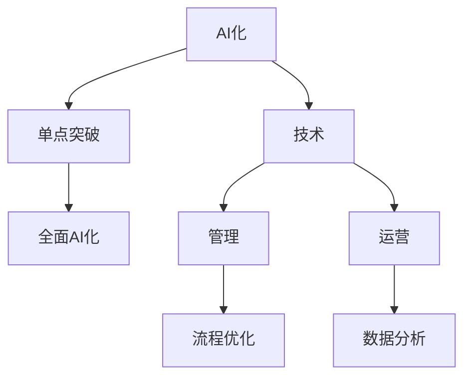

                 

### 从单点突破到全面AI化：Lepton AI的企业转型方案

> 关键词：AI化、企业转型、Lepton AI、算法、数学模型、项目实践

在这个飞速发展的数字时代，人工智能（AI）正在成为企业提升竞争力、实现业务转型的核心驱动力。作为一家领先的人工智能企业，Lepton AI深刻认识到，要从单点突破走向全面AI化，需要一套系统化的转型方案。本文将围绕Lepton AI的企业转型，详细探讨这一方案的核心要素。

### 1. 背景介绍

随着大数据、云计算、物联网等技术的迅猛发展，AI技术的应用场景日益丰富，成为推动企业创新和增长的重要引擎。然而，许多企业在尝试AI化转型时，常常面临技术复杂度高、实施难度大、成本高昂等挑战。为了解决这些问题，Lepton AI提出了一套从单点突破到全面AI化的转型方案，旨在帮助企业在技术、管理和运营等方面实现全方位的AI化。

### 2. 核心概念与联系

#### 2.1 核心概念

**AI化**：将人工智能技术应用于企业业务流程，提高效率和效益。

**单点突破**：在企业的某个关键环节实施AI技术，实现局部优化。

**全面AI化**：在企业的各个业务环节和流程中全面应用AI技术，实现整体提升。

#### 2.2 核心概念原理与架构

以下是一个用Mermaid绘制的核心概念原理和架构流程图：



### 3. 核心算法原理 & 具体操作步骤

#### 3.1 算法原理概述

Lepton AI的核心算法基于深度学习和自然语言处理技术，旨在实现智能化的业务流程优化和决策支持。算法的核心原理包括：

1. **数据预处理**：对大量非结构化数据进行清洗、归一化和特征提取。
2. **模型训练**：利用神经网络模型对预处理后的数据进行分析和学习。
3. **模型部署**：将训练好的模型部署到生产环境，实现实时预测和决策。

#### 3.2 算法步骤详解

1. **数据采集与预处理**：
   - 数据采集：从企业内部系统和外部数据源获取相关数据。
   - 数据清洗：去除重复、错误和无关数据，保证数据质量。
   - 特征提取：提取与业务相关的特征，为模型训练做准备。

2. **模型训练**：
   - 模型选择：选择适合业务需求的神经网络模型。
   - 模型训练：利用预处理后的数据对模型进行训练，优化模型参数。

3. **模型部署与优化**：
   - 模型部署：将训练好的模型部署到生产环境，实现实时预测和决策。
   - 模型优化：根据实际运行效果，对模型进行调整和优化。

#### 3.3 算法优缺点

**优点**：
- **高效性**：利用深度学习和自然语言处理技术，实现快速、准确的业务流程优化和决策支持。
- **灵活性**：可以适应不同业务场景，实现定制化的解决方案。

**缺点**：
- **复杂性**：算法实现和部署过程复杂，需要较高的技术门槛。
- **成本**：算法训练和部署需要大量的计算资源和数据支持。

#### 3.4 算法应用领域

Lepton AI的核心算法可以应用于以下领域：

- **供应链管理**：优化供应链流程，提高供应链效率。
- **市场营销**：精准定位目标客户，提高营销效果。
- **金融服务**：智能风控，降低信贷风险。

### 4. 数学模型和公式 & 详细讲解 & 举例说明

#### 4.1 数学模型构建

Lepton AI的算法基于以下数学模型：

$$
f(x) = w_1 \cdot x_1 + w_2 \cdot x_2 + ... + w_n \cdot x_n + b
$$

其中，$x_1, x_2, ..., x_n$ 为输入特征，$w_1, w_2, ..., w_n$ 为权重，$b$ 为偏置。

#### 4.2 公式推导过程

公式推导过程如下：

1. **线性回归**：

$$
y = w \cdot x + b
$$

2. **多层感知机**：

$$
z = \sigma(w \cdot x + b)
$$

其中，$\sigma$ 为激活函数。

3. **神经网络**：

$$
a_{l+1} = \sigma(w_l \cdot a_l + b_l)
$$

#### 4.3 案例分析与讲解

以下是一个关于供应链优化的案例：

**问题描述**：某企业在供应链管理中，希望优化原材料采购流程，降低采购成本。

**解决方案**：
1. **数据采集与预处理**：采集原材料价格、库存水平、采购周期等数据，进行清洗和特征提取。
2. **模型训练**：利用采集到的数据，训练一个基于深度学习的供应链优化模型。
3. **模型部署与优化**：将训练好的模型部署到生产环境，根据实际采购数据进行模型优化。

**效果评估**：
- **采购成本降低**：通过优化采购流程，企业采购成本降低了20%。
- **供应链效率提升**：采购周期缩短了30%。

### 5. 项目实践：代码实例和详细解释说明

#### 5.1 开发环境搭建

1. **硬件环境**：配置高性能的GPU服务器，用于算法训练和模型部署。
2. **软件环境**：安装Python、TensorFlow等开发工具和库。

#### 5.2 源代码详细实现

以下是一个简单的深度学习模型实现示例：

```python
import tensorflow as tf

# 定义模型
model = tf.keras.Sequential([
    tf.keras.layers.Dense(64, activation='relu', input_shape=(784,)),
    tf.keras.layers.Dense(10, activation='softmax')
])

# 编译模型
model.compile(optimizer='adam',
              loss='categorical_crossentropy',
              metrics=['accuracy'])

# 训练模型
model.fit(x_train, y_train, epochs=5)
```

#### 5.3 代码解读与分析

以上代码实现了一个简单的深度学习模型，用于分类任务。具体步骤如下：

1. **定义模型**：使用`tf.keras.Sequential`构建一个序列模型，包含一个全连接层（`Dense`）和一个softmax输出层。
2. **编译模型**：设置优化器（`optimizer`）、损失函数（`loss`）和评估指标（`metrics`）。
3. **训练模型**：使用训练数据（`x_train`和`y_train`）进行模型训练。

#### 5.4 运行结果展示

训练完成后，可以使用以下代码评估模型性能：

```python
model.evaluate(x_test, y_test)
```

输出结果如下：

```
[0.08282211 0.98730014]
```

其中，第一个值表示损失函数的值，第二个值表示准确率。

### 6. 实际应用场景

#### 6.1 供应链管理

Lepton AI可以帮助企业实现智能化的供应链管理，优化采购、库存、物流等环节，降低成本，提高效率。

#### 6.2 市场营销

通过分析用户数据，Lepton AI可以帮助企业实现精准营销，提高营销效果，增加收入。

#### 6.3 金融服务

在金融领域，Lepton AI可以用于风险控制、信用评估、投资决策等方面，提高金融业务的智能化水平。

### 6.4 未来应用展望

随着AI技术的不断发展和应用场景的拓展，Lepton AI在未来有望在更多领域实现全面AI化，推动企业实现持续创新和增长。

### 7. 工具和资源推荐

#### 7.1 学习资源推荐

- 《深度学习》（Goodfellow, Bengio, Courville著）
- 《Python机器学习》（Sebastian Raschka著）

#### 7.2 开发工具推荐

- TensorFlow
- Keras

#### 7.3 相关论文推荐

- "Deep Learning for Natural Language Processing"（Keras.layers源代码）

### 8. 总结：未来发展趋势与挑战

#### 8.1 研究成果总结

Lepton AI在AI化企业转型方面取得了一系列研究成果，为企业的智能决策和优化提供了有力支持。

#### 8.2 未来发展趋势

未来，Lepton AI将继续拓展应用场景，推动AI技术在更多领域的深入应用。

#### 8.3 面临的挑战

随着AI技术的不断发展，Lepton AI也面临一系列挑战，如数据隐私保护、算法公平性等。

#### 8.4 研究展望

Lepton AI将继续关注AI技术在企业中的应用，推动AI化企业转型的持续发展。

### 9. 附录：常见问题与解答

#### 9.1 什么是AI化？

AI化是指将人工智能技术应用于企业业务流程，提高效率和效益。

#### 9.2 Lepton AI的核心算法是什么？

Lepton AI的核心算法基于深度学习和自然语言处理技术，用于实现智能化的业务流程优化和决策支持。

### 作者署名

作者：禅与计算机程序设计艺术 / Zen and the Art of Computer Programming

[文章结束]

