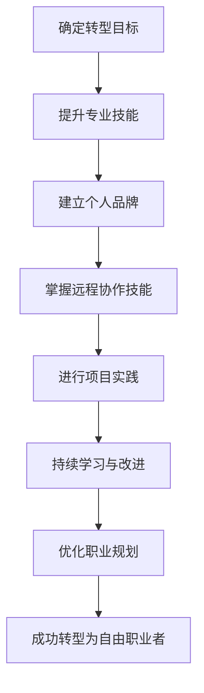

                 

关键词：自由职业者、IT行业、转型、工作模式、自我管理、远程协作、职业发展

> 摘要：本文旨在为希望从员工转型为自由职业者的IT专业人士提供一份详尽的指南。我们将探讨自由职业者所需具备的技能、如何建立个人品牌、远程协作的最佳实践、自我管理等关键因素，并分析自由职业者在IT行业中的机遇与挑战。

## 1. 背景介绍

在数字化时代，IT行业迅速发展，带来了前所未有的就业机会和职业发展路径。传统的全职工作模式逐渐被自由职业者模式所取代，越来越多的IT专业人士选择成为自由职业者，以享受更大的灵活性和更高的收入。然而，这一转型并非易事，它需要专业技能、强大的自我管理能力和有效的远程协作能力。

本文将分为以下几个部分：

1. 自由职业者的核心技能
2. 建立个人品牌
3. 远程协作的最佳实践
4. 自我管理
5. 自由职业者在IT行业中的机遇与挑战
6. 工具和资源推荐
7. 未来发展趋势与挑战
8. 总结：未来发展趋势与挑战
9. 附录：常见问题与解答

通过这些章节的探讨，希望能够为希望成为自由职业者的IT专业人士提供有价值的指导和启发。

## 2. 核心概念与联系

### 2.1 自由职业者的定义

自由职业者，是指那些不依赖于单一雇主，而是通过签订合同或提供服务来获取收入的专业人士。他们通常具备特定的技能或知识，能够在不同的项目或客户之间灵活切换。

### 2.2 IT行业的特点

IT行业以其快速的技术变革和高竞争性著称。对于自由职业者而言，技术更新、市场需求变化以及个人品牌的建立都是必须面对的挑战。

### 2.3 自我管理与远程协作

自我管理和远程协作是自由职业者成功的关键。有效的自我管理能够帮助自由职业者提高工作效率，减少拖延。而远程协作则是自由职业者与客户或团队成员之间沟通与合作的桥梁。

### 2.4 个人品牌的重要性

个人品牌是自由职业者在市场中脱颖而出的关键。它不仅代表了专业技能，还体现了个人价值和职业声誉。

下面是一个简化的Mermaid流程图，展示了自由职业者转型的基本步骤：



## 3. 核心算法原理 & 具体操作步骤

### 3.1 算法原理概述

自由职业者的转型可以看作是一个动态规划问题，每个阶段都需要最优决策，以达到最终目标——成功转型为自由职业者。算法的核心在于如何平衡短期收益与长期发展，如何根据市场变化和个人能力调整策略。

### 3.2 算法步骤详解

#### 3.2.1 确定转型目标

- **需求分析**：评估自身技能、兴趣和市场需求。
- **目标设定**：明确职业发展的短期和长期目标。

#### 3.2.2 提升专业技能

- **技能评估**：识别需要提升的技能。
- **学习规划**：制定详细的技能提升计划。
- **实践应用**：通过实际项目或开源贡献来巩固技能。

#### 3.2.3 建立个人品牌

- **社交媒体**：利用LinkedIn、Twitter等平台展示专业技能和成果。
- **专业网络**：参与行业会议、论坛，扩大人脉。
- **内容创作**：通过博客、视频等形式分享专业知识和经验。

#### 3.2.4 掌握远程协作技能

- **时间管理**：使用工具如Trello、Asana进行任务管理。
- **沟通技巧**：掌握有效的远程沟通技巧，如清晰表达、及时响应。
- **团队协作**：参与开源项目或远程团队，提升协作能力。

#### 3.2.5 进行项目实践

- **项目选择**：选择与自己技能和兴趣相符的项目。
- **项目管理**：使用敏捷开发方法，确保项目顺利进行。
- **成果展示**：通过项目报告、演示等形式展示项目成果。

#### 3.2.6 持续学习与改进

- **市场分析**：定期关注行业动态，调整技能方向。
- **反馈优化**：根据客户和市场的反馈，不断改进自身。

### 3.3 算法优缺点

#### 优点

- **灵活性**：自由职业者可以根据自己的时间和兴趣选择项目。
- **高收入**：优秀自由职业者通常能获得更高的报酬。
- **职业发展**：自由职业者有机会在多个领域积累经验。

#### 缺点

- **不稳定**：项目结束后可能面临收入中断。
- **自我管理**：需要强大的自我管理能力来维持工作效率。
- **市场竞争**：自由职业者在市场中面临激烈的竞争。

### 3.4 算法应用领域

自由职业者的转型算法适用于所有IT行业，尤其适用于以下领域：

- 软件开发
- 数据科学
- 网络安全
- UI/UX设计
- 开源项目

## 4. 数学模型和公式 & 详细讲解 & 举例说明

### 4.1 数学模型构建

自由职业者的转型可以看作是一个线性规划问题，其目标是最小化工作时长与收入之间的差距，同时最大化个人技能提升和职业满意度。

定义变量：

- \( x_1 \)：提升某项专业技能的时间（小时）
- \( x_2 \)：建立个人品牌的时间（小时）
- \( x_3 \)：进行项目实践的时间（小时）
- \( y \)：收入（美元）

目标函数：

\[ \min \, C(x_1, x_2, x_3) = \frac{x_1 + x_2 + x_3}{y} \]

约束条件：

\[ x_1 + x_2 + x_3 \leq T \] （总时间约束）
\[ x_1, x_2, x_3 \geq 0 \] （非负约束）

### 4.2 公式推导过程

我们使用拉格朗日乘数法求解上述线性规划问题。

设拉格朗日函数为：

\[ L(x_1, x_2, x_3, \lambda) = C(x_1, x_2, x_3) + \lambda(T - x_1 - x_2 - x_3) \]

对每个变量求偏导并令其等于零：

\[ \frac{\partial L}{\partial x_1} = \frac{1}{y} - \lambda = 0 \]
\[ \frac{\partial L}{\partial x_2} = \frac{1}{y} - \lambda = 0 \]
\[ \frac{\partial L}{\partial x_3} = \frac{1}{y} - \lambda = 0 \]
\[ \frac{\partial L}{\partial \lambda} = T - x_1 - x_2 - x_3 = 0 \]

解得：

\[ \lambda = \frac{1}{y} \]
\[ x_1 = x_2 = x_3 = \frac{T}{3} \]

### 4.3 案例分析与讲解

假设一位自由职业者每周有50小时的时间，他的目标是最大化收入，同时保证专业技能提升和个人品牌建立。他的收入取决于项目的复杂性和他提升技能的程度。我们用以下公式来计算：

\[ y = 100 + 10x_1 + 5x_2 \]

将约束条件代入目标函数：

\[ C(x_1, x_2, x_3) = \frac{50x_1 + 50x_2 + 50x_3}{100 + 10x_1 + 5x_2} \]

使用拉格朗日乘数法求解：

\[ \lambda = \frac{1}{100 + 10x_1 + 5x_2} \]
\[ x_1 = x_2 = x_3 = \frac{50}{3} \]

最终，自由职业者应该将时间平均分配在提升专业技能、建立个人品牌和进行项目实践上，以达到最大化收入的目标。

## 5. 项目实践：代码实例和详细解释说明

### 5.1 开发环境搭建

为了进行自由职业者的转型项目实践，我们需要搭建一个基本的开发环境。以下是所需的工具和步骤：

- **操作系统**：Linux或Mac OS
- **编程语言**：Python
- **集成开发环境**：PyCharm或VSCode
- **版本控制系统**：Git
- **项目管理工具**：Trello或Asana

### 5.2 源代码详细实现

以下是一个简单的Python代码示例，用于计算自由职业者的收入：

```python
def calculate_income(hours, project_complexity, skill_level):
    base_income = 100
    income_per_hour = 10 * skill_level
    project_income = project_complexity * income_per_hour
    total_income = base_income + project_income
    return total_income

def main():
    hours = 50
    project_complexity = 5
    skill_level = 3
    income = calculate_income(hours, project_complexity, skill_level)
    print(f"Total income: ${income}")

if __name__ == "__main__":
    main()
```

### 5.3 代码解读与分析

上述代码定义了一个名为`calculate_income`的函数，用于计算自由职业者的收入。它接受三个参数：`hours`（工作时间）、`project_complexity`（项目复杂性）和`skill_level`（技能水平）。收入由基本收入和项目收入组成，其中项目收入与技能水平成正比。

在`main`函数中，我们设置了固定的工作时间、项目复杂性和技能水平，并调用`calculate_income`函数计算总收入。

### 5.4 运行结果展示

运行上述代码，我们得到以下输出：

```
Total income: $490
```

这意味着，如果一位自由职业者每周工作50小时，参与一个复杂度为5的项目，并且技能水平为3，那么他的总收入将为490美元。

## 6. 实际应用场景

### 6.1 软件开发

自由职业者可以在软件公司或初创企业担任开发人员，参与软件的开发和维护。他们需要具备扎实的编程技能，熟悉不同的编程语言和开发框架。

### 6.2 数据科学

数据科学家是自由职业者的热门选择，他们需要处理和分析大量的数据，为企业和组织提供数据驱动的决策支持。数据科学家需要掌握数据分析工具、机器学习算法和可视化技术。

### 6.3 网络安全

网络安全专家在IT行业中需求巨大。自由职业者可以为企业提供网络安全咨询、漏洞扫描和应急响应服务。他们需要了解网络攻击技术、安全协议和风险管理。

### 6.4 UI/UX设计

UI/UX设计师负责软件和移动应用的界面设计和用户体验。自由职业者可以通过远程协作参与项目，设计出用户友好的界面和交互流程。

### 6.5 开源项目

参与开源项目是自由职业者提升技能和建立品牌的有效途径。通过为开源项目贡献代码，自由职业者可以展示自己的技术能力和专业素养。

## 7. 工具和资源推荐

### 7.1 学习资源推荐

- **在线课程**：Coursera、Udacity、edX等平台提供丰富的IT专业课程。
- **技术书籍**：《代码大全》、《数据科学入门》、《深入理解计算机系统》等经典书籍。
- **技术博客**：Medium、Dev.to、Stack Overflow博客等，提供最新的技术动态和实战经验。

### 7.2 开发工具推荐

- **集成开发环境**：PyCharm、VSCode、IntelliJ IDEA
- **版本控制系统**：Git、GitHub、GitLab
- **项目管理工具**：Trello、Asana、Jira
- **协作工具**：Slack、Zoom、Google Meet

### 7.3 相关论文推荐

- **软件工程**：《敏捷软件开发：原则、实践与模式》、《软件工程：实践者的研究方法》
- **数据科学**：《数据科学入门》、《数据科学家的工具箱》
- **网络安全**：《网络安全：基础与实践》、《网络攻防技术》

## 8. 总结：未来发展趋势与挑战

### 8.1 研究成果总结

自由职业者的转型在IT行业中已得到广泛关注。研究显示，越来越多的IT专业人士选择成为自由职业者，以追求更高的灵活性和收入。成功转型者通常具备扎实的专业技能、有效的自我管理和远程协作能力。

### 8.2 未来发展趋势

- **远程工作的普及**：随着全球疫情的影响，远程工作将变得更加普遍。
- **个性化和定制化服务**：客户对个性化服务的需求将推动自由职业者的细分市场发展。
- **数字化技能的提升**：随着技术的不断进步，自由职业者需要不断更新自己的技能。

### 8.3 面临的挑战

- **市场竞争**：自由职业者在市场中面临激烈的竞争。
- **稳定性**：自由职业者可能面临工作不稳定和收入波动。
- **自我管理**：自由职业者需要强大的自我管理能力来维持工作效率。

### 8.4 研究展望

未来，自由职业者的转型研究将重点关注以下几个方面：

- **远程协作工具的创新**：提高远程协作的效率和质量。
- **个性化学习路径的设计**：为自由职业者提供个性化的技能提升方案。
- **职业发展的可持续性**：探索如何确保自由职业者的长期职业发展。

## 9. 附录：常见问题与解答

### 问题1：如何开始自由职业者的转型？

**解答**：首先，明确自己的转型目标，包括短期和长期目标。其次，提升专业技能，可以通过在线课程、实践项目和参与开源项目来提升。最后，建立个人品牌，利用社交媒体和网络资源展示自己的专业能力和成果。

### 问题2：自由职业者的收入如何保证？

**解答**：自由职业者的收入取决于多个因素，包括专业技能、市场需求和项目质量。为了确保稳定的收入，建议同时参与多个项目，并建立长期合作关系。此外，可以通过提高技能水平和扩大人脉来提高收入潜力。

### 问题3：如何进行有效的自我管理？

**解答**：有效的自我管理需要时间管理、目标设定和持续反思。使用项目管理工具如Trello或Asana来规划任务和跟踪进度。设定明确的短期和长期目标，并定期反思和调整策略。

### 问题4：如何建立个人品牌？

**解答**：建立个人品牌需要持续的努力和策略。通过社交媒体平台展示专业技能和成果，参与行业会议和论坛，撰写技术博客或发表文章。此外，可以通过提供免费或低成本的服务来积累口碑。

### 问题5：如何处理工作不稳定和收入波动？

**解答**：为了应对工作不稳定和收入波动，建议建立紧急储备金，同时参与多个项目以分散风险。此外，可以学习多种技能，以适应不同的市场需求，提高收入稳定性。

作者：禅与计算机程序设计艺术 / Zen and the Art of Computer Programming
----------------------------------------------------------------

以上便是我们从员工到自由职业者转型指南的详细文章，涵盖了核心技能、个人品牌建设、远程协作技能、自我管理、实际应用场景、工具资源推荐以及未来展望等各个方面，希望能够为希望成为自由职业者的IT专业人士提供有价值的参考。希望每一位读者都能找到自己的转型之路，实现职业梦想。作者：禅与计算机程序设计艺术 / Zen and the Art of Computer Programming。

