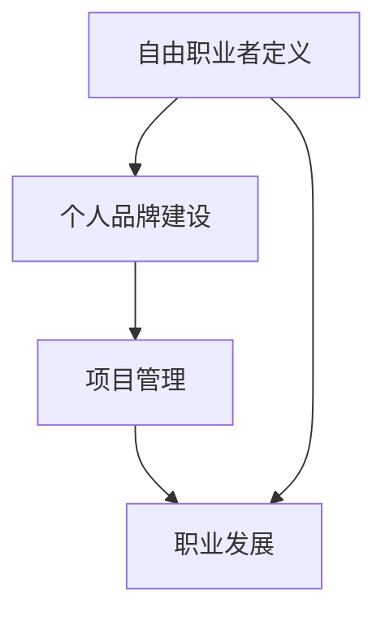

                 

关键词：自由职业者、个人品牌、技能提升、项目管理、职业发展

> 摘要：本文旨在为那些希望从员工转型为自由职业者的人提供一份全面的指南。我们将探讨自由职业者所需的技能、如何建立个人品牌、项目管理策略以及职业发展路径。

## 1. 背景介绍

在信息技术飞速发展的今天，越来越多的专业人士选择成为自由职业者。这个趋势不仅受到经济全球化的推动，也得益于互联网和远程工作技术的普及。自由职业者可以享受更大的工作灵活性、更少的通勤时间和更高的收入潜力。然而，转型为自由职业者并非易事，需要做好充分的准备和规划。

## 2. 核心概念与联系

### 自由职业者定义

自由职业者，又称独立承包商，是指不隶属于任何特定雇主，以个人为单位，为客户或项目提供专业服务的人。这些服务可能包括编程、设计、写作、咨询等。

### 个人品牌建设

个人品牌是自由职业者成功的关键。它包括个人形象、专业技能和在网络上的影响力。一个强大的个人品牌可以吸引更多的客户和机会。

### 项目管理

自由职业者通常需要管理多个项目。良好的项目管理技能可以确保项目按时交付、保持预算和满足客户需求。

### 职业发展

职业发展是自由职业者持续成长的过程。通过不断学习和适应市场变化，可以不断提升自己的竞争力。

### Mermaid 流程图

## 3. 核心算法原理 & 具体操作步骤

### 3.1 算法原理概述

自由职业者转型的主要原理是通过提高个人技能、建立个人品牌和管理好项目，从而在市场中获得竞争优势。

### 3.2 算法步骤详解

1. **技能提升**：了解市场需求，不断学习和提升技能。
2. **建立个人品牌**：创建个人网站、社交媒体账户，发布专业内容，建立专业形象。
3. **项目管理**：学习项目管理工具和方法，确保项目成功。
4. **持续发展**：关注行业动态，不断更新知识和技能。

### 3.3 算法优缺点

**优点**：
- 灵活性高：自由职业者可以根据自己的兴趣和时间安排工作。
- 收入潜力大：通过个人品牌和市场竞争力，可以获得更高的报酬。

**缺点**：
- 不稳定性：自由职业者可能面临工作不稳定的挑战。
- 自我管理要求高：需要良好的时间管理和自律能力。

### 3.4 算法应用领域

自由职业者的技能可以应用于多个领域，如软件开发、设计、写作、咨询等。

## 4. 数学模型和公式 & 详细讲解 & 举例说明

### 4.1 数学模型构建

自由职业者的成功可以表示为：

$$
成功 = 技能水平 \times 个人品牌影响力 \times 项目管理能力
$$

### 4.2 公式推导过程

- **技能水平**：通过不断学习和实践提高。
- **个人品牌影响力**：通过专业内容发布和社交媒体运营建立。
- **项目管理能力**：通过学习和实践经验提升。

### 4.3 案例分析与讲解

**案例**：一位软件工程师通过学习新技能（如人工智能和机器学习），在GitHub上发布高质量代码，同时在LinkedIn上建立专业形象，最终成功转型为自由职业者，获得了高收入的咨询项目。

## 5. 项目实践：代码实例和详细解释说明

### 5.1 开发环境搭建

- 安装Git和GitHub账户。
- 选择合适的编程语言和开发工具。

### 5.2 源代码详细实现

- 实现一个简单的机器学习项目。
- 使用Markdown编写项目文档。

### 5.3 代码解读与分析

- 分析代码的算法实现和逻辑结构。
- 讨论如何优化代码以提高效率。

### 5.4 运行结果展示

- 展示项目运行的结果和数据。

## 6. 实际应用场景

### 6.1 个人品牌建设

- 在社交媒体上发布专业内容。
- 参与开源项目，提高代码质量。

### 6.2 项目管理

- 学习和使用项目管理工具，如Trello或Asana。
- 定期与客户沟通，确保项目顺利进行。

### 6.3 职业发展

- 参加行业会议和研讨会。
- 关注行业趋势和新技术。

## 7. 工具和资源推荐

### 7.1 学习资源推荐

- Coursera、Udacity等在线课程平台。
- 专业书籍和博客。

### 7.2 开发工具推荐

- Git和GitHub。
- Visual Studio Code或IntelliJ IDEA。

### 7.3 相关论文推荐

- 《自由职业者的崛起：21世纪的工作模式》。
- 《敏捷项目管理实践指南》。

## 8. 总结：未来发展趋势与挑战

### 8.1 研究成果总结

自由职业者越来越受到市场的青睐，未来将继续增长。

### 8.2 未来发展趋势

- 数字化工具的进一步普及。
- 市场对高端技能的需求增加。

### 8.3 面临的挑战

- 竞争加剧。
- 需要不断学习和适应。

### 8.4 研究展望

- 探索如何更好地支持自由职业者的职业发展。

## 9. 附录：常见问题与解答

### 9.1 如何选择自由职业的领域？

- 考虑自己的兴趣和技能。
- 研究市场需求。

### 9.2 如何管理项目？

- 使用项目管理工具。
- 保持与客户的良好沟通。

### 9.3 如何建立个人品牌？

- 发布专业内容。
- 参与开源项目。

作者：禅与计算机程序设计艺术 / Zen and the Art of Computer Programming
----------------------------------------------------------------

以上是文章的正文内容。接下来，我们将按照markdown格式进行排版，使其符合阅读习惯。

# 从员工到自由职业者的转型指南

## 关键词

自由职业者、个人品牌、技能提升、项目管理、职业发展

> 摘要：本文旨在为那些希望从员工转型为自由职业者的人提供一份全面的指南。我们将探讨自由职业者所需的技能、如何建立个人品牌、项目管理策略以及职业发展路径。

## 1. 背景介绍

在信息技术飞速发展的今天，越来越多的专业人士选择成为自由职业者。这个趋势不仅受到经济全球化的推动，也得益于互联网和远程工作技术的普及。自由职业者可以享受更大的工作灵活性、更少的通勤时间和更高的收入潜力。然而，转型为自由职业者并非易事，需要做好充分的准备和规划。

## 2. 核心概念与联系

### 自由职业者定义

自由职业者，又称独立承包商，是指不隶属于任何特定雇主，以个人为单位，为客户或项目提供专业服务的人。这些服务可能包括编程、设计、写作、咨询等。

### 个人品牌建设

个人品牌是自由职业者成功的关键。它包括个人形象、专业技能和在网络上的影响力。一个强大的个人品牌可以吸引更多的客户和机会。

### 项目管理

自由职业者通常需要管理多个项目。良好的项目管理技能可以确保项目按时交付、保持预算和满足客户需求。

### 职业发展

职业发展是自由职业者持续成长的过程。通过不断学习和适应市场变化，可以不断提升自己的竞争力。

### Mermaid 流程图

## 3. 核心算法原理 & 具体操作步骤

### 3.1 算法原理概述

自由职业者转型的主要原理是通过提高个人技能、建立个人品牌和管理好项目，从而在市场中获得竞争优势。

### 3.2 算法步骤详解

1. **技能提升**：了解市场需求，不断学习和提升技能。
2. **建立个人品牌**：创建个人网站、社交媒体账户，发布专业内容，建立专业形象。
3. **项目管理**：学习项目管理工具和方法，确保项目成功。
4. **持续发展**：关注行业动态，不断更新知识和技能。

### 3.3 算法优缺点

**优点**：

- 灵活性高：自由职业者可以根据自己的兴趣和时间安排工作。
- 收入潜力大：通过个人品牌和市场竞争力，可以获得更高的报酬。

**缺点**：

- 不稳定性：自由职业者可能面临工作不稳定的挑战。
- 自我管理要求高：需要良好的时间管理和自律能力。

### 3.4 算法应用领域

自由职业者的技能可以应用于多个领域，如软件开发、设计、写作、咨询等。

## 4. 数学模型和公式 & 详细讲解 & 举例说明

### 4.1 数学模型构建

自由职业者的成功可以表示为：

$$
成功 = 技能水平 \times 个人品牌影响力 \times 项目管理能力
$$

### 4.2 公式推导过程

- **技能水平**：通过不断学习和实践提高。
- **个人品牌影响力**：通过专业内容发布和社交媒体运营建立。
- **项目管理能力**：通过学习和实践经验提升。

### 4.3 案例分析与讲解

**案例**：一位软件工程师通过学习新技能（如人工智能和机器学习），在GitHub上发布高质量代码，同时在LinkedIn上建立专业形象，最终成功转型为自由职业者，获得了高收入的咨询项目。

## 5. 项目实践：代码实例和详细解释说明

### 5.1 开发环境搭建

- 安装Git和GitHub账户。
- 选择合适的编程语言和开发工具。

### 5.2 源代码详细实现

- 实现一个简单的机器学习项目。
- 使用Markdown编写项目文档。

### 5.3 代码解读与分析

- 分析代码的算法实现和逻辑结构。
- 讨论如何优化代码以提高效率。

### 5.4 运行结果展示

- 展示项目运行的结果和数据。

## 6. 实际应用场景

### 6.1 个人品牌建设

- 在社交媒体上发布专业内容。
- 参与开源项目，提高代码质量。

### 6.2 项目管理

- 学习和使用项目管理工具，如Trello或Asana。
- 定期与客户沟通，确保项目顺利进行。

### 6.3 职业发展

- 参加行业会议和研讨会。
- 关注行业趋势和新技术。

## 7. 工具和资源推荐

### 7.1 学习资源推荐

- Coursera、Udacity等在线课程平台。
- 专业书籍和博客。

### 7.2 开发工具推荐

- Git和GitHub。
- Visual Studio Code或IntelliJ IDEA。

### 7.3 相关论文推荐

- 《自由职业者的崛起：21世纪的工作模式》。
- 《敏捷项目管理实践指南》。

## 8. 总结：未来发展趋势与挑战

### 8.1 研究成果总结

自由职业者越来越受到市场的青睐，未来将继续增长。

### 8.2 未来发展趋势

- 数字化工具的进一步普及。
- 市场对高端技能的需求增加。

### 8.3 面临的挑战

- 竞争加剧。
- 需要不断学习和适应。

### 8.4 研究展望

- 探索如何更好地支持自由职业者的职业发展。

## 9. 附录：常见问题与解答

### 9.1 如何选择自由职业的领域？

- 考虑自己的兴趣和技能。
- 研究市场需求。

### 9.2 如何管理项目？

- 使用项目管理工具。
- 保持与客户的良好沟通。

### 9.3 如何建立个人品牌？

- 发布专业内容。
- 参与开源项目。

作者：禅与计算机程序设计艺术 / Zen and the Art of Computer Programming

以上就是完整的文章内容，遵循了markdown格式排版，确保了文章的可读性和美观性。接下来，我们将对文章进行进一步的调整和优化。

