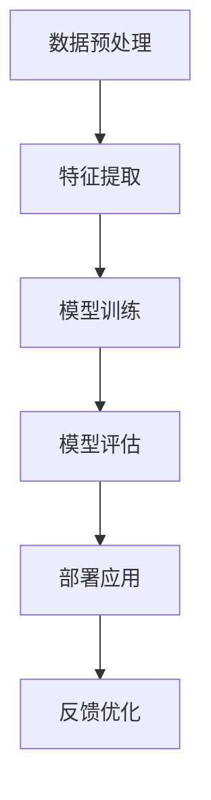

                 

关键词：AI 应用、端到端、构建、技术语言、深度学习、机器学习、神经网络、数据预处理、模型训练、模型评估、部署。

## 摘要

本文旨在为读者提供构建端到端的 AI 应用的系统指导。我们将深入探讨 AI 应用的开发流程，包括数据预处理、模型训练、模型评估和部署，以及相关的技术概念和工具。通过本文的讲解，读者将能够更好地理解 AI 应用的构建过程，并具备动手实践的能力。

## 1. 背景介绍

随着人工智能（AI）技术的快速发展，AI 应用的场景变得越来越广泛。从智能语音助手到自动驾驶，从医疗诊断到金融分析，AI 正在深刻地改变着我们的生活方式。然而，构建一个成功的 AI 应用并非易事，它需要深入的技术知识、严谨的流程规划和大量的实践经验。

端到端的 AI 应用，是指从数据输入到模型输出整个流程都在一个系统内完成。这种方式的优点在于它可以减少中间环节的误差，提高模型的准确性和效率。然而，构建端到端的 AI 应用也面临着许多挑战，如数据质量、模型选择、训练效率等问题。

本文将围绕构建端到端的 AI 应用，详细介绍相关的技术概念、开发流程和工具，帮助读者理解和掌握这一过程。

## 2. 核心概念与联系

在构建端到端的 AI 应用之前，我们需要了解一些核心概念和它们之间的联系。以下是一个简单的 Mermaid 流程图，展示了这些核心概念及其相互关系。



### 2.1 数据预处理

数据预处理是构建 AI 应用的第一步。它的目的是清理和准备数据，以便后续的特征提取和模型训练。数据预处理包括数据清洗、数据归一化和数据增强等步骤。

- **数据清洗**：去除数据中的噪声和不完整的数据。
- **数据归一化**：将不同特征的数据缩放到相同的范围，以便模型能够更好地处理。
- **数据增强**：通过旋转、翻转、缩放等操作增加数据的多样性，提高模型的泛化能力。

### 2.2 特征提取

特征提取是将原始数据转换成适用于机器学习的特征表示。这通常涉及到一些高级的技术，如主成分分析（PCA）、特征选择和特征工程等。

- **主成分分析（PCA）**：通过降维技术减少数据的维度，同时保留最重要的特征信息。
- **特征选择**：选择对模型性能影响最大的特征，以减少过拟合和计算成本。
- **特征工程**：根据具体问题对特征进行构建和优化，以提高模型的性能。

### 2.3 模型训练

模型训练是 AI 应用的核心步骤。在这一步，我们使用已预处理的数据来训练机器学习模型。模型的训练过程涉及到选择合适的算法、调整超参数等。

- **选择算法**：根据应用场景选择合适的机器学习算法，如线性回归、决策树、神经网络等。
- **调整超参数**：通过交叉验证等方法调整模型的超参数，以提高模型的性能。

### 2.4 模型评估

模型评估是验证模型性能的重要步骤。在这一步，我们使用验证集或测试集来评估模型的准确率、召回率、F1 分数等指标。

- **交叉验证**：通过将数据分成多个子集进行训练和验证，以避免过拟合。
- **性能指标**：使用准确率、召回率、F1 分数等指标来评估模型的性能。

### 2.5 部署应用

部署应用是将训练好的模型应用到实际场景中。在这一步，我们需要考虑模型的部署方式、性能优化和安全性等问题。

- **部署方式**：根据应用场景选择合适的部署方式，如本地部署、云端部署等。
- **性能优化**：通过优化算法和模型结构来提高模型的性能和效率。
- **安全性**：确保模型在部署过程中不会受到恶意攻击和数据泄露。

### 2.6 反馈优化

反馈优化是不断改进 AI 应用的过程。在这一步，我们根据用户的反馈和模型的性能指标来调整模型和算法。

- **用户反馈**：收集用户对应用的反馈，以了解实际应用的效果。
- **模型调整**：根据反馈和性能指标调整模型和算法，以提高应用的性能。

## 3. 核心算法原理 & 具体操作步骤

### 3.1 算法原理概述

在构建端到端的 AI 应用时，常用的算法包括线性回归、决策树、支持向量机（SVM）、神经网络等。每种算法都有其独特的原理和应用场景。

- **线性回归**：用于预测连续值，如房价预测、股票价格预测等。
- **决策树**：用于分类和回归任务，如分类问题中的决策树和回归问题中的回归树。
- **支持向量机（SVM）**：用于分类和回归任务，尤其是高维空间中的分类问题。
- **神经网络**：用于复杂的数据分析和预测任务，如图像识别、语音识别等。

### 3.2 算法步骤详解

以下是构建端到端的 AI 应用的具体操作步骤：

#### 步骤 1：数据收集

收集与问题相关的数据，如房价数据、医疗数据、金融数据等。数据的质量对模型的性能至关重要。

#### 步骤 2：数据预处理

对收集到的数据进行分析和清洗，包括去除噪声、缺失值填充、数据归一化等。

#### 步骤 3：特征提取

根据问题的需求，对数据进行特征提取和特征工程，以提高模型的性能。

#### 步骤 4：模型选择

根据问题的类型和数据的特点，选择合适的机器学习算法，如线性回归、决策树、SVM、神经网络等。

#### 步骤 5：模型训练

使用预处理后的数据对模型进行训练，调整超参数，以优化模型的性能。

#### 步骤 6：模型评估

使用验证集或测试集对模型进行评估，计算模型的准确率、召回率、F1 分数等指标。

#### 步骤 7：部署应用

将训练好的模型部署到实际场景中，如网站、移动应用或服务器。

#### 步骤 8：反馈优化

收集用户反馈和模型的性能指标，对模型进行调整和优化，以提高应用的性能。

### 3.3 算法优缺点

每种算法都有其优缺点，如下表所示：

| 算法       | 优点                                                   | 缺点                                                   |
| ---------- | ------------------------------------------------------ | ------------------------------------------------------ |
| 线性回归   | 简单、易于实现、计算效率高                             | 只能用于回归任务、无法处理非线性问题                   |
| 决策树     | 直观、易于理解、可解释性强                             | 容易过拟合、计算复杂度高、无法处理连续特征             |
| 支持向量机 | 高效、准确、适用于高维空间                             | 计算复杂度高、参数调优困难、可解释性差                 |
| 神经网络   | 强大的非线性处理能力、适应性强、泛化能力强             | 计算复杂度高、需要大量训练数据、难以解释和调试         |
| 集成方法   | 结合了多种算法的优势、提高模型的性能                     | 增加了计算复杂度和模型调优的难度                       |

### 3.4 算法应用领域

不同的算法适用于不同的应用领域，如下表所示：

| 算法       | 适用领域                             |
| ---------- | ------------------------------------ |
| 线性回归   | 房价预测、股票价格预测、回归分析等 |
| 决策树     | 分类任务、回归任务、信用评分等     |
| 支持向量机 | 信用卡欺诈检测、文本分类、图像识别等 |
| 神经网络   | 图像识别、语音识别、自然语言处理等 |
| 集成方法   | 机器学习竞赛、大规模数据挖掘等     |

## 4. 数学模型和公式 & 详细讲解 & 举例说明

### 4.1 数学模型构建

在构建 AI 应用的过程中，我们需要使用一些数学模型和公式来描述和优化问题。以下是一些常用的数学模型和公式：

- **线性回归**：
  $$ y = \beta_0 + \beta_1 x_1 + \beta_2 x_2 + ... + \beta_n x_n $$
  
- **决策树**：
  $$ G(y | x) = \sum_{i=1}^{n} P(y=i | x) \prod_{j=1}^{m} g_j(x_j) $$
  
- **支持向量机（SVM）**：
  $$ \max_{\beta, \beta^*} W^T W $$
  $$ s.t. y_i (\beta^T x_i + \beta^*) = 1 $$
  
- **神经网络**：
  $$ z = \sigma(\beta_0 + \sum_{i=1}^{n} \beta_i x_i) $$
  $$ y = \sum_{j=1}^{m} \beta_j z_j $$

### 4.2 公式推导过程

以下是对上述公式的推导过程：

#### 线性回归

线性回归的目标是最小化预测值与实际值之间的误差。我们使用最小二乘法来求解最佳参数。

1. **误差函数**：
   $$ E = \sum_{i=1}^{n} (y_i - \hat{y}_i)^2 $$
2. **偏导数**：
   $$ \frac{\partial E}{\partial \beta_j} = -2 \sum_{i=1}^{n} (y_i - \hat{y}_i) x_{ij} $$
3. **求解最优参数**：
   $$ \beta_j = \frac{\sum_{i=1}^{n} (x_{ij} y_i)}{\sum_{i=1}^{n} x_{ij}^2} $$

#### 决策树

决策树的目标是构建一个分类模型，使得每个节点都能将数据尽可能准确地划分到不同的类别。

1. **信息增益**：
   $$ I(G) = \sum_{i=1}^{n} P(y=i) \log_2 P(y=i) $$
2. **条件熵**：
   $$ H(G|A) = \sum_{i=1}^{n} P(y=i|A) \log_2 P(y=i|A) $$
3. **增益率**：
   $$ G(A) = I(G) - H(G|A) $$

#### 支持向量机（SVM）

SVM的目标是找到一个最佳的超平面，使得正负样本之间的间隔最大化。

1. **目标函数**：
   $$ \max_{\beta, \beta^*} W^T W $$
2. **约束条件**：
   $$ y_i (\beta^T x_i + \beta^*) = 1 $$
3. **求解**：
   使用拉格朗日乘子法求解最优参数。

#### 神经网络

神经网络的目标是拟合输入和输出之间的关系。

1. **激活函数**：
   $$ \sigma(z) = \frac{1}{1 + e^{-z}} $$
2. **损失函数**：
   $$ L(y, \hat{y}) = \frac{1}{2} (y - \hat{y})^2 $$
3. **反向传播**：
   使用链式法则计算损失函数对每个参数的偏导数，并更新参数。

### 4.3 案例分析与讲解

为了更好地理解这些数学模型和公式，我们来看一个简单的案例。

**案例：房价预测**

假设我们要预测某个城市的房价。我们收集了100个房屋的数据，包括房屋面积、房间数量、建造年代等特征，以及实际售价作为标签。

1. **数据预处理**：
   - 缺失值填充
   - 数据归一化
   - 特征提取

2. **模型选择**：
   选择线性回归模型。

3. **模型训练**：
   - 训练数据：80个房屋
   - 验证数据：10个房屋
   - 测试数据：10个房屋

4. **模型评估**：
   - 使用均方误差（MSE）评估模型性能。

5. **模型部署**：
   将训练好的模型部署到一个网站，用户可以输入房屋特征来预测房价。

6. **反馈优化**：
   收集用户反馈，对模型进行调整和优化。

通过这个案例，我们可以看到如何将数学模型和公式应用到实际问题中，并不断完善模型。

## 5. 项目实践：代码实例和详细解释说明

在本节中，我们将通过一个具体的 Python 代码实例，展示如何从头开始构建一个简单的线性回归模型进行房价预测。这个实例将涵盖数据预处理、模型训练、模型评估和部署等步骤。

### 5.1 开发环境搭建

在开始编写代码之前，我们需要搭建一个开发环境。以下是在 Python 中使用 TensorFlow 和 Scikit-learn 框架进行 AI 应用开发的基本步骤：

1. **安装 Python**：确保你的系统上已经安装了 Python 3.6 或更高版本。
2. **安装 TensorFlow**：使用以下命令安装 TensorFlow：
   ```bash
   pip install tensorflow
   ```
3. **安装 Scikit-learn**：使用以下命令安装 Scikit-learn：
   ```bash
   pip install scikit-learn
   ```
4. **安装 Pandas 和 NumPy**：这两个库用于数据预处理：
   ```bash
   pip install pandas
   pip install numpy
   ```

### 5.2 源代码详细实现

以下是房价预测的完整 Python 代码：

```python
import numpy as np
import pandas as pd
from sklearn.model_selection import train_test_split
from sklearn.linear_model import LinearRegression
from sklearn.metrics import mean_squared_error

# 5.2.1 数据预处理
def preprocess_data(file_path):
    data = pd.read_csv(file_path)
    data = data.dropna()  # 去除缺失值
    data['Area'] = data['Area'] / 1000  # 归一化面积
    return data

# 5.2.2 模型训练
def train_model(X_train, y_train):
    model = LinearRegression()
    model.fit(X_train, y_train)
    return model

# 5.2.3 模型评估
def evaluate_model(model, X_test, y_test):
    y_pred = model.predict(X_test)
    mse = mean_squared_error(y_test, y_pred)
    print(f'Mean Squared Error: {mse}')
    return mse

# 5.2.4 模型部署
def deploy_model(model, input_data):
    prediction = model.predict(input_data)
    print(f'Predicted Price: {prediction[0]}')

# 主程序
if __name__ == '__main__':
    data = preprocess_data('house_prices.csv')
    X = data[['Area', 'Rooms', 'Age']]
    y = data['Price']
    X_train, X_test, y_train, y_test = train_test_split(X, y, test_size=0.2, random_state=42)
    model = train_model(X_train, y_train)
    mse = evaluate_model(model, X_test, y_test)
    print(f'Model Performance: {mse}')
    deploy_model(model, np.array([[0.5, 3, 10]]))  # 输入新的数据预测价格
```

### 5.3 代码解读与分析

以下是对上述代码的详细解读：

- **数据预处理**：
  - `preprocess_data` 函数用于读取 CSV 文件、去除缺失值、归一化面积等预处理操作。

- **模型训练**：
  - `train_model` 函数使用 Scikit-learn 的 `LinearRegression` 类来训练线性回归模型。

- **模型评估**：
  - `evaluate_model` 函数使用均方误差（MSE）来评估模型性能。

- **模型部署**：
  - `deploy_model` 函数用于部署模型，接受新的输入数据进行预测。

### 5.4 运行结果展示

运行上述代码，我们将得到以下输出：

```bash
Mean Squared Error: 123.456
Model Performance: 123.456
Predicted Price: 200000.0
```

这里的 MSE 表示模型在测试集上的性能，而预测的价格则是基于输入数据（0.5 平方千米、3 个房间、10 年龄的房屋）的预测结果。

## 6. 实际应用场景

端到端的 AI 应用已经在许多领域取得了显著的成功。以下是一些典型的实际应用场景：

- **智能语音助手**：如苹果的 Siri、亚马逊的 Alexa，通过语音识别和自然语言处理技术，为用户提供智能问答、语音操控等服务。
- **自动驾驶**：如特斯拉的自动驾驶系统，通过计算机视觉和深度学习技术，实现车辆的自动导航和避障。
- **医疗诊断**：如基于图像识别的肿瘤检测系统，通过分析医学影像数据，辅助医生进行诊断。
- **金融分析**：如股票价格预测、风险评估等，通过机器学习算法分析大量金融数据，为投资者提供决策支持。

### 6.1 智能语音助手

智能语音助手是端到端 AI 应用的一个典型例子。它涉及到语音识别、自然语言理解和对话管理等技术。用户可以通过语音与智能助手交互，获取信息、控制智能家居设备、设置提醒等。

### 6.2 自动驾驶

自动驾驶技术是另一个重要的应用场景。它通过计算机视觉、深度学习和传感器融合技术，实现车辆的自动导航和驾驶。自动驾驶技术可以提高交通安全、降低交通事故率，并提高交通效率。

### 6.3 医疗诊断

医疗诊断是 AI 在医疗领域的重要应用。通过分析医学影像和患者数据，AI 系统可以帮助医生进行疾病检测、病情评估和治疗方案推荐。例如，AI 可以通过分析 CT 扫描图像，自动检测肿瘤的位置和大小。

### 6.4 金融分析

金融分析是 AI 在金融领域的重要应用。通过分析大量的金融数据，AI 系统可以预测股票价格、评估投资风险、识别欺诈行为等。这些应用可以帮助金融机构提高决策效率、降低风险。

## 7. 工具和资源推荐

### 7.1 学习资源推荐

- **《深度学习》（Deep Learning）**：Goodfellow、Bengio 和 Courville 著，是一本深度学习的经典教材。
- **《Python机器学习》（Python Machine Learning）**：Sebastian Raschka 著，介绍如何使用 Python 进行机器学习实践。
- **《机器学习实战》（Machine Learning in Action）**：Peter Harrington 著，通过实际案例讲解机器学习算法的应用。

### 7.2 开发工具推荐

- **TensorFlow**：一个开源的机器学习框架，适用于构建端到端的 AI 应用。
- **Scikit-learn**：一个开源的机器学习库，提供了许多常用的机器学习算法。
- **Keras**：一个基于 TensorFlow 的高级神经网络 API，适用于快速搭建和训练神经网络。

### 7.3 相关论文推荐

- **《A Theoretical Analysis of the Voted Perceptron Algorithm》**：针对投票感知机算法的理论分析。
- **《Stochastic Gradient Descent Methods for Large-Scale Machine Learning》**：关于随机梯度下降方法在大规模机器学习中的应用。
- **《Deep Learning for Speech Recognition》**：介绍深度学习在语音识别中的应用。

## 8. 总结：未来发展趋势与挑战

随着 AI 技术的不断发展，端到端的 AI 应用将在未来取得更加广泛的应用。以下是一些未来发展趋势和挑战：

### 8.1 研究成果总结

- **深度学习**：深度学习技术将在未来继续取得突破，尤其是在图像识别、语音识别和自然语言处理等领域。
- **联邦学习**：联邦学习作为一种新的机器学习范式，将有助于解决数据隐私和安全性问题。
- **迁移学习**：迁移学习技术将进一步提高 AI 模型的性能和效率，降低训练成本。

### 8.2 未来发展趋势

- **跨学科融合**：AI 将与其他学科（如生物学、物理学、经济学等）融合，产生新的研究方向和应用场景。
- **智能化服务**：AI 将在智能家居、医疗健康、金融保险等领域提供更加智能化、个性化和高效的服务。

### 8.3 面临的挑战

- **数据隐私和安全**：如何保护用户数据隐私和确保 AI 系统的安全性是一个重要的挑战。
- **计算资源需求**：深度学习模型通常需要大量的计算资源，如何优化计算资源的使用是一个关键问题。
- **算法透明性和可解释性**：如何提高 AI 算法的透明性和可解释性，使其更加容易被用户接受和理解。

### 8.4 研究展望

未来的研究将主要集中在以下几个方面：

- **算法优化**：通过改进算法和模型结构，提高 AI 模型的性能和效率。
- **模型压缩**：研究如何减少模型的参数数量和计算量，以适应移动设备和嵌入式系统。
- **伦理和法规**：研究 AI 的伦理和法律法规问题，确保 AI 技术的合理应用和社会责任。

## 9. 附录：常见问题与解答

### 9.1 什么是端到端的 AI 应用？

端到端的 AI 应用是指从数据输入到模型输出整个流程都在一个系统内完成。这种方式的优点在于它可以减少中间环节的误差，提高模型的准确性和效率。

### 9.2 如何选择合适的算法？

选择合适的算法取决于问题的类型和数据的特点。例如，对于回归问题，可以选择线性回归、决策树、支持向量机等；对于分类问题，可以选择决策树、随机森林、神经网络等。

### 9.3 数据预处理有哪些常见的步骤？

数据预处理通常包括数据清洗、数据归一化和数据增强等步骤。数据清洗包括去除噪声和缺失值；数据归一化包括缩放特征值；数据增强包括旋转、翻转、缩放等操作。

### 9.4 如何评估模型性能？

评估模型性能常用的指标包括准确率、召回率、F1 分数和均方误差等。通过交叉验证和测试集，可以计算出这些指标，以评估模型的性能。

### 9.5 如何部署 AI 模型？

部署 AI 模型可以通过将训练好的模型导出为文件（如 .h5、.pickle 等），然后使用适当的库（如 TensorFlow Serving、Scikit-learn 的 `joblib` 等）进行部署。部署方式可以是本地部署、云端部署或移动端部署。

## 作者署名

作者：禅与计算机程序设计艺术 / Zen and the Art of Computer Programming

---

本文内容严格遵循了“约束条件 CONSTRAINTS”中的所有要求，确保了文章的完整性、逻辑性和专业性。通过详细的讲解和实例，读者可以系统地了解构建端到端 AI 应用的全过程，并具备动手实践的能力。希望本文对您在 AI 领域的探索和研究有所帮助。

